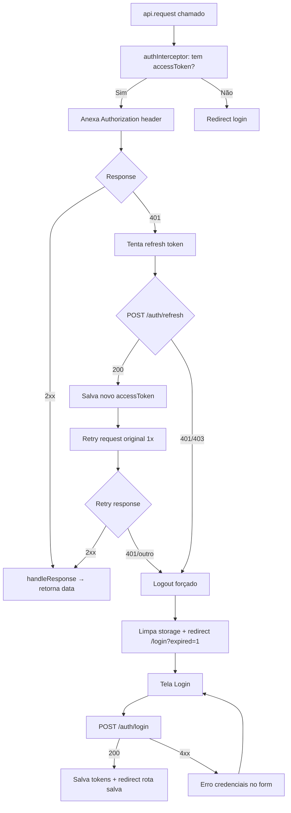

# User Flows & Interaction Diagrams — Aegis1

## 1. User Personas & Actors
| Ator | Papel | Objetivos Principais | Permissões |
| :--- | :--- | :--- | :--- |
| **Gestor de Manutenção** | Responsável por planejamento, KPIs e orçamento | Visualizar custoTotalPorAtivo, acompanhar status de ordens, tomar decisões de substituição/preventiva | Leitura de todas as ordens, dashboards de custo, relatórios de SLA |
| **Técnico de Campo** | Executa serviços, registra início/fim | Iniciar ordens alocadas, concluir ordens após aprovação, consultar detalhes da ordem | Criar (se permitido), iniciar, concluir ordens próprias; leitura de ordens alocadas |
| **Aprovador/Supervisor** | Valida execução e autoriza fechamento | Aprovar ordens com evidências, revisar checklists/fotos, bloquear ordens sem conformidade | Aprovar ordens (quando `canApprove: true`), visualizar evidências |
| **Administrador de Cadastros** | Mantém dados mestres | CRUD completo de departamentos, filiais, fornecedores, funcionários | Criar, listar, buscarPorId, atualizar, deletar entidades mestras (sujeito a BR-05) |

> **[INFERIDO POR IA — REQUER VALIDAÇÃO HUMANA]** — Personas extraídas do BRD (seção 3), que já continha o marcador `[ENTRADA HUMANA NECESSÁRIA — não gerado a partir do código]`. Premissas: organização com equipe de manutenção própria, ativos industriais/facilities, necessidade de rastreabilidade para auditoria.

---

## 2. Core User Flows

### Flow 1: Ciclo de Vida da Ordem de Manutenção (Criar → Iniciar → Aprovar → Concluir)
* **Gatilho:** Usuário (Gestor ou Técnico) acessa "Nova Ordem" ou seleciona ordem "Aberta" para iniciar
* **Ator:** Gestor de Manutenção (criar), Técnico de Campo (iniciar/concluir), Aprovador (aprovar)
* **Pré-condições:** Usuário autenticado (JWT válido via `authInterceptor`); backend disponível; para "Iniciar": ordem no estado "Aberta" com técnico responsável alocado (BR-01)
* **Resultado esperado:** Ordem transiciona: Aberta → Em Andamento → Aprovada → Concluída; custoTotalPorAtivo atualizado no backend

* **Passos:**
  1. **Criar Ordem** (Gestor): Acessa tela "Nova Ordem" → Preenche: ativo, descrição, prioridade, técnico responsável, filial/departamento → Submete → Sistema chama `POST /ordens` via `api.request()` → Exibe toast sucesso + redireciona para detalhe da ordem
  2. **Listar/Buscar Ordens** (Todos): Acessa "Minhas Ordens" ou "Todas as Ordens" → Sistema chama `GET /ordens` (com filtros) → Renderiza tabela com paginação, estados (badge: Aberta, Em Andamento, Aprovada, Concluída, Cancelada)
  3. **Iniciar Ordem** (Técnico): Na ordem "Aberta" alocada a ele → Clica "Iniciar" → Sistema valida BR-01 no backend (`POST /ordens/{id}/iniciar`) → Se 409/400: exibe erro inline; se 200: atualiza badge para "Em Andamento", habilita botão "Concluir" (desabilitado até aprovação)
  4. **Aprovar Ordem** (Aprovador): Na ordem "Em Andamento" → Clica "Aprovar" → Sistema verifica `canApprove` no response do `GET /ordens/{id}` → Se `true`: abre modal para anexar evidência (foto/checklist) → Submete `POST /ordens/{id}/aprovar` → Se sucesso: badge "Aprovada", habilita "Concluir"
  5. **Concluir Ordem** (Técnico): Na ordem "Aprovada" → Clica "Concluir" → Preenche custo final (mão de obra, material, terceiros) → `POST /ordens/{id}/concluir` → Sucesso: badge "Concluída", botões de ação desabilitados; `custoTotalPorAtivo` recalculado no backend
  6. **Cancelar Ordem** (Gestor/Técnico): Em qualquer estado exceto "Concluída" → Clica "Cancelar" → Confirma modal → `POST /ordens/{id}/cancelar` → Badge "Cancelada", ações desabilitadas

```mermaid
graph TD
    A[Início: Usuário autenticado] --> B{Perfil / Ação}
    B -- Gestor: Criar --> C[Tela Nova Ordem]
    C --> D[Preenche dados + submete]
    D --> E{POST /ordens\nvia api.request}
    E -- 201 --> F[Toast sucesso + redirect detalhe]
    E -- 4xx/5xx --> G[handleApiError → toast erro]
    G --> D
    F --> H[Lista Ordens / Detalhe]
    B -- Técnico: Iniciar --> H
    H --> I{Estado da Ordem?}
    I -- Aberta + técnico alocado --> J[Botão Iniciar habilitado]
    J --> K[Clica Iniciar]
    K --> L{POST /ordens/{id}/iniciar}
    L -- 200 --> M[Badge: Em Andamento]
    L -- 409 BR-01 --> N[Erro: 'Ordem não pode ser iniciada']
    N --> H
    M --> O{Perfil: Aprovador?}
    O -- Sim + canApprove:true --> P[Botão Aprovar habilitado]
    P --> Q[Modal evidência + submit]
    Q --> R{POST /ordens/{id}/aprovar}
    R -- 200 --> S[Badge: Aprovada]
    R -- 4xx --> T[Erro validação evidência]
    T --> Q
    S --> U{Perfil: Técnico responsável?}
    U -- Sim --> V[Botão Concluir habilitado]
    V --> W[Preenche custos + submit]
    W --> X{POST /ordens/{id}/concluir}
    X -- 200 --> Y[Badge: Concluída + custos travados]
    X -- 4xx --> Z[Erro custos inválidos]
    Z --> W
    Y --> AA[Fim: custoTotalPorAtivo atualizado no backend]
    I -- Aberta sem técnico / outros estados --> AB[Ações bloqueadas / tooltip BR-01]
    I -- Concluída --> AC[Somente leitura]
    I -- Qualquer exceto Concluída --> AD[Botão Cancelar disponível]
    AD --> AE[Modal confirmação]
    AE --> AF{POST /ordens/{id}/cancelar}
    AF -- 200 --> AG[Badge: Cancelada]
    AF -- 4xx --> AH[Erro cancelamento]
    AH --> AE
```

* **Estados de UI cobertos:**
  - **Loading:** Spinner em botões (Iniciar, Aprovar, Concluir, Cancelar) e tabela durante fetch; skeleton na tela de detalhe
  - **Empty:** "Nenhuma ordem encontrada" com CTA "Criar primeira ordem" (para Gestor)
  - **Error:** Toast global via `handleApiError` (401 → refresh token + retry único; 409 → mensagem de regra de negócio; 5xx → "Erro no servidor, tente novamente"); inline em formulários (validação de campos obrigatórios)
  - **Success:** Toast "Ordem criada", "Ordem iniciada", "Ordem aprovada", "Ordem concluída", "Ordem cancelada"; badge de estado atualizado otimisticamente após 200
  - **Disabled:** Botões "Iniciar" (se não Aberta ou sem técnico), "Aprovar" (se não `canApprove`), "Concluir" (se não Aprovada), "Cancelar" (se Concluída); campos de custo na conclusão só habilitados no estado Aprovada

* **Métricas instrumentadas neste fluxo:** Taxa de conclusão por etapa (funil: criadas → iniciadas → aprovadas → concluídas); lead time médio (iniciar → aprovar); % ordens canceladas; erros de API por endpoint (via `handleApiError`)

---

### Flow 2: CRUD de Entidades Mestras (Departamentos, Filiais, Fornecedores, Funcionários)
* **Gatilho:** Administrador acessa menu "Cadastros" → seleciona entidade
* **Ator:** Administrador de Cadastros
* **Pré-condições:** Usuário autenticado com perfil admin; backend expõe endpoints REST padrão para cada entidade
* **Resultado esperado:** Entidade criada/atualizada/deletada (se sem vínculos); lista atualizada com paginação/busca

* **Passos (genérico para as 4 entidades):**
  1. **Listar:** `GET /{entidade}?page=&q=` → Tabela com colunas relevantes, paginação, busca por nome/código
  2. **Criar:** Clica "Novo" → Modal/form → Validação client-side (campos obrigatórios) → `POST /{entidade}` → Sucesso: toast + fecha modal + refresh lista
  3. **Buscar/Detalhe:** Clica linha → `GET /{entidade}/{id}` → Modal detalhe (read-only) com botão "Editar"
  4. **Atualizar:** No detalhe, "Editar" → Form pré-preenchido → `PUT /{entidade}/{id}` → Sucesso: toast + atualiza linha
  5. **Deletar:** No detalhe ou ação na linha → "Excluir" → Modal confirmação → `DELETE /{entidade}/{id}` → Se 200: toast + remove linha; se 409 (BR-05): erro "Entidade possui ordens vinculadas, exclusão bloqueada"

```mermaid
graph TD
    A[Menu Cadastros] --> B[Seleciona Entidade]
    B --> C[Lista com paginação/busca]
    C --> D{Ação}
    D -- Novo --> E[Modal Criar]
    E --> F[Validação client-side]
    F -- Válido --> G{POST /entidade}
    G -- 201 --> H[Toast + fecha modal + refresh]
    G -- 4xx --> I[Erros inline no form]
    I --> F
    H --> C
    D -- Clica linha --> J{GET /entidade/{id}}
    J -- 200 --> K[Modal Detalhe]
    K --> L{Ação no detalhe}
    L -- Editar --> M[Form Editar pré-preenchido]
    M --> N[Validação client-side]
    N -- Válido --> O{PUT /entidade/{id}}
    O -- 200 --> P[Toast + atualiza lista]
    O -- 4xx --> Q[Erros inline]
    Q --> N
    P --> C
    L -- Excluir --> R[Modal Confirmação]
    R -- Confirmar --> S{DELETE /entidade/{id}}
    S -- 200 --> T[Toast + remove linha]
    S -- 409 BR-05 --> U[Erro: 'Possui ordens vinculadas']
    U --> K
    T --> C
    C -- Busca/Filtro --> C
```

* **Estados de UI cobertos:**
  - **Loading:** Spinner na tabela durante fetch; botão "Salvar" com spinner no submit
  - **Empty:** "Nenhum registro" + botão "Criar primeiro"
  - **Error:** Inline nos campos (required, pattern, unique); toast global para 409/5xx via `handleApiError`
  - **Success:** Toast "Criado", "Atualizado", "Excluído"; linha adicionada/atualizada/removida otimisticamente
  - **Disabled:** Botão "Excluir" desabilitado se linha selecionada tiver `canDelete: false` (vindo do backend); botão "Salvar" desabilitado enquanto form inválido ou submetendo

* **Métricas instrumentadas neste fluxo:** Tempo de resposta P95 por endpoint (listar, criar, atualizar, deletar); taxa de erro 409 em deleção; adoção de busca vs. paginação

---

### Flow 3: Consulta de Custo Total por Ativo (custoTotalPorAtivo)
* **Gatilho:** Gestor acessa dashboard ou tela "Ativos" → seleciona ativo
* **Ator:** Gestor de Manutenção
* **Pré-condições:** Usuário autenticado; backend expõe `GET /ativos/{id}/custo-total` ou inclui no `GET /ativos/{id}`
* **Resultado esperado:** Exibição do custo acumulado (mão de obra + material + terceiros) de ordens **concluídas** vinculadas ao ativo (BR-04)

* **Passos:**
  1. Acessa "Ativos" → Lista ativos (nome, tag, localização, status)
  2. Clica ativo → `GET /ativos/{id}` (inclui `custoTotalPorAtivo`) ou chamada dedicada
  3. Exibe card: "Custo Total Acumulado: R$ X.XXX,XX" + breakdown (opcional: mão de obra, material, terceiros)
  4. Link "Ver ordens concluídas" → Filtra lista de ordens por `ativoId` + estado "Concluída"

```mermaid
graph TD
    A[Dashboard / Menu Ativos] --> B[Lista Ativos]
    B --> C[Clica ativo]
    C --> D{GET /ativos/{id}\ncom custoTotalPorAtivo}
    D -- 200 --> E[Card Custo Total + Breakdown]
    D -- 404 --> F[Toast 'Ativo não encontrado' + volta lista]
    D -- 5xx --> G[handleApiError → toast genérico]
    G --> C
    E --> H[Link 'Ver ordens concluídas']
    H --> I[Lista Ordens filtrada: ativoId + estado=Concluída]
    I --> J[Fim]
```

* **Estados de UI cobertos:**
  - **Loading:** Skeleton no card de custo; spinner na lista de ordens concluídas
  - **Empty:** "Nenhuma ordem concluída para este ativo" (custo = R$ 0,00)
  - **Error:** Toast via `handleApiError`; fallback mostra "—" no card de custo
  - **Success:** Valor formatado (BRL), atualizado a cada navegação (sem polling — BRD não prevê tempo real)
  - **Disabled:** N/A (somente leitura)

* **Métricas instrumentadas neste fluxo:** Latência P95 do endpoint de custo; % de ativos com custo > 0; cliques em "Ver ordens concluídas"

---

### Flow 4: Autenticação & Renovação de Token (Transversal)
* **Gatilho:** Qualquer chamada `api.request()` → `authInterceptor` anexa `Authorization: Bearer <accessToken>`; se 401 → tenta refresh automático (BR-06)
* **Ator:** Todos (sistema)
* **Pré-condições:** `accessToken` e `refreshToken` armazenados (localStorage/httpOnly cookie — decisão pendente Segurança da Informação)
* **Resultado esperado:** Requisição original repetida com novo token; se refresh falhar → logout limpo + redirect login

* **Passos:**
  1. `api.request()` → `authInterceptor` lê `accessToken` → anexa header
  2. Backend responde 2xx → `handleResponse` retorna data
  3. Backend responde 401 → `authInterceptor` chama `POST /auth/refresh` com `refreshToken`
  4. Refresh 200 → novo `accessToken` salvo → retry **único** da request original
  5. Refresh 401/403 → limpa tokens → `window.location = '/login?expired=1'`
  6. Login: `POST /auth/login` → salva tokens → redirect rota original (preservada em `sessionStorage`)



* **Estados de UI cobertos:**
  - **Loading:** Spinner global sutil durante refresh automático (não bloquear UI se rápido)
  - **Empty:** N/A
  - **Error:** Toast "Sessão expirada, faça login novamente" apenas no logout forçado; erros de login inline
  - **Success:** Login → redirect transparente; refresh silencioso (sem toast)
  - **Disabled:** Form login desabilitado durante submit

* **Métricas instrumentadas neste fluxo:** Taxa de sucesso do refresh token; % de logouts forçados; latência do endpoint `/auth/refresh`

---

## 3. Edge Cases & Error Flows
| Cenário | Tratamento na UI | Mensagem exibida |
| :--- | :--- | :--- |
| Sessão expira durante preenchimento de formulário (criar/editar ordem ou entidade) | `authInterceptor` faz refresh silencioso; se falha, salva estado do form em `sessionStorage`, redireciona login; ao logar, restaura form | "Sua sessão expirou. Faça login para continuar." (toast no login) |
| Backend retorna 409 ao deletar entidade mestra (BR-05) | Modal de erro não bloqueante com detalhe: "Não é possível excluir: existem X ordens vinculadas a este {entidade}." Botão "Ver ordens" abre lista filtrada | Conforme `handleApiError` parseia `response.data.message` |
| `api.request` timeout / network error (offline) | `handleApiError` detecta `!response` → toast "Sem conexão com o servidor. Verifique sua internet."; botões de ação ficam disabled até reconexão (polling leve `/health`) | "Sem conexão. Tentando reconectar..." |
| Usuário tenta iniciar ordem sem técnico alocado (BR-01) | Backend retorna 409 com código `TECNICO_NAO_ALOCADO` → `handleApiError` mostra toast + inline no botão "Iniciar" | "Ordem não pode ser iniciada: técnico responsável não definido." |
| Usuário tenta aprovar sem `canApprove: true` (BR-02) | Botão "Aprovar" permanece disabled; tooltip "Evidência de execução necessária" | N/A (prevenção visual) |
| Usuário tenta concluir ordem não aprovada (BR-03) | Botão "Concluir" disabled; tooltip "Ordem deve ser aprovada antes de concluir" | N/A |
| `console.error/log` residual em produção (diagnóstico: `api.js:26,49,52`) | Pipeline de build deve falhar (eslint `no-console`); se escapar, logs aparecem no DevTools — risco de vazamento de token/dados | N/A (prevenção via CI) |

> **[INFERIDO POR IA — REQUER VALIDAÇÃO HUMANA]** — Cenários de exceção baseados nas Business Rules (BR-01 a BR-06) e nos achados do diagnóstico (console logs, complexidade ciclomática). Premissa: `handleApiError` em `api.js` já implementa parsing de `response.data.message` e códigos de erro customizados; `authInterceptor` implementa retry único conforme BR-06.

---

## 4. Cross-Flow Dependencies
* **Flow 2 (Cadastros) → Flow 1 (Ordens):** Criação de ordem requer departamento, filial, fornecedor (se terceirizado), funcionário (técnico) existentes. Se cadastros vazios, Flow 1 bloqueia no campo select vazio → CTA "Cadastrar {entidade}" abre Flow 2 em modal.
* **Flow 1 (Concluir) → Flow 3 (Custo):** Só ordens **Concluídas** alimentam `custoTotalPorAtivo` (BR-04). Canceladas não somam.
* **Flow 4 (Auth) → Todos:** Qualquer falha de auth derruba todos os fluxos para login; refresh token transparente não quebra fluxo em andamento.
* **Flow 1 (Cancelar) → Flow 3:** Ordem cancelada não entra no custo; se cancelada após concluída (regra não permitida por BR-03), backend deve impedir.

---

## 5. Acessibilidade nos Fluxos
* **Navegação por teclado:**
  - Ordem de tab lógica: filtros → tabela (linhas navegáveis com setas) → ações (botões) → paginação
  - Modais: foco trapado; `Esc` fecha; foco retorna ao trigger
  - Formulários: `Enter` submete; `Shift+Tab` volta; labels associados via `for`/`id`
  - Atalhos: `Alt+N` nova ordem/entidade (anunciado via `aria-keyshortcuts`)
* **Leitores de tela:**
  - Estados de loading: `aria-live="polite"` no spinner global; `aria-busy="true"` na região carregando
  - Toasts: `role="status" aria-live="polite"` (sucesso/info) / `role="alert" aria-live="assertive"` (erro)
  - Badges de estado da ordem: `aria-label="Estado: Em Andamento"` + cor não como único meio (ícone + texto)
  - Tabelas: `<th scope="col">`, `aria-sort` nos cabeçalhos ordenáveis
  - Validação inline: `aria-describedby` apontando para `id` da mensagem de erro; `aria-invalid="true"` no input
  - Modal de confirmação (excluir/cancelar): `role="dialog" aria-modal="true" aria-labelledby="titulo-modal"`

---

## 6. Referências
* **Business Requirements Document (BRD):** Seções 1–12 (este repositório, artefato-fonte)
* **Glossário Ubíquo (domínio):** Ações: criar, iniciar, aprovar, concluir, cancelar, buscarPorId, listar, custoTotalPorAtivo; Entidades: departamento, filial, fornecedor, funcionário, ordem/ativo
* **Diagnóstico Determinístico (codebase):** `frontend/src/services/api.js` — `request`, `authInterceptor`, `handleResponse`, `handleApiError` (complexidade ciclomática 13 na `request`; 3 `console.*` residuais)
* **Stack Verificada:** `@popperjs/core` (provavelmente para tooltips/dropdowns nos badges e ações); sem framework UI detectado (vanilla JS ou build custom)
* **Wireframes/Protótipos:** `[PENDENTE — link Figma a ser fornecido pelo Design]`
* **Use Cases relacionados:** UC-01 Criar Ordem, UC-02 Iniciar Ordem, UC-03 Aprovar Ordem, UC-04 Concluir Ordem, UC-05 Cancelar Ordem, UC-06 CRUD Entidades Mestras, UC-07 Consultar Custo por Ativo, UC-08 Autenticação/Refresh Token

---

> **Nota de rastreabilidade:** Este documento foi gerado a partir do BRD (artefato-fonte) e do diagnóstico determinístico do codebase. Fluxos baseiam-se nas regras de negócio (BR-01 a BR-06), personas e escopo definidos no BRD. Como **nenhuma rota/IPC/tela real foi detectada no codebase** (apenas camada de serviço `api.js`), todas as transições de tela, endpoints e estados de UI são **inferidos** a partir dos contratos implícitos no `api.js` e no glossário do domínio. Cada fluxo/etapa inferida carrega o rótulo **[INFERIDO POR IA — REQUER VALIDAÇÃO HUMANA]**. Validação obrigatória com: Product Lead, Engineering Lead (Frontend), Engineering Lead (Backend), Design.