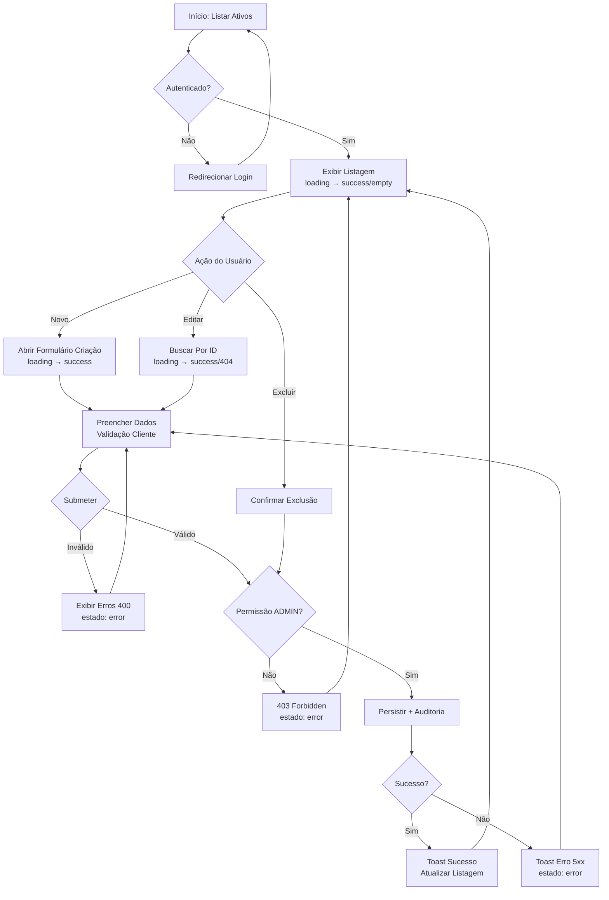
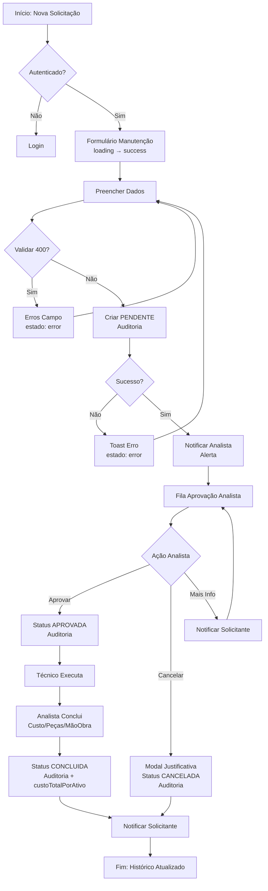
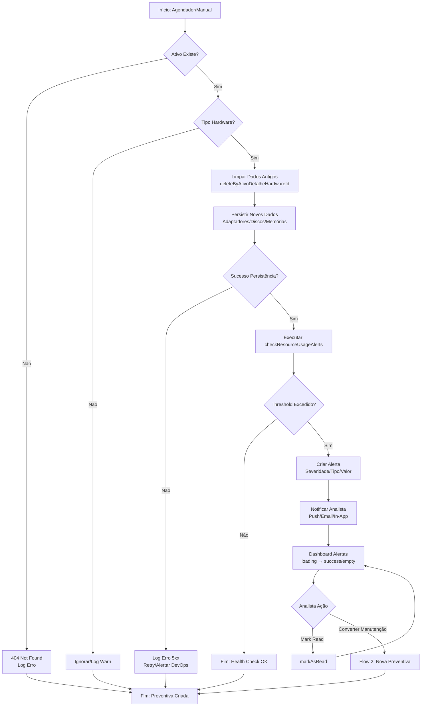
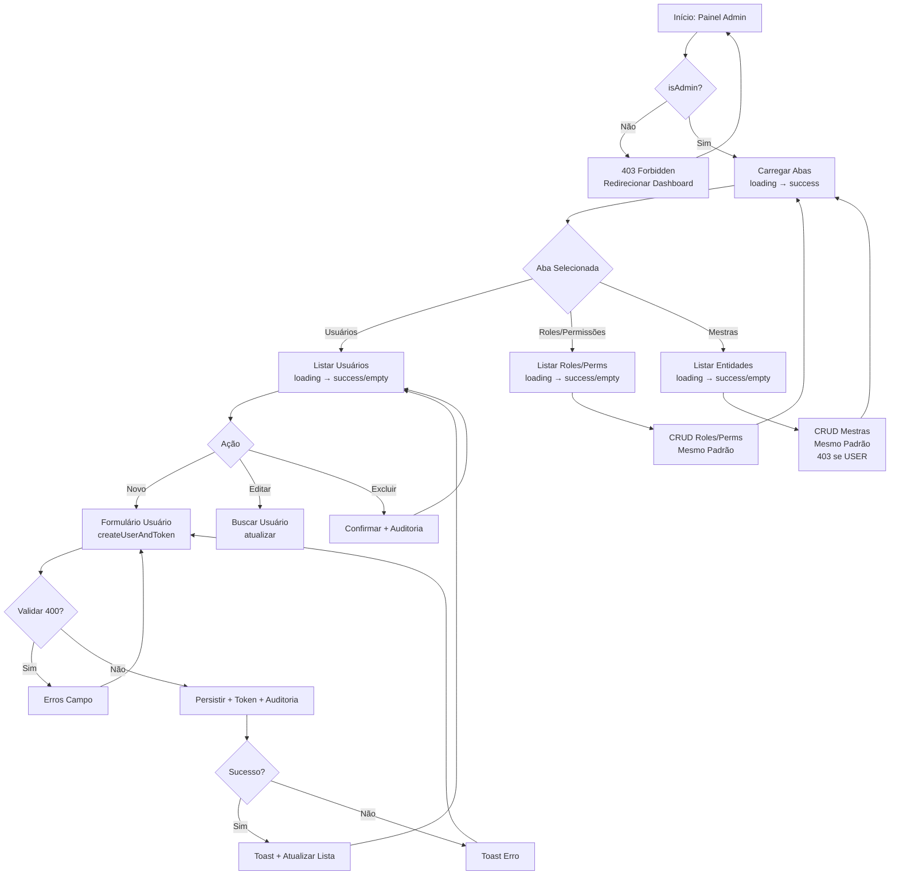
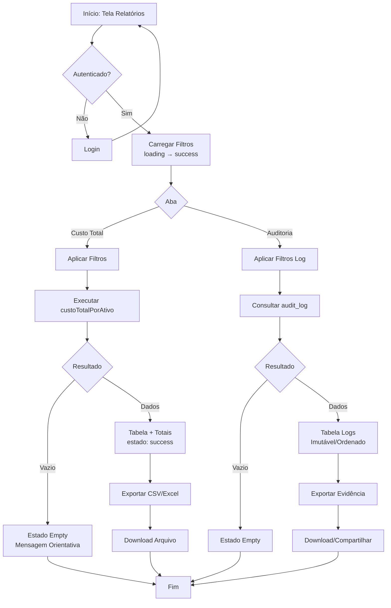
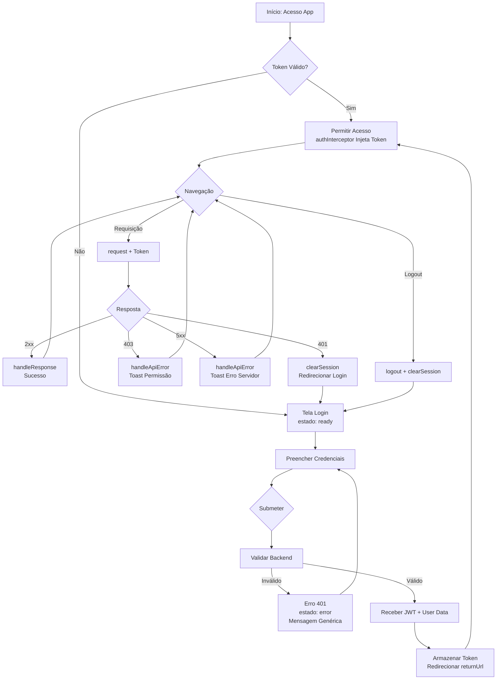

# User Flows & Interaction Diagrams — Aegis Patrimônio

## 1. User Personas & Actors
| Ator | Papel | Objetivos Principais | Permissões |
| :--- | :--- | :--- | :--- |
| **Gestor de Patrimônio** | Responsável pelo ciclo de vida dos ativos (aquisição, alocação, depreciação, baixa) across filiais | Visibilidade centralizada, relatórios de TCO, trilha de auditoria, conformidade | CRUD completo em Ativos, Tipos de Ativo, Localizações; leitura em Departamentos, Filiais, Fornecedores, Funcionários; relatórios `custoTotalPorAtivo`; exportação de dados |
| **Analista de Manutenção** | Planeja e executa manutenções preventivas/corretivas; aprova solicitações | Fluxo de aprovação rastreável, alertas preditivos (disco, memória, rede), histórico de saúde | CRUD em Manutenções (iniciar, aprovar, cancelar, concluir); leitura em Ativos, Alertas, Health Checks; `listarAlertas`, `getRecentAlerts`, `markAsRead`, `checkResourceUsageAlerts` |
| **Administrador de Sistema (Admin)** | Configura RBAC, cadastra tipos de ativo, departamentos, filiais, fornecedores, usuários | Controle granular de permissões, provisionamento de usuários | CRUD completo em Departamentos, Filiais, Fornecedores, Funcionários, Tipos de Ativo, Permissões, Roles, Usuários; `createUserAndToken`, `mockLogin`, `authInterceptor`, `clearSession`, `logout`, `hasPermission`, `isAdmin` |
| **Usuário Final (Funcionário)** | Solicita manutenção, reporta problemas, visualiza ativos sob sua responsabilidade | Portal simples para abrir chamados, acompanhar status, receber notificações | Leitura em Ativos (próprios), criação de solicitações de manutenção (`iniciar`), acompanhamento de status; `listarAlertas` (próprios) |
| **Auditor / Compliance** | Valida trilha de custódia, depreciação, baixas, acessos a dados sensíveis | Logs imutáveis de operações sensíveis com usuário/timestamp | Leitura em todos os relatórios e logs de auditoria (entidade futura `audit_log`); exportação de trilhas |

> **[INFERIDO POR IA — REQUER VALIDAÇÃO HUMANA]** — Personas e permissões inferidas a partir do glossário do BRD (30+ operações de domínio) e regras de negócio BR-01 a BR-10. Não há rotas/IPC detectadas no código para confirmar endpoints reais.

---

## 2. Core User Flows

### Flow 1: Cadastro e Gestão de Ativo (CRUD Completo)
* **Gatilho:** Gestor de Patrimônio acessa "Novo Ativo" ou edita ativo existente na listagem
* **Ator:** Gestor de Patrimônio (Admin para criar/atualizar/deletar; User apenas leitura)
* **Pré-condições:** Usuário autenticado com token válido (`authInterceptor`); papel `ADMIN` para escrita (BR-01)
* **Resultado esperado:** Ativo persistido com metadados completos (tipo, localização, departamento, filial, fornecedor, depreciação) e trilha de auditoria registrada

* **Passos:**
  1. Usuário acessa tela de listagem de ativos (`listarTodos`)
  2. Sistema exibe tabela paginada com filtros (filial, departamento, tipo, status) — **estado: loading → success/empty**
  3. Usuário clica "Novo Ativo" ou seleciona linha para editar (`buscarPorId`)
  4. Sistema abre formulário com campos: identificação, tipo (`createTipoAtivo`), localização (`createLocalizacao`), departamento, filial, fornecedor, data aquisição, valor, vida útil — **estado: loading → success**
  5. Usuário preenche dados obrigatórios e submete
  6. Sistema valida entrada (BR-03: 400 se inválido) e verifica permissão (BR-01: 403 se USER)
  7. Sistema persiste ativo, registra log de auditoria (BR-02: usuário, timestamp, entidade, ação, valores)
  8. Sistema retorna sucesso (201 Created / 200 OK) e atualiza listagem — **estado: success**
  9. Para exclusão: usuário confirma modal → sistema valida permissão (BR-01) → deleta em cascata (BR-10 se hardware) → registra auditoria → **estado: success**

* **Estados de UI cobertos:** loading (listagem, formulário, busca), empty (nenhum ativo cadastrado), error (400 validação, 403 permissão, 404 não encontrado, 5xx servidor), success (toast + atualização), disabled (botões durante submit)
* **Métricas instrumentadas neste fluxo:** taxa de conclusão de cadastro, tempo médio preenchimento, taxa de erro 400/403/5xx, latência P95 `listarTodos`/`buscarPorId`/`createAtivo`/`atualizar`/`deletar`

---

### Flow 2: Solicitação e Aprovação de Manutenção (Workflow de Estados)
* **Gatilho:** Usuário Final ou Analista identifica necessidade de manutenção e clica "Nova Solicitação"
* **Ator:** Usuário Final (inicia), Analista de Manutenção (aprova/cancela/conclui), Gestor de Patrimônio (visualiza)
* **Pré-condições:** Ativo existe (`buscarPorId` retorna 200); usuário autenticado
* **Resultado esperado:** Solicitação criada no estado `PENDENTE`, transicionada para `APROVADA` → `EM_ANDAMENTO` → `CONCLUIDA` ou `CANCELADA`, com trilha de auditoria em cada transição

* **Passos:**
  1. Usuário acessa detalhe do ativo (`buscarPorId`) ou listagem de manutenções
  2. Sistema exibe botão "Nova Manutenção" — **estado: disabled se usuário sem permissão**
  3. Usuário preenche: tipo (preventiva/corretiva), prioridade, descrição, data desejada, ativo vinculado
  4. Sistema valida (BR-03) e cria solicitação com status `PENDENTE` — **estado: loading → success**
  5. Analista recebe notificação/alerta (`listarAlertas`/`getRecentAlerts`) e acessa fila de aprovação
  6. Analista revisa: pode `aprovar` (→ `APROVADA`), `cancelar` (→ `CANCELADA` com justificativa) ou solicitar mais info
  7. Se aprovada: técnico executa → Analista `conclui` (→ `CONCLUIDA` com custo, peças, mão de obra) — alimenta `custoTotalPorAtivo`
  8. Cada transição registra auditoria (BR-02: usuário, timestamp, estado anterior/novo)
  9. Usuário Final acompanha status em "Minhas Solicitações" — **estados: loading, empty, success**

* **Estados de UI cobertos:** loading (criação, transições), empty (nenhuma solicitação), error (400, 403, 404 ativo, 5xx), success (toast por transição), disabled (botões de ação conforme papel/estado — ex: só Admin/Analista vê "Aprovar")
* **Métricas instrumentadas neste fluxo:** lead time PENDENTE→APROVADA, taxa de aprovação, tempo médio conclusão, custo médio por manutenção, % preventiva vs corretiva

---

### Flow 3: Health Check de Hardware e Alertas Preditivos
* **Gatilho:** Agendador externo (cron/Spring `@Scheduled`) chama `updateHealthCheck` periodicamente OU Analista dispara manualmente
* **Ator:** Sistema (agendador) / Analista de Manutenção (manual)
* **Pré-condições:** Ativo é do tipo hardware; endpoint `updateHealthCheck` idempotente (BR-10: limpa adaptadores/discos/memórias anteriores via `deleteByAtivoDetalheHardwareId`)
* **Resultado esperado:** Métricas de disco, memória, rede persistidas; alertas gerados se thresholds excedidos (disco >85%, memória >90%, latência rede >100ms — BR-05)

* **Passos:**
  1. Agendador executa `updateHealthCheck(ativoId, payload)` com dados coletados (adaptadores, discos, memórias)
  2. Sistema valida ativo existe (BR-04: 404 se não) e é hardware
  3. Sistema remove dados antigos do hardware (`deleteByAtivoDetalheHardwareId` — BR-10)
  4. Sistema persiste novos dados (`findByAtivoDetalheHardwareId` para verificação)
  5. Sistema executa `checkResourceUsageAlerts` (complexidade 17 — refatorar) avaliando thresholds configuráveis
  6. Se excedido: cria alerta com severidade, tipo (DISCO/MEMORIA/REDE), valor atual, threshold
  7. Analista visualiza alertas em dashboard (`listarAlertas`, `getRecentAlerts`) — **estados: loading, empty, success**
  8. Analista `markAsRead` ou converte em manutenção preventiva (Flow 2)
  9. Histórico de saúde disponível via `getHealthHistory` para tendências — **estado: loading → success/empty**

* **Estados de UI cobertos:** loading (dashboard alertas, histórico saúde), empty (nenhum alerta, sem histórico), error (falha coleta, 5xx em `checkResourceUsageAlerts`), success (health check OK, alerta lido), disabled (botão "Converter em Manutenção" se já existe aberta)
* **Métricas instrumentadas neste fluxo:** frequência health checks executados, % alertas convertidos em preventiva (meta ≥70% — BRD), taxa de erro `checkResourceUsageAlerts` (<0,1% — BRD), latência P95 `updateHealthCheck`/`getHealthHistory`

---

### Flow 4: Gestão de RBAC e Provisionamento de Usuários (Admin)
* **Gatilho:** Admin acessa "Administração > Usuários/Permissões/Roles"
* **Ator:** Administrador de Sistema (papel `ADMIN` obrigatório — BR-01)
* **Pré-condições:** Usuário autenticado com `isAdmin=true`; token válido (`authInterceptor`)
* **Resultado esperado:** Entidades mestras gerenciadas (Departamento, Filial, Fornecedor, Funcionário, TipoAtivo, Permissão, Role, Usuário) com auditoria completa

* **Passos:**
  1. Admin acessa painel de administração — **estado: loading → success**
  2. Aba "Usuários": lista (`listarTodos` — BR-01: USER pode ler), botão "Novo Usuário" — **estado: disabled se não ADMIN**
  3. Admin preenche: nome, email, papel (Role), departamento, filial, senha temporária
  4. Sistema valida (BR-03) e executa `createUserAndToken` (retorna token inicial) ou `createUsuario` + `createFuncionarioAndUsuario`
  5. Sistema registra auditoria (BR-02)
  6. Aba "Roles/Permissões": CRUD em `createRole`, `createPermission`, associação role↔permission
  7. Aba "Mestras": CRUD em Departamento, Filial, Fornecedor, Funcionário, TipoAtivo — **todos 403 para USER (BR-01)**
  8. Admin pode `logout` ou `clearSession` (invalida token cliente/servidor — BR-08)
  9. `mockLogin` disponível apenas em ambiente de teste — **estado: hidden em prod**

* **Estados de UI cobertos:** loading (listagens, formulários), empty (nenhum usuário/role), error (400, 403, 404, 5xx), success (toast + atualização), disabled (todas as ações de escrita se não ADMIN; `mockLogin` hidden em prod)
* **Métricas instrumentadas neste fluxo:** tempo de provisionamento usuário (<5min — BRD), taxa de erro 403 (deve ser 0% para ADMIN), auditoria 100% operações escrita

---

### Flow 5: Relatórios Financeiros e Auditoria (Gestor/Auditor)
* **Gatilho:** Gestor de Patrimônio ou Auditor acessa "Relatórios > Custo Total por Ativo" ou "Auditoria > Trilha de Logs"
* **Ator:** Gestor de Patrimônio, Auditor / Compliance
* **Pré-condições:** Usuário autenticado; permissão de leitura em relatórios/logs
* **Resultado esperado:** Relatório `custoTotalPorAtivo` (soma manutenções por ativo — BR-06) exportável; logs de auditoria imutáveis filtráveis

* **Passos:**
  1. Usuário acessa tela de relatórios — **estado: loading → success**
  2. Filtros: período, filial, departamento, tipo ativo, status manutenção
  3. Sistema executa `custoTotalPorAtivo` agregando custos (peças, mão de obra, terceiros) por `ativo_id`
  4. Exibe tabela: Ativo, Tag, Descrição, Total Manutenções, Qtd Manutenções, Última Manutenção — **estado: success/empty**
  5. Botão "Exportar CSV/Excel" — gera arquivo para contabilidade (BRD Seção 7)
  6. Aba "Auditoria": filtros por entidade, ação, usuário, período
  7. Sistema consulta `audit_log` (entidade futura — BR-02 gap) — **estado: loading → success/empty**
  8. Exibe: timestamp, usuário, entidade, entidade_id, ação, valores_anteriores, valores_novos
  9. Exportação para evidência SOX/LGPD

* **Estados de UI cobertos:** loading (consulta agregada, logs), empty (sem dados no período), error (timeout agregação, 5xx), success (tabela renderizada), disabled (exportar se empty)
* **Métricas instrumentadas neste fluxo:** tempo geração relatório (meta <5s), taxa de exportação, completude logs auditoria (meta 100% — BRD)

---

### Flow 6: Autenticação e Gestão de Sessão
* **Gatilho:** Usuário acessa aplicação não autenticado OU sessão expira durante uso
* **Ator:** Qualquer usuário (Admin, Gestor, Analista, Funcionário)
* **Pré-condições:** Nenhuma (tela pública de login)
* **Resultado esperado:** Usuário autenticado com JWT válido; `authInterceptor` injeta token em requisições subsequentes; `logout`/`clearSession` invalidam corretamente

* **Passos:**
  1. Usuário acessa URL base → redirecionado para `/login` se sem token válido
  2. Tela de login: campos email/username, senha, botão "Entrar" — **estado: loading (submit) → success/error**
  3. Sistema valida credenciais (backend: `mockLogin` apenas testes; produção: integração LDAP/AD futura — BRD Seção 7)
  4. Se válido: retorna JWT + dados usuário (roles, permissions) → armazena em memory/storage
  5. `authInterceptor` injeta `Authorization: Bearer <token>` em todas as chamadas `request` (frontend `api.js:46`)
  6. Usuário navega → se 401/token expirado: `clearSession` → redireciona login preservando `returnUrl`
  7. Usuário clica "Sair" → `logout` (invalida server-side) + `clearSession` (limpa client) → redireciona login
  8. `mockLogin` disponível apenas em `NODE_ENV=development` — **estado: hidden em prod**

* **Estados de UI cobertos:** loading (submit login, requisições autenticadas), error (401 credenciais, 403 permissão, 5xx servidor, network error), success (login ok, requisições ok), disabled (botão login durante submit, botões app durante 401 redirect)
* **Métricas instrumentadas neste fluxo:** taxa de sucesso login, tempo médio autenticação, taxa de 401 (expiração), latência P95 `request` (meta ≤500ms — BRD), console.error/debug residuais em `api.js:36,99` (remover prod)

---

## 3. Edge Cases & Error Flows
| Cenário | Tratamento na UI | Mensagem Exibida |
| :--- | :--- | :--- |
| Sessão expira durante preenchimento de formulário longo (ex: novo ativo) | `authInterceptor` detecta 401 → `clearSession` → salva estado formulário em `sessionStorage` → redireciona login com `returnUrl` → após login restaura dados | "Sua sessão expirou. Os dados preenchidos foram salvos temporariamente. Faça login para continuar." |
| Usuário USER tenta acessar rota de escrita (ex: `/ativos/novo`) | Roteamento client-side verifica `isAdmin` (do token/user data) → oculta link/botão; se acessa URL direta, backend retorna 403 → frontend exibe toast + redireciona listagem | "Acesso negado. Apenas administradores podem realizar esta ação." |
| `buscarPorId` retorna 404 (ativo removido por outro usuário) | Tela de detalhe exibe estado **error** com botão "Voltar à Listagem"; listagem atualizada automaticamente via polling ou refresh manual | "Ativo não encontrado. Pode ter sido removido por outro usuário." |
| `checkResourceUsageAlerts` falha (5xx / timeout) — complexidade 17 | Backend: circuit breaker / retry com backoff; Frontend: dashboard alertas exibe **error** com botão "Tentar Novamente"; alerta crítico enviado para DevOps (log estruturado) | "Falha ao verificar alertas de hardware. Tentando novamente em 30s. Equipe técnica notificada." |
| Health check payload inválido (ex: disco sem `totalBytes`) | `updateHealthCheck` valida schema (BR-03: 400) → retorna detalhes campo a campo → agendador loga erro + alerta DevOps; não gera alerta falso positivo | "Dados de health check inválidos: campo 'disco.totalBytes' é obrigatório." |
| Concorrência: dois admins editam mesmo ativo simultaneamente | Backend: optimistic locking (`@Version`) → segundo `atualizar` recebe 409 Conflict → frontend exibe modal "Dados alterados por outro usuário. Recarregar?" | "Este registro foi modificado por outro usuário. Deseja recarregar os dados atuais?" |
| Exportação `custoTotalPorAtivo` com dataset grande (>10k linhas) | Backend: streaming CSV / chunked response; Frontend: botão "Exportar" → **loading** com progress bar → download automático ao concluir | "Gerando relatório... 45% concluído. Não feche esta aba." |
| `setUsername` stub vazio em `Usuario.java:86` afeta `createFuncionarioAndUsuario` | Backend: correção urgente + teste regressão; Frontend: validação cliente impede envio username vazio; monitoramento de 5xx em criação usuário | "Erro interno ao criar usuário. Contate suporte. (Ref: USR-001)" |

> **[INFERIDO POR IA — REQUER VALIDAÇÃO HUMANA]** — Cenários de exceção inferidos a partir das regras de negócio (BR-01 a BR-10), achados do diagnóstico (complexidade ciclomática, stubs, console.*) e padrões comuns de UX. Não há código de frontend real para confirmar implementação atual.

---

## 4. Cross-Flow Dependencies
* **Flow 2 (Manutenção) depende de Flow 1 (Ativo):** `buscarPorId` do ativo deve retornar 200 antes de permitir `iniciar` manutenção; ativo deve existir e estar ativo.
* **Flow 3 (Health Check) alimenta Flow 2 (Manutenção Preventiva):** Alertas gerados em `checkResourceUsageAlerts` → botão "Converter em Manutenção Preventiva" inicia Flow 2 com tipo=preventiva, prioridade=alta, descrição pré-preenchida.
* **Flow 4 (RBAC) controla todos os demais:** Permissões definidas aqui (roles, permissions, `isAdmin`) determinam quais botões/rotas/ações estão **disabled** ou **hidden** nos Flows 1, 2, 3, 5, 6.
* **Flow 5 (Relatórios) consome dados dos Flows 1, 2, 3:** `custoTotalPorAtivo` agrega manutenções (Flow 2); auditoria loga operações dos Flows 1, 2, 3, 4.
* **Flow 6 (Auth) é pré-condição de todos:** Token válido + `authInterceptor` funcionando (sem `console.error/debug` residuais) é requisito para qualquer fluxo autenticado.

---

## 5. Acessibilidade nos Fluxos
* **Navegação por teclado:** Ordem de tab lógica em todos os formulários (Flow 1, 2, 4, 6); `Tab` navega campos, `Enter` submete, `Esc` fecha modais/cancela; `Shift+Tab` reverso. Foco visível (`:focus-visible`) em todos os elementos interativos.
* **Leitores de tela:** 
  - Labels associados via `<label for>` ou `aria-label` em todos os inputs (Flow 1, 2, 4, 6)
  - Tabelas com `<caption>`, `<th scope="col">`, `aria-sort` para ordenação (Flow 1, 5)
  - Estados dinâmicos anunciados via `aria-live="polite"`: loading ("Carregando ativos..."), success ("Ativo salvo com sucesso"), error ("Erro ao salvar: campo valor é obrigatório"), empty ("Nenhum ativo cadastrado")
  - Modais (confirmação exclusão, justificativa cancelamento) com `role="dialog"`, `aria-modal="true"`, `aria-labelledby` no título, foco trapado
  - Alertas de health check (Flow 3) com `role="alert"` para anúncio imediato
  - Indicadores de estado (spinner loading, ícones success/error) com `aria-hidden="true"` + texto alternativo em `sr-only`
* **Contraste e zoom:** Cores de status (sucesso=verde, erro=vermelho, aviso=amarelo) com contraste ≥4.5:1; layout responsivo até 400% zoom sem perda de funcionalidade.

---

## 6. Referências
* **Wireframes/Protótipos:** [INFERIDO POR IA — REQUER VALIDAÇÃO HUMANA] — Não há arquivos de design no repositório. Recomenda-se criar no Figma com base nestes flows.
* **Use Cases relacionados:** UC-01 (Cadastrar Ativo), UC-02 (Solicitar Manutenção), UC-03 (Aprovar Manutenção), UC-04 (Monitorar Health Check), UC-05 (Gerenciar Usuários/RBAC), UC-06 (Visualizar Relatórios/Auditoria) — mapeados 1:1 dos Flows 1–6.
* **Glossário Ubiquitous Language (BRD Seção 12):** 30+ termos de domínio usados como base para nomenclatura de ações/estados.
* **Regras de Negócio (BRD Seção 6):** BR-01 a BR-10 referenciadas em cada fluxo.
* **Diagnóstico Determinístico:** 348 arquivos Java, 15 JS; complexidade ciclomática alta em `api.js:46` (13), `AlertNotificationService:96` (17), `ManutencaoSpecification:26` (14), `AtivoMapper:15` (14), `RealisticDataSeeder:34` (15); stub `Usuario.setUsername:86`; console.* residual `api.js:36,99`.
* **Stack Tecnológica Verificada:** Java backend (Spring Boot implícito), JavaScript frontend (15 arquivos), `@popperjs/core` para tooltips/dropdowns; sem ORM/banco identificado — SQL cru assumido.