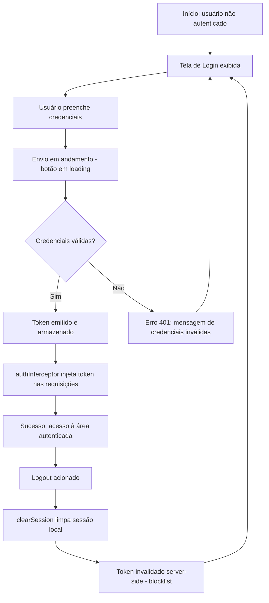
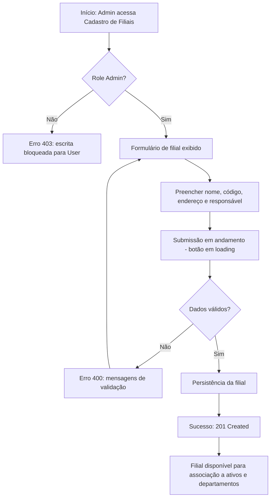
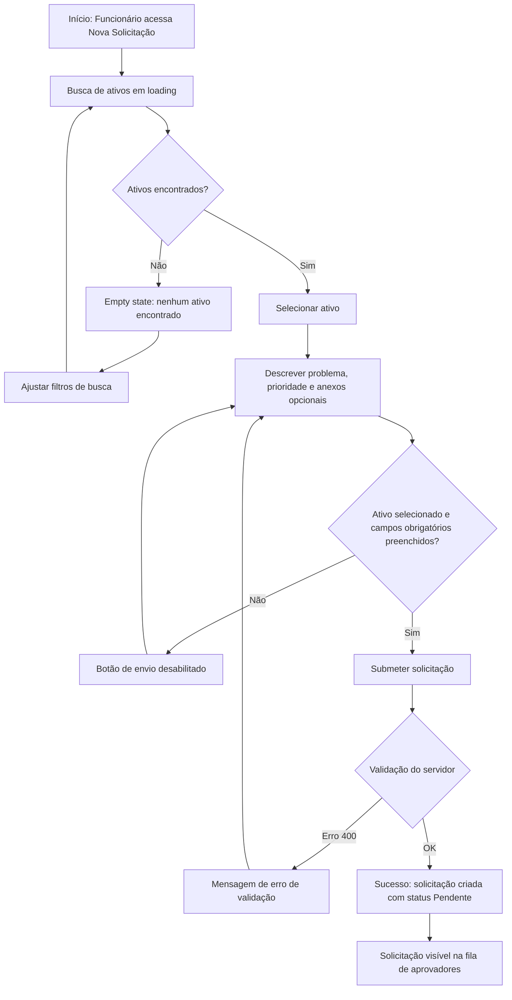
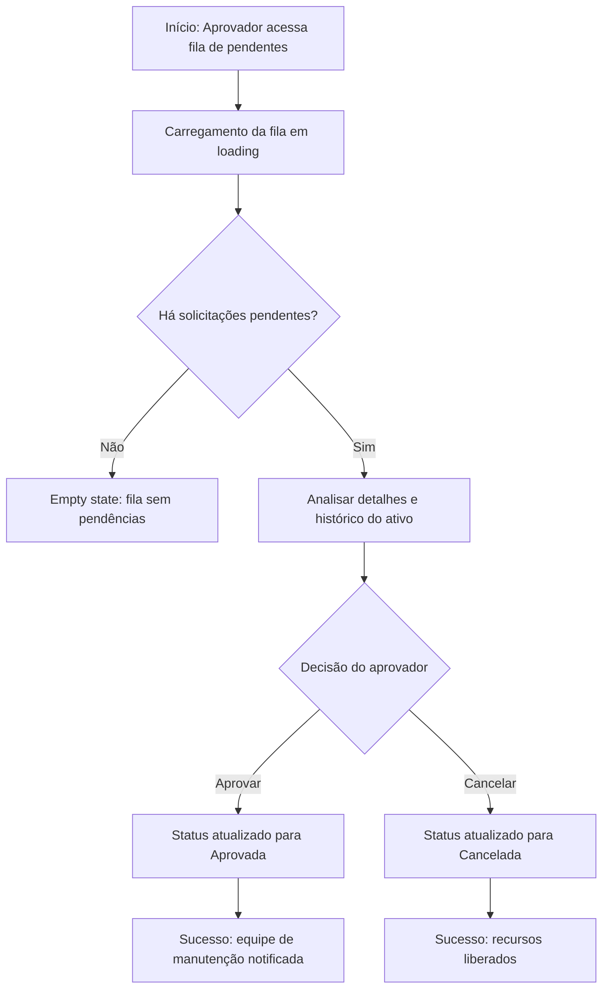
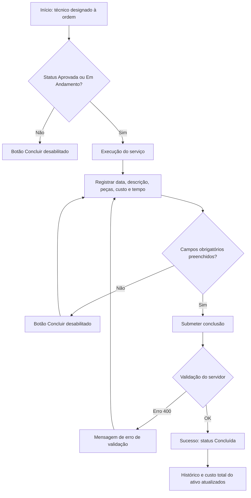
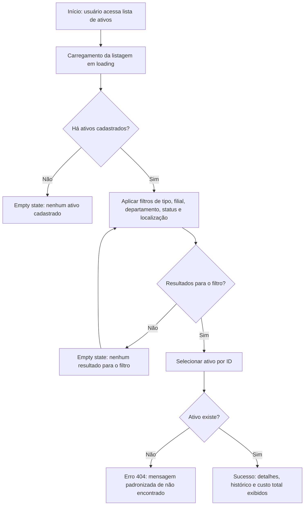

# User Flows & Interaction Diagrams — Sistema de Gestão de Patrimônio A4 (AegisPatrimônio)

> **Nota de rastreabilidade e escopo:** A varredura determinística do workspace **não detectou nenhuma rota, handler de IPC ou definição explícita de endpoints** ("Nenhuma rota/IPC detectada no código"). O frontend consiste em 15 arquivos `.js` em `frontend/` (com `@popperjs/core` como única dependência de produção declarada) e o backend em 335 arquivos `.java` em `src/` — nenhuma definição de tela/rota foi extraída pela varredura. Por isso, os fluxos abaixo são ancorados em três fontes verificáveis: (1) os casos de uso e requisitos do BRD (UC-01 a UC-04, RF-01 a RF-29, RN-01 a RN-08, CA-01 a CA-10); (2) os arquivos reais existentes na base citados pela varredura AST (ex.: `frontend/src/services/api.js`, `src/main/java/br/com/aegispatrimonio/service/AtivoService.java`, `src/main/java/br/com/aegispatrimonio/repository/ManutencaoSpecification.java`); e (3) os comportamentos de API citados no BRD como cenários de teste (ex.: `criar_comAdmin_deveRetornarCreated`, `buscarPorId_comIdInexistente_deveRetornarNotFound`). Transições de rota exatas e nomes literais de telas devem ser confirmados contra o código antes do uso operacional.

---

## 1. User Personas & Actors

**[INFERIDO POR IA — REQUER VALIDAÇÃO HUMANA]** — Atores derivados da tabela de Stakeholders (BRD §2) e do modelo de RBAC do BRD (RF-26: duas roles — **Admin** e **User**). O mapeamento de "Equipe de Manutenção" e "Aprovador" para roles concretas do sistema não está explícito no BRD nem detectado no código e precisa de validação.

| Ator | Papel | Objetivos Principais | Permissões |
| :--- | :--- | :--- | :--- |
| **Administrador do Sistema** | Admin (role) | Manter cadastros mestres, gerenciar usuários/roles/permissões, garantir integridade do acervo | CRUD total em Departamento, Filial, Fornecedor, Funcionário, Localização, Tipo de Ativo, Role e Permission (RF-01 a RF-10, RF-27); gestão completa de ativos (RF-11 a RF-17); aprovar/cancelar manutenções (RF-19, RF-20) |
| **Funcionário / Colaborador** | User (role) | Solicitar manutenção de ativos alocados; consultar ativos e histórico | Leitura de ativos e cadastros (RF-14, RF-15); criação de solicitações de manutenção (RF-18); **403 Forbidden** em qualquer escrita em entidades mestres (RN-02) |
| **Aprovador** | Admin ou role específica (a confirmar) | Validar solicitações, garantir conformidade e custo razoável | Visualizar fila de pendentes, aprovar (RF-19) e cancelar (RF-20); consultar histórico e custo total por ativo (`custoTotalPorAtivo`) |
| **Equipe de Manutenção** | Operador (role a confirmar) | Executar ordens de serviço e registrar custos com precisão | Concluir manutenções aprovadas (RF-21); registro de data, descrição, peças, custo e tempo |
| **Gestor de Patrimônio** | Product Owner (consumidor de informação) | Visibilidade do acervo, custos e auditoria | Leitura de relatórios e histórico; trilha de auditoria de operações de escrita (RNF-07) |

---

## 2. Core User Flows

**[INFERIDO POR IA — REQUER VALIDAÇÃO HUMANA]** — Salvo indicação em contrário, os comportamentos de estado de UI (loading, disabled, empty) descritos nos fluxos abaixo são inferidos a partir dos casos de uso do BRD, pois a varredura não detectou telas/rotas reais. Os estados de **erro** e seus códigos HTTP seguem o BRD (RN-02, RN-03, RN-04, CA-01, CA-06). Da mesma forma, **nenhum mecanismo de instrumentação (analytics/eventos) foi detectado na varredura** — as métricas listadas por fluxo são metas de KPI do BRD §8 e requerem implementação de instrumentação.

### Flow 1: Autenticação, Sessão e Logout

* **Gatilho:** Usuário não autenticado tenta acessar o sistema, ou a sessão expira (token expira em 1h; refresh token 7 dias — RNF-01 do BRD).
* **Ator:** Todos os atores (Admin e User).
* **Pré-condições:** Credenciais cadastradas; funcionário pode estar vinculado a usuário do sistema para autenticação (RN-06, cenário `createFuncionarioAndUsuario` do BRD).
* **Resultado esperado:** Sessão autenticada com token JWT emitido (RF-23 — conforme BRD; biblioteca de implementação não verificada na varredura de dependências) e injeção automática do token em requisições subsequentes via `authInterceptor` (RF-24, CA-07). No logout: sessão local limpa e token invalidado server-side em blocklist (CA-08).

* **Passos:**
  1. Usuário acessa a tela de login do frontend (`frontend/`).
  2. Sistema exibe o formulário de credenciais.
  3. Usuário preenche e submete; a requisição é processada pela função `request` do serviço central `frontend/src/services/api.js` — função de maior complexidade ciclomática do frontend (13), conforme varredura AST.
  4. Sistema valida as credenciais: sucesso retorna o token (CA-06); credenciais ausentes/inválidas ou requisição sem token resultam em **401** nos endpoints protegidos.
  5. Frontend armazena as credenciais e o `authInterceptor` passa a injetar o token automaticamente em todas as requisições.
  6. **Logout:** usuário aciona a saída; `clearSession` limpa a sessão local e o token é invalidado server-side (blocklist — CA-08).

* **Estados de UI cobertos:**

| Estado | Cobertura neste fluxo |
| :--- | :--- |
| **loading** | Durante o envio das credenciais (botão em processamento) |
| **empty** | Não aplicável — o formulário de login renderiza campos vazios por padrão |
| **error** | Credenciais inválidas ou requisição sem token — **401** (CA-06) |
| **success** | Redirecionamento para a área autenticada após emissão do token |
| **disabled** | Botão de submit desabilitado durante o envio |

* **Métricas instrumentadas neste fluxo:** Tempo de resposta da autenticação (meta RNF-04: p95 < 200ms); taxa de sucesso de login.
* **Observação de código:** erros de requisição são hoje logados via `console.error` (`frontend/src/services/api.js:44`) e `console.debug` (`frontend/src/services/api.js:107`) — impacta a observabilidade do estado de erro em produção.

### Flow 2: Cadastro de Filial — padrão CRUD de entidades mestres (Admin)

* **Gatilho:** Admin acessa "Cadastro de Filiais" (UC-01, passo 1 do BRD).
* **Ator:** Admin (User recebe **403 Forbidden** — RN-02).
* **Pré-condições:** Usuário autenticado com role Admin.
* **Resultado esperado:** Filial persistida e retornada como **201 Created** (RN-01); disponível para associação a ativos/departamentos.

* **Passos (ancorados em UC-01):**
  1. Admin acessa "Cadastro de Filiais".
  2. Sistema exibe o formulário (nome, código, endereço, responsável).
  3. Admin preenche e submete.
  4. Sistema valida os dados (RN-03): inválido → **400 Bad Request** com mensagens claras (CA-02, cenário `criar_comDadosInvalidos_deveRetornarBadRequest`).
  5. Válido → persiste e retorna **201 Created** (cenário `criar_comAdmin_deveRetornarCreated`).
  6. Variante de bloqueio: a mesma operação submetida por User retorna **403 Forbidden** (`criar_comUser_deveRetornarForbidden`).

* **Nota de abrangência:** este padrão de fluxo se repete para Departamento (RF-01 a RF-05), Fornecedor (RF-07), Funcionário (RF-08, incluindo a variante com criação simultânea de usuário — `createFuncionarioAndUsuario`), Localização (RF-09), Tipo de Ativo (RF-10) e Role/Permission (RF-27).

* **Estados de UI cobertos:**

| Estado | Cobertura neste fluxo |
| :--- | :--- |
| **loading** | Durante a submissão e o carregamento da lista de filiais |
| **empty** | Lista de filiais vazia antes do primeiro cadastro — atenção: `RealisticDataSeeder.java` popula dados realistas em ambientes de demonstração, o que pode mascarar este estado em dev/staging |
| **error** | **400** (validação — RN-03) e **403** (User tentando escrever — RN-02) |
| **success** | **201 Created** com confirmação visual da filial criada |
| **disabled** | Botão de submit desabilitado durante o envio e enquanto campos obrigatórios estão vazios |

* **Métricas instrumentadas neste fluxo:** Taxa de erros de validação (400); tempo de resposta da operação (meta RNF-04: p95 < 200ms).

### Flow 3: Abertura de Solicitação de Manutenção

* **Gatilho:** Funcionário identifica um problema em ativo e acessa "Nova Solicitação" (UC-02, passo 1 do BRD).
* **Ator:** User (Funcionário).
* **Pré-condições:** Usuário autenticado; ativo existe e está ativo.
* **Resultado esperado:** Solicitação criada com status **Pendente** (RF-18), visível para aprovadores (entrada no Flow 4).

* **Passos:**
  1. Funcionário acessa "Nova Solicitação".
  2. Sistema exibe a busca de ativos por filial/departamento/localização (RF-15). *Ancoragem de código:* a listagem/ranking de candidatos de ativo é implementada em `src/main/java/br/com/aegispatrimonio/service/AtivoService.java` — o TODO na linha 119 registra que este caminho carrega até 1000 candidatos (id+nome) e faz ranking; a serialização para exibição usa `AtivoMapper.toDTO` (`src/main/java/br/com/aegispatrimonio/mapper/AtivoMapper.java`).
  3. Funcionário seleciona o ativo, descreve o problema, define a prioridade e anexa fotos (opcional).
  4. Sistema valida os dados (RN-03) e cria a solicitação com status **Pendente**.
  5. Confirmação de sucesso; a solicitação entra na fila de aprovadores.

* **Estados de UI cobertos:**

| Estado | Cobertura neste fluxo |
| :--- | :--- |
| **loading** | Durante a busca de ativos e a submissão |
| **empty** | Nenhum ativo encontrado para os filtros aplicados |
| **error** | **400** (validação — RN-03) |
| **success** | Solicitação criada com status **Pendente** |
| **disabled** | Botão de envio desabilitado sem ativo selecionado ou com campos obrigatórios vazios |

* **Métricas instrumentadas neste fluxo:** Taxa de solicitações canceladas (meta BRD §8: < 10%); tempo médio de aprovação (medido a partir da criação).
* **Risco de performance:** o TODO em `AtivoService.java:119` (carregamento de até 1000 candidatos + ranking) pode degradar a etapa de seleção de ativos deste fluxo.

### Flow 4: Aprovação ou Cancelamento de Solicitação

* **Gatilho:** Solicitação em status **Pendente**; aprovador acessa a fila de pendentes (UC-03, passo 1 do BRD).
* **Ator:** Aprovador (Admin ou role específica — a confirmar; ver Seção 1).
* **Pré-condições:** Solicitação em status **Pendente** (RN-05).
* **Resultado esperado:** Status **Aprovada** (com equipe de manutenção notificada — UC-03) ou **Cancelada** (recursos liberados — CA-05).

* **Passos:**
  1. Aprovador visualiza a fila de pendentes. *Ancoragem de código:* a construção dinâmica de critérios de filtragem de manutenções existe em `src/main/java/br/com/aegispatrimonio/repository/ManutencaoSpecification.java` (método `build`, complexidade ciclomática 14).
  2. Analisa detalhes e histórico do ativo, incluindo o custo total acumulado (`custoTotalPorAtivo` — RF-17, RN-08).
  3. Clica "Aprovar" → sistema atualiza o status para **Aprovada** (RN-05).
  4. Alternativa: clica "Cancelar" em qualquer estado do fluxo → **Cancelada** (RF-20, CA-05).
  5. Pós-aprovação: equipe de manutenção notificada. **[INFERIDO POR IA — REQUER VALIDAÇÃO HUMANA]** — o BRD afirma "Equipe de manutenção notificada" (UC-03); a base contém `src/main/java/br/com/aegispatrimonio/service/AlertNotificationService.java` (método `checkResourceUsageAlerts`, focado em alertas de uso de recursos), mas o wiring de notificação específico para aprovações de manutenção não foi verificado na varredura.

* **Estados de UI cobertos:**

| Estado | Cobertura neste fluxo |
| :--- | :--- |
| **loading** | Durante o carregamento da fila e o processamento da decisão |
| **empty** | Fila sem solicitações pendentes |
| **error** | Falha ao atualizar status; tentativa de aprovar solicitação não pendente |
| **success** | Status **Aprovada** ou **Cancelada** confirmado |
| **disabled** | Botão "Aprovar" indisponível quando o status da solicitação não é **Pendente** |

* **Métricas instrumentadas neste fluxo:** Tempo médio de aprovação (meta BRD §8: < 4 horas úteis); taxa de solicitações canceladas (meta: < 10%).

### Flow 5: Execução e Conclusão da Ordem de Serviço

* **Gatilho:** Solicitação **Aprovada** e técnico designado (UC-04, pré-condição do BRD).
* **Ator:** Equipe de Manutenção.
* **Pré-condições:** Status **Aprovada** ou **Em Andamento** (RF-21, RN-05).
* **Resultado esperado:** Status **Concluída**; histórico do ativo atualizado; `custoTotalPorAtivo` recalculado (RN-08, CA-09).

* **Passos:**
  1. Técnico executa o serviço.
  2. Registra: data, descrição, peças usadas, custo e tempo.
  3. Clica "Concluir" → sistema atualiza o status para **Concluída** (RN-05).
  4. Sistema atualiza o `custoTotalPorAtivo` do ativo (CA-09: relatório bate com a soma das ordens concluídas).
  5. **Nota sobre estado intermediário:** a transição para **Em Andamento** existe na máquina de estados (RN-05), mas seu gatilho não está especificado no BRD nem detectado no código. **[INFERIDO POR IA — REQUER VALIDAÇÃO HUMANA]** — premissa adotada: a transição ocorre quando o técnico inicia a execução da ordem aprovada.

* **Estados de UI cobertos:**

| Estado | Cobertura neste fluxo |
| :--- | :--- |
| **loading** | Durante a submissão da conclusão |
| **empty** | Campos de registro obrigatórios (data, descrição, custo) vazios |
| **error** | **400** (validação — RN-03) |
| **success** | Status **Concluída** com confirmação |
| **disabled** | Botão "Concluir" desabilitado se o status não for **Aprovada**/**Em Andamento** ou se campos obrigatórios estiverem vazios |

* **Métricas instrumentadas neste fluxo:** Custo médio de manutenção por ativo/ano (meta BRD §8: redução de 15% YoY).

### Flow 6: Consulta de Ativos, Histórico e Custos

* **Gatilho:** Usuário acessa a listagem de ativos ou busca um ativo específico.
* **Ator:** Admin e User (leitura permitida para ambas as roles — RF-14, RF-15).
* **Pré-condições:** Usuário autenticado (Flow 1).
* **Resultado esperado:** Detalhes completos do ativo, incluindo histórico de manutenção (RF-22) e custo total por período (RF-17).

* **Passos:**
  1. Usuário acessa a listagem de ativos.
  2. Sistema carrega a listagem com filtros por tipo, filial, departamento, status e localização (RF-15).
  3. Usuário aplica filtros e/ou seleciona um ativo por ID (RF-14).
  4. ID inexistente → **404 Not Found** com mensagem padronizada (RN-04, `buscarPorId_comIdInexistente_deveRetornarNotFound`, CA-03).
  5. Sucesso → detalhes, histórico e custo total exibidos.

* **Estados de UI cobertos:**

| Estado | Cobertura neste fluxo |
| :--- | :--- |
| **loading** | Durante o carregamento da listagem e do detalhe |
| **empty** | Nenhum ativo cadastrado; nenhum resultado para o filtro aplicado |
| **error** | **404** para ID inexistente (RN-04, CA-03) |
| **success** | Detalhes, histórico e custo total exibidos |
| **disabled** | Não aplicável — fluxo somente leitura |

* **Métricas instrumentadas neste fluxo:** Tempo de resposta das consultas (meta RNF-04: p95 < 200ms, excluindo relatórios pesados).

---

## 3. Edge Cases & Error Flows

| Cenário | Tratamento na UI | Mensagem exibida | Fonte |
| :--- | :--- | :--- | :--- |
| Sessão expirada durante o fluxo (token expira em 1h; refresh 7 dias) | **401** e redirecionamento para login preservando contexto | Mensagem de sessão expirada (texto exato a confirmar) | **[INFERIDO POR IA — REQUER VALIDAÇÃO HUMANA]** — expiração conforme BRD RNF-01; comportamento de redirecionamento inferido |
| Requisição sem token em endpoint protegido | Rejeição da operação | Mensagem de não autenticado | BRD CA-06 |
| Payload inválido em formulário (campos obrigatórios, formatos, tipos) | Bloqueio da submissão; destaque dos campos inválidos | Mensagens claras de validação | BRD RN-03 / CA-02 (`criar_comDadosInvalidos_deveRetornarBadRequest`) |
| ID inexistente em consulta de ativo/entidade | Estado de erro na tela de detalhe | Mensagem padronizada de não encontrado | BRD RN-04 / CA-03 (`buscarPorId_comIdInexistente_deveRetornarNotFound`) |
| User tenta criar/atualizar/excluir entidade mestre | Ação bloqueada; recomenda-se ocultar/desabilitar controles de escrita para a role User | Mensagem de acesso negado | BRD RN-02 / CA-01 (`criar_comUser_deveRetornarForbidden`); ocultação de controles é **[INFERIDO POR IA — REQUER VALIDAÇÃO HUMANA]** |
| Busca de ativos retorna grande volume de candidatos | Loading prolongado na etapa de seleção de ativos (Flow 3) | Indicador de carregamento | Código: TODO em `AtivoService.java:119` (carrega até 1000 candidatos id+nome e faz ranking); comportamento de UI **[INFERIDO POR IA — REQUER VALIDAÇÃO HUMANA]** |
| Cancelamento de solicitação em qualquer estado do fluxo de manutenção | Fluxo anulado e recursos liberados | Confirmação de cancelamento | BRD RN-05 / CA-05 |
| Empty states mascarados em ambientes de demonstração | Listas populadas automaticamente pelo seeder | — | Código: `RealisticDataSeeder.java` (método `run`, complexidade 15) — validar empty states em ambiente sem seed **[INFERIDO POR IA — REQUER VALIDAÇÃO HUMANA]** |
| Edição de username do usuário | Alteração sem efeito no servidor | — | Código: `Usuario.setUsername` com corpo vazio (stub) em `Usuario.java:86` — fluxo de edição de perfil não consta no BRD **[INFERIDO POR IA — REQUER VALIDAÇÃO HUMANA]** |
| Falha de rede/servidor durante submissão | Erro registrado via `console.error` no serviço central de API | Mensagem de erro genérica (texto exato a confirmar) | Código: `frontend/src/services/api.js:44`; texto da mensagem **[INFERIDO POR IA — REQUER VALIDAÇÃO HUMANA]** |

---

## 4. Cross-Flow Dependencies

* **Flow 1 (Autenticação) precede todos os demais:** sem sessão válida, os endpoints protegidos retornam **401** (CA-06); o `authInterceptor` (RF-24) é pré-requisito de qualquer requisição autenticada.
* **Flow 2 (cadastros mestres) precede Flow 3:** a solicitação exige ativo existente e ativo (UC-02), e cada ativo pertence a **um** Tipo de Ativo, **uma** Filial, **um** Departamento e **uma** Localização (RN-07) — entidades criadas no Flow 2.
* **Flow 3 precede Flow 4:** apenas solicitações em status **Pendente** podem ser aprovadas (RN-05).
* **Flow 4 precede Flow 5:** apenas solicitações **Aprovada** (ou **Em Andamento**) podem ser concluídas (RF-21, RN-05).
* **Flow 5 alimenta Flow 4 e Flow 6:** o `custoTotalPorAtivo` (RN-08, CA-09), atualizado na conclusão, é consumido na análise de aprovação (UC-03, passo 2) e na consulta de custos (RF-17).
* **Flow 6 depende de Flow 2, Flow 3 e Flow 5** para exibir dados completos: histórico de manutenção (RF-22) só existe após solicitações criadas e concluídas.
* **Cancelamento (Flow 4 — RF-20) é transversal** à máquina de estados de manutenção: pode ocorrer em qualquer estado (CA-05), interrompendo os Flows 3→4→5 em qualquer ponto.

---

## 5. Acessibilidade nos Fluxos

* **Responsividade:** o BRD (RNF-08) exige interface responsiva (desktop/tablet) com abordagem **mobile-first para solicitações de manutenção** — impacto direto no Flow 3 (abertura de solicitação), que deve ser plenamente operável em telas menores.
* **Navegação por teclado:** **[INFERIDO POR IA — REQUER VALIDAÇÃO HUMANA]** — ordem de tab e atalhos não são verificáveis na varredura (nenhuma tela/rota detectada e nenhum teste de acessibilidade citado no BRD). Recomendação: ordem de tab coerente com a sequência dos formulários descrita nos casos de uso (login → campos → submit; solicitação → busca de ativo → descrição → anexos → submit), com foco visível nos botões de ação crítica (Aprovar/Cancelar/Concluir). Premissa adotada: os formulários seguem a ordem dos passos de UC-01 a UC-04.
* **Leitores de tela:** **[INFERIDO POR IA — REQUER VALIDAÇÃO HUMANA]** — textos alternativos e anúncios de estado não são verificáveis na base. Recomendação: anunciar programaticamente as transições de estado (loading → sucesso/erro) nos fluxos de manutenção e as mensagens de validação (400/403/404), que o BRD exige claras (CA-02) e padronizadas (CA-03). Premissa adotada: mensagens seguem os critérios de aceitação do BRD.

---

## 6. Referências

* **BRD:** Business Requirements Document — Sistema de Gestão de Patrimônio (A4) — fonte primária dos fluxos (UC-01 a UC-04, RF-01 a RF-29, RN-01 a RN-08, CA-01 a CA-10, KPIs §8, Riscos §9).
* **Glossário:** `glossario.md` (referenciado pelo BRD como fonte da linguagem ubíqua e das regras de negócio).
* **Código (varredura determinística do workspace):** `frontend/src/services/api.js`; `src/main/java/br/com/aegispatrimonio/service/AtivoService.java`; `src/main/java/br/com/aegispatrimonio/mapper/AtivoMapper.java`; `src/main/java/br/com/aegispatrimonio/repository/ManutencaoSpecification.java`; `src/main/java/br/com/aegispatrimonio/service/AlertNotificationService.java`; `src/main/java/br/com/aegispatrimonio/config/seeder/RealisticDataSeeder.java`; `src/main/java/br/com/aegispatrimonio/model/Usuario.java`.
* **Rotas/Endpoints:** nenhuma rota/IPC detectada na varredura — mapeamento de endpoints reais pendente de extração.
* **Wireframes/Protótipos:** não localizados no workspace — a definir.