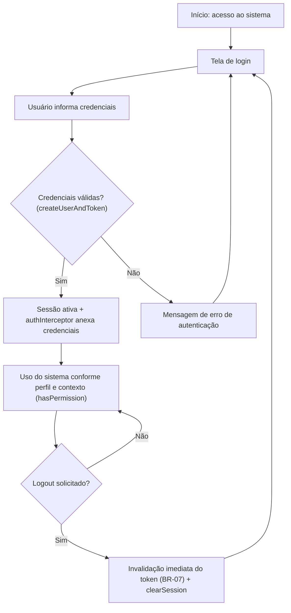
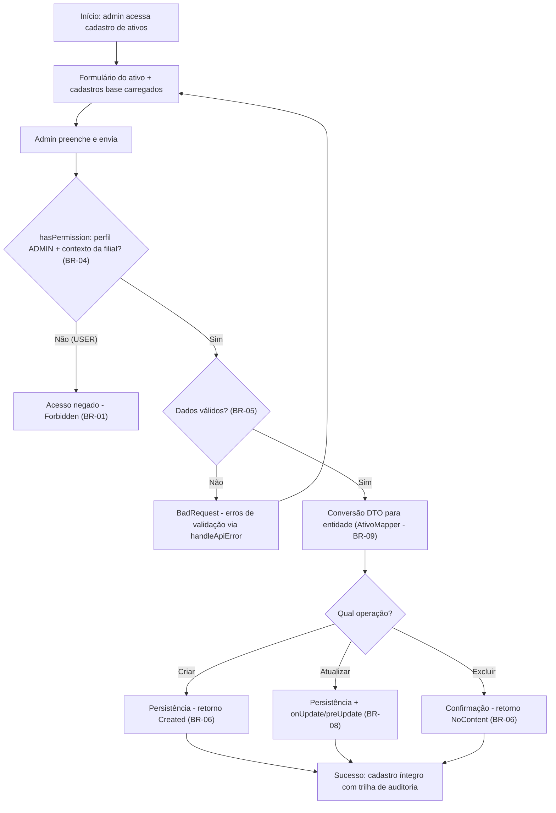
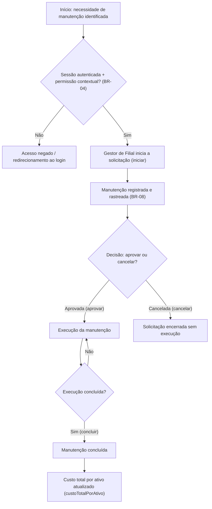
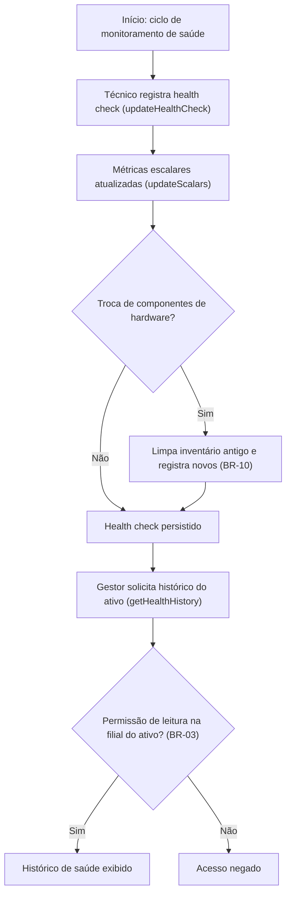
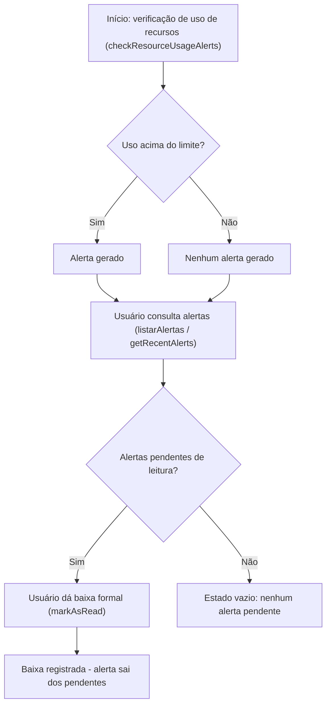
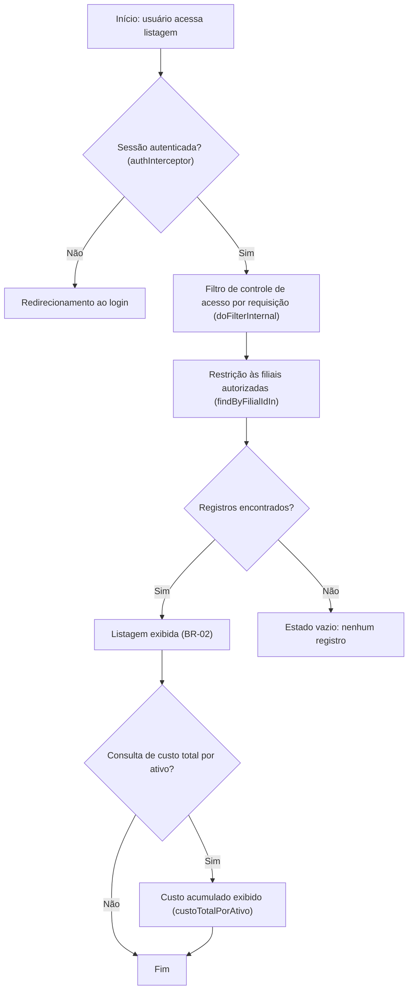

# User Flows & Interaction Diagrams — AegisPatrimônio (a6)

> **Versão:** 1.0 · **Status:** Draft · **Produto:** AegisPatrimônio (namespace `br.com.aegispatrimonio`; codinome "a6") · **Artefatos-fonte:** Business Requirements Document (BRD) v1.0 + diagnóstico determinístico do codebase (varredura + AST de 353 arquivos)
> **Nota de ancoragem:** a varredura do codebase **não detectou rotas, handlers de rota nem telas** ("Nenhuma rota/IPC detectada no código"). Os fluxos abaixo são, portanto, ancorados nos **métodos de serviço e na camada de API do frontend que existem em disco** — ver premissas na Seção 2.

## 1. User Personas & Actors

> **[INFERIDO POR IA — REQUER VALIDAÇÃO HUMANA]** Os perfis técnicos ADMIN/USER e o modelo de permissão contextual (por filial/departamento) foram verificados nos cenários de teste extraídos no BRD; os cargos/personas abaixo são inferência do domínio patrimonial herdada da Seção 3 do BRD (marcada lá como entrada humana necessária) — não há pesquisa de usuário no repositório.

| Ator | Papel | Objetivos Principais | Permissões |
| :--- | :--- | :--- | :--- |
| **Administrador de Patrimônio** | Perfil ADMIN — cadastro central | Criar, atualizar e excluir cadastros de ativos, filiais, departamentos, localizações, tipos de ativo, fornecedores, funcionários e usuários; aprovar manutenções | Escrita total, restrita a administradores (BR-01); leitura completa (BR-02); retornos Created/NoContent (BR-06) |
| **Gestor de Filial** | Perfil USER — opera uma unidade | Consultar listagens autorizadas à sua filial; acompanhar alertas; iniciar, acompanhar e concluir solicitações de manutenção | Leitura autorizada por filial (BR-02, BR-03); escrita de cadastros negada (BR-01) |
| **Técnico de TI / Monitoramento** | Responsável pela saúde dos equipamentos | Registrar health checks (hardware e disco), manter métricas atualizadas, acompanhar histórico e alertas de uso de recursos | Registro de health check (`updateHealthCheck`, `updateScalars`); leitura de histórico por filial (BR-03); baixa de alertas (`markAsRead`) |
| **Auditor / Compliance** | Auditoria interna | Consultar eventos de auditoria e histórico de modificações dos registros | Leitura; trilha automática `onUpdate`/`preUpdate` (BR-08) |
| **Sistema (ator não humano)** | Automação interna | Verificar uso de recursos e gerar alertas; registrar data/hora de modificação; filtrar acesso por requisição | `checkResourceUsageAlerts`; `onUpdate`/`preUpdate`; `doFilterInternal` |

## 2. Core User Flows

> **[INFERIDO POR IA — REQUER VALIDAÇÃO HUMANA] — Premissas de ancoragem dos fluxos**
> A varredura não detectou telas nem rotas; os fluxos são ancorados nos métodos e handlers reais existentes no disco: `createAtivo`, `createFilial`, `createDepartamento`, `createLocalizacao`, `createTipoAtivo`, `createFornecedor`, `createFuncionario`, `createFuncionarioAndUsuario`, `createUserAndToken`, `mockLogin`, `clearSession`, `iniciar`, `aprovar`, `concluir`, `cancelar`, `ManutencaoSpecification`, `updateHealthCheck`, `updateScalars`, `getHealthHistory`, `checkResourceUsageAlerts`, `listarAlertas`, `getRecentAlerts`, `markAsRead`, `custoTotalPorAtivo`, `hasPermission`, `doFilterInternal`, `findByFilialIdIn`, `request`/`handleApiError`/`authInterceptor` (`frontend/src/services/api.js`).
> **Premissas adotadas:** (i) existe uma camada de apresentação que consome `request`, cujas transições de tela não foram varridas; (ii) os retornos verificados em teste no BRD (Created, NoContent, Forbidden, BadRequest, NotFound, Ok) mapeiam para os estados success/error da UI; (iii) a máquina de estados da manutenção segue a ordem `iniciar` → `aprovar` → `concluir`/`cancelar` evidenciada no BRD; (iv) os textos de mensagem de UI serão definidos por produto/design.

### Flow 1: Autenticação e Sessão (Login → Uso → Logout)

* **Gatilho:** usuário não autenticado acessa o sistema; ou token inválido/expirado é rejeitado em qualquer chamada de API (`authInterceptor` anexa credenciais a cada requisição).
* **Ator:** todos os perfis (ADMIN e USER).
* **Pré-condições:** credenciais existentes — funcionário vinculado a usuário via `createFuncionarioAndUsuario`; token emitível via `createUserAndToken`.
* **Resultado esperado:** sessão ativa com credenciais anexadas automaticamente a cada chamada; no logout, invalidação imediata do token (BR-07) e encerramento via `clearSession`.

* **Passos:**
  1. Usuário não autenticado acessa o sistema e a tela de login. *[INFERIDO POR IA — REQUER VALIDAÇÃO HUMANA: tela não detectada na varredura; fluxo ancorado nos serviços de sessão]*
  2. Usuário informa credenciais vinculadas ao funcionário (`createFuncionarioAndUsuario`).
  3. Sistema valida as credenciais e emite o token (`createUserAndToken`); em ambiente de validação, `mockLogin` pode ser utilizado.
  4. Frontend armazena a sessão; `authInterceptor` passa a anexar as credenciais automaticamente a cada chamada (`request` em `frontend/src/services/api.js`).
  5. Usuário opera o sistema conforme perfil e contexto (filial/departamento — `hasPermission`, BR-04).
  6. Usuário solicita logout: sistema invalida imediatamente o token (BR-07) e encerra a sessão (`clearSession`).
  7. Nova tentativa de acesso exige nova autenticação.

* **Estados de UI cobertos:** [INFERIDO POR IA — REQUER VALIDAÇÃO HUMANA] **Loading** — processamento da autenticação (`request` em andamento); **Error** — credenciais inválidas ou erro tratado por `handleApiError`; **Success** — sessão ativa com `authInterceptor` ativo; **Disabled** — botão de envio durante o processamento; **Empty** — não aplicável neste fluxo.
* **Métricas instrumentadas neste fluxo:** nenhuma telemetria instrumentada no repositório. Propostas [INFERIDO POR IA — REQUER VALIDAÇÃO HUMANA]: taxa de sucesso de autenticação; incidentes de uso de token após logout (guardrail BR-07 do BRD).

### Flow 2: Cadastro Administrativo de Ativo Patrimonial

* **Gatilho:** administrador precisa registrar um novo bem patrimonial (ou atualizar/excluir cadastro existente).
* **Ator:** Administrador de Patrimônio (perfil ADMIN); perfil comum (USER) recebe acesso negado (BR-01).
* **Pré-condições:** sessão autenticada (Flow 1); cadastros base existentes: filial (`createFilial`), departamento (`createDepartamento`), localização prédio/andar/sala (`createLocalizacao`), tipo de ativo (`createTipoAtivo`).
* **Resultado esperado:** ativo criado com filial, departamento, localização e tipo — retorno **Created** (BR-06); atualização/exclusão com trilha de auditoria automática (`onUpdate`/`preUpdate`, BR-08); exclusão retorna **NoContent** (BR-06).

* **Passos:**
  1. Administrador acessa a área de cadastro de ativos. *[INFERIDO POR IA — REQUER VALIDAÇÃO HUMANA: tela não detectada; ancorado em `createAtivo`]*
  2. Sistema carrega os cadastros base para seleção (filiais, departamentos, localizações, tipos de ativo).
  3. Administrador preenche os dados do ativo e envia.
  4. Sistema verifica a permissão contextual (`hasPermission` — perfil + filial/departamento, BR-04); USER recebe acesso negado (BR-01).
  5. Sistema valida os dados (BR-05): entradas inválidas/incompletas são recusadas (BadRequest); a conversão DTO→entidade só ocorre com dados válidos e DTO nulo não gera registro (BR-09 — `AtivoMapper`).
  6. Sistema persiste o cadastro e retorna **Created** (BR-06); a data/hora da última modificação passa a ser registrada automaticamente (BR-08).
  7. Para exclusão, o administrador confirma a operação e o sistema retorna **NoContent** (BR-06).

* **Estados de UI cobertos:** [INFERIDO POR IA — REQUER VALIDAÇÃO HUMANA] **Loading** — carregamento dos cadastros base e envio do formulário; **Empty** — nenhuma filial/localização/tipo cadastrado, impedindo concluir o cadastro do ativo; **Error** — validação recusada (BadRequest, BR-05), acesso negado (Forbidden, BR-01) e erros via `handleApiError`; **Success** — cadastro confirmado com retorno Created (BR-06); **Disabled** — campos dependentes de cadastros base ausentes e botão de envio durante o processamento.
* **Métricas instrumentadas neste fluxo:** nenhuma telemetria no repositório. Propostas [INFERIDO POR IA — REQUER VALIDAÇÃO HUMANA]: % de ativos com cadastro completo (KPI do BRD — meta ≥ 95%); taxa de erros de API tratados ao usuário (`handleApiError` — guardrail do BRD).

### Flow 3: Solicitação e Aprovação de Manutenção

* **Gatilho:** necessidade de manutenção em um ativo, identificada pelo Gestor de Filial ou apontada por alerta de uso de recursos (Flow 5) ou por deterioração de saúde (Flow 4).
* **Ator:** Gestor de Filial (USER) inicia; responsável avalia e aprova; conclusão via `concluir`.
* **Pré-condições:** ativo cadastrado (Flow 2); sessão autenticada; permissão contextual válida (BR-04).
* **Resultado esperado:** manutenção rastreada no ciclo `iniciar` → `aprovar` → `concluir` (ou `cancelar`); custo acumulado atualizado via `custoTotalPorAtivo`.

* **Passos:**
  1. Gestor de Filial acessa as manutenções do ativo e inicia a solicitação (`iniciar`). *[INFERIDO POR IA — REQUER VALIDAÇÃO HUMANA: tela não detectada]*
  2. Sistema registra a manutenção vinculada ao ativo e ao solicitante, com data/hora (BR-08).
  3. Responsável avalia e **aprova** (`aprovar`) — ou a solicitação é **cancelada** (`cancelar`).
  4. Sistema disponibiliza consulta com filtros combinados (`ManutencaoSpecification` — status, ativo, período) para acompanhamento.
  5. Após a execução, a manutenção é **concluída** (`concluir`).
  6. Sistema atualiza o custo total de manutenção por ativo (`custoTotalPorAtivo`) para apoiar decisões de substituição, reparo ou desativação.

* **Estados de UI cobertos:** [INFERIDO POR IA — REQUER VALIDAÇÃO HUMANA] **Loading** — carregamento da listagem com filtros combinados (`ManutencaoSpecification`); **Empty** — nenhuma manutenção encontrada para os filtros aplicados; **Error** — acesso negado (BR-04) e erros via `handleApiError`; **Success** — transição de status confirmada (iniciada → aprovada → concluída); **Disabled** — ações de aprovar/concluir indisponíveis para status incompatíveis (máquina de estados de status não extraída na varredura — validar).
* **Métricas instrumentadas neste fluxo:** nenhuma telemetria no repositório. Propostas [INFERIDO POR IA — REQUER VALIDAÇÃO HUMANA]: tempo médio do ciclo `iniciar` → `concluir` (KPI do BRD); `custoTotalPorAtivo` disponível por ativo (KPI do BRD).

### Flow 4: Registro de Health Check e Consulta de Histórico de Saúde

* **Gatilho:** ciclo de monitoramento de saúde do equipamento (rotina do Técnico de TI) ou atualização de métricas de hardware/disco.
* **Ator:** Técnico de TI / Monitoramento registra; Gestor de Filial consulta o histórico da sua filial (BR-03).
* **Pré-condições:** ativo cadastrado (Flow 2); permissão de leitura **na filial à qual o ativo pertence** para consultar o histórico (BR-03 — `getHealthHistory`).
* **Resultado esperado:** health check registrado com dados de hardware e disco (`updateHealthCheck`); métricas atualizadas (`updateScalars`); histórico consultável "para viabilizar análise preditiva de falhas"; inventário de hardware substituído com integridade (BR-10).

* **Passos:**
  1. Técnico acessa o ativo e registra o health check com dados de hardware e disco (`updateHealthCheck`). *[INFERIDO POR IA — REQUER VALIDAÇÃO HUMANA: tela não detectada]*
  2. Sistema atualiza as métricas escalares do ativo (`updateScalars`).
  3. Havendo troca de componentes, o sistema limpa o inventário antigo — adaptadores de rede, discos e memórias — antes de registrar os novos (BR-10: `deleteByAtivoDetalheHardwareId` + `findByAtivoDetalheHardwareId`).
  4. Gestor de Filial solicita o histórico de saúde do ativo (`getHealthHistory`).
  5. Sistema verifica permissão de leitura na filial do ativo (BR-03); sem permissão, acesso negado.
  6. Sistema exibe o histórico de saúde do ativo.

* **Estados de UI cobertos:** [INFERIDO POR IA — REQUER VALIDAÇÃO HUMANA] **Loading** — registro do health check e carregamento do histórico; **Empty** — ativo sem histórico de saúde registrado; **Error** — acesso negado por filial (BR-03) e erros via `handleApiError`; **Success** — health check registrado e histórico exibido; **Disabled** — consulta de histórico indisponível sem permissão na filial do ativo.
* **Métricas instrumentadas neste fluxo:** nenhuma telemetria no repositório. Proposta [INFERIDO POR IA — REQUER VALIDAÇÃO HUMANA]: % de ativos com `updateHealthCheck` atualizado (KPI do BRD — meta ≥ 90%).

### Flow 5: Alertas de Uso de Recursos — Verificação e Baixa

* **Gatilho:** verificação automática de uso de recursos (`checkResourceUsageAlerts`) ou consulta manual de alertas.
* **Ator:** Sistema gera os alertas; Gestor de Filial / Técnico consultam e dão baixa (`markAsRead`).
* **Pré-condições:** sessão autenticada; métricas de uso atualizadas (relação com Flow 4 — `updateScalars`).
* **Resultado esperado:** alertas listados (`listarAlertas`, `getRecentAlerts`); baixa formal registrada (`markAsRead`).

* **Passos:**
  1. Sistema executa a verificação de uso de recursos (`checkResourceUsageAlerts`) e gera alertas quando os limites são excedidos.
  2. Usuário autenticado consulta a listagem geral (`listarAlertas`) ou os alertas recentes (`getRecentAlerts`). *[INFERIDO POR IA — REQUER VALIDAÇÃO HUMANA: central de alertas não detectada na varredura]*
  3. Sistema exibe os alertas pendentes de leitura.
  4. Usuário dá baixa formal no alerta (`markAsRead`).
  5. Sistema registra a baixa e o alerta deixa a lista de pendentes.

> **Ponto de atenção (risco do BRD):** `checkResourceUsageAlerts` possui complexidade ciclomática alta (17) — refatorar em métodos menores antes de evoluir esta área.

* **Estados de UI cobertos:** [INFERIDO POR IA — REQUER VALIDAÇÃO HUMANA] **Loading** — carregamento da listagem de alertas; **Empty** — nenhum alerta pendente ou recente; **Error** — erros de API via `handleApiError`; **Success** — baixa registrada (`markAsRead`) e alerta removido dos pendentes; **Disabled** — ação de baixa indisponível para alertas já lidos.
* **Métricas instrumentadas neste fluxo:** nenhuma telemetria no repositório. Proposta [INFERIDO POR IA — REQUER VALIDAÇÃO HUMANA]: % de alertas reconhecidos (`markAsRead`) dentro do SLA (KPI do BRD).

### Flow 6: Consulta de Listagens e Custo Total por Ativo

* **Gatilho:** usuário autenticado precisa consultar listagens autorizadas ou o custo acumulado por ativo para decisão de substituição, reparo ou desativação.
* **Ator:** todos os perfis autenticados (BR-02 — USER pode consultar).
* **Pré-condições:** sessão autenticada (Flow 1); registros existentes (Flows 2 e 3).
* **Resultado esperado:** listagens completas autorizadas retornadas (BR-02 — `listarTodos_comUser_deveRetornarOk`); custo total por ativo disponível (`custoTotalPorAtivo`).

* **Passos:**
  1. Usuário autenticado acessa a listagem desejada (ativos, manutenções, alertas, histórico de saúde). *[INFERIDO POR IA — REQUER VALIDAÇÃO HUMANA: telas não detectadas]*
  2. Sistema aplica o filtro de controle de acesso por requisição (`doFilterInternal`) e restringe o resultado às filiais autorizadas (`findByFilialIdIn`).
  3. Sistema retorna as listagens autorizadas (BR-02).
  4. Para decisão gerencial, o usuário consulta o custo total de manutenção por ativo (`custoTotalPorAtivo`).
  5. Sistema exibe o custo acumulado, apoiando a decisão de substituição, reparo ou desativação.

* **Estados de UI cobertos:** [INFERIDO POR IA — REQUER VALIDAÇÃO HUMANA] **Loading** — carregamento da listagem (área sensível: TODO de performance em `AtivoService`, linha 119 — carrega até 1000 candidatos e faz ranking em memória; latência é guardrail do BRD); **Empty** — nenhum registro autorizado ou encontrado para os filtros; **Error** — erros de API via `handleApiError`; **Success** — listagem e custo total exibidos; **Disabled** — não aplicável (fluxo somente de leitura).
* **Métricas instrumentadas neste fluxo:** nenhuma telemetria no repositório. Propostas [INFERIDO POR IA — REQUER VALIDAÇÃO HUMANA]: latência das consultas de listagem (guardrail do BRD); % de ativos com custo acumulado visível (KPI do BRD).

## 3. Edge Cases & Error Flows

> **[INFERIDO POR IA — REQUER VALIDAÇÃO HUMANA]** Os cenários abaixo são ancorados em evidências de código/BRD citadas na descrição; os **tratamentos de UI e os textos de mensagem são propostas** — nenhum texto de interface foi encontrado na varredura do codebase.

| Cenário | Tratamento na UI | Mensagem exibida |
| :--- | :--- | :--- |
| Sessão expirada ou token inválido durante o fluxo (BR-07; `authInterceptor` + `handleApiError`) | Redirecionamento ao login preservando o contexto da operação | Mensagem de sessão encerrada — texto a definir |
| Usuário comum (USER) tenta criar/atualizar/excluir cadastro (BR-01; evidências `criar_comUser_deveRetornarForbidden`, `atualizar_comUser_deveRetornarForbidden`, `deletar_comUser_deveRetornarForbidden`) | Ação bloqueada antes do envio; botão desabilitado quando o perfil não permite | Mensagem de acesso negado — texto a definir |
| Dados inválidos ou incompletos no cadastro (BR-05; `criar_comDadosInvalidos_deveRetornarBadRequest`) | Erros de validação destacados junto aos campos; formulário permanece preenchido | Mensagens de validação por campo — texto a definir |
| Consulta por identificador inexistente (BR-05; `buscarPorId_comIdInexistente_deveRetornarNotFound`) | Estado vazio na tela de detalhe | "Registro não encontrado" — texto a definir |
| Consulta de histórico de saúde sem permissão na filial do ativo (BR-03; `getHealthHistory`) | Bloqueio da consulta; histórico não exibido | Mensagem de acesso restrito à filial — texto a definir |
| Atualização de nome de usuário com o stub `Usuario.setUsername` com corpo vazio (C-04) | Comportamento incompleto: recomenda-se remover o campo do fluxo de atualização até a resolução do stub | Nenhuma (operação sem efeito) — validar comportamento real |
| Latência alta em listagens — TODO de performance em `AtivoService` (linha 119): carrega até 1000 candidatos e faz ranking em memória | Indicador de carregamento persistente; mitigação prevista no BRD (empurrar ranking para a camada de consulta e paginar) | Nenhuma específica — guardrail de latência do BRD |
| Chamadas `console.error`/`console.debug` residuais em `frontend/src/services/api.js` (linhas 44 e 107) durante o uso | Sem tratamento de UI; mensagens técnicas podem aparecer no console do navegador — remover antes de produção | Nenhuma (registro técnico) |

## 4. Cross-Flow Dependencies

* **Todos os fluxos dependem do Flow 1 (Autenticação):** `authInterceptor` anexa as credenciais a cada chamada; sem sessão válida, o filtro de controle de acesso por requisição (`doFilterInternal`) bloqueia a operação.
* **Flow 3 (Manutenção) exige Flow 2 (Cadastro):** só há manutenção para ativo cadastrado, com filial, departamento, localização e tipo; fornecedores (`createFornecedor`) e funcionários (`createFuncionario`) dos cadastros base também precedem o ciclo.
* **Flow 4 (Health Check) exige Flow 2:** o health check é registrado sobre um ativo existente; a consulta de histórico (BR-03) depende da permissão por filial configurada no cadastro.
* **Flow 5 (Alertas) é alimentado pelo Flow 4:** as métricas atualizadas via `updateScalars` são a matéria-prima da verificação `checkResourceUsageAlerts`; alertas não reconhecidos podem disparar a necessidade que inicia o Flow 3.
* **Flow 6 (Consulta/Custo) depende dos Flows 2 e 3:** `custoTotalPorAtivo` só tem conteúdo com manutenções registradas no fluxo de aprovação.
* **Carga de dados para homologação:** o `RealisticDataSeeder` precede o piloto por filial previsto no Go-to-Market do BRD — os fluxos acima devem ser validados com dados realistas antes da expansão.
* *[INFERIDO POR IA — REQUER VALIDAÇÃO HUMANA]* Dependências em cascata entre cadastros base (ex.: localização exige filial/departamento; ativo exige todos) são inferidas do escopo do BRD — a cardinalidade real das entidades precisa ser confirmada na base de código.

## 5. Acessibilidade nos Fluxos

> **[INFERIDO POR IA — REQUER VALIDAÇÃO HUMANA]** Nenhuma evidência de acessibilidade (ARIA, navegação por teclado, contraste, anúncios de estado) foi encontrada na varredura do codebase (15 arquivos `.js` no frontend). As diretrizes abaixo são propostas padrão a validar com design/QA antes da implementação.

* **Navegação por teclado:** ordem de tab coerente com a leitura da tela (formulários → ações primárias → confirmações); atalhos de teclado a definir; estados desabilitados (disabled) devem ser alcançáveis pelo foco e anunciados.
* **Leitores de tela:** textos alternativos para ícones e ações; anúncios de estado (loading, success, error) nas transições de cada fluxo; mensagens de erro tratadas por `handleApiError` devem ser anunciadas como região viva.
* **Estados de UI:** cada estado coberto nos fluxos (loading/empty/error/success/disabled) deve ter representação textual acessível, não apenas visual.

## 6. Referências

* **Artefato-fonte principal:** Business Requirements Document (BRD) — a6 · AegisPatrimônio, v1.0 (escopo, regras de negócio BR-01 a BR-10, personas e guardrails).
* **Diagnóstico determinístico do codebase:** varredura + AST de 353 arquivos (server/analyze-pipeline.ts) — base das âncoras de código citadas nos fluxos.
* **Glossário — Ubiquitous Language:** termos canônicos usados nos fluxos ("iniciar", "aprovar", "concluir", "cancelar", "baixa de alerta").
* **Wireframes/Protótipos:** não identificados no repositório — a criar; os diagramas Mermaid deste documento servem de referência inicial.
* **Use Cases relacionados:** não catalogados com IDs no repositório; os cenários de teste de permissão extraídos no BRD (ex.: `criar_comUser_deveRetornarForbidden`, `listarTodos_comUser_deveRetornarOk`) servem de referência comportamental.