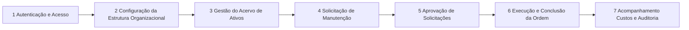

# Story Map & Slicing Strategy — Sistema de Gestão de Patrimônio (A4)

> Baseado na metodologia de *User Story Mapping* (Jeff Patton). O eixo horizontal representa a jornada do usuário; o eixo vertical representa a priorização por release/slice.
>
> **Fonte primária:** Business Requirements Document (BRD) do Sistema de Gestão de Patrimônio (A4) — codebase `AegisPatrimonio` (pacote `br.com.aegispatrimonio`, conforme diagnóstico do workspace). Todos os itens são referenciados pelos identificadores do BRD (RF-XX, RNF-XX, UC-XX, CA-XX, RN-XX, R-XX) para rastreabilidade direta. Itens que não estão explicitamente no BRD e derivam de inferência estão marcados com **[INFERIDO POR IA — REQUER VALIDAÇÃO HUMANA]**.

---

## 1. Backbone (Atividades do Usuário)

* **Acessar o Sistema** → **Gerir Cadastros Organizacionais** → **Gerir Ativos Patrimoniais** → **Solicitar Manutenção** → **Aprovar Solicitações** → **Executar Ordens de Serviço** → **Acompanhar Custos e Histórico**

> O backbone é ancorado nos quatro casos de uso principais do BRD (UC-01 a UC-04) e nos grupos de requisitos funcionais (RF-01 a RF-29). As personas que percorrem cada atividade vêm diretamente da tabela de Stakeholders do BRD (Gestor de Patrimônio, Administrador do Sistema, Funcionário/Colaborador, Equipe de Manutenção, Aprovação/Compliance).

---

## 2. Horizontal Axis (User Journey Steps)

| Etapa | Persona (Stakeholder BRD) | Objetivo do Usuário | Tarefas Associadas |
| :--- | :--- | :--- | :--- |
| **1. Autenticação e Acesso** | Admin / User (Funcionário) | Autenticar-se com credenciais, manter a sessão segura e atuar conforme as permissões da sua role | RF-23 (login com retorno de JWT), RF-24 (interceptador de auth com injeção automática de token), RF-25 (logout / `clearSession`), RF-26 (RBAC Admin/User) |
| **2. Configuração da Estrutura Organizacional** | Administrador do Sistema (Admin) | Manter os cadastros mestres que sustentam o cadastro e a alocação de ativos | RF-01 a RF-05 (departamentos: criar, atualizar, excluir, buscar por ID, listar), RF-06 (filiais), RF-07 (fornecedores), RF-08 (funcionários, com vinculação opcional a usuário), RF-09 (localizações), RF-10 (tipos de ativo); regras RN-01/RN-02 (escrita exclusiva Admin, 403 para User) |
| **3. Gestão do Acervo de Ativos** | Admin / Gestor de Patrimônio | Registrar, localizar, transferir, reavaliar e dar baixa em bens patrimoniais | RF-11 (cadastrar ativo), RF-12 (atualizar/transferir), RF-13 (baixar/excluir, Admin only), RF-14 (consultar por ID com histórico), RF-15 (listar/filtrar por tipo, filial, departamento, status, localização), RF-16 (depreciação); regra RN-07 |
| **4. Solicitação de Manutenção** | Funcionário/Colaborador (User) | Reportar um problema em um ativo alocado e demandar o reparo | RF-18 (criar solicitação → status **Pendente**); UC-02 (selecionar ativo via busca, descrever problema/prioridade) |
| **5. Aprovação de Solicitações** | Aprovação/Compliance (Aprovador) | Validar demandas com base no histórico e no custo acumulado do ativo | RF-19 (aprovar: **Pendente** → **Aprovada**), RF-20 (cancelar em qualquer estado); UC-03; apoio analítico: RF-17 (`custoTotalPorAtivo`) |
| **6. Execução e Conclusão da Ordem** | Equipe de Manutenção | Executar o serviço autorizado e registrar custos, peças e tempo | RF-21 (concluir: **Aprovada/Em Andamento** → **Concluída**); UC-04 (registro de data, descrição, peças, custo, tempo) |
| **7. Acompanhamento, Custos e Auditoria** | Gestor de Patrimônio / Compliance | Ter visibilidade do acervo, dos custos por ativo e do histórico de intervenções | RF-17 (custo total por ativo/período), RF-22 (histórico de manutenção), RF-15 (filtros de consulta); RNF-07 (trilha de auditoria de escrita) |

> O fluxo acima representa a sequência ponta-a-ponta da espinha dorsal. Personas distintas percorrem subconjuntos da jornada: o **Funcionário (User)** atua nas etapas 1, 4 e 7; o **Aprovador** nas etapas 1, 5 e 7; a **Equipe de Manutenção** nas etapas 1, 6 e 7; o **Admin** percorre todas as etapas (configuração, gestão e aprovação) — mapeamento derivado dos atores de UC-01..UC-04 e da tabela de Stakeholders do BRD.

---

## 3. Vertical Axis (MoSCoW Slicing)

> **[INFERIDO POR IA — REQUER VALIDAÇÃO HUMANA]** — O BRD não define fatiamento MoSCoW, releases ou estimativas. O fatiamento abaixo foi derivado dos requisitos funcionais (RF-01..RF-29), dos critérios de aceitação (CA-01..CA-10) e dos riscos (R-01..R-04) do BRD. As premissas adotadas estão listadas em 3.1 e devem ser validadas com o Product Owner.

### 3.1 Premissas do fatiamento [INFERIDO POR IA — REQUER VALIDAÇÃO HUMANA]

1. **MVP = jornada ponta-a-ponta mínima (CA-04):** o fluxo Pendente → Aprovada → Concluída, precedido de autenticação funcional (CA-06, CA-07, CA-08) e dos cadastros mestres mínimos para registrar e consultar ativos.
2. **Entidades mestres entram no MVP apenas com Criar + Buscar/Listar** (RF-01, RF-04, RF-05, RF-06, RF-07, RF-09, RF-10); Atualizar/Excluir (RF-02, RF-03) são fatiados para o Slice 2, quando o CA-01 (CRUD integral) é fechado.
3. **RF-07 (Fornecedor) é Must** porque o cadastro de ativo (RF-11) exige fornecedor.
4. **RF-08 (Funcionário) é Should:** RF-11 não lista funcionário como campo do ativo, e a vinculação funcionário↔usuário (RN-06) não bloqueia a jornada mínima.
5. **RF-12 (Atualizar Ativo) é Must:** sem ele o acervo ficaria imutável após a criação (sem correção cadastral, transferência ou mudança de status básica).
6. **RF-17 (`custoTotalPorAtivo`) é Should:** tratado como apoio analítico à aprovação (UC-03, passo 2) e não como bloqueador do fluxo mínimo (CA-04); entra no Slice 2 para atender o CA-09. **Validar com o PO se a aprovação no MVP precisa de custo acumulado.**
7. **Numeração de releases (Release 1 / Release 2) é apenas sequenciamento** — o BRD não define prontos de calendário.

### Slice 1: MVP (Must Have) — Release 1

* **Objetivo do slice:** Entregar a jornada ponta-a-ponta funcional mínima: usuário autentica via JWT com RBAC Admin/User (CA-06..CA-08); Admin cadastra a estrutura organizacional e os ativos; Funcionário abre solicitação de manutenção; Aprovador aprova ou cancela (CA-05); Técnico conclui a ordem; e o histórico de manutenção fica visível (CA-04).
* **Stories:**
  - **RF-23** — Login/Autenticação (retorno de JWT) — Etapa 1
  - **RF-24** — Interceptador de Auth (injeção automática de token no frontend) — Etapa 1
  - **RF-25** — Controle de Sessão (logout / `clearSession`) — Etapa 1
  - **RF-26** — RBAC com roles **Admin** e **User** (403 para User em operações de escrita) — Etapa 1 (transversal)
  - **RF-01** — Criar Departamento — Etapa 2
  - **RF-04** — Buscar Departamento por ID — Etapa 2
  - **RF-05** — Listar Departamentos (com paginação) — Etapa 2
  - **RF-06** — Criar Filial — Etapa 2
  - **RF-07** — Criar Fornecedor — Etapa 2
  - **RF-09** — Criar Localização — Etapa 2
  - **RF-10** — Criar Tipo de Ativo — Etapa 2
  - **RF-11** — Cadastrar Ativo (tipo, filial, departamento, localização, fornecedor, valor, data de aquisição) — Etapa 3
  - **RF-12** — Atualizar Ativo (correção cadastral, transferência, status) — Etapa 3
  - **RF-14** — Consultar Ativo por ID (com histórico) — Etapa 3
  - **RF-15** — Listar/Filtrar Ativos (necessário ao passo 2 de UC-02) — Etapa 3
  - **RF-18** — Criar Solicitação de Manutenção (→ **Pendente**) — Etapa 4
  - **RF-19** — Aprovar Solicitação (**Pendente** → **Aprovada**) — Etapa 5
  - **RF-20** — Cancelar Solicitação (qualquer estado; CA-05) — Etapa 5
  - **RF-21** — Concluir Manutenção (**Aprovada/Em Andamento** → **Concluída**) — Etapa 6
  - **RF-22** — Histórico de Manutenção por ativo — Etapa 7
  - **RF-28** — Validação de dados: 400 Bad Request com mensagens claras (RN-03, CA-02) — transversal
  - **RF-29** — Tratamento de ID inexistente: 404 Not Found padronizado (RN-04, CA-03) — transversal
  - **RNF-01** — Autenticação JWT com expiração (1h) e refresh (7 dias) — transversal
  - **RNF-02** — Senhas hasheadas, nunca armazenadas em plain text — transversal
  - **RNF-03** — HTTPS obrigatório em produção (TLS 1.2+) — transversal

### Slice 2: Should Have — Release 2

* **Objetivo do slice:** Fechar o CRUD integral das entidades mestres (CA-01 completo), completar o ciclo de vida do ativo (baixa e depreciação), agregar inteligência de custo (CA-09), evoluir o RBAC para permissões granulares (mitigação R-01 do BRD) e atender à auditoria (RNF-07).
* **Stories:**
  - **RF-02** — Atualizar Departamento — Etapa 2
  - **RF-03** — Excluir Departamento (retorna 204 NoContent) — Etapa 2
  - **RF-08** — Criar Funcionário, com vinculação opcional a usuário (`createFuncionarioAndUsuario`, RN-06) — Etapa 2
  - **RF-13** — Baixar/Excluir Ativo (Admin only) — Etapa 3
  - **RF-16** — Cálculo de Depreciação (valor residual por método/vida útil) — Etapa 3
  - **RF-17** — Custo Total por Ativo (`custoTotalPorAtivo`) — Etapas 5 e 7 (CA-09: relatório bate com a soma das ordens concluídas)
  - **RF-27** — Gestão de Permissões/Roles (`createRole`, `createPermission`) — Etapa 1 (evolução do RBAC conforme mitigação R-01 do BRD)
  - **RNF-07** — Trilha de auditoria imutável de todas as operações de escrita — Etapa 7
  - **RNF-09** — Documentação automática da API REST — transversal

### Slice 3: Could Have — Backlog

* **Objetivo do slice:** Melhorias de experiência, adoção e visibilidade gerencial, sem bloquear nenhuma jornada já entregue.
* **Stories:**
  - **RNF-08** — Interface responsiva (desktop/tablet) com experiência **mobile-first para solicitações** — Etapa 4
  - **Notificação à Equipe de Manutenção após aprovação** — Etapas 5–6 — **[INFERIDO POR IA — REQUER VALIDAÇÃO HUMANA]** derivada da pós-condição de UC-03 ("Equipe de manutenção notificada"); o meio de entrega (e-mail, in-app, push) não é definido no BRD.
  - **Relatórios gerenciais de custo médio por ativo/ano** — Etapa 7 — **[INFERIDO POR IA — REQUER VALIDAÇÃO HUMANA]** derivada do KPI "Custo médio de manutenção por ativo/ano (redução 15% YoY)" do BRD; o escopo detalhado do relatório não está definido no BRD.

### Won't Have (Neste Ciclo)

* **Permissões granulares finas além do escopo de RF-27** — excluídas conscientemente conforme a mitigação R-01 do BRD ("começar com 2 roles Admin/User; evoluir para permissões finas").
* **Migração de dados legados (R-02 do BRD)** — excluída do fatiamento de produto; tratada como trabalho de implantação separado (scripts de validação + execução em staging, conforme o BRD).
* **Notificações push (citadas na mitigação R-04 do BRD)** — excluídas deste ciclo; a notificação básica pós-aprovação está no backlog Could.
* **Escalabilidade horizontal dedicada (RNF-06)** — **[INFERIDO POR IA — REQUER VALIDAÇÃO HUMANA]** — adiada conscientemente: o diagnóstico determinístico do workspace não identificou dependências de infraestrutura de banco de dados ou de escalonamento; a estratégia de escala será reavaliada após a definição da arquitetura de deploy, evitando prometer *horizontal scaling* sem base verificada.

---

## 4. Mapa Visual (Matriz Completa)

| | 1. Autenticação | 2. Configuração Organizacional | 3. Gestão de Ativos | 4. Solicitação | 5. Aprovação | 6. Execução da Ordem | 7. Acompanhamento |
| :--- | :--- | :--- | :--- | :--- | :--- | :--- | :--- |
| **MVP (Must)** | RF-23, RF-24, RF-25, RF-26 | RF-01, RF-04, RF-05, RF-06, RF-07, RF-09, RF-10 | RF-11, RF-12, RF-14, RF-15 | RF-18 | RF-19, RF-20 | RF-21 | RF-22 |
| **Should** | RF-27 | RF-02, RF-03, RF-08 | RF-13, RF-16 | — | RF-17 (apoio) | — | RF-17, RNF-07 |
| **Could** | — | — | — | RNF-08 (mobile-first) | Notificação pós-aprovação * | — | Relatórios de custo * |

> \* Itens marcados com \* são **[INFERIDO POR IA — REQUER VALIDAÇÃO HUMANA]** (detalhes no Slice 3).
> **Transversais ao MVP em todas as etapas:** RF-28 (400), RF-29 (404), RNF-01 (JWT), RNF-02, RNF-03. **Transversal ao Slice 2:** RNF-09 (documentação da API).

---

## 5. Critérios de Corte entre Releases

* **Regra geral:** um slice só avança para "pronto para lançar" quando cobre a jornada ponta-a-ponta, mesmo que simplificada. Para o MVP, isso significa o fluxo completo de manutenção **Pendente → Aprovada → Concluída** (CA-04), precedido de autenticação funcional com injeção automática de token e logout (CA-06, CA-07, CA-08).
* **Portão de saída do MVP (critérios do BRD):** CA-01 (no escopo fatiado: criar/listar retornam 201/200 para Admin e 403 para User), CA-02 (400 com mensagens claras), CA-03 (404 padronizado), CA-04 (fluxo ponta-a-ponta), CA-05 (cancelamento em qualquer estado, liberando recursos), CA-10 (testes de integração cobrindo os cenários de permissão Admin vs User).
* **Portão de saída do Slice 2:** CA-01 integral (CRUD completo das entidades mestres) e CA-09 (relatórios de custo total por ativo batendo com a soma das ordens concluídas).
* **Gates de qualidade transversais (RNF do BRD):** RNF-04 (tempo de resposta p95 < 200ms), RNF-05 (uptime 99,5%), RNF-10 (cobertura de testes > 80%, bloqueando o pipeline de CI/CD). RNF-06 (escalabilidade) está deliberadamente fora deste ciclo (ver Won't Have).
* **Validação de valor (KPIs do BRD):** tempo médio de aprovação < 4 horas úteis; taxa de solicitações canceladas < 10%; disponibilidade 99,5% mensal.

---

## 6. Riscos de Slicing

* **MVP sem gestão de Funcionários (RF-08 fatiado para o Slice 2):** a vinculação funcionário↔usuário (RN-06) não existirá no MVP, mas usuários precisarão existir para login — mitigação: carga/ajuste manual dos cadastros durante a implantação, apoiado pelo seeder existente no código (`RealisticDataSeeder`, identificado no diagnóstico do workspace). **[INFERIDO POR IA — REQUER VALIDAÇÃO HUMANA]**
* **Experiência degradada para o Funcionário (R-04 do BRD):** o MVP entrega a solicitação sem a experiência mobile-first (RNF-08 no Could) — mitigação: validar o fluxo de solicitação com usuários reais já no MVP e antecipar RNF-08 para o Slice 2 caso a adoção fique abaixo do esperado.
* **Performance na aprovação e relatórios (R-03 do BRD):** RF-17 (custo total por ativo) entra no Slice 2 e pode sofrer timeout em consultas pesadas — mitigação: paginação e avaliação de performance conforme a mitigação prevista no próprio BRD (R-03).
* **Performance da busca de ativos no MVP:** o diagnóstico identificou um TODO de performance no caminho de listagem/ranking de ativos (carrega até 1000 candidatos — `AtivoService.java:119`) — mitigação: monitorar o p95 (RNF-04) durante o MVP e otimizar paginação/filtragem antes do Slice 2.
* **Complexidade de RBAC (R-01 do BRD):** o fatiamento já incorpora a mitigação — MVP com apenas 2 roles (Admin/User) e evolução para permissões granulares somente no Slice 2 (RF-27); risco residual de retrabalho nas regras de 403 ao introduzir roles adicionais.
* **Adiamento da escalabilidade (RNF-06):** adiar a estratégia de escala para depois do MVP pressupõe reavaliação da arquitetura de deploy — risco de retrabalho se os requisitos de escala (10k+ ativos, 1k+ usuários simultâneos) se tornarem prioritários antes do Slice 2. **[INFERIDO POR IA — REQUER VALIDAÇÃO HUMANA]**