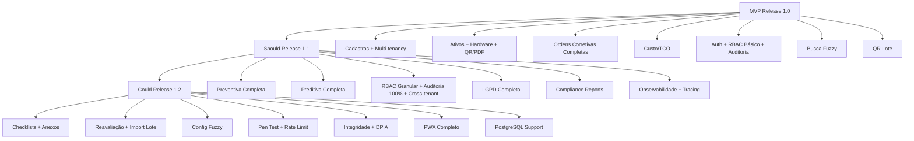

# Story Map & Slicing Strategy — Aegis1 (Regenerado com AST Java)

> **Versão:** 2.0 · **Status:** Draft · **Owner:** Product / Arquitetura
> **Base:** Use Cases v2.0 + User Flows v2.0 + Glossário + BRD v2.0 + NFR v2.0
> **Metodologia:** User Story Mapping (Jeff Patton) — Eixo horizontal = jornada do usuário; Eixo vertical = priorização por release/slice (MoSCoW)
> **Cobertura:** Frontend (Vue 3/PWA) + Backend (Java 21/Spring Boot 3.3) — domínio completo extraído via AST

---

## 1. Backbone (Atividades do Usuário — Jornada Completa)

```
Gerenciar Cadastros Mestres → Gerenciar Ativos & Hardware → Criar Ordem (Corretiva/Preventiva/Preditiva)
    → Executar Ordem (Iniciar/Concluir) → Aprovar Ordem → Visualizar Custos & TCO por Ativo
    → Manutenção Preventiva (Agendar + Geração Auto) → Manutenção Preditiva (Health Check + Previsão + Ordem Auto)
    → Busca Inteligente (Fuzzy Global) → Segurança & Aegis Shield (Auth, RBAC, Multi-tenancy, Auditoria)
    → Relatórios & QR/PDF (Termo Responsabilidade, Etiquetas Lote, Compliance)
    → LGPD & Compliance (Esquecimento, Portabilidade, Integridade)
```

---

## 2. Horizontal Axis (User Journey Steps — Detalhado)

| Etapa | Objetivo do Usuário | Tarefas Associadas (Use Cases) | Domínio |
| :--- | :--- | :--- | :--- |
| **Gerenciar Cadastros Mestres** | Manter dados de referência consistentes (filiais, departamentos, fornecedores, funcionários, tipos de ativo) com isolamento multi-tenant | UC-01 a UC-05 | Cadastros |
| **Gerenciar Ativos & Hardware** | Cadastrar ativos completos com detalhes de hardware (CPU, memória, discos, rede), depreciação automática, QR Code, Termo PDF, transferência, baixa, TCO | UC-06 a UC-12 | Ativos |
| **Criar Ordem de Manutenção** | Registrar solicitação (corretiva/preventiva/preditiva) com ativo (busca fuzzy), descrição, prioridade, técnico, custos estimados | UC-13, UC-21 (preventiva), UC-27 (preditiva auto) | Manutenção |
| **Executar Ordem (Iniciar/Concluir)** | Técnico inicia execução (valida BR-05), registra custos finais, conclui após aprovação | UC-14, UC-16 | Manutenção |
| **Aprovar Ordem** | Supervisor valida evidências (foto/checklist/assinatura) e autoriza fechamento | UC-15 | Manutenção |
| **Visualizar Custos & TCO** | Gestor consulta custoTotalPorAtivo consolidado + depreciação + TCO para decisões de substituição | UC-11 | Custos |
| **Manutenção Preventiva** | Agenda planos recorrentes (CRON); geração automática de ordens; relatório de aderência | UC-21 a UC-24 | Preventiva |
| **Manutenção Preditiva** | Coleta health check (SMART) em campo; regressão linear prevê falha disco; ordem preditiva automática; dashboard de riscos | UC-25 a UC-28 | Preditiva |
| **Busca Inteligente** | Busca global unificada fuzzy (Levenshtein) + filtros exatos + paginação; configuração de threshold | UC-29 a UC-31 | Busca |
| **Segurança Aegis Shield** | Login JWT + refresh; matriz RBAC granular (roles × permissions × contexto filial); multi-tenancy; auditoria Envers | UC-32 a UC-38 | Segurança |
| **Relatórios & QR/PDF** | Termo Responsabilidade PDF (assinatura), Etiquetas QR Code lote, Dashboards, Compliance (NR-10/12, LGPD, ISO 27001) | UC-39 a UC-42 | Relatórios |
| **LGPD & Compliance** | Direito ao esquecimento (anonimização + auditoria preservada), Portabilidade (export JSON), Validação integridade (checksums) | UC-43 a UC-45 | Compliance |

---

## 3. Vertical Axis (MoSCoW Slicing — Releases)

### Slice 1: MVP (Must Have) — **Release 1.0** — *Core Patrimônio + Manutenção Corretiva + Auth Básico*

**Objetivo:** Jornada ponta-a-ponta funcional: cadastros → ativos com hardware → ordens corretivas (criar→iniciar→aprovar→concluir) → custoTotalPorAtivo → auth JWT + multi-tenancy básico + busca fuzzy + QR Code/PDF básico. Sem console logs. Cobertura testes ≥ 80%.

| ID | Story | Atividade (Backbone) | Critério de Aceite (Resumido) | Esforço |
| :--- | :--- | :--- | :--- | :--- |
| **MVP-CAD-001** | CRUD Filiais (Admin Global) | Gerenciar Cadastros | Criar/listar/editar/excluir filial; validação CNPJ único; exclusão bloqueada se vínculos | M |
| **MVP-CAD-002** | CRUD Departamentos (scoped filial) | Gerenciar Cadastros | CRUD scoped à filial selecionada; multi-tenancy filter ativo | M |
| **MVP-CAD-003** | CRUD Fornecedores (categoria, SLA, avaliação) | Gerenciar Cadastros | CRUD com campos estendidos; scoped filial | M |
| **MVP-CAD-004** | CRUD Funcionários + provisionamento Usuario | Gerenciar Cadastros | CRUD + função manutenção (TECNICO/APROVADOR/SOLICITANTE) + cria Usuario + credenciais | L |
| **MVP-CAD-005** | CRUD Tipos de Ativo (vida útil, valor residual, requer hardware) | Gerenciar Cadastros | CRUD; usado em depreciação automática | S |
| **MVP-ASV-001** | Cadastrar Ativo Completo (básico + hardware opcional) | Gerenciar Ativos | Tag único, serial, modelo, fabricante, data/valor aquisição, filial/depto/local, responsável, fornecedor; depreciação linear automática | L |
| **MVP-ASV-002** | Detalhe Hardware (Discos, Memória, CPU, Rede) | Gerenciar Ativos | CRUD componentes vinculados ao ativo; validação BR-02 (obrigatório se TipoAtivo.requerHardware) | L |
| **MVP-ASV-003** | QR Code Unitário + Termo Responsabilidade PDF | Gerenciar Ativos | Gera QR Code (tag+URL+hash) + PDF Termo (dados ativo + responsável + QR + hash); download/impressão | M |
| **MVP-ASV-004** | Transferência de Ativo + Novo Termo | Gerenciar Ativos | Mudança filial/depto/local → novo Termo PDF → auditoria | M |
| **MVP-ASV-005** | Baixa/Desativação Ativo + TCO Final | Gerenciar Ativos | Status BAIXADO; bloqueia novas ordens; custoTotalPorAtivo final consolidado | S |
| **MVP-ORD-001** | Criar Ordem Corretiva (busca fuzzy ativo) | Criar Ordem | Formulário com busca fuzzy ativo; prioridade; técnico; valida BR-05 (técnico alocado) → estado ABERTA | L |
| **MVP-ORD-002** | Listar/Buscar Ordens (filtros + paginação + fuzzy) | Criar Ordem | Filtros: estado, prioridade, filial, técnico, ativo (fuzzy), período; paginação server-side | M |
| **MVP-ORD-003** | Iniciar Ordem (Técnico) | Executar Ordem | Botão só se ABERTA + técnico alocado; PATCH /iniciar → EM_ANDAMENTO + timestamp | M |
| **MVP-ORD-004** | Aprovar Ordem (Evidência obrigatória) | Aprovar Ordem | Modal evidência (foto/checklist/assinatura); valida BR-06; APROVADA | M |
| **MVP-ORD-005** | Concluir Ordem (Custos finais + custoTotalPorAtivo) | Executar Ordem | Form custos (mão de obra, material, terceiros); só se APROVADA; CONCLUIDA + atualiza custoTotalPorAtivo | L |
| **MVP-ORD-006** | Cancelar Ordem (qualquer exceto CONCLUIDA) | Executar Ordem | Motivo obrigatório; CANCELADA; não afeta custoTotalPorAtivo | S |
| **MVP-CUST-001** | Dashboard Custo por Ativo (TCO) | Visualizar Custos | Lista paginada: ativo, valor aquisição, depreciação acumulada, valor contábil, custoTotalPorAtivo, TCO; drill-down ordens | M |
| **MVP-SRC-001** | Login JWT + Refresh Token (HttpOnly cookie) | Segurança | POST /auth/login → access 15min + refresh cookie; authInterceptor anexa Bearer; refresh automático 1x | L |
| **MVP-SRC-002** | Multi-tenancy Básico (Filial no contexto) | Segurança | Header/contexto define filial; Hibernate Filter WHERE filial_id = ?; Admin Global vê todas | L |
| **MVP-SRC-003** | RBAC Básico (Roles: ADMIN, GESTOR, TECNICO, USER) | Segurança | Permissões por role; contexto filial; AegisShieldPermissionEvaluator | M |
| **MVP-SRC-004** | Auditoria Envers (Ativo, Ordem, Usuario) | Segurança | CREATE/UPDATE/DELETE auditados; diff campo-a-campo; consulta /auditoria | M |
| **MVP-BUS-001** | Busca Global Fuzzy (Levenshtein) | Busca Inteligente | GET /busca?q=...&types=ativo,ordem,funcionario,fornecedor; distance ≤ 2; highlight; paginação | L |
| **MVP-REL-001** | Etiquetas QR Code Lote (filtros + PDF A4) | Relatórios | Filtros filial/tipo/status → PDF 24 etiquetas/folha; QR Code URL pública read-only | M |
| **MVP-TEC-001** | Refatorar `request` (complexidade 13 → funções menores) | Transversal | retry, timeout, parsing, auth separados; ciclomática ≤ 10 | M |
| **MVP-TEC-002** | Remover 3 `console.*` residuais (`api.js:26,49,52`) | Transversal | Zero console.* em build produção; ESLint no-console error | S |
| **MVP-TEC-003** | `handleApiError` padronizado (401→refresh, 409→regra, 5xx→amigável) | Transversal | Mapeamento completo; toast amigável; Sentry em prod | M |
| **MVP-TEC-004** | TestContainers MySQL + CI (coverage ≥ 80%) | Transversal | Testes integração reais; Flyway migrate; gate CI coverage | L |
| **MVP-TEC-005** | OpenAPI 3.1 + Contract Tests (Pact) | Transversal | Spec versionado; validação CI frontend↔backend | M |

---

### Slice 2: Should Have — **Release 1.1** — *Preventiva + Preditiva Básica + RBAC Granular + Auditoria Completa + LGPD*

**Objetivo:** Manutenção preventiva agendada + preditiva (health check + regressão linear + ordem auto) + RBAC granular (matriz permissions × contexto) + auditoria completa Envers (todas entidades) + LGPD (esquecimento/portabilidade) + relatórios compliance.

| ID | Story | Atividade | Critério de Aceite | Esforço |
| :--- | :--- | :--- | :--- | :--- |
| **SH-PRE-001** | Cadastrar Plano Preventivo (CRON + técnico padrão) | Preventiva | Frequência CRON; próximo agendamento calculado; ativo(s) ou TipoAtivo+filial | M |
| **SH-PRE-002** | Scheduler Geração Automática Ordens Preventivas | Preventiva | Job 15min; cria ordem PREVENTIVA ABERTA; notifica técnico; atualiza próxima execução | M |
| **SH-PRE-003** | Gerenciar Planos (Editar, Pausar, Excluir bloqueada se ordens) | Preventiva | CRUD + pause (ativo=false); exclusão bloqueada se ordens geradas | S |
| **SH-PRE-004** | Relatório Aderência Preventiva (% prazo) | Preventiva | Filtros filial/período/tipo; export PDF/CSV; evidência NR-10/12 | M |
| **SH-PRD-001** | Health Check Coleta (PWA mobile + QR Code) | Preditiva | Técnico escaneia QR → PWA → preenche SMART → POST /health-check → score 0-100 | L |
| **SH-PRD-002** | Health Check Offline-First (IndexedDB + Sync) | Preditiva | Service Worker + IndexedDB; salva local se offline; sync automático online | M |
| **SH-PRD-003** | Regressão Linear Falha Disco (Batch Noturno) | Preditiva | Job 02:00; ≥3 health checks; Mínimos Quadrados (reallocated_sectors vs hours); IC 95% | L |
| **SH-PRD-004** | Ordem Preditiva Automática (prob > 80% < 30 dias) | Preditiva | Cria ordem PREDITIVA ALTA/CRITICA; notifica; dashboard alerta | M |
| **SH-PRD-005** | Dashboard Preditivo (Riscos + Drill-down) | Preditiva | Cards: monitorados, alertas, ordens preditivas, previsões <30d; tabela com IC 95%; ação "Agendar Substituição" | M |
| **SH-SRC-001** | Matriz RBAC Granular (Permissions × Contexto) | Segurança | Admin Global edita matriz Role × Permission × Contexto (Global/Filial); valida consistência | L |
| **SH-SRC-002** | Auditoria Envers 100% Entidades + Export Assinado | Segurança | Todas entidades domínio auditadas; export PDF/CSV assinado digitalmente | M |
| **SH-SRC-003** | Troca Contexto Filial (Admin Global) + Auditoria Troca | Segurança | Seletor filial no header; MultiTenancyFilter; log troca contexto | S |
| **SH-SRC-004** | Acessos Negados / Cross-tenant Leak Detection | Segurança | Log AccessDeniedException + tentativas cross-tenant; alerta >10/min; SIEM integration | M |
| **SH-LGD-001** | LGPD: Anonimização (Esquecimento) + Auditoria Preservada | Compliance | POST /usuarios/me/solicitar-exclusao → anonimiza (hash) + mantém Envers com hash; revoga tokens | M |
| **SH-LGD-002** | LGPD: Portabilidade (Export JSON Completo) | Compliance | GET /usuarios/me/exportar → JSON perfil, ordens, ativos, health checks, auditoria | S |
| **SH-REL-001** | Termo Responsabilidade Assinatura Digital (Placeholder ICP-Brasil) | Relatórios | Campo assinatura digital no PDF; integração futura gov.br/ICP-Brasil | M |
| **SH-REL-002** | Relatórios Compliance (NR-10/12, LGPD, ISO 27001) | Relatórios | PDF estruturado com evidências; assinatura responsável | M |
| **SH-TEC-001** | Observabilidade: Prometheus/Grafana + Alertas | Transversal | Golden Signals por endpoint; Business KPIs; Alertmanager rules (erro>1%, latência>500ms, preditiva>threshold) | L |
| **SH-TEC-002** | Tracing Distribuído (trace-id header propagado) | Transversal | 100% mutações cobertas; correlation ID logs | M |

---

### Slice 3: Could Have — **Release 1.2** — *Maturidade Operacional + PWA Avançado + Compliance Avançado*

| ID | Story | Atividade | Critério de Aceite | Esforço |
| :--- | :--- | :--- | :--- | :--- |
| **CO-ORD-001** | Checklists Digitais Configuráveis por Tipo Manutenção | Executar Ordem | Backend: estrutura checklist; Frontend: renderiza + coleta assinatura | L |
| **CO-ORD-002** | Anexos Fotográficos (Upload + Preview) | Aprovar/Concluir | Endpoint upload; preview frontend; vincula à ordem | M |
| **CO-ASV-001** | Reavaliação de Ativo (Valor/Residual) + Depreciação Recalculada | Gerenciar Ativos | Atualiza valor/residual → recalcula depreciação futura; auditoria | M |
| **CO-ASV-002** | Importação em Lote Ativos (CSV/Excel + Validação) | Gerenciar Ativos | Template download; validação linha a linha; relatório erros; transacional | L |
| **CO-BUS-001** | Configuração Threshold Fuzzy (Admin) + Reload Runtime | Busca | UI: threshold 0.5-0.9, campos indexados, pesos boost; @RefreshScope | S |
| **CO-SEC-001** | Pen Test Automatizado CI (ZAP/CodeQL) + Block Deploy | Segurança | DAST+SAST em staging; falha crítica/alta = block | M |
| **CO-SEC-002** | Rate Limiting API Gateway (IP/Usuário) | Segurança | 100 req/min auth, 500 req/min API; config por endpoint | S |
| **CO-CMP-001** | Validação Integridade Checksums (Batch Semanal) | Compliance | SHA-256 tabelas críticas; compara baseline; alerta crítico se divergência | M |
| **CO-CMP-002** | DPIA Automatizado + Registro Tratamento | Compliance | Gera relatório DPIA baseado em entidades + fluxos; versionado | M |
| **CO-PWA-001** | PWA Completo: Manifest, SW, Push Notifications, Background Sync | Transversal | Install prompt; push ordens/alertas; background sync health checks | L |
| **CO-TEC-001** | Migração PostgreSQL Suportada (Flyway Dialect Abstraction) | Transversal | Testado em CI; documentação migração | M |

---

### Won't Have (Fora do Escopo Atual)

* **App Mobile Nativo** (iOS/Android nativo) — Roadmap futuro; v1 = PWA responsivo + offline-first
* **Módulo Compras/Estoque Peças Avançado** — Apenas fornecedores como cadastro
* **BI/Analytics Avançado** — Apenas dashboards e indicadores definidos
* **Integração Sensores IoT Externos** — Health check usa dados do próprio ativo (SMART/WMI)
* **Multi-idioma / White-label** — v1 apenas pt-BR
* **Anomaly Detection ML Avançado** — Além de regressão linear (futuro: isolation forest, LSTM)

---

## 4. Mapa Visual (Matriz Completa — Resumo)

| | Cadastros Mestres | Ativos & Hardware | Ordens Corretivas | Preventiva | Preditiva | Busca Fuzzy | Segurança Aegis | Relatórios QR/PDF | LGPD/Compliance |
| :--- | :--- | :--- | :--- | :--- | :--- | :--- | :--- | :--- | :--- |
| **MVP** | CAD-001 a 005 | ASV-001 a 005 | ORD-001 a 006 | — | — | BUS-001 | SRC-001 a 004 | REL-001 | — |
| **MVP (Técnico)** | TEC-001 a 005 | | | | | | | | |
| **Should** | — | — | — | PRE-001 a 004 | PRD-001 a 005 | — | SRC-001 a 004 | REL-001 a 002 | LGD-001 a 002 |
| **Should (Técnico)** | TEC-001 a 002 | | | | | | | | |
| **Could** | — | ASV-001 a 002 | ORD-001 a 002 | — | — | BUS-001 | SEC-001 a 002 | — | CMP-001 a 002 |
| **Could (PWA)** | PWA-001 | | | | | | | | |

---

## 5. Dependências Entre Slices



---

## 6. Métricas de Release (Definition of Done por Slice)

| Slice | Métricas Obrigatórias | Gate de Release |
| :--- | :--- | :--- |
| **MVP** | Coverage ≥ 80%; Zero console.*; Zero vuln crítica/alta; OpenAPI validado; Contract tests pass; TestContainers pass; Performance P95 < 800ms (frontend) / < 500ms (backend); Multi-tenancy test cross-tenant pass | **Deploy Staging → Smoke Tests → Deploy Prod** |
| **Should** | Métricas MVP + Preditiva precision ≥ 70% (validação histórica); RBAC matrix 100% testada; Auditoria 100% entidades; LGPD fluxo completo testado; Alertas observabilidade funcionando | **Deploy Staging → Pen Test → Deploy Prod** |
| **Could** | Métricas Should + PWA installable + push working; Checksums integridade OK; DPIA versionado; PostgreSQL CI pass | **Deploy Staging → Load Test → Deploy Prod** |

---

*Documento regenerado com base em análise AST completa do backend Java (domain, service, controller, security, predictive, search, audit, report, scheduler) + frontend Vue/PWA. Substitui versão 1.0 que continha apenas visão frontend e escopo reduzido.*