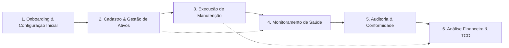

# Story Map & Slicing Strategy — Aegis Patrimônio

> Baseado na metodologia de *User Story Mapping* (Jeff Patton). O eixo horizontal representa a jornada do usuário; o eixo vertical representa a priorização por release/slice.

## 1. Backbone (Atividades do Usuário)
**Gestão de Ativos** → **Gestão Organizacional** → **Controle de Acesso (RBAC)** → **Manutenção & Workflow** → **Monitoramento & Alertas** → **Relatórios Financeiros**

## 2. Horizontal Axis (User Journey Steps)

| Etapa | Objetivo do Usuário | Tarefas Associadas |
| :--- | :--- | :--- |
| **1. Onboarding & Configuração Inicial** | Configurar a estrutura organizacional e permissões para operar o sistema | Cadastrar filiais, departamentos, tipos de ativo, fornecedores; criar roles/permissões; provisionar usuários admin |
| **2. Cadastro & Gestão de Ativos** | Registrar, localizar e manter atualizado o inventário de bens patrimoniais | Criar/listar/buscar/atualizar/deletar ativos; associar localização, departamento, filial, fornecedor; registrar depreciação |
| **3. Execução de Manutenção** | Solicitar, aprovar, executar e concluir manutenções preventivas/corretivas | Abrir solicitação; fluxo de aprovação (iniciar→aprovar→concluir/cancelar); registrar custos (peças, mão de obra, terceiros); histórico por ativo |
| **4. Monitoramento de Saúde (Health Checks)** | Acompanhar indicadores de hardware (disco, memória, rede) e receber alertas preditivos | Agendar/coletar health checks; visualizar histórico; configurar thresholds; receber/ler alertas de uso de recursos |
| **5. Auditoria & Conformidade** | Garantir trilha imutável de todas as operações sensíveis para compliance | Consultar logs de auditoria (criar/atualizar/deletar/aprovar/concluir/cancelar); filtrar por usuário, entidade, período; exportar evidências |
| **6. Análise Financeira & TCO** | Calcular custo total de propriedade por ativo e subsidiar decisões de CAPEX/OPEX | Visualizar `custoTotalPorAtivo`; relatórios agregados por filial/departamento/tipo; exportar para contabilidade |

## 3. Vertical Axis (MoSCoW Slicing)

### Slice 1: MVP (Must Have) — Release 1 (Q2/2025)
* **Objetivo do slice:** Entregar jornada ponta-a-ponta mínima: configurar organização → cadastrar ativos → abrir/aprovar/concluir manutenção → consultar custo total por ativo → trilha de auditoria básica. Permite piloto em 1 filial (500 ativos, 20 usuários).
* **Stories:**
  - **REQ-001** — Cadastrar Filial, Departamento, Tipo de Ativo, Fornecedor (CRUD mestre) — *Etapa 1*
  - **REQ-002** — RBAC: criar Role, Permission, Usuario; login JWT; regras `*_comAdmin_deveRetornarCreated` / `*_comUser_deveRetornarForbidden` — *Etapa 1*
  - **REQ-003** — CRUD Ativo (create/listar/buscar/atualizar/deletar) com associações (filial, depto, tipo, fornecedor) — *Etapa 2*
  - **REQ-004** — Solicitação de Manutenção: iniciar → aprovar → concluir/cancelar; especificação de busca (status, filial, depto, tipo, período, prioridade) — *Etapa 3*
  - **REQ-005** — Registro de custos de manutenção (peças, mão de obra, terceiros) vinculados ao ativo — *Etapa 3*
  - **REQ-006** — `custoTotalPorAtivo` (soma de custos agrupada por ativo) via API e relatório — *Etapa 6*
  - **REQ-007** — Auditoria: tabela `audit_log` append-only populada em criar/atualizar/deletar/aprovar/concluir/cancelar (usuario_id, timestamp, entidade, entidade_id, acao, valores_anteriores, valores_novos) — *Etapa 5*
  - **REQ-008** — Frontend: serviço `request` com authInterceptor, handleApiError, handleResponse; remoção de `console.*` — *Transversal*

### Slice 2: Should Have — Release 2 (Q3/2025)
* **Objetivo do slice:** Habilitar monitoramento preditivo de hardware, gestão de funcionários/usuários finais, expansão para 5 filiais (3.000 ativos, 100 usuários).
* **Stories:**
  - **REQ-009** — Health Check de Hardware: `updateHealthCheck` (coleta adaptadores de rede, discos, memórias); `getHealthHistory`; limpeza em cascata (`deleteByAtivoDetalheHardwareId`) — *Etapa 4*
  - **REQ-010** — Alertas de Recursos: `checkResourceUsageAlerts` (disco >85%, memória >90%, latência rede >100ms); `listarAlertas`, `getRecentAlerts`, `markAsRead`; thresholds configuráveis por tipo de ativo — *Etapa 4*
  - **REQ-011** — Gestão de Funcionários: `createFuncionario`, `createFuncionarioAndUsuario`; vincular ativos a responsável — *Etapa 1/2*
  - **REQ-012** — Portal do Usuário Final: visualizar ativos sob responsabilidade; abrir solicitação de manutenção; acompanhar status; notificações — *Etapa 3*
  - **REQ-013** — Migração de dados legados: template CSV + script de importação para ativos, filiais, departamentos — *Etapa 1*
  - **REQ-014** — Testes automatizados: cobertura ≥80% em serviços refatorados (`AlertNotificationService`, `ManutencaoSpecification`, `AtivoMapper`, `api.js`) — *Transversal*

### Slice 3: Could Have — Backlog (Q4/2025+)
* **Objetivo do slice:** Refinamentos de usabilidade, relatórios avançados, preparação para auditoria SOX/LGPD corporativa.
* **Stories:**
  - **REQ-015** — Dashboard executivo: ativos sob gestão ativa com health check ≤30 dias / total cadastrados (North Star Metric) — *Etapa 6*
  - **REQ-016** — Relatórios avançados: TCO por filial/departamento/tipo; depreciação acumulada; previsão de renovação — *Etapa 6*
  - **REQ-017** — Exportação de `audit_log` em formato imutável (WORM) para compliance — *Etapa 5*
  - **REQ-018** — Integração LDAP/AD para `createUsuario`/`createFuncionarioAndUsuario` (substituir `mockLogin`) — *Etapa 1*
  - **REQ-019** — Agendador nativo de health checks (Spring `@Scheduled` ou Quartz) com idempotência — *Etapa 4*
  - **REQ-020** — Pipeline CI/CD: build, test, SAST, deploy (GitHub Actions/GitLab CI) — *Transversal*

### Won't Have (Neste Ciclo)
* **REQ-W01** — Gestão de contratos/licenças de software (SAM) — *Fora de escopo (BRD Seção 5)*
* **REQ-W02** — Integração com ERP financeiro (contabilidade, contas a pagar) — *Fora de escopo; apenas exportação de relatórios*
* **REQ-W03** — App mobile nativo / offline-first para técnicos — *Fora de escopo; apenas web responsiva*
* **REQ-W04** — Multi-tenancy (SaaS) — *Single-tenant on-premise/cloud privado*
* **REQ-W05** — IA/ML avançada para previsão de falha — *Apenas thresholds estáticos configuráveis; ML avaliado em roadmap futuro*
* **REQ-W06** — Portal de fornecedores para cotação/ordem de serviço — *Future Consideration*
* **REQ-W07** — BI embarcado (Metabase/Superset) — *Future Consideration*

## 4. Mapa Visual (Matriz Completa)

| | **1. Onboarding & Configuração** | **2. Cadastro & Gestão de Ativos** | **3. Execução de Manutenção** | **4. Monitoramento de Saúde** | **5. Auditoria & Conformidade** | **6. Análise Financeira & TCO** |
| :--- | :--- | :--- | :--- | :--- | :--- | :--- |
| **MVP** | REQ-001 REQ-002 | REQ-003 | REQ-004 REQ-005 | — | REQ-007 | REQ-006 |
| **Should** | REQ-011 REQ-013 | — | REQ-012 | REQ-009 REQ-010 | — | — |
| **Could** | REQ-018 REQ-020 | — | — | REQ-019 | REQ-017 | REQ-015 REQ-016 |

## 5. Critérios de Corte entre Releases
* **Definição de "Pronto para Lançar" (DoR/DoD combinado):** Um slice só avança para produção quando:
  1. Cobre a jornada ponta-a-ponta mínima (Onboarding → Ativo → Manutenção → Custo → Auditoria) para o MVP; para Should/Could, estende a jornada sem quebrar o fluxo anterior.
  2. Todos os critérios de aceitação das stories do slice estão validados em ambiente de homologação (dados de produção anonimizados).
  3. Testes de contrato da API (`request` + `authInterceptor`) passam; zero `console.*` residual no frontend.
  4. `audit_log` registra 100% das operações de escrita do slice (validação automatizada via teste de integração).
  5. Performance: latência P95 da API `request` ≤ 500ms; taxa de erro 5xx em `checkResourceUsageAlerts` < 0,1%.
  6. Documentação atualizada: runbooks de deploy/restore/health check, matriz de permissões RBAC, guia de migração CSV.
  7. Aprovação do Product Owner + Security/Compliance Lead (para slices que tocam auditoria/RBAC).

## 6. Riscos de Slicing

| Risco | Impacto | Mitigação |
| :--- | :--- | :--- |
| **MVP sem Health Checks/Alertas (Etapa 4)** | Usuários piloto (Analistas de Manutenção) não terão monitoramento preditivo; valor "North Star Metric" inalcançável no piloto. | Comunicar explicitamente: piloto valida fluxo de manutenção reativa + auditoria + TCO; health checks entram no Release 2. Incluir KPI de "manutenções corretivas vs. preventivas" apenas a partir do Release 2. |
| **Complexidade ciclomática alta em `AlertNotificationService` (17) e `ManutencaoSpecification` (14) no Should** | Atraso no Release 2 se refatoração + testes não forem feitas na Sprint 0/1. | **Ação obrigatória na Sprint 0:** refatorar ambos em métodos menores + testes unitários (cobertura ≥80%) antes de iniciar stories REQ-009/REQ-010. Bloquear Should se não estiver pronto. |
| **Ausência de ORM / banco não definido** | Risco de retrabalho em REQ-003, REQ-007, REQ-009 se modelo de dados mudar. | Definir motor (PostgreSQL recomendado) + estratégia de migração (Flyway) na Sprint 0; adotar JPA/Hibernate ou jOOQ. Travar schema antes do MVP. |
| **`setUsername` stub vazio em `Usuario.java:86`** | Pode quebrar `createFuncionarioAndUsuario` / `createUserAndToken` no MVP. | Corrigir + teste de regressão na Sprint 0; validar fluxo de provisionamento de usuários (REQ-002). |
| **Frontend sem build/test pipeline visível** | Entrega do MVP (REQ-008) e Should (REQ-012) em risco de qualidade. | Configurar Vite + Vitest + ESLint + CI na Sprint 0 (REQ-020 antecipado para infra do MVP). |
| **Single point of failure (monolito sem HA)** | RTO/RPO não atendidos em produção; piloto pode virar incidente. | Documentar RTO<4h / RPO<24h; backup diário + runbook de restore testado antes do piloto. Avaliar read-replica apenas para relatórios (Release 2+). |
| **Escopo de alertas limitado a thresholds estáticos** | Falsos positivos/negativos em hardware heterogêneo; confiança dos analistas reduzida. | Thresholds configuráveis por `TipoAtivo` (REQ-010); coletar feedback no piloto para calibrar; roadmap Q4 para ML simples (isolation forest sobre `getHealthHistory`). |

---

> **Rastreabilidade:** Todas as stories derivam diretamente das regras de negócio (BR-01 a BR-10), glossário (30+ operações) e escopo in-scope/out-of-scope do BRD v1.0. Itens marcados com **[INFERIDO POR IA — REQUER VALIDAÇÃO HUMANA]** correspondem a estimativas de esforço, sequenciamento de releases e critérios de corte não explicitados no BRD — premissas: equipe 3B/2F/1QA/1DevOps, monolito Java+JS, deploy container/VM, piloto 1 filial Q2.