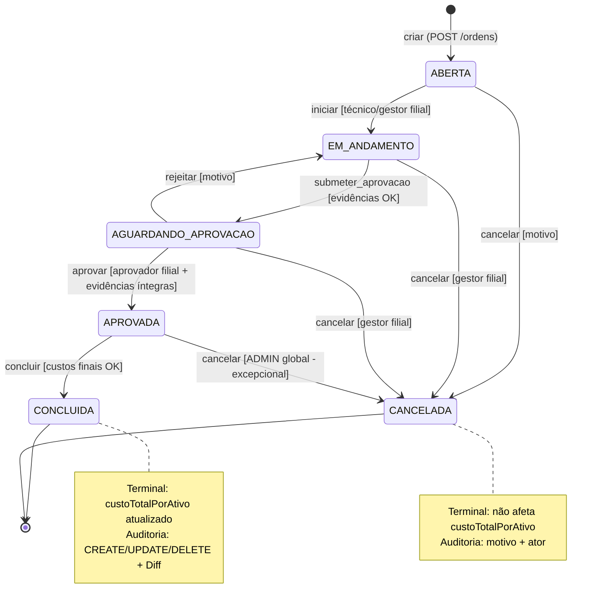
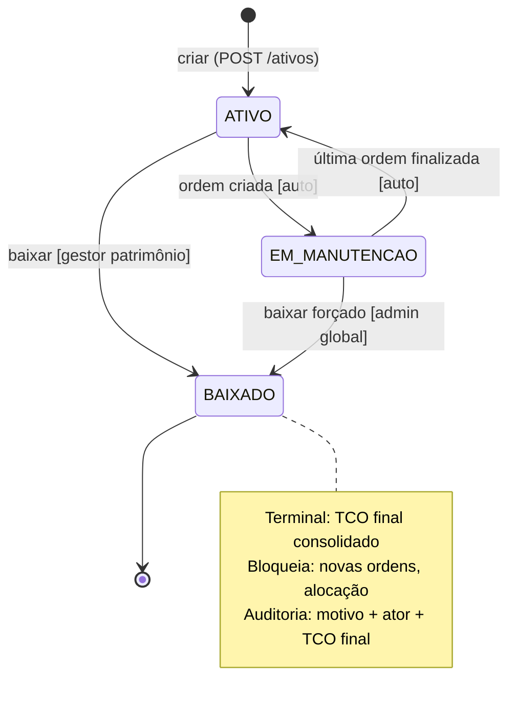
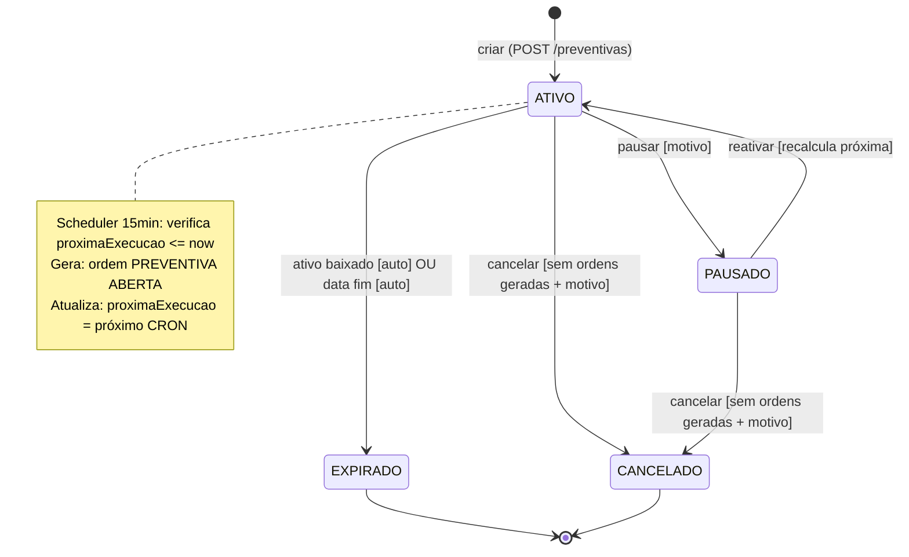
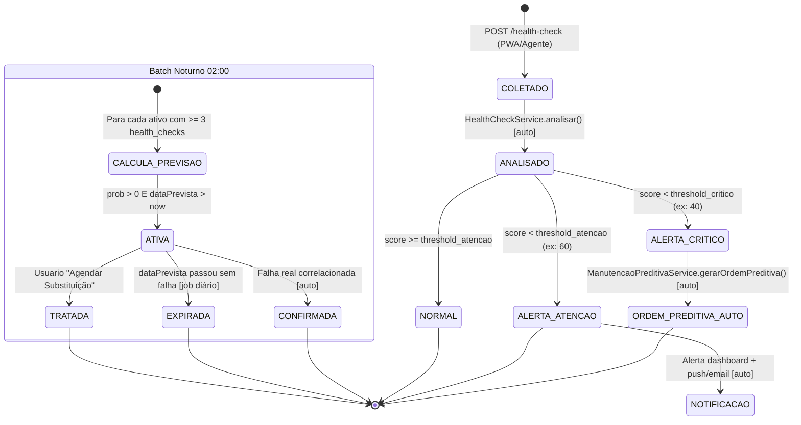
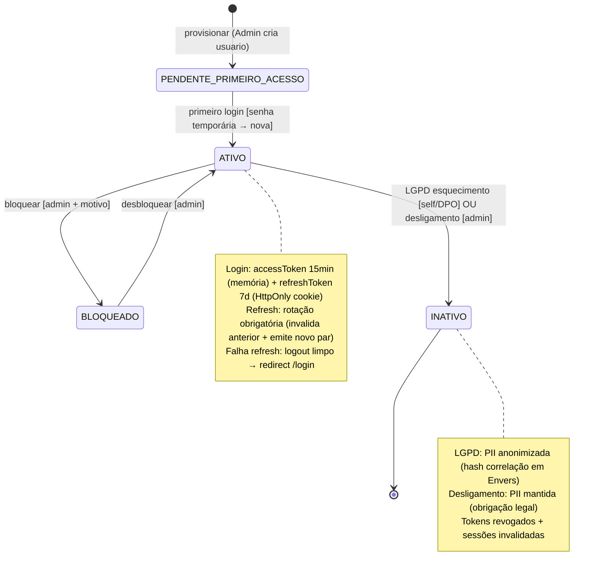
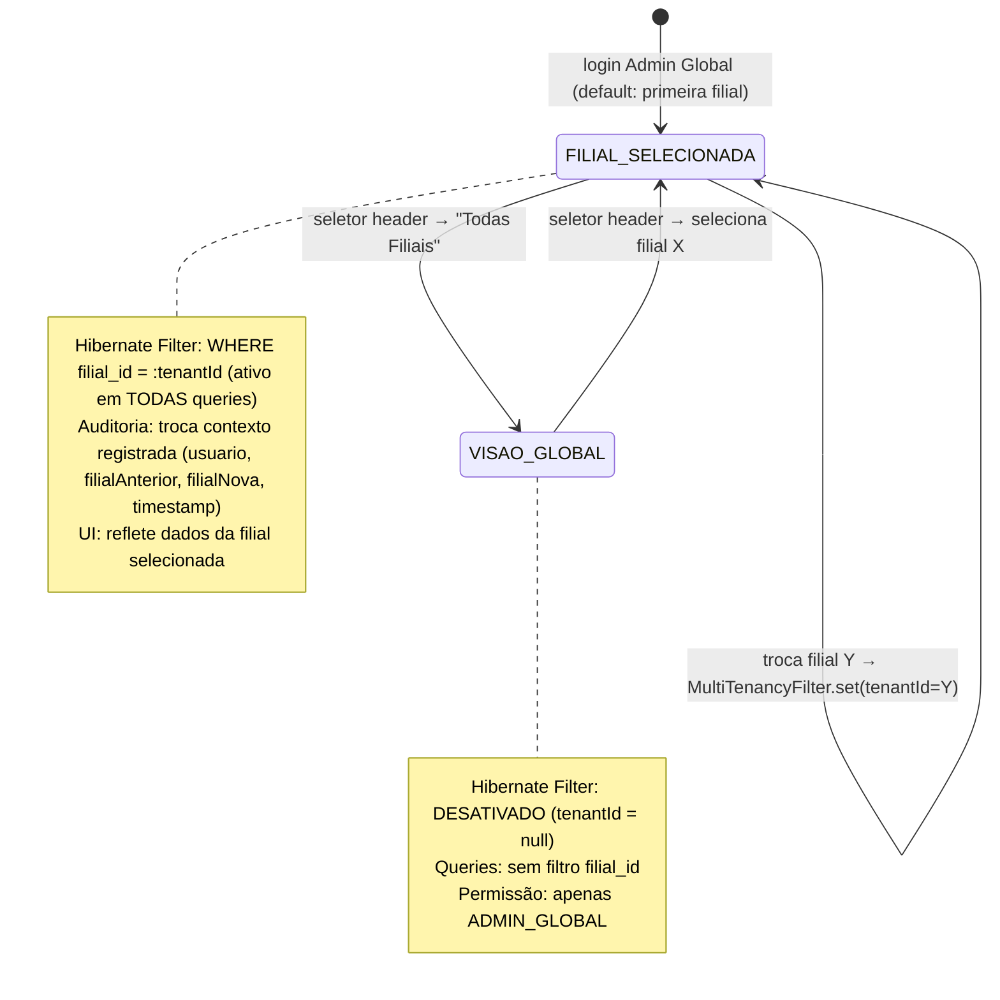
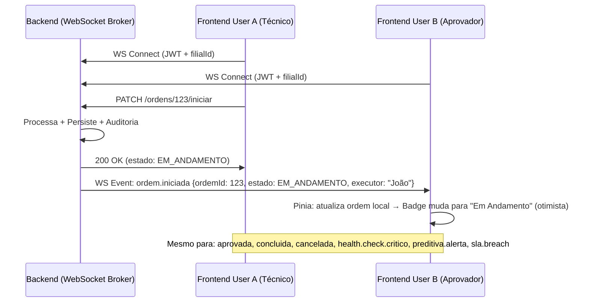

# Formal State Machine (FSM) Specifications — Aegis1

> **Versão:** 2.0 · **Owner:** Arquitetura/Backend Lead · **Status:** Draft
> **Base:** Use Cases v2.0 + System Architecture v2.0 + Domain Model (AST Java)
> **Cobertura:** Todas entidades de domínio com ciclo de vida (Backend + Frontend)
> **Notação:** Mermaid stateDiagram-v2 + Transition Matrix + Guards + Side Effects

---

## 1. SolicitacaoManutencao (Ordem de Manutenção) — Core Domain

### 1.1 Estados Válidos

| Estado | Descrição | Tipo Ordem | Terminal? |
| :--- | :--- | :--- | :--- |
| `ABERTA` | Ordem criada, aguardando técnico iniciar | CORRETIVA, PREVENTIVA, PREDITIVA | Não |
| `EM_ANDAMENTO` | Técnico iniciou execução | Todas | Não |
| `AGUARDANDO_APROVACAO` | Técnico submeteu evidências, aguarda aprovação | CORRETIVA, PREVENTIVA | Não |
| `APROVADA` | Aprovador validou evidências | CORRETIVA, PREVENTIVA | Não |
| `CONCLUIDA` | Ordem finalizada com custos; `custoTotalPorAtivo` atualizado | Todas | **Sim** |
| `CANCELADA` | Cancelada antes de CONCLUIDA (motivo obrigatório) | Todas | **Sim** |

### 1.2 Matriz de Transições (Backend + Frontend)

| Estado Atual | Evento (Endpoint) | Próximo Estado | Guarda (Condição) | Side Effects | Permissão (Aegis Shield) |
| :--- | :--- | :--- | :--- | :--- | :--- |
| `ABERTA` | `PATCH /iniciar` | `EM_ANDAMENTO` | `estado == ABERTA` ∧ `tecnicoResponsavel == usuarioLogado` ∨ `role == GESTOR_FILIAL` | `dataInicio = now()`, `executorId = usuarioLogado`, auditoria | `ORDEM_INICIAR` (filial) |
| `EM_ANDAMENTO` | `PATCH /submeter-aprovacao` | `AGUARDANDO_APROVACAO` | `evidencias.valido == true` (checklist + foto/assinatura) | `dataSubmissaoAprovacao = now()`, notifica aprovadores | `ORDEM_CONCLUIR` (própria) |
| `AGUARDANDO_APROVACAO` | `PATCH /aprovar` | `APROVADA` | `usuarioLogado.permissao == ORDEM_APROVAR` ∧ `filialMatch` ∧ `evidencias.integras` | `dataAprovacao = now()`, `aprovadorId = usuarioLogado`, notifica técnico | `ORDEM_APROVAR` (filial) |
| `AGUARDANDO_APROVACAO` | `PATCH /rejeitar` | `EM_ANDAMENTO` | `usuarioLogado.permissao == ORDEM_APROVAR` ∧ `motivoRejeicao != null` | `motivoRejeicao`, notifica técnico | `ORDEM_APROVAR` (filial) |
| `APROVADA` | `PATCH /concluir` | `CONCLUIDA` | `custosFinais.valido == true` (maoDeObra + materiais + terceiros) | `dataConclusao = now()`, `custosFinais`, **atualiza `custoTotalPorAtivo` do ativo**, verifica trigger preventiva | `ORDEM_CONCLUIR` (filial) |
| `ABERTA` | `PATCH /cancelar` | `CANCELADA` | `motivoCancelamento != null` | `dataCancelamento = now()`, `motivo`, **não afeta `custoTotalPorAtivo`** | `ORDEM_CANCELAR` (filial) |
| `EM_ANDAMENTO` | `PATCH /cancelar` | `CANCELADA` | `motivoCancelamento != null` ∧ (`role == GESTOR_FILIAL` ∨ `role == ADMIN`) | Idem + custo parcial registrado se houver | `ORDEM_CANCELAR` (filial) |
| `AGUARDANDO_APROVACAO` | `PATCH /cancelar` | `CANCELADA` | `motivoCancelamento != null` ∧ `role == GESTOR_FILIAL` | Idem + evidências arquivadas | `ORDEM_CANCELAR` (filial) |
| `APROVADA` | `PATCH /cancelar` | `CANCELADA` | `motivoCancelamento != null` ∧ `role == ADMIN_GLOBAL` (excepcional) | Idem + estorno custos se aplicável | `ORDEM_CANCELAR` (global) |

### 1.3 Transições Inválidas (Explícitas)

| De | Evento | Motivo |
| :--- | :--- | :--- |
| `CONCLUIDA` | qualquer | Estado terminal imutável (contabilidade) |
| `CANCELADA` | qualquer | Estado terminal |
| `ABERTA` | `aprovar`, `concluir` | Pula execução técnica obrigatória |
| `EM_ANDAMENTO` | `aprovar`, `concluir` | Pula evidências + aprovação (NR-10/12) |
| `AGUARDANDO_APROVACAO` | `iniciar`, `concluir` | Viola fluxo aprovação obrigatória |
| `APROVADA` | `iniciar`, `submeter_aprovacao`, `aprovar` | Estado pós-aprovação |

### 1.4 Diagrama Mermaid



### 1.5 Idempotência & Concorrência

- **Optimistic Locking:** Campo `version` (Long) em `SolicitacaoManutencao`; `If-Match: <version>` em `PATCH`; Conflito → `409 Conflict` + `ETag` atual.
- **Idempotency Key:** Header `Idempotency-Key` (UUID v4 gerado frontend por ação usuário); Backend armazena `idempotency_key` + `response` (24h); Duplicata → `200 OK` cached response.
- **Race Conditions:**
  1. Duplo clique "Iniciar" → 2 `PATCH /iniciar` simultâneas → 2ª recebe 409 (version mismatch)
  2. Aprovação concorrente (2 aprovadores) → Optimistic lock resolve; um recebe 409
  3. Cancelamento durante aprovação → Quem chega por último vence (lock); WebSocket notifica outro

---

## 2. Ativo (Asset) — Lifecycle

### 2.1 Estados Válidos

| Estado | Descrição | Terminal? |
| :--- | :--- | :--- |
| `ATIVO` | Ativo operacional, depreciando, alocado | Não |
| `EM_MANUTENCAO` | Ativo em ordem de manutenção aberta/em andamento | Não |
| `BAIXADO` | Fim de vida útil, desativado, TCO final consolidado | **Sim** |

### 2.2 Matriz de Transições

| Estado Atual | Evento | Próximo Estado | Guarda | Side Effects | Permissão |
| :--- | :--- | :--- | :--- | :--- | :--- |
| `ATIVO` | Ordem criada (qualquer tipo) | `EM_MANUTENCAO` | `ordem.estado IN (ABERTA, EM_ANDAMENTO, AGUARDANDO_APROVACAO, APROVADA)` | Trigger automático via `OrdemService` | Sistema (interno) |
| `EM_MANUTENCAO` | Última ordem → `CONCLUIDA` ou `CANCELADA` | `ATIVO` | `NOT EXISTS ordem WHERE ativo_id = ? AND estado NOT IN (CONCLUIDA, CANCELADA)` | Trigger automático | Sistema (interno) |
| `ATIVO` | `PATCH /baixar` | `BAIXADO` | `motivoBaixa != null` ∧ `role IN (GESTOR_PATRIMONIO, ADMIN)` | `dataBaixa = now()`, `motivoBaixa`, **TCO final consolidado**, bloqueia novas ordens | `ATIVO_EXCLUIR` (filial) |
| `EM_MANUTENCAO` | `PATCH /baixar` | `BAIXADO` | `motivoBaixa != null` ∧ `role == ADMIN_GLOBAL` (excepcional) | Força baixa + cancela ordens abertas | `ATIVO_EXCLUIR` (global) |

### 2.3 Diagrama



---

## 3. ManutencaoPreventiva (Plano Preventivo) — Scheduler

### 3.1 Estados Válidos

| Estado | Descrição | Terminal? |
| :--- | :--- | :--- |
| `ATIVO` | Plano ativo, gera ordens conforme CRON | Não |
| `PAUSADO` | Plano pausado manualmente, não gera ordens | Não |
| `EXPIRADO` | Plano expirado (data fim atingida ou ativo baixado) | **Sim** |
| `CANCELADO` | Cancelado manualmente (sem ordens geradas) | **Sim** |

### 3.2 Matriz de Transições

| Estado Atual | Evento | Próximo Estado | Guarda | Side Effects |
| :--- | :--- | :--- | :--- | :--- |
| `ATIVO` | `PATCH /pausar` | `PAUSADO` | `motivoPausa != null` | `proximaExecucao` mantida; não gera novas ordens |
| `PAUSADO` | `PATCH /reativar` | `ATIVO` | — | Recalcula `proximaExecucao` (próximo CRON ≥ now) |
| `ATIVO` | Scheduler detecta `ativo.baixado == true` | `EXPIRADO` | `ativo.status == BAIXADO` | Para geração; ordens existentes continuam |
| `ATIVO` | `PATCH /cancelar` | `CANCELADO` | `ordensGeradas.count == 0` ∧ `motivo != null` | Remove plano; sem ordens órfãs |
| `PAUSADO` | `PATCH /cancelar` | `CANCELADO` | `ordensGeradas.count == 0` ∧ `motivo != null` | Idem |
| `ATIVO` | Data fim atingida (`dataFim <= now`) | `EXPIRADO` | `dataFim != null` | Para geração |

### 3.3 Diagrama



---

## 4. HealthCheck / PrevisaoFalha (Manutenção Preditiva)

### 4.1 HealthCheck — Coleta de Métricas

| Estado | Descrição |
| :--- | :--- |
| `COLETADO` | Métricas SMART recebidas (manual PWA ou agente) |
| `ANALISADO` | Score 0-100 calculado + threshold verificado |
| `ALERTA_CRITICO` | Score < threshold crítico (ex.: 40) → Ordem preditiva auto |
| `ALERTA_ATENCAO` | Score < threshold atenção (ex.: 60) → Notificação apenas |

**Transições:** `COLETADO` → `ANALISADO` (auto, síncrono) → `ALERTA_CRITICO` | `ALERTA_ATENCAO` | `NORMAL` (score ≥ atenção)

### 4.2 PrevisaoFalha — Regressão Linear Batch

| Estado | Descrição |
| :--- | :--- |
| `ATIVA` | Previsão vigente (probabilidade > 0, data futura) |
| `TRATADA` | Ação tomada: "Agendar Substituição" → cria preventiva one-shot |
| `EXPIRADA` | Data prevista passou sem falha real (falso positivo) |
| `CONFIRMADA` | Falha real ocorreu antes da data prevista (verificação pós-fato) |

**Transições:**
- Batch noturno: Cria/Atualiza `ATIVA` (prob > 0, dataPrevista > now)
- `ATIVA` → `TRATADA`: Usuário clica "Agendar Substituição" (US-PRD-007)
- `ATIVA` → `EXPIRADA`: Job diário verifica `dataPrevista < now` ∧ `status == ATIVA` ∧ sem ordem correlacionada
- `ATIVA` → `CONFIRMADA`: Ordem real de falha de disco criada (correlação `previsao_falha_id`)

### 4.3 Diagrama Preditiva



---

## 5. Usuario (User) — Lifecycle + Auth

### 5.1 Estados Válidos

| Estado | Descrição | Terminal? |
| :--- | :--- | :--- |
| `ATIVO` | Usuário pode logar, acessar recursos conforme permissões | Não |
| `INATIVO` | Soft delete (LGPD anonimização ou desligamento); não loga | **Sim** |
| `BLOQUEADO` | Tentativas de login excedidas (brute force) ou admin bloqueou | Não |
| `PENDENTE_PRIMEIRO_ACESSO` | Usuario provisionado, senha temporária, aguarda primeiro login | Não |

### 5.2 Matriz de Transições

| Estado Atual | Evento | Próximo Estado | Guarda | Side Effects | Permissão |
| :--- | :--- | :--- | :--- | :--- | :--- |
| `PENDENTE_PRIMEIRO_ACESSO` | Primeiro login (senha temporária → nova senha) | `ATIVO` | `novaSenha.valida == true` | `senhaHash = hash(novaSenha)`, `primeiroAcesso = false`, revoga refresh tokens antigos | Usuario (self) |
| `ATIVO` | `POST /auth/login` (sucesso) | `ATIVO` | `credenciais.validas` | Emite `accessToken` (15min) + `refreshToken` (HttpOnly cookie 7d) | — |
| `ATIVO` | `POST /auth/refresh` | `ATIVO` | `refreshToken.valido ∧ !revogado` | **Rotação:** invalida refresh antigo + emite novo par (access + refresh) | — |
| `ATIVO` | `PATCH /bloquear` (Admin) | `BLOQUEADO` | `motivo != null` ∧ `role == ADMIN` | Revoga todos tokens; invalida sessões; `bloqueadoEm = now()` | `USUARIO_ATUALIZAR` (global) |
| `BLOQUEADO` | `PATCH /desbloquear` (Admin) | `ATIVO` | `role == ADMIN` | `bloqueadoEm = null` | `USUARIO_ATUALIZAR` (global) |
| `ATIVO` | `POST /usuarios/me/solicitar-exclusao` (LGPD) | `INATIVO` | `anonimizacao.sucesso == true` | **Anonimiza PII** (nome, email, CPF, telefone); `status = INATIVO`; Revoga tokens; **Envers preserva histórico + hash correlação** | Usuario (self) / DPO |
| `ATIVO` | `PATCH /inativar` (Admin - desligamento) | `INATIVO` | `motivo != null` ∧ `role == ADMIN` | `status = INATIVO`; Revoga tokens; Mantém PII (não LGPD) | `USUARIO_EXCLUIR` (global) |

### 5.3 Diagrama



---

## 6. Refresh Token — Lifecycle (Security)

### 6.1 Estados

| Estado | Descrição |
| :--- | :--- |
| `VALIDO` | Refresh token ativo, não expirado, não revogado, não usado |
| `USADO` | Refresh token consumido na rotação (invalidação imediata) |
| `REVOGADO` | Revogado manualmente (logout, bloqueio, LGPD, admin) |
| `EXPIRADO` | `expiracao < now()` (7 dias padrão) |

### 6.2 Transições

```mermaid
stateDiagram-v2
    [*] --> VALIDO: emitir (login ou refresh)
    
    VALIDO --> USADO: POST /auth/refresh [rotação: invalida + emite novo]
    VALIDO --> REVOGADO: logout / bloqueio / LGPD / admin revoke
    VALIDO --> EXPIRADO: expiracao < now() [job limpeza diário]
    
    USADO --> [*]
    REVOGADO --> [*]
    EXPIRADO --> [*]
    
    note right of VALIDO
        Armazenado: HttpOnly; Secure; SameSite=Strict cookie
        BD: refresh_token (hash, usuarioId, filialId, expiracao, revogado, userAgent, IP)
        Rotação: cada uso invalida anterior → novo par (access + refresh)
    end note
```



---

## 7. Multi-tenancy Context (Filial) — Filial Switch (Admin Global)

### 7.1 Estados de Contexto

| Estado | Descrição |
| :--- | :--- |
| `FILIAL_SELECIONADA` | Admin Global visualizando/operando dados de uma filial específica |
| `VISAO_GLOBAL` | Admin Global visualizando dados agregados de todas filiais (dashboard global) |

### 7.2 Transições



---

## 8. Auditoria (Envers) — Revision Lifecycle

### 8.1 Estados de Revisão (Imutáveis)

| Tipo Revisão | Descrição | Entidades |
| :--- | :--- | :--- |
| `CREATE` | Entidade persistida pela primeira vez | Todas `@Audited` |
| `UPDATE` | Campo(s) alterado(s) | Todas `@Audited` |
| `DELETE` | Entidade removida (soft/hard) | Todas `@Audited` |
| `ANONIMIZACAO` | LGPD: PII anonimizada (revisão especial) | `Usuario` |
| `TRANSFERENCIA_FILIAL` | Ativo movido entre filiais | `Ativo` |
| `BAIXA_ATIVO` | Ativo baixado (fim de vida) | `Ativo` |
| `ORDEM_TRANSICAO` | Mudança de estado ordem (custom revision type) | `SolicitacaoManutencao` |

### 8.2 Captura de Contexto (CustomRevisionListener)

```java
// Capturado automaticamente em TODA revisão
revision.setUsuarioId(securityContext.getUsuarioId());
revision.setIpAddress(request.getRemoteAddr());
revision.setUserAgent(request.getHeader("User-Agent"));
revision.setTraceId(MDC.get("traceId"));
revision.setTipoRevisao(determinarTipo(entity, oldState, newState));
```

### 8.3 Imutabilidade & Retenção

- **Imutável:** Tabelas `*_AUD` + `REVINFO` são **append-only**; `DELETE`/`UPDATE` bloqueados por trigger/constraint.
- **Retenção:** 7 anos (particionamento `REVINFO` por mês; job anual `DROP PARTITION`).
- **Export:** `AuditoriaController.exportar()` → PDF/CSV assinado digitalmente (hash SHA-256 + timestamp authority).

---

## 9. Frontend UI State Mapping (Vue 3 + Pinia)

### 9.1 Mapeamento Estados Backend → UI Components

| Entidade | Estado Backend | Componente UI | Badge/Cor | Ações Habilitadas |
| :--- | :--- | :--- | :--- | :--- |
| **Ordem** | `ABERTA` | `OrderBadge` | 🟡 Amarelo "Aberta" | `Iniciar` (técnico), `Cancelar` (gestor) |
| **Ordem** | `EM_ANDAMENTO` | `OrderBadge` | 🔵 Azul "Em Andamento" | `Submeter Aprovação` (técnico), `Cancelar` (gestor) |
| **Ordem** | `AGUARDANDO_APROVACAO` | `OrderBadge` | 🟠 Laranja "Aguardando Aprovação" | `Aprovar`/`Rejeitar` (aprovador), `Cancelar` (gestor) |
| **Ordem** | `APROVADA` | `OrderBadge` | 🟢 Verde "Aprovada" | `Concluir` (técnico), `Cancelar` (admin global) |
| **Ordem** | `CONCLUIDA` | `OrderBadge` | ✅ Verde escuro "Concluída" | Somente leitura |
| **Ordem** | `CANCELADA` | `OrderBadge` | 🔴 Vermelho "Cancelada" | Somente leitura |
| **Ativo** | `ATIVO` | `AssetBadge` | 🟢 Verde "Ativo" | `Editar`, `Transferir`, `Baixar`, `Health Check` |
| **Ativo** | `EM_MANUTENCAO` | `AssetBadge` | 🔵 Azul "Em Manutenção" | `Ver Ordem`, `Health Check` |
| **Ativo** | `BAIXADO` | `AssetBadge` | ⚫ Cinza "Baixado" | Somente leitura + TCO final |
| **Preventiva** | `ATIVO` | `PreventivaBadge` | 🟢 Verde "Ativa" | `Editar`, `Pausar`, `Ver Próxima` |
| **Preventiva** | `PAUSADO` | `PreventivaBadge` | 🟡 Amarelo "Pausada" | `Reativar`, `Cancelar` |
| **Preventiva** | `EXPIRADA`/`CANCELADA` | `PreventivaBadge` | 🔴 Vermelho "Expirada/Cancelada" | Somente leitura |
| **HealthCheck** | `NORMAL` | `HealthScore` | 🟢 Verde (score ≥ 60) | — |
| **HealthCheck** | `ALERTA_ATENCAO` | `HealthScore` | 🟡 Amarelo (40-59) | `Ver Detalhes` |
| **HealthCheck** | `ALERTA_CRITICO` | `HealthScore` | 🔴 Vermelho (< 40) | `Ver Ordem Preditiva` |
| **PrevisaoFalha** | `ATIVA` | `PrevisaoCard` | 🟠 Laranja (prob > 80%) | `Agendar Substituição` |
| **PrevisaoFalha** | `TRATADA` | `PrevisaoCard` | 🟢 Verde "Tratada" | `Ver Preventiva Gerada` |
| **PrevisaoFalha** | `EXPIRADA` | `PrevisaoCard` | ⚫ Cinza "Expirada" | — |
| **Usuario** | `ATIVO` | `UserBadge` | 🟢 Verde "Ativo" | `Editar`, `Bloquear`, `Reset Senha` |
| **Usuario** | `BLOQUEADO` | `UserBadge` | 🔴 Vermelho "Bloqueado" | `Desbloquear` |
| **Usuario** | `INATIVO` | `UserBadge` | ⚫ Cinza "Inativo" | `Ver Auditoria` |

### 9.2 Guards Frontend (Pinia + Router)

```typescript
// stores/order.ts - Guards para ações de ordem
const canIniciar = (ordem, user) => 
  ordem.estado === 'ABERTA' && 
  (ordem.tecnicoResponsavelId === user.id || user.hasPermission('ORDEM_INICIAR', ordem.filialId))

const canAprovar = (ordem, user) => 
  ordem.estado === 'AGUARDANDO_APROVACAO' && 
  user.hasPermission('ORDEM_APROVAR', ordem.filialId) &&
  ordem.evidencias?.valido === true

const canConcluir = (ordem, user) => 
  ordem.estado === 'APROVADA' && 
  user.hasPermission('ORDEM_CONCLUIR', ordem.filialId)

const canCancelar = (ordem, user) => 
  ordem.estado !== 'CONCLUIDA' && 
  (user.hasPermission('ORDEM_CANCELAR', ordem.filialId) || user.role === 'ADMIN_GLOBAL')
```

### 9.3 Real-time Sync (WebSocket)



---

## 10. Rastreabilidade State Machines ↔ Artefatos

| State Machine | Use Cases | API Spec | User Stories | Componentes Frontend | Testes |
| :--- | :--- | :--- | :--- | :--- | :--- |
| **SolicitacaoManutencao** | UC-13 a UC-20 | `/api/v1/ordens` + `/iniciar`, `/aprovar`, `/concluir`, `/cancelar` | US-ORD-001 a 015 | `OrderBadge`, `OrderActions`, `OrderTimeline`, `CostForm` | OrdemControllerIT, StateMachineTest, Cypress E2E |
| **Ativo** | UC-06 a UC-12 | `/api/v1/ativos` + `/baixar`, `/transferir` | US-ASV-001 a 018 | `AssetBadge`, `AtivoForm`, `TransferModal`, `BaixaModal` | AtivoControllerIT, StateMachineTest |
| **ManutencaoPreventiva** | UC-21 a UC-24 | `/api/v1/preventivas` + `/pausar`, `/reativar` | US-PRE-001 a 005 | `PreventivaBadge`, `PreventivaPlanForm`, `PreventivaCalendar` | PreventivaSchedulerIT, PreventivaControllerIT |
| **HealthCheck/PrevisaoFalha** | UC-25 a UC-28 | `/api/v1/health-check`, `/dashboard/preditiva`, `/previsao-falha` | US-PRD-001 a 008 | `HealthCheckForm`, `HealthScore`, `PrevisaoTable`, `PreditivaDashboard` | ManutencaoPreditivaServiceTest, HealthCheckServiceTest |
| **Usuario/Auth** | UC-32 a UC-38 | `/api/v1/auth`, `/admin/usuarios` | US-SEC-001 a 014 | `LoginForm`, `UserBadge`, `RoleMatrix`, `TenantSelector` | SecurityConfigIT, AuthControllerIT, AegisShieldTest |
| **Multi-tenancy Context** | UC-35 | Header `X-Tenant-Id` / JWT claim | US-SEC-005 | `TenantSelector`, `GlobalDashboard` | MultiTenancyIT |
| **Auditoria/Envers** | UC-36, UC-43 a UC-45 | `/api/v1/auditoria` | US-SEC-005, US-LGD-001 | `AuditTimeline`, `AuditDiff`, `ExportButton` | AuditoriaControllerIT, EnversTest |

---

*Documento regenerado completamente com 6 state machines principais (Ordem, Ativo, Preventiva, Preditiva, Usuario, Multi-tenancy) + Auditoria + Frontend UI Mapping + Real-time Sync. Baseado em análise AST Java (domain entities, enums, service transitions, scheduler, security). Substitui versão 1.0 que continha apenas FSM de Ordem de Manutenção frontend.*