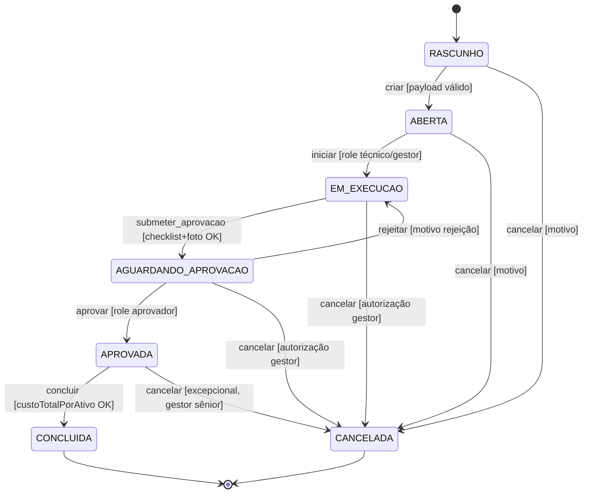

# Formal State Machine (FSM) Specifications — Aegis1

## 1. Core State Machine: Maintenance Order (Ordem de Manutenção)

### Purpose
Modela o ciclo de vida completo de uma ordem de manutenção no frontend Aegis1, refletindo os estados expostos pela API REST externa e as transições disparadas pelas ações do usuário (criar, iniciar, aprovar com evidências, concluir, cancelar). O FSM garante que a UI exiba badges de status corretos, habilite/desabilite botões condicionais (NFR-U01, NFR-U03) e impeça transições inválidas no lado do cliente antes de chamar o backend.

### Valid States
| Estado | Descrição | É estado final? |
| :--- | :--- | :--- |
| `RASCUNHO` | Ordem criada mas ainda não enviada ao backend ou aguardando confirmação de persistência inicial. | Não |
| `ABERTA` | Ordem persistida no backend, visível na listagem, aguardando início da execução. | Não |
| `EM_EXECUCAO` | Técnico iniciou a ordem (`iniciar`); trabalho em andamento no campo. | Não |
| `AGUARDANDO_APROVACAO` | Execução finalizada pelo técnico; ordem submetida para aprovação com evidências (checklist/foto) — NFR-C03. | Não |
| `APROVADA` | Aprovador validou evidências e aprovou a ordem; aguarda conclusão formal/custo final. | Não |
| `CONCLUIDA` | Ordem finalizada com custo total calculado (`custoTotalPorAtivo`); ciclo de vida encerrado com sucesso. | Sim |
| `CANCELADA` | Ordem cancelada em qualquer momento antes de `CONCLUIDA`; motivo registrado. | Sim |

> **Nota:** Os nomes dos estados espelham o vocabulário do domínio (português) usado na UI e nos contratos da API. `[INFERIDO POR IA — REQUER VALIDAÇÃO HUMANA]`

### Transition Matrix
| Estado Atual | Evento (Ação do Usuário / API) | Próximo Estado | Guarda (Condição) | Side Effects |
| :--- | :--- | :--- | :--- | :--- |
| `RASCUNHO` | `criar` (POST /orders) | `ABERTA` | Payload válido (departamento, filial, fornecedor, funcionário obrigatórios) | Persiste no backend; limpa formulário; navega para listagem; emite `trace-id` |
| `ABERTA` | `iniciar` (PATCH /orders/{id}/start) | `EM_EXECUCAO` | Usuário autenticado com role `tecnico` ou `gestor`; ordem não cancelada | Registra timestamp de início; atualiza badge; habilita coleta de evidências |
| `EM_EXECUCAO` | `submeter_aprovacao` (PATCH /orders/{id}/submit-approval) | `AGUARDANDO_APROVACAO` | Checklist completo + pelo menos 1 foto/evidência anexada (NFR-C03) | Envia evidências ao backend; notifica aprovadores; badge muda para "Aguardando Aprovação" |
| `AGUARDANDO_APROVACAO` | `aprovar` (PATCH /orders/{id}/approve) | `APROVADA` | Usuário com role `aprovador`; evidências íntegras | Registra aprovador + timestamp; habilita botão "Concluir" |
| `AGUARDANDO_APROVACAO` | `rejeitar` (PATCH /orders/{id}/reject) | `EM_EXECUCAO` | Usuário com role `aprovador`; motivo de rejeição informado | Retorna para técnico com comentários; badge volta para "Em Execução" |
| `APROVADA` | `concluir` (PATCH /orders/{id}/complete) | `CONCLUIDA` | Custo total calculado (`custoTotalPorAtivo` disponível) | Dispara cálculo final de custo; emite evento de conclusão; badge "Concluída" |
| `RASCUNHO` | `cancelar` (DELETE /orders/{id} ou PATCH /orders/{id}/cancel) | `CANCELADA` | Motivo de cancelamento informado | Soft-delete no backend; remove da listagem ativa; log de auditoria |
| `ABERTA` | `cancelar` | `CANCELADA` | Motivo informado; sem execução iniciada | Idem acima |
| `EM_EXECUCAO` | `cancelar` | `CANCELADA` | Motivo informado; aprovador/gestor autoriza | Registra custo parcial até cancelamento; log de auditoria |
| `AGUARDANDO_APROVACAO` | `cancelar` | `CANCELADA` | Motivo informado; gestor autoriza | Evidências arquivadas; notifica técnico |
| `APROVADA` | `cancelar` | `CANCELADA` | Excepcional; requer aprovação de gestor sênior | Estorno de custos se aplicável; log de auditoria |

> **Fonte das transições:** Derivado dos fluxos descritos no SAD (Seção 1: "criar, listar, iniciar, aprovar, concluir, cancelar, consultar custo total por ativo") e NFR-C03 (evidências no fluxo aprovar). `[INFERIDO POR IA — REQUER VALIDAÇÃO HUMANA]`

### Invalid Transitions (Explicitamente Proibidas)
| De | Evento | Para | Motivo da Proibição |
| :--- | :--- | :--- | :--- |
| `CONCLUIDA` | qualquer | — | Estado terminal imutável; ordem fechada contabilmente |
| `CANCELADA` | qualquer | — | Estado terminal; apenas leitura/consulta permitida |
| `RASCUNHO` | `iniciar`, `aprovar`, `concluir` | — | Ordem não persistida no backend |
| `ABERTA` | `aprovar`, `concluir` | — | Pula execução técnica obrigatória |
| `EM_EXECUCAO` | `aprovar`, `concluir` | — | Pula etapa de evidências e aprovação (NFR-C03) |
| `AGUARDANDO_APROVACAO` | `iniciar`, `concluir` | — | Viola fluxo de aprovação obrigatória |
| `APROVADA` | `iniciar`, `submeter_aprovacao`, `aprovar` | — | Estado pós-aprovação; apenas conclusão ou cancelamento excepcional |

### Diagram

---

## 2. Idempotency & Concorrência

* **Estratégia de lock:** **Optimistic locking via versão (ETag/version)** — cada resposta da API inclui `ETag` ou campo `version`; requisições de mutação (`PATCH`, `DELETE`) enviam `If-Match: <version>`. Conflito (409) → UI recarrega estado atual e notifica usuário. `[INFERIDO POR IA — REQUER VALIDAÇÃO HUMANA]`
* **Comportamento em transição duplicada:** **Idempotente** — segunda chamada com mesmo `Idempotency-Key` (gerado no frontend por transição) retorna `200 OK` com estado atual, sem efeito colateral adicional. O `api.js:request` já implementa retry automático (máx. 1) para 5xx/timeout; para mutações, o frontend deve gerar chave idempotente por ação do usuário. `[INFERIDO POR IA — REQUER VALIDAÇÃO HUMANA]`
* **Race conditions conhecidas:**
  1. **Duplo clique em "Iniciar"** → duas chamadas `PATCH /start` simultâneas → backend deve rejeitar a segunda com 409 (versão desatualizada).
  2. **Aprovação concorrente** → dois aprovadores clicam "Aprovar" quase juntos → optimistic lock resolve; um recebe 409 e UI refresca para `APROVADA`.
  3. **Cancelamento durante aprovação** → gestor cancela enquanto aprovador aprova → quem chegar por último no backend vence (lock otimista); UI sincroniza via polling ou WebSocket futuro. `[INFERIDO POR IA — REQUER VALIDAÇÃO HUMANA]`

---

## 3. Persistência do Estado

* **Onde o estado é armazenado:** **Backend externo (fora do escopo)** — tabela `maintenance_orders` (ou equivalente) com coluna `status` (enum/varchar) + `version` (integer/timestamp) para optimistic lock. O frontend **não** persiste estado de ordem; apenas reflete o último estado conhecido via API. `[INFERIDO POR IA — REQUER VALIDAÇÃO HUMANA]`
* **Auditoria de transições:** **Tabela de histórico (`order_status_history`)** — cada transição grava: `order_id`, `from_status`, `to_status`, `actor_user_id`, `actor_role`, `timestamp`, `metadata` (JSON: motivo, evidências, custo, `trace-id`). O frontend exibe timeline no detalhe da ordem (requisito implícito de rastreabilidade). `[INFERIDO POR IA — REQUER VALIDAÇÃO HUMANA]`

---

## 4. Error & Recovery States

| Estado de Erro | Origem | Como se recupera |
| :--- | :--- | :--- |
| `ERRO_CRIACAO` | Falha 4xx/5xx no `POST /orders` (validação, indisponibilidade) | Usuário corrige formulário e reenvia; `RASCUNHO` mantém dados locais até sucesso |
| `ERRO_TRANSICAO` | 409 (conflito de versão), 403 (sem permissão), 422 (guarda falhou), 5xx | `handleApiError` (api.js) exibe toast com ação: "Recarregar" (GET /orders/{id}) → sincroniza estado real; "Tentar novamente" reenvia com nova versão |
| `ERRO_EVIDENCIA_UPLOAD` | Falha no upload de foto/checklist no `submeter_aprovacao` | Evidências ficam em `sessionStorage` temporário; botão "Reenviar evidências" reaparece; não muda estado da ordem |
| `ERRO_CALCULO_CUSTO` | Backend não retorna `custoTotalPorAtivo` ao concluir | Ordem permanece em `APROVADA`; botão "Concluir" habilita "Recalcular custo" (chama GET /orders/{id}/cost) |
| `ERRO_AUTH_REFRESH` | 401 + falha no refresh token (ex.: sessão expirada) | `authInterceptor` faz logout limpo → redireciona para login; estado da ordem preservado no backend |

> **Nota:** O frontend **não** possui estados de erro persistidos; erros são transitórios e tratados via `handleApiError` (SAD Seção 3, 8). `[INFERIDO POR IA — REQUER VALIDAÇÃO HUMANA]`

---

## 5. Testes Obrigatórios

- [ ] **Todas as transições válidas cobertas por teste** — cada linha da Transition Matrix tem teste de integração (mockando API) verificando: chamada correta, atualização de estado local, badge UI, habilitação/desabilitação de botões.
- [ ] **Todas as transições inválidas rejeitadas com erro apropriado** — tentar disparar evento proibido a partir de cada estado (ex.: `concluir` em `ABERTA`) → UI não chama API, exibe toast "Ação não permitida no estado atual", botão permanece desabilitado.
- [ ] **Idempotência validada** — disparar mesma transição duas vezes em sequência rápida (mesma `Idempotency-Key`) → apenas uma chamada efetiva ao backend; segunda retorna estado atual sem side effect.
- [ ] **Estados finais são realmente imutáveis** — em `CONCLUIDA` e `CANCELADA`: nenhum botão de mutação visível; chamadas programáticas (console) para `request` com mutação retornam erro 400/403 do backend; UI não quebra.
- [ ] **Optimistic lock / concorrência** — simular duas abas: uma avança estado, outra tenta transição com versão antiga → segunda recebe 409, UI refresca e mostra estado correto.
- [ ] **Guards de negócio** — `submeter_aprovacao` sem checklist/foto → botão desabilitado; `concluir` sem `custoTotalPorAtivo` → botão desabilitado + tooltip explicativo.
- [ ] **Acessibilidade dos badges** (NFR-U01) — cada badge de status tem `role="status"`, `aria-live="polite"`, contraste WCAG AA, label textual + ícone (não só cor).
- [ ] **Touch targets 48×48 px** (NFR-U02) — botões de transição (`Iniciar`, `Aprovar`, `Concluir`, `Cancelar`) testados em viewport 320px–1920px.