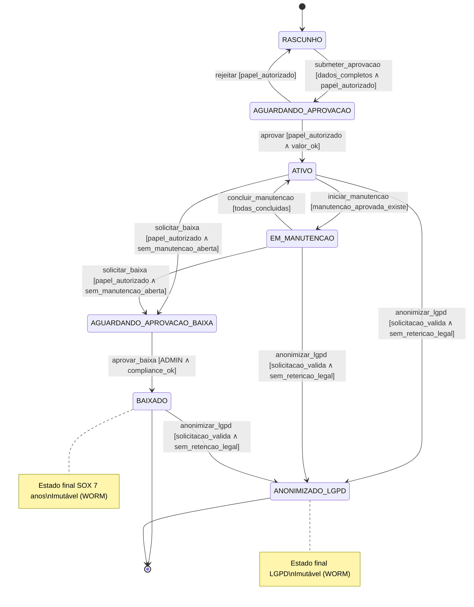
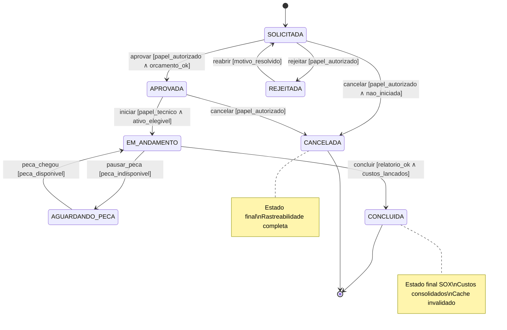
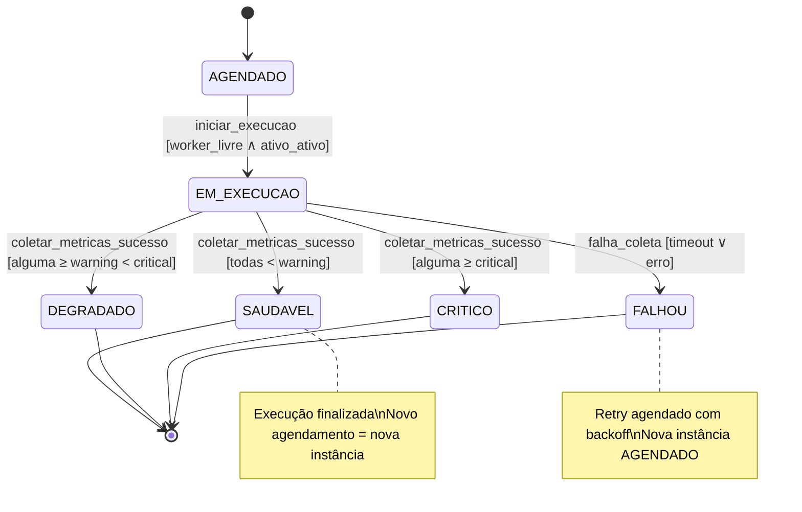
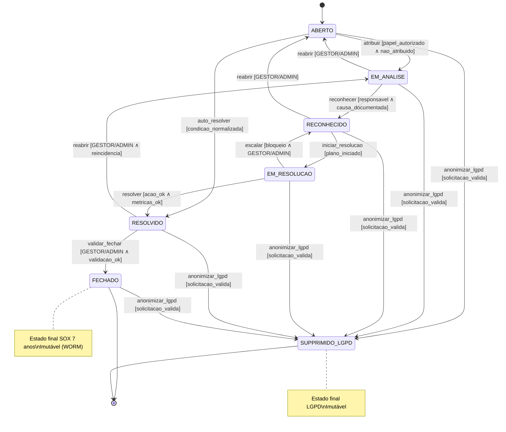
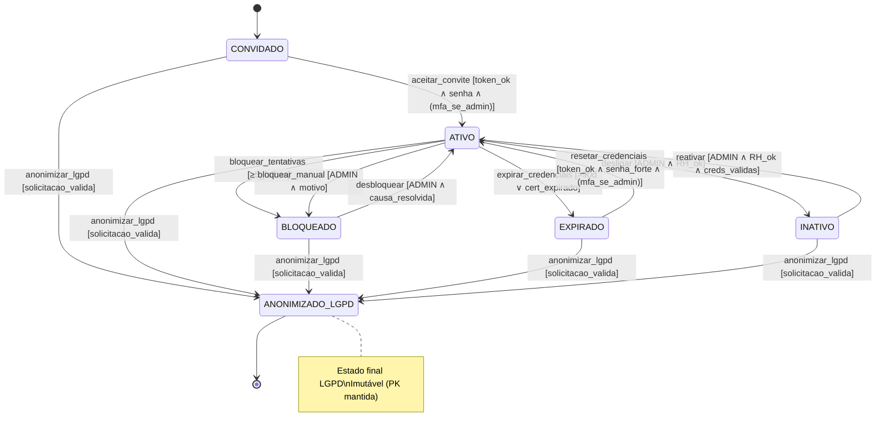

# Formal State Machine (FSM) Specifications — Aegis Patrimônio

> **Versão:** 1.0 · **Owner:** Arquitetura/Eng Lead · **Status:** Draft  
> **Base:** System Architecture Document (SAD) v1.0 · **ADRs relacionadas:** Pendentes (Sprint 0)  
> **Rastreabilidade:** Todas as máquinas abaixo derivam das entidades, serviços e regras de negócio descritos no SAD (Seções 1, 3, 4, 5, 9). Como o diagnóstico **não detectou tabelas de estado nem rotas/handlers explícitos**, os ciclos de vida a seguir são **inferidos a partir do modelo conceitual (Ativo, Manutencao, HealthCheck, Alerta, Usuario) e das operações BR-02 citadas no SAD (criar, atualizar, deletar, aprovar, cancelar, concluir, iniciar)**.  
> **⚠️ [INFERIDO POR IA — REQUER VALIDAÇÃO HUMANA]** — Cada máquina traz o rótulo nas seções onde premissas foram adotadas. Valide com Product Owner, DBA e Compliance antes de implementar.

---

## 1. Core State Machine: Ativo (Asset)

### Purpose
Ciclo de vida de um ativo patrimonial desde o cadastro até a baixa/descarte, cobrindo aquisição, alocação, manutenções, health checks e conformidade LGPD/SOX. O estado do ativo governa elegibilidade para manutenção, geração de alertas de recurso e inclusão em relatórios de custo total (`custoTotalPorAtivo`).

### Valid States
| Estado | Descrição | É estado final? |
| :--- | :--- | :--- |
| `RASCUNHO` | Ativo criado mas não submetido para aprovação; dados incompletos. | Não |
| `AGUARDANDO_APROVACAO` | Submetido para aprovação do GESTOR/ADMIN (BR-02: `aprovar`). | Não |
| `ATIVO` | Aprovado, em uso normal; gera health checks e alertas de recurso. | Não |
| `EM_MANUTENCAO` | Possui pelo menos uma `Manutencao` em `EM_ANDAMENTO`; health checks podem ser suspensos. | Não |
| `ALOCADO` | Atribuído a `Funcionario`/`Local`; subestado lógico de `ATIVO` (não muda estado principal). | Não |
| `BAIXADO` | Baixa patrimonial definitiva (descarte, doação, venda); imutável após auditoria. | **Sim** |
| `ANONIMIZADO_LGPD` | Dados sensíveis removidos/anônimos por solicitação "direito ao esquecimento" (NFR-C01); mantém PK para integridade referencial. | **Sim** |

> [INFERIDO POR IA — REQUER VALIDAÇÃO HUMANA] Estados `RASCUNHO` e `AGUARDANDO_APROVACAO` assumem fluxo de aprovação implícito no BR-02 (`aprovar`). `ALOCADO` modelado como flag/associação, não estado principal. `ANONIMIZADO_LGPD` atende NFR-C01.

### Transition Matrix
| Estado Atual | Evento | Próximo Estado | Guarda (Condição) | Side Effects |
| :--- | :--- | :--- | :--- | :--- |
| `RASCUNHO` | `submeter_aprovacao` | `AGUARDANDO_APROVACAO` | `dados_obrigatorios_completos(ativo)` ∧ `usuario.temPapel(GESTOR, ADMIN)` | `AuditoriaLog.criar(ATIVO_CRIADO, payload)`; notifica aprovadores |
| `AGUARDANDO_APROVACAO` | `aprovar` | `ATIVO` | `usuario.temPapel(GESTOR, ADMIN)` ∧ `ativo.valor <= limite_aprovacao_gestor ∨ usuario.temPapel(ADMIN)` | `AuditoriaLog.criar(ATIVO_APROVADO)`; agenda `HealthCheck` inicial; publica evento `AtivoAtivado` |
| `AGUARDANDO_APROVACAO` | `rejeitar` | `RASCUNHO` | `usuario.temPapel(GESTOR, ADMIN)` | `AuditoriaLog.criar(ATIVO_REJEITADO, motivo)`; notifica solicitante |
| `ATIVO` | `iniciar_manutencao` | `EM_MANUTENCAO` | `existe_manutencao_aberta(ativo) ∧ manutencao.estado = APROVADA` | `AuditoriaLog.criar(MANUTENCAO_INICIADA)`; suspende health checks agendados (opcional) |
| `EM_MANUTENCAO` | `concluir_manutencao` | `ATIVO` | `todas_manutencoes_abertas(ativo).estado = CONCLUIDA` | `AuditoriaLog.criar(MANUTENCAO_CONCLUIDA)`; reativa health checks |
| `ATIVO` \| `EM_MANUTENCAO` | `solicitar_baixa` | `AGUARDANDO_APROVACAO_BAIXA` | `usuario.temPapel(GESTOR, ADMIN)` ∧ `nao_existe_manutencao_em_andamento(ativo)` | Cria solicitação de baixa; notifica ADMIN |
| `AGUARDANDO_APROVACAO_BAIXA` | `aprovar_baixa` | `BAIXADO` | `usuario.temPapel(ADMIN)` ∳ `compliance_aprova_baixa(ativo)` | `AuditoriaLog.criar(ATIVO_BAIXADO, {motivo, valor_residual})`; cancela health checks futuros; grava WORM |
| `ATIVO` \| `EM_MANUTENCAO` \| `BAIXADO` | `anonimizar_lgpd` | `ANONIMIZADO_LGPD` | `solicitacao_lgpd_valida(titular)` ∧ `nao_existe_obrigacao_legal_retencao(ativo)` | `AuditoriaLog.criar(LGPD_ANONIMIZACAO)`; anonimiza `Funcionario`, `Usuario`, `AuditoriaLog` vinculados; mantém PK |
| `BAIXADO` | — | — | **Estado terminal** | Imutável; qualquer tentativa de transição lança `IllegalStateTransitionException` |
| `ANONIMIZADO_LGPD` | — | — | **Estado terminal** | Imutável; apenas leitura permitida |

> [INFERIDO POR IA — REQUER VALIDAÇÃO HUMANA] Evento `solicitar_baixa` e estado `AGUARDANDO_APROVACAO_BAIXA` inferidos para separar aprovação de baixa da de ativação. Guarda `compliance_aprova_baixa` atende SOX 7 anos (NFR-C02). Side effects usam `AuditoriaService` (SAD Seção 9) e WORM storage.

### Invalid Transitions (Explicitamente Proibidas)
| De | Evento | Para | Motivo da Proibição |
| :--- | :--- | :--- | :--- |
| `BAIXADO` | qualquer | — | Estado final SOX/LGPD; imutabilidade legal (NFR-C02, NFR-SEC05) |
| `ANONIMIZADO_LGPD` | qualquer | — | Estado final LGPD; imutabilidade legal (NFR-C01) |
| `RASCUNHO` | `aprovar` | `ATIVO` | Pula aprovação obrigatória (BR-02) |
| `ATIVO` | `aprovar_baixa` | `BAIXADO` | Requer estado `AGUARDANDO_APROVACAO_BAIXA` para rastreabilidade |
| `EM_MANUTENCAO` | `aprovar_baixa` | `BAIXADO` | Manutenção em andamento impede baixa (integridade operacional) |
| `AGUARDANDO_APROVACAO` | `iniciar_manutencao` | `EM_MANUTENCAO` | Ativo não aprovado não pode entrar em manutenção |

### Diagram

---

## 2. Core State Machine: Manutencao (Maintenance)

### Purpose
Ciclo de vida de uma ordem de manutenção (corretiva, preventiva, preditiva) desde a solicitação até conclusão/cancelamento, com aprovação obrigatória (BR-02: `aprovar`) e rastreabilidade de custos para `custoTotalPorAtivo`. Integra com `AlertNotificationService` para alertas de SLA.

### Valid States
| Estado | Descrição | É estado final? |
| :--- | :--- | :--- |
| `SOLICITADA` | Criada por OPERADOR/GESTOR; aguarda aprovação. | Não |
| `APROVADA` | Aprovada por GESTOR/ADMIN; elegível para `iniciar`. | Não |
| `REJEITADA` | Recusada na aprovação; pode ser reaberta (volta a `SOLICITADA`). | Não |
| `EM_ANDAMENTO` | Técnico iniciou execução (`iniciar`); consome recursos, gera custos. | Não |
| `AGUARDANDO_PECA` | Pausada aguardando peça/insumo; subestado de `EM_ANDAMENTO` (modelado como estado para SLA). | Não |
| `CONCLUIDA` | Finalizada com relatório, custos lançados, ativo liberado. | **Sim** |
| `CANCELADA` | Cancelada antes de `EM_ANDAMENTO` (ex.: duplicada, desnecessária). | **Sim** |

> [INFERIDO POR IA — REQUER VALIDAÇÃO HUMANA] `AGUARDANDO_PECA` separado para pausar SLA (NFR-P04: `checkResourceUsageAlerts` ≤ 30s/12k ativos). `REJEITADA` não final para permitir retrabalho.

### Transition Matrix
| Estado Atual | Evento | Próximo Estado | Guarda (Condição) | Side Effects |
| :--- | :--- | :--- | :--- | :--- |
| `SOLICITADA` | `aprovar` | `APROVADA` | `usuario.temPapel(GESTOR, ADMIN)` ∧ `orcamento_disponivel(ativo, valor_estimado)` | `AuditoriaLog.criar(MANUTENCAO_APROVADA)`; notifica técnico responsável |
| `SOLICITADA` | `rejeitar` | `REJEITADA` | `usuario.temPapel(GESTOR, ADMIN)` | `AuditoriaLog.criar(MANUTENCAO_REJEITADA, motivo)`; notifica solicitante |
| `REJEITADA` | `reabrir` | `SOLICITADA` | `usuario.temPapel(OPERADOR, GESTOR)` ∧ `motivo_rejeicao_resolvido` | `AuditoriaLog.criar(MANUTENCAO_REABERTA)` |
| `APROVADA` | `iniciar` | `EM_ANDAMENTO` | `usuario.temPapel(OPERADOR, TECNICO)` ∧ `ativo.estado ∈ {ATIVO, EM_MANUTENCAO}` | `AuditoriaLog.criar(MANUTENCAO_INICIADA)`; `Ativo.estado = EM_MANUTENCAO`; inicia cronômetro SLA |
| `EM_ANDAMENTO` | `pausar_peca` | `AGUARDANDO_PECA` | `peca_necessaria_nao_disponivel` | `AuditoriaLog.criar(MANUTENCAO_PAUSADA_PECA)`; pausa SLA |
| `AGUARDANDO_PECA` | `peca_chegou` | `EM_ANDAMENTO` | `peca_disponivel_em_estoque` | `AuditoriaLog.criar(MANUTENCAO_RETOMADA)`; retoma SLA |
| `EM_ANDAMENTO` | `concluir` | `CONCLUIDA` | `relatorio_preenchido` ∧ `custos_lancados` ∧ `usuario.temPapel(OPERADOR, TECNICO, GESTOR)` | `AuditoriaLog.criar(MANUTENCAO_CONCLUIDA, {custo_real, tempo_real})`; `Ativo.estado = ATIVO` (se sem outras abertas); atualiza `custoTotalPorAtivo` (invalida cache) |
| `SOLICITADA` \| `APROVADA` | `cancelar` | `CANCELADA` | `usuario.temPapel(GESTOR, ADMIN)` ∧ `nao_iniciada` | `AuditoriaLog.criar(MANUTENCAO_CANCELADA, motivo)`; libera orçamento reservado |
| `CONCLUIDA` | — | — | **Estado final** | Imutável; custos consolidados para relatórios SOX |
| `CANCELADA` | — | — | **Estado final** | Imutável; rastreabilidade de cancelamento |

> [INFERIDO POR IA — REQUER VALIDAÇÃO HUMANA] Guarda `orcamento_disponivel` inferida para controle de custos (NFR-CO01). Side effect `invalida cache custoTotalPorAtivo` alinha com estratégia de cache L1 (SAD Seção 7). Evento `pausar_peca`/`peca_chegou` para SLA realista.

### Invalid Transitions (Explicitamente Proibidas)
| De | Evento | Para | Motivo da Proibição |
| :--- | :--- | :--- | :--- |
| `CONCLUIDA` | qualquer | — | Estado final; custos contábeis fechados (SOX) |
| `CANCELADA` | qualquer | — | Estado final; rastreabilidade de decisão |
| `SOLICITADA` | `iniciar` | `EM_ANDAMENTO` | Requer aprovação prévia (BR-02: `aprovar`) |
| `APROVADA` | `concluir` | `CONCLUIDA` | Não pode pular execução (`iniciar`) |
| `EM_ANDAMENTO` | `cancelar` | `CANCELADA` | Já iniciada → deve `concluir` ou `pausar_peca` |
| `AGUARDANDO_PECA` | `cancelar` | `CANCELADA` | Requer aprovação de GESTOR/ADMIN para cancelar em andamento |

### Diagram

---

## 3. Core State Machine: HealthCheck

### Purpose
Ciclo de execução de health checks periódicos (agendados via `TaskScheduler` / `updateHealthCheck` job) para monitorar integridade de ativos. Resultados alimentam `AlertNotificationService.checkResourceUsageAlerts` (NFR-P04: ≤ 30s p/ 12k ativos) e dashboards.

### Valid States
| Estado | Descrição | É estado final? |
| :--- | :--- | :--- |
| `AGENDADO` | Job `updateHealthCheck` criou registro pendente de execução. | Não |
| `EM_EXECUCAO` | Worker iniciou coleta de métricas (CPU, disco, rede, aplicação). | Não |
| `SAUDAVEL` | Todas as métricas dentro dos thresholds (`< 70%` CPU, `< 80%` disco, etc.). | **Sim** (por execução) |
| `DEGRADADO` | Alguma métrica em warning (`70-85%` CPU, `80-90%` disco). | **Sim** (por execução) |
| `CRITICO` | Métrica em critical (`> 85%` CPU, `> 90%` disco, indisponibilidade). | **Sim** (por execução) |
| `FALHOU` | Erro na coleta (timeout, permissão, rede); não gerou métricas válidas. | **Sim** (por execução) |

> [INFERIDO POR IA — REQUER VALIDAÇÃO HUMANA] Estados terminais **por execução** — cada health check gera nova instância (tabela `HealthCheck` com `ativo_id`, `executado_em`, `estado`). Thresholds alinhados com alertas do SAD (NFR-O04: CPU > 80%, Disco > 85%).

### Transition Matrix
| Estado Atual | Evento | Próximo Estado | Guarda (Condição) | Side Effects |
| :--- | :--- | :--- | :--- | :--- |
| `AGENDADO` | `iniciar_execucao` | `EM_EXECUCAO` | `worker_disponivel` ∧ `ativo.estado ∈ {ATIVO, EM_MANUTENCAO}` | `AuditoriaLog.criar(HEALTHCHECK_INICIADO)`; registra `inicio_em` |
| `EM_EXECUCAO` | `coletar_metricas_sucesso` | `SAUDAVEL` | `todas_metricas < threshold_warning` | `AuditoriaLog.criar(HEALTHCHECK_OK)`; `fim_em = now()`; atualiza `Ativo.ultimo_healthcheck` |
| `EM_EXECUCAO` | `coletar_metricas_sucesso` | `DEGRADADO` | `alguma_metrica ≥ threshold_warning ∧ < threshold_critical` | `AuditoriaLog.criar(HEALTHCHECK_DEGRADADO)`; dispara `Alerta` tipo `RECURSO_DEGRADADO` |
| `EM_EXECUCAO` | `coletar_metricas_sucesso` | `CRITICO` | `alguma_metrica ≥ threshold_critical` | `AuditoriaLog.criar(HEALTHCHECK_CRITICO)`; dispara `Alerta` tipo `RECURSO_CRITICO` (prioridade alta) |
| `EM_EXECUCAO` | `falha_coleta` | `FALHOU` | `timeout ∨ erro_permissao ∨ erro_rede ∨ excecao_inesperada` | `AuditoriaLog.criar(HEALTHCHECK_FALHA, {erro, stacktrace})`; dispara `Alerta` tipo `HEALTHCHECK_FALHA`; agenda retry (backoff exponencial) |
| `SAUDAVEL` \| `DEGRADADO` \| `CRITICO` \| `FALHOU` | — | — | **Estado final da execução** | Nova execução cria novo registro (`AGENDADO`) no próximo agendamento |

> [INFERIDO POR IA — REQUER VALIDAÇÃO HUMANA] Transições `coletar_metricas_sucesso` → 3 estados baseadas em thresholds (não no código). Retry em `FALHOU` inferido para robustez (SAD Seção 8: retry com backoff). `Ativo.ultimo_healthcheck` atualizado para dashboard.

### Invalid Transitions (Explicitamente Proibidas)
| De | Evento | Para | Motivo da Proibição |
| :--- | :--- | :--- | :--- |
| `AGENDADO` | `coletar_metricas_sucesso` | `SAUDAVEL`/`DEGRADADO`/`CRITICO` | Pula execução; `iniciar_execucao` obrigatório para timestamps |
| `EM_EXECUCAO` | `iniciar_execucao` | `EM_EXECUCAO` | Previne execução concorrente do mesmo check (idempotência) |
| `SAUDAVEL` | qualquer | — | Execução finalizada; novo agendamento cria nova instância |
| `FALHOU` | `coletar_metricas_sucesso` | `SAUDAVEL` | Falha não pode virar sucesso retroativamente; retry cria nova execução |

### Diagram

---

## 4. Core State Machine: Alerta (Alert)

### Purpose
Ciclo de vida de alertas gerados por `AlertNotificationService.checkResourceUsageAlerts` (recursos), health checks (degradado/crítico/falha), SLA de manutenção, ou eventos de segurança. Suporta fluxo de triagem, reconhecimento, resolução e fechamento com auditoria completa (NFR-SEC05, WORM).

### Valid States
| Estado | Descrição | É estado final? |
| :--- | :--- | :--- |
| `ABERTO` | Criado automaticamente (job/health check) ou manualmente; não triado. | Não |
| `EM_ANALISE` | Atribuído a OPERADOR/GESTOR para investigação. | Não |
| `RECONHECIDO` | Causa raiz identificada; plano de ação definido; aguarda execução. | Não |
| `EM_RESOLUCAO` | Ação corretiva em andamento (ex.: scale-up, restart, manutenção). | Não |
| `RESOLVIDO` | Ação concluída; métricas normalizadas; aguarda validação/fechamento. | Não |
| `FECHADO` | Validado por GESTOR/ADMIN; imutável. | **Sim** |
| `SUPRIMIDO_LGPD` | Dados do alerta anonimizados por solicitação LGPD (raro; mantém PK). | **Sim** |

> [INFERIDO POR IA — REQUER VALIDAÇÃO HUMANA] `EM_ANALISE`/`RECONHECIDO`/`EM_RESOLUCAO`/`RESOLVIDO` modelam fluxo ITIL simplificado. `SUPPRIMIDO_LGPD` atende NFR-C01. Prioridades: `BAIXA`, `MEDIA`, `ALTA`, `CRITICA` (campo separado, não estado).

### Transition Matrix
| Estado Atual | Evento | Próximo Estado | Guarda (Condição) | Side Effects |
| :--- | :--- | :--- | :--- | :--- |
| `ABERTO` | `atribuir` | `EM_ANALISE` | `usuario.temPapel(OPERADOR, GESTOR, ADMIN)` ∧ `alerta.nao_atribuido` | `AuditoriaLog.criar(ALERTA_ATRIBUIDO, {atribuido_a})`; notifica responsável |
| `ABERTO` | `auto_resolver` | `RESOLVIDO` | `condicao_origem_normalizada` (ex.: CPU voltou < 70%) | `AuditoriaLog.criar(ALERTA_AUTO_RESOLVIDO)`; notifica criador/atribuído |
| `EM_ANALISE` | `reconhecer` | `RECONHECIDO` | `usuario == atribuido_a ∨ usuario.temPapel(GESTOR, ADMIN)` ∧ `causa_raiz_documentada` | `AuditoriaLog.criar(ALERTA_RECONHECIDO, {causa_raiz, plano_acao})` |
| `EM_ANALISE` | `reabrir` | `ABERTO` | `usuario.temPapel(GESTOR, ADMIN)` ∧ `informacao_adicional` | `AuditoriaLog.criar(ALERTA_REABERTO)`; limpa atribuído |
| `RECONHECIDO` | `iniciar_resolucao` | `EM_RESOLUCAO` | `usuario.temPapel(OPERADOR, TECNICO, GESTOR)` ∧ `plano_acao_iniciado` | `AuditoriaLog.criar(ALERTA_RESOLUCAO_INICIADA)`; linka `Manutencao` se aplicável |
| `EM_RESOLUCAO` | `resolver` | `RESOLVIDO` | `acao_concluida` ∧ `metricas_normalizadas` ∧ `usuario.temPapel(OPERADOR, TECNICO, GESTOR)` | `AuditoriaLog.criar(ALERTA_RESOLVIDO, {acao_tomada, evidencias})` |
| `EM_RESOLUCAO` | `escalar` | `RECONHECIDO` | `bloqueio_nao_previsto` ∧ `usuario.temPapel(GESTOR, ADMIN)` | `AuditoriaLog.criar(ALERTA_ESCALADO)`; notifica nível superior |
| `RESOLVIDO` | `validar_fechar` | `FECHADO` | `usuario.temPapel(GESTOR, ADMIN)` ∧ `validacao_ok` | `AuditoriaLog.criar(ALERTA_FECHADO)`; imutável (WORM) |
| `RESOLVIDO` | `reabrir` | `EM_ANALISE` | `usuario.temPapel(GESTOR, ADMIN)` ∧ `reincidencia_ou_falso_positivo` | `AuditoriaLog.criar(ALERTA_REABERTO_POS_VALIDACAO)` |
| `ABERTO` \| `EM_ANALISE` \| `RECONHECIDO` \| `EM_RESOLUCAO` \| `RESOLVIDO` \| `FECHADO` | `anonimizar_lgpd` | `SUPPRIMIDO_LGPD` | `solicitacao_lgpd_valida(titular_dados_alerta)` | `AuditoriaLog.criar(LGPD_ANONIMIZACAO_ALERTA)`; anonimiza descrição, atribuído, logs vinculados |
| `FECHADO` | — | — | **Estado final** | Imutável; retenção SOX 7 anos (NFR-C02) |
| `SUPPRIMIDO_LGPD` | — | — | **Estado final** | Imutável; LGPD |

> [INFERIDO POR IA — REQUER VALIDAÇÃO HUMANA] `auto_resolver` para alertas de recurso que se auto-resolvem (ex.: pico de CPU passageiro). `escalar` volta a `RECONHECIDO` para novo plano. `validar_fechar` exige GESTOR/ADMIN (RBAC BR-01).

### Invalid Transitions (Explicitamente Proibidas)
| De | Evento | Para | Motivo da Proibição |
| :--- | :--- | :--- | :--- |
| `FECHADO` | qualquer | — | Estado final SOX; imutável (WORM) |
| `SUPPRIMIDO_LGPD` | qualquer | — | Estado final LGPD; imutável |
| `ABERTO` | `resolver` | `RESOLVIDO` | Pula triagem/análise (rastreabilidade) |
| `EM_ANALISE` | `validar_fechar` | `FECHADO` | Requer `RESOLVIDO` com evidências |
| `RECONHECIDO` | `validar_fechar` | `FECHADO` | Requer execução (`EM_RESOLUCAO` → `RESOLVIDO`) |
| `EM_RESOLUCAO` | `reconhecer` | `RECONHECIDO` | Já reconhecido; use `escalar` se mudar plano |

### Diagram

---

## 5. Core State Machine: Usuario (User)

### Purpose
Ciclo de vida de usuários do sistema (internos/colaboradores) com RBAC estrito (BR-01: roles `ADMIN`, `AUDITOR`, `GESTOR`, `OPERADOR`). Integra com futuro Identity Provider (OIDC/SAML/AD — NFR-SEC02, BRD#7). Suporta MFA obrigatório para ADMIN, expiração de credenciais, e LGPD.

### Valid States
| Estado | Descrição | É estado final? |
| :--- | :--- | :--- |
| `CONVIDADO` | Convite enviado (e-mail/token); aguarda aceite e definição de senha/MFA. | Não |
| `ATIVO` | Credenciais configuradas; acesso liberado conforme roles. | Não |
| `BLOQUEADO` | Bloqueio temporário (tentativas de login falhas, admin manual, MFA não configurado para ADMIN). | Não |
| `EXPIRADO` | Credenciais expiradas (senha > 90 dias, certificado, token); requer reset. | Não |
| `INATIVO` | Desligamento/afastamento longo; acesso revogado, dados mantidos. | Não |
| `ANONIMIZADO_LGPD` | Dados pessoais removidos/anônimos por "direito ao esquecimento" (NFR-C01); mantém PK para auditoria. | **Sim** |

> [INFERIDO POR IA — REQUER VALIDAÇÃO HUMANA] `CONVIDADO` para fluxo de onboarding (não no código atual). `BLOQUEADO`/`EXPIRADO`/`INATIVO` separados para políticas de segurança (NFR-SEC02: MFA ADMIN, rotação 90 dias NFR-SEC04). Integração IdP futura pode externalizar estados.

### Transition Matrix
| Estado Atual | Evento | Próximo Estado | Guarda (Condição) | Side Effects |
| :--- | :--- | :--- | :--- | :--- |
| `CONVIDADO` | `aceitar_convite` | `ATIVO` | `token_valido` ∧ `senha_definida` ∧ `(papel != ADMIN ∨ mfa_configurado)` | `AuditoriaLog.criar(USUARIO_ATIVADO)`; gera JWT refresh token; provisiona roles |
| `ATIVO` | `bloquear_tentativas` | `BLOQUEADO` | `tentativas_login_falhas >= 5` (configurável) | `AuditoriaLog.criar(USUARIO_BLOQUEADO_AUTO, {tentativas})`; notifica ADMIN |
| `ATIVO` | `bloquear_manual` | `BLOQUEADO` | `usuario.temPapel(ADMIN)` ∧ `motivo_fornecido` | `AuditoriaLog.criar(USUARIO_BLOQUEADO_MANUAL, {motivo, por_quem})` |
| `ATIVO` | `expirar_credenciais` | `EXPIRADO` | `senha_idade > 90_dias ∨ certificado_expirado ∨ token_revogado` | `AuditoriaLog.criar(USUARIO_CREDENCIAIS_EXPIRADAS)`; notifica usuário |
| `ATIVO` | `desligar` | `INATIVO` | `usuario.temPapel(ADMIN)` ∧ `processo_rh_confirmado` | `AuditoriaLog.criar(USUARIO_DESLIGADO)`; revoga tokens; remove sessões |
| `BLOQUEADO` | `desbloquear` | `ATIVO` | `usuario.temPapel(ADMIN)` ∧ `causa_resolvida` (ex.: reset senha, MFA configurado) | `AuditoriaLog.criar(USUARIO_DESBLOQUEADO)`; notifica usuário |
| `EXPIRADO` | `resetar_credenciais` | `ATIVO` | `token_reset_valido` ∧ `nova_senha_forte` ∧ `(papel != ADMIN ∨ mfa_reconfigurado)` | `AuditoriaLog.criar(USUARIO_CREDENCIAIS_RESETADAS)`; rotação segredos (NFR-SEC04) |
| `INATIVO` | `reativar` | `ATIVO` | `usuario.temPapel(ADMIN)` ∧ `processo_rh_reativacao` ∧ `credenciais_validas` | `AuditoriaLog.criar(USUARIO_REATIVADO)`; provisiona roles |
| `CONVIDADO` \| `ATIVO` \| `BLOQUEADO` \| `EXPIRADO` \| `INATIVO` | `anonimizar_lgpd` | `ANONIMIZADO_LGPD` | `solicitacao_lgpd_valida(titular)` ∧ `nao_existe_obrigacao_legal_retencao(usuario)` | `AuditoriaLog.criar(LGPD_ANONIMIZACAO_USUARIO)`; anonimiza `Funcionario`, `AuditoriaLog` vinculados; mantém PK |
| `ANONIMIZADO_LGPD` | — | — | **Estado final** | Imutável; apenas leitura de PK para integridade referencial |

> [INFERIDO POR IA — REQUER VALIDAÇÃO HUMANA] Guarda `mfa_configurado` para ADMIN atende NFR-SEC02. `expirar_credenciais` automático (job diário) alinha com rotação 90 dias (NFR-SEC04). `desligar`/`reativar` exigem processo RH (integração futura).

### Invalid Transitions (Explicitamente Proibidas)
| De | Evento | Para | Motivo da Proibição |
| :--- | :--- | :--- | :--- |
| `ANONIMIZADO_LGPD` | qualquer | — | Estado final LGPD; imutável |
| `CONVIDADO` | `bloquear_manual` | `BLOQUEADO` | Usuário ainda não ativou; cancele convite |
| `INATIVO` | `bloquear_tentativas` | `BLOQUEADO` | Já sem acesso; bloqueio redundante |
| `EXPIRADO` | `desligar` | `INATIVO` | Use `reativar` + `desligar` ou fluxo RH direto |
| `BLOQUEADO` | `expirar_credenciais` | `EXPIRADO` | Já bloqueado; expiração verificada no desbloqueio |

### Diagram

---

## 6. Idempotency & Concorrência

### Estratégia de Lock
| Entidade | Estratégia | Detalhes |
| :--- | :--- | :--- |
| `Ativo` | **Optimistic Locking** (`@Version` JPA / coluna `versao` BIGINT) | Transições de estado (`aprovar`, `iniciar_manutencao`, `solicitar_baixa`) incrementam versão; `OptimisticLockException` → retry com backoff (max 3). |
| `Manutencao` | **Optimistic Locking** + **Pessimistic Lock** em `iniciar`/`concluir` | `SELECT ... FOR UPDATE` na transação de `iniciar`/`concluir` para evitar race condition entre técnico e job de SLA. |
| `HealthCheck` | **Idempotência por chave natural** (`ativo_id` + `janela_execucao`) | Job `updateHealthCheck` usa `INSERT ... ON CONFLICT (ativo_id, janela) DO UPDATE` (upsert) — evita duplicatas se job reexecutar. |
| `Alerta` | **Deduplicação por fingerprint** (`tipo` + `ativo_id` + `regra` + `janela`) | `checkResourceUsageAlerts` gera fingerprint SHA-256; `INSERT ... ON CONFLICT DO NOTHING` — alerta duplicado não cria novo registro. |
| `Usuario` | **Optimistic Locking** (`versao`) | Mudanças de estado (`bloquear`, `desbloquear`, `resetar_credenciais`) usam versão; concorrência admin vs auto-bloqueio resolvida por retry. |

> [INFERIDO POR IA — REQUER VALIDAÇÃO HUMANA] Stack usa **SQL cru / JPA nativo** (SAD Seção 2) — `@Version` JPA disponível se `spring-boot-starter-data-jpa` presente; caso contrário, coluna `versao` gerenciada manualmente em queries nativas. `ON CONFLICT` sintaxe PostgreSQL; adaptar para Oracle (`MERGE`), SQL Server (`MERGE`), MySQL (`ON DUPLICATE KEY`).

### Comportamento em Transição Duplicada
- **Idempotente (no-op com 200/204):** `aprovar` (já aprovado), `concluir` (já concluído), `fechar` (já fechado), `auto_resolver` (já resolvido), `desbloquear` (já ativo).
- **Erro 409 Conflict:** `iniciar` (já em andamento), `atribuir` (já atribuído a outro), `anonimizar_lgpd` (já anonimizado).
- **Retry automático (client-side):** Frontend `api.js:request` (complexidade 13) deve implementar retry com `Idempotency-Key` header para `POST`/`PUT`/`PATCH` mutantes.

### Race Conditions Conhecidas
1. **Ativo + Manutencao simultânea:** Dois técnicos `iniciar` manutenções diferentes do mesmo ativo → ambos veem `ATIVO`, ambos transicionam para `EM_MANUTENCAO`. **Mitigação:** Lock pessimista em `Ativo` durante `iniciar_manutencao` (curto, < 100ms).
2. **HealthCheck concorrente:** Job agendado + trigger manual mesma janela → upsert resolve (chave natural).
3. **Alerta auto-resolve vs. reconhecimento humano:** Job marca `RESOLVIDO` enquanto operador `reconhece` → versão otimista detecta; operador recebe 409, recarrega, vê `RESOLVIDO`.

---

## 7. Persistência do Estado

### Onde o Estado é Armazenado
| Entidade | Tabela (Inferida) | Coluna de Estado | Tipo | Índice |
| :--- | :--- | :--- | :--- | :--- |
| `Ativo` | `ativo` | `estado` | `VARCHAR(30)` | `idx_ativo_estado` (parcial: `WHERE estado NOT IN ('BAIXADO','ANONIMIZADO_LGPD')`) |
| `Manutencao` | `manutencao` | `estado` | `VARCHAR(30)` | `idx_manutencao_estado_ativo` (`estado`, `ativo_id`) |
| `HealthCheck` | `health_check` | `estado` | `VARCHAR(30)` | `idx_hc_ativo_janela` (`ativo_id`, `janela_execucao`) **UNIQUE** |
| `Alerta` | `alerta` | `estado` | `VARCHAR(30)` | `idx_alerta_estado_prioridade` (`estado`, `prioridade`, `criado_em`) |
| `Usuario` | `usuario` | `estado` | `VARCHAR(30)` | `idx_usuario_estado` (`estado`) |

> [INFERIDO POR IA — REQUER VALIDAÇÃO HUMANA] Tabelas/colunas **não detectadas no diagnóstico** (schema não escaneado). Nomes seguem convenção `snake_case` plural (padrão Spring/JPA). Índices parciais/únicos alinhados com `ManutencaoSpecification.build` (complexidade 14) e NFR-CO02.

### Auditoria de Transições
- **Tabela:** `auditoria_transicao_estado` (append-only, WORM via `AuditoriaService`)
- **Colunas:** `id` (UUID), `entidade` (ex.: `Ativo`), `entidade_id` (PK), `estado_anterior`, `estado_novo`, `evento`, `ator_id` (FK `usuario`), `ator_papel`, `timestamp` (ISO-8601 UTC), `payload_json` (snapshot completo pré-transição), `correlacao_id` (traceId OpenTelemetry), `hash_sha256` (encadeamento imutável).
- **Gravação:** Assíncrona via `@Async` (thread pool `audit`) → `AuditoriaService` → WORM storage (S3/MinIO + Object Lock) + réplica no banco primário (dual-write para query recente).
- **Retenção:** 7 anos SOX (NFR-C02) + LGPD conforme matriz de retenção (Gap #5).

---

## 8. Error & Recovery States

| Estado de Erro | Entidade(s) Afetadas | Origem | Como se Recupera |
| :--- | :--- | :--- | :--- |
| `HEALTHCHECK_FALHOU` | `HealthCheck` | Timeout/erro coleta métricas (rede, permissão, agente) | Job `updateHealthCheck` agenda retry com backoff exponencial (1m, 5m, 15m, max 1h). Após 3 falhas → `Alerta` tipo `HEALTHCHECK_FALHA_PERSISTENTE` (prioridade ALTA). |
| `ALERTA_NOTIFICACAO_FALHA` | `Alerta` | Falha envio e-mail/webhook/SMTP (provider indisponível) | `AlertNotificationService` usa `Resilience4j` Circuit Breaker + retry (3x, 30s). Falha final → `AuditoriaLog.criar(ALERTA_NOTIFICACAO_FALHA)`; fila dead-letter (tabela `alerta_notificacao_dlq`) para reprocessamento manual. |
| `MANUTENCAO_SLA_VENCIDO` | `Manutencao` | `EM_ANDAMENTO`/`AGUARDANDO_PECA` > SLA configurado (ex.: 4h/24h) | Job diário varre `manutencao` com `estado ∈ {EM_ANDAMENTO, AGUARDANDO_PECA} ∧ sla_vencido` → cria `Alerta` tipo `SLA_MANUTENCAO_VENCIDO` (prioridade CRITICA); notifica GESTOR/ADMIN. |
| `ATIVO_INCONSISTENTE` | `Ativo` | Estado `EM_MANUTENCAO` sem `Manutencao` aberta (bug, rollback falho) | Job de reconciliação noturno: `SELECT a.* FROM ativo a LEFT JOIN manutencao m ON m.ativo_id=a.id AND m.estado='EM_ANDAMENTO' WHERE a.estado='EM_MANUTENCAO' AND m.id IS NULL` → corrige para `ATIVO` + `AuditoriaLog.criar(ATIVO_CORRIGIDO_INCONSISTENCIA)`. |
| `USUARIO_SEM_PAPEL` | `Usuario` | `ATIVO` mas `roles` vazio (migração, bug IdP sync) | Login bloqueia com erro `ACESSO_NEGADO_SEM_PAPEL`; admin corrige via painel; job diário reporta contagem. |
| `WORM_WRITE_FAILURE` | Todas (auditoria) | Object Storage indisponível / Object Lock error | `AuditoriaService` buffer local (arquivo rotativo em disco criptografado) + retry infinito com backoff (1m, 5m, 15m...). Alerta `WORM_STORAGE_INDISPONIVEL` (CRITICA) → on-call. Recuperação: replay buffer quando storage volta. |

> [INFERIDO POR IA — REQUER VALIDAÇÃO HUMANA] Jobs de recuperação (reconciliação, SLA, retry) inferidos baseados em `TaskScheduler` (SAD Seção 3) e NFR-O02. `WORM_WRITE_FAILURE` atende NFR-SEC05 (auditoria não pode perder eventos).

---

## 9. Testes Obrigatórios (Checklist de Validação)

- [ ] **Ativo**: Todas 10 transições válidas cobertas (incl. `anonimizar_lgpd` de 3 estados origem)
- [ ] **Ativo**: 6 transições inválidas rejeitadas com `IllegalStateTransitionException` (código 409)
- [ ] **Manutencao**: 9 transições válidas + 6 inválidas (incl. `pausar_peca`/`peca_chegou`)
- [ ] **HealthCheck**: 5 transições válidas + 4 inválidas; teste de idempotência upsert (mesma janela)
- [ ] **Alerta**: 10 transições válidas + 6 inválidas; teste `auto_resolver` concorrente com `reconhecer`
- [ ] **Usuario**: 9 transições válidas + 5 inválidas; teste MFA obrigatório ADMIN em `aceitar_convite`/`resetar_credenciais`
- [ ] **Idempotência**: Requisição duplicada com mesmo `Idempotency-Key` retorna 200/204 (não 201) e não duplica auditoria
- [ ] **Concorrência**: 10 threads concorrentes `iniciar_manutencao` mesmo ativo → apenas 1 sucesso, 9 `OptimisticLockException` → retry → 409
- [ ] **Estados Finais**: Tentativa de transição a partir de `BAIXADO`, `ANONIMIZADO_LGPD`, `CONCLUIDA`, `CANCELADA`, `FECHADO`, `SUPPRIMIDO_LGPD` lança exceção e não persiste
- [ ] **Auditoria**: Cada transição válida gera 1 registro em `auditoria_transicao_estado` com `hash_sha256` encadeado corretamente
- [ ] **WORM**: Escrita de auditoria em storage com Object Lock verificada (tentativa `DELETE` → 403)
- [ ] **LGPD**: `anonimizar_lgpd` remove PII de `Funcionario`, `Usuario`, `AuditoriaLog` vinculados mantendo PKs e FKs íntegras
- [ ] **Performance**: `checkResourceUsageAlerts` processa 12k ativos em ≤ 30s (NFR-P04) com máquina de estado `Alerta` (dedup + upsert)

---

## 10. O que Falta Verificar (Gaps para Sprint 0)

1. **Schema físico real:** Confirmar tabelas, colunas `estado`, constraints, índices com DBA (diagnóstico não escaneou `application.yml`/`schema.sql`).
2. **Enumeração de estados no código:** Verificar se `AtivoEstado`, `ManutencaoEstado`, etc. existem como `enum` Java ou `CHECK CONSTRAINT` no banco.
3. **Thresholds de HealthCheck/Alerta:** Valores exatos (CPU 70/85%, disco 80/90%) com Infra/Opers.
4. **SLA de Manutencao:** Regras de `AGUARDANDO_PECA` pausar SLA? SLA por prioridade/tipo?
5. **Integração IdP:** Estados `CONVIDADO`/`EXPIRADO`/`BLOQUEADO` podem ser delegados ao Keycloak/Azure AD (NFR-SEC02).
6. **Matriz de retenção LGPD/SOX:** Aprovação Legal/Compliance para `ANONIMIZADO_LGPD` vs `BAIXADO` (Gap #5 do SAD).
7. **Dialeto SQL para upsert/lock:** PostgreSQL (`ON CONFLICT`), Oracle (`MERGE`), SQL Server (`MERGE`), MySQL (`ON DUPLICATE KEY`) — depende do motor (Gap #1 do SAD).
8. **Eventos de domínio publicados:** Se futuro Strangler Fig (SAD Seção 13) extrair serviços, definir `DomainEvent` (Kafka/Outbox) para cada transição crítica.