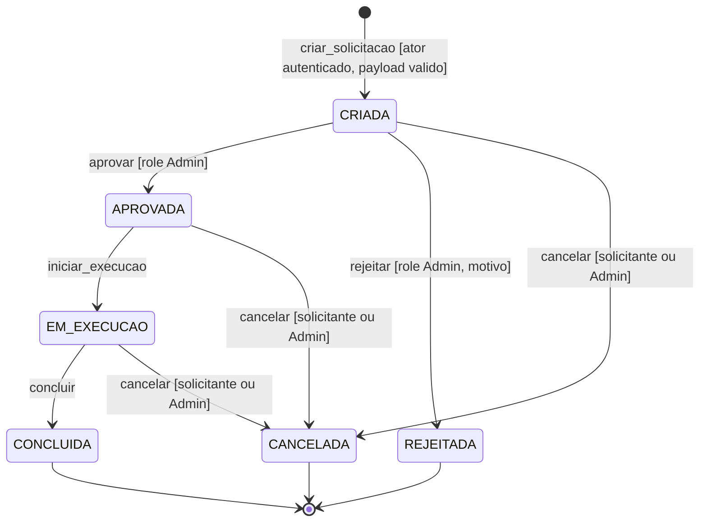
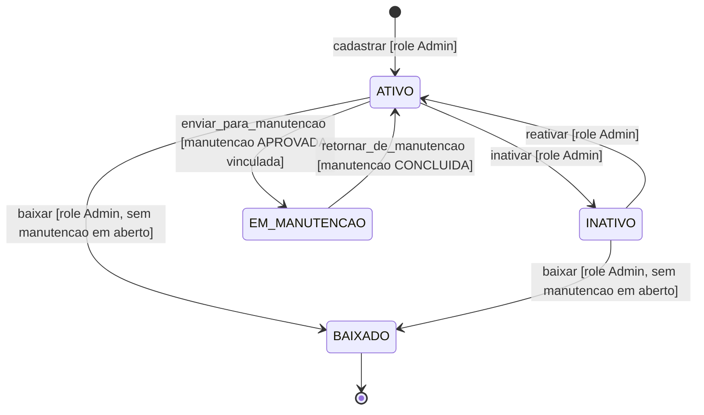
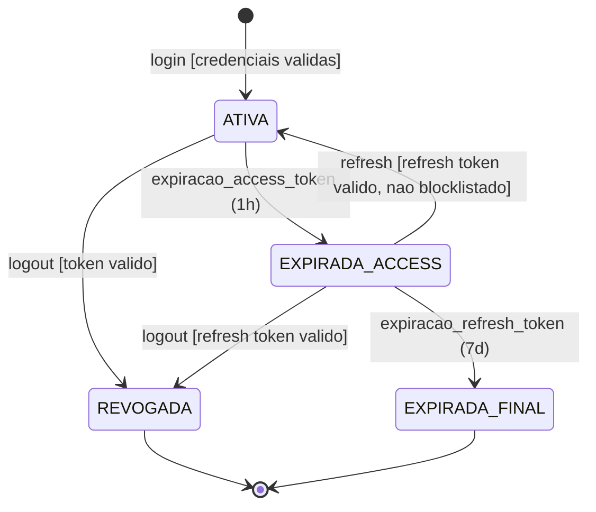

# Formal State Machine (FSM) Specifications — Sistema de Gestão de Patrimônio (A4)

> **Versão:** 1.0 · **Owner:** Engenharia · **Status:** Draft
> **Fontes:** System Architecture Document (SAD v1.0 — Seções 3, 5, 8, 9, 10, 11, 12), [[nfr]] (Non-Functional Requirements v1.0 — NFR-SEC01/SEC02/SEC04/SEC05/SEC07, NFR-O02/O03/O04, NFR-S01/S02, NFR-A05, NFR-M01), diagnóstico determinístico do codebase (varredura AST real — 350 arquivos, 27.537 LOC), contexto de State Machines do workspace.
> **Artefatos relacionados:** [[db-schema-spec]] (contrato físico — pendente de produção), [[db-domain-model]] (modelo conceitual — pendente), [[uml-diagrams]] (diagramas C4 — pendente).

Este documento especifica as máquinas de estado formais (FSM) do **Sistema de Gestão de Patrimônio (A4)** — aplicação web server-side única (backend Java em `src/`, pacote `br.com.aegispatrimonio`; frontend web em `frontend/` com `@popperjs/core` ^2.11.8 como única dependência de produção verificada). O motor de banco de dados **não está especificado** nas dependências verificadas (acesso a dados presumivelmente via SQL cru, sem ORM) — isso condiciona diretamente as seções de persistência, lock e recuperação deste documento.

Três ciclos de vida são modelados, derivados das entidades verificadas na varredura (`Usuario`, `Ativo`, `Manutencao` — esta última via `ManutencaoSpecification`) e dos fluxos funcionais dos NFRs:

| # | Máquina de Estado | Entidade | Ancoragem principal |
| :-- | :--- | :--- | :--- |
| 1 | Solicitação de Manutenção (**core**) | `Manutencao` (classe verificada via `ManutencaoSpecification`, `repository/`) | RF-18 a RF-21, UC-02/UC-03, KPIs NFR-O04, prioridade de disponibilidade (SAD Seção 8) |
| 2 | Ciclo de Vida do Ativo | `Ativo` (via `AtivoService`, `AtivoMapper`) | RF-14/RF-15/RF-17, RF-26, NFR-SEC04/SEC07 |
| 3 | Sessão de Usuário / Token JWT | `Usuario` + blocklist de tokens | RF-23/24/25, CA-06/CA-08, NFR-SEC01, NFR-S02 |

**Avisos de verificação (condições reais do workspace):**

1. **Nenhuma tabela foi detectada no schema** pela varredura — todas as localizações de persistência indicadas neste documento são **propostas inferidas**, a materializar em [[db-schema-spec]].
2. **Nenhuma rota/handler foi detectado no código** — os eventos/disparadores das FSMs derivam dos fluxos funcionais dos NFRs (RF-xx, UC-xx) e **não estão confirmados no codebase** (lacuna 5 do NFR/SAD para endpoints de observabilidade; lacuna geral para os demais).
3. **O motor de banco de dados não está especificado** — as estratégias de lock, transação e recuperação são inferidas e **dependem da verificação do motor real** (lacuna 1 do NFR; SAD Seção 12, item 1).
4. **A semântica exata de RF-19, RF-20 e RF-21 não está detalhada** nos artefatos-fonte — os estados intermediários e transições correspondentes foram inferidos com o rótulo **[INFERIDO POR IA — REQUER VALIDAÇÃO HUMANA]** e as premissas estão declaradas em cada FSM.

**Entidade considerada e não modelada:** o ciclo de vida de alertas (`AlertNotificationService.checkResourceUsageAlerts`, `src/main/java/br/com/aegispatrimonio/service/AlertNotificationService.java:96`) **não foi modelado como FSM** — nenhum estado ou transição de alerta é detectável no código ou detalhado nos artefatos-fonte; modelá-lo exigiria especificação própria. Falhas desse componente são tratadas como condição de degradação graciosa (NFR-A05) nas Seções 6 e 7.

---

## 1. Core State Machine: Solicitação de Manutenção (Manutencao)

### Purpose

O fluxo de solicitação de manutenção é o processo de negócio de **maior prioridade de disponibilidade** do sistema (RF-18/UC-02 — maior exposição ao usuário final, RNF-08; SAD Seção 8) e o único cujo NFR exige explicitamente o **registro de timestamps por transição** (NFR-O04: tempo médio de aprovação < 4 horas úteis; taxa de solicitações canceladas < 10%).

É modelado como FSM porque:

- **Autorização por transição:** cada mudança de estado tem regras de RBAC distintas — decisão de aprovação/rejeição exclusiva de Admin (NFR-SEC04; tentativas de User → 403, RF-26), enquanto a criação é acessível ao usuário autenticado;
- **KPIs dependentes de transições:** os indicadores de processo (NFR-O04) só são calculáveis se os timestamps forem capturados exatamente nas transições do fluxo (RF-18 a RF-21) — um modelo de estado explícito é o mecanismo de garantia;
- **Imutabilidade de estados finais:** `REJEITADA`, `CONCLUIDA` e `CANCELADA` precisam ser terminais para preservar a integridade da trilha de auditoria (NFR-SEC07) e a confiabilidade dos KPIs;
- **Superfície de consulta:** a filtragem de manutenção (RF-22) implementada em `ManutencaoSpecification.build` (`src/main/java/br/com/aegispatrimonio/repository/ManutencaoSpecification.java:26`, complexidade ciclomática 14) opera sobre o estado da solicitação — a coluna de status proposta na Seção 5 é a superfície natural desses filtros e deve ser coberta pela parametrização obrigatória (NFR-SEC06).

### Premissas adotadas

**[INFERIDO POR IA — REQUER VALIDAÇÃO HUMANA]** — A criação (RF-18/UC-02) e a existência de aprovação (UC-03) são ancoradas nos NFRs; os nomes literais dos estados, os estados intermediários de execução/conclusão e as guardas abaixo são inferidos. Premissas adotadas:

- **P1** — Aprovação e rejeição são decisões exclusivas de usuários com role **Admin** (RBAC — NFR-SEC04; tentativas de User → 403, RF-26).
- **P2** — Existe fase de **execução** entre a aprovação e a conclusão (estado `EM_EXECUCAO`).
- **P3** — O cancelamento é permitido ao solicitante original ou a um Admin enquanto a solicitação não atingiu estado final.
- **P4** — A rejeição exige registro de motivo.
- **P5** — Correspondência inferida dos requisitos do fluxo: RF-18 = criação; RF-19 ≈ decisão do Admin (aprovar/rejeitar); RF-20 ≈ início da execução; RF-21 ≈ conclusão.
- **P6** — A criação pode disparar notificação ao responsável pela aprovação (mecanismo de notificação não verificado no codebase).

### Valid States

Os nomes literais dos estados são propostas — nenhuma coluna de estado existe no schema verificado.

| Estado | Descrição | É estado final? |
| :--- | :--- | :--- |
| `CRIADA` | Solicitação registrada pelo usuário (RF-18/UC-02), aguardando decisão do Admin. Estado inicial do ciclo. | Não |
| `APROVADA` | Solicitação aprovada por Admin (UC-03); execução autorizada. Timestamp de aprovação registrado (KPI NFR-O04). | Não |
| `REJEITADA` | Solicitação rejeitada por Admin; encerrada sem execução, com motivo registrado. **[INFERIDO POR IA — REQUER VALIDAÇÃO HUMANA]** | Sim |
| `EM_EXECUCAO` | Manutenção em execução após aprovação. **[INFERIDO POR IA — REQUER VALIDAÇÃO HUMANA]** | Não |
| `CONCLUIDA` | Manutenção concluída; fluxo encerrado com sucesso. **[INFERIDO POR IA — REQUER VALIDAÇÃO HUMANA]** | Sim |
| `CANCELADA` | Solicitação cancelada pelo solicitante ou Admin antes da conclusão. Timestamp registrado (KPI taxa de cancelamento < 10% — NFR-O04). | Sim |

### Transition Matrix

| Estado Atual | Evento | Próximo Estado | Guarda (Condição) | Side Effects |
| :--- | :--- | :--- | :--- | :--- |
| `—` (inexistente) | `criar_solicitacao` (RF-18/UC-02) | `CRIADA` | Ator autenticado (401 sem token — CA-06); payload válido (400 — NFR-SEC05); ativo de destino existente (404) | Registro com timestamp de criação; trilha de auditoria (NFR-SEC07); notificação ao Admin **[INFERIDO]** |
| `CRIADA` | `aprovar` (RF-19 — premissa P5) | `APROVADA` | Ator com role Admin (403 para User — RF-26/NFR-SEC04) | **Timestamp de aprovação** (KPI: tempo médio < 4h úteis — NFR-O04); auditoria |
| `CRIADA` | `rejeitar` (RF-19 — premissa P5) | `REJEITADA` | Ator Admin; motivo informado **[INFERIDO POR IA — REQUER VALIDAÇÃO HUMANA]** | Timestamp de encerramento; auditoria |
| `CRIADA` | `cancelar` | `CANCELADA` | Ator é o solicitante original ou Admin **[INFERIDO POR IA — REQUER VALIDAÇÃO HUMANA]** | **Timestamp de cancelamento** (KPI: taxa < 10% — NFR-O04); auditoria |
| `APROVADA` | `iniciar_execucao` (RF-20 — premissa P5) | `EM_EXECUCAO` | **[INFERIDO POR IA — REQUER VALIDAÇÃO HUMANA]** | Timestamp de início de execução; auditoria |
| `APROVADA` | `cancelar` | `CANCELADA` | Ator solicitante ou Admin **[INFERIDO]** | Timestamp de cancelamento; auditoria |
| `EM_EXECUCAO` | `concluir` (RF-21 — premissa P5) | `CONCLUIDA` | **[INFERIDO POR IA — REQUER VALIDAÇÃO HUMANA]** | Timestamp de conclusão; auditoria |
| `EM_EXECUCAO` | `cancelar` | `CANCELADA` | Ator solicitante ou Admin **[INFERIDO POR IA — REQUER VALIDAÇÃO HUMANA]** | Timestamp de cancelamento; auditoria |

### Invalid Transitions (Explicitamente Proibidas)

| De | Evento | Para | Motivo da Proibição |
| :--- | :--- | :--- | :--- |
| `REJEITADA` | qualquer | — | Estado terminal, imutável — reabrir alteraria a trilha de auditoria (NFR-SEC07) e os KPIs; nova necessidade exige nova solicitação |
| `CONCLUIDA` | qualquer | — | Estado terminal, imutável — a conclusão encerra o ciclo; retrabalho exige nova solicitação |
| `CANCELADA` | qualquer | — | Estado terminal, imutável — reativação corromperia o KPI de taxa de cancelamento (NFR-O04) |
| `CRIADA` | `iniciar_execucao` | `EM_EXECUCAO` | Execução só pode iniciar após aprovação formal (UC-03) — pular a aprovação viola o controle de autorização (NFR-SEC04) |
| `CRIADA` | `concluir` | `CONCLUIDA` | Não se conclui uma solicitação nunca aprovada/executada |
| `APROVADA` | `aprovar` (re-aprovação) | — | Dupla aprovação não é transição — redefiniria o timestamp do KPI de aprovação (NFR-O04) |
| `EM_EXECUCAO` | `rejeitar` | `REJEITADA` | Rejeição é decisão sobre solicitação pendente; execução em curso só pode ser concluída ou cancelada **[INFERIDO POR IA — REQUER VALIDAÇÃO HUMANA]** |
| `EM_EXECUCAO` | `aprovar` | `APROVADA` | Retrocesso — a solicitação já foi aprovada; retornar a `APROVADA` redefiniria o KPI |

### Diagram

---

## 2. State Machine: Ciclo de Vida do Ativo (Ativo)

### Purpose

O `Ativo` é o núcleo do domínio (SAD Seção 5): todas as consultas e listagens (RF-14/RF-15), o relatório de custo total por ativo (RF-17 — risco R-03 do BRD) e as solicitações de manutenção (FSM 1) orbitam sua existência. É modelado como FSM porque a disponibilidade do ativo **condiciona fluxos downstream** (ativo baixado não deve receber novas solicitações; ativo em manutenção tem disponibilidade reduzida) e porque toda mudança de estado é operação de escrita sujeita a RBAC Admin/User (NFR-SEC04) e à trilha de auditoria imutável (NFR-SEC07).

### Premissas adotadas

**[INFERIDO POR IA — REQUER VALIDAÇÃO HUMANA]** — Nenhum estado de ativo está documentado nos artefatos-fonte nem detectado no schema; o ciclo de vida abaixo é **integralmente inferido** a partir do papel do `Ativo` no domínio (SAD Seção 5), das operações de escrita com RBAC (RF-26) e da existência do fluxo de manutenção (FSM 1). Premissas adotadas:

- **P1** — Existe estado de indisponibilidade por manutenção (`EM_MANUTENCAO`), sincronizado com a FSM 1.
- **P2** — Existe estado de baixa definitiva (`BAIXADO`), terminal — o ativo sai do patrimônio ativo.
- **P3** — Existe estado intermediário de inatividade (`INATIVO`) para ativos fora de uso mas não baixados, preservados para histórico e relatórios.
- **P4** — A baixa exige role Admin e não é permitida com manutenção em curso (evita solicitações órfãs na FSM 1).
- **P5** — O gatilho exato de sincronização FSM 1 → FSM 2 não é detectável no código; premissa: `enviar_para_manutencao` exige solicitação `APROVADA` vinculada e `retornar_de_manutencao` exige manutenção `CONCLUIDA`.
- **P6** — Operações de edição de dados do ativo (`editar`) não alteram o estado — são auto-transições sujeitas a RBAC Admin e auditoria.

### Valid States

| Estado | Descrição | É estado final? |
| :--- | :--- | :--- |
| `ATIVO` | Patrimônio em uso/operacional; presente nas listagens e filtros (RF-14/RF-15) e elegível ao relatório de custo (RF-17). Estado inicial após `cadastrar`. | Não |
| `INATIVO` | Patrimônio registrado mas fora de uso; permanece no inventário para histórico e relatórios. **[INFERIDO POR IA — REQUER VALIDAÇÃO HUMANA]** | Não |
| `EM_MANUTENCAO` | Patrimônio temporariamente indisponível devido a manutenção vinculada (FSM 1). **[INFERIDO POR IA — REQUER VALIDAÇÃO HUMANA]** | Não |
| `BAIXADO` | Patrimônio baixado — saiu definitivamente do patrimônio ativo. **[INFERIDO POR IA — REQUER VALIDAÇÃO HUMANA]** | Sim |

### Transition Matrix

| Estado Atual | Evento | Próximo Estado | Guarda (Condição) | Side Effects |
| :--- | :--- | :--- | :--- | :--- |
| `—` (inexistente) | `cadastrar` | `ATIVO` | Ator Admin (403 para User — RF-26/NFR-SEC04); payload válido (400 — NFR-SEC05) | Inclusão no inventário; trilha de auditoria (NFR-SEC07) |
| `ATIVO` | `inativar` | `INATIVO` | Ator Admin **[INFERIDO]** | Auditoria |
| `INATIVO` | `reativar` | `ATIVO` | Ator Admin **[INFERIDO]** | Auditoria |
| `ATIVO` | `enviar_para_manutencao` | `EM_MANUTENCAO` | Existência de solicitação de manutenção `APROVADA` vinculada ao ativo (FSM 1) **[INFERIDO POR IA — REQUER VALIDAÇÃO HUMANA]** | Auditoria; ativo sai das listagens de disponibilidade |
| `EM_MANUTENCAO` | `retornar_de_manutencao` | `ATIVO` | Manutenção vinculada em `CONCLUIDA` (FSM 1) **[INFERIDO POR IA — REQUER VALIDAÇÃO HUMANA]** | Auditoria; ativo retorna à disponibilidade |
| `ATIVO` | `baixar` | `BAIXADO` | Ator Admin; sem manutenção em aberto **[INFERIDO POR IA — REQUER VALIDAÇÃO HUMANA]** | Auditoria; exclusão de listagens ativas |
| `INATIVO` | `baixar` | `BAIXADO` | Ator Admin; sem manutenção em aberto **[INFERIDO]** | Auditoria |

> Nota: operações de edição de dados do ativo não alteram o estado (auto-transição `ATIVO → ATIVO` / `INATIVO → INATIVO`), sujeitas a RBAC Admin (403 para User — RF-26) e auditoria (NFR-SEC07). **[INFERIDO POR IA — REQUER VALIDAÇÃO HUMANA]**

### Invalid Transitions (Explicitamente Proibidas)

| De | Evento | Para | Motivo da Proibição |
| :--- | :--- | :--- | :--- |
| `BAIXADO` | qualquer | — | Estado terminal, imutável — patrimônio baixado não retorna ao inventário; a rastreabilidade histórica (NFR-SEC07) depende dessa imutabilidade |
| `EM_MANUTENCAO` | `baixar` | `BAIXADO` | Baixa com manutenção em curso deixaria a FSM 1 em estado órfão (solicitação ativa para ativo indisponível) **[INFERIDO POR IA — REQUER VALIDAÇÃO HUMANA]** |
| `EM_MANUTENCAO` | `inativar` / `reativar` | `INATIVO` / `ATIVO` | A disponibilidade só pode mudar após a resolução da manutenção vinculada — evita desync entre FSM 1 e FSM 2 **[INFERIDO]** |
| `—` (inexistente) | `inativar` / `baixar` / `editar` | — | Só existe ativo após `cadastrar`; operações sobre ID inexistente → 404 (NFR-SEC05) |

### Diagram

---

## 3. State Machine: Sessão de Usuário / Token JWT (Usuario + Blocklist)

### Purpose

A autenticação é **stateless com JWT** (NFR-SEC01): access token expirando em 1h, refresh token em 7 dias, com invalidação server-side via **blocklist** no logout (CA-08; RF-25 `clearSession` no frontend). É modelado como FSM porque o ciclo emissão → expiração → renovação → revogação determina o comportamento de **todos** os endpoints protegidos (401 — CA-06) e porque a blocklist introduz estado compartilhado server-side, pré-condição crítica para o escalonamento horizontal (NFR-S02 — SAD Seções 7 e 12). Diferentemente das FSMs 1 e 2, o estado aqui é **lógico**: o backend não mantém sessão em memória — o estado deriva da validade dos tokens (claims de expiração) e da blocklist (persistência discutida na Seção 5).

### Premissas adotadas

**[INFERIDO POR IA — REQUER VALIDAÇÃO HUMANA]** — Os parâmetros de expiração (1h/7d), o 401 em endpoints protegidos (CA-06) e a blocklist no logout (CA-08/RF-25) são ancorados nos NFRs; a decomposição em estados e as guardas abaixo são inferidas. Premissas adotadas:

- **P1** — O logout adiciona o access token à blocklist; a blocklistagem do refresh token também é assumida (prática segura), mas não é detectável no código.
- **P2** — A expiração natural do refresh token (7 dias) encerra a sessão sem registro em blocklist — o token simplesmente deixa de ser aceito.
- **P3** — O mecanismo de hash de credenciais no login não pôde ser verificado na varredura (NFR-SEC02, lacuna 2 do NFR) — a guarda de `login` assume validação de credenciais correta; verificação obrigatória antes de aprovar o requisito (SAD Seção 12, item 2).
- **P4** — O stub `Usuario.setUsername` com corpo vazio (`src/main/java/br/com/aegispatrimonio/model/Usuario.java:86`) pode impactar o fluxo de autenticação (RF-23/NFR-SEC01) — investigar com prioridade (SAD Seção 12, item 7) antes de implementar os testes desta FSM.
- **P5** — Múltiplos logins simultâneos do mesmo usuário criam sessões independentes (nenhuma política de sessão única verificada).

### Valid States

| Estado | Descrição | É estado final? |
| :--- | :--- | :--- |
| `ATIVA` | Sessão ativa: access token válido (até 1h) e refresh token válido (até 7d), emitidos no login (RF-23). Estado inicial. | Não |
| `EXPIRADA_ACCESS` | Access token expirou (1h); refresh token ainda válido — renovação possível (RF-24). **[INFERIDO POR IA — REQUER VALIDAÇÃO HUMANA]** | Não |
| `REVOGADA` | Sessão revogada server-side: token(s) na blocklist após logout (CA-08/RF-25). | Sim |
| `EXPIRADA_FINAL` | Refresh token expirou (7d) sem renovação; sessão encerrada naturalmente. **[INFERIDO POR IA — REQUER VALIDAÇÃO HUMANA]** | Sim |

### Transition Matrix

| Estado Atual | Evento | Próximo Estado | Guarda (Condição) | Side Effects |
| :--- | :--- | :--- | :--- | :--- |
| `—` (inexistente) | `login` (RF-23) | `ATIVA` | Credenciais válidas (mecanismo de hash a verificar — NFR-SEC02, premissa P3); credenciais inválidas → 401 | Emissão de access token (1h) + refresh token (7d) (NFR-SEC01); auditoria |
| `ATIVA` | `expiracao_access_token` (1h) | `EXPIRADA_ACCESS` | Relógio: 1h desde a emissão (NFR-SEC01) | Nenhum — requisições a endpoints protegidos passam a retornar 401 (CA-06) |
| `EXPIRADA_ACCESS` | `refresh` (RF-24) | `ATIVA` | Refresh token válido, não expirado e não blocklistado | Novo access token emitido; auditoria |
| `ATIVA` | `logout` (RF-25) | `REVOGADA` | Token válido apresentado | Access token (e refresh — premissa P1) adicionado à blocklist server-side (CA-08); `clearSession` no frontend (RF-25); auditoria |
| `EXPIRADA_ACCESS` | `logout` (RF-25) | `REVOGADA` | Refresh token válido apresentado | Refresh token adicionado à blocklist; `clearSession` no frontend; auditoria |
| `EXPIRADA_ACCESS` | `expiracao_refresh_token` (7d) | `EXPIRADA_FINAL` | Relógio: 7d desde a emissão (NFR-SEC01) | Nenhum — refresh subsequentes retornam 401 |

### Invalid Transitions (Explicitamente Proibidas)

| De | Evento | Para | Motivo da Proibição |
| :--- | :--- | :--- | :--- |
| `REVOGADA` | `refresh` / `logout` / qualquer | — | Estado terminal, imutável — token blocklistado jamais pode ser reativado (finalidade da blocklist, CA-08); requisições com token revogado → 401 (CA-06) |
| `EXPIRADA_FINAL` | `refresh` | `ATIVA` | Refresh token expirado (7d) não pode renovar a sessão — novo login obrigatório (RF-23) |
| `EXPIRADA_ACCESS` | uso de access token expirado em endpoint protegido | — | Guarda de endpoint: 401 sem renovar nada (CA-06) — a renovação só ocorre via evento `refresh` explícito |
| `ATIVA` | `login` (login subsequente) | `ATIVA` | Login subsequente cria nova instância de sessão com tokens independentes; não altera o estado da sessão existente **[INFERIDO POR IA — REQUER VALIDAÇÃO HUMANA]** |

### Diagram

---

## 4. Idempotência & Concorrência

**[INFERIDO POR IA — REQUER VALIDAÇÃO HUMANA]** — As estratégias abaixo são inferidas; o comportamento de lock **não pode ser calibrado** até que o motor de banco de dados seja verificado (SAD Seção 5, item 2; lacuna 1 do NFR). O acesso a dados via SQL cru, sem ORM (verificado na stack), torna o padrão proposto implementável diretamente no código da camada de serviço/repositório.

* **Estratégia de lock:** toda transição de estado é implementada como **update condicional (CAS — compare-and-set) via SQL parametrizado** (NFR-SEC06), ex.: `UPDATE manutencao SET status = 'APROVADA', aprovado_em = ? WHERE id = ? AND status = 'CRIADA'`. O número de linhas afetadas decide o resultado: **0 linhas → transição concorrente/perdida** (retornar 409 Conflict ou o estado corrente); 1 linha → transição aplicada. Lock pessimista (`SELECT ... FOR UPDATE`) é alternativa para transições com múltiplas escritas agregadas (aprovação + timestamps + auditoria), a validar quando o motor real for conhecido.
* **Comportamento em transição duplicada:** **idempotente** — a segunda chamada com a mesma guarda não reaplica efeitos: dupla aprovação retorna o estado `APROVADA` corrente **sem redefinir o timestamp do KPI** (NFR-O04); duplo cancelamento é no-op; logout duplicado é no-op (token já blocklistado); refresh duplicado com token já rotacionado retorna 401 **[INFERIDO — política de rotação de refresh token não verificada no codebase]**.
* **Race conditions conhecidas:**
  1. **Aprovação concorrente** — dois Admins aprovam a mesma solicitação simultaneamente: o CAS garante que apenas uma transição aplique; a segunda recebe 409/estado corrente.
  2. **Aprovar vs. cancelar concorrentes** — ambos usam `WHERE status = 'CRIADA'`; apenas um aplica, o outro falha de forma detectável.
  3. **Baixa de ativo vs. transição de manutenção** — a guarda "sem manutenção em aberto" (FSM 2) deve ser avaliada na mesma transação da baixa para eliminar a janela de corrida **[INFERIDO]**.
  4. **Logout vs. refresh concorrentes** — um token pode ser renovado após entrar na blocklist se as operações não forem serializadas no mecanismo central de blocklist (**a definir** — CA-08); mitigação: verificar a blocklist no momento do refresh e registrar o token rotacionado.
* **Nota de topologia:** a aplicação é um monolito server-side de instância única (verificado) — a concorrência é in-process + banco de dados. Se o escalonamento horizontal for ativado (NFR-S02, Should), o CAS no banco passa a ser a única fonte de verdade das transições — o padrão acima já é compatível com esse cenário.

## 5. Persistência do Estado

**[INFERIDO POR IA — REQUER VALIDAÇÃO HUMANA]** — **Nenhuma tabela foi detectada no schema** pela varredura determinística; as localizações abaixo são **propostas** a serem materializadas em [[db-schema-spec]] (contrato físico) e [[db-domain-model]] (modelo conceitual).

* **Onde o estado é armazenado (proposta):**

  | FSM | Local proposto | Formato |
  | :--- | :--- | :--- |
  | FSM 1 — Manutenção | Coluna `status` na tabela de manutenções + colunas de timestamp por transição (`criado_em`, `aprovado_em`, `iniciado_em`, `concluido_em`, `cancelado_em`) | Enum textual: `CRIADA`, `APROVADA`, `REJEITADA`, `EM_EXECUCAO`, `CONCLUIDA`, `CANCELADA` |
  | FSM 2 — Ativo | Coluna `status` na tabela de ativos | Enum textual: `ATIVO`, `INATIVO`, `EM_MANUTENCAO`, `BAIXADO` |
  | FSM 3 — Sessão | Estado implícito nos próprios tokens (claims de expiração) + mecanismo de blocklist server-side (**a definir** — CA-08) | Blocklist de identificadores de token |

* **Auditoria de transições (NFR-SEC07 — trilha imutável de todas as operações de escrita):** proposta de tabela de auditoria **append-only** com, no mínimo: timestamp, ator (id e role), entidade, id do registro, estado anterior, estado novo e request ID (NFR-O02 — correlação frontend→backend propagada via `frontend/src/services/api.js`). Os timestamps por transição exigidos pelos KPIs (NFR-O04 — tempo médio de aprovação < 4 horas úteis; taxa de cancelamento < 10%) devem ser deriváveis tanto das colunas de timestamp quanto da trilha de auditoria — as duas fontes devem concordar.
* **Imutabilidade de estados finais:** `REJEITADA`, `CONCLUIDA`, `CANCELADA` (FSM 1), `BAIXADO` (FSM 2) e `REVOGADA` (FSM 3) não podem ser alterados por update direto. A garantia primária vive na camada de serviço (guarda de transição — nenhuma escrita de estado sem transição válida); quando o motor de banco for verificado, avaliar imposição adicional no banco (constraint/trigger) **[INFERIDO — depende do motor]**.
* **Tensão LGPD:** a trilha de auditoria imutável (NFR-SEC07) tensiona com o direito de eliminação (NFR-C02); a resolução proposta no SAD (Seção 13) é a anonimização de dados pessoais em registros de auditoria preservados **[INFERIDO POR IA — REQUER VALIDAÇÃO HUMANA]**.

## 6. Error & Recovery States

| Estado de Erro | Origem | Como se recupera |
| :--- | :--- | :--- |
| Transição parcial (estado alterado, side effects não aplicados) | Falha entre a escrita do estado e a gravação de auditoria/timestamps | Transação única no banco: estado + timestamps + auditoria commitam juntos ou fazem rollback completo **[INFERIDO POR IA — REQUER VALIDAÇÃO HUMANA — garantias transacionais dependem do motor de banco, não verificado]** |
| Solicitação `EM_EXECUCAO` sem execução válida vinculada | Desync histórico ou falha de processo | Reconciliação via trilha de auditoria (NFR-SEC07); correção manual por Admin com registro em auditoria **[INFERIDO]** |
| Ativo `EM_MANUTENCAO` com manutenção vinculada em `CANCELADA`/`REJEITADA` | Cancelamento/rejeição (FSM 1) sem transição compensatória no ativo | Transição compensatória `retornar_de_manutencao` → `ATIVO`, registrada em auditoria; verificação periódica de consistência entre FSM 1 e FSM 2 **[INFERIDO]** |
| Token `REVOGADA` ausente da blocklist | Falha ou perda do mecanismo central de blocklist (**a definir** — CA-08) | Reinserção na blocklist; monitorar a taxa de 401 pós-logout (NFR-O03) como detector de inconsistência **[INFERIDO]** |
| Sessão `EXPIRADA_ACCESS` tratada como erro de endpoint | Comportamento esperado: 401 em endpoints protegidos (CA-06) | Recuperação pelo cliente via `refresh` (RF-24) → `ATIVA`; se o refresh falhar, novo login (RF-23) |
| Solicitação travada em `CRIADA` além do SLA de aprovação (4h úteis) | Falta de ação do Admin ou falha de notificação | O KPI NFR-O04 detecta o desvio; falhas de notificação (`AlertNotificationService`) não devem bloquear o fluxo (degradação graciosa — NFR-A05) **[INFERIDO]** |

## 7. Testes Obrigatórios

- [ ] Todas as transições válidas das 3 FSMs cobertas por teste de integração (ator autenticado; JWT — NFR-SEC01)
- [ ] Todas as transições inválidas rejeitadas com erro apropriado: 400 (payload inválido — NFR-SEC05), 401 (token ausente/expirado/revogado — CA-06), 403 (User em operação de Admin — RF-26/NFR-SEC04), 404 (ID inexistente — NFR-SEC05), 409 (conflito de transição concorrente) **[INFERIDO — código de conflito a definir]**
- [ ] Idempotência validada: dupla aprovação, duplo cancelamento, refresh duplicado, logout duplicado
- [ ] Estados finais realmente imutáveis: `REJEITADA`, `CONCLUIDA`, `CANCELADA` (FSM 1), `BAIXADO` (FSM 2), `REVOGADA`, `EXPIRADA_FINAL` (FSM 3)
- [ ] RBAC: 100% dos endpoints de escrita testados com User tentando operação de Admin → 403 (NFR-SEC04)
- [ ] Timestamps de transição registrados e deriváveis para os KPIs (NFR-O04): tempo médio de aprovação < 4h úteis; taxa de cancelamento < 10%
- [ ] Guarda de blocklist: requisições com token revogado → 401 em todos os endpoints protegidos (CA-06/CA-08)
- [ ] Sincronização FSM 1 ↔ FSM 2: ativo entra em `EM_MANUTENCAO` apenas com manutenção `APROVADA` vinculada e retorna apenas com manutenção `CONCLUIDA` **[INFERIDO POR IA — REQUER VALIDAÇÃO HUMANA]**
- [ ] Comportamento do stub `Usuario.setUsername` (`src/main/java/br/com/aegispatrimonio/model/Usuario.java:86`) investigado e resolvido antes de aprovar os testes de autenticação (SAD Seção 12, item 7)
- [ ] Nota: o gate de cobertura > 80% (NFR-M01) não está implementado de forma verificável — nenhum script de teste declarado no `package.json` (lacuna 3 do NFR)