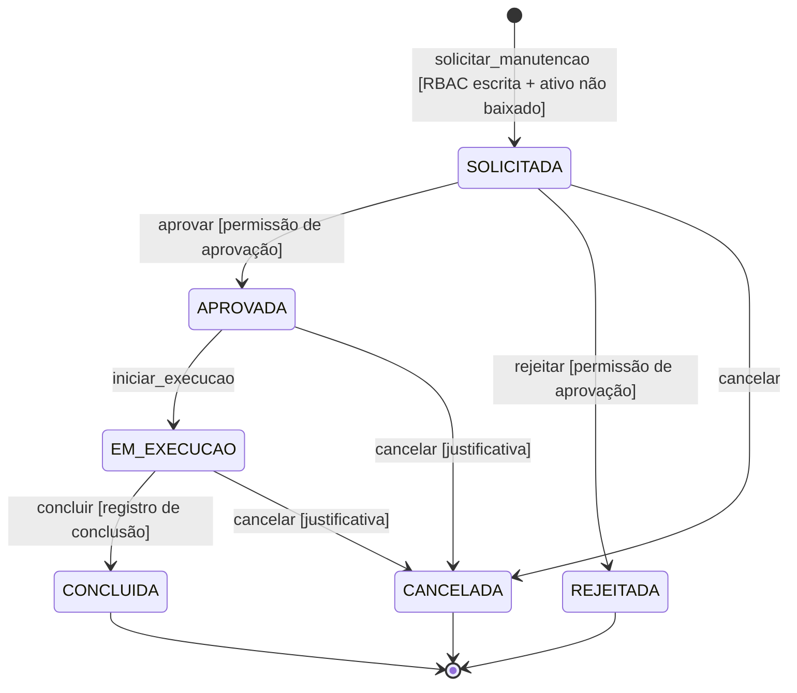
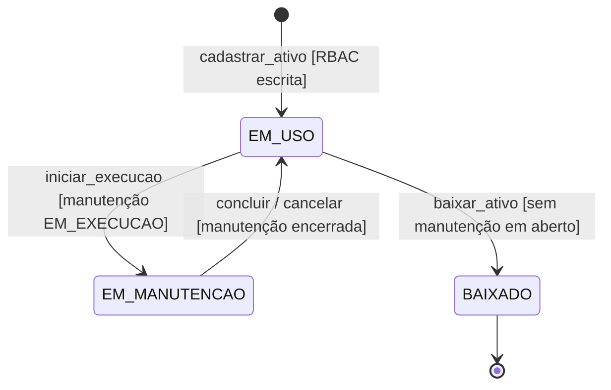
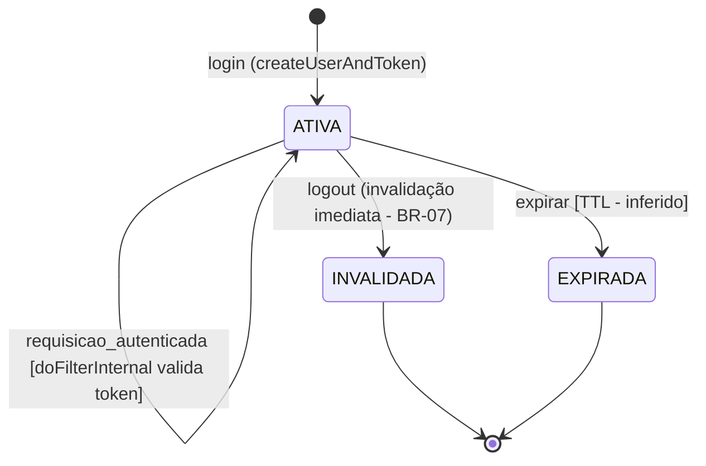
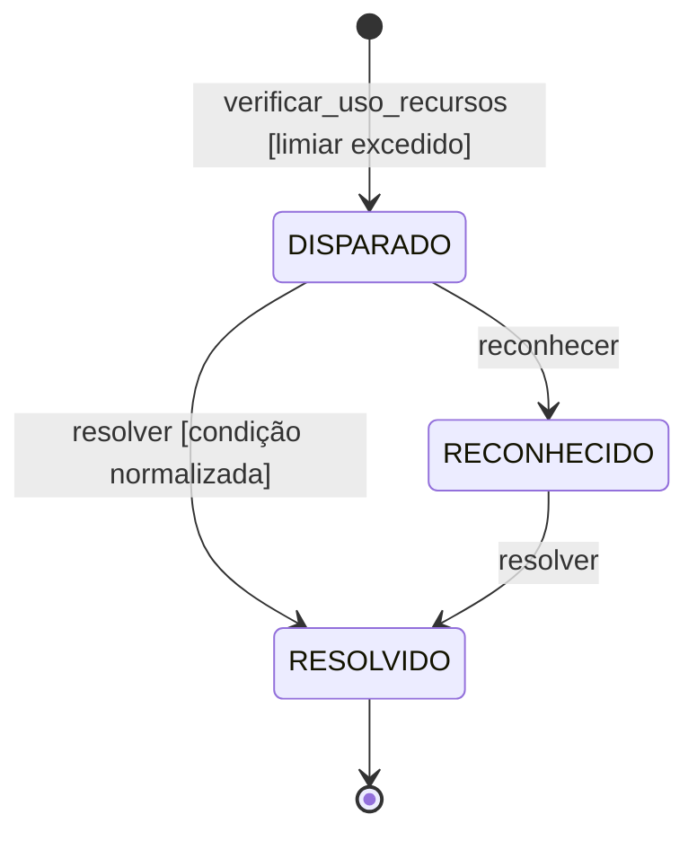

# Formal State Machine (FSM) Specifications — AegisPatrimônio (a6)

> **Versão:** 1.0 · **Owner:** Engenharia · **Status:** Draft
> **Artefatos-fonte:** System Architecture Document (SAD) v1.0 — a6 · AegisPatrimônio; NFRs v1.0 referenciados no SAD
> **Aviso de escopo:** a varredura determinística do workspace **não detectou tabelas no schema** e **não detectou rotas/IPC/handlers no código**. Nenhum estado de entidade é, portanto, verificável em DDL ou em catálogo de endpoints. As máquinas abaixo são ancoradas nas entidades e fluxos evidenciados no SAD (§1, §3, §5, §8–§10) e nos comportamentos referenciados pelos NFRs. Todo estado, guarda, evento ou side effect não explicitável diretamente no código recebe o rótulo **[INFERIDO POR IA — REQUER VALIDAÇÃO HUMANA]**, com as premissas descritas.

---

## 1. Escopo, Entidades Cobertas e Nível de Confiança

### 1.1 Entidades do SAD e tratamento neste documento

| Entidade (SAD §5) | Evidência no codebase | Modelada como FSM? | Seção |
| :--- | :--- | :--- | :--- |
| Manutenção | `ManutencaoSpecification` (filtros combinados); "fluxo de manutenção com aprovação" (SAD §1/§8) | Sim — **máquina core** | 2 |
| Ativo | `AtivoService`, `AtivoMapper` (CRUD, busca e ranking) | Sim (estados inferidos) | 3 |
| Sessão/Token (Usuario/Funcionario) | `createUserAndToken`, `doFilterInternal`, `authInterceptor`, `clearSession` | Sim | 4 |
| Alertas | `AlertNotificationService.checkResourceUsageAlerts` | Sim (totalmente inferida) | 5 |
| Histórico de saúde por filial | `getHealthHistory` | Não — registro append-only, sem transições de estado | — |
| Trilha de auditoria | `onUpdate`/`preUpdate` (BR-08) | Não — registro append-only, sem transições de estado | — |

### 1.2 Notação

- **Evento:** operação de negócio que dispara a transição. O catálogo de endpoints HTTP não foi extraído do repositório (NFR-M03), portanto o mapeamento evento → endpoint fica pendente da [[api-specification]].
- **Guarda:** condição que deve ser verdadeira para a transição ocorrer. Guardas de permissão refletem o RBAC com contexto (perfil + filial/departamento) que cobre **100% das operações de escrita** (BR-01/BR-04, NFR-SEC02).
- **Side effects:** efeitos colaterais observáveis. A trilha de auditoria via `onUpdate`/`preUpdate` (BR-08) com data/hora (NFR-O04) é side effect obrigatório de toda transição de escrita.

### 1.3 Premissas gerais [INFERIDO POR IA — REQUER VALIDAÇÃO HUMANA]

1. Os **nomes de estados** (ex.: `SOLICITADA`, `EM_EXECUCAO`, `BAIXADO`) não constam de nenhum DDL ou enum verificável — são propostas de contrato a validar pela engenharia e refletir em [[db-schema-spec]].
2. Os **eventos** correspondem a operações de negócio evidenciadas ou plausíveis nos serviços Java (`AtivoService`, `AlertNotificationService`); nenhum handler/rota foi extraído, então a exposição HTTP de cada evento não é confirmável.
3. O **motor de persistência não está especificado** (C-01 do BRD) — todas as decisões de persistência, lock e atomicidade condicionam-se à confirmação do levantamento técnico (ver Seções 6 e 7).
4. A **sincronização entre as máquinas de Manutenção e Ativo** (ex.: manutenção em execução ⇒ ativo em manutenção) é premissa de consistência derivada do relacionamento ativo ↔ manutenção indicado no SAD §5.

---

## 2. Core State Machine: Manutenção (Fluxo de Manutenção com Aprovação)

### 2.1 Purpose

O SAD posiciona o "fluxo de manutenção com aprovação" como processo de negócio central do AegisPatrimônio (SAD §1; a indisponibilidade do sistema bloqueia esse fluxo — SAD §8, NFR-A01). É modelado como FSM porque:

- a **aprovação é um controle obrigatório**: nenhuma execução pode ocorrer sem aprovação prévia de perfil autorizado (RBAC com contexto — BR-04); a FSM torna essa ordem estrutural, não convencional;
- os **estados terminais devem ser imutáveis** para preservar a trilha de auditoria (BR-08) e o valor do histórico como registro patrimonial;
- a entidade é consultada por filtros combinados (`ManutencaoSpecification`), o que exige um domínio de estados fechado e bem definido.

> Estados, guardas de execução/cancelamento e side effects além da auditoria são **[INFERIDO POR IA — REQUER VALIDAÇÃO HUMANA]** — o codebase evidencia a existência do fluxo com aprovação, mas não os nomes dos estados.

### 2.2 Valid States

| Estado | Descrição | É estado final? |
| :--- | :--- | :--- |
| `SOLICITADA` | Solicitação de manutenção registrada para o ativo, aguardando decisão de aprovação | Não |
| `APROVADA` | Solicitação aprovada por perfil autorizado; manutenção autorizada a iniciar execução | Não |
| `EM_EXECUCAO` | Manutenção em andamento no ativo | Não |
| `CONCLUIDA` | Manutenção finalizada com registro de conclusão | Sim |
| `REJEITADA` | Solicitação rejeitada pelo aprovador; ciclo encerrado sem execução | Sim |
| `CANCELADA` | Solicitação ou manutenção cancelada antes da conclusão | Sim |

### 2.3 Transition Matrix

| Estado Atual | Evento | Próximo Estado | Guarda (Condição) | Side Effects |
| :--- | :--- | :--- | :--- | :--- |
| `—` (registro inexistente) | `solicitar_manutencao` | `SOLICITADA` | Ativo existente e não `BAIXADO` (Seção 3); usuário autenticado com permissão de escrita no contexto filial/departamento (BR-01/NFR-SEC02) | Criação do registro; auditoria via `onUpdate`/`preUpdate` (BR-08) com ator e data/hora (NFR-O04) |
| `SOLICITADA` | `aprovar` | `APROVADA` | Usuário com permissão de aprovação no contexto do ativo (BR-04) [INFERIDO: papel de aprovador distinto do solicitante] | Auditoria da transição (BR-08); registro do aprovador e data/hora (NFR-O04) |
| `SOLICITADA` | `rejeitar` | `REJEITADA` | Usuário com permissão de aprovação (BR-04); motivo da rejeição informado [INFERIDO] | Auditoria (BR-08) com motivo registrado |
| `SOLICITADA` | `cancelar` | `CANCELADA` | Usuário com permissão de escrita (BR-01); solicitante ou perfil autorizado [INFERIDO] | Auditoria (BR-08) |
| `APROVADA` | `iniciar_execucao` | `EM_EXECUCAO` | Usuário com permissão de escrita (BR-01); ativo em `EM_USO` (Seção 3) [INFERIDO] | Auditoria (BR-08); sincroniza estado do ativo para `EM_MANUTENCAO` (Seção 3) [INFERIDO] |
| `APROVADA` | `cancelar` | `CANCELADA` | Usuário com permissão de escrita; justificativa informada [INFERIDO] | Auditoria (BR-08); sincroniza estado do ativo de volta para `EM_USO` [INFERIDO] |
| `EM_EXECUCAO` | `concluir` | `CONCLUIDA` | Registro de conclusão preenchido [INFERIDO]; usuário com permissão de escrita (BR-01) | Auditoria (BR-08); sincroniza ativo para `EM_USO` (Seção 3) [INFERIDO]; atualização do histórico de saúde do ativo/filial [INFERIDO — SAD §5 relaciona ativo ↔ manutenção ↔ histórico de saúde] |
| `EM_EXECUCAO` | `cancelar` | `CANCELADA` | Justificativa de cancelamento durante execução [INFERIDO] | Auditoria (BR-08); sincroniza ativo para `EM_USO` [INFERIDO] |

### 2.4 Invalid Transitions (Explicitamente Proibidas)

| De | Evento | Para | Motivo da Proibição |
| :--- | :--- | :--- | :--- |
| `CONCLUIDA` | qualquer | — | Estado terminal, imutável — alterações posteriores violariam a trilha de auditoria (BR-08) e o registro patrimonial |
| `REJEITADA` | qualquer | — | Estado terminal, imutável — nova necessidade de manutenção exige nova solicitação, preservando o histórico da decisão |
| `CANCELADA` | qualquer | — | Estado terminal, imutável |
| `REJEITADA` | `aprovar` | `APROVADA` | Reverter rejeição sem nova solicitação contornaria a decisão registrada do aprovador e corromperia a auditoria |
| `SOLICITADA` | `iniciar_execucao` | `EM_EXECUCAO` | Execução sem aprovação contorna o controle de aprovação coberto por RBAC (BR-04) — núcleo do "fluxo de manutenção com aprovação" |
| `SOLICITADA` | `concluir` | `CONCLUIDA` | Conclusão sem aprovação e execução pula etapas obrigatórias de controle |
| `EM_EXECUCAO` | `aprovar` | `APROVADA` | Aprovação retroativa viola a ordem do fluxo; aprovação só existe antes da execução |
| `EM_EXECUCAO` | `rejeitar` | `REJEITADA` | Rejeição é decisão sobre solicitação pendente, não sobre execução em andamento; o caminho permitido é `cancelar` |

### 2.5 Diagram

---

## 3. State Machine: Ativo (Ciclo de Vida Patrimonial)

### 3.1 Purpose

O Ativo é a **fonte única de verdade do patrimônio** (SAD §1, BRD §1) e é consultado por busca e ranking (`AtivoService`/`AtivoMapper`). É modelado como FSM para garantir que a situação do ativo permaneça **consistente com a máquina de Manutenção** (Seção 2) e que a baixa patrimonial seja terminal. O codebase evidencia o CRUD de ativos, mas **nenhum estado é verificável em DDL** — os estados abaixo são **[INFERIDO POR IA — REQUER VALIDAÇÃO HUMANA]**, com premissa de ciclo de vida patrimonial mínimo (em uso → em manutenção → baixado).

### 3.2 Valid States

| Estado | Descrição | É estado final? |
| :--- | :--- | :--- |
| `EM_USO` | Ativo cadastrado e em uso operacional, vinculado a filial/departamento (contexto RBAC — NFR-SEC02); presente nas buscas e no ranking | Não |
| `EM_MANUTENCAO` | Ativo com manutenção em execução (estado `EM_EXECUCAO` da máquina de Manutenção — Seção 2) | Não |
| `BAIXADO` | Ativo baixado do patrimônio; excluído das buscas/ranking; registro preservado para auditoria | Sim |

### 3.3 Transition Matrix

| Estado Atual | Evento | Próximo Estado | Guarda (Condição) | Side Effects |
| :--- | :--- | :--- | :--- | :--- |
| `—` (registro inexistente) | `cadastrar_ativo` | `EM_USO` | Usuário autenticado com permissão de escrita (BR-01); filial/departamento informado e válido (NFR-SEC02) | Criação do registro; auditoria (BR-08); entrada no catálogo de busca/ranking (`AtivoService`, `AtivoMapper.toDTO`) |
| `EM_USO` | `iniciar_execucao` (via Manutenção) | `EM_MANUTENCAO` | Existe manutenção vinculada transitando para `EM_EXECUCAO` (Seção 2) [INFERIDO] | Auditoria (BR-08) |
| `EM_MANUTENCAO` | `concluir` ou `cancelar` (via Manutenção) | `EM_USO` | Manutenção vinculada transita para `CONCLUIDA` ou `CANCELADA` (Seção 2) [INFERIDO] | Auditoria (BR-08); registro no histórico de saúde [INFERIDO] |
| `EM_USO` | `baixar_ativo` | `BAIXADO` | Usuário com permissão de escrita (BR-01); nenhuma manutenção em aberto (`SOLICITADA`, `APROVADA` ou `EM_EXECUCAO`) [INFERIDO] | Auditoria (BR-08); saída do ranking/busca |

### 3.4 Invalid Transitions (Explicitamente Proibidas)

| De | Evento | Para | Motivo da Proibição |
| :--- | :--- | :--- | :--- |
| `BAIXADO` | qualquer | — | Estado terminal, imutável — a baixa patrimonial encerra o ciclo; reativação exigiria novo cadastro com nova trilha de auditoria, não reversão |
| `BAIXADO` | `cadastrar_ativo` | `EM_USO` | Re-cadastro sobre o mesmo registro criaria duplicidade na fonte única de verdade do patrimônio (SAD §1); um novo patrimônio é uma nova entidade |
| `EM_MANUTENCAO` | `baixar_ativo` | `BAIXADO` | Ativo com manutenção em aberto deve primeiro concluir ou cancelar a manutenção (Seção 2) antes da baixa |
| `EM_USO` | `cadastrar_ativo` | `EM_USO` | Duplicação de registro de ativo existente; atualização é o caminho permitido, não novo cadastro |

### 3.5 Diagram

---

## 4. State Machine: Sessão/Token de Autenticação

### 4.1 Purpose

Ciclo de vida do token de acesso emitido no login (`createUserAndToken`) e validado a cada requisição (`doFilterInternal` no backend; `authInterceptor` no frontend — NFR-SEC02). É modelado como FSM porque a **invalidação imediata do token no logout (BR-07/NFR-SEC04) é requisito de segurança crítico**: uma vez invalidado, o token não pode voltar a ser válido — a FSM torna a invalidação um estado terminal. O armazenamento server-side do estado do token é pré-requisito dessa garantia e condiciona a arquitetura de escala (SAD §7/§12 — escalonamento horizontal adiado até resolver o armazenamento compartilhado de tokens).

### 4.2 Valid States

| Estado | Descrição | É estado final? |
| :--- | :--- | :--- |
| `ATIVA` | Token emitido e válido; requisições portadoras do token são aceitas após validação por `doFilterInternal` | Não |
| `EXPIRADA` [INFERIDO POR IA — REQUER VALIDAÇÃO HUMANA] | Token com tempo de vida (TTL) vencido. **Premissa:** nenhuma política de expiração de token é evidenciada nos fontes; o estado é proposto para completar o ciclo e a política de TTL deve ser definida pela engenharia | Sim |
| `INVALIDADA` | Token invalidado no logout (BR-07/NFR-SEC04); qualquer requisição com ele é rejeitada | Sim |

### 4.3 Transition Matrix

| Estado Atual | Evento | Próximo Estado | Guarda (Condição) | Side Effects |
| :--- | :--- | :--- | :--- | :--- |
| `—` (sem sessão) | `login` | `ATIVA` | Credenciais válidas; vínculo funcionário↔usuário consistente (`createFuncionarioAndUsuario`) | Emissão do token; armazenamento do estado do token no servidor (pré-requisito da invalidação imediata — SAD §7/§12) |
| `ATIVA` | `requisicao_autenticada` | `ATIVA` | Token válido na validação executada a cada requisição (`doFilterInternal` — NFR-SEC02) | Requisição segue o fluxo normal; correlation ID propagado (NFR-O02) |
| `ATIVA` | `logout` | `INVALIDADA` | — (usuário autenticado encerra a própria sessão) | **Invalidação imediata** do token (BR-07/NFR-SEC04); `clearSession` no frontend; nova autenticação obrigatória |
| `ATIVA` | `expirar` | `EXPIRADA` | TTL do token vencido [INFERIDO — política não evidenciada nos fontes, a definir] | Rejeição das requisições subsequentes com o token |

### 4.4 Invalid Transitions (Explicitamente Proibidas)

| De | Evento | Para | Motivo da Proibição |
| :--- | :--- | :--- | :--- |
| `INVALIDADA` | qualquer | — | Estado terminal, imutável — token invalidado não pode ser reativado (BR-07: invalidação imediata e definitiva); replay deve ser rejeitado em 100% das tentativas (NFR-SEC02/SEC04) |
| `EXPIRADA` | `requisicao_autenticada` | `ATIVA` | Token expirado não reautentica; a única via de retorno é nova emissão por login [INFERIDO — mecanismo de refresh não evidenciado nos fontes] |
| `EXPIRADA` | `reativar` | `ATIVA` | Renovação sem nova autenticação manteria o token além da política de validade e não é evidenciada nos fontes |

### 4.5 Diagram

---

## 5. State Machine: Alerta Operacional

> **[INFERIDO POR IA — REQUER VALIDAÇÃO HUMANA]** — máquina inteiramente inferida. O SAD evidencia `AlertNotificationService` com `checkResourceUsageAlerts` ("verificação de uso de recursos e alertas operacionais" — SAD §3/§10), base dos alertas de saturação do NFR-O03, mas **nenhum ciclo de vida de alerta é verificável no código**. Premissa adotada: alertas operacionais seguem ciclo mínimo disparado → reconhecido → resolvido.

### 5.1 Purpose

Garantir que todo alerta disparado pela verificação de uso de recursos seja rastreado até a resolução, sem reabertura de ocorrências encerradas (nova ocorrência da condição gera novo alerta), mantendo o histórico operacional íntegro.

### 5.2 Valid States

| Estado | Descrição | É estado final? |
| :--- | :--- | :--- |
| `DISPARADO` | Alerta criado pela verificação de uso de recursos (`checkResourceUsageAlerts`) e ainda não tratado | Não |
| `RECONHECIDO` | Alerta assumido por operador, em tratamento | Não |
| `RESOLVIDO` | Condição de alerta eliminada; ocorrência encerrada | Sim |

### 5.3 Transition Matrix

| Estado Atual | Evento | Próximo Estado | Guarda (Condição) | Side Effects |
| :--- | :--- | :--- | :--- | :--- |
| `—` (inexistente) | `verificar_uso_recursos` | `DISPARADO` | Métrica de uso acima do limiar de saturação (NFR-O03; base: `checkResourceUsageAlerts`) | Criação do alerta; notificação interna [INFERIDO] |
| `DISPARADO` | `reconhecer` | `RECONHECIDO` | Operador assume o tratamento [INFERIDO] | Registro do operador e data/hora [INFERIDO] |
| `DISPARADO` | `resolver` | `RESOLVIDO` | Condição normalizada sem tratamento necessário [INFERIDO] | Registro de resolução [INFERIDO] |
| `RECONHECIDO` | `resolver` | `RESOLVIDO` | Condição de saturação eliminada [INFERIDO] | Registro de resolução com data/hora [INFERIDO] |

### 5.4 Invalid Transitions (Explicitamente Proibidas)

| De | Evento | Para | Motivo da Proibição |
| :--- | :--- | :--- | :--- |
| `RESOLVIDO` | qualquer | — | Estado terminal, imutável — reabertura violaria o histórico operacional; nova ocorrência da condição gera novo alerta |
| `RECONHECIDO` | `reconhecer` | `DISPARADO` | Retrocesso de alerta já assumido corromperia a responsabilidade registrada |

### 5.5 Diagram

---

## 6. Idempotency & Concorrência

* **Estratégia de lock:** o modelo de concorrência e lock do motor de persistência é **desconhecido** até a confirmação do motor (C-01 do BRD; nota do NFR §2) — nenhuma decisão de lock pode ser considerada definitiva neste documento. [INFERIDO POR IA — REQUER VALIDAÇÃO HUMANA] *Premissa: dado o SQL cru sem ORM (stack verificada), a estratégia recomendada é **optimistic locking via coluna de versão**, implementada manualmente nas instruções de atualização — ex.: `UPDATE manutencao SET status = :novo_estado, versao = :versao + 1 WHERE id = :id AND status = :estado_atual AND versao = :versao` (consulta parametrizada — NFR-SEC03) — de modo que a verificação de estado (guarda) e a gravação sejam **atômicas em uma única instrução**. Com instância única e 150 usuários concorrentes (NFR-S01), lock distribuído não se aplica; lock pessimista por transação fica como alternativa para transições que tocam múltiplas entidades (ex.: transição de manutenção + sincronização do ativo).*
* **Comportamento em transição duplicada:** transições protegidas por verificação de estado atual são naturalmente idempotentes — a segunda chamada encontra o estado já alterado e é **rejeitada com erro de negócio** (apresentado sem exposição de detalhes internos — NFR-U02) ou tratada como no-op. Especificamente: `logout` duplicado é **idempotente (no-op)**, pois o token já está em `INVALIDADA` e a invalidação imediata (BR-07) impede regressão; `aprovar`/`rejeitar` duplicados **não são no-op** — a segunda chamada deve ser rejeitada (o estado não é mais `SOLICITADA`), preservando a auditoria da decisão original; `login` emite novo token a cada chamada válida (não idempotente por design), com múltiplas sessões simultâneas por usuário permitidas [INFERIDO — política de sessões múltiplas não evidenciada].
* **Race conditions conhecidas:**
  1. **Duplo clique no frontend em aprovar/rejeitar/cancelar** — duas requisições simultâneas sobre o mesmo registro; sem verificação atômica de estado, ambas poderiam vencer. Mitigação: guarda atômica na instrução de atualização (ver estratégia de lock).
  2. **Aprovação concorrente com cancelamento** — `aprovar` e `cancelar` simultâneos sobre `SOLICITADA`; apenas um deve vencer a guarda atômica.
  3. **Transição de manutenção + sincronização do ativo** — `iniciar_execucao`/`concluir`/`cancelar` atualizam duas entidades (manutenção e ativo); sem transação confirmada no motor (C-01), há risco de estado inconsistente (ativo `EM_MANUTENCAO` sem manutenção `EM_EXECUCAO` vinculada). Recuperação na Seção 8.
  4. **Logout vs. requisição em voo** — `doFilterInternal` valida o token no início da requisição; uma requisição que já passou da validação pode concluir após o logout. Janela aceita e a documentar [INFERIDO — comportamento não mensurado nos fontes].
  5. **Ranking em memória durante escritas concorrentes** — `AtivoService.java:119` carrega até 1000 candidatos (id+nome) e ranqueia em memória (TODO + diagnóstico AST); leituras podem refletir instantâneos defasados durante `baixar_ativo`. Meta: p95 < 1,5s com 1000 candidatos (NFR-P04).

---

## 7. Persistência do Estado

* **Onde o estado é armazenado:** **gap confirmado pela varredura** — nenhuma tabela foi detectada no schema e o motor de persistência **não está especificado** (C-01 do BRD). Nenhuma coluna de estado é hoje verificável em DDL; o contrato físico vive em [[db-schema-spec]] e ainda não foi extraído do código. Requisito de especificação para [[db-schema-spec]] — colunas mínimas para suportar as máquinas deste documento [INFERIDO POR IA — REQUER VALIDAÇÃO HUMANA — nomes propostos, a validar]:
  * **Manutenção:** coluna de estado (`status`) com domínio fechado `SOLICITADA | APROVADA | EM_EXECUCAO | CONCLUIDA | REJEITADA | CANCELADA`; coluna de versão (lock otimista — Seção 6); ator e data/hora das transições relevantes;
  * **Ativo:** coluna de situação (`situacao`) com domínio `EM_USO | EM_MANUTENCAO | BAIXADO`; vínculo com filial/departamento (contexto RBAC — NFR-SEC02);
  * **Sessão/Token:** armazenamento server-side de tokens (pré-requisito da invalidação imediata — BR-07/NFR-SEC04; SAD §7/§12);
  * **Alerta:** coluna de estado com domínio `DISPARADO | RECONHECIDO | RESOLVIDO`.

  A implementação concreta (constraints de domínio, índices) depende da confirmação do motor (C-01) e deve ser registrada em [[db-schema-spec]] e [[db-migration-spec]] — nenhum mecanismo de migração foi identificado no repositório.
* **Auditoria de transições:** mecanismo **já implementado no código** — callbacks `onUpdate`/`preUpdate` (BR-08), consultáveis por registro com data/hora da última modificação (NFR-O04), parcialmente validado no NFR. Requisito: toda transição das máquinas deste documento deve ser capturada com **ator, estado anterior, estado novo e timestamp** [INFERIDO — o detalhamento de campos não é verificável nos fontes]. O backup diário (RPO ≤ 24h — NFR-A03) deve incluir obrigatoriamente a trilha de auditoria e o histórico de saúde; consequência conhecida e aceita (SAD §8/§12): em desastre, até 24h de histórico de transições podem ser perdidas.

---

## 8. Error & Recovery States

| Estado de Erro | Origem | Como se recupera |
| :--- | :--- | :--- |
| Transição rejeitada por guarda (ex.: aprovação sem permissão, baixa com manutenção em aberto) | Guarda RBAC ou de estado falhou na validação | Erro de negócio apresentado ao usuário via `handleApiError` (tratamento uniforme, sem exposição de detalhes internos — NFR-U02); usuário corrige contexto/fluxo e repete |
| Estado inconsistente entre entidades (ex.: ativo `EM_MANUTENCAO` sem manutenção `EM_EXECUCAO` vinculada) | Falha entre a transição da manutenção e a sincronização do ativo (Seção 6, item 3) | Reconciliação manual documentada — instância única com SPOF aceito (NFR-A04); restauração manual com RTO ≤ 4h, testada a cada semestre (NFR-A02/A04) |
| Sessão órfã (token válido no servidor sem correspondência no cliente após falha) | Falha entre a emissão do token e o `clearSession` no frontend | Logout explícito ou expiração do token [INFERIDO — política de TTL a definir]; nova autenticação obrigatória |
| Perda de transições após desastre (RPO ≤ 24h) | Indisponibilidade do servidor único sem backup do período | Restauração a partir do backup diário (NFR-A03); re-registro manual das transições perdidas com base em fontes externas (ex.: registros físicos de manutenção) [INFERIDO] |
| Alerta `DISPARADO` persistente não tratado | Saturação de recursos não resolvida (`checkResourceUsageAlerts`) | Tratamento operacional da condição até `RESOLVIDO` (Seção 5); se a instância ficar indisponível, aplica-se RTO ≤ 4h (NFR-A01/A02) |

---

## 9. Testes Obrigatórios

- [ ] Todas as transições válidas das 4 máquinas cobertas por teste na camada de serviço (cobertura ≥ 80% em service/mapper — NFR-M01–M06)
- [ ] Todas as transições inválidas rejeitadas com erro apropriado, sem exposição de detalhes internos (NFR-U02)
- [ ] Idempotência validada: logout duplicado (no-op); aprovação/rejeição duplicadas (rejeitadas)
- [ ] Estados finais são realmente imutáveis: `CONCLUIDA`, `REJEITADA`, `CANCELADA`, `BAIXADO`, `INVALIDADA`, `EXPIRADA`, `RESOLVIDO`
- [ ] Guardas de RBAC testadas em 100% das operações de escrita (BR-01/BR-04), incluindo contexto filial/departamento (NFR-SEC02)
- [ ] Concorrência: testes de transições simultâneas (duplo clique; aprovação vs. cancelamento) validando a guarda atômica de estado
- [ ] Replay de token invalidado/expirado rejeitado em 100% das tentativas (NFR-SEC02/SEC04)
- [ ] Consistência entre máquinas: `iniciar_execucao`, `concluir` e `cancelar` validam a sincronização manutenção ↔ ativo (Seções 2 e 3)

---

## 10. Lacunas de Verificação

| Lacuna | Impacto neste documento | Onde resolver |
| :--- | :--- | :--- |
| Nomes de estados não verificáveis em DDL (nenhuma tabela detectada na varredura) | Todos os domínios de estado são propostas [INFERIDO] | [[db-schema-spec]] |
| Catálogo de endpoints não extraído do repositório (NFR-M03) | Mapeamento evento → endpoint pendente | [[api-specification]] |
| Motor de persistência não especificado (C-01 do BRD) | Estratégia de lock, atomicidade e constraints de domínio condicionadas | Levantamento técnico do BRD §8; [[db-migration-spec]] |
| Política de expiração (TTL) de token não evidenciada nos fontes | Estado `EXPIRADA` e guarda `expirar` são inferidos | Decisão de engenharia + revalidação do NFR-SEC02 |
| Política de sessões múltiplas por usuário não evidenciada | Comportamento de `login` múltiplo inferido | Decisão de engenharia |
| Stub `Usuario.setUsername` com corpo vazio (`Usuario.java:86` — NFR-M05/C-04) | Atualizações de username podem ser no-op silenciosos, risco de inconsistência entre estado percebido e persistido | Implementar o método ou removê-lo do fluxo de atualização (C-04) |