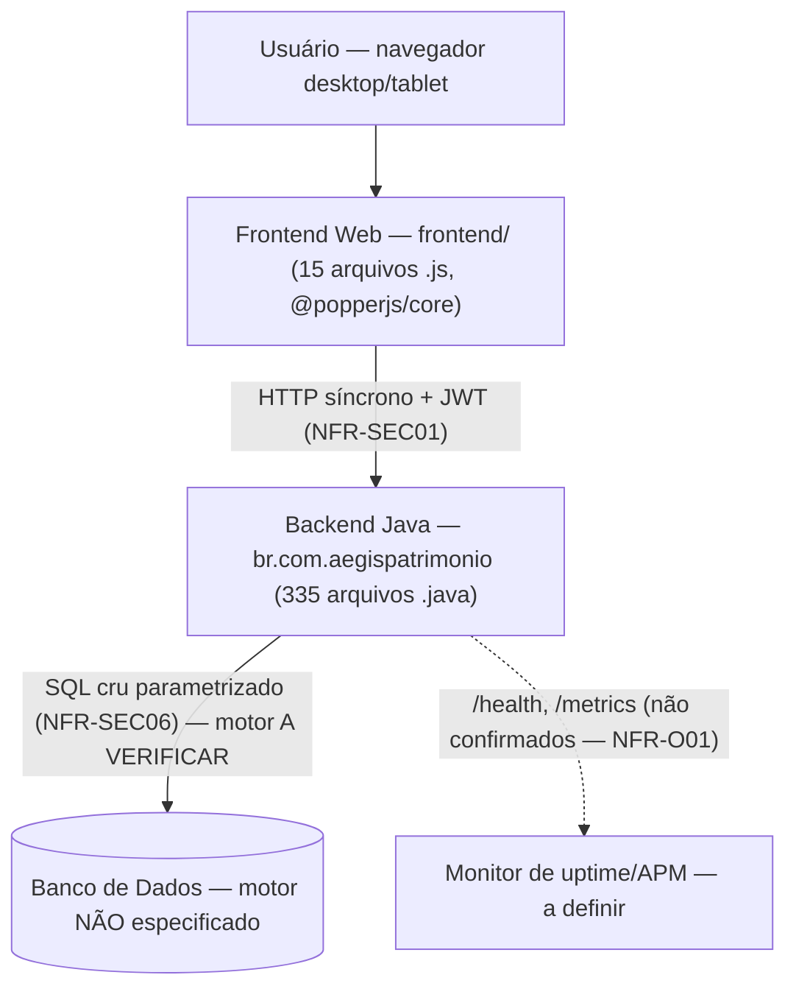
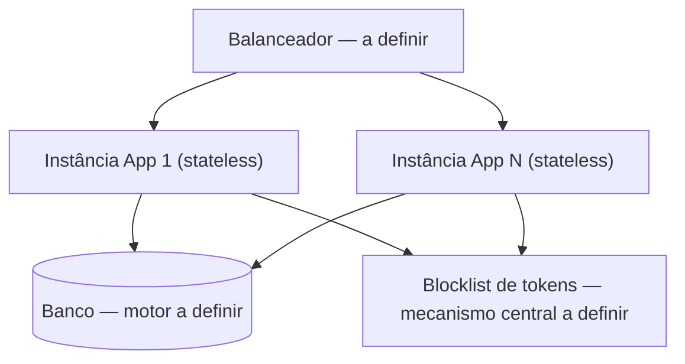

# System Architecture Document (SAD) — Sistema de Gestão de Patrimônio (A4)

> **Versão:** 1.0 · **Owner:** Arquitetura/Engenharia · **Status:** Draft
> **ADRs relacionadas:** Nenhuma ADR formal foi encontrada na varredura determinística do workspace. As decisões de arquitetura estão registradas inline neste documento (Seções 12 e 13); recomenda-se formalizá-las em ADRs — em especial: motor de banco de dados, estratégia de cache para relatórios, escalonamento horizontal e estratégia de backup.
> **Fontes:** [[nfr]] (Non-Functional Requirements v1.0), diagnóstico determinístico do codebase (varredura AST real — 350 arquivos, 1.268 funções, 344 classes, 27.537 LOC), `package.json` do workspace.

## 1. Overview & Goals

O **Sistema de Gestão de Patrimônio (A4)** é uma aplicação web server-side para gestão de ativos patrimoniais, composta por:

- **Backend Java** — 335 arquivos `.java` em `src/`, organizados no pacote `br.com.aegispatrimonio` (camadas visíveis na varredura: `config`, `mapper`, `model`, `repository`, `service`);
- **Frontend web** — 15 arquivos `.js` em `frontend/`, com `@popperjs/core` ^2.11.8 como única dependência de produção declarada;
- **Banco de dados** — **motor não especificado** nas dependências verificadas; acesso a dados presumivelmente via **SQL cru, sem ORM**.

A varredura AST identificou 1.268 funções e 344 classes; **nenhuma rota/handler declarado** e **nenhuma tabela de banco** foram detectados — os endpoints e entidades referenciados neste documento derivam dos NFRs/BRD e dos nomes de classes verificadas, e requerem confirmação (Seção 12).

**Objetivos arquiteturais** (ancorados no [[nfr]]):

| Objetivo | Meta | Fonte |
| :--- | :--- | :--- |
| Performance | p95 < 200ms (excl. relatórios pesados); relatórios < 3s p95 para 10.000+ ativos | NFR-P01, NFR-P04 |
| Escalabilidade | 10.000+ ativos e 1.000+ usuários simultâneos; paginação server-side obrigatória | NFR-S01, NFR-S04 |
| Disponibilidade | Uptime 99,5% mensal; RTO ≤ 1h; RPO ≤ 15min | NFR-A01–A03 |
| Segurança | JWT (1h/7d) + blocklist de logout; RBAC Admin/User; SQL 100% parametrizado | NFR-SEC01, SEC04, SEC06 |
| Manutenibilidade | Cobertura de testes > 80% com gate de CI; complexidade ciclomática ≤ 10 | NFR-M01, NFR-M02 |

**Não-objetivos** (fora do escopo verificado): multi-tenancy (o modelo de acesso é por roles internas Admin/User — NFR-SEC04), arquitetura distribuída de alta disponibilidade (clusters multi-região, auto-scaling automático — não suportados pela stack verificada), empacotamento desktop (não existe `src-tauri/Cargo.toml` — verificado na stack) e apps nativos (NFR-PO02).

## 2. Tech Stack Justification

A tabela abaixo reflete **exclusivamente** o que foi verificado no workspace (`package.json` raiz + varredura AST). O arquivo de build do backend Java não foi coberto pela varredura de stack (que analisou o `package.json` raiz, que declara apenas `@popperjs/core`); por isso, várias células indicam "não verificado" em vez de tecnologias presumidas.

| Camada | Tecnologia Escolhida (verificada) | Alternativas Consideradas | Justificativa Resumida |
| :--- | :--- | :--- | :--- |
| Language/Runtime | **Java** (backend — 335 arquivos em `src/`, pacote `br.com.aegispatrimonio`; versão não especificada no diagnóstico) + **JavaScript** (frontend — 15 arquivos em `frontend/`) | Não documentado — nenhuma alternativa registrada em ADR ou artefato-fonte | Linguagens efetivamente presentes no codebase (varredura AST: 335 `.java`, 15 `.js`) |
| Framework Web | **Não verificado** — nenhum framework declarado nas dependências verificadas; o framework do backend (se houver) residiria no arquivo de build do backend, não coberto pela varredura. No frontend, não há framework SPA pesado (única dependência de produção: `@popperjs/core` ^2.11.8) | Não documentado | A varredura de stack cobriu apenas o `package.json` raiz — lacuna de verificação ([[nfr]], Seção 12, item 1) |
| Banco de Dados | **Não especificado** — nenhum motor identificado nas dependências verificadas; acesso a dados presumivelmente **SQL cru** | Não documentado — nenhum candidato nomeado em artefato-fonte | Motor real precisa ser identificado no arquivo de build do backend; impacta backup/RPO (NFR-A03), concorrência de escrita (NFR-S01) e segurança (NFR-SEC06) |
| Mensageria/Fila | **Nenhuma detectada** — não há evidência de broker/fila no codebase | — | Não é requisito do [[nfr]]; o processamento de alertas (`AlertNotificationService`) aparenta rodar in-process |
| Cache | **Nenhuma tecnologia verificada** | — | Estratégias de cache para relatórios (risco R-03 do BRD) exigem decisão de arquitetura própria — ver Seção 7 |
| Infraestrutura/Cloud | **Não verificada** — nenhuma configuração de deploy, provedor, TLS ou domínio encontrada no codebase | Não documentado | NFR-PO03: deploy em servidor web/infraestrutura a definir; multi-cloud não se aplica à topologia atual |

**Observação sobre dependências:** o `package.json` declara **1 dependência de produção** (`@popperjs/core` ^2.11.8), **0 de desenvolvimento** e **nenhum script** — não há toolchain de build/teste verificável pelos artefatos atuais (NFR-M01, lacuna 3 do NFR).

## 3. High-Level Architecture

A arquitetura verificada é um **monolito server-side único**: um backend Java que concentra regras de negócio, acesso a dados e autenticação, consumido por um frontend web via HTTP. O frontend (`frontend/src/services/api.js`) é o ponto único de integração client-side — sua função `request` (linha 54, complexidade ciclomática 13) centraliza as chamadas ao backend. Não há evidência de serviços independentes, filas ou balanceamento; a comunicação entre frontend e backend é síncrona.

O diagrama de containers (C4) é mantido em [[uml-diagrams]] — não duplique o diagrama aqui, apenas referencie-o. **Nota:** nenhum diagrama foi produzido a partir da varredura; o artefato [[uml-diagrams]] deve ser criado/validado com base nas camadas abaixo.

### Componentes

| Componente | Responsabilidade | Tecnologia | Escala Independente? |
| :--- | :--- | :--- | :--- |
| Frontend Web (`frontend/`) | Interface responsiva (desktop/tablet — NFR-U01), consumo da API, limpeza de sessão no logout (RF-25 `clearSession`) | JavaScript + `@popperjs/core` ^2.11.8 | Não — topologia única, sem infra de deploy separada verificada |
| Backend / API (`src/`, `br.com.aegispatrimonio`) | Endpoints autenticados (JWT — NFR-SEC01), RBAC Admin/User (NFR-SEC04), validação de entrada (NFR-SEC05), regras de negócio de ativos e manutenção | Java | Não — instância única server-side |
| Camada de Serviços (`service/`) | Lógica de negócio: `AtivoService` (operações de ativos; TODO de performance na linha 119), `AlertNotificationService` (alertas; `checkResourceUsageAlerts`, linha 96) | Java | Não |
| Camada de Acesso a Dados (`repository/`) | Consultas, incluindo construção dinâmica: `ManutencaoSpecification.build` (linha 26, complexidade 14) — filtragem de manutenção (RF-15/RF-22) | Java + SQL cru (sem ORM) | Não |
| Camada de Mapeamento (`mapper/`) | Conversão entidade↔DTO: `AtivoMapper.toDTO` (linha 15, complexidade 14) | Java | Não |
| Modelo de Domínio (`model/`) | Entidades — nomes derivados das classes verificadas: `Usuario` (com stub `setUsername`, linha 86), `Ativo`, `Manutenção` | Java | Não |
| Configuração / Seeder (`config/`) | Configuração da aplicação e carga de dados: `RealisticDataSeeder.run` (linha 34) — relevante ao risco R-02 do BRD (migração de dados legados) | Java | Não |

**Rotas/handlers:** a varredura determinística **não detectou rotas/IPC declarados no código**. Os endpoints funcionais referenciados pelos NFRs (autenticação RF-23/24/25, ativos RF-14/15/17, manutenção RF-18–21, aprovação UC-03) e os endpoints de observabilidade (`/health`, `/metrics` — NFR-O01) **não estão confirmados no codebase** e constituem lacuna de verificação (Seção 12, item 5).

## 4. Architectural Style & Patterns

* **Estilo:** **Monolito modular server-side** (aplicação web única). A organização em pacotes (`config`, `mapper`, `model`, `repository`, `service`) evidencia camadas horizontais dentro de um único deploy. **[INFERIDO POR IA — REQUER VALIDAÇÃO HUMANA — a caracterização "monolito modular" generaliza a partir da organização de pacotes visível; a topologia server-side única é fato verificado]**
* **Padrões aplicados (observados no código):**
  * **Repository/Specification** — `ManutencaoSpecification.build` (`src/main/java/br/com/aegispatrimonio/repository/ManutencaoSpecification.java:26`) constrói consultas dinamicamente para a filtragem de manutenção; por usar SQL cru sem ORM, a especificação é responsável direta por parametrização e índices (NFR-SEC06, NFR-P01).
  * **DTO/Mapper** — `AtivoMapper.toDTO` (`src/main/java/br/com/aegispatrimonio/mapper/AtivoMapper.java:15`) converte entidades para DTOs; a complexidade 14 indica mapeamento condicional extenso a revisar (NFR-M02).
  * **Service Layer** — `AtivoService` e `AlertNotificationService` concentram as regras de negócio.
  * **Seeder de dados** — `RealisticDataSeeder` (`src/main/java/br/com/aegispatrimonio/config/seeder/RealisticDataSeeder.java:34`) para carga de dados realistas (risco R-02 do BRD — executar em staging com validação, conforme nota do NFR-M02).
  * **Autenticação stateless com blocklist** — o JWT (NFR-SEC01) favorece instâncias stateless; o logout invalida o token server-side via blocklist (CA-08), introduzindo estado compartilhado (ver Seções 7 e 12).
* **Comunicação entre componentes:** **síncrona via HTTP** — o frontend consome o backend através de `frontend/src/services/api.js` (função `request`), e os contratos de erro usam status HTTP padronizados (401/403/400/404 — NFR-SEC01/SEC04/SEC05). **Não há comunicação assíncrona (filas/eventos) detectada**; o processamento de alertas (`AlertNotificationService.checkResourceUsageAlerts`) aparenta execução in-process. **[INFERIDO POR IA — REQUER VALIDAÇÃO HUMANA — o modo de disparo dos alertas (agendamento vs. evento) não é detectável pela varredura]**

## 5. Data Modeling

A estratégia de dados é condicionada pelo fato mais crítico da stack: **o motor de banco não está especificado** e o acesso é presumivelmente **SQL cru, sem ORM**. Consequências diretas:

1. Não há camada de ORM que abstraia ou otimize consultas — **a qualidade de índices, planos de execução e parametrização é responsabilidade direta do código** (requisito para NFR-P01 e NFR-SEC06).
2. Metas de escrita concorrente (NFR-S01), backup/RPO (NFR-A03) e comportamento de lock **não podem ser calibradas** até que o motor real seja verificado (Seção 12, item 1).
3. **Nenhuma tabela foi detectada no schema** pela varredura — o contrato físico (tabelas, colunas, constraints, DDL) deve viver em [[db-schema-spec]] e o modelo conceitual em [[db-domain-model]]; ambos precisam ser produzidos/validados.

Entidades observadas via nomes de classes verificadas: **Usuario** (autenticação/RBAC; contém o stub `setUsername` — `src/main/java/br/com/aegispatrimonio/model/Usuario.java:86`), **Ativo** (núcleo do domínio — `AtivoService`, `AtivoMapper`) e **Manutenção** (`ManutencaoSpecification`, fluxo RF-18–21). **[INFERIDO POR IA — REQUER VALIDAÇÃO HUMANA — nomes derivados de classes de serviço/mapper/repositório; o modelo completo de entidades não foi varrido]**

* **Estratégia de particionamento/sharding:** **Não aplicável** na topologia atual — o volume-alvo (10.000+ ativos, 1.000+ usuários — NFR-S01) é atendível por uma instância de banco devidamente indexada, e o motor ainda não foi verificado. **[INFERIDO POR IA — REQUER VALIDAÇÃO HUMANA — premissa: volume de dados modesto para qualquer motor relacional]**
* **Estratégia de migração de schema:** ver [[db-migration-spec]]. Nenhuma ferramenta de migração foi verificada no codebase; existe o seeder `RealisticDataSeeder` para carga de dados (não confundir com migração de schema), que deve ser executado em staging com validação por ser relevante ao risco R-02 do BRD (migração de dados legados).

## 6. Integration Boundaries & APIs

| Integração | Tipo | Direção | Contrato | Criticidade |
| :--- | :--- | :--- | :--- | :--- |
| Frontend ↔ Backend (API interna) | HTTP (REST presumido) **[INFERIDO POR IA — REQUER VALIDAÇÃO HUMANA]** | Frontend → Backend (inbound para o backend) | `frontend/src/services/api.js` — função `request` (linha 54); documentação formal via OpenAPI/Swagger prevista no NFR-M03 (**pendência** — ferramenta não verificada) | **Alta** — todos os fluxos de negócio dependem dela |
| Health/Metrics (`/health`, `/metrics`) | HTTP | Outbound (monitor externo consome) | NFR-O01 — **existência dos endpoints não confirmada no codebase** **[INFERIDO POR IA — REQUER VALIDAÇÃO HUMANA]** | Média — condição para monitorar o SLA (NFR-A01) |
| Integrações externas (pagamento, ERP, e-mail etc.) | — | — | **Nenhuma detectada no codebase** | — |

**Observações:**
- A função `request` de `api.js` concentra complexidade ciclomática 13 e contém chamadas residuais `console.error` (linha 44) e `console.debug` (linha 107) — devem ser removidas ou substituídas por tratamento de erro estruturado antes de produção (diagnóstico/NFR).
- A propagação de **request ID** do frontend para o backend (NFR-O02) deve ser implementada neste boundary para correlação de requisições nos fluxos críticos (autenticação, solicitação, aprovação).

## 7. Scalability & Performance Strategy

* **Estratégia de escala:** **dimensionamento vertical por instância** (CPU/memória) é a alavanca imediata — a topologia verificada é uma aplicação server-side única, sem orquestração/balanceamento. O escalonamento horizontal da camada de aplicação é classificado como **Should** (NFR-S02), com pré-condições: (a) instâncias stateless — o JWT favorece isso, mas a **blocklist server-side de logout** (CA-08) introduz estado compartilhado que exigirá mecanismo central a definir; (b) definição do motor de banco e sua estratégia de escala. Auto-scaling automático e clusters multi-região **não são suportados pela stack verificada** e não são requisito deste documento.
* **Metas quantitativas (do [[nfr]]):** p95 < 200ms / p99 < 500ms (NFR-P01); TTFB < 100ms em leituras simples (NFR-P02); LCP < 2,5s em 4G (NFR-P03); relatórios de custo total por ativo < 3s p95 para 10.000+ ativos (NFR-P04); 10.000+ ativos e 1.000+ usuários simultâneos com degradação < 10% sobre o baseline (NFR-S01); ≥ 100 req/s por instância em cenário misto 80/20 (NFR-S03); **paginação server-side obrigatória em toda listagem** (NFR-S04).
* **Pontos de gargalo conhecidos (do diagnóstico AST):**
  1. `src/main/java/br/com/aegispatrimonio/service/AtivoService.java:119` — **TODO de performance**: o caminho carrega até **1.000 candidatos (id+nome)** e faz ranking em memória; reavaliar contra NFR-P01/P04 antes do go-live.
  2. `src/main/java/br/com/aegispatrimonio/repository/ManutencaoSpecification.java:26` — construção dinâmica de consulta (complexidade 14); validar índices e plano de execução no banco real (quando verificado).
  3. `frontend/src/services/api.js:54` — função `request` com complexidade 13: camada única de HTTP client no frontend; qualquer degradação afeta todos os fluxos.
  4. Relatórios de custo total por ativo (RF-17) — risco R-03 do BRD (timeout em consultas pesadas).
* **Estratégia de cache:** **nenhuma tecnologia de cache está verificada na stack**. O BRD cita cache externo e materialização de consultas como mitigações do risco R-03, mas **não estão implementadas/verificadas** e exigem decisão de arquitetura própria (avaliada por relação custo-benefício — NFR-CO02). **[INFERIDO POR IA — REQUER VALIDAÇÃO HUMANA — premissas, caso adotado: camada única de cache externa ao processo da aplicação; invalidação acionada nas operações de escrita de ativos; escopo inicial restrito a leituras de relatório (RF-17)]**
* **Método de medição:** suíte de carga e APM **a definir** — nenhuma ferramenta verificada no codebase; candidatos a avaliar: k6 ou JMeter contra os endpoints autenticados (Admin/User), medindo p95/p99 por endpoint (NFR-P01). **[INFERIDO POR IA — REQUER VALIDAÇÃO HUMANA]**

## 8. Reliability & Fault Tolerance

* **Single points of failure identificados (NFR-A04):**
  1. **Instância única de aplicação** — não há redundância verificada; a queda da instância derruba todos os fluxos.
  2. **Banco de dados não especificado** — camada de dados sem estratégia de redundância/backup verificável.

  A eliminação completa de SPOF é meta de evolução condicionada à infraestrutura de deploy e **não é exigível na topologia atual**. Prioridade de disponibilidade: fluxo de solicitação de manutenção (RF-18, UC-02) — maior exposição ao usuário final (RNF-08).
* **Metas (do [[nfr]]):** uptime ≥ 99,5% mensal (SLA), excluindo janelas de manutenção programada (NFR-A01); RTO ≤ 1h para produção (NFR-A02); RPO ≤ 15min via rotina de backup do banco (NFR-A03) — **a estratégia de backup (frequência, full vs. incremental, teste de restore) depende do motor de banco real, ainda não verificado**.
* **Estratégias de resiliência:**
  * **Degradação graciosa (NFR-A05):** falhas em componentes não críticos — em especial as notificações de alerta (`AlertNotificationService`) — não devem impedir autenticação (RF-23), consulta de ativos (RF-14/RF-15) nem criação de solicitações (RF-18). **[INFERIDO POR IA — REQUER VALIDAÇÃO HUMANA]**
  * **Retry com backoff, circuit breaker, bulkhead, timeout:** **não há evidência desses padrões no código verificado**; devem ser definidos na camada de aplicação conforme a criticidade de cada fluxo. **[INFERIDO POR IA — REQUER VALIDAÇÃO HUMANA — premissa: padrões aplicados in-process, sem service mesh]**
* **Estratégia multi-região/multi-AZ:** **Não aplicável** à stack verificada (aplicação server-side única, sem infraestrutura de orquestração) — não é requisito deste documento.
* **Método de medição:** monitor de uptime externo + teste de restore de backup trimestral; ferramentas a definir (nenhuma verificada no codebase). **[INFERIDO POR IA — REQUER VALIDAÇÃO HUMANA]**

## 9. Security Architecture

* **Boundary de rede:** **nenhuma configuração de rede (VPC, subnets) ou de deploy foi verificada no codebase** (NFR-PO03) — a topologia de rede de produção está **a definir**. Requisito verificado do BRD: **HTTPS obrigatório em produção com TLS 1.2+** (NFR-SEC03).
* **Controles de segurança (derivados do [[nfr]], Seção 4):**
  * **Autenticação JWT** — access token expirando em 1h, refresh token em 7 dias; endpoints protegidos rejeitam requisições sem token com 401 (CA-06); logout limpa a sessão local e invalida o token server-side via **blocklist** (CA-08, RF-25 `clearSession`) (NFR-SEC01).
  * **Hash de senhas** — o BRD RNF-02 especifica bcrypt/argon2; o mecanismo efetivamente implementado no backend **não pôde ser verificado** na varredura de dependências — verificação obrigatória antes de aprovar o requisito (Seção 12, item 2) (NFR-SEC02).
  * **RBAC Admin/User** — toda operação de escrita em entidades mestres exige Admin; tentativas de User retornam 403 Forbidden (RF-26, RN-01/02, CA-01/CA-10); cobertura de 100% dos endpoints de escrita em testes de integração (NFR-SEC04).
  * **Validação de entrada server-side** — payloads inválidos → 400 Bad Request com mensagens claras; IDs inexistentes → 404 Not Found padronizado (NFR-SEC05).
  * **SQL 100% parametrizado** — requisito **crítico** dado o acesso a dados via SQL cru sem ORM (verificado na stack); consultas dinâmicas (`ManutencaoSpecification.build`) são **superfície de risco prioritária** para revisão de segurança (NFR-SEC06).
  * **Trilha de auditoria imutável** de todas as operações de escrita em todas as entidades (NFR-SEC07) — com tensão a resolver frente à LGPD (NFR-C02, ver Seção 13).
  * **OWASP Top 10** avaliado por release maior (NFR-SEC08); **MFA para acesso Admin** (NFR-SEC09, Should); **rotação de segredos** (chave de assinatura do JWT, credenciais de banco) a cada 90 dias (NFR-SEC10) — itens inferidos no NFR.
* **Achado de segurança funcional:** o stub `Usuario.setUsername` com corpo vazio (`src/main/java/br/com/aegispatrimonio/model/Usuario.java:86`) pode indicar bug funcional ou intencionalidade — **investigar com prioridade**, pois é potencialmente relevante para autenticação (RF-23/NFR-SEC01) (Seção 12, item 7).
* **Referência:** security-policies.md — políticas de segurança do projeto; os requisitos desta seção derivam do [[nfr]] e devem ser refletidos nesse artefato.

## 10. Observability Architecture

* **Logging centralizado:** logs estruturados no backend (NFR-O01); **ferramenta a definir** — nenhuma verificada no codebase. **[INFERIDO POR IA — REQUER VALIDAÇÃO HUMANA]**
* **Métricas:** exposição via `/metrics` e health check via `/health` para monitor de uptime (NFR-O01) — **existência dos endpoints não confirmada no codebase** (Seção 12, item 5). Alertas configurados para: p95 de latência acima de 200ms sustentado, taxa de erro > 1% e saturação de recursos da instância (NFR-O03). **[INFERIDO POR IA — REQUER VALIDAÇÃO HUMANA]**
* **Tracing distribuído:** **não se aplica** à topologia server-side única (não há múltiplos serviços); alternativa proporcional: correlação de requisições via **request ID** propagado do frontend (`frontend/src/services/api.js`) para o backend nos fluxos críticos — autenticação, solicitação, aprovação (NFR-O02). **[INFERIDO POR IA — REQUER VALIDAÇÃO HUMANA]**
* **Instrumentação de KPIs de processo (NFR-O04):** tempo médio de aprovação (< 4 horas úteis) e taxa de solicitações canceladas (< 10%) exigem registro de timestamps nas transições do fluxo de manutenção (RF-18 a RF-21).
* **Dívida de observabilidade (achado real do diagnóstico):** chamadas residuais `console.error` (`frontend/src/services/api.js:44`) e `console.debug` (`frontend/src/services/api.js:107`) devem ser removidas ou substituídas por tratamento de erro estruturado antes de produção.

## 11. Deployment Topology

**Topologia atual (verificada):** aplicação server-side única + banco de dados não especificado. Não há load balancer, múltiplas instâncias ou réplica de leitura verificados — o diagrama de referência do template (LB + 2 instâncias + réplica) **não se aplica** à stack atual.

**Topologia-alvo (evolução — NFR-S02):** **[INFERIDO POR IA — REQUER VALIDAÇÃO HUMANA]** — o escalonamento horizontal da camada de aplicação é classificado como **Should**, condicionado a: (a) instâncias stateless com mecanismo central para a blocklist de logout (CA-08); (b) definição do motor de banco e sua estratégia de escala. Premissa do diagrama abaixo: balanceador simples + N instâncias stateless da mesma aplicação, sem alteração do modelo de dados.

* **Deploy:** nenhuma configuração de deploy, provedor, TLS ou domínio verificada no codebase (NFR-PO03) — requisitos de multi-cloud não se aplicam à topologia atual.
* **Pipeline de CI/CD:** nenhum script declarado no `package.json` e nenhuma configuração de pipeline encontrada — o gate de cobertura > 80% (NFR-M01) não está implementado de forma verificável (Seção 12, item 3).

## 12. Trade-offs & Known Limitations

* **SQL cru sem ORM (verificado):** dá controle total sobre índices e planos de execução — alinhado à meta de p95 < 200ms (NFR-P01) — em troca de produtividade de desenvolvimento e de risco elevado de SQL injection; o risco é mitigado pelo requisito de parametrização obrigatória (NFR-SEC06), mas exige revisão prioritária das consultas dinâmicas (`ManutencaoSpecification.build`). Nenhuma ADR formal registrada.
* **Monolito server-side único (verificado):** simplicidade operacional e custo proporcional (NFR-CO01) em troca de SPOF na aplicação e disponibilidade limitada (NFR-A04); o escalonamento horizontal fica condicionado a pré-requisitos (NFR-S02).
* **Blocklist server-side de logout (CA-08):** segurança (invalidação real de tokens) em troca de estado compartilhado que complica a premissa de instâncias stateless necessária à escala horizontal (NFR-S02).
* **Frontend sem framework SPA (verificado — única dependência `@popperjs/core`):** bundle mínimo e LCP baixo (NFR-P03) em troca de produtividade de construção de UI e de ausência de toolchain verificada (0 dev dependencies, 0 scripts).
* **Paginação obrigatória vs. relatórios pesados (R-03):** a estratégia para relatórios de custo total por ativo (cache externo, materialização de consultas) não está verificada na stack e permanece decisão pendente (NFR-P04/NFR-CO02).
* **Débito técnico consciente registrado (NFR-M04):**
  * **1 stub** — `Usuario.setUsername` com corpo vazio (`src/main/java/br/com/aegispatrimonio/model/Usuario.java:86`) — potencialmente relevante para autenticação (RF-23); investigar com prioridade.
  * **1 TODO de performance** — `AtivoService.java:119` (até 1.000 candidatos + ranking em memória).
  * **2 chamadas console.\* residuais** — `api.js:44` e `api.js:107`.
  * **12 funções com complexidade ciclomática acima do limite proposto (≤ 10 — NFR-M02)**, incluindo as 5 detalhadas na varredura: `checkResourceUsageAlerts` (17), `run` (15), `toDTO` (14), `build` (14) e `request` (13).
* **Lacunas de verificação que bloqueiam decisões de arquitetura** (do [[nfr]], Seção 12): motor de banco (item 1), mecanismo de hash de senhas (item 2), pipeline CI/CD e scripts de execução (item 3), ferramentas de APM/load testing/uptime/acessibilidade (item 4), endpoints `/health` e `/metrics` (item 5), configuração de deploy/infraestrutura de produção (item 6), comportamento do stub `Usuario.setUsername` (item 7).

## 13. Future Evolution

* **Verificação e decisão do motor de banco de dados** (lacuna 1 do NFR) — desbloqueia NFR-A03 (backup/RPO), NFR-S01 (concorrência de escrita) e NFR-SEC06; é a pendência de maior impacto arquitetural.
* **Escalonamento horizontal da camada de aplicação** (NFR-S02): instâncias stateless + mecanismo central para a blocklist de tokens; formalizar em ADR.
* **Estratégia de performance para relatórios de custo** (R-03/NFR-P04): avaliar cache externo e/ou materialização de consultas por relação custo-benefício (NFR-CO02) — decisão de arquitetura própria, pois não há tecnologia de cache verificada na stack.
* **Refatoração dos hotspots de complexidade** (NFR-M02): `checkResourceUsageAlerts` (17), `run` (15), `toDTO` (14), `build` (14), `request` (13) — quebrar em unidades menores para atingir o limite ≤ 10.
* **Resolução do stub `Usuario.setUsername`** (`src/main/java/br/com/aegispatrimonio/model/Usuario.java:86`) — investigar se é bug funcional ou intencional antes de aprovar os requisitos de autenticação relacionados (NFR-M04/lacuna 7).
* **MFA para acesso administrativo** (NFR-SEC09, Should) e **rotação de segredos a cada 90 dias** (NFR-SEC10).
* **Compliance LGPD** (NFR-C01/C02): base legal documentada, direitos de acesso e eliminação, minimização de dados nos cadastros (RF-08/RN-06) e política de retenção que resolva a tensão entre a auditoria imutável (RNF-07) e o direito de eliminação — ex.: anonimização de dados pessoais em registros de auditoria preservados. **[INFERIDO POR IA — REQUER VALIDAÇÃO HUMANA]**
* **Observabilidade e CI/CD:** implementar pipeline com gate de cobertura > 80% (NFR-M01/lacuna 3), endpoints `/health` e `/metrics` (NFR-O01/lacuna 5) e seleção de ferramentas de APM/load testing/uptime (lacuna 4).
* **Formalização de ADRs** para as decisões hoje registradas inline: motor de banco, estratégia de cache, escalonamento horizontal e estratégia de backup/restore.