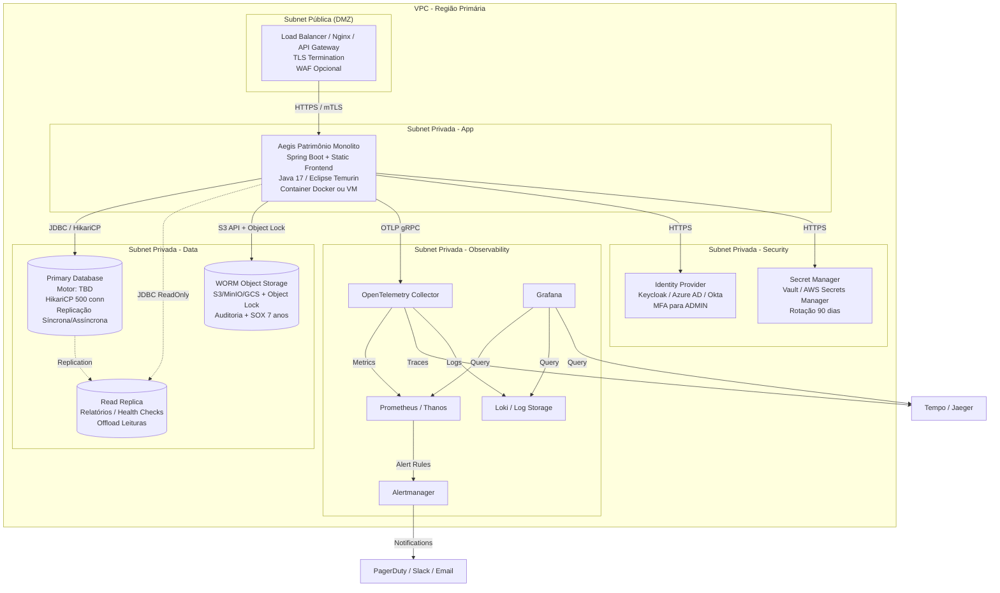

# System Architecture Document (SAD) — Aegis Patrimônio

> **Versão:** 1.0 · **Owner:** Arquitetura/Eng Lead · **Status:** Draft
> **ADRs relacionadas:** [Pendentes — a serem formalizadas na Sprint 0]

## 1. Overview & Goals

O **Aegis Patrimônio** é uma aplicação web server-side para gestão de ativos patrimoniais, manutenções, health checks e alertas de recursos, com requisitos de auditoria (LGPD/SOX), RBAC estrito e trilha de auditoria imutável. A arquitetura atual é um **monolito modular Java (Spring Boot implícito)** servindo API REST e assets estáticos do frontend JavaScript (Vanilla JS + @popperjs/core), com persistência em banco relacional via SQL cru (sem ORM).

**Objetivos arquiteturais principais** (derivados dos NFRs):
- Latência de API ≤ 500 ms (p95) sob 100 usuários concorrentes, escalando verticalmente para 400 usuários com degradação ≤ 10%.
- Disponibilidade 99,5% (SLA) / 99,9% (SLO) com RTO ≤ 4 h e RPO ≤ 24 h via backup diário + read-replica.
- Segurança: JWT stateless (expiração ≤ 1 h), TLS 1.2+, criptografia AES-256 em repouso, logs de auditoria WORM.
- Observabilidade: logs JSON estruturados, métricas Prometheus via Actuator, tracing OpenTelemetry.
- Manutenibilidade: complexidade ciclomática ≤ 10 (refatorar 5 métodos críticos), cobertura ≥ 80% novo código, zero `console.*`/stubs em produção.
- Custo: ≤ R$ 2,00/mês por ativo gerenciado (compute, DB, storage, backup, monitoramento, rede).

## 2. Tech Stack Justification

| Camada | Tecnologia Escolhida | Alternativas Consideradas | Justificativa Resumida |
| :--- | :--- | :--- | :--- |
| **Language/Runtime (Backend)** | Java 17+ (implícito por Spring Boot Actuator/Eclipse Temurin 17 JRE citado no NFR-PO02) | Kotlin, Node.js, Go | Base de código existente (333 arquivos .java); ecossistema Spring maduro para requisitos enterprise (Actuator, Security, Batch, JPA/Hibernate opcional). |
| **Framework Web (Backend)** | Spring Boot 3.x (implícito por referências a `/actuator/*`, `HikariCP`, `SpringDoc` nos NFRs) | Quarkus, Micronaut, Jakarta EE | Stack corporativa padrão; Actuator nativo para health/metrics; integração nativa com Spring Security (JWT), SpringDoc (OpenAPI), Spring Batch (jobs como `AlertNotificationService`). |
| **Language/Runtime (Frontend)** | JavaScript (ES2022+) — Vanilla JS (15 arquivos em `frontend/src/`) | TypeScript, React, Vue, Angular | Código legado já existente; baixo acoplamento; @popperjs/core já em uso para tooltips/dropdowns. Migração para TS/React é dívida técnica planejada (NFR-M01). |
| **UI Library / Components** | @popperjs/core ^2.11.8 (única dependência `package.json`) | Bootstrap, Material UI, Tailwind | Requisito leve de posicionamento (tooltips, dropdowns); evita bundle pesado; compatível com NFR-U03 (responsivo 320–1920px). |
| **Banco de Dados** | **Não definido** — motor relacional a confirmar (PostgreSQL, Oracle, SQL Server, MySQL?) | — | **Gap crítico**: NFR-S03, NFR-A03, NFR-PO02, NFR-CO01 dependem desta decisão. Ação: confirmar com DBA/Infra na Sprint 0. |
| **ORM / Data Access** | SQL cru / JPA nativo (sem ORM identificado; NFR-CO02 cita "raw SQL / JPA nativo") | Hibernate/JPA completo, jOOQ, MyBatis | Diagnóstico: "nenhum ORM/query builder encontrado — provavelmente SQL cru". NFR-CO02 exige otimização manual de queries e índices compostos alinhados a `ManutencaoSpecification.build`. |
| **Connection Pool** | HikariCP (padrão Spring Boot, citado em NFR-S03) | Tomcat JDBC, Vibur | Default Spring Boot; configurável para 500 conexões simultâneas (NFR-S03). |
| **Mensageria / Filas** | **Não identificado** — jobs agendados via Spring `@Scheduled` / `TaskScheduler` (NFR-O02 cita "serviço de agendamento de health checks") | RabbitMQ, Kafka, AWS SQS, Redis Streams | Monolito atual não demanda mensageria distribuída; jobs internos (`checkResourceUsageAlerts`, `updateHealthCheck`) rodam in-process. Futuro: avaliar se desacoplamento de alertas/notificações justifica broker. |
| **Cache** | **Não configurado** — inferido: Caffeine (local) ou Redis (se read-replica) | Ehcache, Hazelcast, Redis Cluster | NFR-S01 (vertical scaling) e NFR-A04 (read-replica para relatórios) sugerem cache local para consultas frequentes (`custoTotalPorAtivo`). [INFERIDO POR IA — REQUER VALIDAÇÃO HUMANA] |
| **Build / Packaging** | Maven ou Gradle (não detectado no diagnóstico; NFR-PO02 cita Docker com Eclipse Temurin 17 JRE) | — | Ausência de `pom.xml`/`build.gradle` no diagnóstico (apenas `package.json` do frontend). Ação: verificar repositório raiz. |
| **Containerização** | Docker (imagem base Eclipse Temurin 17 JRE — NFR-PO02) | Jib, Buildpacks, VM nativa | NFR-PO02 prevê deploy em container Docker ou VM Linux. |
| **Infraestrutura / Cloud** | **Não definido** — VM Linux (Ubuntu 22.04 LTS / RHEL 9) ou container Docker (NFR-PO02) | Kubernetes, AWS ECS/Fargate, Azure Container Apps, Google Cloud Run | NFR-S01: "Não há suporte a auto-scaling horizontal, clustering ou sharding na stack atual". Escalabilidade é vertical. Ação: definir com DevOps/Infra na Sprint 0. |
| **Observabilidade Stack** | **Não definido** — NFR-O01/O03/O04 citam Prometheus/Grafana, Alertmanager, OpenTelemetry Java Agent | Datadog, New Relic, Elastic Stack, Loki/Tempo | Ação: definir na Sprint 0. |
| **Secret Management** | **Não provisionado** — NFR-SEC04 cita HashiCorp Vault / AWS Secrets Manager | Azure Key Vault, GCP Secret Manager, Sealed Secrets | Requer provisionamento (NFR-SEC04: rotação a cada 90 dias). |
| **CI/CD** | **Não detectado** — NFR-M03/M04/M05 exigem pipeline com validações (OpenAPI breaking changes, console.*, stubs) | GitHub Actions, GitLab CI, Jenkins, Azure DevOps | Ação: implementar pipeline na Sprint 0. |

## 3. High-Level Architecture

A aplicação segue um **monolito modular** implantado como unidade única (JAR/WAR ou container Docker). O backend Spring Boot expõe endpoints REST consumidos pelo frontend servido como arquivos estáticos (ou via CDN/Nginx — NFR-PO03). Jobs de background (`AlertNotificationService.checkResourceUsageAlerts`, `updateHealthCheck`) executam no mesmo processo via `TaskScheduler`. Persistência em banco relacional único (primário) com **read-replica** para relatórios analíticos e health checks (NFR-A04). Logs de auditoria gravados em storage WORM separado (NFR-SEC05, NFR-C02).

### Componentes

| Componente | Responsabilidade | Tecnologia | Escala Independente? |
| :--- | :--- | :--- | :--- |
| **Web/API Module** | Endpoints REST (CRUD ativos, manutenções, health checks, alertas, autenticação, auditoria), serve frontend estático | Spring Boot 3.x (Spring MVC, Spring Security, SpringDoc) | Não (monolito) |
| **Domain Services** | Regras de negócio: `AtivoService`, `ManutencaoService`, `AlertNotificationService`, `HealthCheckService`, `AuditoriaService` | Java (Spring `@Service`) | Não |
| **Scheduler / Jobs** | Execução periódica: `checkResourceUsageAlerts` (≤30s p/ 12k ativos — NFR-P04), `updateHealthCheck` | Spring `TaskScheduler` / `@Scheduled` | Não |
| **Data Access Layer** | Repositories + Specifications (`ManutencaoSpecification.build`), SQL cru / JPA nativo, HikariCP pool (500 conn — NFR-S03) | Spring Data JPA (parcial) + `@Query` nativas / `JdbcTemplate` | Não |
| **Frontend (Static Assets)** | SPA Vanilla JS: login, dashboard, cadastro ativo, solicitação manutenção, alertas; usa @popperjs/core para overlays | JavaScript ES2022, @popperjs/core ^2.11.8, Vite/Webpack (build — NFR-PO03) | Não (servido pelo backend ou CDN) |
| **Primary Database** | Persistência transacional: Ativos, Manutenções, HealthChecks, Usuários, Auditoria, Configurações | **Motor a definir** (PostgreSQL/Oracle/SQL Server/MySQL) | Vertical (mais vCPU/RAM); read-replica para leitura |
| **Read Replica** | Consultas analíticas (`custoTotalPorAtivo`), health checks de leitura, offload de relatórios | Mesmo motor do primário (replicação nativa) | Sim (escala de leitura independente) |
| **WORM Audit Storage** | Logs de auditoria imutáveis (append-only) para operações de escrita (BR-02) | Object storage (S3/MinIO/GCS) com Object Lock / Glacier Vault Lock | Sim (escrita sequencial, leitura rara) |
| **Observability Stack** | Coleta logs JSON, métricas Prometheus, traces OpenTelemetry, alertas | **A definir** (Prometheus/Grafana/Alertmanager/Loki/Tempo — NFR-O01/O03/O04) | Sim (infra separada) |
| **Identity Provider (Futuro)** | Autenticação corporativa, MFA para ADMIN, integração AD/LDAP/OIDC | **A definir** (Keycloak, Azure AD, Okta, AD FS — NFR-SEC02, BRD#7) | Sim (serviço externo) |

## 4. Architectural Style & Patterns

* **Estilo:** **Monolito modular** (single deployable unit) com separação lógica em camadas (Controller → Service → Repository → Domain) e módulos funcionais (Ativos, Manutenções, Alertas, Auditoria, Segurança). Não há microsserviços, serverless ou event-driven architecture na stack atual.
* **Padrões aplicados:**
  - **Repository Pattern** + **Specification Pattern** (`ManutencaoSpecification.build` — complexidade 14) para queries dinâmicas.
  - **Mapper Pattern** (`AtivoMapper.toDTO` — complexidade 14) para conversão entidade↔DTO.
  - **Scheduler Pattern** (Spring `TaskScheduler`) para jobs periódicos (`checkResourceUsageAlerts`, `updateHealthCheck`).
  - **Stateless Authentication** (JWT — NFR-SEC02) com `SecurityFilterChain` Spring Security.
  - **Audit Logging** (append-only, WORM) via `AuditoriaService` interceptando operações de escrita (BR-02).
  - **Health Check Pattern** (`/actuator/health` — NFR-O02) com indicadores customizados (DB, disco, scheduler).
* **Comunicação entre componentes:**
  - **Síncrona (in-process):** Chamadas Java diretas entre Controllers, Services, Repositories.
  - **Síncrona (HTTP/REST):** Frontend → Backend (API REST); Backend → Identity Provider (futuro, OIDC/SAML).
  - **Assíncrona (in-process):** `@Async` / `TaskScheduler` para jobs longos (`checkResourceUsageAlerts`).
  - **Sem mensageria distribuída** no estado atual.

## 5. Data Modeling

* **Motor de banco:** **Não definido** — ver *O que falta verificar* (Gap #1). NFRs assumem relacional com suporte a replicação (read-replica), prepared statements, WAL/log shipping, e índices compostos.
* **Estratégia de particionamento/sharding:** **Não aplicável** no estado atual (monolito, instância única, vertical scaling — NFR-S01). Futuro: se volume de `HealthCheck`/`Manutencao` exceder capacidade vertical, avaliar particionamento por `ativo_id` + time-range (ex.: PostgreSQL `pg_partman`).
* **Migração de schema:** **Não configurada** — ver `[[db-migration-spec]]` (a criar). Recomendado: Flyway ou Liquibase integrados ao Spring Boot (baseline + versioned migrations).
* **Modelo conceitual:** Entidades principais — `Ativo`, `Manutencao`, `HealthCheck`, `Funcionario`, `Usuario`, `AuditoriaLog`, `Alerta`, `Configuracao`. Relacionamentos: Ativo 1:N Manutencao, Ativo 1:N HealthCheck, Usuario N:M Role (RBAC). Detalhes em `[[db-domain-model]]`.
* **Contrato físico (tabelas, colunas, constraints, DDL):** Em `[[db-schema-spec]]` (a criar). Índices compostos críticos alinhados a `ManutencaoSpecification.build` filtros (NFR-CO02).

## 6. Integration Boundaries & APIs

| Integração | Tipo | Direção | Contrato | Criticidade |
| :--- | :--- | :--- | :--- | :--- |
| **Frontend ↔ Backend API** | REST/JSON | Inbound (Browser → App) | OpenAPI 3.0 (SpringDoc — NFR-M03) | **Alta** (única interface de usuário) |
| **Identity Provider (OIDC/SAML/AD)** | OIDC / SAML 2.0 / LDAP | Outbound (App → IdP) | Metadata IdP / Discovery endpoint | **Alta** (NFR-SEC02: MFA obrigatório ADMIN; BRD#7 dependência externa) |
| **Email / Notification Service** | SMTP / REST / Webhook | Outbound (App → SMTP/Provider) | Template-based (alertas, aprovações) | **Média** (BRD#5 In-Scope: Alertas) |
| **WORM Audit Storage** | S3 API / S3-compatible | Outbound (App → Object Storage) | PutObject com Object Lock / Legal Hold | **Alta** (NFR-SEC05, NFR-C02: SOX 7 anos) |
| **Observability Stack** | OTLP (gRPC/HTTP), Prometheus scrape | Outbound (App → Collector/Prometheus) | OpenTelemetry semantic conventions | **Alta** (NFR-O01/O03/O04) |
| **Backup / Restore Tool** | Native DB tools / pgBackRest / RMAN / etc. | Outbound (Infra → DB) | Runbook documentado (NFR-A02: RTO ≤ 4h) | **Alta** (Disaster Recovery) |
| **CI/CD Pipeline** | Webhook / API | Bidirecional (Pipeline ↔ Repo/Registry) | Pipeline definition (YAML) | **Média** (NFR-M03/M04/M05 validações) |

## 7. Scalability & Performance Strategy

* **Estratégia de escala:** **Vertical scaling only** (mais vCPU/RAM na instância única). NFR-S01: 400 usuários concorrentes com degradação ≤ 10% vs 100 usuários. **Não há** auto-scaling horizontal, clustering, sharding, Kubernetes ou orquestrador (NFR-S01 observação).
* **Pontos de gargalo conhecidos (baseados no diagnóstico e NFRs):**
  1. `AlertNotificationService.checkResourceUsageAlerts` (complexidade 17) — processar 12.000 ativos em ≤ 30s (NFR-P04). Risco: query N+1, loop sequencial, falta de batch/paralelismo.
  2. `ManutencaoSpecification.build` (complexidade 14) — filtros dinâmicos podem gerar queries ineficientes; requer índices compostos (NFR-CO02).
  3. `AtivoMapper.toDTO` (complexidade 14) — mapeamento rico pode impactar serialização de listas grandes.
  4. `RealisticDataSeeder.run` (complexidade 15) — apenas impacto em ambiente de dev/test.
  5. `api.js:request` (complexidade 13) — lógica de retry/interceptor no frontend; mover para camada dedicada.
  6. **Connection pool saturation** — HikariCP 500 conexões (NFR-S03) pode exaurir sob 400 usuários + jobs + relatórios.
  7. **Single writer database** — todas as escritas no primário; read-replica alivia apenas leituras analíticas.
* **Estratégia de cache:** [INFERIDO POR IA — REQUER VALIDAÇÃO HUMANA]
  - **L1 (Local/JVM):** Caffeine cache para `custoTotalPorAtivo` (TTL 5–15 min), configurações, lookup de roles/permissões. Invalidação por evento de escrita (`@CacheEvict` em services de escrita).
  - **L2 (Distribuído — se read-replica):** Redis (se provisionado) para sessões JWT revogadas, rate limiting, cache de relatórios pesados. Não provisionado atualmente.
  - **HTTP/Edge:** `Cache-Control` headers em assets estáticos (frontend); `ETag`/`Last-Modified` em endpoints GET idempotentes.
  - **Database:** Query result cache nativo (se suportado pelo motor) para relatórios recorrentes.

## 8. Reliability & Fault Tolerance

* **Single points of failure identificados:**
  1. **Instância única da aplicação** — falha de hardware/VM/container derruba todo o sistema (NFR-A04: risco "Single point of failure").
  2. **Banco de dados primário único** — falha de disco/rede/instance indisponibiliza escritas e leituras transacionais. Mitigação: read-replica (promovível) + backup diário + runbook restore < 4h (NFR-A02).
  3. **Scheduler in-process** — se a app reinicia, jobs (`checkResourceUsageAlerts`, `updateHealthCheck`) perdem execuções agendadas. Mitigação: agendador externo (cron/systemd/K8s CronJob) ou persistência de triggers (Quartz JDBC JobStore) — NFR-O02 cita "serviço de agendamento de health checks".
  4. **WORM storage único** — se indisponível, auditoria para de gravar (violando NFR-SEC05). Mitigação: replicação cross-region do bucket.
* **Estratégias de resiliência:**
  - **Retry com backoff exponencial + jitter** em chamadas HTTP outbound (IdP, Email, WORM Storage, Observability) — `Resilience4j` ou `Spring Retry`.
  - **Circuit Breaker** (Resilience4j) para chamadas a IdP e serviços de notificação (evita cascade failure).
  - **Bulkhead** — isolar thread pools: `web` (requests HTTP), `scheduler` (jobs), `audit` (escrita WORM assíncrona).
  - **Timeouts** configurados: HTTP client (connect 2s, read 10s), JDBC (query 30s, transaction 60s), job `checkResourceUsageAlerts` (hard limit 30s — NFR-P04).
  - **Graceful shutdown** — Spring `GracefulShutdown` (timeout 30s) para drenar requests e finalizar jobs.
* **Estratégia multi-região/multi-AZ:** **Não implementada** (monolito single-instance). NFR-A04 exige read-replica (pode estar em AZ diferente) e WORM storage replicado. Plano futuro: active-passive com DNS failover (RTO ≤ 4h).

## 9. Security Architecture

* **Boundary de rede:** [INFERIDO POR IA — REQUER VALIDAÇÃO HUMANA]
  - **Premissa:** Deploy em VPC com subnets privadas (app, DB, WORM storage) e subnet pública (Load Balancer / Nginx / API Gateway).
  - **App** só acessa DB (porta 5432/1521/1433/3306), WORM storage (HTTPS 443), IdP (HTTPS 443), Observability (HTTPS 443).
  - **DB** sem acesso à internet; apenas app e ferramentas de admin (bastion/SSM).
  - **WORM storage** com bucket policy deny `DeleteObject` sem `LegalHold` bypass; versioning + Object Lock habilitado.
* **Controles de segurança implementados/previstos:**
  - **Autenticação:** JWT stateless (HS256/RS256) — NFR-SEC02. Expiração access token ≤ 1h; refresh token rotation; `jti` para revogação (blocklist em cache/Redis).
  - **Autorização:** RBAC estrito (BR-01) — roles `ADMIN`, `AUDITOR`, `GESTOR`, `OPERADOR`; `@PreAuthorize` em controllers/services; testes de acesso quebrado (NFR-SEC03).
  - **Criptografia:** TLS 1.2+ (preferencial 1.3) em todas as conexões (NFR-SEC01). AES-256 em repouso no volume do DB (managed disk encryption / TDE). Chaves de criptografia/JWT rotacionadas a cada 90 dias via cofre (NFR-SEC04).
  - **Proteção contra injeção:** Prepared statements / JPA Criteria / `@Query` com parâmetros bind (NFR-SEC03). **Stack usa SQL cru** — revisão de código obrigatória para concatenação de strings.
  - **Validação de entrada:** Bean Validation (`@Valid`, constraints custom) + sanitização no frontend.
  - **Auditoria imutável:** `AuditoriaService` grava em WORM storage (NFR-SEC05) para todas operações BR-02 (`criar`, `atualizar`, `deletar`, `aprovar`, `cancelar`, `concluir`, `iniciar`) com payload completo.
  - **LGPD:** Endpoint administrativo "direito ao esquecimento" — exclusão lógica + anonimização em `Funcionario`, `Usuario`, `AuditoriaLog` (NFR-C01). Tag `LGPD_SENSITIVE` em ativos (NFR-C03).
  - **Headers de segurança:** `Content-Security-Policy`, `X-Frame-Options: DENY`, `X-Content-Type-Options: nosniff`, `Referrer-Policy: strict-origin-when-cross-origin`, `Permissions-Policy`.
* **Referência:** Ver `security-policies.md` (a criar) para políticas detalhadas, matriz de roles/permissões, fluxo de rotação de segredos, plano de resposta a incidentes.

## 10. Observability Architecture

* **Logging centralizado:** [INFERIDO POR IA — REQUER VALIDAÇÃO HUMANA]
  - **Formato:** JSON estruturado (NFR-O01) — campos: `timestamp` (ISO-8601 UTC), `level`, `traceId`, `spanId`, `service` (`aegis-patrimonio`), `message`, `context` (mapa chave-valor).
  - **Destino:** stdout (container) → coletor (Fluent Bit / Vector / Promtail) → Loki / Elasticsearch / CloudWatch Logs.
  - **Correlação:** `traceId`/`spanId` propagados via `MDC` (Logback) e cabeçalho `traceparent` (W3C TraceContext).
  - **Auditoria logs:** duplicados para WORM storage (NFR-SEC05) via appender dedicado assíncrono.
* **Métricas:**
  - **Exposição:** `/actuator/prometheus` (NFR-O01) — JVM (memória, GC, threads), HTTP (latência, taxa, erros por endpoint), HikariCP (pool usage, wait time), Scheduler (job duration, success/failure), Cache (hit/miss/eviction).
  - **Coleta:** Prometheus (scrape interval 15s) → armazenamento TSDB (Thanos/Cortex/Mimir para retenção longa) ou Grafana Cloud.
  - **Dashboards:** Grafana — Golden Signals (Latency, Traffic, Errors, Saturation) por endpoint; business metrics (ativos ativos, manutenções abertas, alertas disparados).
* **Tracing distribuído:**
  - **Instrumentação:** OpenTelemetry Java Agent (auto-instrumentação Spring MVC, JDBC, HTTP Client, Quartz) — NFR-O03.
  - **Propagação:** `traceparent` em 100% requisições HTTP inbound + chamadas JDBC + chamadas HTTP outbound.
  - **Exportador:** OTLP/gRPC para Collector → Tempo / Jaeger / Zipkin / Grafana Cloud Traces.
  - **Amostragem:** Tail-based (sempre exportar erros + latência > p95) + head-based 10% para requests normais.
* **Alertas (NFR-O04):**
  - Latência p95 API > 500ms por 5 min (NFR-P01)
  - Taxa erro 5xx > 0,1% por 2 min
  - CPU > 80% por 10 min
  - Heap > 85% por 5 min
  - Falha job `checkResourceUsageAlerts` (status ≠ SUCCESS)
  - HikariCP pool usage > 90% por 5 min
  - Disco > 85% (app + DB + WORM)
  - Replicação DB lag > 60s
  - Certificado TLS expira < 30 dias
  - **Canais:** PagerDuty / Opsgenie / Slack / Email (on-call rotation).

## 11. Deployment Topology

**Notas de deploy:**
- **Artefato:** Docker image `aegis-patrimonio:{{version}}` (base `eclipse-temurin:17-jre-alpine` ou `ubuntu:22.04` + JRE) — NFR-PO02.
- **Configuração:** `application-{prod,staging,dev}.yml` + variáveis de ambiente / secrets (Spring Cloud Config / Vault / Kubernetes Secrets).
- **Health checks:** `livenessProbe` → `/actuator/health/liveness`; `readinessProbe` → `/actuator/health/readiness` (inclui DB, scheduler, disco) — NFR-O02.
- **Backup:** Snapshot diário do DB (NFR-A03: RPO ≤ 24h) + WAL/log shipping contínuo se suportado. Runbook de restore testado trimestralmente (NFR-A02: RTO ≤ 4h).
- **Frontend build:** Vite/Webpack (NFR-PO03) gera assets em `src/main/resources/static` (Spring Boot) ou publicados em CDN (Nginx/CloudFront) com `Cache-Control: public, max-age=31536000, immutable` para assets com hash.

## 12. Trade-offs & Known Limitations

| Decisão / Trade-off | Sacrifício | Benefício | ADR / Referência |
| :--- | :--- | :--- | :--- |
| **Monolito único (sem microsserviços)** | Escalabilidade horizontal, deploy independente, isolamento de falhas | Simplicidade operacional, transações ACID locais, latência baixa in-process, custo infra menor (NFR-CO01) | ADR-001 (a criar) |
| **SQL cru / JPA nativo sem ORM completo** | Produtividade dev (boilerplate), refatoração schema mais difícil | Controle total de queries, performance previsível, índices compostos otimizados (NFR-CO02), zero overhead ORM | ADR-002 (a criar) |
| **Vertical scaling only** | Limite teto de capacidade (hardware single-node), SPOF app | Custo previsível, sem complexidade de clustering/sharding, consistência forte trivial | NFR-S01 observação |
| **Scheduler in-process (Spring TaskScheduler)** | Jobs param se app reinicia; não distribuído | Zero dependência externa, simples, atende carga atual (1 job crítico) | NFR-O02 gap |
| **Frontend Vanilla JS + Popper.js** | DX limitada, sem type safety, manutenção difícil à medida que cresce | Bundle mínimo (~50KB gz), zero build step obrigatório, compatível com NFR-U03 | Dívida técnica (NFR-M01) |
| **WORM storage para auditoria** | Custo storage maior, latência escrita ligeiramente maior | Imutabilidade legal (SOX/LGPD), integridade verificável (SHA-256), compliance | NFR-SEC05, NFR-C02 |
| **Read-replica apenas para relatórios** | Escrita ainda single-master; réplica pode ter lag | Offload de queries pesadas (`custoTotalPorAtivo`) do primário; HA parcial | NFR-A04 |
| **Sem mensageria distribuída** | Acoplamento temporal jobs↔API; retry limitado | Simplicidade, zero infra extra | Reavaliar se `checkResourceUsageAlerts` > 30s ou volume alertas ↑ |

## 13. Future Evolution

* **Curto prazo (Sprint 0–3):**
  1. Definir motor de banco (Gap #1) e provisionar primário + read-replica + WORM bucket.
  2. Implementar pipeline CI/CD com validações NFR-M03/M04/M05 (OpenAPI breaking changes, `console.*`, stubs).
  3. Refatorar 5 métodos com complexidade > 10 (NFR-M02) — prioridade: `checkResourceUsageAlerts` (17), `RealisticDataSeeder.run` (15), `AtivoMapper.toDTO` (14), `ManutencaoSpecification.build` (14), `api.js:request` (13).
  4. Configurar OpenTelemetry Java Agent + Collector + Prometheus/Grafana/Loki/Tempo (Gap #4).
  5. Provisionar Secret Manager + rotação 90 dias (NFR-SEC04, Gap #4).
  6. Implementar `AuditoriaService` com escrita assíncrona WORM (NFR-SEC05).
  7. Configurar Flyway/Liquibase + baseline schema (Gap #5 — matriz retenção).
* **Médio prazo (Q3–Q4 2025):**
  1. Migrar frontend para TypeScript + React/Vue (NFR-M01, NFR-U01/02) — componentizar, testar com Vitest/Testing Library.
  2. Integrar Identity Provider corporativo + MFA ADMIN (NFR-SEC02, Gap #3).
  3. Implementar cache L1 (Caffeine) para `custoTotalPorAtivo` e lookups RBAC; avaliar Redis L2 se read-replica insuficiente.
  4. Externalizar scheduler (Quartz JDBC JobStore ou agendador externo) para tolerância a falhas app (NFR-O02).
  5. Hardening segurança: CSP estrito, HSTS, certificate pinning, pen test.
  6. Testes de carga k6/Gatling validando NFR-P01/P04, NFR-S01/S02.
* **Longo prazo (2026+):**
  1. **Strangler Fig** para extrair `AlertNotificationService` e `HealthCheckService` como microsserviços event-driven (Kafka/RabbitMQ) se volume justificar.
  2. Multi-AZ active-passive com DNS failover automatizado (RTO < 30 min).
  3. Sharding/particionamento `HealthCheck`/`Manutencao` por `ativo_id` + tempo se vertical scaling esgotado.
  4. Data Lake / OLAP (ClickHouse/BigQuery) para analytics históricos além SOX 7 anos.
  5. Mobile app nativo (fora de escopo atual — BRD#5 Out-of-Scope) via API existente.

---

## O que falta verificar (Gaps de Informação — Replicado do NFR para Rastreabilidade)

1. **Motor de banco de dados:** Não identificado no `package.json` nem em arquivos de configuração (application.yml/properties não escaneados). NFRs de escalabilidade (NFR-S03), disponibilidade (NFR-A03), portabilidade (NFR-PO02) e custo (NFR-CO01) dependem desta definição (PostgreSQL, Oracle, SQL Server, MySQL?). **Ação:** Confirmar com DBA/Infra na Sprint 0.
2. **Estratégia de deploy e infraestrutura alvo:** VM única? Container Docker? Kubernetes? Cloud provider? Isso impacta NFR-A01, NFR-A04, NFR-PO02, NFR-CO01. **Ação:** Definir com DevOps/Infra.
3. **Provedor de identidade / MFA:** Integração com AD/LDAP/OIDC prevista (BRD#7 Dependências externas) mas não implementada. NFR-SEC02 depende desta decisão. **Ação:** Alinhar com Segurança da Informação.
4. **Ferramentas de observabilidade stack:** Prometheus/Grafana? Datadog? New Relic? ELK? NFR-O01, NFR-O03, NFR-O04 exigem escolha. **Ação:** Definir na Sprint 0.
5. **Política de retenção de dados específica por entidade:** BRD menciona 7 anos para SOX, mas LGPD pode exigir prazos diferentes por tipo de dado. NFR-C01, NFR-C02 precisam de matriz de retenção aprovada por Compliance. **Ação:** Workshop com Compliance/Legal.
6. **Orçamento de infraestrutura validado:** Estimativa BRD#9 (R$ 180k/ano) precisa cotação real para validar NFR-CO01. **Ação:** FinOps/Infra prover cotação.
7. **Arquivos de build/backend config:** `pom.xml`/`build.gradle`, `application.yml`, `Dockerfile` não detectados no diagnóstico. **Ação:** Verificar repositório raiz / branches.
8. **Contrato OpenAPI atual:** Não gerado (SpringDoc não configurado). **Ação:** Habilitar `springdoc-openapi-starter-webmvc-ui` e publicar spec.