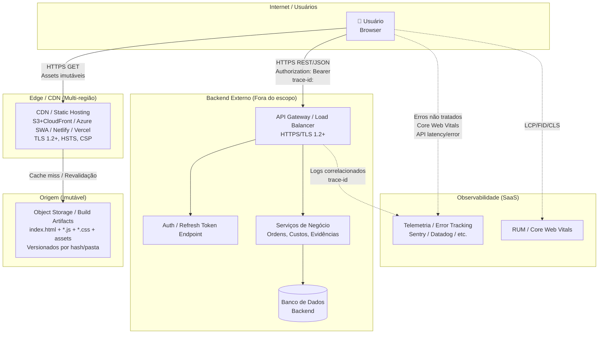

# System Architecture Document (SAD) — Aegis1

> **Versão:** 1.0 · **Owner:** Arquitetura/Eng Lead · **Status:** Draft
> **ADRs relacionadas:** Nenhuma formalizada até o momento

## 1. Overview & Goals

O **Aegis1** é uma aplicação frontend *single-page* (SPA) servida como ativos estáticos (HTML/JS/CSS) via CDN, responsável pela interface de gestão de ordens de manutenção (criar, listar, iniciar, aprovar, concluir, cancelar, consultar custo total por ativo). Não há backend, banco de dados, mensageria ou runtime Rust neste repositório — toda a lógica de negócio e persistência reside em um **backend externo** (fora do escopo deste codebase) exposto via API REST/HTTPS.

**Objetivos arquiteturais principais** (derivados do NFR):
- **Performance:** TTI ≤ 3,5 s (4G mobile) / ≤ 2 s (desktop broadband); bundle gzipped ≤ 150 kB; latência P95 da chamada `request` ≤ 800 ms. <!-- source: NFR#NFR-P01, NFR-P02, NFR-P03 -->
- **Escalabilidade:** CDN deve absorver ≥ 500 usuários concorrentes ativos sem degradação > 10% na latência de assets. <!-- source: NFR#NFR-S01 -->
- **Disponibilidade:** Frontend (CDN+DNS) ≥ 99,9% mensal (SLO interno); RTO ≤ 15 min via rollback de versão anterior no CDN. <!-- source: NFR#NFR-A01, NFR-A02 -->
- **Segurança:** Comunicação exclusivamente HTTPS/TLS 1.2+; JWT em `localStorage` apenas transitório (migração para cookie `HttpOnly; Secure; SameSite=Strict` planejada); zero `console.*` em produção; CSP restritivo. <!-- source: NFR#NFR-SEC01, NFR-SEC02, NFR-SEC04 -->
- **Observabilidade:** Logs estruturados (JSON) apenas para erros não tratados enviados a telemetria (ex.: Sentry); Core Web Vitals via RUM; tracing `trace-id` propagado ao backend. <!-- source: NFR#NFR-O01, NFR-O02, NFR-O03 -->
- **Manutenibilidade:** Complexidade ciclomática ≤ 10 (refatorar `request` atual 13); cobertura ≥ 80% em `api.js` e fluxos de ordem; ESLint/Prettier no CI com `no-console: error`. <!-- source: NFR#NFR-M01, NFR-M02, NFR-M03 -->
- **Custo:** Hospedagem estática ≤ USD 30/mês para volume estimado (500 usuários, 10k pageviews/dia). <!-- source: NFR#NFR-CO01 -->

## 2. Tech Stack Justification

| Camada | Tecnologia Escolhida | Alternativas Consideradas | Justificativa Resumida |
| :--- | :--- | :--- | :--- |
| Language/Runtime | **Vanilla JavaScript (ES2020+)** | TypeScript, React, Vue, Svelte | Zero dependências de build/runtime; bundle mínimo; alinhado ao NFR-CO02 (zero custo de licença) e NFR-P03 (≤ 150 kB gzipped). O diagnóstico confirma 15 arquivos JS, 627 LOC, sem `package.json` scripts de build. |
| UI/Componentes | **Vanilla JS + @popperjs/core** (positioning) | Popper.js v1, Floating UI, Tippy.js | Única dependência de produção (`@popperjs/core@^2.11.8`, MIT); atende tooltips/dropdowns sem framework pesado. |
| Build/Bundler | **Nenhum (arquivos servidos diretamente)** | Vite, esbuild, Webpack, Rollup | Evita etapa de build; simplicidade operacional; compatível com NFR-PO02 (deploy em qualquer CDN/Object Storage). Requer validação: code-splitting por rota (NFR-P03) precisará de solução nativa (dynamic `import()` + `<script type=module>`). `[INFERIDO POR IA — REQUER VALIDAÇÃO HUMANA]` |
| Hospedagem/CDN | **Cloud-agnostic static hosting** (S3+CloudFront, Azure Static Web Apps, Netlify, Vercel, etc.) | Servidor próprio, Kubernetes | NFR-PO02 exige build independente de provedor; ativos imutáveis versionados (NFR-A03). |
| Backend (externo) | **API REST/HTTPS** (fora deste repositório) | GraphQL, gRPC, tRPC | Contrato definido pelo backend; frontend consome via `fetch` encapsulado em `api.js:request`. |
| Autenticação | **JWT em `localStorage` (transitório)** | Cookie HttpOnly, Session Storage, IndexedDB | Implementação atual em `api.js:authInterceptor`; NFR-SEC02 prevê migração para cookie `HttpOnly; Secure; SameSite=Strict` antes do go-live. |
| Testes | **Não configurado** (planejado: Jest + React Testing Library ou equivalente vanilla) | Vitest, Playwright, Cypress | NFR-M02 exige ≥ 80% cobertura em `api.js` e componentes de fluxo de ordem. `[INFERIDO POR IA — REQUER VALIDAÇÃO HUMANA]` |
| Lint/Format | **Não configurado** (planejado: ESLint + Prettier) | Biome, Rome | NFR-M03 exige `no-console: error` para builds de produção. |

## 3. High-Level Architecture

A arquitetura segue o padrão **Static SPA + Backend-for-Frontend (BFF) externo**:

1. **CDN/Static Hosting** serve `index.html`, `*.js`, `*.css`, assets imutáveis (hash no nome ou versionamento por pasta).
2. **Browser** carrega a SPA, inicializa roteamento client-side (hash-based ou History API), monta UI.
3. **Camada de API (`frontend/src/services/api.js`)** encapsula `fetch` com:
   - `authInterceptor`: injeta `Authorization: Bearer <token>`; implementa refresh automático (máx. 1 retry) e logout em falha. <!-- source: NFR#NFR-SEC03, Diagnóstico: api.js -->
   - `handleApiError`: normaliza erros (401, 409, 5xx), exibe mensagem amigável, permite retry manual. <!-- source: NFR#NFR-A04, Diagnóstico: api.js:26,49,52 -->
   - `request`: função central (complexidade 13 — **violando NFR-M01**), com timeout, retry, parsing JSON, auth. <!-- source: Diagnóstico: api.js:36 -->
4. **Backend externo** processa mutações (iniciar, aprovar, concluir, cancelar ordens) e consultas (listar, custoTotalPorAtivo). Escalabilidade horizontal do backend é pré-requisito (NFR-S02). `[INFERIDO POR IA — REQUER VALIDAÇÃO HUMANA]`

### Componentes

| Componente | Responsabilidade | Tecnologia | Escala Independente? |
| :--- | :--- | :--- | :--- |
| **CDN / Static Hosting** | Entrega de ativos estáticos (HTML/JS/CSS/imagens) com cache imutável, compressão gzip/brotli, TLS 1.2+, HSTS | Qualquer provedor (S3+CloudFront, Azure SWA, Netlify, Vercel) | **Sim** — escala horizontal nativa do CDN |
| **SPA (Browser)** | Roteamento, estado de UI (token em `localStorage`/`sessionStorage`), chamadas `api.js:request`, renderização de fluxos de ordem | Vanilla JS + @popperjs/core | **Não** — executa no cliente; escala = número de abas/navegadores |
| **api.js (Camada de Integração)** | `request` (fetch + timeout + retry + auth + parsing), `authInterceptor` (refresh token), `handleApiError` (normalização) | Vanilla JS (ES Modules) | **Não** — código rodando no browser |
| **Backend API (Externo)** | Persistência, regras de negócio, autenticação/autorização, cálculo `custoTotalPorAtivo`, evidências (checklist/foto) | Fora do escopo (responsabilidade de outro time) | **Sim** — deve escalar horizontalmente para 50 req/s picos (NFR-S02) `[INFERIDO POR IA — REQUER VALIDAÇÃO HUMANA]` |

> **Diagrama de containers (C4)** mantido em `[[uml-diagrams]]` — não duplicado aqui.

## 4. Architectural Style & Patterns

* **Estilo:** **Static SPA (Single-Page Application) + API-driven** — todo HTML/JS/CSS servido estaticamente; zero server-side rendering; zero edge compute no frontend.
* **Padrões aplicados:**
  - **Module Pattern / ES Modules** — isolamento de responsabilidades (`api.js`, componentes de UI, utilitários).
  - **Interceptor Pattern** — `authInterceptor` centraliza lógica de token/refresh.
  - **Error Boundary Pattern (manual)** — `handleApiError` normaliza falhas e evita travamento da UI (NFR-A04).
  - **Retry com Backoff Exponencial** — implementado dentro de `request` (precisa ser extraído para função dedicada per NFR-M01).
  - **Code-Splitting por Rota** — obrigatório por NFR-P03 (dynamic `import()` + `<script type=module>`); ainda não implementado. `[INFERIDO POR IA — REQUER VALIDAÇÃO HUMANA]`
* **Comunicação entre componentes:**
  - **SPA ↔ Backend:** Síncrona, REST/HTTPS, JSON, `fetch` com `AbortController` para timeout.
  - **SPA ↔ CDN:** HTTPS estático (GET assets imutáveis).
  - **Nenhuma comunicação assíncrona/fila no frontend** — eventos de UI são locais.

## 5. Data Modeling

**Não há banco de dados, ORM, query builder ou modelo de dados persistente neste repositório.** O diagnóstico confirma: *"nenhum motor de banco conhecido encontrado nas dependências"*, *"nenhum ORM/query builder encontrado — provavelmente SQL cru"* (referindo-se ao backend externo).

* **Estado no frontend:** Apenas token JWT (`localStorage`/`sessionStorage`) e estado transitório de UI (formulários, listas em memória). NFR-S03 proíbe estado de sessão além do token.
* **Dados de negócio:** Propriedade do backend; frontend apenas exibe e coleta evidências (checklist/foto) no fluxo **aprovar** (NFR-C03).
* **Contrato de API:** Deve ser versionado (OpenAPI 3.0) e validado no CI via testes de contrato (Pact ou similar) — NFR-M04. `[INFERIDO POR IA — REQUER VALIDAÇÃO HUMANA]`
* **Estratégia de migração de schema:** Não se aplica ao frontend; ver `[[db-migration-spec]]` (backend).
* **Modelo conceitual de entidades:** Ver `[[db-domain-model]]` (backend).
* **Contrato físico (tabelas, colunas, constraints, DDL):** Ver `[[db-schema-spec]]` (backend).

## 6. Integration Boundaries & APIs

| Integração | Tipo | Direção | Contrato | Criticidade |
| :--- | :--- | :--- | :--- | :--- |
| **Backend API (Ordens, Auth, Custos, Evidências)** | REST/HTTPS + JSON | Outbound (SPA → Backend) | OpenAPI 3.0 (a ser versionado e validado no CI via Pact) — NFR-M04 | **Alta** — todas as mutações e consultas críticas passam aqui |
| **CDN / Static Hosting** | HTTPS (GET estáticos) | Inbound (Browser → CDN) | Ativos imutáveis versionados (hash ou pasta versionada) | **Alta** — disponibilidade do frontend (NFR-A01, NFR-A02) |
| **Telemetria / Error Tracking (ex.: Sentry)** | HTTPS (POST JSON) | Outbound (Browser → SaaS) | Payload estruturado (NFR-O01) | **Média** — observabilidade de erros não tratados |
| **RUM / Core Web Vitals (ex.: Datadog RUM, Sentry Browser)** | HTTPS (beacon) | Outbound (Browser → SaaS) | Métricas LCP, FID, CLS (NFR-O02) | **Média** — alerta se LCP P75 > 2,5 s |
| **Identity Provider (Login/Refresh Token)** | REST/HTTPS | Outbound (SPA → IdP/Backend Auth) | OAuth2/OIDC ou custom (definido pelo backend) | **Alta** — `authInterceptor` depende de endpoint de refresh (NFR-SEC03) |

## 7. Scalability & Performance Strategy

* **Estratégia de escala:**
  - **Frontend:** Escala nativa do CDN (edge caches globais). Ativos imutáveis + `Cache-Control: immutable, max-age=31536000` para JS/CSS com hash; `index.html` com `max-age=0, must-revalidate`. Suporta ≥ 500 usuários concorrentes (NFR-S01) sem configuração adicional.
  - **Backend:** Fora do escopo; requisito NFR-S02 exige escala horizontal para 50 req/s picos nas mutações. `[INFERIDO POR IA — REQUER VALIDAÇÃO HUMANA]`
* **Pontos de gargalo conhecidos (frontend):**
  1. **`api.js:request`** — complexidade ciclomática 13 (NFR-M01); mistura timeout, retry, auth, parsing. Deve ser decomposta em: `withTimeout`, `withRetry`, `withAuth`, `parseResponse`.
  2. **Bundle único (sem code-splitting)** — 15 arquivos, 627 LOC servidos como módulos únicos; viola NFR-P03 (≤ 150 kB gzipped inicial). Requer dynamic `import()` por rota.
  3. **`console.*` residuais** — 3 chamadas em `api.js` (linhas 26, 49, 52) vazam em produção; pipeline deve falhar (NFR-M03, NFR-SEC04). <!-- source: Diagnóstico: console.* residuais -->
  4. **Refresh token simultâneo** — `authInterceptor` pode criar "thundering herd" se múltiplas abas dispararem 401 juntos; NFR-S03 exige mitigação (ex.: lock + broadcast channel). `[INFERIDO POR IA — REQUER VALIDAÇÃO HUMANA]`
* **Estratégia de cache:**
  - **CDN/Edge:** Assets imutáveis (hash no filename) → cache longo; `index.html` → revalidação.
  - **Browser (HTTP Cache):** `ETag`/`Last-Modified` para `index.html`; `Cache-Control: immutable` para chunks com hash.
  - **Application-level:** Nenhum cache de dados de negócio no frontend (NFR-S03); apenas token JWT.
  - **Invalidation:** Novo deploy = novos hashes nos arquivos + novo `index.html`; CDN invalida automaticamente via nome do arquivo.

## 8. Reliability & Fault Tolerance

* **Single points of failure identificados:**
  1. **CDN/Static Hosting provider** — mitigado por NFR-PO02 (multi-cloud deployável) e RTO ≤ 15 min via rollback de versão anterior (NFR-A02).
  2. **Backend API** — fora do controle do frontend; NFR-A04 exige que falha não trave UI (`handleApiError` + retry manual).
  3. **Auth/Refresh endpoint** — falha cascata se refresh falhar em massa; NFR-SEC03 limita a 1 retry e logout limpo.
* **Estratégias de resiliência (frontend):**
  - **Timeout** em `request` (configurável, padrão sugerido 10 s) via `AbortController`.
  - **Retry com backoff exponencial** (máx. 2 tentativas) para erros 5xx/timeout — já parcialmente em `request`, precisa extrair para função dedicada.
  - **Circuit Breaker** — não implementado no frontend; NFR não exige, mas recomendado para chamadas de mutação em série. `[INFERIDO POR IA — REQUER VALIDAÇÃO HUMANA]`
  - **Bulkhead** — não aplicável (single-threaded browser).
  - **Graceful Degradation** — `handleApiError` exibe toast/alert amigável, mantém UI navegável, botão "Tentar novamente".
* **Estratégia multi-região/multi-AZ:** Herdada do provedor de CDN/Static Hosting (CloudFront, Azure Front Door, Cloudflare, etc.). Frontend é stateless; qualquer edge serve.

## 9. Security Architecture

* **Boundary de rede:**
  - **Público:** CDN (edge) → Browser (HTTPS/TLS 1.2+, HSTS) — NFR-SEC01.
  - **Privado (backend):** Backend API em VPC/subnets privadas; frontend só conhece hostname público da API (ex.: `api.aegis1.example.com`).
  - **Nenhum acesso direto a banco, mensageria, infra do backend.**
* **Controles no frontend:**
  - **CSP Restritivo** — `default-src 'self'; script-src 'self' 'wasm-unsafe-eval'; style-src 'self' 'unsafe-inline'; img-src 'self' data:; connect-src 'self' https://api.aegis1.example.com https://telemetry.example.com; frame-ancestors 'none'; base-uri 'self'; form-action 'self'` (ajustar `connect-src` para telemetria real). NFR-SEC05. `[INFERIDO POR IA — REQUER VALIDAÇÃO HUMANA]`
  - **Sanitização de entradas** — formulários de cadastro (departamento, filial, fornecedor, funcionário) devem escapar/validar antes de enviar; prevenção XSS via `textContent` vs `innerHTML`, DOMPurify se HTML rico for necessário. NFR-SEC05. `[INFERIDO POR IA — REQUER VALIDAÇÃO HUMANA]`
  - **CSRF** — mitigado por `SameSite=Strict` no cookie futuro (NFR-SEC02) e `Authorization: Bearer` header (não enviado automaticamente pelo browser).
  - **JWT Storage** — atualmente `localStorage` (risco XSS); migração planejada para cookie `HttpOnly; Secure; SameSite=Strict` (NFR-SEC02).
  - **Zero `console.*` em produção** — pipeline com `no-console: error` (NFR-M03, NFR-SEC04). <!-- source: Diagnóstico: 3 chamadas console.* residuais -->
  - **Trace-ID propagation** — header `trace-id` (UUID v4) gerado no frontend e enviado em toda `request`; backend ecoa nos logs (NFR-O03). `[INFERIDO POR IA — REQUER VALIDAÇÃO HUMANA]`
* **Referência detalhada:** Ver `security-policies.md` (a ser criado).

## 10. Observability Architecture

* **Logging centralizado:**
  - **Frontend:** Apenas erros não tratados (`window.onerror`, `unhandledrejection`) → payload JSON → endpoint telemetria (ex.: Sentry). Zero `console.*` em build produção (NFR-O01, NFR-SEC04). <!-- source: Diagnóstico: console.* residuais -->
  - **Backend:** Fora do escopo.
* **Métricas:**
  - **Core Web Vitals (LCP, FID/INP, CLS)** via RUM (ex.: Datadog RUM, Sentry Browser, web-vitals lib) → dashboard + alerta LCP P75 > 2,5 s (NFR-O02). `[INFERIDO POR IA — REQUER VALIDAÇÃO HUMANA]`
  - **API Latency/Error Rate** — instrumentação em `api.js:request` (duração, status, retry count) enviada a telemetria; alerta se taxa erro > 1% (5 min) ou latência P95 > 800 ms (5 min) (NFR-O04). `[INFERIDO POR IA — REQUER VALIDAÇÃO HUMANA]`
  - **Auth Refresh Failure Rate** — alerta se > 5% em 15 min (NFR-O04).
* **Tracing distribuído:**
  - **Trace-ID** gerado no frontend (UUID v4 por sessão ou por request) propagado via header `trace-id` em todas as chamadas `request`; backend correlaciona (NFR-O03). 100% das mutações cobertas. `[INFERIDO POR IA — REQUER VALIDAÇÃO HUMANA]`
  - **Ferramenta sugerida:** W3C TraceContext (`traceparent` header) para interop.

## 11. Deployment Topology

**Notas de deploy:**
- **Pipeline:** Build (se houver) → Upload artifacts versionados → Invalidação CDN (ou novo prefixo de versão) → Smoke test (health check `index.html` + `api.js` load) → Promote.
- **Rollback:** Trocar ponteiro do CDN para versão anterior (RTO ≤ 15 min, NFR-A02).
- **Secrets:** Nenhum segredo no frontend; `VITE_API_BASE_URL` (ou equivalente) injetado no build como variável de ambiente pública.

## 12. Trade-offs & Known Limitations

| Decisão / Limitação | Sacrifício | Benefício | Referência / ADR |
| :--- | :--- | :--- | :--- |
| **Vanilla JS sem bundler** | Sem tree-shaking automático, sem code-splitting nativo fácil, sem TypeScript | Bundle mínimo, zero dependências de build, deploy simples, custo zero (NFR-CO02) | NFR-P03, NFR-CO02 |
| **JWT em `localStorage` (atual)** | Vulnerável a XSS (token acessível via JS) | Simplicidade de implementação; `authInterceptor` funciona sincronamente | NFR-SEC02 (migração planejada) |
| **`api.js:request` monolítica (complexidade 13)** | Difícil testar, manter, estender; viola NFR-M01 | Entrega rápida inicial | NFR-M01 (refatorar obrigatório) |
| **Sem code-splitting por rota** | Bundle inicial > 150 kB gzipped provável (NFR-P03 violado) | Simplicidade atual (15 arquivos pequenos) | NFR-P03 (obrigatório implementar) |
| **`console.*` em código de produção** | Vazamento de dados sensíveis, poluição de console, falha de pipeline (NFR-SEC04, NFR-M03) | Debug rápido durante dev | Diagnóstico: api.js:26,49,52 — **remover antes de produção** |
| **Backend externo como black box** | Impossível garantir NFR-S02, NFR-A03, NFR-M04 sem contrato formal | Separação de responsabilidades; frontend focado em UI | NFR-S02, NFR-M04 `[INFERIDO POR IA — REQUER VALIDAÇÃO HUMANA]` |
| **Sem testes automatizados configurados** | Risco de regressão em `api.js` e fluxos de ordem | Velocidade inicial | NFR-M02 (≥ 80% cobertura obrigatório) |

## 13. Future Evolution

1. **Migração JWT → Cookie HttpOnly** (NFR-SEC02) — antes do go-live; requer coordenação com backend (Set-Cookie no login/refresh, SameSite=Strict, Secure).
2. **Refatoração `api.js:request`** — decompor em `withTimeout`, `withRetry`, `withAuth`, `parseJSON`, `handleError`; cada um ≤ complexidade 10 (NFR-M01).
3. **Code-splitting por rota** — dynamic `import()` + roteador leve (ex.: `navigo`, `router5` ou custom) para atender NFR-P03 (≤ 150 kB inicial).
4. **Contrato OpenAPI + Testes de Contrato (Pact)** — validar integração frontend↔backend no CI (NFR-M04); mitiga risco de divergência `custoTotalPorAtivo` (BRD#8).
5. **Suite de Testes** — Jest/Vitest + Testing Library (vanilla) para `api.js` e componentes críticos; ≥ 80% cobertura (NFR-M02).
6. **Pipeline CI/CD** — ESLint (`no-console: error`, `no-unused-vars: error`), Prettier, build (se adotar bundler), testes, upload versionado, smoke test, promoção canary/blue-green no CDN.
7. **CSP & Sanitização** — implementar headers CSP via CDN (ex.: CloudFront Functions, Cloudflare Workers) ou `meta` tag; DOMPurify se HTML rico (NFR-SEC05).
8. **Observabilidade Completa** — instrumentar `request` com `trace-id`, duração, status, retry; enviar a Sentry/Datadog; dashboards + alertas (NFR-O01, O02, O03, O04).
9. **LGPD / Right to be Forgotten** — botão "Excluir meus dados" no perfil → chama backend → limpa `localStorage`/`sessionStorage` → logout (NFR-C01).
10. **Acessibilidade (WCAG 2.1 AA)** — auditoria nos fluxos críticos; ARIA labels, roles, live regions nos badges de status e botões condicionais (NFR-U01, U03).
11. **Responsividade & Touch Targets** — garantir 48×48 px em ações de técnico em campo; testar 320–1920 px (NFR-U02).
12. **Multi-tenancy / White-label** — se surgir, injetar config (tema, API base, feature flags) via `window.__AEGIS1_CONFIG__` no `index.html` servido pelo CDN. `[INFERIDO POR IA — REQUER VALIDAÇÃO HUMANA]`