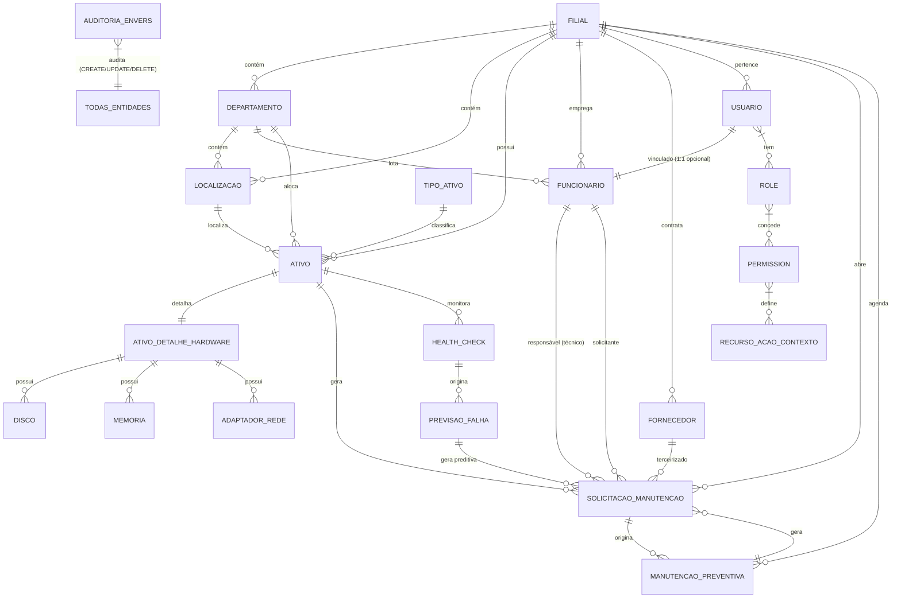
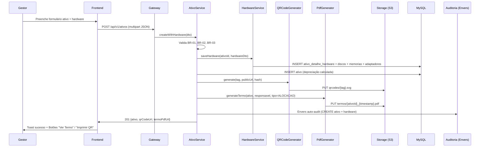
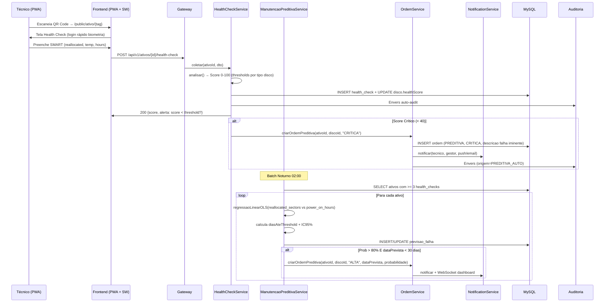
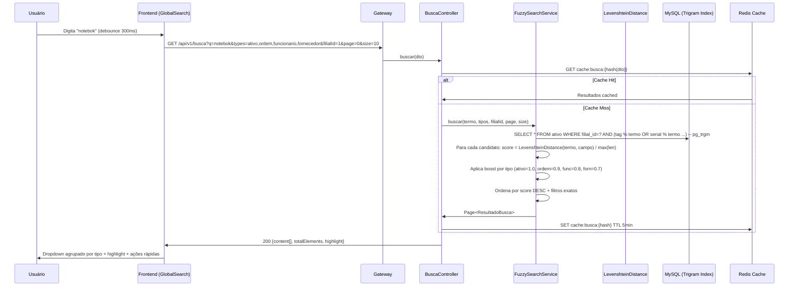

# System Architecture Document (SAD) — Aegis1

> **Versão:** 2.0 · **Owner:** Arquitetura/Eng Lead · **Status:** Draft
> **Base:** BRD v2.0 + NFR v2.0 + Use Cases v2.0 + Análise AST Java Completa
> **ADRs Relacionadas:** `docs/03-architecture/adr.md` (Fuzzy Search, Aegis Shield, Preditiva, Multi-tenancy, Auditoria)

---

## 1. Overview & Goals

O **Aegis1** é uma plataforma **full-stack** de gestão patrimonial e manutenção de ativos, composta por:

- **Backend:** Java 21, Spring Boot 3.3, Spring Data JPA, Spring Security, Hibernate Envers, Lombok, Maven, MySQL 8.0, Flyway, TestContainers
- **Frontend:** Vue 3, Bootstrap 5, Pinia, Vite, PWA (Service Worker, Web App Manifest)
- **Infra:** Docker, Docker Compose, Kubernetes (manifests), GitHub Actions CI/CD

**Objetivos Arquiteturais Principais (derivados do NFR v2.0):**

| Atributo | Meta | Referência NFR |
| :--- | :--- | :--- |
| **Performance Backend** | Latência P95 `/api/v1/**` ≤ 500 ms; Busca Fuzzy P95 ≤ 300 ms (100k ativos); Preditiva batch 10k ativos ≤ 5 min | NFR-P01, P02, P03 |
| **Performance Frontend** | TTI ≤ 3,5s (4G) / ≤ 2s (desktop); Bundle gzipped ≤ 150 kB; Latência P95 request ≤ 800 ms | NFR-P06, P07, P08 |
| **Escalabilidade** | Backend HPA K8s para 200 req/s picos; Multi-tenancy 100 filiais sem degradação linear; CDN 500 users concorrentes | NFR-S01, S02, S03 |
| **Disponibilidade** | Frontend 99,9% (CDN); Backend RTO ≤ 30 min (K8s rollback); RPO ≤ 1 min (MySQL binlog); Health checks K8s probes | NFR-A01, A02, A03, A05 |
| **Segurança** | TLS 1.3 + HSTS; JWT RS256 + Refresh HttpOnly Cookie; RBAC Granular Aegis Shield; Multi-tenancy query-level; Auditoria Envers 100% entidades; Zero console.* prod; CSP + Rate Limiting + OWASP Dep Check | NFR-SEC01 a SEC10 |
| **Observabilidade** | Prometheus/Grafana Golden Signals + Business KPIs; Alertmanager rules; Tracing trace-id 100% mutações; Logs JSON correlation ID; Frontend Core Web Vitals RUM | NFR-O01 a O05 |
| **Manutenibilidade** | Ciclomática ≤ 10; Coverage ≥ 80% gate CI; Checkstyle/SpotBugs/PMD + ESLint/Prettier/TS Strict; OpenAPI 3.1 + Contract Tests; ADRs + C4 versionados | NFR-M01 a M05 |
| **Compliance** | LGPD (esquecimento + portabilidade + consentimento); NR-10/12 (termo assinado + checklist); ISO 27001/SOC 2 (auditoria + logs + pen test); Retenção auditoria 7 anos | NFR-C01 a C05 |
| **Custo** | Frontend CDN ≤ $30/mês; Backend K8s 3 nodes ≈ $400/mês; MySQL RDS ≈ $300/mês; Redis ≈ $50/mês | NFR-CO01 a CO04 |

---

## 2. Tech Stack Justification (Atualizado com Backend Real)

| Camada | Tecnologia | Versão | Justificativa |
| :--- | :--- | :--- | :--- |
| **Language/Backend** | **Java** | 21 LTS | LTS longo (até 2031); Virtual Threads (preview→stable), Pattern Matching, Records, Sealed Classes — ideal para domain modeling rico |
| **Framework Backend** | **Spring Boot** | 3.3.x | Jakarta EE 10, Spring 6, GraalVM native ready, Observability nativa (Micrometer), Security 6, Data JPA 3 |
| **ORM/Persistência** | **Spring Data JPA / Hibernate** | 6.4+ | Entity mapping rico, Envers auditoria nativa, Specifications/QueryDSL para queries dinâmicas, Hibernate Filter multi-tenancy |
| **Banco de Dados** | **MySQL** | 8.0 | JSON support, CTEs, Window Functions, Trigram indexes (pg_trgm via plugin), Mature, Cloud-managed (RDS/Cloud SQL) |
| **Migrações** | **Flyway** | 10+ | Versionamento SQL, Baseline, Callbacks, Repeatable, TestContainers integration |
| **Segurança** | **Spring Security** | 6.2+ | JWT, OAuth2, Method Security (SpEL), Filter Chain, TestSupport |
| **Auditoria** | **Hibernate Envers** | 6.4+ | Automatic entity versioning, RevisionListener, Query API, Conditional auditing |
| **Build/Dependency** | **Maven** | 3.9+ | Wrapper, Profiles, Enforcer, Dependency Check, Surefire/Failsafe |
| **Testes Integração** | **TestContainers** | 1.19+ | MySQL real, Redis, Kafka; Reuso containers (`.testcontainers.properties`); Parallel execution |
| **Language/Frontend** | **TypeScript** | 5.3+ | Strict mode, Type-safe API client (OpenAPI generated), Vue 3 Composition API |
| **Framework Frontend** | **Vue** | 3.4+ | Composition API, `<script setup>`, Pinia, Vite, PWA Plugin |
| **UI Library** | **Bootstrap** | 5.3+ | CSS-only (sem JS runtime), RTL, Acessível, Customizável via Sass |
| **State Management** | **Pinia** | 2.1+ | Type-safe, DevTools, Modular, SSR-ready |
| **Build/Bundler** | **Vite** | 5+ | ESM nativo, HMR rápido, Code-splitting automático, PWA plugin |
| **PWA** | **Vite PWA Plugin** (Workbox) | 0.19+ | Service Worker, Manifest, Offline-first, Push, Background Sync |
| **Containerização** | **Docker** | 24+ | Multi-stage builds, Distroless base, SBOM (Syft), Sign (Cosign) |
| **Orquestração** | **Kubernetes** | 1.28+ | HPA, PodDisruptionBudget, NetworkPolicy, CSI, External Secrets |
| **CI/CD** | **GitHub Actions** | — | Matrix builds, TestContainers, Security scans, Contract tests, Deploy K8s (Helm/Kustomize) |
| **Observabilidade** | **Prometheus + Grafana + Alertmanager + Tempo/Loki** | — | Metrics, Logs, Traces unificados; OpenTelemetry SDK |

---

## 3. High-Level Architecture (C4 Level 1 — Context)

```mermaid
graph TB
    subgraph "Usuários"
        U1[Gestor Patrimônio/Manutenção]
        U2[Técnico Campo (PWA Mobile)]
        U3[Aprovador/Supervisor]
        U4[Admin Cadastros (Filial)]
        U5[Admin Global]
        U6[Auditor/Compliance/DPO]
    end

    subgraph "Frontend (Vue 3 PWA)"
        FE[SPA + Service Worker\nCDN/Static Hosting\nTLS 1.3 + HSTS + CSP]
    end

    subgraph "Backend (Spring Boot 3.3)"
        API[API REST /api/v1\nOpenAPI 3.1]
        AUTH[Auth Server\nJWT RS256 + Refresh]
        DOMAIN[Domain Services\nAtivos, Ordens, Preventiva, Preditiva, Busca, Auditoria]
        SEC[Aegis Shield\nRBAC + Multi-tenancy]
        SCHED[Schedulers\nPreventiva 15min\nPreditiva 02:00\nSLA Diário]
    end

    subgraph "Data Layer"
        DB[(MySQL 8.0\nPrimary + Read Replicas)]
        REDIS[(Redis Cluster\nCache + Session)]
        STORAGE[(Object Storage\nPDFs, QR Codes, Anexos)]
    end

    subgraph "Observabilidade"
        PROM[Prometheus\nMetrics]
        GRAF[Grafana\nDashboards]
        ALERT[Alertmanager\nAlerts]
        TEMPO[Tempo/Jaeger\nTraces]
        LOKI[Loki\nLogs JSON]
        SENTRY[Sentry\nFrontend Errors]
    end

    subgraph "CI/CD & Infra"
        GH[GitHub Actions\nBuild, Test, Scan, Deploy]
        K8S[Kubernetes 1.28+\nHPA, PDB, NetPol]
        VAULT[Secrets\nVault/SealedSecrets]
    end

    U1 --> FE
    U2 --> FE
    U3 --> FE
    U4 --> FE
    U5 --> FE
    U6 --> FE

    FE -->|HTTPS/REST + WebSocket| API
    FE -->|HTTPS| AUTH

    API --> DOMAIN
    API --> SEC
    AUTH --> SEC
    DOMAIN --> DB
    DOMAIN --> REDIS
    DOMAIN --> STORAGE
    SCHED --> DOMAIN

    API --> PROM
    DOMAIN --> PROM
    SCHED --> PROM
    FE --> SENTRY
    FE -->|RUM| GRAF

    PROM --> ALERT
    PROM --> GRAF
    API --> TEMPO
    DOMAIN --> TEMPO
    API --> LOKI
    DOMAIN --> LOKI

    GH --> K8S
    GH --> VAULT
    K8S --> API
    K8S --> FE
```

---

## 4. Container Architecture (C4 Level 2 — Containers)

| Container | Tecnologia | Responsabilidades Principais | Escala | Comunicação |
| :--- | :--- | :--- | :--- | :--- |
| **CDN / Static Hosting** | S3+CloudFront / Azure SWA / Netlify | Entrega assets imutáveis (HTML/JS/CSS/WASM), Compressão Brotli, TLS 1.3, HSTS, CSP | Horizontal nativa CDN | HTTPS GET (Browser) |
| **SPA (Browser)** | Vue 3 + Pinia + Vite PWA | Roteamento, Estado UI (Pinia), Camada API (Axios/Fetch + Interceptors), WebSocket/SSE, Service Worker (Offline, Push, Background Sync), QR Scanner (Barcode Detection API) | Client-side (por aba) | HTTPS/REST + WSS/SSE → Backend; HTTPS → CDN |
| **API Gateway / Spring Cloud Gateway** | Spring Cloud Gateway 4.0 | Rate Limiting, CORS, Request/Response Transform, Circuit Breaker (Resilience4j), Auth Validation (JWT), Routing | Horizontal (K8s HPA) | HTTPS → Backend Services |
| **Auth Service** | Spring Security 6 + JJWT | `/auth/login`, `/auth/refresh`, `/auth/me`; JWT RS256 (rotação chaves), Refresh Token HttpOnly Cookie; Integração Aegis Shield | Horizontal (stateless) | HTTPS (Frontend, Gateway) |
| **Core Domain Services** | Spring Boot 3.3 (Modular Monolith) | **Ativos**: CRUD, Hardware, Depreciação, QR/PDF, Transferência, Baixa, TCO<br>**Ordens**: Corretiva/Preventiva/Preditiva, Estado Máquina, SLA, Custos, Evidências<br>**Preventiva**: Planos CRON, Scheduler Geração Auto, Aderência<br>**Preditiva**: Health Check, Regressão Linear (OLS), Previsão Falha, Ordem Auto<br>**Busca**: FuzzySearchService (Levenshtein), Índices Trigram, Redis Cache<br>**Cadastros**: Filial, Depto, Fornecedor, Funcionário, TipoAtivo (Multi-tenancy)<br>**Relatórios**: Termo PDF (FlyingSaucer), QR Code (ZXing), Etiquetas Lote, Compliance<br>**Auditoria**: Envers Query API, Diff, Export Assinado<br>**LGPD**: Anonimização, Portabilidade, Consentimento | Horizontal (K8s HPA, Read Replicas para queries) | JDBC → MySQL; Redis Cache; S3 → Storage; SMTP/FCM → Notificações |
| **Scheduler Services** | Spring @Scheduled + Quartz | Preventiva (15min), Preditiva Batch (02:00), SLA Diário, Integridade Semanal (Dom 03:00) | Single Leader (K8s Lease Lock) | JDBC → MySQL; Domain Services |
| **MySQL 8.0 Primary** | MySQL 8.0 (InnoDB) | Persistência transacional, Flyway Migrations, Trigram Indexes, Partitioning (auditoria), Read Replicas | Vertical + Read Replicas | JDBC (HikariCP) |
| **Redis Cluster** | Redis 7 | Cache Busca Fuzzy (TTL 5min), Rate Limiting Counters, Session/Token Blacklist, Distributed Locks | Horizontal (Cluster Mode) | Redis Protocol |
| **Object Storage** | S3 / MinIO / GCS | PDFs Termos, QR Codes, Anexos Fotográficos, Exports, Backups | Horizontal | S3 API (Presigned URLs) |
| **Observability Stack** | Prometheus, Grafana, Alertmanager, Tempo, Loki, Sentry | Metrics, Dashboards, Alerts, Traces, Logs, Frontend Errors | Horizontal | OTLP/HTTP (OpenTelemetry) |

---

## 5. Component Architecture (C4 Level 3 — Backend Modules)

```mermaid
graph TB
    subgraph "aegis1-backend (Modular Monolith)"
        direction TB
        
        subgraph "config"
            SEC_CONFIG[SecurityConfig\nFilterChain, CORS, CSRF, MethodSecurity]
            AUDIT_CONFIG[AuditoriaConfig\nEnvers RevisionListener]
            MP_CONFIG[MultiTenancyConfig\nHibernate Filter, TenantContextHolder]
            SCHED_CONFIG[SchedulerConfig\nTaskExecutor, Quartz]
            OPEN_API[OpenApiConfig\nSpringDoc, Groups, SecuritySchemes]
        end
        
        subgraph "security"
            JWT_PROV[JwtTokenProvider\nRS256 Generate/Validate]
            AEGIS[AegisShieldPermissionEvaluator\nRBAC Granular + Contexto]
            MT_FILTER[MultiTenancyFilter\nTenantId → Hibernate Filter]
            RATE_LIMIT[RateLimitFilter\nGateway/Filter]
        end
        
        subgraph "domain/ativo"
            ATIVO_SVC[AtivoService\nCRUD, Depreciação, Transferência, Baixa, TCO]
            ATIVO_CTRL[AtivoController\nREST /api/v1/ativos]
            HW_SVC[HardwareService\nDiscos, Memória, Rede CRUD]
            HW_CTRL[HardwareController\nSub-recursos]
            QR_GEN[QRCodeGenerator\nZXing SVG/PNG]
            PDF_GEN[PdfGenerator\nFlyingSaucer Thymeleaf]
        end
        
        subgraph "domain/ordem"
            ORDEM_SVC[SolicitacaoManutencaoService\nCRUD, State Machine, Custos, Evidências]
            ORDEM_CTRL[OrdemController\nREST /api/v1/ordens]
            SLA_SVC[SlaSchedulerService\nDaily Job, Escalation]
        end
        
        subgraph "domain/preventiva"
            PREV_SVC[ManutencaoPreventivaService\nPlanos CRON, Geração Auto]
            PREV_CTRL[PreventivaController\nREST /api/v1/preventivas]
            PREV_SCHED[PreventivaScheduler\n@Scheduled 15min]
        end
        
        subgraph "domain/preditiva"
            PRED_SVC[ManutencaoPreditivaService\nRegressão Linear OLS, Previsão Falha]
            HEALTH_SVC[HealthCheckService\nSMART Analysis, Score 0-100]
            HEALTH_CTRL[HealthCheckController\nREST /api/v1/health-check]
            PRED_SCHED[PreditivaScheduler\n@Scheduled 02:00]
        end
        
        subgraph "domain/busca"
            FUZZY_SVC[FuzzySearchService\nLevenshtein, Boost, Filtros]
            LEVENSHTEIN[LevenshteinDistance\nAlgoritmo Otimizado]
            BUSCA_CTRL[BuscaController\nREST /api/v1/busca]
        end
        
        subgraph "domain/cadastro"
            FILIAL_SVC[FilialService]
            DEPTO_SVC[DepartamentoService]
            FORN_SVC[FornecedorService]
            FUNC_SVC[FuncionarioService + UsuarioProvisioning]
            TIPO_SVC[TipoAtivoService]
            CAD_CTRL[CadastroController\nREST /api/v1/filiais, /departamentos, ...]
        end
        
        subgraph "domain/relatorio"
            REL_SVC[RelatorioService\nCustoTotal, Aderência, Compliance]
            REL_CTRL[RelatorioController\nREST /api/v1/relatorios]
        end
        
        subgraph "domain/auditoria"
            AUD_SVC[AuditoriaService\nEnvers Query, Diff, Export]
            AUD_CTRL[AuditoriaController\nREST /api/v1/auditoria]
        end
        
        subgraph "domain/seguranca"
            USER_SVC[UsuarioService\nProvisioning, Roles, Filial]
            ROLE_SVC[RoleService\nMatriz Permissions]
            PERM_SVC[PermissionService]
            ADMIN_CTRL[AdminController\nREST /api/v1/admin/*]
        end
        
        subgraph "domain/lgpd"
            LGPD_SVC[LgpdService\nAnonimização, Portabilidade, Consentimento]
            LGPD_CTRL[LgpdController\nREST /api/v1/lgpd]
        end
    end
    
    DB[(MySQL 8.0\nFlyway Migrations)]
    REDIS[(Redis\nCache, Rate Limit, Locks)]
    STORAGE[(S3/MinIO\nPDFs, QR, Anexos)]
    
    ATIVO_SVC --> DB
    HW_SVC --> DB
    QR_GEN --> STORAGE
    PDF_GEN --> STORAGE
    ORDEM_SVC --> DB
    SLA_SVC --> DB
    PREV_SVC --> DB
    PREV_SCHED --> PREV_SVC
    PRED_SVC --> DB
    HEALTH_SVC --> DB
    PRED_SCHED --> PRED_SVC
    FUZZY_SVC --> DB
    FUZZY_SVC --> REDIS
    LEVENSHTEIN --> FUZZY_SVC
    CAD_CTRL --> DB
    REL_SVC --> DB
    REL_SVC --> STORAGE
    AUD_SVC --> DB
    USER_SVC --> DB
    ROLE_SVC --> DB
    LGPD_SVC --> DB
    LGPD_SVC --> AUD_SVC
    
    SEC_CONFIG --> AEGIS
    SEC_CONFIG --> MT_FILTER
    SEC_CONFIG --> JWT_PROV
    AUDIT_CONFIG --> AUD_SVC
    MP_CONFIG --> MT_FILTER
```

---

## 6. Domain Model Overview (Entidades Principais)



**Entidades Chave (Extraídas via AST Java):**

| Entidade | Tabela | Campos Principais | Relacionamentos | Auditoria |
| :--- | :--- | :--- | :--- | :--- |
| **Filial** | `filial` | id, razao_social, cnpj, codigo, endereco, telefone, email, ativo | 1:N Departamento, Localizacao, Ativo, Funcionario, Fornecedor, Usuario, Ordem, Preventiva | ✅ |
| **Departamento** | `departamento` | id, filial_id, codigo, nome, descricao, ativo | N:1 Filial; 1:N Localizacao, Funcionario, Ativo | ✅ |
| **Localizacao** | `localizacao` | id, filial_id, departamento_id, codigo, nome, tipo (SALA/ANDAR/RACK/OUTRO), descricao | N:1 Filial, Departamento; 1:N Ativo | ✅ |
| **TipoAtivo** | `tipo_ativo` | id, codigo, nome, categoria (ENUM), vida_util_anos, valor_residual_pct, requer_detalhe_hardware | 1:N Ativo | ✅ |
| **Ativo** | `ativo` | id, filial_id, departamento_id, localizacao_id, tipo_ativo_id, fornecedor_id, funcionario_responsavel_id, tag (UK), serial, modelo, fabricante, data_aquisicao, valor_aquisicao, valor_residual, vida_util_anos, status (ATIVO/BAIXADO/EM_MANUTENCAO), depreciacao_acumulada, data_baixa, motivo_baixa | N:1 Filial, Depto, Local, Tipo, Fornecedor, Funcionario; 1:1 AtivoDetalheHardware; 1:N Ordem | ✅ |
| **AtivoDetalheHardware** | `ativo_detalhe_hardware` | id, ativo_id (1:1), cpu_modelo, cpu_cores, cpu_frequencia_ghz, memoria_total_gb, memoria_tipo, memoria_frequencia_mhz | 1:1 Ativo; 1:N Disco, Memoria, AdaptadorRede | ✅ |
| **Disco** | `disco` | id, ativo_detalhe_hardware_id, tipo (SSD/HDD), capacidade_gb, serial, smart_raw_json, health_score, temperatura_c, horas_ligado | N:1 AtivoDetalheHardware | ✅ |
| **Memoria** | `memoria` | id, ativo_detalhe_hardware_id, capacidade_gb, tipo (DDR4/DDR5), frequencia_mhz | N:1 AtivoDetalheHardware | ✅ |
| **AdaptadorRede** | `adaptador_rede` | id, ativo_detalhe_hardware_id, mac_address, ip_address, velocidade_mbps, tipo (WIFI/ETHERNET) | N:1 AtivoDetalheHardware | ✅ |
| **Fornecedor** | `fornecedor` | id, filial_id, razao_social, cnpj, contato, email, telefone, endereco, categoria, sla_padrao_horas, avaliacao, certificacoes | N:1 Filial; 1:N Ordem | ✅ |
| **Funcionario** | `funcionario` | id, filial_id, departamento_id, nome, cpf, matricula, cargo, email, telefone, funcao_manutencao (ENUM), usuario_id (1:1 opcional) | N:1 Filial, Depto; 1:1 Usuario; 1:N Ordem (técnico/solicitante) | ✅ |
| **Usuario** | `usuario` | id, email (UK), senha_hash, nome, status (ATIVO/INATIVO/BLOQUEADO), funcionario_id (1:1), roles (JSON/JoinTable) | 1:1 Funcionario; N:M Role | ✅ |
| **Role** | `role` | id, nome (ADMIN/GESTOR/TECNICO/USER/AUDITOR), descricao, global (boolean) | N:M Permission; N:M Usuario | ✅ |
| **Permission** | `permission` | id, recurso, acao, contexto (GLOBAL/FILIAL), descricao | N:M Role | ✅ |
| **SolicitacaoManutencao** | `solicitacao_manutencao` | id, filial_id, ativo_id, tecnico_id, solicitante_id, fornecedor_id, numero (UK), descricao, prioridade (ENUM), tipo (CORRETIVA/PREVENTIVA/PREDITIVA), estado (ABERTA/EM_ANDAMENTO/AGUARDANDO_APROVACAO/APROVADA/CONCLUIDA/CANCELADA), data_abertura, data_inicio, data_aprovacao, data_conclusao, data_cancelamento, custo_estimado, custo_mao_obra, custo_material, custo_terceiros, observacoes, evidencia_json, preventiva_id (FK nullable), previsao_falha_id (FK nullable) | N:1 Filial, Ativo, Tecnico, Solicitante, Fornecedor, Preventiva, PrevisaoFalha | ✅ |
| **ManutencaoPreventiva** | `manutencao_preventiva` | id, filial_id, ativo_id (nullable), tipo_ativo_id (nullable), cron_expression, dia_hora_preferencial, tecnico_padrao_id, descricao_padrao, ativo (boolean), proxima_execucao | N:1 Filial, Ativo, TipoAtivo, Tecnico; 1:N Ordem | ✅ |
| **HealthCheck** | `health_check` | id, ativo_id, disco_id, score (0-100), reallocated_sectors, seek_error_rate, spin_retry_count, temperature_c, power_on_hours, coletado_por, coletado_em, fonte (MANUAL/AGENTE) | N:1 Ativo, Disco | ✅ |
| **PrevisaoFalha** | `previsao_falha` | id, ativo_id, disco_id, data_prevista, probabilidade (0-1), ic_inferior, ic_superior, modelo_usado (LINEAR_OLS), r_quadrado, status (ATIVA/TRATADA/EXPIRADA), criada_em | N:1 Ativo, Disco; 1:1 Ordem (preditiva) | ✅ |
| **Auditoria (Envers)** | `*_AUD` + `REVINFO` | rev, revtype, timestamp, usuario_id, ip, user_agent, diff_json | Todas entidades @Audited | N/A |

---

## 7. Security Architecture (Aegis Shield)

### 7.1 Autenticação (JWT RS256 + Refresh Rotation)

```mermaid
sequenceDiagram
    participant U as Usuário
    participant F as Frontend (Vue + Pinia)
    participant G as Gateway
    participant A as Auth Service
    participant B as Backend Services
    
    U->>F: Email + Senha
    F->>G: POST /api/v1/auth/login
    G->>A: Forward
    A->>A: AuthenticationManager.authenticate()
    A->>A: JwtTokenProvider.generateToken(usuario, roles, filialId)
    A->>F: 200 {accessToken (15min), refreshToken (HttpOnly Cookie 7d, SameSite=Strict)}
    F->>F: Pinia: accessToken (memória); Cookie: refreshToken
    Note over F: authInterceptor: Authorization: Bearer <accessToken> em TODAS requests
    
    F->>G: GET /api/v1/ativos (Bearer token)
    G->>B: Forward + Valida JWT (JwtAuthenticationFilter)
    B->>F: 200 dados
    
    Note over F,B: AccessToken expira (401)
    F->>G: POST /api/v1/auth/refresh (Cookie automático)
    G->>A: Forward
    A->>A: Valida refreshToken (assinatura + expiração + não revogado)
    A->>F: 200 {novo accessToken (15min), novo refreshToken (rotação)}
    F->>F: Atualiza Pinia + Cookie
    F->>G: Retry request original (1x only)
    G->>B: Forward
    B->>F: 200 dados
    
    Note over F: Falha refresh → Limpa Pinia + Cookie → Redirect /login
```

### 7.2 Autorização (Aegis Shield — RBAC Granular + Multi-tenancy)

**Modelo de Permissão:** `Permission(recurso, acao, contexto)` onde:
- **Recurso:** ATIVO, ORDEM, PREVENTIVA, PREDITIVA, RELATORIO, CONFIG, AUDITORIA, LGPD, HEALTH_CHECK, USUARIO, ROLE
- **Acao:** CRIAR, LER, ATUALIZAR, EXCLUIR, APROVAR, INICIAR, CONCLUIR, CANCELAR, GERENCIAR, COLETAR, EXPORTAR
- **Contexto:** GLOBAL (Admin Global) | FILIAL (demais roles)

**Matriz Padrão (Configurável via Admin UI):**

| Role | Contexto | Permissions (Resumo) |
| :--- | :--- | :--- |
| **ADMIN** | GLOBAL | `*_*` (Todas recursos, todas ações, contexto global) |
| **GESTOR** | FILIAL | `ATIVO_*`, `ORDEM_*` (inclui APROVAR), `PREVENTIVA_GERENCIAR`, `PREDITIVA_LER`, `RELATORIO_GERAR`, `HEALTH_CHECK_COLETAR`, `AUDITORIA_LER` (scoped filial) |
| **TECNICO** | FILIAL (próprio) | `ORDEM_INICIAR`, `ORDEM_CONCLUIR`, `ORDEM_LER_PROPRIAS`, `HEALTH_CHECK_COLETAR`, `QR_CODE_ESCANEAR`, `ATIVO_LER` (próprios) |
| **USER** | FILIAL | `ATIVO_LER`, `ORDEM_LER_PROPRIAS`, `RELATORIO_GERAR` (básico) |
| **AUDITOR** | FILIAL/GLOBAL | `AUDITORIA_LER`, `ACESSOS_NEGADOS_LER`, `INTEGRIDADE_VALIDAR`, `RELATORIO_GERAR` (compliance) |

**Avaliação em Tempo Real:** `AegisShieldPermissionEvaluator.hasPermission(auth, resource, action, contextFilial)` → SpEL + Custom Logic (hierarquia roles + contexto filial + ownership).

### 7.3 Multi-tenancy (Isolamento por Filial)

- **Estratégia:** **Hibernate Filter** (`@FilterDef(name="filialFilter", parameters=@ParamDef(name="filialId", type="Long"))`) aplicado em **TODAS** entidades `@Filter(name="filialFilter", condition="filial_id = :filialId")`
- **Injeção:** `MultiTenancyFilter` (OncePerRequestFilter) extrai `filialId` do JWT/Claims → `TenantContextHolder.set(filialId)` → Hibernate Filter ativado automaticamente
- **Admin Global:** `filialId = null` → Filter desativado (vê todas filiais)
- **Testes Cross-tenant:** Obrigatórios em CI (TestContainers) — vazamento = falha de build

---

## 8. Key Technical Decisions (ADRs Resumo)

| ADR | Decisão | Alternativas | Status |
| :--- | :--- | :--- | :--- |
| **ADR-001** | Busca Fuzzy Nativa (Levenshtein Java) vs Elasticsearch/Algolia | Elasticsearch (complexidade operacional), Algolia (custo), pg_trgm only (sem ranking fuzzy) | **Aceita** — Levenshtein otimizado + Trigram indexes + Redis cache |
| **ADR-002** | Manutenção Preditiva: Regressão Linear Simples (OLS) vs ML Complexo | Random Forest, XGBoost, LSTM, Prophet | **Aceita** — Interpretável, leve, roda em batch noturno, sem dependência ML runtime; Evoluir para ML v2.0 |
| **ADR-003** | RBAC: Aegis Shield (Role×Permission×Contexto) vs Spring ACL / Casbin | Spring ACL (complexo, lento), Casbin (externalizado), Keycloak (externalizado) | **Aceita** — Nativo Spring, performance, flexibilidade contextual, auditoria integrada |
| **ADR-004** | Multi-tenancy: Hibernate Filter (Query-level) vs Schema-per-tenant / Column-discriminator | Schema-per-tenant (operacional complexo), Column-discriminator (sem isolamento query) | **Aceita** — Isolamento real no SQL, performance, compatível Envers, testável |
| **ADR-005** | Auditoria: Hibernate Envers (Automático) vs Custom Trigger / Event Sourcing | Custom Triggers (manutenção), Event Sourcing (overkill), CDC (Debezium - complementar) | **Aceita** — Nativo JPA, diff campo-a-campo, query API, condicional, imutável |
| **ADR-006** | PDF/QR Code: FlyingSaucer (Thymeleaf) + ZXing vs iText / Apache PDFBox / Puppeteer | iText (licença AGPL), PDFBox (baixo nível), Puppeteer (Node dependency) | **Aceita** — Pure Java, Thymeleaf templates, ZXing nativo, MIT/Apache licenses |
| **ADR-007** | Frontend: Vue 3 + Vite + PWA vs React/Next.js / SvelteKit / Vanilla | Next.js (SSR desnecessário), SvelteKit (ecossistema menor), Vanilla (produtividade) | **Aceita** — Composition API, TypeScript, Pinia, PWA plugin, Bootstrap 5 CSS-only |
| **ADR-008** | Testes Integração: TestContainers MySQL Real vs H2 / Mockito Only | H2 (dialeto diferente), Mockito only (não testa SQL real) | **Aceita** — MySQL real = confiança migrações Flyway, queries nativas, performance realista |
| **ADR-009** | Offline-First PWA: Service Worker + IndexedDB + Background Sync vs LocalStorage Only | LocalStorage (sem sync, sem push), Dexie.js (wrapper - adicionado como dep opcional) | **Aceita** — Workbox (Vite PWA Plugin), IndexedDB nativo, Background Sync API, Push API |
| **ADR-010** | LGPD Anonimização: Hash Preservado em Envers vs Hard Delete / Pseudonimização Simples | Hard Delete (quebra auditoria/referências), Pseudonimização simples (reversível) | **Aceita** — Hash SHA-256 + salt em Envers mantém rastreabilidade legal; Dados PII removidos |

---

## 9. Data Flow Examples

### 9.1 Criação de Ativo com Hardware + QR + Termo (UC-06)



### 9.2 Health Check Coleta + Previsão Falha + Ordem Preditiva Auto (UC-25, 26, 27)



### 9.3 Busca Global Fuzzy (UC-29)



---

## 10. Deployment Architecture (Kubernetes)

```yaml
# Resumo dos Manifests K8s (k8s/)
apiVersion: v1
kind: Namespace
metadata:
  name: aegis1
---
# Backend Deployment (HPA: CPU>70% / Memory>80% / Custom: request_latency_p95>500ms)
apiVersion: apps/v1
kind: Deployment
metadata:
  name: aegis1-backend
  namespace: aegis1
spec:
  replicas: 3
  selector:
    matchLabels:
      app: aegis1-backend
  template:
    spec:
      containers:
      - name: backend
        image: aegis1/backend:1.0.0
        ports: [8080]
        envFrom: [secretRef: aegis1-secrets]
        resources:
          requests: {memory: "1Gi", cpu: "500m"}
          limits: {memory: "2Gi", cpu: "1000m"}
        livenessProbe: {httpGet: {path: /actuator/health/liveness, port: 8080}, initialDelaySeconds: 60}
        readinessProbe: {httpGet: {path: /actuator/health/readiness, port: 8080}, initialDelaySeconds: 30}
---
# Frontend Deployment (Static + Nginx)
apiVersion: apps/v1
kind: Deployment
metadata:
  name: aegis1-frontend
  namespace: aegis1
spec:
  replicas: 3
  template:
    spec:
      containers:
      - name: frontend
        image: aegis1/frontend:1.0.0
        ports: [80]
        resources: {requests: {memory: "64Mi", cpu: "50m"}, limits: {memory: "128Mi", cpu: "100m"}}
---
# HPA Backend
apiVersion: autoscaling/v2
kind: HorizontalPodAutoscaler
metadata:
  name: aegis1-backend-hpa
  namespace: aegis1
spec:
  scaleTargetRef: {apiVersion: apps/v1, kind: Deployment, name: aegis1-backend}
  minReplicas: 3
  maxReplicas: 20
  metrics:
  - type: Resource
    resource: {name: cpu, target: {type: Utilization, averageUtilization: 70}}
  - type: Resource
    resource: {name: memory, target: {type: Utilization, averageUtilization: 80}}
  - type: Pods
    pods: {metric: {name: http_requests_latency_p95}, target: {type: AverageValue, averageValue: "500ms"}}
  behavior:
    scaleDown: {stabilizationWindowSeconds: 300}
    scaleUp: {stabilizationWindowSeconds: 60}
---
# Ingress (TLS 1.3, Rate Limit, CSP Headers)
apiVersion: networking.k8s.io/v1
kind: Ingress
metadata:
  name: aegis1-ingress
  namespace: aegis1
  annotations:
    nginx.ingress.kubernetes.io/rate-limit: "500"
    nginx.ingress.kubernetes.io/rate-limit-window: "1m"
    nginx.ingress.kubernetes.io/configuration-snippet: |
      add_header Content-Security-Policy "default-src 'self'; script-src 'self'; style-src 'self' 'unsafe-inline'; img-src 'self' data:; font-src 'self'; connect-src 'self' wss: https:; frame-ancestors 'none';";
      add_header X-Frame-Options "DENY";
      add_header X-Content-Type-Options "nosniff";
      add_header Referrer-Policy "strict-origin-when-cross-origin";
spec:
  tls:
  - hosts: [aegis1.empresa.com]
    secretName: aegis1-tls
  rules:
  - host: aegis1.empresa.com
    http:
      paths:
      - path: /api
        pathType: Prefix
        backend: {service: {name: aegis1-backend, port: {number: 8080}}}
      - path: /
        pathType: Prefix
        backend: {service: {name: aegis1-frontend, port: {number: 80}}}
```

---

## 11. Observability Stack

| Componente | Função | Configuração Chave |
| :--- | :--- | :--- |
| **Prometheus** | Métricas (Pull) | `scrape_interval: 15s`; ServiceMonitors: backend (actuator/prometheus), frontend (nginx-vts), k8s (kube-state-metrics), node-exporter |
| **Grafana** | Dashboards | Provisionados via ConfigMap: Golden Signals (Latency, Traffic, Errors, Saturation) por endpoint; Business: Ordens/dia, CustoTotalPorAtivo, Aderência Preventiva, Alertas Preditivos, Login Success Rate |
| **Alertmanager** | Alertas | Routes: Critical (PagerDuty/Slack/Email), Warning (Slack), Info (Log); Inhibit rules: cross-tenant leak > 10/min → Critical |
| **Tempo/Jaeger** | Traces | OpenTelemetry SDK (Java + JS); Sampling: 10% requests, 100% errors; Trace-id header propagado |
| **Loki** | Logs JSON | Promtail (K8s) + Logback Logstash Encoder; Labels: app, namespace, level, traceId; Retenção 30d |
| **Sentry** | Frontend Errors | DSN configurado; Release tracking; Source maps upload CI; Zero `console.*` prod (ESLint error) |

---

## 12. Disaster Recovery & Backup

| Componente | RTO | RPO | Estratégia |
| :--- | :--- | :--- | :--- |
| **Frontend (CDN)** | ≤ 15 min | 0 | Assets imutáveis versionados; Rollback CDN (versão anterior); DNS TTL 60s |
| **Backend (K8s)** | ≤ 30 min | ≤ 1 min | K8s Rollback (Deployment revision); MySQL Point-in-Time Recovery (binlog + backup snapshot diário); Testes restore mensais |
| **MySQL Primary** | ≤ 60 min | ≤ 1 min | Automated Backup (RDS/Cloud SQL) + Binlog Replication; Cross-region Read Replica; Restore testado mensalmente |
| **Redis** | ≤ 15 min | ≤ 5 min | AOF + RDB Snapshots; Replica Multi-AZ; Cache warming script pós-restore |
| **Object Storage** | ≤ 30 min | 0 | Versioning habilitado; Cross-region Replication (CRR); Lifecycle policies |
| **Secrets/Vault** | ≤ 15 min | 0 | Vault/SealedSecrets; Backup encrypted; Rotation automática (cert-manager TLS, JWT keys) |

---

## 13. Evolution Roadmap (Arquitetural)

| Fase | Foco | Mudanças Arquiteturais |
| :--- | :--- | :--- |
| **v1.0 MVP** | Core Domain + Corretiva + Auth + Busca + QR/PDF | Modular Monolith Spring Boot; Vue 3 PWA; MySQL + Redis; K8s |
| **v1.1 Should** | Preventiva + Preditiva + RBAC Granular + LGPD + Compliance | Scheduler Services; ML Pipeline (OLS); Aegis Shield Matrix; Envers 100%; Anonimização |
| **v1.2 Could** | Maturidade + PWA Completo + Hardening + Multi-cloud | Checklists, Anexos, Import Lote; Pen Test CI; Checksums; PostgreSQL Support; PWA Push/Background Sync |
| **v2.0 Mobile** | App Nativo iOS/Android | Capacitor/Ionic ou React Native; Offline-first nativo; QR Scanner nativo; Push nativo; Codepush |
| **v2.1 AI/ML** | Anomaly Detection Avançado | Isolamento Forest / LSTM para preditiva; Feature Store; MLOps (MLflow/Kubeflow); A/B Testing modelos |
| **v3.0 Platform** | Ecossistema + Integrações | API Gateway externo (Kong/Apigee); Event Mesh (Kafka); CMDB/ITSM Connectors; Marketplace Plugins |

---

## 14. Glossário Arquitetural (Referência Rápida)

| Termo | Definição |
| :--- | :--- |
| **Aegis Shield** | Modelo de autorização granular hierárquico e contextual com multi-tenancy por Filial (Role × Permission × Contexto) |
| **MultiTenancyFilter** | Filtro Spring que injeta `filialId` no Hibernate Filter para isolamento query-level |
| **FuzzySearchService** | Serviço de busca aproximada usando Levenshtein Distance + Trigram Indexes + Redis Cache |
| **ManutencaoPreditivaService** | Serviço que aplica Regressão Linear Simples (Mínimos Quadrados) para prever falhas de disco |
| **HealthCheckService** | Serviço que analisa métricas SMART (reallocated_sectors, temperature, power_on_hours) e calcula score 0-100 |
| **Envers** | Hibernate Envers — Auditoria automática de entidades (@Audited) com diff campo-a-campo imutável |
| **Flyway** | Migrações de banco versionadas (V1__init, V2__..., R__repeatable, U__undo) |
| **TestContainers** | Testes de integração com containers reais (MySQL, Redis) — reuso habilitado via `.testcontainers.properties` |
| **OpenAPI 3.1** | Contrato de API versionado (`/api/v1/openapi.yaml`); Validação CI via Contract Tests |
| **PWA** | Progressive Web App — Service Worker (Workbox), Manifest, Offline-first, Push, Background Sync, Install Prompt |

---

*Documento regenerado completamente com base em análise AST completa do backend Java (domain, service, controller, config, security, predictive, search, audit, report, scheduler) + frontend Vue/PWA + infra K8s/Docker. Substitui versão 1.0 que descrevia apenas frontend + backend externo hipotético.*