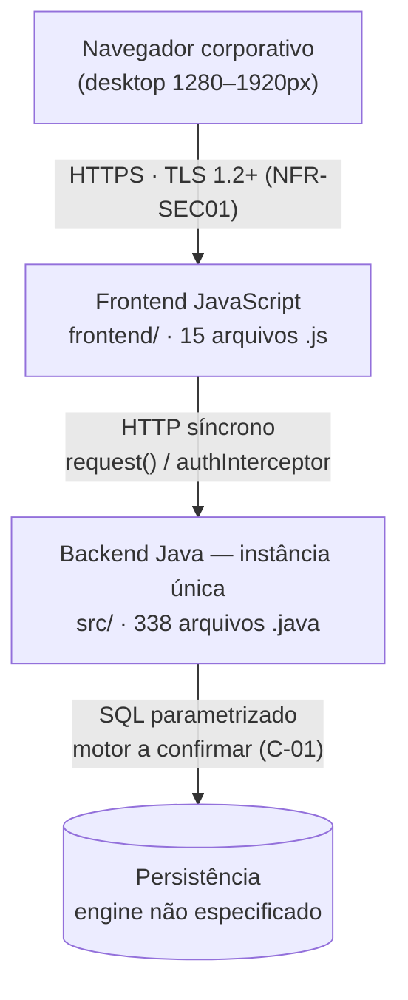

# System Architecture Document (SAD) — a6 · AegisPatrimônio

> **Versão:** 1.0 · **Owner:** Engenharia/Arquitetura · **Status:** Draft
> **ADRs relacionadas:** Nenhuma ADR formalizada foi identificada no repositório. As decisões registradas neste documento e no NFR v1.0 servem de base de governança até a formalização das primeiras ADRs — em especial a decisão sobre o motor de persistência, pendente de confirmação técnica (C-01 do BRD).

---

## 1. Overview & Goals

O AegisPatrimônio é um sistema interno corporativo de gestão patrimonial multi-filial, posicionado como **fonte única de verdade do patrimônio** (BRD §1). O codebase verificado (varredura determinística + AST: 353 arquivos, ~27.912 LOC, 1.287 funções, 347 classes) é composto por:

- **Backend Java** — 338 arquivos `.java` em `src/`, organizados em pacotes `br.com.aegispatrimonio.{model, repository, mapper, service, config.seeder}`;
- **Frontend JavaScript** — 15 arquivos `.js` em `frontend/`, com camada de serviços centralizada em `src/services/api.js`;
- **Topologia Aplicação Web / Server-side**, de **instância única**, sem empacotamento desktop (não há `src-tauri/Cargo.toml`).

Funcionalidades evidenciadas pelos artefatos de código e NFRs: cadastro e busca/ranking de ativos, fluxo de manutenção com aprovação, alertas operacionais (`AlertNotificationService`), histórico de saúde por filial (`getHealthHistory`) e trilha de auditoria de modificações (`onUpdate`/`preUpdate` — BR-08).

**Objetivos arquiteturais** (ancorados nos NFRs):

1. **Performance** — metas de latência p95/p99 para CRUD, listagens e consultas com filtros (NFR-P01–P04);
2. **Escalabilidade vertical** — 150 usuários concorrentes por instância única, sem degradação > 10% (NFR-S01–S03);
3. **Disponibilidade em horário comercial** — 99,0% (08:00–18:00, dias úteis), RTO ≤ 4h, RPO ≤ 24h (NFR-A01–A04);
4. **Segurança por padrão** — TLS 1.2+, autenticação por token validado a cada requisição, RBAC com contexto e 100% de consultas SQL parametrizadas (NFR-SEC01–SEC04);
5. **Observabilidade** — logs estruturados com correlation ID, alertas de latência/erro/saturação, auditoria consultável (NFR-O01–O04);
6. **Manutenibilidade** — complexidade ciclomática ≤ 10, cobertura de testes ≥ 80% em service/mapper (NFR-M01–M06);
7. **Compliance** — LGPD para dados pessoais de funcionários (NFR-C01–C03);
8. **Eficiência de custo** — infraestrutura abaixo de USD 2,50/usuário ativo/mês (NFR-CO01).

**Pendência arquitetural central:** o motor de persistência **não está especificado** (C-01 do BRD; levantamento técnico urgente no BRD §8). Esta pendência condiciona backup (NFR-A03), criptografia em repouso (NFR-SEC01), concorrência de escrita (NFR §2) e qualquer evolução para múltiplas instâncias (NFR-S02).

---

## 2. Tech Stack Justification

> Tabela ancorada exclusivamente no que foi verificado em `package.json` e na varredura do codebase. Onde a alternativa não foi registrada em ADR, a coluna indica isso explicitamente — alternativas de mercado **não foram presumidas**.

| Camada | Tecnologia Escolhida | Alternativas Consideradas | Justificativa Resumida |
| :--- | :--- | :--- | :--- |
| Language/Runtime (backend) | **Java** — 338 arquivos `.java` em `src/`, pacotes `br.com.aegispatrimonio.*` | Não registrado — sem ADRs formalizadas | Linguagem efetivamente em uso no codebase; versão do runtime **a confirmar e documentar antes do go-live** (NFR-PO03) |
| Language/Runtime (frontend) | **JavaScript** — 15 arquivos `.js` em `frontend/` | Não registrado | Linguagem efetivamente em uso; sem empacotamento desktop (não há `src-tauri/Cargo.toml`) |
| Dependência de produção (UI) | **`@popperjs/core ^2.11.8`** — única dependência de produção declarada | Não registrado | Único pacote verificado em `package.json`; **nenhuma devDependency declarada** |
| Framework Web (backend) | **Não declarado nas dependências** — evidência de filtro de requisição (`doFilterInternal`) e camadas service/repository/mapper | A confirmar (C-01 / levantamento técnico do BRD §8) | O framework real não é descobrível a partir das dependências declaradas; resolução pendente do levantamento técnico urgente |
| Banco de Dados | **Não especificado** — nenhum motor de banco conhecido encontrado nas dependências; hipótese de trabalho: **SQL cru** | Decisão pendente (C-01 do BRD) | Nenhum motor verificável no codebase; backup, criptografia em repouso e modelo de concorrência dependem desta confirmação |
| ORM / Query Builder | **Nenhum** — SQL cru, sem ORM/query builder | — | Sem ORM nas dependências; o plano de consulta é responsabilidade direta do código (NFR-P02) e a parametrização é obrigatória (NFR-SEC03) |
| Mensageria/Fila | **Nenhuma identificada** | — | Nenhum broker nas dependências; comunicação síncrona HTTP entre frontend e backend |
| Cache | **Nenhuma identificada** | — | Nenhuma camada de cache nos fontes; eventual cache seria em processo [INFERIDO POR IA — REQUER VALIDAÇÃO HUMANA] |
| Infraestrutura/Cloud | **Servidor único** (on-premises ou VM de nuvem única) | Multi-cloud/multi-região: **fora de escopo nesta fase** (NFR-PO02) | Topologia Aplicação Web/Server-side; escalonamento vertical como estratégia primária (NFR-S02); custo alvo USD 2,50/usuário/mês (NFR-CO01) |

---

## 3. High-Level Architecture

O sistema é composto por **dois blocos verificáveis no codebase** e uma fronteira de persistência pendente:

1. **Backend Java monolítico** (`src/`, 338 arquivos) — responsável por endpoints HTTP, autenticação/autorização, regras de negócio, acesso a dados e o seeder de homologação. A varredura determinística **não extraiu inventário de rotas/handlers** ("Nenhuma rota/IPC detectada no código"); os endpoints são evidenciados por comportamento nos NFRs (login via `createUserAndToken`, validação por `doFilterInternal` em cada requisição, `getHealthHistory`, operações CRUD de ativos).
2. **Frontend JavaScript** (`frontend/`, 15 arquivos) — interface desktop-first com camada de serviços centralizada em `api.js`: função `request` (complexidade ciclomática 13 — ponto de atenção), `authInterceptor` (injeção do token) e `handleApiError` (tratamento uniforme de erros — NFR-U02).
3. **Camada de persistência** — motor **não especificado** (C-01); hipótese de trabalho é SQL cru com consultas parametrizadas (NFR-SEC03).

A comunicação entre frontend e backend é **síncrona via HTTP com TLS 1.2+** (NFR-SEC01), com correlation ID propagado (NFR-O02). O diagrama de containers (C4) é mantido em [[uml-diagrams]] — não duplique o diagrama aqui, apenas referencie-o.

### Componentes

| Componente | Responsabilidade | Tecnologia | Escala Independente? |
| :--- | :--- | :--- | :--- |
| Frontend Web (`frontend/`) | Interface desktop-first (1280–1920px, NFR-U03); camada de serviços (`request`, `authInterceptor`, `handleApiError`) | JavaScript + `@popperjs/core ^2.11.8` | Não |
| Backend monólito (`src/`) | Endpoints HTTP, filtro de autenticação (`doFilterInternal`), autorização RBAC com contexto (`hasPermission`), regras de negócio | Java (versão a confirmar — NFR-PO03) | Não |
| Camada de acesso a dados | Consultas SQL cru parametrizadas; filtros combinados via `ManutencaoSpecification`; mapeamento DTO via `AtivoMapper` | Java; motor de persistência a confirmar (C-01) | Não |
| Serviço de alertas (`AlertNotificationService`) | Verificação de uso de recursos e alertas operacionais (`checkResourceUsageAlerts`) | Java | Não |
| Seeder (`RealisticDataSeeder`) | População de dados realistas para homologação e primeira onda de medição de performance | Java | Não (restrito a homologação) |

Todos os componentes compartilham a **instância única** — nenhum escala independentemente (NFR-S02, NFR-A04).

---

## 4. Architectural Style & Patterns

* **Estilo:** **Monólito modular em camadas** (layered monolith), instância única de aplicação web server-side. Evidência: árvore única `src/` com pacotes em camadas (model → repository → mapper → service), sem indícios de microsserviços, serverless ou event-driven; topologia de instância única confirmada pelos NFRs (NFR-S02, NFR-A04, NFR-PO02).
* **Padrões aplicados (evidenciados no código/NFR):**
  * Service Layer (`AtivoService`, `AlertNotificationService`);
  * Repository + Specification (`ManutencaoSpecification` para filtros combinados de consulta);
  * Mapper/DTO (`AtivoMapper.toDTO`);
  * Filter/Interceptor para autenticação (`doFilterInternal` no backend; `authInterceptor` no frontend);
  * RBAC com contexto (perfil + filial/departamento) via `hasPermission`;
  * Seeder de dados (`RealisticDataSeeder`);
  * Callbacks de auditoria (`onUpdate`/`preUpdate` — BR-08, mecanismo já implementado);
  * Tratamento centralizado de erros no frontend (`handleApiError`).
* **Padrões NÃO aplicados / não evidenciados:** CQRS, Event Sourcing, Circuit Breaker, mensageria/eventos assíncronos — nenhum desses mecanismos existe no codebase, e nenhum é requisito nesta fase.
* **Comunicação entre componentes:** **Síncrona (HTTP)** entre frontend e backend, com correlation ID propagado (NFR-O02). Não há comunicação assíncrona por fila/eventos entre componentes.

---

## 5. Data Modeling

* **Motor escolhido:** **não especificado** — nenhum motor de banco ou ORM/query builder declarado nas dependências (C-01 do BRD). Hipótese de trabalho: **SQL cru**. O modelo de concorrência e lock do motor é desconhecido até a confirmação — as metas de escrita concorrente serão redefinidas após o levantamento técnico (nota do NFR §2).
* **Estado da varredura de schema:** **nenhuma tabela foi detectada no schema** pela varredura determinística. O contrato físico (tabelas, colunas, constraints, DDL) vive em [[db-schema-spec]] e ainda não foi extraído do código; o modelo conceitual de entidades vive em [[db-domain-model]].
* **Entidades evidenciadas por nomes de classes/funções no código** (não constitui DDL confirmado):
  * **Ativo** (`AtivoService`, `AtivoMapper` — CRUD, busca e ranking);
  * **Usuario** (`Usuario.java` — atenção ao stub `setUsername`, linha 86, NFR-M05);
  * **Funcionario** (`createFuncionarioAndUsuario` — vínculo funcionário↔credenciais, relevante para LGPD, NFR-C01);
  * **Manutenção** (`ManutencaoSpecification` — filtros combinados);
  * **Histórico de saúde por filial** (`getHealthHistory` — leitura restrita por filial, BR-03);
  * **Alertas** (`AlertNotificationService` / `checkResourceUsageAlerts`);
  * **Trilha de auditoria** (`onUpdate`/`preUpdate` — BR-08).
* **Relacionamentos indicados pelos requisitos:** ativo ↔ unidade organizacional (filial/departamento, contexto do RBAC — NFR-SEC02); funcionário ↔ usuário/credenciais (`createFuncionarioAndUsuario`); ativo ↔ manutenção e ativo ↔ histórico de saúde (fluxo de monitoramento, BRD §4/§5).
* **Estratégia de particionamento/sharding:** **Não aplicável** — instância única, escopo interno multi-filial, sem requisito de distribuição de dados (NFR-PO02, NFR-S02).
* **Estratégia de migração de schema:** ver [[db-migration-spec]]. Nenhum mecanismo de migração foi identificado no repositório — a definir junto com a confirmação do motor de persistência (C-01).

---

## 6. Integration Boundaries & APIs

| Integração | Tipo | Direção | Contrato | Criticidade |
| :--- | :--- | :--- | :--- | :--- |
| Frontend ↔ Backend | HTTP (TLS 1.2+ — NFR-SEC01) | Frontend → Backend (outbound a partir do navegador, via `request`/`authInterceptor`) | Documentação de endpoints **a definir** (NFR-M03 — não instrumentada no repositório); comportamentos referenciados no NFR: login (`createUserAndToken`), validação por requisição (`doFilterInternal`), `getHealthHistory`, CRUD de ativos | Alta |
| Backend ↔ Persistência | SQL cru (100% parametrizado — NFR-SEC03) | Backend → Banco | Contrato físico em [[db-schema-spec]] — **nenhuma tabela detectada na varredura do schema** | Alta |
| Integrações externas (pagamento, e-mail, ERPs etc.) | — | — | **Nenhuma integração externa detectada no código** | — |

> **Nota:** a varredura determinística não detectou rotas/IPC/handlers no código — o catálogo de endpoints é um gap de documentação (NFR-M03) e deve ser gerado na primeira onda de documentação de API, em conjunto com a [[api-specification]].

---

## 7. Scalability & Performance Strategy

* **Estratégia de escala:** **Escalonamento vertical** (scale-up da instância única) — NFR-S02. Metas: **150 usuários concorrentes** por instância com degradação < 10% nas metas de NFR-P01/P02 (NFR-S01); **50 req/s sustentados** em leitura (NFR-S03). **Escalonamento horizontal NÃO é requisito nesta fase**: a invalidação imediata do token no logout (BR-07 / NFR-SEC04) implica estado de sessão/token no servidor, e o mecanismo de persistência — que hospedaria esse estado compartilhado — ainda não está confirmado (C-01).
* **Pontos de gargalo conhecidos:**
  1. **Ranking de ativos em memória** — `AtivoService.java:119` carrega até 1000 candidatos (id+nome) e ranqueia em memória (TODO + diagnóstico AST). Meta: p95 < 1,5s com 1000 candidatos (NFR-P04). Se não atendida, o ranking deve ser empurrado para a camada de consulta e paginado.
  2. **Consultas com filtros combinados** — `ManutencaoSpecification.build` (complexidade ciclomática 14). Sem ORM, índices e plano de consulta são responsabilidade direta do código; meta p95 < 1s / p99 < 2s (NFR-P02). A definição de índices deve ser revisada em conjunto com a refatoração deste método.
  3. **Camada única de comunicação HTTP no frontend** — `request` em `api.js:54` (complexidade 13); refatorar antes de novas evoluções (NFR-M02).
  4. **`RealisticDataSeeder.run`** (complexidade 15) — restrito a homologação, sem impacto em produção.
* **Estratégia de cache:** Nenhuma camada de cache identificada ou implementada nos fontes. [INFERIDO POR IA — REQUER VALIDAÇÃO HUMANA] *Premissa: dada a topologia de instância única e o uso interno, eventual cache seria em processo (memória da própria instância Java), sem camada distribuída; a política de invalidação seria definida caso introduzido. A prioridade atual é resolver o gargalo de consulta (item 2) antes de adicionar cache.*

---

## 8. Reliability & Fault Tolerance

* **Single points of failure identificados:** A **própria instância única** (aplicação + persistência no mesmo deployment) — SPOF **aceito e documentado** (NFR-A04); zero SPOF não é exigível nesta fase. Indisponibilidade bloqueia o cadastro patrimonial e o fluxo de manutenção com aprovação (NFR-A01; BRD §1/§2). Uptime alvo: **99,0% em horário comercial** (08:00–18:00, dias úteis), com janela de manutenção fora do expediente.
* **Estratégias de resiliência:**
  * **RTO ≤ 4h** — restauração em servidor único com procedimento manual documentado (NFR-A02), **testado a cada semestre** (NFR-A04);
  * **RPO ≤ 24h** — backup diário; a estratégia **depende da confirmação do motor de persistência** (C-01) e deve incluir obrigatoriamente a trilha de auditoria (BR-08) e o histórico de saúde (`getHealthHistory`) (NFR-A03);
  * **Monitoramento de saúde da aplicação** — alertas internos já existentes via `checkResourceUsageAlerts` (saturação de recursos);
  * **Tratamento de erros no frontend** — `handleApiError` cobre 100% dos erros de API apresentados ao usuário, sem exposição de detalhes internos (NFR-U02);
  * Padrões como retry com backoff, circuit breaker e bulkhead: **não evidenciados no código** e não são requisitos desta fase, dada a topologia de instância única e a comunicação síncrona interna.
* **Estratégia multi-região/multi-AZ:** **Não aplicável nesta fase** (NFR-PO02) — alta disponibilidade distribuída não é suportada pela topologia identificada.

---

## 9. Security Architecture

* **Boundary de rede:** Não há configuração de rede/IaC no repositório — a topologia é **servidor único** (on-premises ou VM de nuvem única, NFR-PO02). Segmentação de rede, firewall e regras de acesso precisam ser documentadas pela infraestrutura antes do go-live. [INFERIDO POR IA — REQUER VALIDAÇÃO HUMANA] *Premissa: sistema interno corporativo, acessível apenas pela rede corporativa por usuários autenticados; sem exposição pública de endpoints administrativos.*
* **Controles aplicados (evidenciados no código/NFR):**
  * **TLS 1.2+ (preferencialmente 1.3) em 100% do tráfego** frontend↔backend (NFR-SEC01); criptografia em repouso de credenciais e dados pessoais: mecanismo a definir junto com a confirmação do motor de persistência (C-01);
  * **Autenticação por token** emitido no login (`createUserAndToken`) e validado em **cada requisição** (`doFilterInternal` no backend; `authInterceptor` no frontend) (NFR-SEC02);
  * **Autorização RBAC com contexto** (perfil + filial/departamento) via `hasPermission`, cobrindo **100% das operações de escrita** (BR-01, BR-04) e a leitura do histórico de saúde por filial (BR-03);
  * **Logout invalida imediatamente o token** (BR-07 / NFR-SEC04) — implica estado de sessão/token no servidor (ver implicação de escala na Seção 7); sessão encerrada (`clearSession`) exige nova autenticação;
  * **Injeção de SQL:** como o projeto opera com SQL cru (sem ORM/query builder), **100% das consultas devem ser parametrizadas** — concatenação de strings em SQL é proibida (NFR-SEC03); verificação por revisão de código e testes dedicados. Ênfase especial deste controle, dado o SQL cru;
  * **Nenhum segredo/credencial versionado no repositório**; rotação de segredos de configuração a cada 90 dias [INFERIDO POR IA — REQUER VALIDAÇÃO HUMANA — não há segredos identificados nos fontes];
  * **MFA:** não evidenciado no código — tratado como evolução futura, não requisito desta fase (NFR-SEC02).
* **Referência:** security-policies.md.

---

## 10. Observability Architecture

> **Estado atual:** não há telemetria instrumentada no repositório (NFR §6; BRD §4 — `package.json` sem scripts e sem devDependencies). Os itens abaixo descrevem a **arquitetura-alvo** de observabilidade, não o estado presente. Ferramentas: [INFERIDO POR IA — REQUER VALIDAÇÃO HUMANA] — a definir pela engenharia.

* **Logging centralizado:** Ferramenta a definir. Requisitos: logs estruturados no backend com **correlation ID por requisição**; endpoint de health check da aplicação; **zero `console.*` no frontend de produção** (NFR-M04 — as 2 residuais em `api.js:44` `console.error` e `:107` `console.debug` devem ser removidas, com verificação automatizada no pipeline).
* **Métricas:** Ferramenta a definir. Alertas operacionais para: **p95 de latência das listagens** (guardrail do BRD — área sensível do TODO em `AtivoService`), **taxa de erro > 1%** e **saturação de recursos** do servidor (NFR-O03). Base atual: alertas internos via `checkResourceUsageAlerts`.
* **Tracing distribuído:** **Não se aplica** à topologia de instância única (não há microsserviços — NFR-O02). Requisito correspondente: correlation ID propagado entre frontend (`request`) e backend e presente em **100% dos logs de requisições que falharem**, viabilizando investigação de incidentes de acesso indevido (guardrail do BRD §4).
* **Auditoria:** eventos `onUpdate`/`preUpdate` (BR-08) consultáveis por registro com data/hora da última modificação (NFR-O04) — mecanismo **já implementado no código** (parcialmente validado no NFR).

---

## 11. Deployment Topology

> **Notas de topologia:**
> * Topologia **deliberadamente de instância única** — sem load balancer, sem réplicas de leitura, sem múltiplas AZs/regiões (NFR-S02, NFR-A04, NFR-PO02). O SPOF resultante é aceito e documentado (Seção 8).
> * [INFERIDO POR IA — REQUER VALIDAÇÃO HUMANA] O diagrama assume que os assets do frontend são servidos por um servidor web estático distinto do processo de aplicação; o mecanismo real de servir o frontend **não é descobrível a partir dos fontes** e deve ser confirmado pela engenharia.
> * O `RealisticDataSeeder` atua apenas no ambiente de homologação, populando dados para a primeira onda de medição de performance (NFR §1).

---

## 12. Trade-offs & Known Limitations

* **Instância única vs. alta disponibilidade:** simplicidade operacional e custo (alvo USD 2,50/usuário/mês — NFR-CO01) em troca de SPOF aceito e documentado (NFR-A04). Indisponibilidade bloqueia a operação patrimonial (NFR-A01/BRD §2).
* **Escalonamento vertical vs. horizontal:** a invalidação imediata do token no logout (BR-07) exige estado de sessão/token no servidor; o escalonamento horizontal foi **conscientemente adiado** até que o armazenamento compartilhado de tokens seja resolvido e o NFR-SEC02 revalidado (NFR-S02).
* **SQL cru sem ORM:** controle fino do plano de consulta e dos índices (NFR-P02) em troca de responsabilidade total pela parametrização (NFR-SEC03) e maior custo de manutenção das queries. Decisão condicionada à confirmação do motor (C-01).
* **Ranking em memória de até 1000 candidatos** (`AtivoService.java:119`): simplicidade de implementação em troca de risco de latência (NFR-P04) — débito técnico trackado com TODO, responsável e prazo pendentes (NFR-M06).
* **Sem APM/telemetria instrumentada:** zero custo/complexidade adicional em troca de metas de performance (NFR-P01–P04) atualmente **não mensuráveis** — transparência registrada no BRD §4; instrumentação recomendada em homologação antes do go-live.
* **Sem ADRs formalizadas:** velocidade em troca de governança — decisões de stack (framework backend, motor de dados) não estão registradas formalmente, o que agrava a pendência C-01.
* **Complexidade ciclomática acima do limite (10) em 5 pontos** — `checkResourceUsageAlerts` (17), `RealisticDataSeeder.run` (15), `AtivoMapper.toDTO` (14), `ManutencaoSpecification.build` (14), `request` (13): velocidade de evolução passada em troca de risco de manutenção; refatoração obrigatória antes de novas evoluções nessas áreas (NFR-M02).
* **`package.json` sem nome e sem scripts de build/verificação:** gap de automação confirmado (NFR-M06) — limita a reprodutibilidade do build do frontend.
* **Stub `Usuario.setUsername`** (corpo vazio, linha 86): método sem implementação em produção (NFR-M05) — implementar ou remover do fluxo de atualização (C-04 do BRD).

---

## 13. Future Evolution

* **Confirmar o motor de persistência e a versão do runtime Java** (C-01 / NFR-PO03) — pré-requisito de go-live e desbloqueio das decisões condicionadas (backup, criptografia em repouso, concorrência de escrita, estado compartilhado de tokens).
* **Escalonamento horizontal** — após resolver o armazenamento compartilhado de tokens e revalidar o NFR-SEC02 (NFR-S02).
* **Migrar o ranking de ativos para a camada de consulta**, com paginação, caso a meta de p95 < 1,5s com 1000 candidatos não seja atendida (NFR-P04).
* **MFA** como evolução de autenticação (NFR-SEC02 — não requisito desta fase).
* **Análise preditiva de falhas** sobre o histórico de saúde (`getHealthHistory`), exigindo política de retenção compatível (BRD §5 — Future Considerations; NFR-C02).
* **Mecanismos de atendimento a direitos do titular (LGPD)** — anonimização/exclusão de ex-funcionários (NFR-C01).
* **Refatoração dos 5 pontos de complexidade** acima do limite e remoção das chamadas `console.*` residuais com verificação automatizada no pipeline (NFR-M02, NFR-M04).
* **Documentação de endpoints da API** com ferramenta/formato a definir (NFR-M03) e **nomeação do pacote + scripts de build/verificação** no `package.json` (NFR-M06).
* **Aplicativo mobile nativo: fora de escopo** (BRD §5) — não consta como ponto de extensão planejado.