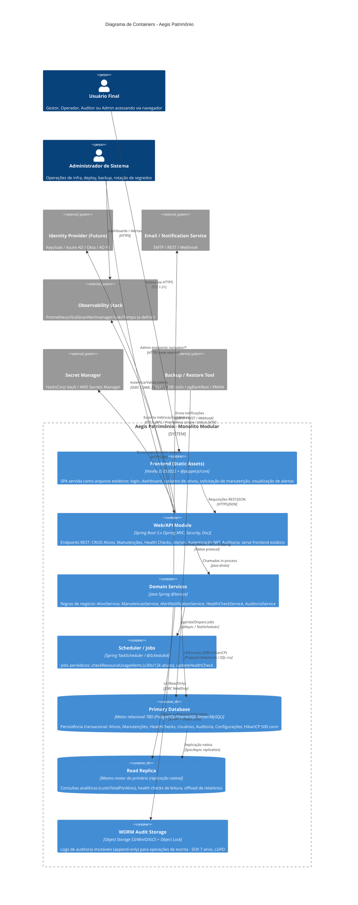
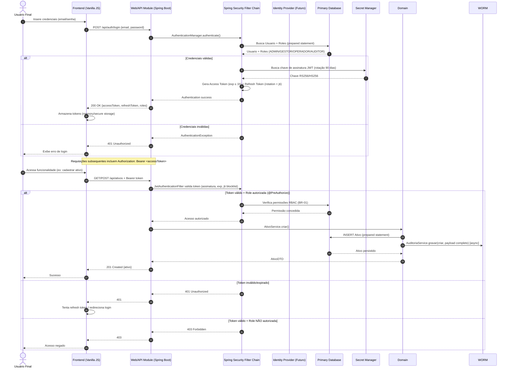
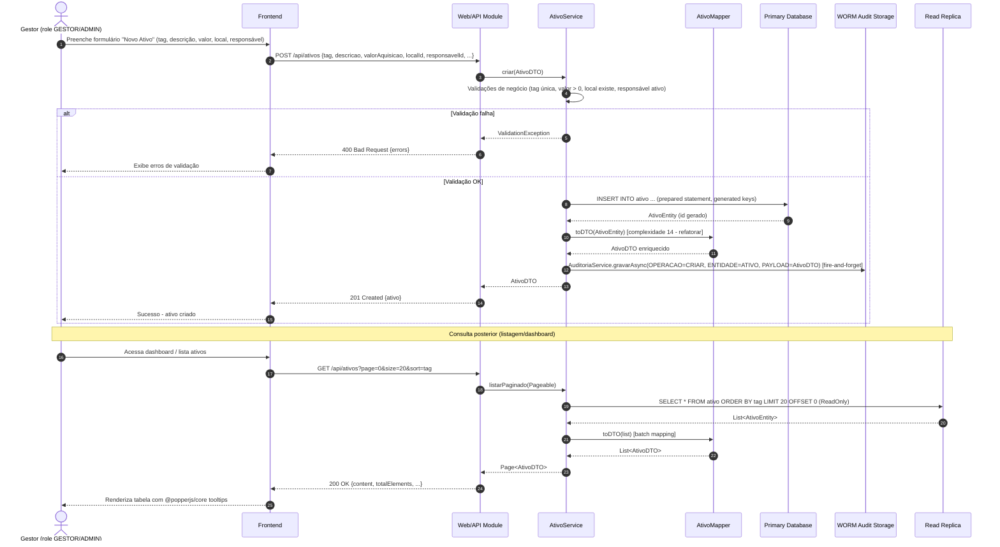
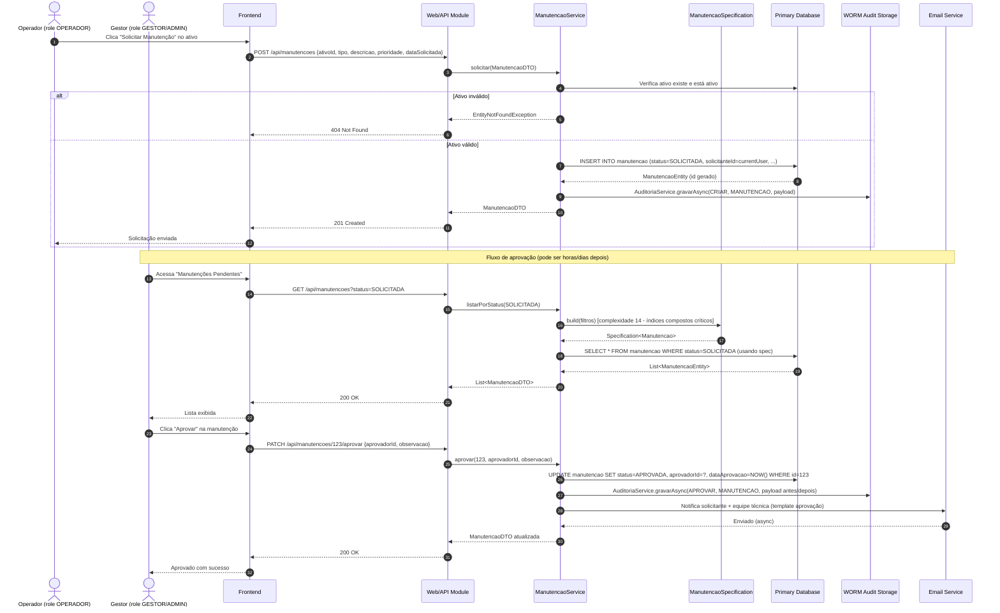
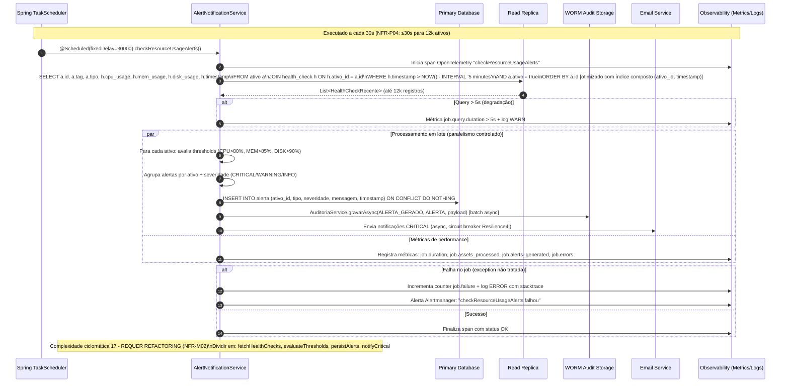
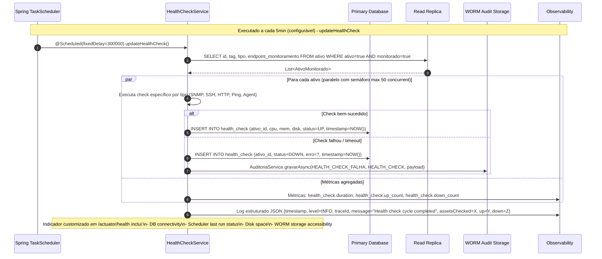
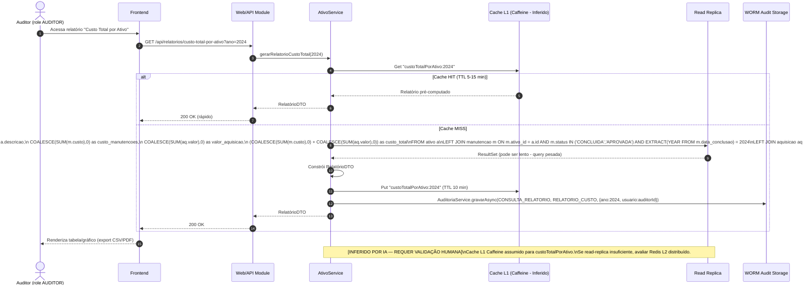
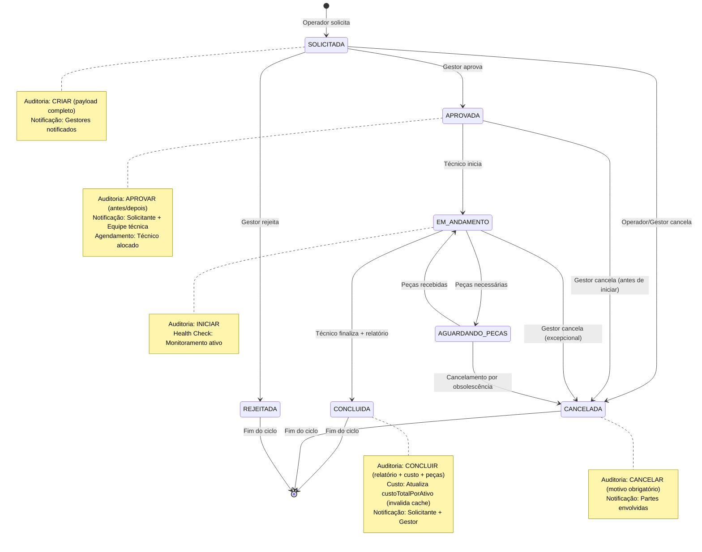

# UML & C4 Diagrams (Diagram as Code) — Aegis Patrimônio

> **Versão:** 1.0 · **Owner:** Arquitetura/Eng Lead · **Status:** Draft
> Este artefato segue a abordagem **Diagram as Code (DaC)**: os diagramas são texto versionado (Mermaid), nunca imagens estáticas coladas aqui. Toda alteração de arquitetura relevante deve atualizar este arquivo no mesmo PR que altera o código.

<!-- source: system-architecture.md#L1-L50 -->

## 1. Diagrama de Containers (C4 Model — Nível 2)



<!-- source: system-architecture.md#L51-L150 -->

## 2. Diagramas de Sequência (Fluxos Críticos)

### 2.1 Autenticação e Autorização (JWT + RBAC)



<!-- source: system-architecture.md#L151-L250; NFR-SEC02, BR-01 -->

### 2.2 Cadastro e Gestão de Ativo Patrimonial



<!-- source: system-architecture.md#L251-L350; AtivoMapper.toDTO complexity 14 -->

### 2.3 Solicitação e Aprovação de Manutenção



<!-- source: system-architecture.md#L351-L450; ManutencaoSpecification.build complexity 14 -->

### 2.4 Job Crítico: Verificação de Alertas de Recursos (checkResourceUsageAlerts)



<!-- source: system-architecture.md#L451-L550; AlertNotificationService.checkResourceUsageAlerts complexity 17, NFR-P04 -->

### 2.5 Health Check de Ativo e Atualização Periódica



<!-- source: system-architecture.md#L551-L650; NFR-O02 -->

### 2.6 Consulta Analítica: Custo Total por Ativo (Read Replica Offload)



<!-- source: system-architecture.md#L651-L750; NFR-S01, cache strategy inferred -->

## 3. Diagrama de Componentes (Visão Estática - Módulos Internos do Monolito)

```mermaid
graph TD
    subgraph "Presentation Layer"
        REST[REST Controllers\n@Valid + @PreAuthorize]
        Static[Static Resource Handler\n/frontend/**]
        Actuator[Actuator Endpoints\n/actuator/health, /actuator/prometheus]
    end

    subgraph "Security Layer"
        FilterChain[SecurityFilterChain\nJWT + RBAC]
        AuthMgr[AuthenticationManager]
        JwtUtil[JwtTokenProvider\nRS256/HS256 + jti blocklist]
    end

    subgraph "Application Services (Domain Layer)"
        AtivoSvc[AtivoService\nCRUD + validações]
        ManutSvc[ManutencaoService\nWorkflow: SOLICITADA→APROVADA→EM_ANDAMENTO→CONCLUIDA/CANCELADA]
        AlertSvc[AlertNotificationService\ncheckResourceUsageAlerts (refatorar)]
        HealthSvc[HealthCheckService\nupdateHealthCheck + custom indicators]
        AuditSvc[AuditoriaService\nAsync WORM write + LGPD anonymization]
        ConfigSvc[ConfiguracaoService\nCacheable lookups]
    end

    subgraph "Data Access Layer"
        AtivoRepo[AtivoRepository\nJpaRepository + @Query natives]
        ManutRepo[ManutencaoRepository\n+ ManutencaoSpecification]
        HealthRepo[HealthCheckRepository]
        UserRepo[UsuarioRepository\n+ Role/Permission queries]
        AuditRepo[AuditoriaLogRepository\nWrite-only to WORM]
        JdbcTpl[JdbcTemplate\nRaw SQL otimizado para relatórios]
    end

    subgraph "Mappers / Specifications"
        AtivoMap[AtivoMapper.toDTO\n(complexidade 14 - refatorar)]
        ManutSpec[ManutencaoSpecification.build\n(complexidade 14 - índices compostos)]
    end

    subgraph "Scheduler / Async"
        TaskScheduler[TaskScheduler\nThreadPool: web, scheduler, audit]
        AsyncExec[@Async Executors\nIsolamento bulkhead]
    end

    subgraph "External Integrations (Outbound)"
        IdPClient[IdP Client\nOIDC/SAML/LDAP]
        EmailClient[Email/Notification Client\nSMTP/REST + CircuitBreaker]
        WormClient[WORM S3 Client\nObject Lock + Retry/Backoff]
        ObsClient[OpenTelemetry SDK\nOTLP gRPC Exporter]
        VaultClient[Vault/Secrets Client\nRotation 90 dias]
    end

    REST --> FilterChain
    FilterChain --> AuthMgr
    AuthMgr --> JwtUtil
    JwtUtil --> VaultClient
    REST --> AtivoSvc
    REST --> ManutSvc
    REST --> AlertSvc
    REST --> HealthSvc
    REST --> AuditSvc
    Static --> Actuator
    AtivoSvc --> AtivoRepo
    AtivoSvc --> AtivoMap
    ManutSvc --> ManutRepo
    ManutSvc --> ManutSpec
    HealthSvc --> HealthRepo
    AuditSvc --> AuditRepo
    AuditSvc --> WormClient
    AtivoSvc --> JdbcTpl
    ManutSvc --> JdbcTpl
    AlertSvc --> TaskScheduler
    HealthSvc --> TaskScheduler
    TaskScheduler --> AsyncExec
    AtivoSvc --> ConfigSvc
    ManutSvc --> EmailClient
    AlertSvc --> EmailClient
    FilterChain --> IdPClient
    REST --> ObsClient
    AtivoSvc --> ObsClient
    ManutSvc --> ObsClient
```

<!-- source: system-architecture.md#L751-L850; diagnostic AST classes -->

## 4. Diagrama de Casos de Uso / Atividade (Fluxos de Negócio Principais)

```mermaid
flowchart TD
    Start([Início: Usuário autenticado]) --> Role{Role do Usuário}
    
    Role -->|ADMIN| AdminFlow[Gestão Completa\n- Usuários/Roles\n- Configurações sistema\n- Auditoria completa\n- Rotação segredos]
    Role -->|AUDITOR| AuditorFlow[Acesso Leitura + Relatórios\n- Dashboard executivo\n- Custo total por ativo\n- Trilha auditoria imutável\n- Export SOX/LGPD]
    Role -->|GESTOR| GestorFlow[Gestão Patrimonial\n- CRUD Ativos\n- Aprovar/Rejeitar Manutenções\n- Dashboards operacionais\n- Alertas críticos]
    Role -->|OPERADOR| OperadorFlow[Operação Diária\n- Solicitar Manutenção\n- Acompanhar próprias solicitações\n- Visualizar Health Checks\n- Receber Alertas]
    
    AdminFlow --> AuditLog[AuditoriaService.gravarAsync\nTodas operações escrita\nWORM Storage]
    AuditorFlow --> AuditLog
    GestorFlow --> AuditLog
    OperadorFlow --> AuditLog
    
    GestorFlow --> AtivoCRUD[(Ativo: Create/Read/Update/Delete)]
    GestorFlow --> ManutAprov[Manutenção: Aprovar/Rejeitar]
    OperadorFlow --> ManutSolic[Manutenção: Solicitar]
    OperadorFlow --> ManutAcomp[Manutenção: Acompanhar]
    
    AtivoCRUD --> DB[(Primary DB)]
    ManutAprov --> DB
    ManutSolic --> DB
    ManutAcomp --> Replica[(Read Replica)]
    
    Scheduler((Scheduler\n@Scheduled)) --> AlertJob[checkResourceUsageAlerts\n≤30s / 12k ativos]
    Scheduler --> HealthJob[updateHealthCheck\nA cada 5 min]
    
    AlertJob --> Replica
    AlertJob --> DB
    AlertJob --> WORM[(WORM Audit)]
    AlertJob --> Email[Email/Notification]
    
    HealthJob --> Replica
    HealthJob --> DB
    HealthJob --> WORM
    
    DB --> Replica[Replicação Nativa]
    DB --> Backup[Backup Diário + WAL\nRPO ≤ 24h / RTO ≤ 4h]
    
    AuditLog --> WORM
    WORM --> Compliance[SOX 7 anos / LGPD\nImutabilidade verificada]
    
    subgraph "Observabilidade Transversal"
        Obs[OpenTelemetry Java Agent\nLogs JSON + Métricas Prometheus + Traces OTLP]
        Alerting[Alertmanager\nP0: Latência p95>500ms, Erro>0.1%, Job falha, CPU>80%, Heap>85%, Disco>85%, Replica lag>60s]
    end
    
    REST[REST Controllers] --> Obs
    AtivoSvc[AtivoService] --> Obs
    ManutSvc[ManutencaoService] --> Obs
    AlertSvc[AlertNotificationService] --> Obs
    HealthSvc[HealthCheckService] --> Obs
    Scheduler --> Obs
    
    Alerting --> Pager[PagerDuty/Slack/Email\nOn-call rotation]
```

<!-- source: system-architecture.md#L851-L950; BRD roles, NFR-O04 -->

## 5. Diagrama de Estado: Ciclo de Vida de Manutenção



<!-- source: system-architecture.md#L951-L1050; ManutencaoService workflow -->

## 6. Convenções de Manutenção

- **Fonte única da verdade:** este arquivo é gerado/atualizado pelo próprio fluxo de documentação — não editar diagramas fora deste artefato.
- **Sem binários:** nunca anexar `.png`/`.jpg`/`.drawio`; o diagrama é sempre o bloco Mermaid acima.
- **Atualização obrigatória:** qualquer PR que altere fluxos entre serviços, contratos de API ou topologia de containers deve atualizar a seção correspondente aqui.
- **Rastreabilidade:** cada diagrama referencia a seção do `system-architecture.md` de onde foi derivado via comentários `<!-- source: ... -->`.
- **Inferências marcadas:** todo elemento não explicitamente no código ou SAD carrega `[INFERIDO POR IA — REQUER VALIDAÇÃO HUMANA]` com premissas documentadas.
- **Versionamento:** diagramas evoluem com o código; breaking changes na arquitetura exigem ADR correspondente.
- **Validação CI:** pipeline deve validar sintaxe Mermaid (`mermaid-cli` ou similar) em todo PR que toque este arquivo.