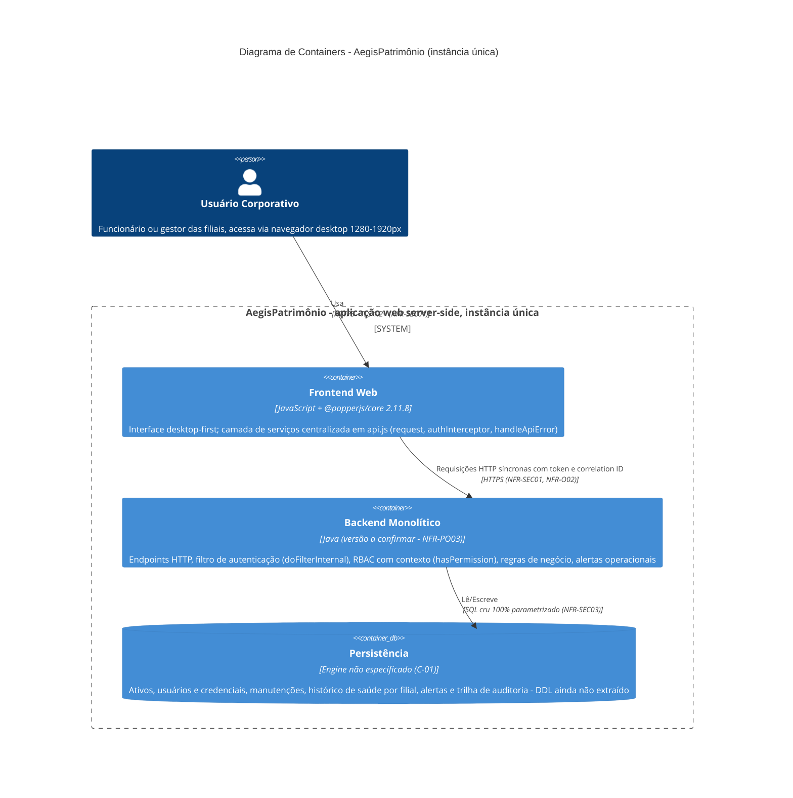
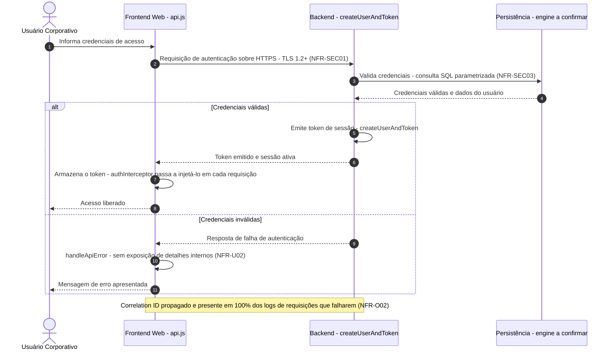
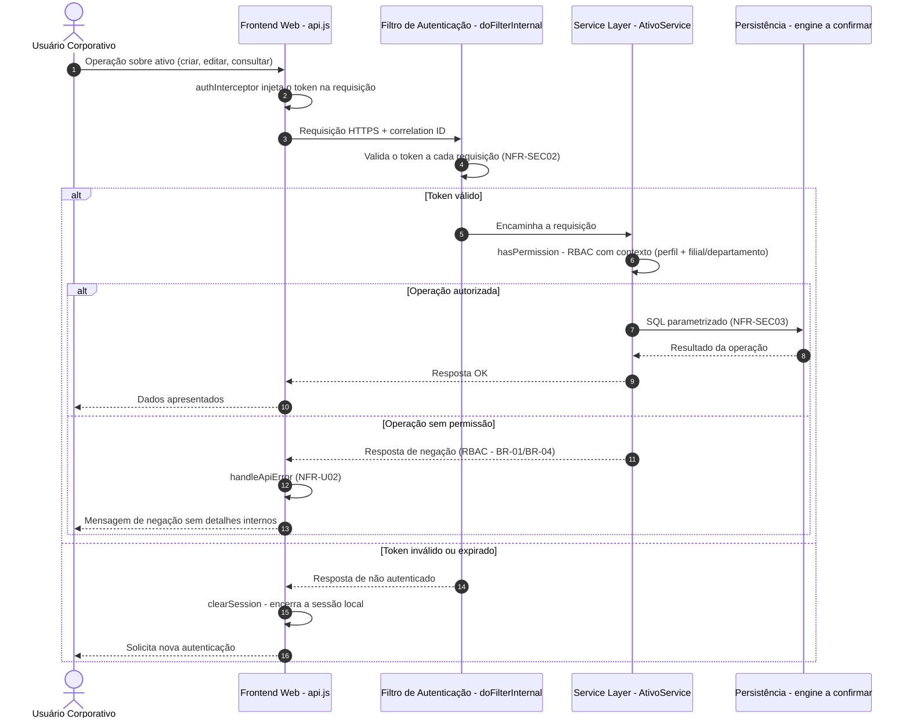
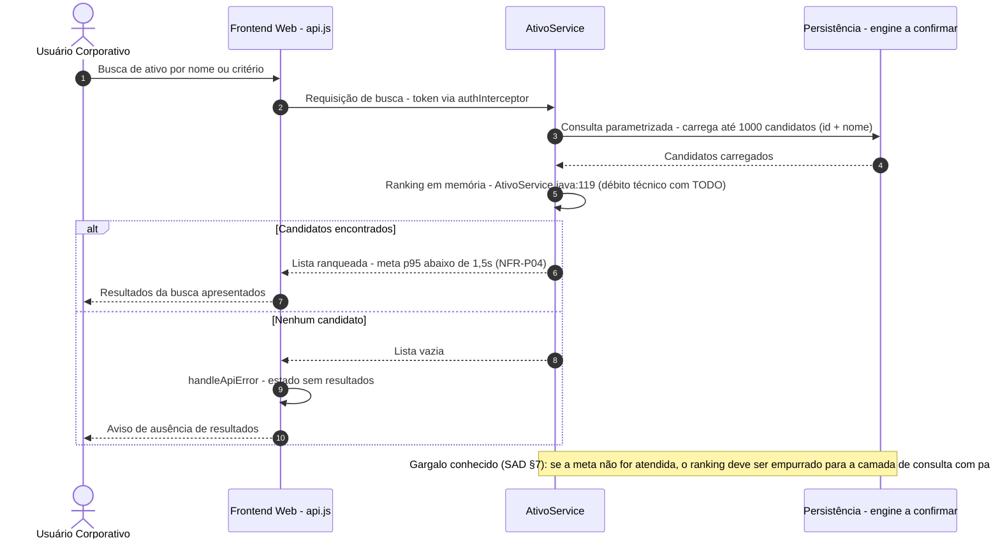
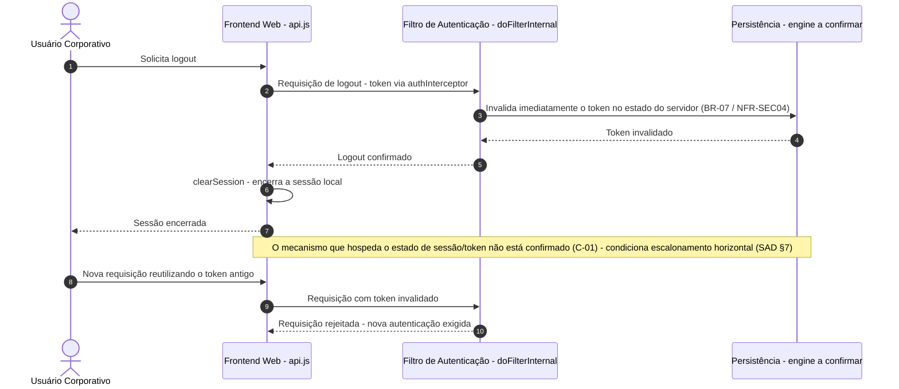
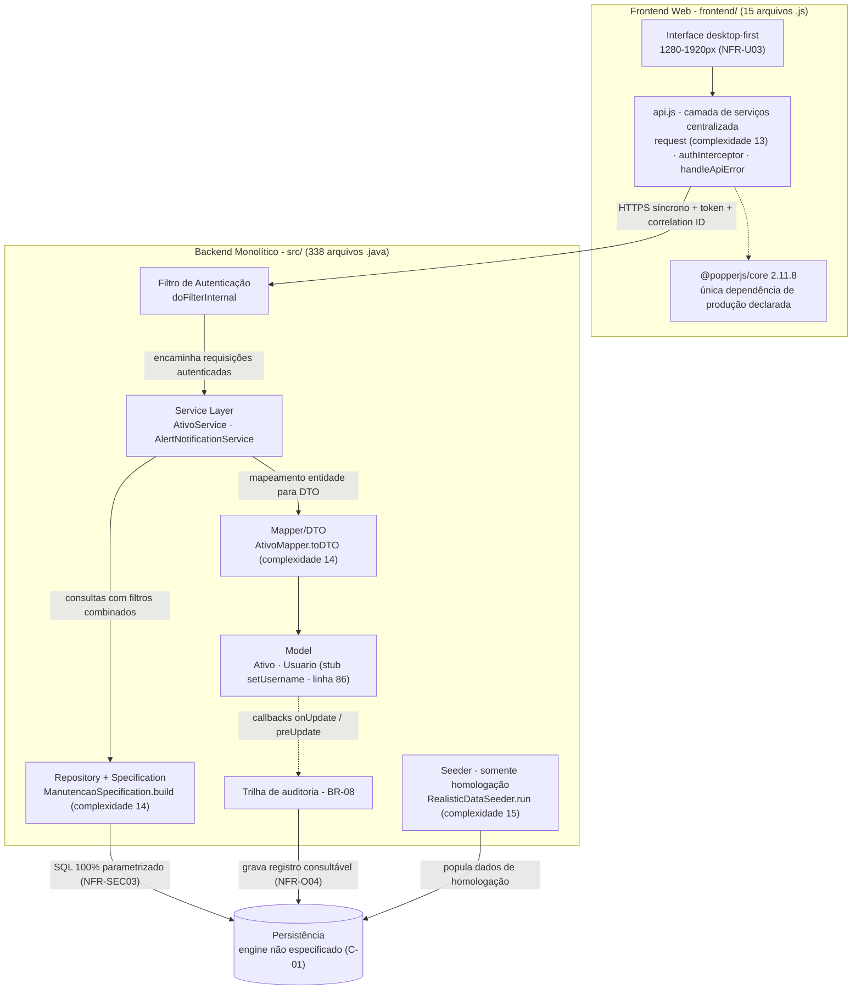
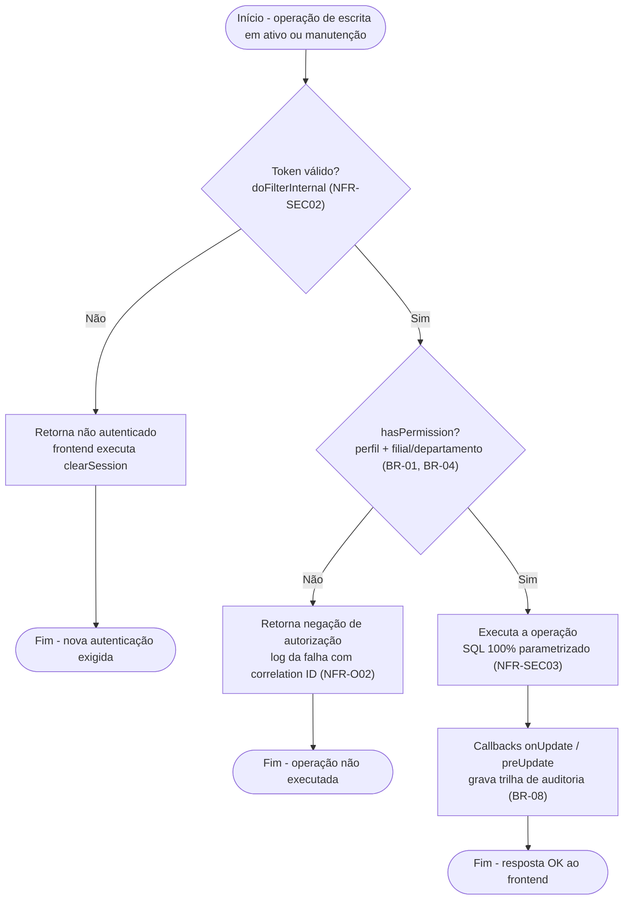
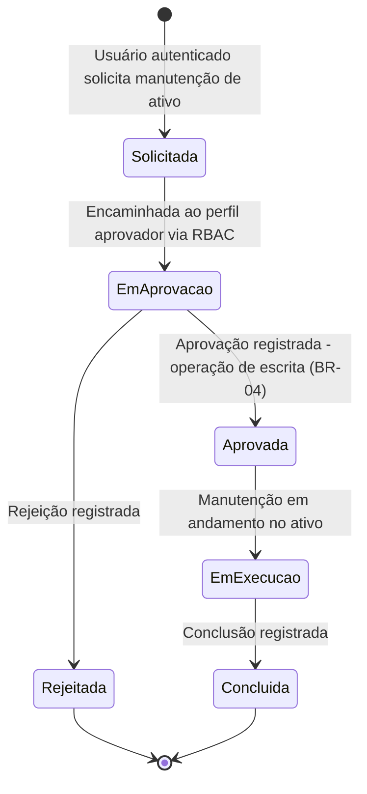

# UML & C4 Diagrams (Diagram as Code) — AegisPatrimônio

> **Versão:** 1.0 · **Owner:** Arquitetura/Eng Lead · **Status:** Draft
> Este artefato segue a abordagem **Diagram as Code (DaC)**: os diagramas são texto versionado (Mermaid), nunca imagens estáticas coladas aqui. Toda alteração de arquitetura relevante deve atualizar este arquivo no mesmo PR que altera o código.
> **Artefatos relacionados:** [[system-architecture]] (SAD v1.0 — fonte primária deste documento), [[db-schema-spec]] (pendente — nenhuma tabela extraída), [[api-specification]] (pendente — NFR-M03).

> **Base de evidência e limitações deste documento:**
> - Diagramas derivados do [[system-architecture]] e da varredura determinística do codebase (353 arquivos, ~27.912 LOC — 338 `.java` em `src/`, 15 `.js` em `frontend/`).
> - **Nenhuma rota/endpoint HTTP foi catalogada no código** (NFR-M03). Os diagramas de sequência modelam **fluxos lógicos** evidenciados pelos NFRs e por nomes reais de classes/funções (`createUserAndToken`, `doFilterInternal`, `getHealthHistory`, `checkResourceUsageAlerts`, `ManutencaoSpecification`), **não caminhos de URL verificados**.
> - **Nenhuma tabela foi detectada no schema** — o conteúdo da persistência é descrito pelas entidades evidenciadas em código, não por DDL confirmado.
> - **Motor de persistência não especificado** (C-01 do BRD) — o container de persistência é modelado de forma genérica até a confirmação.

---

## 1. Diagrama de Containers (C4 Model — Nível 2)

O AegisPatrimônio é uma aplicação web server-side de **instância única**, composta por três containers: o **Frontend Web** (JavaScript, com camada de serviços centralizada em `api.js`), o **Backend Monolítico** (Java, que concentra endpoints HTTP, autenticação, autorização RBAC e regras de negócio) e a **Persistência** (engine não especificado — C-01). **Não existe API Gateway distinto nem balanceador**: o monólito concentra as responsabilidades de API na instância única (SAD §3/§11). **Nenhum sistema externo é modelado** — nenhuma integração externa (pagamento, e-mail, ERPs etc.) foi detectada no código (SAD §6).

| Container | Tecnologia | Responsabilidade |
| :--- | :--- | :--- |
| Frontend Web | JavaScript + `@popperjs/core 2.11.8` (única dependência de produção) | Interface desktop-first (1280–1920px — NFR-U03); camada de serviços (`request`, `authInterceptor`, `handleApiError`) |
| Backend Monolítico | Java (versão a confirmar — NFR-PO03) | Endpoints HTTP, filtro de autenticação (`doFilterInternal`), RBAC com contexto (`hasPermission`), regras de negócio, alertas operacionais |
| Persistência | Engine não especificado (C-01) | Ativos, usuários/credenciais, manutenções, histórico de saúde por filial, alertas e trilha de auditoria — DDL ainda não extraído |



> **Notas do diagrama:**
> - Topologia **deliberadamente de instância única** — sem load balancer, sem réplicas, sem múltiplas AZs/regiões (NFR-S02, NFR-A04, NFR-PO02). O SPOF resultante é aceito e documentado (SAD §8).
> - O `RealisticDataSeeder` (população de dados de homologação) **não aparece na visão de produção**; está modelado no diagrama de componentes (Seção 3).
> - [INFERIDO POR IA — REQUER VALIDAÇÃO HUMANA] *Premissa: o mecanismo que serve os assets do frontend ao navegador não é descobrível a partir dos fontes (SAD §11); o diagrama assume a interação direta navegador → frontend → backend, sem modelar o servidor de assets. Confirmar antes do go-live.*

---

## 2. Diagramas de Sequência (Fluxos Críticos)

> Os fluxos abaixo derivam do SAD (§3, §6, §7, §9, §10) e dos NFRs. Como o catálogo de endpoints não foi instrumentado (NFR-M03), os participantes representam **componentes lógicos reais** (classes/funções verificadas), e as mensagens descrevem intenções, não rotas HTTP.

### 2.1 Autenticação — Login e emissão de token



### 2.2 Requisição autenticada — autorização RBAC e CRUD de ativos



> A leitura do **histórico de saúde por filial** (`getHealthHistory`) segue o mesmo fluxo da Seção 2.2, com escopo de leitura restrito à filial do usuário autenticado (BR-03).

### 2.3 Busca e ranking de ativos



### 2.4 Fluxo de manutenção com aprovação

> [INFERIDO POR IA — REQUER VALIDAÇÃO HUMANA]
> *O "fluxo de manutenção com aprovação" é evidenciado como funcionalidade (BRD §2 via SAD §1) e a consulta filtrada por `ManutencaoSpecification` é código real, mas a decomposição passo a passo do workflow (solicitante, aprovador, estados intermediários) **não está catalogada nos artefatos-fonte**. Premissas adotadas: (i) a solicitação é registrada por usuário autenticado; (ii) a aprovação é operação de escrita coberta pelo RBAC (BR-01/BR-04 — 100% das operações de escrita); (iii) a listagem de manutenções usa filtros combinados via `ManutencaoSpecification` (meta p95 abaixo de 1s — NFR-P02).*

```mermaid
sequenceDiagram
    autonumber
    actor Usuario as Usuário solicitante
    participant FE as Frontend Web - api.js
    participant SVC as Service Layer - manutenções
    participant SPEC as ManutencaoSpecification
    participant DB as Persistência - engine a confirmar

    Usuario->>FE: Solicita manutenção para um ativo
    FE->>SVC: Requisição de criação - token via authInterceptor
    SVC->>SVC: hasPermission - RBAC (operação de escrita - BR-01)
    SVC->>DB: Registra a solicitação (SQL parametrizado)
    DB-->>SVC: Solicitação registrada
    SVC-->>FE: Confirmação ao solicitante
    Note over SVC,DB: Etapa de aprovação - fluxo evidenciado no BRD §2; estados exatos não catalogados nos fontes
    Usuario->>FE: Perfil aprovador avalia a solicitação
    FE->>SVC: Requisição de aprovação ou rejeição
    SVC->>SVC: hasPermission - RBAC (operação de escrita - BR-04)
    alt Aprovada
        SVC->>DB: Grava a aprovação e atualiza o vínculo ativo-manutenção
        DB-->>SVC: Confirmação
        SVC-->>FE: Manutenção aprovada
        FE-->>Usuario: Status atualizado
    else Rejeitada
        SVC->>DB: Grava a rejeição
        DB-->>SVC: Confirmação
        SVC-->>FE: Manutenção rejeitada
        FE-->>Usuario: Status atualizado
    end
    Usuario->>FE: Consulta manutenções com filtros
    FE->>SPEC: Requisição de listagem filtrada
    SPEC->>DB: Consulta com filtros combinados - meta p95 abaixo de 1s (NFR-P02)
    DB-->>SPEC: Resultado
    SPEC-->>FE: Lista de manutenções
    FE-->>Usuario: Resultados apresentados
```

### 2.5 Logout com invalidação imediata de token



### 2.6 Verificação de alertas operacionais

> [INFERIDO POR IA — REQUER VALIDAÇÃO HUMANA]
> *A existência de `AlertNotificationService.checkResourceUsageAlerts` (verificação de saturação de recursos) é código real confirmado pela varredura, mas o **mecanismo de disparo** (agendamento periódico, invocação manual, etc.) não está evidenciado nos fontes. Premissa: verificação interna e periódica dentro da instância única, sem broker/fila — nenhum mecanismo de mensageria foi identificado no projeto.*

```mermaid
sequenceDiagram
    autonumber
    participant TRG as Gatilho interno - mecanismo a confirmar
    participant ANS as AlertNotificationService
    participant DB as Persistência - engine a confirmar

    TRG->>ANS: Dispara a verificação de uso de recursos
    ANS->>ANS: checkResourceUsageAlerts - avalia saturação de recursos (complexidade 17 - refatorar, NFR-M02)
    alt Uso dentro dos limites
        ANS-->>TRG: Nenhum alerta a emitir
    else Saturação de recursos detectada
        ANS->>DB: Registra o alerta operacional
        DB-->>ANS: Alerta registrado
        ANS-->>TRG: Alerta emitido
    end
    Note over ANS: Base atual de alertas internos (SAD §10); alertas de latência p95 e taxa de erro acima de 1% compõem a arquitetura-alvo (NFR-O03)
```

---

## 3. Diagrama de Componentes (visão estática, opcional)

Resolve a ambiguidade estrutural que a visão de containers não exibe: o **arranjo em camadas do monólito** (model → repository/specification → mapper → service), os callbacks de auditoria, o seeder restrito a homologação e a camada de serviços do frontend. As anotações de complexidade ciclomática vêm da varredura determinística (limite do NFR-M01: 10).



> **Notas:** não existem filas, caches distribuídos, barramentos de eventos nem comunicação assíncrona entre componentes — todo o fluxo é síncrono via HTTP (frontend↔backend) e chamadas em processo (backend↔persistência). Padrões como CQRS, Event Sourcing e Circuit Breaker não estão aplicados no codebase (SAD §4).

---

## 4. Diagrama de Casos de Uso / Atividade (opcional)

### 4.1 Fluxo de atividade — operação de escrita com RBAC e auditoria

Fluxo lógico evidenciado pelos controles de segurança: token validado a cada requisição, RBAC com contexto cobrindo 100% das operações de escrita (BR-01/BR-04) e trilha de auditoria via callbacks (BR-08).



### 4.2 Máquina de estados — ciclo de vida da manutenção

> [INFERIDO POR IA — REQUER VALIDAÇÃO HUMANA]
> *Os estados abaixo são **inferidos** a partir da funcionalidade evidenciada "fluxo de manutenção com aprovação" (BRD §2 via SAD §1); os estados exatos e transições reais **não estão catalogados nos fontes** nem nos artefatos de máquina de estados. Premissas: (i) a aprovação é etapa obrigatória antes da execução; (ii) a rejeição encerra o ciclo; (iii) manutenções concluídas permanecem consultáveis via filtros combinados (`ManutencaoSpecification` — NFR-P02). Validar contra a implementação real antes de usar como referência.*



---

## 5. Convenções de Manutenção

- **Fonte única da verdade:** este arquivo concentra os diagramas C4, de sequência, de componentes e de atividade do AegisPatrimônio — é o artefato referenciado como [[uml-diagrams]] pelo [[system-architecture]] (SAD §3). Não duplicar diagramas em outros artefatos; referencie este arquivo.
- **Sem binários:** nunca anexar `.png`/`.jpg`/`.drawio`; o diagrama é sempre o bloco Mermaid versionado acima.
- **Atualização obrigatória:** qualquer PR que altere fluxos entre frontend e backend, contratos de comunicação, topologia de containers, modelo de dados ou mecanismos de alerta deve atualizar a seção correspondente aqui no mesmo PR.
- **Rastreabilidade de inferências:** todo elemento não verificado no código mantém o rótulo `[INFERIDO POR IA — REQUER VALIDAÇÃO HUMANA]` com as premissas declaradas no texto da seção. Ao confirmar o elemento na implementação, remover o rótulo e atualizar o diagrama.
- **Pendências que forçam revisão deste artefato:**
  1. **Confirmação do motor de persistência (C-01 do BRD)** — atualizar o container de persistência (Seção 1 e 3) e as notas sobre estado de sessão/token (Seção 2.5);
  2. **Catalogação de endpoints (NFR-M03)** — substituir os fluxos lógicos das Seções 2.1–2.5 por rotas HTTP reais, em conjunto com a [[api-specification]];
  3. **Extração do schema físico ([[db-schema-spec]])** — detalhar o conteúdo do container de persistência com tabelas e relacionamentos confirmados;
  4. **Refatorações de complexidade (NFR-M02)** — atualizar as anotações de complexidade ciclomática no diagrama de componentes (Seção 3) após intervenção nos 5 pontos acima do limite;
  5. **Confirmação do mecanismo de servir o frontend e do disparo dos alertas** — remover as notas `[INFERIDO POR IA]` das Seções 1 e 2.6.