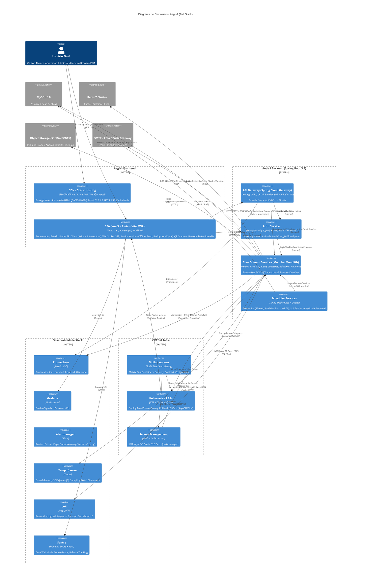
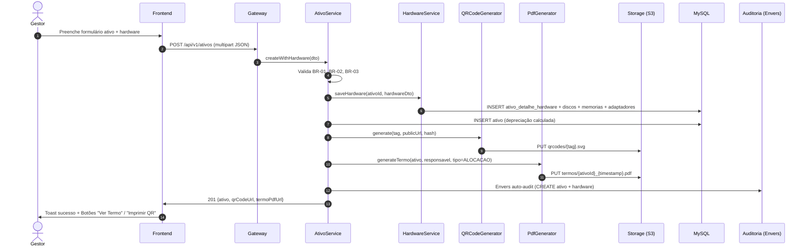
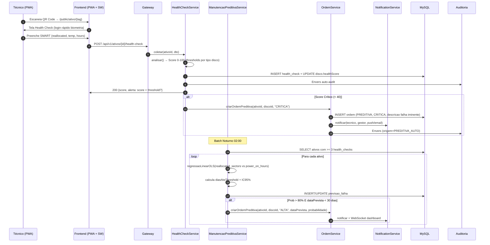
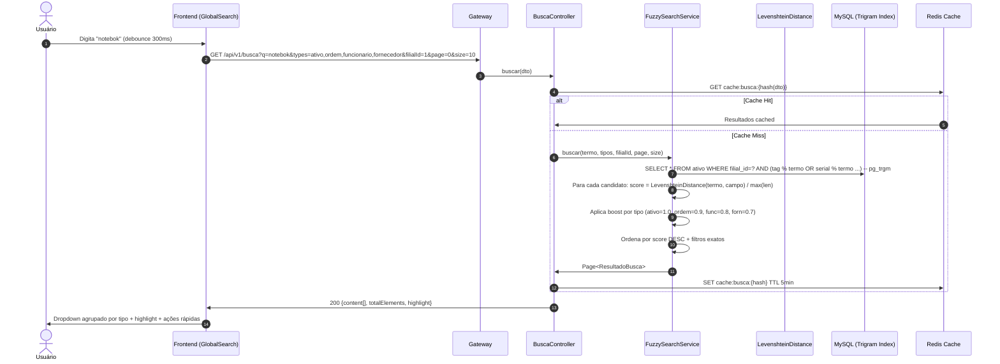
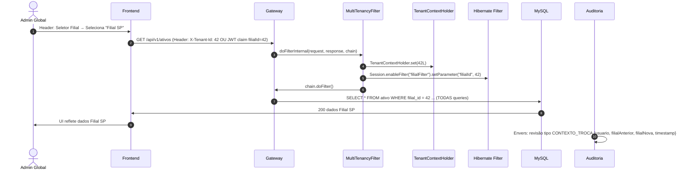
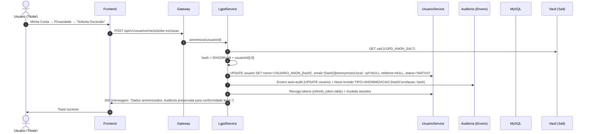
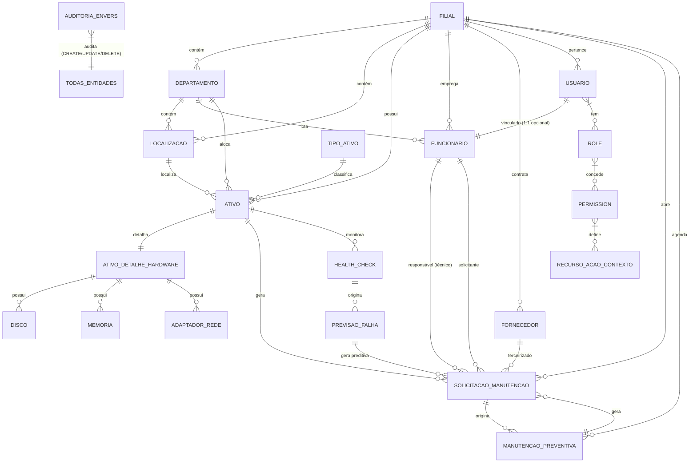

# UML & C4 Diagrams (Diagram as Code) — Aegis1

> **Versão:** 2.0 · **Owner:** Arquitetura/Eng Lead · **Status:** Draft
> **Base:** System Architecture v2.0 + State Machines v2.0 + Domain Model (AST Java)
> **Abordagem:** Diagram as Code (DaC) — Mermaid versionado, nunca imagens estáticas
> **Cobertura:** Full Stack — Backend (Java/Spring) + Frontend (Vue/PWA) + Infra (K8s/Docker)

---

## 1. C4 Level 1 — System Context (Já em System Architecture §3)

```mermaid
graph TB
    subgraph "Usuários"
        U1[Gestor Patrimônio/Manutenção]
        U2[Técnico Campo (PWA Mobile)]
        U3[Aprovador/Supervisor]
        U4[Admin Cadastros (Filial)]
        U5[Admin Global]
        U6[Auditor/Compliance/DPO]
    end

    subgraph "Frontend (Vue 3 PWA)"
        FE[SPA + Service Worker\nCDN/Static Hosting\nTLS 1.3 + HSTS + CSP]
    end

    subgraph "Backend (Spring Boot 3.3)"
        API[API REST /api/v1\nOpenAPI 3.1]
        AUTH[Auth Server\nJWT RS256 + Refresh]
        DOMAIN[Domain Services\nAtivos, Ordens, Preventiva, Preditiva, Busca, Auditoria]
        SEC[Aegis Shield\nRBAC + Multi-tenancy]
        SCHED[Schedulers\nPreventiva 15min\nPreditiva 02:00\nSLA Diário]
    end

    subgraph "Data Layer"
        DB[(MySQL 8.0\nPrimary + Read Replicas)]
        REDIS[(Redis Cluster\nCache + Session)]
        STORAGE[(Object Storage\nPDFs, QR Codes, Anexos)]
    end

    subgraph "Observabilidade"
        PROM[Prometheus\nMetrics]
        GRAF[Grafana\nDashboards]
        ALERT[Alertmanager\nAlerts]
        TEMPO[Tempo/Jaeger\nTraces]
        LOKI[Loki\nLogs JSON]
        SENTRY[Sentry\nFrontend Errors]
    end

    subgraph "CI/CD & Infra"
        GH[GitHub Actions\nBuild, Test, Scan, Deploy]
        K8S[Kubernetes 1.28+\nHPA, PDB, NetPol]
        VAULT[Secrets\nVault/SealedSecrets]
    end

    U1 --> FE
    U2 --> FE
    U3 --> FE
    U4 --> FE
    U5 --> FE
    U6 --> FE

    FE -->|HTTPS/REST + WebSocket| API
    FE -->|HTTPS| AUTH

    API --> DOMAIN
    API --> SEC
    AUTH --> SEC
    DOMAIN --> DB
    DOMAIN --> REDIS
    DOMAIN --> STORAGE
    SCHED --> DOMAIN

    API --> PROM
    DOMAIN --> PROM
    SCHED --> PROM
    FE --> SENTRY
    FE -->|RUM| GRAF

    PROM --> ALERT
    PROM --> GRAF
    API --> TEMPO
    DOMAIN --> TEMPO
    API --> LOKI
    DOMAIN --> LOKI

    GH --> K8S
    GH --> VAULT
    K8S --> API
    K8S --> FE
```

---

## 2. C4 Level 2 — Container Diagram (Full Stack)



---

## 3. C4 Level 3 — Component Diagram (Backend Modules)

```mermaid
graph TB
    subgraph "aegis1-backend (Modular Monolith)"
        direction TB
        
        subgraph "config"
            SEC_CONFIG[SecurityConfig\nFilterChain, CORS, CSRF, MethodSecurity]
            AUDIT_CONFIG[AuditoriaConfig\nEnvers RevisionListener]
            MP_CONFIG[MultiTenancyConfig\nHibernate Filter, TenantContextHolder]
            SCHED_CONFIG[SchedulerConfig\nTaskExecutor, Quartz]
            OPEN_API[OpenApiConfig\nSpringDoc, Groups, SecuritySchemes]
        end
        
        subgraph "security"
            JWT_PROV[JwtTokenProvider\nRS256 Generate/Validate]
            AEGIS[AegisShieldPermissionEvaluator\nRBAC Granular + Contexto]
            MT_FILTER[MultiTenancyFilter\nTenantId → Hibernate Filter]
            RATE_LIMIT[RateLimitFilter\nGateway/Filter]
        end
        
        subgraph "domain/ativo"
            ATIVO_SVC[AtivoService\nCRUD, Depreciação, Transferência, Baixa, TCO]
            ATIVO_CTRL[AtivoController\nREST /api/v1/ativos]
            HW_SVC[HardwareService\nDiscos, Memória, Rede CRUD]
            HW_CTRL[HardwareController\nSub-recursos]
            QR_GEN[QRCodeGenerator\nZXing SVG/PNG]
            PDF_GEN[PdfGenerator\nFlyingSaucer Thymeleaf]
        end
        
        subgraph "domain/ordem"
            ORDEM_SVC[SolicitacaoManutencaoService\nCRUD, State Machine, Custos, Evidências]
            ORDEM_CTRL[OrdemController\nREST /api/v1/ordens]
            SLA_SVC[SlaSchedulerService\nDaily Job, Escalation]
        end
        
        subgraph "domain/preventiva"
            PREV_SVC[ManutencaoPreventivaService\nPlanos CRON, Geração Auto]
            PREV_CTRL[PreventivaController\nREST /api/v1/preventivas]
            PREV_SCHED[PreventivaScheduler\n@Scheduled 15min]
        end
        
        subgraph "domain/preditiva"
            PRED_SVC[ManutencaoPreditivaService\nRegressão Linear OLS, Previsão Falha]
            HEALTH_SVC[HealthCheckService\nSMART Analysis, Score 0-100]
            HEALTH_CTRL[HealthCheckController\nREST /api/v1/health-check]
            PRED_SCHED[PreditivaScheduler\n@Scheduled 02:00]
        end
        
        subgraph "domain/busca"
            FUZZY_SVC[FuzzySearchService\nLevenshtein, Boost, Filtros]
            LEVENSHTEIN[LevenshteinDistance\nAlgoritmo Otimizado]
            BUSCA_CTRL[BuscaController\nREST /api/v1/busca]
        end
        
        subgraph "domain/cadastro"
            FILIAL_SVC[FilialService]
            DEPTO_SVC[DepartamentoService]
            FORN_SVC[FornecedorService]
            FUNC_SVC[FuncionarioService + UsuarioProvisioning]
            TIPO_SVC[TipoAtivoService]
            CAD_CTRL[CadastroController\nREST /api/v1/filiais, /departamentos, ...]
        end
        
        subgraph "domain/relatorio"
            REL_SVC[RelatorioService\nCustoTotal, Aderência, Compliance]
            REL_CTRL[RelatorioController\nREST /api/v1/relatorios]
        end
        
        subgraph "domain/auditoria"
            AUD_SVC[AuditoriaService\nEnvers Query, Diff, Export]
            AUD_CTRL[AuditoriaController\nREST /api/v1/auditoria]
        end
        
        subgraph "domain/seguranca"
            USER_SVC[UsuarioService\nProvisioning, Roles, Filial]
            ROLE_SVC[RoleService\nMatriz Permissions]
            PERM_SVC[PermissionService]
            ADMIN_CTRL[AdminController\nREST /api/v1/admin/*]
        end
        
        subgraph "domain/lgpd"
            LGPD_SVC[LgpdService\nAnonimização, Portabilidade, Consentimento]
            LGPD_CTRL[LgpdController\nREST /api/v1/lgpd]
        end
    end
    
    DB[(MySQL 8.0\nFlyway Migrations)]
    REDIS[(Redis\nCache, Rate Limit, Locks)]
    STORAGE[(S3/MinIO\nPDFs, QR, Anexos)]
    
    ATIVO_SVC --> DB
    HW_SVC --> DB
    QR_GEN --> STORAGE
    PDF_GEN --> STORAGE
    ORDEM_SVC --> DB
    SLA_SVC --> DB
    PREV_SVC --> DB
    PREV_SCHED --> PREV_SVC
    PRED_SVC --> DB
    HEALTH_SVC --> DB
    PRED_SCHED --> PRED_SVC
    FUZZY_SVC --> DB
    FUZZY_SVC --> REDIS
    LEVENSHTEIN --> FUZZY_SVC
    CAD_CTRL --> DB
    REL_SVC --> DB
    REL_SVC --> STORAGE
    AUD_SVC --> DB
    USER_SVC --> DB
    ROLE_SVC --> DB
    LGPD_SVC --> DB
    LGPD_SVC --> AUD_SVC
    
    SEC_CONFIG --> AEGIS
    SEC_CONFIG --> MT_FILTER
    SEC_CONFIG --> JWT_PROV
    AUDIT_CONFIG --> AUD_SVC
    MP_CONFIG --> MT_FILTER
```

---

## 4. Sequence Diagrams — Fluxos Críticos

### 4.1 Autenticação + Refresh Token Rotation

```mermaid
sequenceDiagram
    autonumber
    actor U as Usuário
    participant F as Frontend (Vue + Pinia)
    participant G as Gateway
    participant A as Auth Service
    participant B as Backend Services
    
    U->>F: Email + Senha
    F->>G: POST /api/v1/auth/login
    G->>A: Forward
    A->>A: AuthenticationManager.authenticate()
    A->>A: JwtTokenProvider.generateToken(usuario, roles, filialId)
    A->>F: 200 {accessToken (15min), refreshToken (HttpOnly Cookie 7d, SameSite=Strict)}
    F->>F: Pinia: accessToken (memória); Cookie: refreshToken
    Note over F: authInterceptor anexa Authorization: Bearer <accessToken> em TODAS requests
    
    F->>G: GET /api/v1/ativos (Bearer token)
    G->>B: Forward + Valida JWT (JwtAuthenticationFilter)
    B->>F: 200 dados
    
    Note over F,B: AccessToken expira (401)
    F->>G: POST /api/v1/auth/refresh (Cookie automático)
    G->>A: Forward
    A->>A: Valida refreshToken (assinatura + expiração + não revogado)
    A->>F: 200 {novo accessToken (15min), novo refreshToken (rotação)}
    F->>F: Atualiza Pinia + Cookie
    F->>G: Retry request original (1x only)
    G->>B: Forward
    B->>F: 200 dados
    
    Note over F: Falha refresh → Limpa Pinia + Cookie → Redirect /login
```

### 4.2 Criação Ativo + Hardware + QR Code + Termo PDF



### 4.3 Health Check Coleta + Previsão Falha + Ordem Preditiva Auto



### 4.4 Busca Global Fuzzy (Levenshtein + Trigram + Redis)



### 4.5 Multi-tenancy: Troca Contexto Filial (Admin Global)



### 4.6 LGPD: Anonimização + Auditoria Preservada



---

## 5. ER Diagram (Domain Model) — Mermaid



---

## 6. Deployment Diagram (Kubernetes)

```mermaid
graph TB
    subgraph "Internet"
        USER[Usuários\nBrowser/PWA]
    end
    
    subgraph "Cloud Provider (AWS/GCP/Azure)"
        subgraph "Edge / CDN"
            CF[CloudFront / Cloud CDN\nTLS 1.3 + HSTS + CSP\nWAF + Rate Limit]
        end
        
        subgraph "Kubernetes Cluster (EKS/GKE/AKS) v1.28+"
            subgraph "Ingress Namespace"
                NGINX[NGINX Ingress Controller\nTLS Termination\nRate Limit + CSP Headers]
            end
            
            subgraph "aegis1 Namespace"
                subgraph "Frontend Deployment"
                    FE1[Pod: aegis1-frontend\nNginx + Static Assets\nReplicas: 3\nResources: 64Mi/128Mi]
                    FE2[Pod: aegis1-frontend]
                    FE3[Pod: aegis1-frontend]
                end
                
                subgraph "Backend Deployment"
                    BE1[Pod: aegis1-backend\nSpring Boot 3.3 + Java 21\nReplicas: 3 (HPA 3-20)\nResources: 1Gi/2Gi CPU: 500m/1000m]
                    BE2[Pod: aegis1-backend]
                    BE3[Pod: aegis1-backend]
                end
                
                subgraph "Stateful Services"
                    REDIS_STS[Redis Cluster (StatefulSet)\n3 Masters + 3 Replicas\nPersistence: PVC]
                end
            end
            
            subgraph "Monitoring Namespace"
                PROM[Prometheus Operator\nServiceMonitors + Rules]
                GRAF[Grafana Operator\nDashboards Provisionados]
                TEMPO[Distributed Tracing\nTempo/Jaeger Operator]
                LOKI[Loki Stack\nPromtail + Loki]
                ALERT[Alertmanager\nRoutes + Receivers]
            end
            
            subgraph "Infra Namespace"
                CERT[cert-manager\nTLS Certificates + Rotation]
                EXT_SECRETS[External Secrets Operator\nVault / AWS Secrets Manager]
                ARGO[ArgoCD / Flux\nGitOps Sync]
            end
        end
        
        subgraph "Managed Services"
            RDS[(MySQL 8.0 Primary\nMulti-AZ + Read Replicas\nAutomated Backup + PITR)]
            REDIS_MGR[(Redis Managed\nElastiCache / Memorystore\nCluster Mode)]
            S3[(S3 / GCS / Blob Storage\nVersioning + CRR\nLifecycle Policies)]
            VAULT[HashiCorp Vault / AWS Secrets Manager\nJWT Keys, DB Creds, TLS]
        end
    end
    
    USER --> CF
    CF --> NGINX
    NGINX --> FE1
    NGINX --> FE2
    NGINX --> FE3
    NGINX --> BE1
    NGINX --> BE2
    NGINX --> BE3
    
    BE1 --> RDS
    BE2 --> RDS
    BE3 --> RDS
    BE1 --> REDIS_STS
    BE2 --> REDIS_STS
    BE3 --> REDIS_STS
    BE1 --> S3
    BE2 --> S3
    BE3 --> S3
    BE1 --> VAULT
    BE2 --> VAULT
    BE3 --> VAULT
    
    PROM --> BE1
    PROM --> BE2
    PROM --> BE3
    PROM --> REDIS_STS
    PROM --> NGINX
    PROM --> RDS
    
    FE1 --> SENTRY
    FE2 --> SENTRY
    FE3 --> SENTRY
    
    ARGO -->|GitOps Sync| K8S_MANIFESTS[Git Repo: k8s/overlays/prod]
```

---

## 7. Component Diagram — Frontend (Vue 3 + Pinia)

```mermaid
graph TB
    subgraph "SPA (Vue 3 + Pinia + Vite PWA)"
        subgraph "Core"
            MAIN[main.ts\nApp Mount + Pinia + Router + Axios + i18n]
            ROUTER[Router\nLazy-loaded Routes + Guards]
            AXIOS[Axios Instance\nInterceptors: auth, error, tracing, retry]
            PINIA[Pinia Stores\nauth, order, asset, search, ui, tenant]
        end
        
        subgraph "Layout"
            APP_LAYOUT[AppLayout\nHeader (Busca Global, Tenant Selector, User Menu)\nSidebar (Navigation)\nFooter]
            HEADER[Header\nGlobalSearch, TenantSelector, UserMenu, Notifications]
            SIDEBAR[Sidebar\nMenu Hierárquico por Permissão]
        end
        
        subgraph "Modules/Pages"
            DASHBOARD[DashboardView\nKPICards, Charts, AlertFeed, WebSocket]
            ASSETS[AssetsModule\nAssetList, AssetForm, AssetDetail, HardwareSection, QRDisplay, PdfViewer]
            ORDERS[OrdersModule\nOrderList, OrderForm, OrderDetail, OrderTimeline, OrderActions, CostForm]
            PREVENTIVA[PreventivaModule\nPlanList, PlanForm, CalendarView, AderenciaReport]
            PREDICTIVE[PredictiveModule\nHealthCheckForm, QRScanner, PredictiveDashboard, PrevisaoTable, AlertCard]
            SEARCH[SearchModule\nGlobalSearch, SearchResults, SearchConfig]
            CADASTROS[CadastrosModule\nEntityTable, EntityForm, EntityModal (Filial, Depto, Fornecedor, Funcionario, TipoAtivo)]
            ADMIN[AdminModule\nRoleMatrix, UserManagement, AuditViewer, TenantSelector, ConfigPanel]
            REPORTS[ReportsModule\nTermoResponsabilidade, QRLabelsBatch, ComplianceReports]
            LGPD[LgpdModule\nPrivacyPanel, DataExport, ConsentManager]
            PROFILE[ProfileView\nMeu Perfil, Alterar Senha, Sessões, LGPD]
        end
        
        subgraph "Shared Components"
            UI_KIT[UI Kit\nButton, Input, Select, Table, Modal, Toast, Badge, Card, Chart, QRCode, PdfViewer]
            FORMS[Form Helpers\nValidation (Zod/Yup), Mask, Autocomplete, FileUpload]
            UTILS[Utils\nDate, Currency, Format, PermissionHelpers, TraceId]
        end
        
        subgraph "PWA / Offline"
            SW_REG[Service Worker Registration\nvite-plugin-pwa (Workbox)]
            IDB[IndexedDB (idb lib)\nHealthCheckQueue, OfflineCache]
            BG_SYNC[Background Sync\nhealth-check-sync tag]
            PUSH[Push Notifications\nVAPID + Service Worker]
            INSTALL[Install Prompt\nbeforeinstallprompt handler]
            QR_SCANNER[QR Scanner\nBarcode Detection API + ZXing WASM Fallback]
        end
    end
    
    MAIN --> ROUTER
    MAIN --> AXIOS
    MAIN --> PINIA
    ROUTER --> APP_LAYOUT
    APP_LAYOUT --> HEADER
    APP_LAYOUT --> SIDEBAR
    HEADER --> SEARCH
    SIDEBAR --> DASHBOARD
    SIDEBAR --> ASSETS
    SIDEBAR --> ORDERS
    SIDEBAR --> PREVENTIVA
    SIDEBAR --> PREDICTIVE
    SIDEBAR --> CADASTROS
    SIDEBAR --> ADMIN
    SIDEBAR --> REPORTS
    SIDEBAR --> LGPD
    SIDEBAR --> PROFILE
    
    DASHBOARD --> UI_KIT
    ASSETS --> UI_KIT
    ASSETS --> FORMS
    ASSETS --> QR_SCANNER
    ORDERS --> UI_KIT
    ORDERS --> FORMS
    PREVENTIVA --> UI_KIT
    PREDICTIVE --> UI_KIT
    PREDICTIVE --> QR_SCANNER
    PREDICTIVE --> IDB
    PREDICTIVE --> BG_SYNC
    SEARCH --> UI_KIT
    CADASTROS --> UI_KIT
    CADASTROS --> FORMS
    ADMIN --> UI_KIT
    REPORTS --> UI_KIT
    REPORTS --> QR_SCANNER
    LGPD --> UI_KIT
    PROFILE --> UI_KIT
    
    AXIOS --> PINIA
    PINIA --> DASHBOARD
    PINIA --> ASSETS
    PINIA --> ORDERS
    PINIA --> PREVENTIVA
    PINIA --> PREDICTIVE
    PINIA --> SEARCH
    PINIA --> CADASTROS
    PINIA --> ADMIN
    PINIA --> REPORTS
    PINIA --> LGPD
    
    SW_REG --> IDB
    SW_REG --> BG_SYNC
    SW_REG --> PUSH
    SW_REG --> INSTALL
```

---

## 8. Class Diagram — Domain Entities (Backend)

```mermaid
classDiagram
    class Filial {
        +Long id
        +String razaoSocial
        +String cnpj
        +String codigo
        +String endereco
        +String telefone
        +String email
        +Boolean ativo
        +List~Departamento~ departamentos
        +List~Localizacao~ localizacoes
        +List~Ativo~ ativos
        +List~Funcionario~ funcionarios
        +List~Fornecedor~ fornecedores
        +List~Usuario~ usuarios
    }
    
    class Departamento {
        +Long id
        +Filial filial
        +String codigo
        +String nome
        +String descricao
        +Boolean ativo
        +List~Localizacao~ localizacoes
        +List~Funcionario~ funcionarios
        +List~Ativo~ ativos
    }
    
    class Localizacao {
        +Long id
        +Filial filial
        +Departamento departamento
        +String codigo
        +String nome
        +TipoLocalizacao tipo
        +String descricao
        +List~Ativo~ ativos
    }
    
    class TipoAtivo {
        +Long id
        +String codigo
        +String nome
        +CategoriaAtivo categoria
        +Integer vidaUtilAnos
        +BigDecimal valorResidualPct
        +Boolean requerDetalheHardware
        +List~Ativo~ ativos
    }
    
    class Ativo {
        +Long id
        +Filial filial
        +Departamento departamento
        +Localizacao localizacao
        +TipoAtivo tipoAtivo
        +Fornecedor fornecedor
        +Funcionario responsavel
        +String tag
        +String serial
        +String modelo
        +String fabricante
        +LocalDate dataAquisicao
        +BigDecimal valorAquisicao
        +BigDecimal valorResidual
        +Integer vidaUtilAnos
        +StatusAtivo status
        +BigDecimal depreciacaoAcumulada
        +LocalDate dataBaixa
        +String motivoBaixa
        +AtivoDetalheHardware detalheHardware
        +List~SolicitacaoManutencao~ ordens
    }
    
    class AtivoDetalheHardware {
        +Long id
        +Ativo ativo
        +String cpuModelo
        +Integer cpuCores
        +BigDecimal cpuFrequenciaGhz
        +BigDecimal memoriaTotalGb
        +String memoriaTipo
        +Integer memoriaFrequenciaMhz
        +List~Disco~ discos
        +List~Memoria~ memorias
        +List~AdaptadorRede~ adaptadoresRede
    }
    
    class Disco {
        +Long id
        +AtivoDetalheHardware detalheHardware
        +TipoDisco tipo
        +BigDecimal capacidadeGb
        +String serial
        +String smartRawJson
        +Integer healthScore
        +Integer temperaturaC
        +Long horasLigado
        +List~HealthCheck~ healthChecks
    }
    
    class Memoria {
        +Long id
        +AtivoDetalheHardware detalheHardware
        +BigDecimal capacidadeGb
        +String tipo
        +Integer frequenciaMhz
    }
    
    class AdaptadorRede {
        +Long id
        +AtivoDetalheHardware detalheHardware
        +String macAddress
        +String ipAddress
        +Integer velocidadeMbps
        +TipoAdaptadorRede tipo
    }
    
    class Fornecedor {
        +Long id
        +Filial filial
        +String razaoSocial
        +String cnpj
        +String contato
        +String email
        +String telefone
        +String endereco
        +String categoria
        +Integer slaPadraoHoras
        +Integer avaliacao
        +String certificacoes
        +List~SolicitacaoManutencao~ ordens
    }
    
    class Funcionario {
        +Long id
        +Filial filial
        +Departamento departamento
        +String nome
        +String cpf
        +String matricula
        +String cargo
        +String email
        +String telefone
        +FuncaoManutencao funcaoManutencao
        +Usuario usuario
        +List~SolicitacaoManutencao~ ordensComoTecnico
        +List~SolicitacaoManutencao~ ordensComoSolicitante
    }
    
    class Usuario {
        +Long id
        +String email
        +String senhaHash
        +String nome
        +StatusUsuario status
        +Funcionario funcionario
        +Set~Role~ roles
        +List~RefreshToken~ refreshTokens
    }
    
    class Role {
        +Long id
        +String nome
        +String descricao
        +Boolean global
        +Set~Permission~ permissions
        +Set~Usuario~ usuarios
    }
    
    class Permission {
        +Long id
        +String recurso
        +String acao
        +ContextoPermissao contexto
        +String descricao
        +Set~Role~ roles
    }
    
    class SolicitacaoManutencao {
        +Long id
        +Filial filial
        +Ativo ativo
        +Funcionario tecnico
        +Funcionario solicitante
        +Fornecedor fornecedor
        +String numero
        +String descricao
        +Prioridade prioridade
        +TipoOrdem tipo
        +EstadoOrdem estado
        +LocalDateTime dataAbertura
        +LocalDateTime dataInicio
        +LocalDateTime dataAprovacao
        +LocalDateTime dataConclusao
        +LocalDateTime dataCancelamento
        +BigDecimal custoEstimado
        +BigDecimal custoMaoDeObra
        +BigDecimal custoMaterial
        +BigDecimal custoTerceiros
        +String observacoes
        +String evidenciasJson
        +ManutencaoPreventiva preventiva
        +PrevisaoFalha previsaoFalha
    }
    
    class ManutencaoPreventiva {
        +Long id
        +Filial filial
        +Ativo ativo
        +TipoAtivo tipoAtivo
        +String cronExpression
        +LocalTime diaHoraPreferencial
        +Funcionario tecnicoPadrao
        +String descricaoPadrao
        +Boolean ativo
        +LocalDateTime proximaExecucao
        +List~SolicitacaoManutencao~ ordensGeradas
    }
    
    class HealthCheck {
        +Long id
        +Ativo ativo
        +Disco disco
        +Integer score
        +Integer reallocatedSectors
        +Integer seekErrorRate
        +Integer spinRetryCount
        +Integer temperaturaC
        +Long powerOnHours
        +Funcionario coletadoPor
        +LocalDateTime coletadoEm
        +FonteColeta fonte
    }
    
    class PrevisaoFalha {
        +Long id
        +Ativo ativo
        +Disco disco
        +LocalDate dataPrevista
        +BigDecimal probabilidade
        +LocalDate icInferior
        +LocalDate icSuperior
        +String modeloUsado
        +BigDecimal rQuadrado
        +StatusPrevisao status
        +LocalDateTime criadaEm
        +SolicitacaoManutencao ordemGerada
    }
    
    class RefreshToken {
        +Long id
        +String tokenHash
        +Usuario usuario
        +Filial filial
        +LocalDateTime expiracao
        +Boolean revogado
        +String userAgent
        +String ipAddress
        +LocalDateTime criadoEm
    }
    
    %% Auditoria Envers - todas entidades @Audited
    note right of Filial : @Audited
    note right of Departamento : @Audited
    note right of Localizacao : @Audited
    note right of TipoAtivo : @Audited
    note right of Ativo : @Audited
    note right of AtivoDetalheHardware : @Audited
    note right of Disco : @Audited
    note right of Memoria : @Audited
    note right of AdaptadorRede : @Audited
    note right of Fornecedor : @Audited
    note right of Funcionario : @Audited
    note right of Usuario : @Audited
    note right of Role : @Audited
    note right of Permission : @Audited
    note right of SolicitacaoManutencao : @Audited
    note right of ManutencaoPreventiva : @Audited
    note right of HealthCheck : @Audited
    note right of PrevisaoFalha : @Audited
    note right of RefreshToken : @Audited
```

---

## 9. Activity Diagram — Fluxo Principal: Ordem Corretiva

```mermaid
flowchart TD
    START([Início]) --> LOGIN{Autenticado?}
    LOGIN -- Não --> LOGIN_PAGE[Tela Login]
    LOGIN_PAGE --> AUTH[POST /auth/login]
    AUTH --> TOKEN[Access + Refresh Token]
    TOKEN --> MENU[Menu Principal]
    
    LOGIN -- Sim --> MENU
    
    MENU --> NEW_ORDER[Nova Ordem Corretiva]
    NEW_ORDER --> FORM[Formulário: Ativo (Busca Fuzzy), Descrição, Prioridade, Técnico, Fornecedor, Custo Estimado]
    FORM --> VALIDATE{Validação Client-side OK?}
    VALIDATE -- Não --> FORM
    VALIDATE -- Sim --> SUBMIT[POST /api/v1/ordens]
    SUBMIT --> RESPONSE{Response}
    RESPONSE -- 201 --> ORDER_CREATED[Ordem Criada: ABERTA]
    RESPONSE -- 4xx/5xx --> ERROR[handleApiError → Toast + Retry]
    ERROR --> FORM
    
    ORDER_CREATED --> ORDER_LIST[Lista Ordens / Detalhe]
    ORDER_LIST --> TECHNICIAN{Técnico Responsável?}
    
    TECHNICIAN -- Sim --> START_BTN[Botão Iniciar Habilitado]
    START_BTN --> CLICK_START[Clica Iniciar]
    CLICK_START --> PATCH_START[PATCH /ordens/{id}/iniciar]
    PATCH_START --> START_RESP{Response}
    START_RESP -- 200 --> IN_PROGRESS[Estado: EM_ANDAMENTO + Timestamp]
    START_RESP -- 409 --> START_ERROR[Erro BR-01: Sem técnico/estado inválido]
    START_ERROR --> ORDER_LIST
    
    IN_PROGRESS --> WORK[Execução: Coleta Evidências, Fotos, Checklist]
    WORK --> SUBMIT_APPROVAL[Submeter para Aprovação]
    SUBMIT_APPROVAL --> PATCH_SUBMIT[PATCH /ordens/{id}/submeter-aprovacao]
    PATCH_SUBMIT --> SUBMIT_RESP{Response}
    SUBMIT_RESP -- 200 --> AWAITING_APPROVAL[Estado: AGUARDANDO_APROVACAO]
    SUBMIT_RESP -- 400 --> SUBMIT_ERROR[Evidências inválidas]
    SUBMIT_ERROR --> WORK
    
    AWAITING_APPROVAL --> APPROVER{Aprovador Acessa}
    APPROVER --> REVIEW[Revisa Evidências: Checklist + Foto + Assinatura]
    REVIEW --> DECISION{Decisão}
    DECISION -- Aprovar --> PATCH_APPROVE[PATCH /ordens/{id}/aprovar]
    DECISION -- Rejeitar --> PATCH_REJECT[PATCH /ordens/{id}/rejeitar {motivo}]
    
    PATCH_APPROVE --> APPROVE_RESP{Response}
    APPROVE_RESP -- 200 --> APPROVED[Estado: APROVADA]
    APPROVE_RESP -- 400 --> APPROVE_ERROR[Evidências não íntegras]
    APPROVE_ERROR --> REVIEW
    
    PATCH_REJECT --> REJECT_RESP{Response}
    REJECT_RESP -- 200 --> BACK_TO_WORK[Estado: EM_ANDAMENTO + Motivo Rejeição]
    BACK_TO_WORK --> WORK
    
    APPROVED --> TECH_FINISH{Técnico Finaliza}
    TECH_FINISH --> COST_FORM[Formulário Custos Finais: Mão de Obra, Materiais, Terceiros]
    COST_FORM --> VALIDATE_COST{Validação OK?}
    VALIDATE_COST -- Não --> COST_FORM
    VALIDATE_COST -- Sim --> PATCH_COMPLETE[PATCH /ordens/{id}/concluir {custos}]
    PATCH_COMPLETE --> COMPLETE_RESP{Response}
    COMPLETE_RESP -- 200 --> COMPLETED[Estado: CONCLUIDA + custoTotalPorAtivo Atualizado]
    COMPLETE_RESP -- 400 --> COST_ERROR[Custos inválidos]
    COST_ERROR --> COST_FORM
    
    COMPLETED --> END([Fim: Ordem Concluída])
    
    %% Cancelamento em qualquer estado não terminal
    ORDER_LIST -.-> CANCEL_BTN[Botão Cancelar]
    IN_PROGRESS -.-> CANCEL_BTN
    AWAITING_APPROVAL -.-> CANCEL_BTN
    APPROVED -.-> CANCEL_BTN
    CANCEL_BTN --> MODAL_CANCEL[Modal Confirmação + Motivo]
    MODAL_CANCEL --> PATCH_CANCEL[PATCH /ordens/{id}/cancelar {motivo}]
    PATCH_CANCEL --> CANCEL_RESP{Response}
    CANCEL_RESP -- 200 --> CANCELLED[Estado: CANCELADA]
    CANCEL_RESP -- 4xx --> CANCEL_ERROR[Erro]
    CANCELLED --> END
```

---

## 10. Rastreabilidade Diagramas ↔ Artefatos

| Diagrama | System Arch | State Machines | API Spec | Use Cases | Code Location |
| :--- | :--- | :--- | :--- | :--- | :--- |
| C4 Context | §3 | — | — | Todos UC | — |
| C4 Container | §4 | — | — | Todos UC | `docker-compose.yml`, `k8s/`, `Dockerfile*` |
| C4 Component (Backend) | §5 | — | `/api/v1/**` | UC-01 a UC-45 | `domain/*/service`, `domain/*/controller` |
| Sequence: Auth | §7.1 | Usuario FSM | `/auth/login`, `/auth/refresh` | UC-32 | `JwtTokenProvider`, `AuthController`, `authInterceptor` |
| Sequence: Ativo+QR+PDF | §9.1 | Ativo FSM | `/ativos`, `/qr-code`, `/relatorios/termo` | UC-06, UC-39 | `AtivoService`, `QRCodeGenerator`, `PdfGenerator` |
| Sequence: Health Check + Preditiva | §9.2 | Preditiva FSM | `/health-check`, `/preditiva` | UC-25 a UC-28 | `HealthCheckService`, `ManutencaoPreditivaService` |
| Sequence: Busca Fuzzy | §9.3 | — | `/busca` | UC-29 a UC-31 | `FuzzySearchService`, `LevenshteinDistance` |
| Sequence: Multi-tenancy | §7.3 | Multi-tenancy FSM | Header `X-Tenant-Id` | UC-35 | `MultiTenancyFilter`, `TenantContextHolder` |
| Sequence: LGPD | §7.3 (LGPD) | Usuario FSM | `/usuarios/me/exclusao` | UC-37 | `LgpdService`, `CustomRevisionListener` |
| ER Diagram | §6 | — | — | UC-01 a UC-12 | `@Entity` classes, Flyway migrations |
| Deployment K8s | §10 | — | — | Transversal | `k8s/`, `Dockerfile*`, `.github/workflows/` |
| Frontend Components | §4 (Frontend) | UI State Mapping | — | Todos UC Frontend | `frontend/src/` |
| Class Diagram | §6 | — | — | UC-01 a UC-45 | `domain/*/entity` |
| Activity: Ordem Corretiva | — | Ordem FSM | `/ordens` + transições | UC-13 a UC-20 | `OrdemController`, `OrdemService`, `OrderActions` |

---

*Documento regenerado completamente com C4 (Context, Container, Component), Sequence Diagrams (6 fluxos críticos), ER Diagram, Deployment K8s, Frontend Component Diagram, Class Diagram (Entidades), Activity Diagram (Ordem Corretiva). Baseado em análise AST Java completa + frontend Vue/PWA + infra K8s. Substitui versão 1.0 que continha apenas C4 Container frontend + sequências frontend-only.*