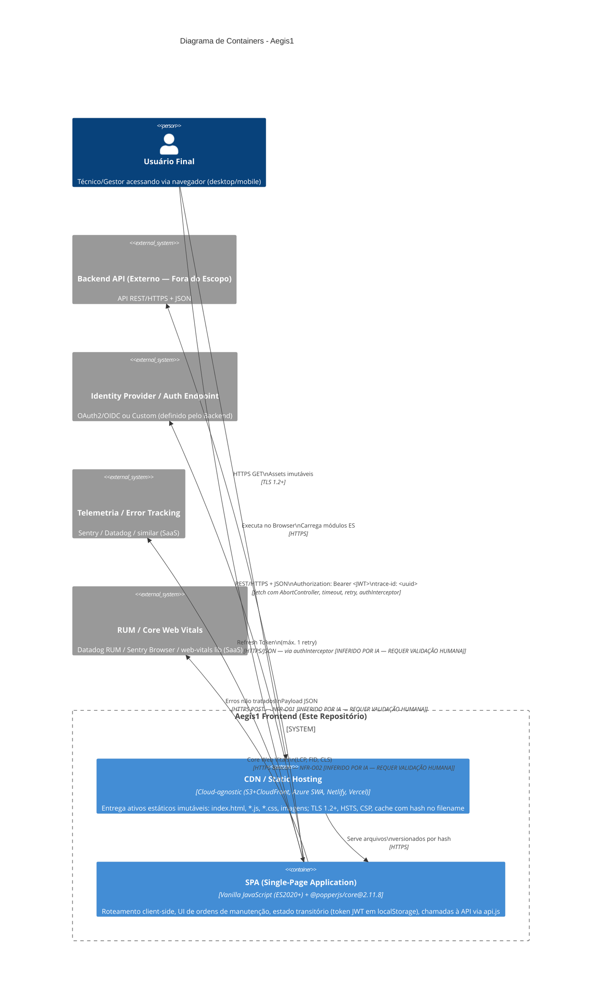
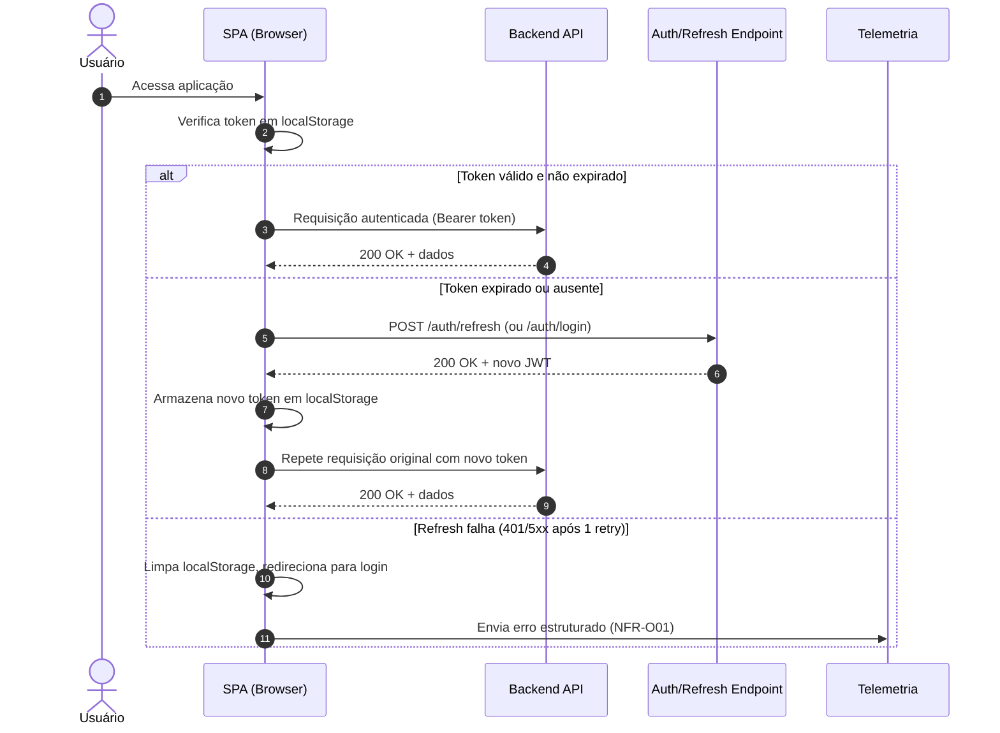
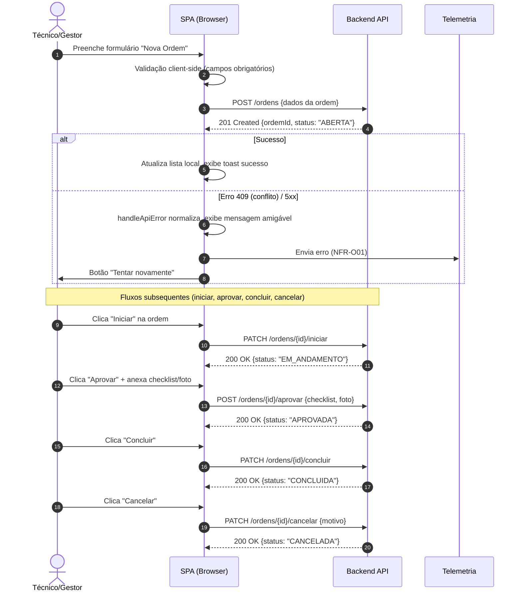
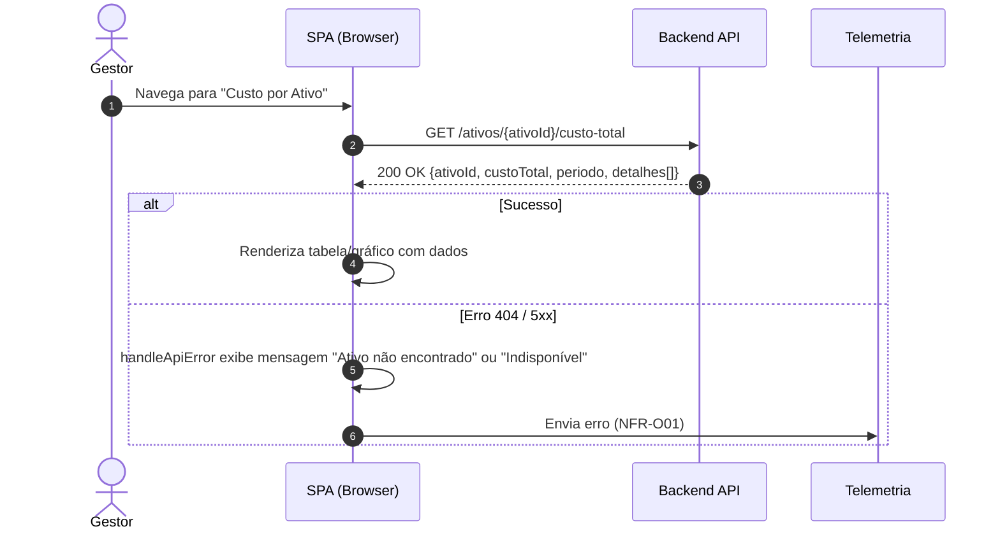
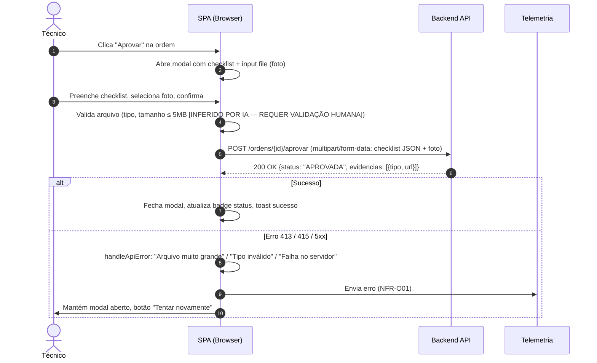

# UML & C4 Diagrams (Diagram as Code) — Aegis1

> **Versão:** 1.0 · **Owner:** Arquitetura/Eng Lead · **Status:** Draft
> Este artefato segue a abordagem **Diagram as Code (DaC)**: os diagramas são texto versionado (Mermaid), nunca imagens estáticas coladas aqui. Toda alteração de arquitetura relevante deve atualizar este arquivo no mesmo PR que altera o código.

## 1. Diagrama de Containers (C4 Model — Nível 2)



<!-- source: SAD#3-high-level-architecture, SAD#6-integration-boundaries, SAD#11-deployment-topology -->

## 2. Diagramas de Sequência (Fluxos Críticos)

### 2.1 Autenticação e Refresh de Token



<!-- source: SAD#3-high-level-architecture (authInterceptor), SAD#9-security-architecture (JWT storage, refresh), SAD#10-observability-architecture -->

### 2.2 Fluxo de Criação e Gestão de Ordem de Manutenção



<!-- source: SAD#1-overview-goals (fluxos de ordem), SAD#3-high-level-architecture (api.js:request, handleApiError), SAD#8-reliability (graceful degradation) -->

### 2.3 Consulta de Custo Total por Ativo



<!-- source: SAD#1-overview-goals (consultar custo total por ativo), SAD#5-data-modeling (contrato de API) -->

### 2.4 Upload de Evidências no Fluxo de Aprovação



<!-- source: SAD#1-overview-goals (evidências checklist/foto no aprovar), SAD#5-data-modeling (dados de negócio no backend), NFR-C03 -->

## 3. Diagrama de Componentes (Visão Estática do Frontend)

```mermaid
graph TD
    subgraph "SPA (Browser)"
        Router[Roteador Client-Side\n(Hash-based ou History API)]
        UI_Ordens[Componente Lista de Ordens]
        UI_Form[Componente Formulário Ordem\n(Criar/Editar)]
        UI_Detalhe[Componente Detalhe Ordem\n(Ações: Iniciar/Aprovar/Concluir/Cancelar)]
        UI_Custo[Componente Custo por Ativo]
        UI_Evidencia[Componente Modal Evidências\n(Checklist + Upload Foto)]
        UI_Shared[Componentes Compartilhados\n(Botões, Badges, Toasts, Dropdowns\nvia @popperjs/core)]
        
        subgraph "Camada de Integração (api.js)"
            Request[request()\nfetch + timeout + retry + auth + parsing\nComplexidade 13 — VIOLA NFR-M01]
            AuthInterceptor[authInterceptor()\nInjeta Bearer token\nRefresh automático (1 retry)\nLogout em falha]
            ErrorHandler[handleApiError()\nNormaliza 401/409/5xx\nExibe mensagem amigável\nPermite retry manual]
        end
        
        State[Estado Transitório\nlocalStorage: JWT token\nsessionStorage: UI state\nNFR-S03: sem estado de sessão além do token]
    end

    Router --> UI_Ordens
    Router --> UI_Form
    Router --> UI_Detalhe
    Router --> UI_Custo
    UI_Detalhe --> UI_Evidencia
    UI_Ordens --> UI_Shared
    UI_Form --> UI_Shared
    UI_Detalhe --> UI_Shared
    UI_Custo --> UI_Shared
    UI_Evidencia --> UI_Shared
    
    UI_Ordens --> Request
    UI_Form --> Request
    UI_Detalhe --> Request
    UI_Custo --> Request
    UI_Evidencia --> Request
    
    Request --> AuthInterceptor
    Request --> ErrorHandler
    AuthInterceptor --> State
    ErrorHandler --> State
```

<!-- source: SAD#3-high-level-architecture (componentes), SAD#4-architectural-patterns (Module Pattern, Interceptor Pattern), Diagnóstico (api.js:36 complexidade 13, console.* residuais) -->

## 4. Diagrama de Casos de Uso / Atividade (Fluxos de Negócio)

```mermaid
flowchart TD
    Start([Início: Usuário autenticado na SPA]) --> Menu{Escolhe Ação}
    
    Menu -->|Listar Ordens| ListOrdens[Exibe lista paginada\nFiltros: status, data, ativo]
    Menu -->|Criar Ordem| CriarOrdem[Formulário: ativo, descrição, prioridade, técnico responsável]
    Menu -->|Ver Detalhes| DetalheOrdem[Exibe detalhes completos\nBadges de status condicionais\nBotões de ação por status]
    Menu -->|Consultar Custo/Ativo| CustoAtivo[Formulário: seleciona ativo + período]
    
    ListOrdens --> DetalheOrdem
    CriarOrdem -->|POST /ordens| API_Criar[Backend cria ordem\nRetorna 201 + ordemId]
    API_Criar --> ListOrdens
    
    DetalheOrdem -->|Status = ABERTA| AcaoIniciar[Botão: Iniciar]
    DetalheOrdem -->|Status = EM_ANDAMENTO| AcaoAprovar[Botão: Aprovar + Evidências]
    DetalheOrdem -->|Status = APROVADA| AcaoConcluir[Botão: Concluir]
    DetalheOrdem -->|Qualquer status| AcaoCancelar[Botão: Cancelar + Motivo]
    
    AcaoIniciar -->|PATCH /ordens/{id}/iniciar| API_Iniciar[Backend: status=EM_ANDAMENTO]
    AcaoAprovar -->|Abre Modal Evidências| ModalEvid[Checklist obrigatório\nUpload foto (opcional)]
    ModalEvid -->|POST /ordens/{id}/aprovar\nmultipart| API_Aprovar[Backend: status=APROVADA\nArmazena evidências]
    AcaoConcluir -->|PATCH /ordens/{id}/concluir| API_Concluir[Backend: status=CONCLUIDA]
    AcaoCancelar -->|PATCH /ordens/{id}/cancelar| API_Cancelar[Backend: status=CANCELADA]
    
    API_Iniciar --> DetalheOrdem
    API_Aprovar --> DetalheOrdem
    API_Concluir --> DetalheOrdem
    API_Cancelar --> DetalheOrdem
    
    CustoAtivo -->|GET /ativos/{id}/custo-total| API_Custo[Backend: agrega custos\nRetorna total + breakdown]
    API_Custo --> CustoAtivo
    
    DetalheOrdem -->|Erro 401| RefreshToken[authInterceptor: refresh token\nMáx 1 retry]
    RefreshToken -->|Sucesso| DetalheOrdem
    RefreshToken -->|Falha| Logout[Limpa localStorage\nRedireciona Login]
    
    style API_Criar fill:#e1f5fe
    style API_Iniciar fill:#e1f5fe
    style API_Aprovar fill:#e1f5fe
    style API_Concluir fill:#e1f5fe
    style API_Cancelar fill:#e1f5fe
    style API_Custo fill:#e1f5fe
    style RefreshToken fill:#fff3e0
    style Logout fill:#ffebee
```

<!-- source: SAD#1-overview-goals (fluxos completos), SAD#3-high-level-architecture (api.js flows), SAD#8-reliability (graceful degradation), SAD#9-security-architecture (auth flow) -->

## 5. Convenções de Manutenção

- **Fonte única da verdade:** este arquivo é gerado/atualizado pelo próprio fluxo de documentação — não editar diagramas fora deste artefato.
- **Sem binários:** nunca anexar `.png`/`.jpg`/`.drawio`; o diagrama é sempre o bloco Mermaid acima.
- **Atualização obrigatória:** qualquer PR que altere fluxos entre serviços, contratos de API ou topologia de containers deve atualizar a seção correspondente aqui.
- **Rastreabilidade:** cada diagrama referencia seções do SAD via comentários `<!-- source: SAD#seção -->` para auditoria.
- **Conteúdo inferido:** itens marcados com `[INFERIDO POR IA — REQUER VALIDAÇÃO HUMANA]` representam hipóteses baseadas no contexto do SAD e diagnóstico; devem ser validados com o time de backend/arquitetura antes de go-live.
- **Stack tecnológica fixa:** diagramas **não** devem incluir tecnologias fora do stack verificado (Vanilla JS, @popperjs/core, CDN estático, API REST externa) — ex.: não adicionar React, TypeScript, Node.js, banco de dados, Rust/Tauri, Kubernetes, etc.