# UML & C4 Diagrams (Diagram as Code) — Sistema de Gestão de Patrimônio (A4)

> **Versão:** 1.0 · **Owner:** Arquitetura/Eng Lead · **Status:** Draft
> Este artefato segue a abordagem **Diagram as Code (DaC)**: os diagramas são texto versionado (Mermaid), nunca imagens estáticas coladas aqui. Toda alteração de arquitetura relevante deve atualizar este arquivo no mesmo PR que altera o código.
> **Fontes:** [[system-architecture]] (SAD v1.0 — fonte primária), [[nfr]] (via SAD), diagnóstico determinístico do codebase (varredura AST real — 350 arquivos, 1.268 funções, 344 classes, 27.537 LOC).
> **Referência cruzada:** o SAD (Seção 3) aponta este artefato como local oficial do diagrama de containers C4, que até então não havia sido produzido.
> **Aviso de fidelidade aos dados:** a varredura determinística **não detectou rotas/handlers declarados** nem **tabelas de banco** no código. Os fluxos de sequência abaixo derivam do SAD/NFR/BRD e dos nomes de classes verificadas; caminhos de endpoint aparecem como "rota não confirmada" e os estados de manutenção como inferidos. Todo elemento não verificável no código carrega o rótulo **[INFERIDO POR IA — REQUER VALIDAÇÃO HUMANA]** com as premissas declaradas.

---

## 1. Diagrama de Containers (C4 Model — Nível 2)

O sistema é um **monolito server-side único** (SAD, Seção 3): um backend Java que concentra autenticação, regras de negócio e acesso a dados, consumido por um frontend web via HTTP síncrono. **Não há filas, cache, serviços independentes nem integrações externas de negócio detectadas no codebase** (SAD, Seções 2 e 6). O único elemento externo modelado é o monitor de observabilidade, inferido do NFR-O01.

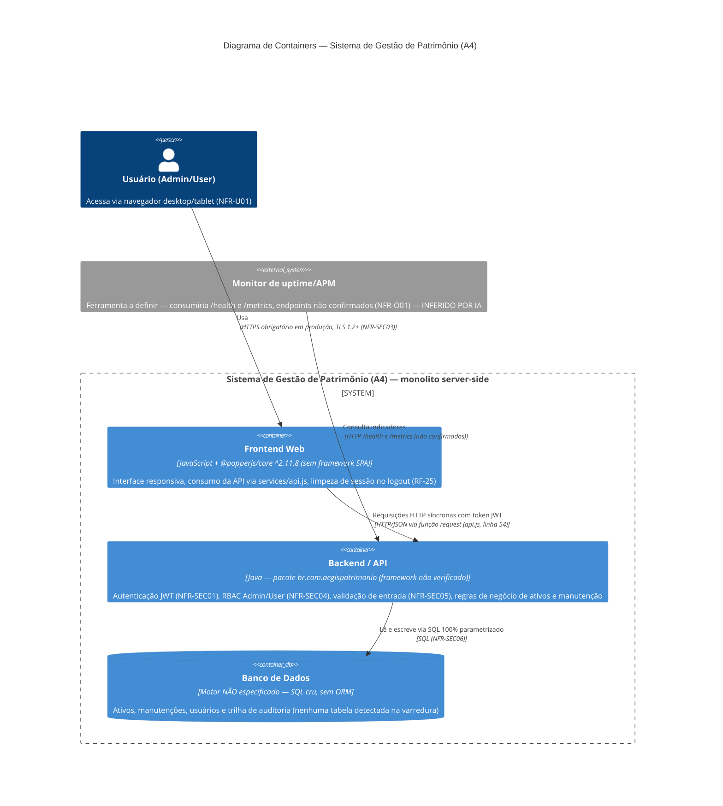

**Premissas e observações do diagrama:**

- **Monitor de uptime/APM** [INFERIDO POR IA — REQUER VALIDAÇÃO HUMANA]: inferido do NFR-O01 e da topologia do SAD (Seção 11). Nenhum componente de monitoramento existe no codebase e os endpoints `/health` e `/metrics` não estão confirmados (lacuna 5 do NFR). Premissa adotada: monitor externo consumindo os endpoints via HTTP.
- **Elementos deliberadamente não modelados:** filas/mensageria (nenhuma detectada — SAD, Seção 2), cache (nenhuma tecnologia verificada — SAD, Seção 7), integrações externas de negócio como pagamento, ERP e e-mail (nenhuma detectada — SAD, Seção 6) e balanceador/múltiplas instâncias (topologia atual — SAD, Seção 11). A topologia-alvo com balanceador (NFR-S02) permanece no SAD e não é duplicada aqui.
- **Backend como container único:** as camadas internas (`config`, `mapper`, `model`, `repository`, `service`) não são visíveis neste nível e são detalhadas na Seção 3 deste artefato.
- **Banco de dados:** o motor real é a lacuna de verificação de maior impacto (SAD, Seção 12, item 1); enquanto não verificado, o container permanece rotulado como "motor NÃO especificado".

---

## 2. Diagramas de Sequência (Fluxos Críticos)

> **Nota de fidelidade:** não há artefato `user-flows` disponível e a varredura **não detectou rotas declaradas no código**. Os fluxos abaixo derivam dos requisitos referenciados no SAD (RFs/UCs do NFR/BRD) e das classes verificadas (`AtivoService`, `AlertNotificationService`, `ManutencaoSpecification`, `AtivoMapper`, `Usuario`). Os rótulos "rota não confirmada" indicam que o caminho HTTP exato precisa ser confirmado no codebase antes de este diagrama ser considerado definitivo.

### 2.1 Autenticação — Login (RF-23)

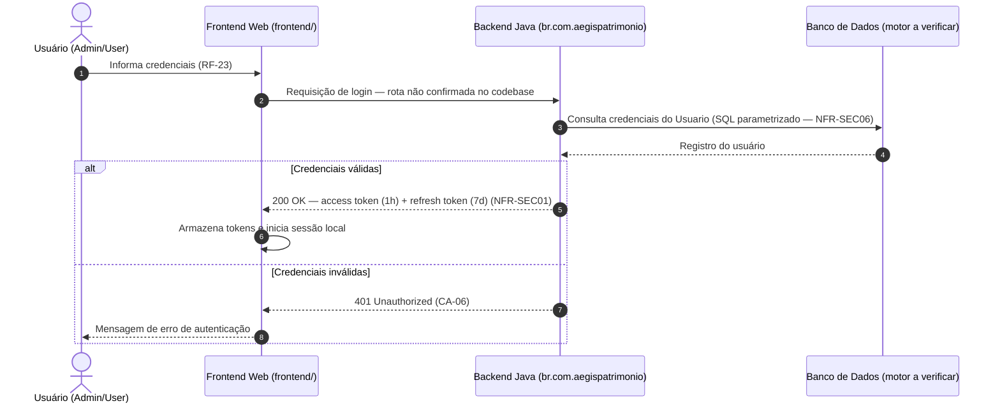

**Observações:** o mecanismo de hash de senhas no backend **não pôde ser verificado** na varredura de dependências (SAD, Seção 9; lacuna 2 do NFR) — verificação obrigatória antes de aprovar os requisitos de autenticação. O caminho exato de validação dentro do backend não é detectável pela varredura AST.

### 2.2 Autenticação — Refresh de token (RF-24)

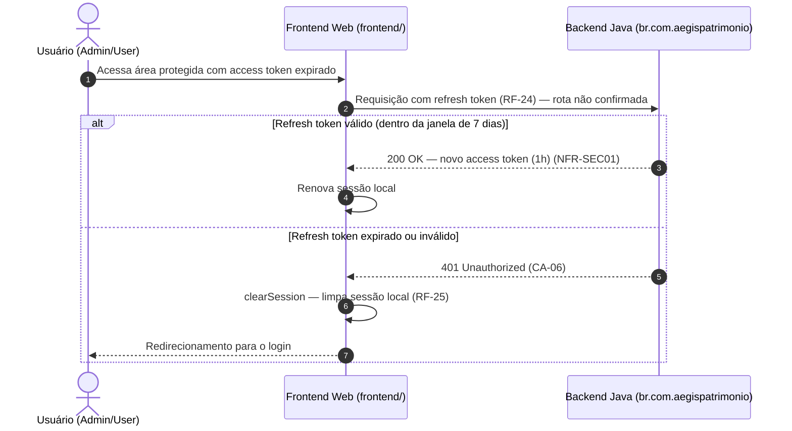

### 2.3 Autenticação — Logout e invalidação via blocklist (RF-25 / CA-08)

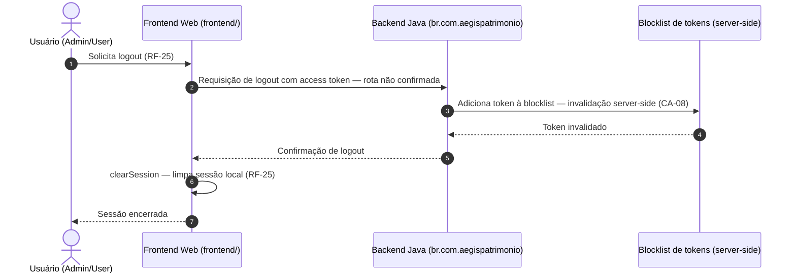

**Observações:** o participante "Blocklist de tokens" representa o **requisito CA-08** (SAD, Seção 9), não uma tecnologia confirmada — o mecanismo de armazenamento efetivo não é verificável no codebase e é o estado compartilhado que condiciona o escalonamento horizontal (NFR-S02) [INFERIDO POR IA — REQUER VALIDAÇÃO HUMANA quanto ao mecanismo de armazenamento].

### 2.4 Consulta de ativos com paginação server-side (RF-14 / RF-15)

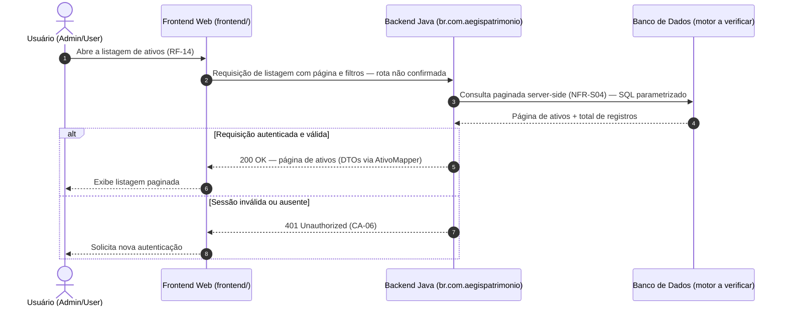

**Observações:** o detalhe do ativo (RF-15) segue o mesmo caminho de consulta; ID inexistente retorna **404 Not Found** padronizado (NFR-SEC05). A paginação server-side é **obrigatória em toda listagem** (NFR-S04) — o frontend nunca recebe listagens não paginadas.

### 2.5 Solicitação de manutenção (RF-18 / UC-02)

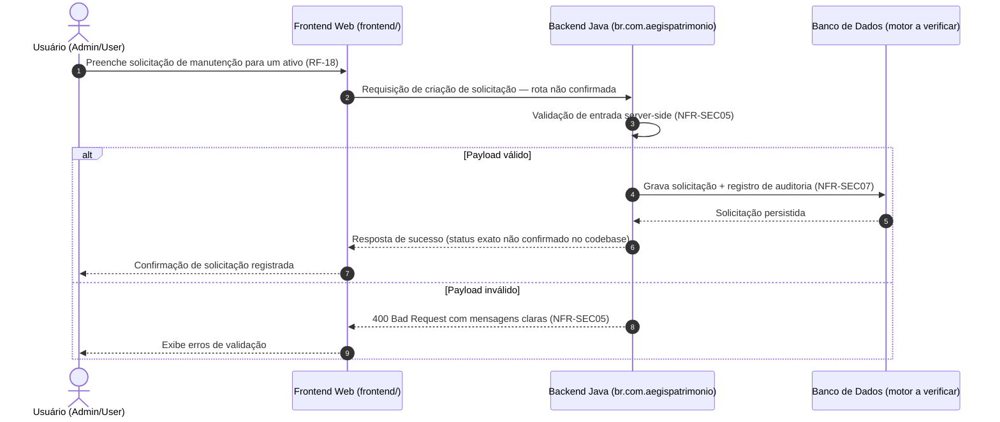

**Observações:** este é o fluxo de **maior prioridade de disponibilidade** (NFR-A04/RNF-08): falhas em componentes não críticos — em especial as notificações de alerta — não devem impedir a criação da solicitação (NFR-A05). A propagação de **request ID** do frontend para o backend (NFR-O02) deve ser implementada neste boundary para correlação.

### 2.6 Aprovação de manutenção (UC-03)

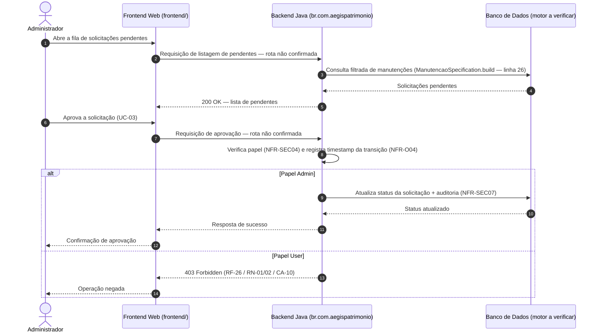

**Observações:** o timestamp registrado na aprovação alimenta o KPI "tempo médio de aprovação abaixo de 4 horas úteis" (NFR-O04). A consulta filtrada (`ManutencaoSpecification.build`, complexidade 14) é superfície prioritária de revisão de índices e parametrização (NFR-P01/NFR-SEC06).

### 2.7 Relatório de custo total por ativo (RF-17)

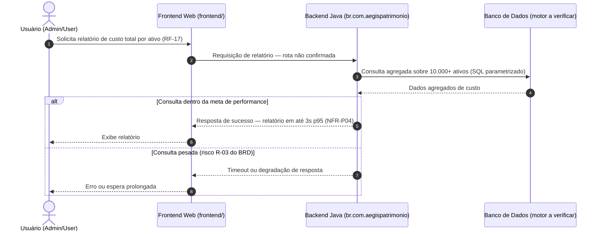

**Observações:** nenhuma tecnologia de cache está verificada na stack — as mitigações do risco R-03 (cache externo, materialização de consultas) permanecem decisão pendente (SAD, Seção 7) [INFERIDO POR IA — REQUER VALIDAÇÃO HUMANA, caso venham a ser adotadas]. Gargalo relacionado do diagnóstico: `AtivoService.java:119` (TODO de performance — até 1.000 candidatos id+nome com ranking em memória), a reavaliar contra NFR-P01/P04 antes do go-live.

### 2.8 Verificação de alertas — AlertNotificationService (in-process)

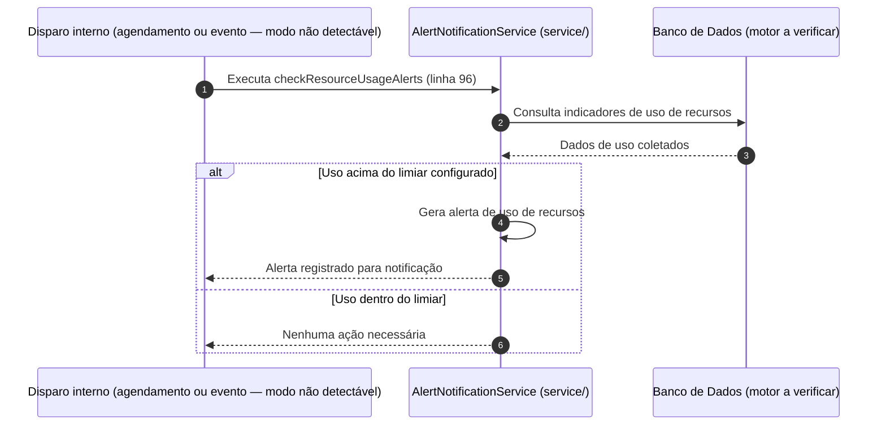

**Observações:** [INFERIDO POR IA — REQUER VALIDAÇÃO HUMANA] o modo de disparo (agendamento vs. evento) não é detectável pela varredura (SAD, Seção 4); não há fila/mensageria no codebase — a execução é in-process. `checkResourceUsageAlerts` tem a **maior complexidade ciclomática do codebase (17 — NFR-M02)**. Degradação graciosa (NFR-A05): falhas neste fluxo não devem bloquear autenticação (RF-23), consulta de ativos (RF-14/15) nem criação de solicitações (RF-18).

---

## 3. Diagrama de Componentes (visão estática)

Este diagrama resolve a ambiguidade estrutural que o diagrama de containers não expõe: a **organização interna em camadas do monolito backend** (`config`, `mapper`, `model`, `repository`, `service` — verificadas pela varredura) e o ponto único de integração do frontend.

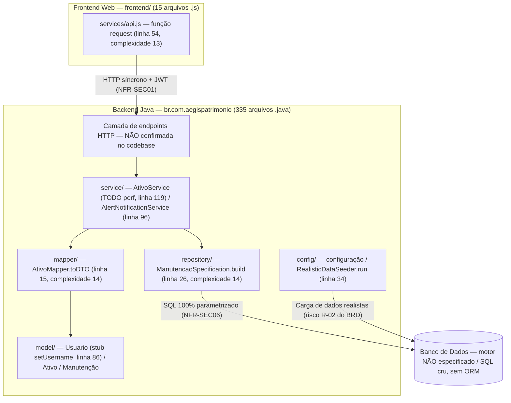

**Observações:**

- A **camada de endpoints** é representada por completude do fluxo, mas **não foi detectada** pela varredura — os pontos de entrada HTTP do backend são lacuna de verificação (SAD, Seção 12, item 5).
- `AtivoMapper.toDTO` (complexidade 14) indica mapeamento condicional extenso a revisar (NFR-M02).
- `ManutencaoSpecification.build` constrói consultas dinâmicas; **sem ORM, é responsável direta por parametrização e índices** (NFR-SEC06/NFR-P01) — superfície prioritária de revisão de SQL injection.
- O stub `Usuario.setUsername` com corpo vazio (linha 86) pode indicar bug funcional ou intencionalidade — **investigar com prioridade** (potencialmente relevante para autenticação RF-23/NFR-SEC01; lacuna 7 do NFR).
- `RealisticDataSeeder` é **carga de dados, não migração de schema** (SAD, Seção 5) — executar em staging com validação (risco R-02 do BRD).

---

## 4. Diagrama de Casos de Uso / Atividade

### 4.1 Fluxo lógico de requisição de escrita — RBAC e validação (RF-26 / NFR-SEC01/04/05/07)

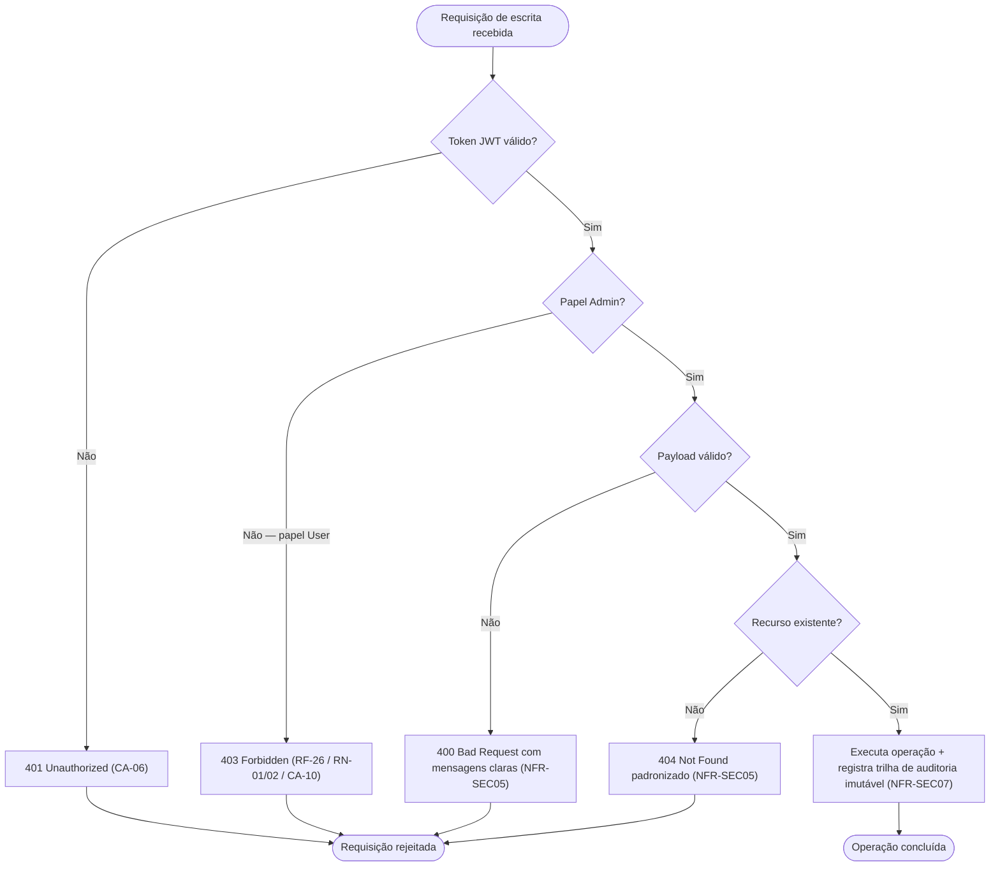

**Cobertura esperada:** 100% dos endpoints de escrita em testes de integração (NFR-SEC04); toda operação de escrita em entidades mestres exige Admin (RF-26, RN-01/02).

### 4.2 Ciclo de vida da solicitação de manutenção (RF-18 a RF-21) — [INFERIDO POR IA — REQUER VALIDAÇÃO HUMANA]

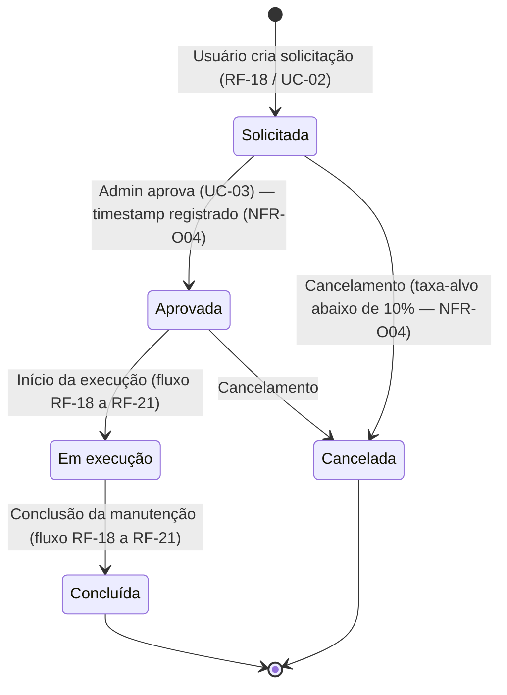

**Premissas adotadas:** os estados foram inferidos a partir das transições referenciadas no SAD ("transições do fluxo de manutenção, RF-18 a RF-21") e dos KPIs de processo do NFR-O04 (tempo médio de aprovação, taxa de solicitações canceladas). **Nenhum artefato de máquina de estados e nenhum enum de status foram varridos no codebase** — os valores reais de status devem ser confirmados no código antes de este diagrama ser considerado definitivo.

### 4.3 Carga de dados via RealisticDataSeeder (risco R-02 do BRD)

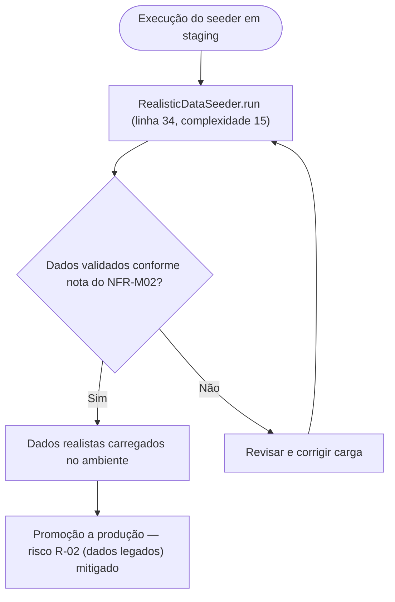

**Observações:** os passos internos de `run` não são detalhados pela varredura (complexidade 15 — acima do limite proposto de 10, NFR-M02); o requisito de execução em staging com validação vem do SAD/NFR-M02, por ser relevante ao risco R-02 do BRD (migração de dados legados). O passo de promoção a produção é representação do processo recomendado, não de código verificado.

---

## 5. Convenções de Manutenção

- **Fonte única da verdade:** este arquivo é gerado/atualizado pelo próprio fluxo de documentação — não editar diagramas fora deste artefato. As decisões de arquitetura que motivam os diagramas vivem no [[system-architecture]] (SAD v1.0).
- **Sem binários:** nunca anexar `.png`/`.jpg`/`.drawio`; o diagrama é sempre o bloco Mermaid correspondente.
- **Atualização obrigatória:** qualquer PR que altere fluxos entre frontend e backend, contratos de API ou topologia de containers deve atualizar a seção correspondente aqui, no mesmo PR.
- **Rastreabilidade nos rótulos:** manter as referências a RFs/UCs/NFRs nas mensagens e nós dos diagramas, para que cada diagrama permaneça auditável contra o SAD e o NFR.
- **Pontos de atualização pendentes específicos deste projeto:**
  - **Rotas de endpoint** — ao confirmar os pontos de entrada HTTP no codebase (incluindo `/health` e `/metrics` — lacuna 5 do NFR), substituir os rótulos "rota não confirmada" nos diagramas da Seção 2 e reavaliar o nó "Camada de endpoints HTTP" da Seção 3.
  - **Motor de banco de dados** — ao verificar o motor real (lacuna 1 do NFR), atualizar o container `db` (Seção 1), o nó de banco (Seção 3) e os participantes de banco (Seção 2), hoje rotulados "motor NÃO especificado / a verificar".
  - **Estados da solicitação de manutenção** — ao confirmar os valores reais de status no código, validar o `stateDiagram-v2` da Seção 4.2 (hoje inferido).
  - **Refatorações de complexidade** (NFR-M02) — quebras de `checkResourceUsageAlerts` (17), `run` (15), `toDTO` (14), `build` (14) e `request` (13) devem ser refletidas na Seção 3.
  - **Resolução do stub `Usuario.setUsername`** — ao resolver (lacuna 7 do NFR), remover a anotação do nó `model/` na Seção 3.