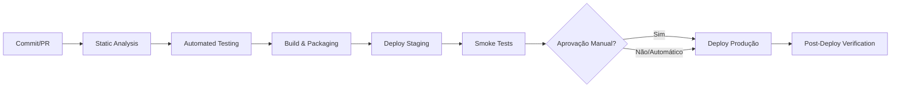

# CI/CD & Release Plan — Aegis Patrimônio

> **Owner:** Eng Lead / DevOps · **Ferramenta de CI/CD:** [INFERIDO POR IA — REQUER VALIDAÇÃO HUMANA] — Nenhuma configuração de CI/CD encontrada no diagnóstico (ausência de `.github/workflows`, `.gitlab-ci.yml`, `Jenkinsfile`, `azure-pipelines.yml`). O Test Strategy menciona "GitHub Actions/GitLab CI" como hipótese para o ambiente CI.

## 1. Pipeline Overview

> **Nota:** O pipeline acima representa o **estado alvo** definido no Test Strategy (Seção 7 — Regression Strategy). **Não existe pipeline implementado atualmente** — o diagnóstico não encontrou arquivos de configuração de CI/CD.

## 2. Pipeline Stages

### Stage 1: Static Analysis
* **Ferramentas:** 
  - **Backend (Java):** SpotBugs / PMD / Checkstyle (via Maven/Gradle) + **Semgrep** (ruleset Java: Spring Security, SQLi, XSS, path traversal) — conforme Test Strategy Seção 5 (SAST)
  - **Frontend (JavaScript):** ESLint + **Semgrep** (ruleset JS: prototype pollution, unsafe eval) — conforme Test Strategy Seção 5 (SAST)
* **Critério de bloqueio:** Qualquer finding **high/critical** do Semgrep ou violação de regras de estilo bloqueantes = pipeline vermelho
* **Execução:** A cada commit (PR) — obrigatório conforme Test Strategy Seção 2 (SAST: a cada commit)

### Stage 2: Automated Testing
* **Escopo (Nível 1 — CI obrigatório a cada PR, ~15 min):**
  - **Unit Tests:** JUnit 5 + Mockito (backend), Vitest (frontend) — cobertura mínima global 80%, crítico 95% (Test Strategy Seção 4)
  - **Integration Tests:** Testcontainers (PostgreSQL 15 assumido — **[INFERIDO POR IA — REQUER VALIDAÇÃO HUMANA]**), SpringBootTest, MockMvc — 100% fluxos críticos (Test Strategy Seção 2)
  - **Contract Tests:** Pact (provider: Spring, consumer: frontend) — todos endpoints OpenAPI (Test Strategy Seção 2)
* **Cobertura mínima exigida:** Gate no SonarQube/JaCoCo — 80% global (linhas, branches, métodos); 95% em módulos críticos listados no Test Strategy Seção 4
* **Ferramenta de build/teste:** Maven ou Gradle (não detectado no diagnóstico — **[INFERIDO POR IA — REQUER VALIDAÇÃO HUMANA]**)

### Stage 3: Build & Packaging
* **Artefato gerado:** 
  - **Backend:** JAR executável (Spring Boot fat JAR) — **[INFERIDO POR IA — REQUER VALIDAÇÃO HUMANA]** (diagnóstico não confirma Spring Boot, mas 333 arquivos Java em `src/main/java/br/com/aegispatrimonio` sugerem projeto Spring)
  - **Frontend:** Bundle estático (JS/CSS/HTML) — **[INFERIDO POR IA — REQUER VALIDAÇÃO HUMANA]** (15 arquivos `.js` em `frontend/src`, sem `package.json` scripts de build detectados)
* **Registry/Storage:** Não definido — **[ENTRADA HUMANA NECESSÁRIA]**
* **Tagging:** Não definido — **[ENTRADA HUMANA NECESSÁRIA]**

> **Gap crítico:** O diagnóstico não encontrou `pom.xml`, `build.gradle`, `package.json` com scripts de build, `Dockerfile`, ou qualquer artefato de empacotamento. A etapa de build **não pode ser especificada** sem validação humana do sistema de build real.

### Stage 4: Deploy to Staging
* **Estratégia:** Automático em merge para `main` (branch principal assumida — **[INFERIDO POR IA — REQUER VALIDAÇÃO HUMANA]**)
* **Validação pós-deploy (Nível 2 — obrigatório, ~30 min):**
  - E2E jornadas críticas (Playwright) — Test Strategy Seção 7
  - Performance smoke (subset k6: login, listagem ativos, health check ingest) — Test Strategy Seção 5
  - Acessibilidade (axe-core integrado Playwright) — Test Strategy Seção 5
* **Dados:** Dados anonimizados (LGPD) — dump produção sanitizado + seed controlado (Test Strategy Seção 3, 6)
* **Infraestrutura de deploy:** Não definida — **[ENTRADA HUMANA NECESSÁRIA]** (VM, Kubernetes, serverless, PaaS?)

### Stage 5: Deploy to Production
* **Gatilho:** Manual/aprovação após janela de bake time em staging (Test Strategy Seção 7 — Definition of Release Ready)
* **Estratégia de rollout:** Não definida — **[ENTRADA HUMANA NECESSÁRIA]** (Blue-Green | Canary | Rolling Update dependem de infra)
* **Janela de deploy:** Não definida — **[ENTRADA HUMANA NECESSÁRIA]**

## 3. Release Strategy
* **Versionamento:** SemVer (MAJOR.MINOR.PATCH) — **[INFERIDO POR IA — REQUER VALIDAÇÃO HUMANA]** (padrão de mercado, não documentado no projeto)
* **Cadência de release:** Não definida — **[ENTRADA HUMANA NECESSÁRIA]** (Test Strategy menciona "release major" e "semanal em staging", mas não cadência de produção)
* **Feature Flags:** Não implementado — **[ENTRADA HUMANA NECESSÁRIA]** (Test Strategy não menciona; necessário para canary/rollout seguro)
* **Branching model:** Não definido — **[ENTRADA HUMANA NECESSÁRIA]** (Trunk-based / GitFlow / GitHub Flow — Test Strategy assume `main` para staging deploy)

## 4. Environments
| Ambiente | Propósito | URL | Deploy automático? | Dados |
| :--- | :--- | :--- | :--- | :--- |
| **Local** | Desenvolvimento e debug | `localhost:8080` (backend), `localhost:3000/5173` (frontend) | N/A (manual) | Seed `RealisticDataSeeder` refatorado (US-TECH-007) + mocks |
| **CI** | Validação automatizada unit/integration/contract | N/A (efêmero) | Sim (a cada PR) | Banco efêmero Testcontainers (PostgreSQL 15 **[INFERIDO]**), schema Flyway/Liquibase **[INFERIDO]**) |
| **Staging** | Homologação pré-produção, E2E, performance, security | **[ENTRADA HUMANA NECESSÁRIA]** | Sim (merge `main`) | Dados anonimizados (LGPD) — dump produção sanitizado + seed controlado |
| **Produção** | Usuários reais | **[ENTRADA HUMANA NECESSÁRIA]** | Manual/gate | Reais (somente leitura para testes) |

> **Fonte:** Test Strategy Seção 3 (Test Environments) — adaptado para refletir apenas o que é verificável.

## 5. Rollback Strategy
* **Gatilho de rollback:** 
  - Taxa de erro 5xx > 0.1% nos primeiros 30 min pós-deploy (guardrail BRD citado no Test Strategy Seção 7)
  - Smoke tests críticos falhando (health endpoint, login, listagem ativos, health check ingest, dashboard)
  - Alerta crítico de infraestrutura/monitoramento
* **Mecanismo:** Não definido — **[ENTRADA HUMANA NECESSÁRIA]** (depende de estratégia de deploy: tag anterior Docker, feature flag kill switch, blue-green switch, redeploy JAR anterior)
* **Tempo alvo de rollback:** < 5 minutos — **[INFERIDO POR IA — REQUER VALIDAÇÃO HUMANA]** (meta comum, não documentada)

## 6. Approval Gates
| Gate | Ambiente | Aprovador | SLA |
| :--- | :--- | :--- | :--- |
| **Quality Gate (CI)** | CI (PR) | Automático (pipeline) | Bloqueante — falha = PR não mergeável |
| **Deploy Staging** | Staging | Automático (merge `main`) | Imediato pós-merge |
| **Release Ready** | Staging → Produção | **Eng Lead** (conforme Test Strategy Seção 10) | Validação Definition of Release Ready (Seção 7) |
| **Deploy Produção** | Produção | **Tech Lead / Eng Lead** | Janela de deploy acordada |

> **Fonte:** Test Strategy Seção 7 (Definition of Release Ready), Seção 10 (Roles & Responsibilities — Eng Lead: "Quality gate em releases")

## 7. Post-Deploy Verification
- [ ] Health checks verdes (`/actuator/health` ou endpoint equivalente — **[INFERIDO POR IA — REQUER VALIDAÇÃO HUMANA]**)
- [ ] Métricas de negócio dentro do esperado (login P95 ≤ 800ms, listagem ativos P95 ≤ 300ms, health check throughput 11 req/s — Test Strategy Seção 5)
- [ ] Nenhum novo erro crítico em **30 minutos** de observação (guardrail BRD)
- [ ] Comunicação de release enviada (se aplicável) — **[ENTRADA HUMANA NECESSÁRIA]** (canal, destinatários, template)

## 8. Secrets & Configuration Management
* **Ferramenta:** Não definida — **[ENTRADA HUMANA NECESSÁRIA]** (Vault, AWS Secrets Manager, GitHub/GitLab Secrets, Azure Key Vault, .env files?)
* **Política de rotação:** Não definida — **[ENTRADA HUMANA NECESSÁRIA]** (Test Strategy Seção 5 menciona "rotação chaves RSA (90 dias)" para JWT — aplicar a todos os secrets)
* **Segredos conhecidos necessários (baseado no código):**
  - JWT signing key (RS256 — Test Strategy Seção 5)
  - Database credentials (PostgreSQL assumido — **[INFERIDO]**)
  - SMTP credentials (notificações — Test Strategy Seção 5, US-MON-004 EX-4)
  - Storage WORM credentials (auditoria — Test Strategy Seção 5, US-ATIVO-004 EX-5)
  - Frontend API base URL (variável de build/runtime)

---

## ⚠️ Resumo de Gaps Críticos Requerendo Decisão Humana Antes de Implementar

| Item | Status | Impacto |
| :--- | :--- | :--- |
| **Sistema de build** (Maven/Gradle, `package.json` scripts) | **Não detectado** | Impede definir Stage 3 (Build & Packaging) |
| **Ferramenta de CI/CD** | **Não detectada** | Impede implementar qualquer stage |
| **Infraestrutura de deploy** (VM, K8s, PaaS, serverless) | **Não definida** | Impede Stages 4, 5 e Rollback |
| **Banco de dados alvo** | **Não detectado** (diagnóstico: "nenhum motor de banco conhecido") | Impede Testcontainers module, CI schema, connection strings |
| **Containerização** (Dockerfile, imagem base) | **Não detectada** | Impede packaging padrão e deploy consistente |
| **Branch principal** (`main`/`master`/`develop`) | **Assumida `main`** | Afeta gatilhos de staging deploy |
| **Registry de artefatos** | **Não definido** | Impede Stage 3 (storage) e Stage 4/5 (pull) |
| **Secrets manager** | **Não definido** | Impede Stage 8 e configuração segura de todos ambientes |
| **Monitoramento/Observabilidade** (Grafana, Datadog, Prometheus, ELK) | **Não detectado** | Impede Post-Deploy Verification e alertas de rollback |
| **Feature Flags** | **Não implementado** | Limita estratégias de rollout seguro (canary, kill switch) |

> **Próximo passo recomendado:** Workshop técnico (Eng Lead + DevOps + DBA + Segurança) para preencher os gaps acima e validar as inferências marcadas. O Test Strategy (Seção 12) já lista 15 "Open Issues Requerendo Decisão Humana" que impactam diretamente este plano.