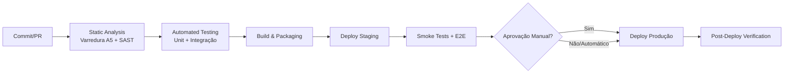

# CI/CD & Release Plan — AegisPatrimônio (Sistema de Gestão de Patrimônio)

> **Versão:** 1.0 · **Owner:** A designar (DevOps/Eng Lead) **[INFERIDO POR IA — REQUER VALIDAÇÃO HUMANA]** · **Ferramenta de CI/CD:** a definir — nenhuma pipeline detectada no codebase; sugestão: GitHub Actions **[INFERIDO POR IA — REQUER VALIDAÇÃO HUMANA]** · **Status:** Draft
>
> *Nota de Transparência:* Este documento é ancorado na varredura determinística do codebase (**A5** — 350 arquivos, 27.537 LOC, 1268 funções, 344 classes), nas dependências reais capturadas (`@popperjs/core` em produção; **0 dependências de desenvolvimento**), na topologia verificada **Aplicação Web / Server-side** e no artefato-fonte **Test Strategy** (v1.0). **Estado verificado da base de automação:** `package.json` sem nome e **sem nenhum script** de build/teste/deploy; nenhuma ferramenta de CI/CD, registry de artefatos ou ferramenta de packaging detectada; nenhuma ferramenta de build Java (Maven/Gradle) reportada pela varredura; engine de banco de dados não especificada; sem empacotamento Tauri. Stack verificada: backend Java (335 arquivos `.java` em `src/`), frontend JavaScript (15 arquivos `.js` em `frontend/`). **O pipeline descrito abaixo é o estado-alvo a ser criado — hoje não existe automação de build/deploy no projeto.** Artefatos referenciados pela instrução de dependências mas não disponíveis nesta geração: *System Architecture*, *Dev Environment*, *NFR detalhado* e *api-specification.md* — as lacunas decorrentes estão marcadas ao longo do documento. Todo item não detectado diretamente nos fontes contém o marcador `[INFERIDO POR IA — REQUER VALIDAÇÃO HUMANA]`.

## 1. Pipeline Overview

**Estado atual vs. estado-alvo — lacunas verificadas que bloqueiam a ativação do pipeline:**

| Lacuna verificada (A5 / `package.json`) | Impacto no pipeline | Ação para ativação |
| :--- | :--- | :--- |
| Nenhum script em `package.json` (build/teste/deploy) | Stages 2–5 não executáveis | Criar script `test` e scripts de build conforme ferramenta confirmada **[INFERIDO POR IA — REQUER VALIDAÇÃO HUMANA]** |
| Nenhuma ferramenta de build Java reportada (Maven/Gradle não confirmados) | Stage 3 sem comando de build definido | Confirmar a ferramenta de build real do backend `src/` **[INFERIDO POR IA — REQUER VALIDAÇÃO HUMANA]** |
| Nenhum runner de testes instalado (0 dev-dependencies) | Stage 2 sem suíte executável | Adoção das ferramentas da Test Strategy (JUnit 5 / Jest) **[INFERIDO POR IA — REQUER VALIDAÇÃO HUMANA]** |
| Engine de banco de dados não especificada | Testes de integração e provisionamento de ambientes indefinidos | Confirmar o mecanismo de persistência real **[INFERIDO POR IA — REQUER VALIDAÇÃO HUMANA]** |
| Nenhuma ferramenta de CI/CD ou registry detectados | Pipeline inexistente | Criar workflow no CI escolhido + storage de artefatos **[INFERIDO POR IA — REQUER VALIDAÇÃO HUMANA]** |

## 2. Pipeline Stages

### Stage 1: Static Analysis
* **Ferramentas:**
  * **Varredura estrutural determinística (já existente):** AST do workspace (`server/analyze-pipeline.ts`, conforme diagnóstico A5) — detecta funções com complexidade ciclomática alta, chamadas `console.*` residuais, stubs de corpo vazio e comentários TODO/FIXME. Achados atuais em dívida tracked: `request` (complexidade 13, `frontend/src/services/api.js`), `toDTO` (14, `AtivoMapper.java`), `build` (14, `ManutencaoSpecification.java`), `checkResourceUsageAlerts` (17, `AlertNotificationService.java`), `run` (15, `RealisticDataSeeder.java`), stub `setUsername` (`Usuario.java:86`), `console.error`/`console.debug` (`api.js:44`/`:107`) — tratamento via US-005/US-007, meta de redução a zero.
  * **SAST:** Semgrep a cada PR **[INFERIDO POR IA — REQUER VALIDAÇÃO HUMANA]** (alinhado à Test Strategy, seção 5) — foco em segredos expostos e no manuseio do token JWT (RNF-01).
  * **Linter/type-check:** nenhum linter detectado nas dependências; adoção a definir na ativação do pipeline **[INFERIDO POR IA — REQUER VALIDAÇÃO HUMANA]**. O backend Java é estaticamente tipado e compilado (ferramenta de compilação/build real pendente de confirmação — ver Stage 3).
* **Critério de bloqueio:** falha = pipeline vermelho. Bloqueio para **novos** achados de higiene (`console.*` residuais no frontend, stubs de corpo vazio), **novos** TODO/FIXME em caminhos críticos e **novas** funções acima do limiar de complexidade acordado **[INFERIDO POR IA — REQUER VALIDAÇÃO HUMANA]** — premissa: os 12 achados existentes de complexidade e os 3 de higiene são dívida conhecida (US-005/US-007) e não devem bloquear o primeiro pipeline; achados SAST de severidade crítica/alta bloqueiam o merge.

### Stage 2: Automated Testing
* **Escopo:**
  * **Unit Tests** — backend Java: JUnit 5 **[INFERIDO POR IA — REQUER VALIDAÇÃO HUMANA]**; frontend JS: Jest **[INFERIDO POR IA — REQUER VALIDAÇÃO HUMANA]** (script `test` a criar no `package.json`). Execução a cada commit **[INFERIDO POR IA — REQUER VALIDAÇÃO HUMANA]**.
  * **Integration Tests** — ancorados aos contratos comportamentais nomeados da Test Strategy (enquanto o `api-specification.md` não existir): `criar_comAdmin_deveRetornarCreated`, `criar_comUser_deveRetornarForbidden`, `criar_comDadosInvalidos_deveRetornarBadRequest` (US-001); `buscarPorId_comIdInexistente_deveRetornarNotFound` (US-002); `aprovar`, `cancelar`, `custoTotalPorAtivo` (US-003); `concluir` + conciliação do custo (CA-09) (US-004). Execução a cada PR **[INFERIDO POR IA — REQUER VALIDAÇÃO HUMANA]**. **Estratégia de banco de dados de teste pendente da confirmação do mecanismo de persistência (não discoverable nas fontes).**
  * **Contract Tests** — Pact **[INFERIDO POR IA — REQUER VALIDAÇÃO HUMANA]**, a cada release; lista de endpoints pendente da publicação do `api-specification.md` (nenhuma rota detectada na varredura A5).
  * **BDD:** as stories estão em Gherkin; Cucumber (backend Java) pode automatizar os cenários diretamente **[INFERIDO POR IA — REQUER VALIDAÇÃO HUMANA]**.
  * **Prioridade de cobertura por risco** (caminhos apontados pela A5): `AtivoService.java:119` (TODO de performance — até 1000 candidatos, US-005), `AtivoMapper.toDTO` (RF-14), `ManutencaoSpecification.build` (filtros da fila, US-003), `AlertNotificationService.checkResourceUsageAlerts` (17) e `request` de `api.js` (comum a todos os fluxos UC-01..US-004).
* **Cobertura mínima exigida:** **80% global** (RNF-10 do BRD), medida por JaCoCo (Java) e cobertura nativa do runner JS **[INFERIDO POR IA — REQUER VALIDAÇÃO HUMANA]**; **95% para caminhos críticos** (RN-03, RN-04, RN-05, RN-08/CA-09, CA-10) **[INFERIDO POR IA — REQUER VALIDAÇÃO HUMANA]** — premissa de governança da Test Strategy (seção 4); o BRD fixa apenas o piso global de 80%. Build com cobertura abaixo do piso = pipeline vermelho.
* **Exclusões justificadas (Test Strategy, seção 4):** `RealisticDataSeeder.java` (carga de dados de teste) e classes de configuração declarativas **[INFERIDO POR IA — REQUER VALIDAÇÃO HUMANA]**; `frontend/src/services/api.js` **não** é excluído — a função `request` é comum a todos os fluxos e deve ser coberta, incluindo injeção de token (RF-24/CA-07) e `clearSession` (RF-25/CA-08).

### Stage 3: Build & Packaging
* **Artefato gerado:**
  * **Backend:** pacote da aplicação Java empacotada — **formato (JAR/WAR) e ferramenta de build não detectados/reportados pela varredura A5** (nenhum `pom.xml`/`build.gradle` reportado; `package.json` não contém scripts de build). Premissa: empacotamento via Maven em `target/*.jar` **[INFERIDO POR IA — REQUER VALIDAÇÃO HUMANA]** — **requer confirmação da ferramenta de build real antes da ativação do stage**.
  * **Frontend:** assets estáticos JavaScript (15 arquivos `.js` em `frontend/`) — **nenhum bundler detectado** nas dependências (única dependência de produção: `@popperjs/core`); empacotamento = inclusão dos assets no artefato de deploy, sem etapa de transpilação **[INFERIDO POR IA — REQUER VALIDAÇÃO HUMANA]**.
* **Registry/Storage:** nenhum registry detectado nos fontes; sugestão: GitHub Container Registry (GHCR) ou artifact storage nativo do CI **[INFERIDO POR IA — REQUER VALIDAÇÃO HUMANA]**. Retenção mínima: últimas 10 versões taggeadas, para viabilizar rollback **[INFERIDO POR IA — REQUER VALIDAÇÃO HUMANA]**.
* **Tagging:** `sha-<commit>` (todo build), `vX.Y.Z` (builds de release, SemVer — seção 3), `latest` **apenas para staging** (produção nunca referenciada por tag móvel) **[INFERIDO POR IA — REQUER VALIDAÇÃO HUMANA]**.

### Stage 4: Deploy to Staging
* **Estratégia:** automático em merge para `main` **[INFERIDO POR IA — REQUER VALIDAÇÃO HUMANA]** — premissa: branching model trunk-based (seção 3); nenhuma configuração de branch protegida detectada nos fontes.
* **Validação pós-deploy:**
  * **Smoke tests automatizados** **[INFERIDO POR IA — REQUER VALIDAÇÃO HUMANA]** — automação a criar; nenhum health endpoint detectado na varredura A5.
  * **Suíte E2E das jornadas principais** (US-001 cadastro de filial, US-002 solicitação de manutenção, US-003 aprovação, US-004 conclusão da ordem) com Playwright **[INFERIDO POR IA — REQUER VALIDAÇÃO HUMANA]**, incluindo **viewport mobile** (RNF-08 / risco R-04 do BRD) e axe-core para acessibilidade **[INFERIDO POR IA — REQUER VALIDAÇÃO HUMANA]**. Responsável: QA.
  * **Dados:** seed via `RealisticDataSeeder` (verificado: `src/main/java/br/com/aegispatrimonio/config/seeder/RealisticDataSeeder.java`, método `run`) — exigência do DoD das stories ("Feature testada em staging com dados do `RealisticDataSeeder`"); anonimização/mascaramento obrigatório fora de produção (o domínio envolve o vínculo Funcionário↔Usuário — RN-06) **[INFERIDO POR IA — REQUER VALIDAÇÃO HUMANA]**.
  * **Medição de tempo de resposta** (US-005): meta RNF-04 < 200ms p95, **excluindo relatórios pesados** (`custoTotalPorAtivo` fora da garantia — risco R-03); requer instrumentação nova **[INFERIDO POR IA — REQUER VALIDAÇÃO HUMANA]**.

### Stage 5: Deploy to Production
* **Gatilho:** **manual/aprovação** (gate de qualidade — seção 6), somente após critérios de saída de release verdes (Test Strategy, seção 7): 0 bugs P0/P1 abertos, suíte de regressão verde, cobertura ≥ 80% (RNF-10) incluindo CA-10, conciliação de custos verificada (CA-09) **[INFERIDO POR IA — REQUER VALIDAÇÃO HUMANA]** — premissa: critérios de governança alinhados ao DoD das stories.
* **Estratégia de rollout:** **redeploy direto do artefato taggeado (equivalente a Rolling Update de instância única)**. **Blue-Green e Canary NÃO são aplicáveis ao estado atual**: aplicação web/server-side única, sem réplicas, orquestração, balanceamento ou mecanismos de scaling horizontal detectados no codebase **[INFERIDO POR IA — REQUER VALIDAÇÃO HUMANA]** — premissa: topologia de instância única; adoção futura de Blue-Green/Canary dependeria de evolução de infraestrutura fora do escopo atual.
* **Janela de deploy:** horário de baixo impacto (fora do pico comercial), evitar sextas-feiras e vésperas de feriado **[INFERIDO POR IA — REQUER VALIDAÇÃO HUMANA]** — premissa: sem SLA de disponibilidade definido nos fontes; janela de governança.
* **Pré-requisito de dados:** backup/verificação de integridade pré-deploy **[INFERIDO POR IA — REQUER VALIDAÇÃO HUMANA]** — engine de banco não confirmada; procedimento depende do mecanismo de persistência real.

## 3. Release Strategy
* **Versionamento:** SemVer (`MAJOR.MINOR.PATCH`), tag `vX.Y.Z` no commit de release:
  * **MAJOR** — quebra de compatibilidade em contratos públicos (ex.: alteração dos códigos HTTP das regras RN-03/RN-04, do ciclo RN-05 ou do formato de resposta dos endpoints) — enumeração precisa pendente do `api-specification.md` (não gerado; nenhuma rota detectada na A5).
  * **MINOR** — novas funcionalidades backward-compatible (ex.: US-005 otimização da busca, novos endpoints/relatórios).
  * **PATCH** — correções e higiene sem mudança de contrato (ex.: US-007 — remoção de `console.*` de `api.js:44`/`:107`, resolução do stub `setUsername` em `Usuario.java:86`).
* **Cadência de release:** por sprint para MINOR; PATCH imediato (fora de janela) para correções P0/P1 **[INFERIDO POR IA — REQUER VALIDAÇÃO HUMANA]** — premissa: alinhada aos SLAs de triage da Test Strategy (seção 8: P0 imediato, P1 24h), que são hipóteses de governança a validar com o time.
* **Feature Flags:** nenhuma ferramenta detectada nos fontes; política proposta: flags de configuração para ativação gradual de features de risco (ex.: nova busca de ativos — US-005) com **kill switch** para desativação sem redeploy **[INFERIDO POR IA — REQUER VALIDAÇÃO HUMANA]** — mecanismo de implementação (config externa vs. biblioteca) não detectável; premissa: flag simples por ambiente, removida após ativação plena.
* **Branching model:** trunk-based com PRs revisados e branch `main` protegida **[INFERIDO POR IA — REQUER VALIDAÇÃO HUMANA]** — nenhuma configuração de branching detectada nos fontes; premissa: time pequeno, integração contínua em `main`, hotfixes via `git revert` + PATCH.

## 4. Environments

| Ambiente | Propósito | URL | Deploy automático? | Dados |
| :--- | :--- | :--- | :--- | :--- |
| Local | Desenvolvimento; testes unitários/integração | `localhost` **[INFERIDO POR IA — REQUER VALIDAÇÃO HUMANA]** | N/A (manual) | Seed `RealisticDataSeeder` |
| CI | Validação automatizada (estática + unit + integração) | Efêmero (criado/destruído por execução) | Sim (a cada commit/PR) **[INFERIDO POR IA — REQUER VALIDAÇÃO HUMANA]** | Efêmeros; estratégia de banco pendente da confirmação da persistência |
| Staging | Homologação pré-produção (DoD das stories; medição RNF-04/US-005) | A definir **[INFERIDO POR IA — REQUER VALIDAÇÃO HUMANA]** | Sim (merge `main`) **[INFERIDO POR IA — REQUER VALIDAÇÃO HUMANA]** | Seed realista (`RealisticDataSeeder`) / anonimizado **[INFERIDO POR IA — REQUER VALIDAÇÃO HUMANA]** |
| Production | Usuários reais; smoke tests pós-deploy | A definir **[INFERIDO POR IA — REQUER VALIDAÇÃO HUMANA]** | Manual/gate **[INFERIDO POR IA — REQUER VALIDAÇÃO HUMANA]** | Reais |

**Notas de ambientes:**
* **Provisionamento de banco:** engine de banco de dados não especificada nas dependências — o provisionamento de local/CI/staging/produção **não pode ser presumido** e depende da confirmação do mecanismo real de persistência no codebase.
* **Nenhuma URL de ambiente** foi encontrada nos fontes ou artefatos — todas as URLs são placeholders a definir **[INFERIDO POR IA — REQUER VALIDAÇÃO HUMANA]**.
* **Massa de dados para performance:** a validação de RNF-06 (10k+ ativos / 1k+ usuários simultâneos) exige ambiente com volume compatível, a criar **[INFERIDO POR IA — REQUER VALIDAÇÃO HUMANA]**; aplicação única, sem mecanismos de scaling detectados — os testes de carga medem os limites do caminho de aplicação existente.

## 5. Rollback Strategy
* **Gatilho de rollback:**
  * Falha dos smoke tests pós-deploy em produção **[INFERIDO POR IA — REQUER VALIDAÇÃO HUMANA]**.
  * Bug crítico (P0) ou alto (P1) em produção, conforme triage da Test Strategy (seção 8): perda de registros de audit trail (RNF-07), corrupção do custo total por ativo (RN-08/CA-09), escrita persistida sem permissão (RN-02), ciclo de manutenção bloqueado (RN-05).
  * Taxa de erro acima do limiar acordado **[INFERIDO POR IA — REQUER VALIDAÇÃO HUMANA]** — **nenhuma instrumentação de observabilidade detectada na varredura A5**; o gatilho quantitativo depende de instrumentação nova (DoD das stories: "Métricas/observabilidade instrumentadas (se aplicável)").
* **Mecanismo (ordem de prioridade):**
  1. **Rollback de versão de binário:** redeploy do artefato da tag `vX.Y.Z` anterior, retido no registry (retenção mínima de 10 versões **[INFERIDO POR IA — REQUER VALIDAÇÃO HUMANA]**). Mecanismo primário, viabilizado pelo tagging `sha-<commit>`/`vX.Y.Z` do Stage 3.
  2. **Feature flag kill switch:** desativação imediata da feature afetada sem redeploy (quando a falha estiver coberta por flag — seção 3). Resposta mais rápida disponível na topologia atual.
  3. **Reversão de tag via `git revert` + PATCH:** quando o rollback exige mudança de código (ex.: correção de dados gravados incorretamente), seguir fluxo de hotfix com release PATCH imediato.
* **Tempo alvo de rollback:** execução do rollback de binário **< 15 minutos** **[INFERIDO POR IA — REQUER VALIDAÇÃO HUMANA]** — premissa: redeploy de artefato pré-compilado em aplicação de instância única, sem orquestração (rollback em segundos exigiria Blue-Green/réplicas, não detectadas no codebase); kill switch de feature flag como resposta imediata (< 1 minuto) quando aplicável. Alinhamento com SLAs de triage: P0 = imediato **[INFERIDO POR IA — REQUER VALIDAÇÃO HUMANA]**.
* **Rollback de banco de dados:** **não definível no estado atual** — engine de banco e mecanismo de migrações não detectáveis nos fontes; procedimento a especificar após a confirmação da persistência. Premissa provisória: backup pré-deploy com restauração manual **[INFERIDO POR IA — REQUER VALIDAÇÃO HUMANA]**.
* **RTO/RPO:** **não definidos nos artefatos-fonte disponíveis** (a Test Strategy não fixa metas de RTO/RPO). Propostas **[INFERIDO POR IA — REQUER VALIDAÇÃO HUMANA]**: RTO < 1h para incidentes P0 (via rollback de binário + verificação pós-deploy); RPO dependente do mecanismo de persistência e da política de backup — a definir. O rollback **não deve descartar escritas legítimas** (audit trail imutável — RNF-07), o que reforça a preferência por rollback de binário/flag sobre restauração de dados.

## 6. Approval Gates

| Gate | Ambiente | Aprovador | SLA |
| :--- | :--- | :--- | :--- |
| Code review do PR | CI/Staging (pré-merge) | Peer dev + Eng Lead **[INFERIDO POR IA — REQUER VALIDAÇÃO HUMANA]** | 1 dia útil **[INFERIDO POR IA — REQUER VALIDAÇÃO HUMANA]** |
| Deploy Produção | Prod | Eng Lead (gate de qualidade da Test Strategy, seção 10) **[INFERIDO POR IA — REQUER VALIDAÇÃO HUMANA]** | 24h **[INFERIDO POR IA — REQUER VALIDAÇÃO HUMANA]** |
| Adoção de ferramentas inferidas (CI/CD, runners, SAST) | Organizacional | Eng Lead **[INFERIDO POR IA — REQUER VALIDAÇÃO HUMANA]** | Antes da ativação do pipeline **[INFERIDO POR IA — REQUER VALIDAÇÃO HUMANA]** |

**Nota:** nenhum fluxo de aprovação está definido nos fontes — todos os gates e SLAs são hipóteses de governança **[INFERIDO POR IA — REQUER VALIDAÇÃO HUMANA]**, alinhadas aos papéis da Test Strategy (seção 10) e aos critérios de entrada/saída de release (seção 7 do artefato-fonte).

## 7. Post-Deploy Verification
- [ ] Smoke tests automatizados verdes em produção **[INFERIDO POR IA — REQUER VALIDAÇÃO HUMANA]** (automação a criar; nenhum health endpoint detectado na varredura A5)
- [ ] Health checks verdes (endpoint de health a expor/confirmar **[INFERIDO POR IA — REQUER VALIDAÇÃO HUMANA]**)
- [ ] Contratos comportamentais críticos validados: permissões Admin vs User (CA-10), ciclo Pendente → Aprovada → Em Andamento → Concluída (RN-05), conciliação do `custoTotalPorAtivo` (CA-09/RN-08)
- [ ] Tempo de resposta dentro da meta RNF-04 (< 200ms p95, excluindo relatórios pesados) — requer instrumentação nova **[INFERIDO POR IA — REQUER VALIDAÇÃO HUMANA]**
- [ ] Audit trail gravando toda escrita, incluindo tentativas rejeitadas (RNF-07 / US-006)
- [ ] Nenhum novo erro crítico em período de observação de 24h **[INFERIDO POR IA — REQUER VALIDAÇÃO HUMANA]** — premissa: janela de bake time alinhada ao SLA P1 de triage
- [ ] Nenhum `console.*` residual novo no frontend (gate da varredura A5 — `api.js:44`/`:107` como referência de dívida já tratada)
- [ ] Comunicação de release enviada (se aplicável)

## 8. Secrets & Configuration Management
* **Ferramenta:** nenhuma detectada nos fontes; sugestão: GitHub Secrets (se GitHub Actions for adotado) ou Vault **[INFERIDO POR IA — REQUER VALIDAÇÃO HUMANA]**.
* **Segredos identificados pelo domínio dos fontes:**
  * **Segredo de assinatura do token JWT** (RNF-01 — expiração de 1h; meta pendente de verificação no codebase) **[INFERIDO POR IA — REQUER VALIDAÇÃO HUMANA]**.
  * **Credenciais de banco de dados** por ambiente — engine não confirmada; credenciais a inventariar **[INFERIDO POR IA — REQUER VALIDAÇÃO HUMANA]**.
  * **Credenciais de deploy** (acesso ao registry e aos ambientes staging/produção) **[INFERIDO POR IA — REQUER VALIDAÇÃO HUMANA]**.
  * **Estado verificado:** a varredura A5 não reportou segredos expostos, mas **não realizou varredura dedicada de segredos** — recomenda-se SAST com regras de detecção de segredos (Stage 1) na ativação do pipeline.
* **Política de manuseio:** segredos nunca versionados no repositório; injeção via variáveis de ambiente do CI/runtime; segredos de produção acessíveis apenas ao pipeline de deploy e ao gate de produção **[INFERIDO POR IA — REQUER VALIDAÇÃO HUMANA]**.
* **Política de rotação:** segredo JWT e credenciais de banco a cada 90 dias **[INFERIDO POR IA — REQUER VALIDAÇÃO HUMANA]**; rotação imediata em caso de suspeita de exposição; credenciais de deploy revisadas a cada mudança de ferramenta de CI/CD.
* **Configuração por ambiente:** URLs de ambiente, strings de conexão e parâmetros de feature flags externalizados em configuração por ambiente (nunca hardcoded) **[INFERIDO POR IA — REQUER VALIDAÇÃO HUMANA]** — nenhum mecanismo de configuração detectado na varredura A5.