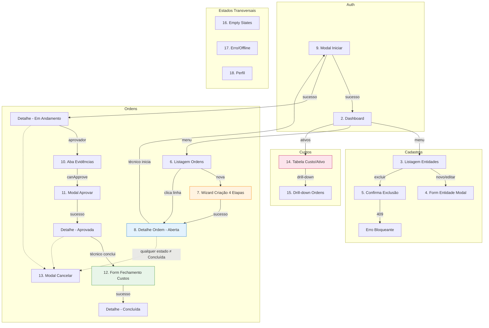

# Wireframes & Protótipos — Aegis1

> **Versão:** 0.1 · **Owner:** Design/Product · **Status:** Draft — *Especificação de wireframes a serem criados; nenhum protótipo existe no repositório*  
> **Depende de:** `user-flows.md`, `component-library.md`, `design-tokens.md`, `docs/brd.md`

---

## 1. Overview

Este documento **especifica o conjunto mínimo de wireframes e protótipos** necessários para cobrir os 8 user flows documentados em `user-flows.md`, utilizando os componentes definidos em `component-library.md` e os tokens de `design-tokens.md`.

**Fato crítico:** A varredura determinística do workspace confirmou **zero arquivos de UI** (0 `.tsx/.jsx/.vue/.svelte`, 0 CSS/SCSS, 0 componentes, 0 Storybook, 0 Figma links). O codebase atual é **vanilla JS puro** (`frontend/src/services/api.js` + utilitários) sem framework de componentes, roteamento ou camada de apresentação.

Portanto, **este documento não apresenta wireframes existentes** — ele define **o que deve ser desenhado, em que fidelidade, e como se conecta aos fluxos e componentes**. Todos os itens abaixo são **[INFERIDO POR IA — REQUER VALIDAÇÃO HUMANA]**.

---

## 2. Escopo & Objetivo do Protótipo

| Aspecto | Definição |
| :--- | :--- |
| **Problema a resolver** | Ausência total de interface de usuário para o sistema de gestão de manutenção (Aegis1). Necessário prototipar todas as telas para validar fluxos com stakeholders antes da implementação em React + TypeScript. |
| **Fluxos cobertos** | Todos os 8 flows de `user-flows.md`: 1. Gestão de Cadastros Mestres (CRUD 4 entidades) 2. Criação de Ordem (Wizard 4 etapas) 3. Iniciar Ordem (Técnico) 4. Aprovar Ordem (Aprovador) 5. Concluir Ordem (Fechamento com custos) 6. Cancelar Ordem 7. Visualizar Custo Total por Ativo (Dashboard/Drill-down) 8. Buscar/Listar Ordens com Filtros |
| **Fidelidade alvo** | **Mid-fidelity (wireframes funcionais)** para validação de fluxos, arquitetura de informação e estados de UI. **High-fidelity (visual completo)** apenas para telas críticas: Login, Dashboard, Wizard Criação Ordem, Detalhe Ordem, Formulário Fechamento. |
| **Interativo?** | **Sim** — protótipo clicável (Figma/ProtoPie) cobrindo happy paths + 3 edge cases principais (409 exclusão, 401 sessão expirada, 5xx erro rede). |
| **Entregáveis** | 1. Arquivo Figma organizado por fluxo 2. Protótipo navegável (links + overlays) 3. Especificação de estados por tela (este documento) 4. Checklist de handoff para dev (seção 8) |

---

## 3. Inventário de Telas

| # | Tela | Flow(s) | Descrição Resumida | Fidelidade | Status | Componentes-chave (ref. `component-library.md`) |
| :--- | :--- | :--- | :--- | :--- | :--- | :--- |
| 1 | **Login** | Transversal | Autenticação + recuperação senha; `returnUrl` preservado | High-fi | **Planned** | `Input`, `Button`, `Card`, `Toast`, `Link` |
| 2 | **Dashboard / Home** | 7, 8 | Cards KPI (custo total por ativo, ordens por estado), acesso rápido | High-fi | **Planned** | `Card`, `Badge`, `DataTable` (resumo), `Skeleton`, `Breadcrumb` |
| 3 | **Listagem Genérica de Entidades** | 1 | Tabela CRUD para Departamentos, Filiais, Fornecedores, Funcionários | Mid-fi | **Planned** | `DataTable`, `Modal` (form), `Button`, `DropdownMenu`, `Pagination`, `EmptyState`, `SearchInput`, `FilterBar` |
| 4 | **Formulário de Entidade (Modal)** | 1 | Criação/Edição de Departamento/Filial/Fornecedor/Funcionário | Mid-fi | **Planned** | `Modal`, `Input`, `Select`, `Button`, `Toast`, `LoadingOverlay` |
| 5 | **Confirmação de Exclusão (Modal)** | 1 | Modal bloqueante 409 com contagem de vínculos | Mid-fi | **Planned** | `Modal` (variant=confirmation), `Button` (destructive), `Badge` |
| 6 | **Listagem de Ordens (Principal)** | 2, 3, 4, 5, 6, 8 | Tabela mestra com filtros avançados, ações contextuais por estado | High-fi | **Planned** | `DataTable` (virtualized, selectable, actions), `FilterBar`, `SearchInput`, `Badge`, `DropdownMenu`, `Pagination`, `Skeleton`, `EmptyState` |
| 7 | **Wizard Criação de Ordem (4 etapas)** | 2 | Modal fullscreen (mobile) / lg (desktop) — Dados Básicos → Ativo/Fornecedor → Responsável → Revisão | High-fi | **Planned** | `Modal` (variant=form), `Wizard/Stepper`, `Input`, `Textarea`, `Select` (autocomplete ativo), `RadioGroup` (prioridade/tipo), `Button`, `Toast`, `LoadingOverlay` |
| 8 | **Detalhe da Ordem** | 3, 4, 5, 6, 8 | Página/modal com abas: Geral, Evidências, Custos, Timeline; ações conforme estado/permissão | High-fi | **Planned** | `Tabs`, `OrderTimeline`, `Badge`, `Button` (variant per action), `Avatar`, `Card`, `Accordion`, `Tooltip`, `DropdownMenu` |
| 9 | **Modal Iniciar Ordem (Confirmação)** | 3 | Confirmação simples → `PATCH /iniciar` | Mid-fi | **Planned** | `Modal` (confirmation), `Button` (primary), `LoadingOverlay` |
| 10 | **Aba Evidências + Aprovação** | 4 | Checklist, fotos, observações; botão Aprovar condicional a `canApprove` | Mid-fi | **Planned** | `Tabs`, `Checkbox`, `ImageGallery`, `Textarea`, `Button` (secondary), `Tooltip` (disabled reason) |
| 11 | **Modal Aprovar (Observação)** | 4 | Modal com Textarea opcional → `PATCH /aprovar` | Mid-fi | **Planned** | `Modal` (form), `Textarea`, `Button`, `Toast` |
| 12 | **Formulário Fechamento / Conclusão** | 5 | Horas, Materiais (lista dinâmica + fornecedor), Terceiros, Obs, Total calculado | High-fi | **Planned** | `Modal` (form, lg), `OrderCostForm`, `Input` (number), `Select` (fornecedor), `Button` (add/remove line), `Card` (total fixo), `Toast` |
| 13 | **Modal Cancelar (Motivo Obrigatório)** | 6 | Textarea required → `PATCH /cancelar` | Mid-fi | **Planned** | `Modal` (form), `Textarea` (required), `Button` (destructive), `Toast` |
| 14 | **Tabela Custo Total por Ativo** | 7 | Cards/tabela ordenável por custo decrescente; drill-down expansível | High-fi | **Planned** | `AssetCostTable` (expandable), `Card`, `Badge`, `Skeleton`, `EmptyState`, `Button` (drill-down) |
| 15 | **Drill-down Ordens do Ativo** | 7 | Lista expansível ou Drawer com ordens concluídas + custos individuais | Mid-fi | **Planned** | `Drawer` / `DataTable` (expandable), `Badge`, `Button` (detalhe) |
| 16 | **Estado Vazio Genérico** | 1, 3, 4, 5, 7, 8 | Ilustração + CTA contextual ("Criar primeiro", "Nenhuma ordem para você") | Mid-fi | **Planned** | `EmptyState` (variant=action/illustration) |
| 17 | **Erro Global / Offline** | Transversal | Toast persistente + retry exponencial; ErrorBoundary fallback | Mid-fi | **Planned** | `Toast` (persistent), `ErrorBoundary`, `Button` (retry) |
| 18 | **Perfil / Configurações** | Transversal | Dados do usuário, preferências, logout | Low-fi | **Planned** | `Card`, `Input`, `Switch`, `Button`, `Avatar` |

**Total: 18 telas únicas** (algumas reutilizam padrões — ex.: Modal Form, DataTable, EmptyState).

---

## 4. Fluxo Prototipado (Visão Geral)

> **Legenda:** Laranja = Wizard crítico | Azul = Detalhe central | Verde = Fechamento financeiro | Rosa = Dashboard custos

---

## 5. Especificação por Tela

> **Convenção:** Cada tela lista objetivo, componentes (ref. `component-library.md`), estados obrigatórios, regras de negócio (ref. `user-flows.md` + `docs/brd.md`), anotações de interação e responsividade.

---

### 5.1 Login
* **Objetivo:** Autenticar usuário, preservar `returnUrl`, tratar expiração de sessão (401 → refresh → redirect).
* **Componentes:** `Card` (container), `Input` (email, password), `Button` (primary, fullWidth, loading), `Link` (esqueci senha), `Toast` (erro), `Skeleton` (loading submit).
* **Estados:**
  - Default: campos vazios, botão habilitado
  - Loading: `Button.loading=true`, inputs disabled
  - Erro 401: `Toast.error` "Credenciais inválidas", shake no card
  - Erro 5xx: `Toast.error` "Serviço indisponível", retry automático
  - Sessão expirada (interceptador): redirect automático preservando `returnUrl`
* **Regras:** BRD guardrails — latência P95 < 800ms, taxa erro < 1%; `authInterceptor` em `api.js` já implementa refresh 1x.
* **Interação:** `Enter` submete; foco inicial no email; `aria-describedby` em erros.
* **Responsividade:** Card centralizado max-w-md; mobile full-width com padding.

---

### 5.2 Dashboard / Home
* **Objetivo:** Visão executiva — KPIs custo total por ativo (top 5), contadores ordens por estado, acesso rápido "Nova Ordem".
* **Componentes:** `Card` (KPIs), `Badge` (contadores), `DataTable` (resumo top ativos), `Button` (primary "Nova Ordem"), `Breadcrumb`, `Skeleton` (loading cards).
* **Estados:**
  - Loading: `Skeleton` em todos os cards + tabela
  - Empty (sem ordens): `EmptyState` illustration + CTA "Criar primeira ordem"
  - Erro: `Toast` + botão "Tentar novamente" recarrega widgets
  - Success: cards animam contagem (number ticker), tabela ordenável por custo
* **Regras:** BR-04 — `custoTotalPorAtivo` calculado no backend; frontend apenas exibe. Drill-down clicável na linha do ativo.
* **Interação:** Click no card ativo → navega para Tela 14 (detalhe ativo) ou expande inline.
* **Responsividade:** Grid 1 col (mobile) → 2 col (tablet) → 4 col (desktop); tabela colapsa em cards no mobile.

---

### 5.3 Listagem Genérica de Entidades (Departamentos, Filiais, Fornecedores, Funcionários)
* **Objetivo:** CRUD completo — listar, criar, editar, excluir (com bloqueio 409).
* **Componentes:** `DataTable` (sortable, filterable, selectable, actions), `FilterBar`, `SearchInput`, `Pagination`, `Button` (primary "Novo"), `Modal` (form), `DropdownMenu` (ações linha), `EmptyState`, `Toast`, `LoadingOverlay`.
* **Estados:**
  - Loading: `Skeleton` rows (5) + overlay toolbar
  - Empty: `EmptyState` action "Criar primeiro [Entidade]"
  - Success: tabela com ações por linha (Editar, Excluir)
  - Exclusão 409: `Modal` confirmation com contagem de vínculos → `Toast.error` bloqueante
  - Erro 5xx: `Toast` + retry
* **Regras:** Flow 1 — `POST/PUT/DELETE /api/{entidade}`; 409 se ordens vinculadas; exclusão só admin.
* **Interação:** 
  - "Novo" → abre Modal Form (Tela 4)
  - Linha click → Editar (ou navega detalhe se futuro)
  - Checkbox header → seleção múltipla → ações em lote (futuro)
  - Debounce 300ms na busca/filtros
* **Responsividade:** Tabela horizontal scroll mobile; ações em `DropdownMenu`; `FilterBar` colapsável.

---

### 5.4 Formulário de Entidade (Modal)
* **Objetivo:** Criar/editar Departamento, Filial, Fornecedor, Funcionário.
* **Componentes:** `Modal` (variant=form, size=md), `Input` (nome, código, email, telefone, etc.), `Select` (filial pai, cargo), `Button` (ghost cancel, primary submit loading), `Toast`.
* **Estados:**
  - Default: campos limpos (criação) ou pré-preenchidos (edição)
  - Validação client: `Input.variant=error` + mensagem inline `aria-live=polite`
  - Submitting: `Button.loading`, `Modal` fecha só após 2xx
  - Sucesso: `Toast.success`, `Modal` fecha, lista recarrega
  - Erro 400: erros inline mapeados do backend
  - Erro 5xx: `Toast.error` + mantém modal aberto
* **Regras:** Campos obrigatórios por entidade (BRD glossário); validação duplicidade no backend.
* **Interação:** `Esc` fecha (se dirty → confirmation); `Tab` order lógico; foco inicial no primeiro input.
* **Responsividade:** Mobile → `Modal` fullscreen (variant=fullscreen); campos empilhados.

---

### 5.5 Confirmação de Exclusão (Modal 409)
* **Objetivo:** Bloquear exclusão de entidade com vínculos; mostrar contagem exata.
* **Componentes:** `Modal` (variant=confirmation, size=sm), `Button` (ghost cancel, destructive confirm loading), `Badge` (contagem).
* **Estados:**
  - Default: mensagem clara "3 ordens vinculadas a este fornecedor"
  - Loading confirm: `Button.loading`, `Modal` não fecha
  - Sucesso: `Toast.success`, lista recarrega
  - Erro: `Toast.error` + mantém modal
* **Regras:** BR-05 — exclusão bloqueada se ordens vinculadas (409). Frontend **não** permite forçar.
* **Interação:** Foco no botão "Cancelar" (safe default); `Esc` fecha.
* **Responsividade:** Igual desktop.

---

### 5.6 Listagem de Ordens (Tela Principal)
* **Objetivo:** Hub central — listagem paginada, filtrável, com ações contextuais por estado/permissão.
* **Componentes:** `DataTable` (virtualized, selectable, stickyHeader, actions per row), `FilterBar` (collapsible), `SearchInput` (debounced), `Pagination` (showSizeChanger), `Badge` (estado, prioridade), `DropdownMenu` (ações overflow), `Skeleton`, `EmptyState`, `Toast`, `LoadingOverlay`.
* **Colunas (ref. `component-library.md` DataTable example):**
  - ID, Título (link detalhe), Ativo, Estado (Badge), Prioridade (Badge), Responsável, Criada em
* **Ações por linha (visibilidade condicional):**
  | Ação | Visível se | Variant | Endpoint |
  | :--- | :--- | :--- | :--- |
  | Iniciar | `estado==='Aberta' && canStart` | primary | `PATCH /iniciar` |
  | Aprovar | `estado==='Em Andamento' && canApprove` | secondary | `PATCH /aprovar` |
  | Concluir | `estado==='Aprovada' && canComplete` | primary | `PATCH /concluir` |
  | Cancelar | `estado!=='Concluída' && canCancel` | destructive | `PATCH /cancelar` |
  | Detalhes | sempre | ghost | navega `/ordens/:id` |
* **Estados:**
  - Loading: `Skeleton` rows + overlay
  - Empty: `EmptyState` variant=action "Nova Ordem" (se permissão)
  - Success: tabela densa, hover highlight, seleção múltipla
  - Erro 5xx: `Toast` persistente + retry
* **Regras:** Flow 8 — busca global + filtros avançados (estado, responsável, ativo, período, prioridade); debounce 300ms; server-side pagination.
* **Interação:** 
  - Click linha → navega Detalhe (Tela 8)
  - Ações inline → abrem modais correspondentes (Telas 9, 11, 12, 13)
  - Filtros: `FilterBar` expande/colapsa; `SearchInput` global
  - Teclado: setas navegam linhas; `Enter` abre detalhe; `Space` seleciona
* **Responsividade:** 
  - Mobile: colunas essenciais (ID, Título, Estado, Prioridade); ações em `DropdownMenu`; `FilterBar` bottom sheet.
  - Tablet: + Ativo, Responsável.
  - Desktop: todas colunas; `FilterBar` sidebar fixa.

---

### 5.7 Wizard Criação de Ordem (4 Etapas)
* **Objetivo:** Fluxo guiado para criar ordem completa — validação por etapa, revisão final.
* **Componentes:** `Modal` (variant=form, size=lg/fullscreen), `Wizard/Stepper` (horizontal desktop, vertical mobile), `Input` (título), `Textarea` (descrição), `RadioGroup` (prioridade: Baixa/Média/Alta/Crítica; tipo: Corretiva/Preventiva), `Select` (autocomplete ativo, fornecedor), `Select` (funcionários ativos), `Button` (back, next, submit), `Toast`, `LoadingOverlay`.
* **Etapas (ref. Flow 2):**
  1. **Dados Básicos:** Título (req), Descrição, Prioridade (RadioGroup), Tipo (RadioGroup)
  2. **Ativo/Fornecedor:** Ativo (Select searchable, req), Fornecedor (Select, req se tipo=terceirizado)
  3. **Responsável:** Técnico (Select funcionários ativos, req)
  4. **Revisão:** Resumo read-only de todas as etapas
* **Estados por etapa:**
  - Default: campos limpos/pré-preenchidos
  - Validação client: `variant=error` inline; botão "Próximo" disabled até válido
  - Navegação: `Back` habilitado exceto etapa 1; `Next` valida schema (Zod/Yup)
  - Revisão: sem validação; botão "Criar Ordem" → submit final
  - Submitting: `Button.loading`, wizard disabled
  - Sucesso: `Toast.success`, `Modal` fecha, navega Detalhe (Tela 8) estado "Aberta"
  - Erro 400: volta para etapa com erro, destaca campos
  - Erro 5xx: `Toast.error` + mantém wizard
* **Regras:** BR-01 — ordem criada no estado "Aberta"; técnico responsável alocado (opcional na criação, mas obrigatório para iniciar).
* **Interação:** `Enter` avança se válido; `Shift+Tab` volta; stepper `aria-current="step"`; progresso visual.
* **Responsividade:** Mobile → `Modal` fullscreen, `Wizard` vertical; desktop → `Modal` lg, `Wizard` horizontal.

---

### 5.8 Detalhe da Ordem
* **Objetivo:** Visão 360° da ordem — informações, timeline, evidências, custos, ações permitidas.
* **Componentes:** `Tabs` (Geral, Evidências, Custos, Timeline), `OrderTimeline` (vertical, detailed), `Badge` (estado grande), `Button` (ações conforme estado), `Avatar` (responsável, aprovador), `Card` (seções), `Accordion` (evidências colapsáveis), `Tooltip` (botões disabled), `DropdownMenu` (ações secundárias), `Breadcrumb`.
* **Abas:**
  - **Geral:** Dados básicos, ativo, fornecedor, responsável, prioridade, tipo, datas
  - **Evidências:** Checklist assinado, fotos (grid), observações técnico — `canApprove` badge
  - **Custos:** Resumo (se concluída) ou "Aguardando aprovação" / "Aguardando fechamento"
  - **Timeline:** `OrderTimeline` — estados com timestamp, autor, observação
* **Ações (header/footer):**
  | Estado | Ações Visíveis |
  | :--- | :--- |
  | Aberta | Iniciar (primary), Cancelar (destructive), Editar (ghost) |
  | Em Andamento | Aprovar (secondary, se `canApprove`), Cancelar, Anexa Evidência |
  | Aprovada | Concluir (primary), Cancelar |
  | Concluída | (somente leitura) — Reabrir? (futuro) |
  | Cancelada | (somente leitura) |
* **Estados:**
  - Loading: `Skeleton` por aba + `LoadingOverlay`
  - Erro 404: `Toast` + redirect listagem
  - Erro 5xx: `Toast` + retry
  - Success: abas carregadas sob demanda (lazy)
* **Regras:** Flow 3,4,5,6,8 — botões condicionais a `canStart`, `canApprove`, `canComplete`, `canCancel` (vindos da API); timeline imutável.
* **Interação:** 
  - Abas: teclado `←/→` navega; `aria-selected`
  - Evidências: click foto → lightbox (futuro)
  - Timeline: expansível para detalhes
  - `Tooltip` em botão disabled: "Aguardando evidências do técnico" / "Apenas ordens Aprovadas podem ser concluídas"
* **Responsividade:** 
  - Mobile: `Tabs` scrollable; ações em `DropdownMenu` ou bottom bar; `Drawer` para evidências.
  - Desktop: layout 2 colunas (conteúdo + sidebar ações/timeline).

---

### 5.9 Modal Iniciar Ordem (Confirmação)
* **Objetivo:** Confirmação simples antes de transicionar "Aberta" → "Em Andamento".
* **Componentes:** `Modal` (confirmation, sm), `Button` (primary loading, ghost cancel).
* **Estados:** Default → Loading → Success (fecha + atualiza detalhe) / Error 409/403 (Toast + mantém modal).
* **Regras:** BR-01 — apenas técnico responsável, estado "Aberta".
* **Interação:** Foco no "Cancelar"; `Esc` fecha.

---

### 5.10 Aba Evidências + Aprovação
* **Objetivo:** Aprovador revisa checklist, fotos, obs; aprova se `canApprove=true`.
* **Componentes:** `Tabs` (ativa), `Checkbox` (checklist items, readonly), `ImageGallery` (fotos), `Textarea` (obs técnico, readonly), `Button` (secondary "Aprovar" condicional), `Tooltip` (se disabled: "Aguardando anexos do técnico"), `Badge` (evidências pendentes/completas).
* **Estados:**
  - `canApprove=false`: botão disabled + tooltip; badge "Evidências incompletas"
  - `canApprove=true`: botão habilitado; badge "Pronto para aprovação"
  - Loading aprovação: `Button.loading`
* **Regras:** BR-02 — frontend **não** valida evidências; apenas reflete `canApprove` da API.
* **Interação:** Click "Aprovar" → abre Modal 5.11.

---

### 5.11 Modal Aprovar (Observação)
* **Objetivo:** Capturar observação opcional do aprovador; confirmar aprovação.
* **Componentes:** `Modal` (form, sm), `Textarea` (label "Observação de aprovação", placeholder), `Button` (secondary confirm loading, ghost cancel).
* **Estados:** Default → Loading → Success (fecha + atualiza detalhe → "Aprovada" + notifica técnico) / Error 409/403.
* **Regras:** BR-02 — transição "Em Andamento" → "Aprovada"; habilita "Concluir" para técnico.

---

### 5.12 Formulário Fechamento / Conclusão (OrderCostForm)
* **Objetivo:** Registrar custos reais (mão de obra, material, terceiros) ao concluir ordem.
* **Componentes:** `Modal` (form, lg), `OrderCostForm` (domain), `Input` (number, horas), `Select` (fornecedor material/terceiro), `Input` (valor unitário), `Button` (ghost "Adicionar", destructive "Remover linha"), `Card` (total fixo bottom/sidebar), `Button` (primary "Concluir e Registrar Custos" loading, ghost cancel), `Toast`.
* **Seções:**
  1. **Mão de Obra:** Horas trabalhadas (number, req, min=0.5, step=0.5)
  2. **Materiais:** Lista dinâmica — Material (input), Quantidade (number), Fornecedor (Select), Valor Unitário (number) → Total linha
  3. **Serviços Terceiros:** Lista dinâmica — Descrição, Fornecedor, Valor
  4. **Observações Finais:** Textarea
  5. **Total Calculado:** Card fixo — soma em tempo real (horas × rate + Σ materiais + Σ terceiros)
* **Estados:**
  - Default: vazio ou pré-preenchido (edição)
  - Validação: horas req, materiais/terceiros opcionais mas se adicionados → campos req
  - Adicionar linha: valida linha atual antes de adicionar nova
  - Submitting: `Button.loading`, formulário disabled
  - Sucesso: `Toast.success` "Ordem concluída. Custos registrados.", `Modal` fecha, navega listagem/dashboard
  - Erro 409 (estado ≠ Aprovada): `Toast.error` bloqueante
  - Erro 400 (custos): erros inline nas linhas
  - Erro 5xx: `Toast.error` + mantém modal
* **Regras:** BR-03, BR-04 — apenas estado "Aprovada"; custos alimentam `custoTotalPorAtivo`; mão de obra = horas × rate (rate vem do backend/cadastro funcionário).
* **Interação:** 
  - `Enter` em último campo de linha → "Adicionar"
  - `Delete` em linha selecionada → remove (com confirmation se preenchida)
  - Total card: `aria-live="polite"` anuncia mudanças
  - Teclado: `Tab` navega campos; `Esc` fecha (se dirty → confirmation)
* **Responsividade:** Mobile → `Modal` fullscreen; listas em `Accordion`; total card bottom fixed.

---

### 5.13 Modal Cancelar (Motivo Obrigatório)
* **Objetivo:** Registrar motivo de cancelamento; transicionar para "Cancelada".
* **Componentes:** `Modal` (form, sm), `Textarea` (required, label "Motivo do cancelamento", minlength=10), `Button` (destructive "Confirmar cancelamento" loading, ghost cancel).
* **Estados:** Default (textarea vazio, botão disabled) → Preenchido (botão habilitado) → Loading → Success/Error.
* **Regras:** BR-03 — qualquer estado exceto "Concluída"; motivo obrigatório; ordem cancelada não entra em custos.
* **Interação:** Contador de caracteres; `Enter` não submete (textarea); `Ctrl+Enter` submete.

---

### 5.14 Tabela Custo Total por Ativo
* **Objetivo:** Dashboard gerencial — ranking de ativos por custo total acumulado (mão de obra + material + terceiros).
* **Componentes:** `AssetCostTable` (expandable, sortable, drillable), `Card` (resumo total geral), `Badge` (dot vermelho se > threshold), `Skeleton`, `EmptyState`, `Button` (drill-down).
* **Colunas:** Ativo (Tag + Nome), Total Mão de Obra, Total Material, Total Terceiros, **Total Geral** (bold), Ação (drill-down).
* **Estados:**
  - Loading: `Skeleton` rows (5)
  - Empty: `EmptyState` "Nenhum custo registrado — ordens concluídas geram custos"
  - Success: tabela ordenável por Total Geral desc; linhas expansíveis
  - Erro: `Toast` + retry
* **Regras:** BR-04 — cálculo no backend (`GET /api/ativos/custo-total`); frontend **nunca** calcula.
* **Interação:** Click linha / botão drill-down → expande inline (Tela 15) ou abre `Drawer`.
* **Responsividade:** Mobile → cards empilhados com expand; desktop → tabela completa.

---

### 5.15 Drill-down Ordens do Ativo
* **Objetivo:** Detalhar ordens concluídas que compõem o custo do ativo.
* **Componentes:** `Drawer` (right, lg) ou `DataTable` (expandable row), `Badge` (estado Concluída), `Button` (detalhe ordem).
* **Colunas:** ID Ordem, Título, Data Conclusão, Mão de Obra, Material, Terceiros, Total.
* **Estados:** Loading skeleton → Success (lista) → Click → navega Detalhe Ordem (Tela 8).
* **Regras:** Apenas ordens "Concluídas" vinculadas ao ativo.
* **Responsividade:** Mobile → `Drawer` full height; Desktop → `Drawer` lg ou inline expand.

---

### 5.16 Estado Vazio Genérico (EmptyState)
* **Objetivo:** Padrão consistente para listas vazias em todos os flows.
* **Variantes:**
  - `illustration`: Apenas ícone + mensagem (ex.: "Nenhum ativo cadastrado")
  - `action`: Ilustração + mensagem + `Button` primary CTA (ex.: "Criar primeiro departamento")
  - `filtered`: "Nenhum resultado para seus filtros" + `Button` ghost "Limpar filtros"
* **Componentes:** `EmptyState` component, `Button`, `Illustration` (SVG).
* **Acessibilidade:** `aria-live="polite"` anuncia mensagem; foco no CTA se `action`.

---

### 5.17 Erro Global / Offline / ErrorBoundary
* **Objetivo:** Tratamento resiliente de falhas de rede, 5xx, erros React não capturados.
* **Componentes:** `Toast` (persistent, variant=error, action "Tentar novamente"), `ErrorBoundary` (fallback UI com `Button` "Recarregar página"), `LoadingOverlay` (retry exponencial visual).
* **Estados:**
  - Erro rede/5xx: `Toast` "Serviço indisponível. Tentativa 1 de 3..." → retry automático (exponential backoff 1s, 2s, 4s)
  - Erro React: `ErrorBoundary` captura → fallback "Algo deu errado" + `Button` "Recarregar" + `Button` "Reportar"
  - Sessão expirada (401): `authInterceptor` tenta refresh → se falha → redirect Login com `returnUrl`
* **Regras:** BRD guardrails — `authInterceptor` em `api.js` já implementa retry 1x; frontend adiciona retry 3x para fetch falha.

---

### 5.18 Perfil / Configurações
* **Objetivo:** Gerenciar conta, preferências, logout.
* **Componentes:** `Card` (sections), `Avatar` (upload futuro), `Input` (nome, email readonly), `Switch` (notificações, tema), `Button` (ghost "Sair", destructive "Excluir conta").
* **Estados:** Default → Loading save → Success toast / Error toast.
* **Prioridade:** Baixa (MVP pós-lançamento).

---

## 6. Feedback & Iterações

| Data | Autor | Feedback | Resolução |
| :--- | :--- | :--- | :--- |
| [DD/MM/AAAA] | [Design Lead] | [Ex: "Wizard 4 etapas muito longo; avaliar combinar Etapa 2+3"] | [Ex: "Mantido 4 etapas por validação de complexidade distinta; revisar em usabilidade"] |
| [DD/MM/AAAA] | [Product Owner] | [Ex: "Dashboard precisa de gráfico de tendência custo/mês"] | [Ex: "Adicionado como Tela 19 (futuro) — fora do MVP"] |
| [DD/MM/AAAA] | [Tech Lead] | [Ex: "DataTable virtualized só se >100 linhas; priorizar simplicidade"] | [Ex: "Ajustado spec: virtualized={orders.length > 100}"] |

> **Nota:** Esta tabela será preenchida durante revisões com stakeholders. Nenhuma iteração registrada até o momento.

---

## 7. Critérios de Aprovação

| Critério | Status | Observação |
| :--- | :--- | :--- |
| [ ] Todos os 8 user flows (`user-flows.md`) têm pelo menos 1 tela prototipada | ⬜ | 18 telas mapeadas cobrem 100% dos flows |
| [ ] Estados obrigatórios cobertos: Loading, Empty, Error, Success, Disabled | ⬜ | Especificado por tela na seção 5 |
| [ ] Componentes reutilizados da `component-library.md` (sem duplicação) | ⬜ | Referência explícita em cada tela |
| [ ] Regras de negócio BR-01 a BR-06 refletidas nas interações | ⬜ | Mapeado nas regras por tela |
| [ ] Acessibilidade básica: foco, ARIA, contraste, teclado | ⬜ | Anotado por tela; validação final com axe/core |
| [ ] Responsividade: mobile (375px), tablet (768px), desktop (1440px) | ⬜ | Breakpoints de `design-tokens.md` |
| [ ] Protótipo navegável (Figma) compartilhado com stakeholders | ⬜ | Link a ser adicionado |
| [ ] Aprovação formal: Product Owner + Tech Lead + Design Lead | ⬜ | Assinaturas necessárias antes do handoff |

---

## 8. Handoff para Desenvolvimento

| Item | Especificação | Local / Formato |
| :--- | :--- | :--- |
| **Design Tokens** | Cores, tipografia, spacing, shadows, radius, motion, z-index, breakpoints | `design-tokens.md` → `tokens.css` (implementar Fase 1) |
| **Componentes Base (ui/)** | 26 componentes — prioridade: Button, Input, Select, Modal, DataTable, Badge, Toast, Tooltip, DropdownMenu, Skeleton, EmptyState, Modal, Wizard | `component-library.md` §3 + §4 specs |
| **Componentes Domínio (domain/)** | 8 componentes — OrderWizard, OrderTimeline, OrderCostForm, AssetCostTable, EntityCrudTable, SearchInput, FilterBar | `component-library.md` §3 |
| **Medidas/Spacing** | Grid 8px base; `space-1` a `space-8`; container max-w-7xl; gutter 24px | `design-tokens.md` §3, §9 |
| **Tipografia** | Font: Inter (variable); scale: `text-xs` a `text-4xl`; weight: 400/500/600/700 | `design-tokens.md` §2 |
| **Cores Semânticas** | Accent, Success, Warning, Danger, Info + light/dark variants; neutros 50-950 | `design-tokens.md` §1 |
| **Ícones** | Lucide React (tree-shakable) — 24px base; `stroke-width: 2` | `package.json` + `component-library.md` |
| **Assets Exportados** | Ilustrações EmptyState (SVG), logos, favicons | `/public/assets/` (a criar) |
| **Protótipo Interativo** | Figma link com flows clicáveis + anotações dev mode | [INSERIR LINK FIGMA APÓS CRIAÇÃO] |
| **Novos Componentes Necessários** | Todos os 34 de `component-library.md` §3 — adicionar ao backlog antes do sprint 1 | `component-library.md` |
| **Contratos de API** | OpenAPI spec do backend — gerar types + hooks (Orval/Hey API) | `[DEPENDÊNCIA EXTERNA: BACKEND]` |
| **Roteamento** | Rotas: `/login`, `/dashboard`, `/ordens`, `/ordens/:id`, `/ativos`, `/cadastros/:entidade`, `/configuracoes` | React Router v6 / TanStack Router |
| **State Management** | TanStack Query (server) + Zustand (client: auth, UI, filtros) | Decisão arquitetural pendente |

---

## 9. Referências

* **User Flows & Interaction Diagrams:** `user-flows.md` — fonte única de verdade para fluxos, estados, edge cases, métricas
* **Component Library / Inventory:** `component-library.md` — inventário de 34 componentes, 6 specs detalhadas, tokens consumidos
* **Design Tokens:** `design-tokens.md` — cores, tipografia, spacing, shadows, motion, breakpoints (não implementados)
* **Business Requirements Document:** `docs/brd.md` — regras BR-01 a BR-06, personas, glossário, guardrails (latência P95 < 800ms, taxa erro < 1%)
* **Diagnóstico Determinístico:** `server/analyze-pipeline.ts` — confirma vanilla JS, `@popperjs/core` apenas, 0 componentes UI
* **Stack Tecnológica Verificada:** `package.json` — sem framework UI, sem CSS, sem roteamento, sem testes
* **Contrato de API (OpenAPI):** `[NÃO ENCONTRADO NO REPOSITÓRIO — DEPENDÊNCIA EXTERNA: TIME DE BACKEND]`
* **Wireframes/Protótipos Figma:** `[LINK NÃO DISPONÍVEL NO REPOSITÓRIO — REQUER ENTRADA HUMANA PARA CRIAÇÃO]`

---

> **Nota de Rastreabilidade:** Este documento é **especificação de trabalho futuro** — todos os itens marcados **[INFERIDO POR IA — REQUER VALIDAÇÃO HUMANA]**. Nenhum wireframe/protótipo existe no repositório atual. Aprovação deste escopo com stakeholders (Product, Design, Engenharia) é pré-requisito para iniciar implementação da camada de apresentação (React + TypeScript + Component Library).