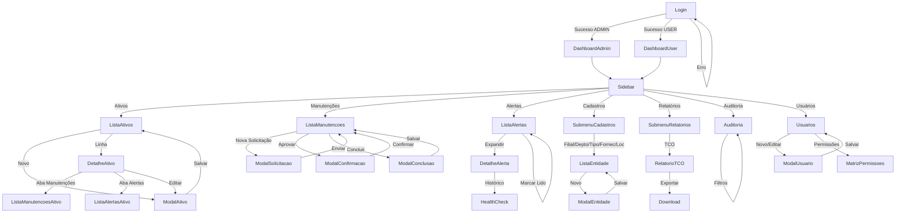

# Wireframes & Protótipos — Aegis Patrimonio

> **Versão:** 1.0 · **Owner:** Product Design · **Status:** Draft  
> **Depende de:** `user-flows.md`, `component-library.md`, `design-tokens.md`

---

## 1. Overview

Este documento especifica os **wireframes e protótipos** para o frontend do Aegis Patrimonio, mapeando cada fluxo de usuário (`user-flows.md`) às telas necessárias e aos componentes da biblioteca (`component-library.md`).  

**Estado atual:** O diagnóstico determinístico confirmou **zero componentes UI implementados** no codebase (`frontend/src/` contém apenas services/utilitários). Este documento define a **especificação de telas a serem prototipadas** (Figma/Claude Design) antes da implementação em vanilla JS + `@popperjs/core`.

**Fidelidade alvo:** Mid-fidelity (estrutura, componentes, estados, responsividade) → High-fidelity (tokens visuais aplicados) para handoff.

---

## 2. Escopo & Objetivo do Protótipo

| Item | Definição |
| :--- | :--- |
| **Problema a resolver** | Ausência total de interface no repositório; necessidade de definir telas, estados e interações antes de codificar componentes vanilla JS |
| **Fluxos cobertos** | Todos os 7 fluxos de `user-flows.md`: Login, Cadastros Mestres, Gestão de Ativos, Fluxo de Manutenção, Alertas, Relatórios/Auditoria, Usuários/Permissões |
| **Fidelidade** | **Mid-fidelity** para validação de fluxos e componentes; **High-fidelity** para telas críticas (Login, Dashboard, DataTable, Modal de Ativo) |
| **Interativo?** | **Sim** — protótipo clicável navegando entre telas, com estados de loading/erro/sucesso simulados |
| **Entregáveis** | Arquivo Figma/Claude Design com: frames por tela, componentes instanciados da library, fluxos conectados, anotações de handoff |

---

## 3. Inventário de Telas

| Tela | Fluxo(s) | Descrição | Fidelidade | Status | Componentes Principais (ref: `component-library.md`) |
| :--- | :--- | :--- | :--- | :--- | :--- |
| **Login** | Flow 1 | Tela de autenticação com email/senha, validação, loading, erro 401 | High-fi | **Planejada** | `Input` (email, password), `Button` primary, `Alert` (erro), `Logo` |
| **Dashboard (ADMIN)** | Flow 1, 6 | Visão executiva: KPIs, ativos por status, alertas recentes, TCO resumo | Mid-fi | **Planejada** | `Card` (KPIs), `DataTable` (alertas recentes), `Badge`, `Sidebar`, `Header` |
| **Dashboard (USER)** | Flow 1, 3, 5 | Visão operacional: meus ativos, manutenções pendentes, alertas não lidos | Mid-fi | **Planejada** | `Card`, `DataTable`, `Badge`, `Sidebar`, `Header` |
| **Lista de Entidades Mestre** | Flow 2 | Tabela paginada/filtrável para Filiais, Departamentos, Tipos, Fornecedores, Localizações | Mid-fi | **Planejada** | `DataTable`, `Button` (Novo), `Modal` (criação/edição), `Toast` |
| **Formulário Entidade Mestre** | Flow 2 | Modal com formulário (1-3 campos) para CRUD de dados mestres | Mid-fi | **Planejada** | `Modal`, `FormLayout`, `Input`, `Select`, `Button` |
| **Lista de Ativos** | Flow 3 | Tabela densa com filtros (filial, tipo, status, busca), ações por linha | High-fi | **Planejada** | `DataTable` (sortable, filterable, selectable, rowActions), `Badge` (status), `IconButton`, `Toolbar` (filtros) |
| **Detalhe do Ativo** | Flow 3, 4, 5 | Tela com abas: Geral, Hardware, Manutenções, Alertas, Histórico | High-fi | **Planejada** | `Tabs`, `Card` (dados principais), `DataTable` (abas), `Button` (ações), `FileUpload` (anexos hardware) |
| **Formulário de Ativo (Criar/Editar)** | Flow 3 | Modal LG com FormLayout 3 colunas, seção Hardware (sub-tabelas) | High-fi | **Planejada** | `Modal` (xl), `FormLayout`, `Input`, `Select` (loadOptions), `DatePicker`, `Textarea`, `DataTable` inline (hardware) |
| **Lista de Manutenções** | Flow 4 | Tabela com filtro de status (Aguardando, Em Andamento, Concluída, Cancelada) | Mid-fi | **Planejada** | `DataTable`, `Badge` (status), `Button` (Nova Solicitação), `Modal` (filtros avançados) |
| **Solicitação de Manutenção** | Flow 4 | Modal MD: tipo, descrição, prioridade, data desejada, ativo (pré-preenchido) | Mid-fi | **Planejada** | `Modal`, `FormLayout`, `Select`, `Textarea`, `DatePicker`, `Button` |
| **Aprovação/Execução/Conclusão** | Flow 4 | Ações de estado na linha da tabela + modais de confirmação/conclusão | Mid-fi | **Planejada** | `IconButton` (ações), `Modal` (confirmação), `FormLayout` (conclusão: custo, descrição, anexos) |
| **Lista de Alertas** | Flow 5 | Tabela com badge contador no header, filtros (não lidos, período, severidade) | Mid-fi | **Planejada** | `DataTable`, `Badge` (severidade), `Header` (notificationBell), `Button` (Marcar todos) |
| **Detalhe de Alerta / Health Check** | Flow 5 | Expansão de linha + tela dedicada com gráfico temporal (disco, SMART, temp) | Mid-fi | **Planejada** | `Card`, `Chart` (sparkline/linha — *gap conhecido*), `Tabs`, `Button` (Marcar como lido) |
| **Relatório TCO** | Flow 6 | Tabela agregada por ativo com filtros, exportação CSV/PDF | Mid-fi | **Planejada** | `DataTable`, `Select` (filtros), `Button` (Exportar), `DateRangePicker` (*gap*) |
| **Trilha de Auditoria** | Flow 6 | Tabela imutável: entidade, ID, ação, campo, antes/depois, usuário, timestamp | Mid-fi | **Planejada** | `DataTable` (readonly, dense), `Select` (entidade), `DateRangePicker` (*gap*) |
| **Gestão de Usuários** | Flow 7 | Lista usuários + modal criação/edição + matriz de permissões | Mid-fi | **Planejada** | `DataTable`, `Modal`, `FormLayout`, `Switch` (ativo/inativo), `RadioGroup` (role), `PermissionMatrix` (*custom*) |
| **Permissões (Matriz)** | Flow 7 | Grid Recurso × Ação × Role (ADMIN/USER) com checkboxes | Low-fi | **Planejada** | `Table` custom, `Checkbox`, `Tooltip` (explicação permissão) |
| **Perfil / Preferências** | Transversal | Modal drawer: dados do usuário, tema, notificações, logout | Low-fi | **Planejada** | `Drawer`, `FormLayout`, `Switch`, `Button` (danger: logout) |
| **Empty States** | Transversal | Estados vazios para: ativos, manutenções, alertas, auditoria, usuários | Mid-fi | **Planejada** | `EmptyState` (icon, title, description, action button) |
| **Estados de Erro/Offline** | Transversal | Tela/overlay de erro de rede, 403, 404, 500, manutenção | Low-fi | **Planejada** | `Alert`, `Button` (Tentar novamente), `IconButton` (refresh) |

> **Total:** 20 telas únicas + variações de estado (loading, empty, error, success).  
> **Componentes reutilizados:** 24 dos 27 planejados em `component-library.md` (excluídos: `Wizard`, `TreeSelect`, `DataGrid` virtualizado — gaps conhecidos).

---

## 4. Fluxo Prototipado (Navegação Principal)



---

## 5. Especificação por Tela

> **Convenção:** Cada tela lista objetivo, componentes (ref `component-library.md`), estados, regras de negócio (ref `user-flows.md` / `brd.md`), interações e responsividade.

---

### 5.1 Login

* **Objetivo:** Autenticar usuário (ADMIN/USER) e obter JWT tokens.
* **Componentes:** `Input` (email, password), `Button` primary (Entrar), `Alert` (erro 401/500), `Logo` (SVG).
* **Estados:**
  - **Default:** Campos vazios, botão habilitado.
  - **Loading:** Botão com spinner, inputs disabled.
  - **Erro 401:** `Alert` danger "Credenciais inválidas" + shake no card.
  - **Erro 500/Offline:** `Alert` danger "Servidor indisponível. Tente novamente." + botão "Tentar novamente".
  - **Sucesso:** Redirecionamento automático (router) → Dashboard por role.
* **Regras de negócio:** BR-01 (role ADMIN/USER), BR-10 (sessão JWT), validação client-side (email format, required).
* **Interações:**
  - Enter no password → submit.
  - "Esqueci senha" → [INFERIDO POR IA — REQUER VALIDAÇÃO HUMANA] link para fluxo de reset (não especificado no BRD).
  - AuthInterceptor injeta token em requisições subsequentes.
* **Responsividade:** Card centralizado (max-width 400px), 100% em mobile < 480px, padding `--space-6`.

---

### 5.2 Dashboard (ADMIN)

* **Objetivo:** Visão executiva imediata: saúde do patrimônio, alertas críticos, KPIs de TCO.
* **Componentes:** `Sidebar`, `Header` (notificationBell com badge), `Card` (4 KPIs), `DataTable` (últimos 5 alertas), `Badge` (status).
* **KPIs (Cards):**
  1. Total de Ativos
  2. Ativos em Manutenção
  3. Alertas Críticos Não Lidos
  4. TCO Últimos 30 dias (R$)
* **Estados:**
  - **Loading:** `Skeleton` nos cards e tabela.
  - **Empty:** `EmptyState` "Nenhum alerta recente" na tabela.
  - **Erro:** `Toast` danger + retry no header.
* **Regras:** Apenas ADMIN vê este dashboard (BR-01). Dados agregados via endpoints `/dashboard/admin/kpis`, `/dashboard/admin/alertas-recentes`.
* **Interações:**
  - Clique no card "Alertas Críticos" → navega para `/alertas?filter=critico&read=false`.
  - Clique na linha da tabela de alertas → expande detalhe (inline) ou navega para `/alertas/{id}`.
  - NotificationBell no header → dropdown com últimos 5 alertas + "Ver todos".
* **Responsividade:**
  - ≥ `--bp-xl` (1200px): 4 cards em grid 4 colunas.
  - `--bp-lg` a `--bp-xl`: 2x2 grid.
  - `< --bp-lg`: 1 coluna, cards empilhados; Sidebar vira Drawer.

---

### 5.3 Dashboard (USER)

* **Objetivo:** Visão operacional para Analista: meus ativos, manutenções pendentes, alertas não lidos.
* **Componentes:** `Sidebar`, `Header`, `Card` (3 KPIs), `DataTable` (manutenções "Em Andamento" atribuídas a mim), `Badge`.
* **KPIs:**
  1. Ativos sob minha responsabilidade (filial/departamento)
  2. Manutenções "Em Andamento" atribuídas
  3. Alertas não lidos da minha filial
* **Estados:** Igual ADMIN.
* **Regras:** USER vê apenas dados de sua filial/departamento (filtro implícito no backend).
* **Interações:** Clique em manutenção → `/manutencoes/{id}` para execução/conclusão.
* **Responsividade:** Igual ADMIN.

---

### 5.4 Lista de Entidades Mestre (Filial, Departamento, TipoAtivo, Fornecedor, Localização)

* **Objetivo:** CRUD completo de dados mestres (ADMIN only).
* **Componentes:** `DataTable` (sortable, filterable, pageSize 20), `Button` primary "Novo [Entidade]" (header toolbar), `IconButton` (editar, excluir por linha), `Modal` (formulário), `Toast` (feedback), `EmptyState`.
* **Colunas por entidade:**
  - **Filial:** Código, Nome, Endereço, Cidade/UF, Status, Ações
  - **Departamento:** Código, Nome, Filial (FK), Responsável, Ações
  - **TipoAtivo:** Código, Nome, Vida Útil Padrão (anos), Depreciação (%), Ações
  - **Fornecedor:** CNPJ, Nome Fantasia, Razão Social, Contato, Email, Ações
  - **Localização:** Código, Nome, Filial (FK), Descrição, Ações
* **Estados:**
  - **Loading:** `Skeleton` rows (5 linhas).
  - **Empty:** `EmptyState` com ação "Cadastrar primeira [entidade]".
  - **Erro 403:** `Toast` danger "Acesso negado" (BR-01) — USER não vê botão "Novo" nem ações editar/excluir.
  - **Erro 409 (excluir com FK):** `Modal` explicando dependências (ex: "15 ativos vinculados a esta filial").
* **Interações:**
  - "Novo" → `Modal` size `md` com `FormLayout` 1-2 colunas.
  - Editar → `Modal` pré-preenchido (GET by ID).
  - Excluir → `Modal` confirmação (BR-04: cascata onde aplicável).
  - Filtros: busca textual (nome/código), status (ativo/inativo).
* **Responsividade:** Tabela com scroll horizontal em `< --bp-md`; ações em `Dropdown` (Popper) para economizar espaço.

---

### 5.5 Formulário Entidade Mestre (Modal)

* **Objetivo:** Criar/editar registro de dado mestre.
* **Componentes:** `Modal` (md), `FormLayout` (colCount 1 ou 2), `Input`, `Select` (FKs: filial para departamento/localização), `Button` (Cancelar secondary, Salvar primary).
* **Campos por entidade:**
  - **Filial:** Código*, Nome*, Endereço, Cidade, UF, CEP, Telefone, Email, Status (Select: ATIVO/INATIVO)
  - **Departamento:** Código*, Nome*, Filial* (Select loadOptions), Responsável (Select usuários), Status
  - **TipoAtivo:** Código*, Nome*, Vida Útil Padrão* (number), Taxa Depreciação* (number step 0.01), Status
  - **Fornecedor:** CNPJ* (mask), Nome Fantasia*, Razão Social, Contato, Telefone, Email, Endereço, Status
  - **Localização:** Código*, Nome*, Filial* (Select), Descrição, Status
* **Validações:** Required, unique (código/CNPJ), FK existe, formatos (CNPJ, CEP, email).
* **Estados:** Loading no botão Salvar, erros inline (`Input.error`), sucesso → `Toast` + fecha modal + tabela refresca.
* **Acessibilidade:** Focus trap no modal, `aria-labelledby` no título, labels associados, `aria-invalid` nos erros.

---

### 5.6 Lista de Ativos (Tela Principal)

* **Objetivo:** Listar, buscar, filtrar, paginar ativos; acessar detalhe; criar novo (ADMIN).
* **Componentes:** `DataTable` (config completa), `Toolbar` (filtros + busca + botão novo), `Badge` (status), `IconButton` (rowActions), `EmptyState`, `Skeleton`.
* **Colunas (config `DataTable.columns`):**
  | Key | Label | Width | Sortable | Render |
  | :--- | :--- | :--- | :--- | :--- |
  | `tag` | Tag | 120px | Sim | Texto |
  | `nome` | Nome | min 200px | Sim | Texto |
  | `tipo.nome` | Tipo | 150px | Sim | `Badge` variant info |
  | `filial.nome` | Filial | 180px | Sim | Texto |
  | `departamento.nome` | Departamento | 180px | Sim | Texto |
  | `localizacao.nome` | Localização | 180px | Não | Texto ou — |
  | `status` | Status | 130px | Sim | `Badge` (variant semântico) |
  | `actions` | Ações | 100px | Não | `IconButton` group (Ver, Editar, Excluir) |
* **Filtros (toolbar acima da tabela):**
  - Busca textual (tag, nome) — debounce 300ms
  - Select Filial (loadOptions)
  - Select Tipo (loadOptions)
  - Select Status (options fixos)
  - Botão "Limpar filtros"
* **RowActions (condicionais por role/estado):**
  - **Ver** (sempre) → `/ativos/{id}`
  - **Editar** (ADMIN) → `ModalAtivo` edição
  - **Excluir** (ADMIN, status ≠ EM_MANUTENCAO) → confirmação
  - **Nova Manutenção** (USER/ADMIN) → `ModalSolicitacao` com ativoId pré-preenchido
* **Estados:**
  - **Loading:** `Skeleton` 5 linhas + toolbar disabled.
  - **Empty:** `EmptyState` "Nenhum ativo encontrado" + botão "Cadastrar primeiro ativo" (ADMIN).
  - **Erro 500:** `Toast` danger + botão retry na toolbar.
* **Regras:** BR-02 (validações), BR-03 (tag único), BR-04 (cascata hardware), BR-08 (TCO), paginação server-side (p95 < 2s).
* **Responsividade:**
  - ≥ `--bp-lg`: Tabela completa, rowActions visíveis.
  - `--bp-md` a `--bp-lg`: Colunas "Localização" e "Departamento" ocultas (priority), rowActions em `Dropdown`.
  - `< --bp-md`: Cards empilhados (transformação `DataTable` → `Card` list) — *requer componente `DataTable` responsivo ou view alternativa*.

---

### 5.7 Detalhe do Ativo

* **Objetivo:** Visualização completa + ações contextuais + abas de relacionamentos.
* **Componentes:** `Header` (breadcrumb + ações), `Card` (dados principais), `Tabs` (4 abas), `DataTable` (cada aba), `Button` (ações primárias), `Badge` (status grande).
* **Layout:**
  ```
  [Breadcrumb: Início > Ativos > AT-2024-001]  [Badge Status Grande] [Botões: Editar | Nova Manutenção | Baixar]
  ┌─────────────────────────────────────────────────────────────────────────────┐
  │ Card: Dados Principais                                                      │
  │ ┌─────────┬──────────────┬─────────┬──────────────┬─────────┬────────────┐ │
  │ │ Tag     │ AT-2024-001  │ Tipo    │ Notebook     │ Filial  │ Matriz SP  │ │
  │ │ Nome    │ MacBook Pro  │ Depto   │ TI           │ Local   │ Sala 301   │ │
  │ │ Fornec. │ Dell Brasil  │ Aquisi. │ 15/03/2023   │ Valor   │ R$ 12.500  │ │
  │ │ Vida Ú. │ 5 anos       │ Deprec. │ 20%/ano      │ TCO     │ R$ 2.340   │ │
  │ └─────────┴──────────────┴─────────┴──────────────┴─────────┴────────────┘ │
  ├─────────────────────────────────────────────────────────────────────────────┤
  │ Tabs: [Geral] [Hardware] [Manutenções] [Alertas] [Histórico]                │
  │                                                                             │
  │ [Aba Hardware] DataTable: Memórias | Discos | Adaptadores Rede              │
  │   - Cada sub-tabela com IconButton (Adicionar, Editar, Excluir)             │
  │   - Exclusão cascata (BR-04)                                                │
  │                                                                             │
  │ [Aba Manutenções] DataTable: Tipo, Status, Data, Responsável, Custo, Ações  │
  │   - Ação "Ver" → /manutencoes/{id}                                          │
  │                                                                             │
  │ [Aba Alertas] DataTable: Tipo, Severidade, Mensagem, Data, Lido, Ações      │
  │   - Ação "Marcar como lido" + "Ver histórico"                               │
  │                                                                             │
  │ [Aba Histórico] AuditLog: Campo, Valor Anterior, Valor Novo, Usuário, Data  │
  └─────────────────────────────────────────────────────────────────────────────┘
  ```
* **Estados:**
  - **Loading:** `Skeleton` no card + tabs com `Skeleton` rows.
  - **Erro 404:** `Alert` danger "Ativo não encontrado" + botão "Voltar à lista".
  - **Aba Hardware vazia:** `EmptyState` por sub-tabela + botão "Adicionar [componente]".
* **Interações:**
  - "Editar" → `ModalAtivo` edição (preenchido).
  - "Nova Manutenção" → `ModalSolicitacao` com ativoId.
  - "Baixar" (ADMIN, status ATIVO) → `Modal` confirmação → PUT status BAIXADO.
  - Hardware: "Adicionar Memória/Disco/Adaptador" → `Modal` específico (campos técnicos).
* **Responsividade:** Card principal em grid 2 colunas (mobile) → 6 colunas (desktop). Tabs: scroll horizontal em mobile. Tabelas das abas: cards empilhados em mobile.

---

### 5.8 Formulário de Ativo (Modal Criar/Editar)

* **Objetivo:** Cadastro completo de ativo com hardware opcional.
* **Componentes:** `Modal` (xl, 960px), `FormLayout` (colCount 3), `Input`, `Select` (loadOptions para FKs), `DatePicker`, `Textarea`, `DataTable` inline (Hardware: 3 sub-tabelas com CRUD próprio), `Button` (footer).
* **Campos (FormLayout fields):**
  - Linha 1: Tag* (span 1), Nome* (span 2)
  - Linha 2: Descrição (span 3, Textarea rows 3)
  - Linha 3: Tipo* (span 1), Filial* (span 1), Departamento* (span 1)
  - Linha 4: Localização (span 1), Fornecedor (span 1), Status* (span 1)
  - Linha 5: Data Aquisição* (span 1), Valor Aquisição (span 1), Vida Útil (span 1)
  - **Seção Hardware (aba separada ou accordion dentro do modal):**
    - 3 `DataTable` compactas: Memórias, Discos, Adaptadores
    - Cada uma: colunas específicas + `IconButton` Adicionar/Editar/Excluir
    - "Adicionar" → `Modal` size `sm` com campos do componente
* **Validações:**
  - Tag único (asyncValidator on blur)
  - Data aquisição ≤ hoje
  - Valor ≥ 0, Vida útil 1-50
  - FKs existem (Select loadOptions garante)
* **Estados:**
  - **Loading:** Botão Salvar com spinner, modal disabled.
  - **Erro 400:** Erros inline nos campos + `Toast` danger resumo.
  - **Sucesso:** `Toast` success → fecha modal → `DataTable` refresh → navega para detalhe (criação) ou mantém no detalhe (edição).
* **Acessibilidade:** Focus trap, `aria-describedby` nos erros, labels corretos, Tab order lógico.
* **Responsividade:** Modal `max-width: 95vw` em mobile, `FormLayout` colCount 1, tabelas hardware como cards.

---

### 5.9 Lista de Manutenções

* **Objetivo:** Acompanhar ciclo de vida das manutenções (solicitação → aprovação → execução → conclusão).
* **Componentes:** `DataTable` (filterable por status), `Button` "Nova Solicitação" (USER+ADMIN), `Badge` (status), `IconButton` (ações por estado/role), `Modal` (filtros avançados), `EmptyState`.
* **Colunas:**
  | Key | Label | Render |
  | :--- | :--- | :--- |
  | `ativo.tag` / `ativo.nome` | Ativo | Link para detalhe |
  | `tipo` | Tipo | `Badge` (preventiva=info, corretiva=warning) |
  | `status` | Status | `Badge` semântico (aguardando=manutencao, andamento=info, concluida=success, cancelada=neutral) |
  | `prioridade` | Prioridade | `Badge` (baixa=neutral, media=info, alta=warning, critica=critico) |
  | `dataDesejada` | Data Desejada | Data formatada |
  | `responsavel.nome` | Responsável | — |
  | `custoReal` | Custo (R$) | Formatado (apenas concluídas) |
  | `actions` | Ações | Condicionais (ver abaixo) |
* **RowActions por status/role:**
  | Status | USER (Solicitante) | ADMIN (Gestor) |
  | :--- | :--- | :--- |
  | AGUARDANDO_APROVACAO | Ver | Ver, **Aprovar**, **Cancelar** |
  | EM_ANDAMENTO | Ver, **Iniciar Execução**, **Concluir** | Ver, **Cancelar** |
  | CONCLUIDA | Ver | Ver |
  | CANCELADA | Ver | Ver |
* **Filtros (toolbar):** Status (multi-select), Período (DateRangePicker*), Filial, Tipo, Prioridade.
* **Estados:** Loading, Empty ("Nenhuma manutenção"), Erro.
* **Responsividade:** Igual Lista de Ativos.

---

### 5.10 Solicitação de Manutenção (Modal)

* **Objetivo:** USER cria solicitação de manutenção preventiva/corretiva.
* **Componentes:** `Modal` (md), `FormLayout` (colCount 2), `Select` (tipo: preventiva/corretiva), `Textarea` (descrição*), `Select` (prioridade), `DatePicker` (data desejada*), `Input` hidden (ativoId pré-preenchido), `Button` (Cancelar, Enviar).
* **Validações:** Descrição min 10 chars, data desejada ≥ hoje, prioridade obrigatória.
* **Estados:** Loading no submit, erros inline, sucesso → `Toast` "Enviada para aprovação" → fecha modal → lista refresca com status AGUARDANDO_APROVACAO.
* **Regras:** BR-01 (USER pode criar), createdAt/createdBy automático.

---

### 5.11 Aprovação / Execução / Conclusão / Cancelamento (Modais)

* **Aprovação (ADMIN):** `Modal` sm confirmação "Aprovar esta manutenção?" → PUT `/manutencoes/{id}/aprovar` → status EM_ANDAMENTO + approvedAt/approvedBy.
* **Iniciar Execução (USER responsável):** `Modal` sm "Iniciar execução agora?" → PUT startedAt/startedBy.
* **Conclusão (USER responsável):** `Modal` lg `FormLayout`: Data Conclusão*, Custo Real* (number), Descrição Serviço* (Textarea), Responsável Execução* (Select usuários), Anexos (FileUpload multiple). PUT `/concluir` → status CONCLUIDA + concludedAt/concludedBy/custo → atualiza TCO ativo (BR-08).
* **Cancelamento (ADMIN):** `Modal` md: Motivo* (Textarea) → PUT `/cancelar` → status CANCELADA + cancelledAt/cancelledBy/motivo.
* **Estados:** Loading, erros inline, sucesso → `Toast` + lista refresca.

---

### 5.12 Lista de Alertas

* **Objetivo:** Centralizar alertas de saúde (disco, hardware) com ações de leitura.
* **Componentes:** `Header` (notificationBell com badge contador não lidos), `DataTable` (filterable: não lidos, últimos 30d, por ativo/filial, severidade), `Badge` (severidade), `Button` "Marcar todos como lidos", `IconButton` (marcar lido individual), `EmptyState`.
* **Colunas:**
  | Key | Label | Render |
  | :--- | :--- | :--- |
  | `ativo.tag` / `ativo.nome` | Ativo | Link |
  | `tipo` | Tipo | `Badge` (DISCO_CRITICO=critico, HARDWARE_DEGRADADO=warning, etc.) |
  | `severidade` | Severidade | `Badge` (critico, alta, media, baixa) |
  | `mensagem` | Mensagem | Texto truncado (tooltip completo) |
  | `createdAt` | Data | Relative time (ex: "2h atrás") |
  | `readAt` | Status | `Badge` dot (verde=lido, vermelho=não lido) |
  | `actions` | Ações | `IconButton` Marcar Lido / Ver Detalhes |
* **Filtros:** Não lidos (toggle), Período (DateRangePicker*), Severidade (multi), Filial, Ativo (busca).
* **Estados:** Loading, Empty ("Nenhum alerta no período"), Erro.
* **Interações:**
  - Marcar lido individual → PUT `/alertas/{id}/ler` → badge contador decrementa, linha muda estilo (opacity 0.6, texto riscado?).
  - "Marcar todos como lidos" → PUT `/alertas/ler-todos` (apenas visíveis/filtro atual).
  - "Ver Detalhes" → expande linha inline (métricas) + link "Ver Histórico Completo" → `/alertas/{id}/health-check`.
* **Responsividade:** Tabela → cards em mobile; ações em dropdown.

---

### 5.13 Detalhe de Alerta / Health Check

* **Objetivo:** Visualizar métricas temporais do ativo (disco %, temperatura, SMART).
* **Componentes:** `Card` (alerta atual), `Tabs` (por métrica: Disco, Temperatura, SMART), `Chart` (linha temporal — *gap: Chart component*), `Button` "Marcar como lido", `DateRangePicker` (*gap*) para filtro de período.
* **Layout:**
  ```
  [Header: Alerta DISCO_CRITICO - Ativo AT-2024-001] [Badge Critico] [Botão: Marcar como Lido]
  ┌────────────────────────────────────────────────────────────────────┐
  │ Card: Detalhe do Alerta                                            │
  │ Tipo: Disco Crítico | Ativo: MacBook Pro (AT-2024-001)             │
  │ Mensagem: "Disco C: com 3% livre (limite 10%)"                     │
  │ Detectado em: 15/01/2025 14:32 | Status: Não lido                  │
  ├────────────────────────────────────────────────────────────────────┤
  │ Tabs: [Uso de Disco %] [Temperatura °C] [Status SMART]             │
  │                                                                    │
  │ [Chart: Linha temporal 30d/90d]  [Filtro: Últimos 30d ▼]          │
  │                                                                    │
  │ Tooltip no hover: data, valor, threshold                           │
  └────────────────────────────────────────────────────────────────────┘
  ```
* **Estados:** Loading chart (Skeleton), Empty (sem dados históricos), Erro.
* **Gap conhecido:** Componente `Chart` não existe na library — definir se `uPlot`/`Chart.js` ou SVG custom.

---

### 5.14 Relatório TCO (Total Cost of Ownership)

* **Objetivo:** Agregar custos de manutenções concluídas por ativo/filial/departamento/tipo.
* **Componentes:** `DataTable` (aggregated data), `FormLayout` inline (filtros: período, filial, departamento, tipo), `DateRangePicker` (*gap*), `Select` (loadOptions), `Button` "Exportar CSV" / "Exportar PDF", `EmptyState`.
* **Colunas da tabela agregada:**
  | Key | Label |
  | :--- | :--- |
  | `ativo.tag` | Tag |
  | `ativo.nome` | Ativo |
  | `ativo.tipo.nome` | Tipo |
  | `ativo.filial.nome` | Filial |
  | `ativo.departamento.nome` | Departamento |
  | `totalManutencoes` | Qtd. Manutenções |
  | `custoTotal` | Custo Total (R$) |
  | `custoMedio` | Custo Médio/Manut. (R$) |
* **Filtros:** Período (início/fim), Filial, Departamento, Tipo de Ativo.
* **Exportação:** GET `/relatorios/tco?format=csv|pdf&...` → download blob.
* **Estados:** Loading (overlay na tabela), Empty, Erro exportação (timeout → `Toast` warning).
* **Regras:** BR-08 (agregação apenas manutenções CONCLUIDAS), apenas ADMIN.

---

### 5.15 Trilha de Auditoria

* **Objetivo:** Rastreabilidade completa de alterações (compliance LGPD/SOX).
* **Componentes:** `DataTable` (dense, readonly, sortable), `Select` (entidade: Ativo, Manutenção, Filial, etc.), `DateRangePicker` (*gap*), `Select` (usuário), `Select` (ação: CREATE/UPDATE/DELETE), `Button` "Exportar Evidências (CSV)".
* **Colunas:**
  | Key | Label |
  | :--- | :--- |
  | `entidade` | Entidade |
  | `entidadeId` | ID |
  | `acao` | Ação (CREATE/UPDATE/DELETE) |
  | `campo` | Campo Alterado |
  | `valorAnterior` | Valor Anterior |
  | `valorNovo` | Valor Novo |
  | `usuario.nome` / `usuario.email` | Usuário |
  | `timestamp` | Data/Hora (ISO) |
* **Estados:** Loading, Empty, Erro.
* **Regras:** Apenas ADMIN + Auditor (read-only). Imutável (sem ações de edição/exclusão).

---

### 5.16 Gestão de Usuários

* **Objetivo:** CRUD usuários + atribuição de roles + matriz de permissões.
* **Componentes:** `DataTable` (colunas: Nome, Email, Role, Status, Último Login, Ações), `Modal` (criar/editar), `FormLayout`, `Input`, `Select` (role: ADMIN/USER), `Switch` (ativo/inativo), `Button` "Reset Senha", `IconButton` (Logout forçado), `Modal` (Matriz de Permissões).
* **Modal Criação/Edição:** Nome*, Email*, Role*, Senha* (apenas criação), Status (Switch).
* **Matriz de Permissões (tela dedicada ou Modal xl):**
  - Linhas: Recursos (Ativos, Manutenções, Filiais, Departamentos, Tipos, Fornecedores, Localizações, Usuários, Relatórios, Auditoria, Alertas)
  - Colunas: CREATE, READ, UPDATE, DELETE
  - Células: `Checkbox` por role (ADMIN/USER) — ADMIN sempre all true (disabled).
  - Salvar → PUT `/permissoes` (bulk).
* **Logout Forçado:** `IconButton` danger na linha → `Modal` confirmação → DELETE `/sessoes/{userId}` → `Toast` "Sessões revogadas".
* **Estados:** Loading, Empty, Erro 409 (email duplicado), Sucesso.

---

### 5.17 Perfil / Preferências (Drawer)

* **Objetivo:** Usuário logado gerencia próprio perfil, tema, notificações.
* **Componentes:** `Drawer` (right, md), `FormLayout`, `Input` (nome, email readonly), `Switch` (tema escuro, notificações email, notificações push), `Button` (Salvar secondary, Sair danger).
* **Estados:** Loading save, sucesso `Toast`, erro validação.

---

### 5.18 Empty States (Padrão)

* **Padrão visual:** `EmptyState` component com:
  - Ícone ilustrativo (SVG 64x64, cor `--color-text-muted`)
  - Título (ex: "Nenhum ativo cadastrado")
  - Descrição (ex: "Comece cadastrando seu primeiro ativo para acompanhar o patrimônio.")
  - Ação primária (Button: "Cadastrar Ativo" / "Criar Manutenção" / "Ver Filtros")
* **Variações por tela:**
  - Lista Ativos: ícone `box`, ação "Novo Ativo" (ADMIN) ou "Ajustar filtros" (USER)
  - Lista Manutenções: ícone `tool`, ação "Nova Solicitação"
  - Lista Alertas: ícone `bell-off`, ação "Verificar filtros"
  - Auditoria: ícone `shield`, ação "Ajustar período"
  - Usuários: ícone `users`, ação "Convidar usuário"

---

### 5.19 Estados de Erro / Offline (Padrão)

| Cenário | Componente | Comportamento |
| :--- | :--- | :--- |
| **Erro de rede (offline/timeout)** | `Alert` fixed bottom-right (persistent) + `Button` "Tentar novamente" | Re-executa última request falha |
| **401 Sessão expirada** | `Modal` sm (backdrop blur) | "Sua sessão expirou. Faça login novamente." → redirect `/login?redirect=current` |
| **403 Acesso negado** | `Toast` danger + redirect dashboard | "Acesso negado. Apenas administradores podem realizar esta ação." |
| **404 Recurso não encontrado** | `Alert` danger inline na tela | "Recurso não encontrado. [Voltar à lista]" |
| **500 Erro servidor** | `Toast` danger + `Button` "Reportar" (mailto) | "Erro interno. Nossa equipe foi notificada." |
| **Manutenção programada** | `Alert` warning full-screen (maintenance mode) | "Sistema em manutenção. Retorno previsto: 02:00." |

---

## 6. Feedback & Iterações

| Data | Autor | Feedback | Resolução |
| :--- | :--- | :--- | :--- |
| [DD/MM/AAAA] | [Product Owner] | [Ex: Adicionar filtro "Meus ativos" no dashboard USER] | [Pendente / Implementado no frame v2] |
| [DD/MM/AAAA] | [Tech Lead] | [Ex: DataTable virtualizado necessário para >10k ativos] | [Registrado como gap: DataGrid virtualizado] |
| [DD/MM/AAAA] | [UX Designer] | [Ex: Wizard para criação de ativo com hardware em etapas] | [Registrado como gap: Wizard/Stepper component] |

---

## 7. Critérios de Aprovação

- [ ] Todos os 7 fluxos de `user-flows.md` têm telas correspondentes prototipadas
- [ ] 100% dos componentes utilizados existem em `component-library.md` (ou gaps documentados)
- [ ] Estados cobertos: **Default, Loading, Empty, Error, Success** para cada tela
- [ ] Regras de negócio (BR-01 a BR-10) validadas nas interações e validações
- [ ] Responsividade validada em 3 breakpoints: mobile (< `--bp-md`), tablet (`--bp-md` a `--bp-lg`), desktop (`> --bp-lg`)
- [ ] Acessibilidade básica: ordem de foco, labels, `aria-*`, contraste (tokens), focus visible
- [ ] Revisado por: Product Owner, Tech Lead, UX Designer, Accessibility Champion
- [ ] Handoff pronto: specs de spacing, tokens, assets exportados, componentes novos no `component-library.md`

---

## 8. Handoff para Desenvolvimento

| Item | Especificação |
| :--- | :--- |
| **Design Tokens** | `design-tokens.md` → `frontend/src/styles/tokens.css` (CSS Custom Properties) |
| **Medidas/Spacing** | Base 4px (`--space-1` = 4px), scale: 1,2,3,4,5,6,8,10,12,16,20,24 |
| **Breakpoints** | `--bp-sm: 480px`, `--bp-md: 768px`, `--bp-lg: 1024px`, `--bp-xl: 1280px` |
| **Assets** | Ícones: `frontend/src/assets/icons/` (SVG otimizados, 24x24 viewBox) — usar `lucide` ou `heroicons` como base |
| **Imagens** | Logo: `logo.svg`, `logo-dark.svg`; Placeholders: `/placeholders/` |
| **Componentes novos necessários** | `Wizard` (Flow 3, 4), `TreeSelect` (Flow 2), `DataGrid` virtualizado (Flow 3), `Chart` (Flow 5, 6), `DateRangePicker` (Flow 6) — adicionar ao `component-library.md` antes do sprint |
| **Estrutura de pastas (planejada)** |
| `frontend/src/components/` | 27 arquivos `.js` (um por componente) + `index.js` barrel |
| `frontend/src/screens/` | Um arquivo por tela (ex: `LoginScreen.js`, `AtivosListScreen.js`) — orquestra componentes |
| `frontend/src/router.js` | SPA router simples (hash ou history) — mapeia rotas às screens |
| `frontend/src/styles/` | `tokens.css`, `global.css`, `components.css` (opcional, se não usar CSS-in-JS) |
| **Convenção de nomenclatura** | `createComponentName` (factory), `kebab-case` arquivos, `PascalCase` exports |

---

## 9. Referências

* **User Flows:** `user-flows.md` (este repositório) — fonte de verdade para fluxos, regras, estados
* **Component Library:** `component-library.md` (este repositório) — inventário e specs de 27 componentes
* **Design Tokens:** `design-tokens.md` (a criar) — cores, espaçamento, tipografia, motion, z-index, breakpoints, tokens semânticos
* **Business Requirements:** `docs/brd.md` — BR-01 a BR-10, KPIs, personas, guardrails
* **Glossário Ubíquo:** `docs/glossario.md` <!-- source: glossario#L1-L75 --> — nomenclatura de domínio
* **Diagnóstico Determinístico:** `docs/diagnostico.md` — confirma stack vanilla JS + Popper.js only
* **Protótipo (Figma/Claude Design):** [INFERIDO POR IA — REQUER VALIDAÇÃO HUMANA] Link a ser preenchido após criação
* **WCAG 2.1 AA Checklist:** Aplicado a todos os componentes e telas

---

> **Próximos passos (Design → Dev):**
> 1. [ ] Criar arquivo Figma/Claude Design com frames baseados neste inventário
> 2. [ ] Validar fluxos com Product Owner e Tech Lead (reunião de 1h)
> 3. [ ] Definir `design-tokens.md` (cores, spacing, type, motion) — base para componentes
> 4. [ ] Marcar componentes como "Aprovado para Dev" no `component-library.md`
> 5. [ ] Iniciar implementação: `Button`, `Input`, `Select`, `Modal`, `Toast`, `DataTable` (core)
> 6. [ ] Configurar `tokens.css` + `global.css` no entry point `frontend/src/main.js`
> 7. [ ] Implementar `Sidebar` + `Header` + `Router` → shell da aplicação
> 8. [ ] Construir telas na ordem: Login → Dashboard → Lista Ativos → Detalhe Ativo → Manutenções → Alertas → Relatórios → Usuários