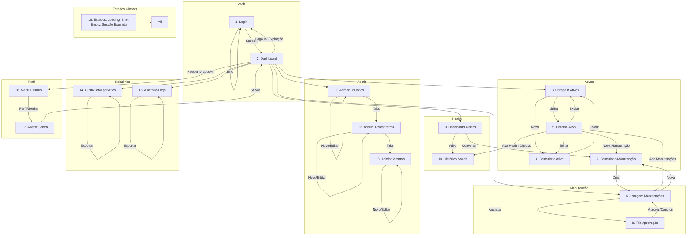

# Wireframes & Protótipos — Aegis Patrimônio

> **Versão:** 1.0 · **Owner:** Product Design · **Status:** Draft  
> **Depende de:** [user-flows.md](user-flows.md), [component-library.md](component-library.md)

---

## 1. Overview

Este documento define o **escopo, inventário e especificação das telas** a serem prototipadas para o MVP do Aegis Patrimônio, derivados diretamente dos 6 fluxos de usuário em [user-flows.md](user-flows.md) e dos 29 componentes propostos em [component-library.md](component-library.md).  

**Estado atual:** O diagnóstico determinístico confirmou **zero componentes de UI existentes** no codebase (apenas 15 arquivos JS de serviços em `frontend/src/services/`). Nenhum arquivo de design (Figma, Sketch, Adobe XD) foi encontrado no repositório.  

**Objetivo deste artefato:** Servir como *single source of truth* para a criação dos wireframes de alta fidelidade (high-fidelity) e protótipo clicável no Figma, garantindo cobertura 1:1 dos fluxos, estados de UI, regras de negócio e componentes necessários.

---

## 2. Escopo & Objetivo do Protótipo

| Item | Definição |
| :--- | :--- |
| **Problema a resolver** | Ausência total de interface de usuário para um sistema de gestão de patrimônio com 6 fluxos críticos (ativos, manutenção, health checks, RBAC, relatórios, auth). |
| **Fluxos cobertos** | Todos os 6 fluxos de [user-flows.md](user-flows.md): 1. Cadastro e Gestão de Ativo (CRUD) 2. Solicitação e Aprovação de Manutenção 3. Health Check de Hardware e Alertas Preditivos 4. Gestão de RBAC e Provisionamento de Usuários 5. Relatórios Financeiros e Auditoria 6. Autenticação e Gestão de Sessão |
| **Fidelidade** | **High-fidelity (visual completo)** — cores, tipografia, espaçamento, ícones e estados interativos fiéis aos [design-tokens.md](design-tokens.md) e [component-library.md](component-library.md). Wireframes de baixa fidelidade **não** serão entregues separadamente; o protótipo high-fi valida layout, copy, acessibilidade e handoff simultaneamente. |
| **Interativo?** | **Sim** — protótipo clicável no Figma com navegação entre telas, overlays (modais, dropdowns, toasts), estados de loading/error/empty, validação de formulário client-side simulada, e fluxos de autenticação (login → dashboard → logout). |
| **Escopo FORA do MVP** | Gráficos/gráficos de tendência (`aegis-chart`), upload de arquivos (`aegis-file-upload`), editor rich text (`aegis-rich-text-editor`), wizard multi-etapa (`aegis-wizard`), picker avançado de usuários/ativos (`aegis-user-picker`, `aegis-asset-picker`), matriz de permissões visual (`aegis-permission-matrix`). Ver [component-library.md#6-gaps-conhecidos](component-library.md#6-gaps-conhecidos). |

---

## 3. Inventário de Telas

| # | Tela | Fluxo(s) | Descrição Resumida | Fidelidade | Status | Componentes Principais (ref. component-library.md) |
| :--- | :--- | :--- | :--- | :--- | :--- | :--- |
| 1 | **Login** | 6 | Tela pública de autenticação (email/senha, "Lembrar-me", link "Esqueci senha", botão SSO futuro) | High-fi | **Pendente** | `aegis-login-form`, `aegis-input`, `aegis-button`, `aegis-alert-banner`, `aegis-toast-container` |
| 2 | **Dashboard / Home** | 1, 3, 5 | Visão geral: cards de estatísticas (ativos totais, manutenções pendentes, alertas críticos), health checks recentes, ações rápidas | High-fi | **Pendente** | `aegis-stat-card`, `aegis-health-indicator`, `aegis-card`, `aegis-data-table` (resumo), `aegis-sidebar`, `aegis-header` |
| 3 | **Listagem de Ativos** | 1 | Tabela paginada, filtrável, ordenável, com ações em linha (editar, manutenção, excluir) e toolbar (busca, filtros, "Novo Ativo") | High-fi | **Pendente** | `aegis-data-table`, `aegis-filter-bar`, `aegis-button`, `aegis-dropdown`, `aegis-badge`, `aegis-toast`, `aegis-loading`, `aegis-empty-state` |
| 4 | **Formulário de Ativo (Criar/Editar)** | 1 | Modal ou página dedicada com seções: Identificação, Tipo, Localização, Departamento, Filial, Fornecedor, Financeiro (valor, data aquisição, vida útil), Hardware (opcional) | High-fi | **Pendente** | `aegis-modal` (ou página), `aegis-form`, `aegis-input`, `aegis-select`, `aegis-date-picker`, `aegis-textarea`, `aegis-button`, `aegis-toast` |
| 5 | **Detalhe do Ativo** | 1, 2, 3 | Visualização completa: abas "Geral", "Manutenções", "Health Checks", "Auditoria"; ações contextuais | High-fi | **Pendente** | `aegis-tabs`, `aegis-card`, `aegis-data-table`, `aegis-badge`, `aegis-health-indicator`, `aegis-button`, `aegis-dropdown`, `aegis-confirm-dialog` |
| 6 | **Listagem de Manutenções** | 2 | Tabela com filtros de status (PENDENTE, APROVADA, EM_ANDAMENTO, CONCLUIDA, CANCELADA), tipo, prioridade, período; ações: nova, aprovar, concluir, cancelar | High-fi | **Pendente** | `aegis-data-table`, `aegis-filter-bar`, `aegis-button`, `aegis-badge`, `aegis-dropdown`, `aegis-toast`, `aegis-loading`, `aegis-empty-state` |
| 7 | **Formulário de Manutenção (Criar/Editar)** | 2 | Modal: tipo (preventiva/corretiva), prioridade, descrição, data desejada, ativo (picker), campos condicionais para conclusão (custo, peças, mão de obra) | High-fi | **Pendente** | `aegis-modal`, `aegis-form`, `aegis-select`, `aegis-radio-group`, `aegis-date-picker`, `aegis-textarea`, `aegis-input` (number), `aegis-button` |
| 8 | **Fila de Aprovação (Analista)** | 2 | Visão kanban ou tabela agrupada por status; ações rápidas: aprovar, cancelar (com justificativa), solicitar info | High-fi | **Pendente** | `aegis-data-table` (ou kanban custom), `aegis-modal` (justificativa), `aegis-textarea`, `aegis-button`, `aegis-toast` |
| 9 | **Dashboard de Alertas / Health Checks** | 3 | Lista de alertas ativos (severidade, tipo, ativo, valor, threshold), histórico de health checks por ativo, botão "Converter em Manutenção Preventiva" | High-fi | **Pendente** | `aegis-data-table`, `aegis-health-indicator`, `aegis-badge`, `aegis-button`, `aegis-dropdown`, `aegis-toast`, `aegis-loading`, `aegis-empty-state` |
| 10 | **Histórico de Saúde do Ativo** | 3 | Gráfico de tendência (sparkline) + tabela temporal de métricas (disco, memória, rede) — *gráfico fora do MVP, tabela dentro* | High-fi | **Pendente** | `aegis-data-table`, `aegis-card`, `aegis-health-indicator`, `aegis-tabs` (se múltiplas métricas) |
| 11 | **Administração: Usuários** | 4 | Aba "Usuários" do painel admin: tabela com CRUD, roles, departamentos, filiais; botão "Novo Usuário" → `createUserAndToken` | High-fi | **Pendente** | `aegis-tabs`, `aegis-data-table`, `aegis-modal`, `aegis-form`, `aegis-input`, `aegis-select`, `aegis-switch`, `aegis-button`, `aegis-toast`, `aegis-confirm-dialog` |
| 12 | **Administração: Roles & Permissões** | 4 | Aba "Roles/Permissões": CRUD de roles, associação role↔permission (matriz simplificada no MVP: select múltiplo) | High-fi | **Pendente** | `aegis-tabs`, `aegis-data-table`, `aegis-modal`, `aegis-form`, `aegis-select` (multiple), `aegis-button`, `aegis-toast` |
| 13 | **Administração: Entidades Mestras** | 4 | Aba "Mestras": subtabs para Departamento, Filial, Fornecedor, Funcionário, Tipo de Ativo — cada uma com CRUD simples | High-fi | **Pendente** | `aegis-tabs`, `aegis-data-table`, `aegis-modal`, `aegis-form`, `aegis-input`, `aegis-select`, `aegis-button`, `aegis-toast` |
| 14 | **Relatório: Custo Total por Ativo** | 5 | Filtros (período, filial, departamento, tipo, status), tabela agregada (Ativo, Tag, Total Manutenções, Qtd, Última), exportação CSV/Excel | High-fi | **Pendente** | `aegis-filter-bar`, `aegis-data-table`, `aegis-export-button`, `aegis-loading`, `aegis-empty-state`, `aegis-toast` |
| 15 | **Auditoria / Trilha de Logs** | 5 | Filtros (entidade, ação, usuário, período), tabela imutável (timestamp, usuário, entidade, ação, diff), exportação evidência | High-fi | **Pendente** | `aegis-filter-bar`, `aegis-audit-log-table`, `aegis-export-button`, `aegis-modal` (diff viewer), `aegis-loading`, `aegis-empty-state` |
| 16 | **Perfil / Menu do Usuário** | 6 | Dropdown no header: nome, papel, "Meu Perfil", "Alterar Senha", "Sair" | High-fi | **Pendente** | `aegis-dropdown`, `aegis-avatar`, `aegis-button`, `aegis-modal` (perfil/senha) |
| 17 | **Alterar Senha / Perfil** | 6 | Modal com senha atual, nova senha, confirmação; validação client-side | High-fi | **Pendente** | `aegis-modal`, `aegis-form`, `aegis-input` (type=password), `aegis-button`, `aegis-toast` |
| 18 | **Estados Globais** | Todos | Templates para: loading full-screen, erro 403/404/5xx, sessão expirada (com restauração de formulário), offline | High-fi | **Pendente** | `aegis-loading` (overlay), `aegis-alert-banner`, `aegis-toast`, `aegis-empty-state`, `aegis-button` |

**Total: 18 telas únicas** (algumas compartilham estrutura — ex: listagens usam `aegis-data-table` + `aegis-filter-bar` + toolbar).

---

## 4. Fluxo Prototipado (Navegação Principal)

---

## 5. Especificação por Tela

> **Convenção:** Cada tela referencia componentes de [component-library.md](component-library.md) pelo nome exato (ex: `aegis-data-table`). Estados obrigatórios: **Default, Loading, Empty, Error, Success** (conforme [user-flows.md#estados-de-ui-cobertos](user-flows.md)). Regras de negócio referenciam BR-01 a BR-10 de [user-flows.md](user-flows.md).

---

### 5.1 Login

* **Objetivo do usuário:** Autenticar-se para acessar o sistema; recuperar sessão expirada preservando contexto.
* **Componentes utilizados:** `aegis-login-form`, `aegis-input` (email, password), `aegis-button` (primary, full-width, loading), `aegis-alert-banner` (erro 401), `aegis-toast-container` (sucesso/erro), `aegis-loading` (overlay no submit).
* **Estados da tela:**
  - **Default:** Formulário limpo, foco no email, botão "Entrar" habilitado.
  - **Loading:** Botão com spinner, inputs disabled, `aria-busy="true"`.
  - **Error (401):** `aegis-alert-banner variant="danger"` com "Credenciais inválidas", shake no formulário, foco no email.
  - **Error (5xx/Network):** `aegis-alert-banner variant="danger"` com "Erro de conexão. Tente novamente.", botão "Tentar novamente".
  - **Success:** Toast success "Bem-vindo, {nome}!", redirecionamento para `returnUrl` ou Dashboard.
* **Regras de negócio:** BR-01 (autenticação obrigatória), BR-08 (logout/clearSession invalida token), `mockLogin` apenas em `NODE_ENV=development` (hidden em prod).
* **Anotações de interação:**
  - `Enter` submete formulário.
  - "Lembrar-me" estende expiração do token (backend define).
  - "Esqueci senha" → link para fluxo de reset (fora do MVP — placeholder).
  - SSO buttons (Azure AD, Google) — slots no `aegis-login-form`, hidden no MVP.
  - `authInterceptor` injeta token nas requisições subsequentes (frontend `api.js:46`).
* **Responsividade:** Mobile-first — formulário centralizado, largura máxima 400px, inputs 100% viewport em <480px.

---

### 5.2 Dashboard / Home

* **Objetivo do usuário:** Visão rápida do estado do patrimônio: totais, alertas críticos, manutenções pendentes, health checks recentes.
* **Componentes utilizados:** `aegis-stat-card` (4 cards: Ativos Totais, Manutenções Pendentes, Alertas Críticos, Valor Total Patrimônio), `aegis-health-indicator` (top 5 ativos com warning/critical), `aegis-card` (container seções), `aegis-data-table` (resumo 5 últimas manutenções + 5 últimos alertas), `aegis-sidebar`, `aegis-header`, `aegis-loading` (skeleton cards/tabela), `aegis-empty-state` (se sem dados).
* **Estados da tela:**
  - **Loading:** Skeletons nos cards e tabela (`aegis-loading variant="pulse"`).
  - **Empty:** `aegis-empty-state` no lugar da tabela com "Nenhuma manutenção/alerta recente", ação "Cadastrar Ativo".
  - **Error:** `aegis-alert-banner variant="danger"` no topo + toast se falha crítica.
  - **Default:** Dados carregados, cards animados (contagem), health indicators com badge de status.
* **Regras de negócio:** BR-01 (USER vê apenas leitura), BR-05 (thresholds de alerta: disco >85%, memória >90%, latência >100ms), agregações `custoTotalPorAtivo` para card "Valor Total".
* **Anotações de interação:**
  - Click em card "Manutenções Pendentes" → navega para Listagem Manutenções (tela 6) com filtro status=PENDENTE.
  - Click em health indicator → navega para Detalhe Ativo (tela 5) aba Health Checks.
  - "Ver todos" em cada seção → navega para listagem correspondente.
  - Polling a cada 60s para atualizar contadores/alertas (configurável).
* **Responsividade:** Grid de cards: 1 col (mobile), 2 col (tablet), 4 col (desktop). Tabela colapsa para cards em mobile.

---

### 5.3 Listagem de Ativos

* **Objetivo do usuário:** Visualizar, filtrar, buscar, paginar e acionar operações sobre ativos (CRUD + manutenção).
* **Componentes utilizados:** `aegis-data-table` (server-side pagination, selection=multiple, row-clickable), `aegis-filter-bar` (filtros: filial, departamento, tipo, status, busca textual), `aegis-button` (primary "Novo Ativo", ghost "Exportar"), `aegis-dropdown` (ações por linha: Editar, Nova Manutenção, Ver Detalhes, Excluir), `aegis-badge` (status: ATIVO, EM_MANUTENCAO, BAIXADO), `aegis-toast` (feedback ações), `aegis-loading` (skeleton rows), `aegis-empty-state` (ilustração + "Nenhum ativo cadastrado. Comece criando o primeiro.").
* **Estados da tela:**
  - **Loading:** 5 skeleton rows + header visível.
  - **Empty:** `aegis-empty-state` centralizado com botão "Novo Ativo" (primary).
  - **Error:** Row única com `aegis-alert-banner variant="danger"` + botão "Tentar novamente" (recarrega tabela).
  - **Default:** Dados renderizados, paginação ativa, ordenação por coluna (tag, nome, filial, updatedAt).
* **Regras de negócio:** BR-01 (USER vê, ADMIN escreve), BR-03 (validação 400), BR-04 (404 se ativo não existe), BR-10 (exclusão em cascata para hardware).
* **Anotações de interação:**
  - "Novo Ativo" → abre Modal Formulário Ativo (tela 4).
  - Linha clicável → navega para Detalhe Ativo (tela 5).
  - Dropdown "Editar" → abre Modal Formulário Ativo pré-preenchido.
  - Dropdown "Nova Manutenção" → abre Modal Formulário Manutenção (tela 7) com ativo pré-selecionado.
  - Dropdown "Excluir" → abre `aegis-confirm-dialog variant="delete" require-typing="EXCLUIR"` → confirma → DELETE API → toast success → recarrega tabela.
  - Filtros aplicados → `aegis-filter-change` event → recarrega tabela server-side.
  - Seleção múltipla → habilita ações em lote (futuro: exportar selecionados, baixa em lote).
* **Responsividade:** Tabela com scroll horizontal em <1024px; colunas prioritárias (tag, nome, status) sempre visíveis; dropdown ações vira botão único com menu.

---

### 5.4 Formulário de Ativo (Criar/Editar)

* **Objetivo do usuário:** Cadastrar ou editar ativo com todos os metadados obrigatórios e opcionais.
* **Componentes utilizados:** `aegis-modal size="xl" variant="form"` (ou página dedicada se fluxo complexo), `aegis-form`, `aegis-input` (tag, nome, valor, número de série, modelo), `aegis-select` (tipo, localização, departamento, filial, fornecedor — todos com busca), `aegis-date-picker` (data aquisição), `aegis-textarea` (descrição, observações), `aegis-switch` (ativo/inativo), `aegis-button` (secondary "Cancelar", primary "Salvar" com loading), `aegis-toast` (sucesso/erro).
* **Estados da tela:**
  - **Loading (abertura):** Busca dados para selects (tipos, localizações, etc.) + dados do ativo se edição → `aegis-loading` overlay no modal.
  - **Default:** Formulário preenchido (edição) ou vazio (criação), validação client-side ativa.
  - **Error (400):** Campos inválidos com `state="error"` + helper-text; toast error "Verifique os campos destacados".
  - **Error (403):** Toast "Acesso negado. Apenas administradores podem realizar esta ação." + fecha modal.
  - **Error (5xx):** Toast "Erro ao salvar. Tente novamente." + mantém dados no formulário.
  - **Success:** Toast "Ativo salvo com sucesso!" + fecha modal + recarrega listagem (tela 3) ou detalhe (tela 5).
* **Regras de negócio:** BR-01 (ADMIN required para write), BR-02 (auditoria: usuário, timestamp, entidade, ação, valores), BR-03 (validação 400 campo a campo), BR-04 (404 se edição de ID inexistente).
* **Anotações de interação:**
  - Validação client-side: tag único (blur → check API), valor > 0, data aquisição ≤ hoje, vida útil > 0.
  - Se tipo = "Hardware": exibe seção extra (especificações técnicas) — campos condicionais.
  - `aegis-select` com busca server-side para listas longas (fornecedores, filiais).
  - `aegis-date-picker` formato DD/MM/YYYY, max=today.
  - `Esc` ou click backdrop → fecha modal (se `dismissible=true`) — avisa se sujo: "Dados não salvos serão perdidos. Confirmar?".
  - `Tab` ordem lógica: tag → nome → tipo → localização → departamento → filial → fornecedor → data → valor → vida útil → descrição → observações → botões.
* **Responsividade:** Modal `size="xl"` (max-width 1000px) em desktop; em mobile `<640px` vira `size="full"` (bottom sheet) com `aegis-form` em coluna única.

---

### 5.5 Detalhe do Ativo

* **Objetivo do usuário:** Visualizar todas as informações do ativo, histórico de manutenções, health checks e auditoria em um só lugar.
* **Componentes utilizados:** `aegis-tabs` (abas: Geral, Manutenções, Health Checks, Auditoria), `aegis-card` (seção "Geral" com campos readonly), `aegis-data-table` (abas Manutenções, Health Checks, Auditoria — server-side, paginadas), `aegis-badge` (status ativo), `aegis-health-indicator` (resumo saúde na aba Geral), `aegis-button` (Editar, Nova Manutenção, Excluir), `aegis-dropdown` (ações adicionais: Duplicar, Exportar, Histórico Completo), `aegis-confirm-dialog` (exclusão), `aegis-toast`, `aegis-loading` (por aba), `aegis-empty-state` (por aba).
* **Estados da tela:**
  - **Loading (inicial):** `aegis-loading` overlay full-screen; abas desabilitadas até `buscarPorId` retornar.
  - **Loading (por aba):** Skeleton na tabela da aba ativa.
  - **Empty (aba):** `aegis-empty-state` contextual (ex: "Nenhuma manutenção registrada para este ativo" + botão "Nova Manutenção").
  - **Error (aba):** `aegis-alert-banner` na aba + botão "Recarregar".
  - **Default:** Dados renderizados, abas navegáveis.
* **Regras de negócio:** BR-01 (leitura para todos, escrita ADMIN), BR-02 (auditoria imutável), BR-06 (`custoTotalPorAtivo` exibido na aba Geral), BR-10 (health checks só para hardware).
* **Anotações de interação:**
  - Aba "Geral": campos readonly, ícone copy-to-clipboard em tag/serial.
  - Aba "Manutenções": tabela com status badge, click na linha → abre detalhe manutenção (futuro) ou modal edição se pendente.
  - Aba "Health Checks": tabela com colunas: Data, Disco (%), Memória (%), Rede (ms), Status (badge). Click → expande detalhes (adaptadores, discos, memórias).
  - Aba "Auditoria": usa `aegis-audit-log-table` com diff viewer no click.
  - Botão "Editar" → abre Modal Formulário Ativo (tela 4).
  - Botão "Nova Manutenção" → abre Modal Formulário Manutenção (tela 7).
  - Botão "Excluir" → `aegis-confirm-dialog require-typing="EXCLUIR"`.
* **Responsividade:** Tabs viram accordion em mobile; tabelas com scroll horizontal; cards da aba Geral empilhados.

---

### 5.6 Listagem de Manutenções

* **Objetivo do usuário:** Acompanhar todas as manutenções com filtros avançados e ações de workflow.
* **Componentes utilizados:** `aegis-data-table` (selection=multiple, row-clickable), `aegis-filter-bar` (filtros: status, tipo, prioridade, período, ativo, filial, departamento), `aegis-button` (primary "Nova Manutenção", ghost "Exportar"), `aegis-dropdown` (ações por linha: Ver, Aprovar, Concluir, Cancelar — visíveis conforme status/papel), `aegis-badge` (status: PENDENTE=warning, APROVADA=info, EM_ANDAMENTO=primary, CONCLUIDA=success, CANCELADA=neutral), `aegis-toast`, `aegis-loading`, `aegis-empty-state`.
* **Estados da tela:** Idênticos à Listagem de Ativos (tela 3), adaptados para contexto de manutenção.
* **Regras de negócio:** BR-01 (USER cria solicitação, Analista aprova/conclui, Admin tudo), BR-02 (auditoria em cada transição), BR-03 (validação), BR-06 (custo alimenta `custoTotalPorAtivo` na conclusão).
* **Anotações de interação:**
  - "Nova Manutenção" → Modal Formulário Manutenção (tela 7).
  - Linha clicável → abre Detalhe Manutenção (futuro) ou modal edição se status=PENDENTE e usuário=criador.
  - Dropdown "Aprovar" (status=PENDENTE, papel=Analista/Admin) → confirma → PATCH status=APROVADA → toast → recarrega.
  - Dropdown "Concluir" (status=APROVADA/EM_ANDAMENTO, papel=Analista) → abre modal conclusão (custo, peças, mão de obra) → PATCH status=CONCLUIDA.
  - Dropdown "Cancelar" (status=PENDENTE/APROVADA) → `aegis-modal variant="confirmation"` com `aegis-textarea` obrigatória "Justificativa" → PATCH status=CANCELADA.
  - Filtro "Minhas Solicitações" (USER) → adiciona `createdBy=currentUser` automaticamente.
* **Responsividade:** Igual à Listagem de Ativos.

---

### 5.7 Formulário de Manutenção (Criar/Editar/Concluir)

* **Objetivo do usuário:** Criar solicitação, editar pendente, ou concluir aprovada com custos.
* **Componentes utilizados:** `aegis-modal size="lg" variant="form"`, `aegis-form`, `aegis-radio-group` (tipo: Preventiva/Corretiva), `aegis-select` (prioridade: Baixa/Média/Alta/Crítica), `aegis-textarea` (descrição, observações conclusão), `aegis-date-picker` (data desejada, data conclusão), `aegis-input` number (custo peças, custo mão de obra, custo terceiros — só na conclusão), `aegis-asset-picker` (gap — no MVP: `aegis-select` com busca de ativos), `aegis-button` (Cancelar, Salvar/Concluir), `aegis-toast`.
* **Estados da tela:**
  - **Loading (abertura):** Carrega ativos para picker + dados se edição.
  - **Default (criação):** Campos obrigatórios: tipo, prioridade, descrição, data desejada, ativo.
  - **Default (conclusão):** Campos readonly (tipo, prioridade, descrição, data desejada, ativo) + editáveis: data conclusão (default hoje), custos, observações.
  - **Error (400):** Validação campo a campo (custos ≥ 0, data conclusão ≥ data desejada).
  - **Error (403/404/5xx):** Toasts apropriados.
  - **Success:** Toast contextual ("Solicitação criada", "Manutenção aprovada", "Manutenção concluída") + fecha modal + recarrega listagem/detalhe.
* **Regras de negócio:** BR-01 (permissões por status/papel), BR-02 (auditoria transição), BR-03 (validação), BR-06 (custo total por ativo).
* **Anotações de interação:**
  - Tipo "Preventiva" → prioridade default "Média"; "Corretiva" → default "Alta".
  - Ativo selecionado → pré-preenche filial/departamento/localização (readonly).
  - Conclusão: soma custos → atualiza `custoTotalPorAtivo` em background.
  - `aegis-date-picker` data desejada ≥ hoje; data conclusão ≥ data desejada.
  - Validação client-side impede submit se inválido.
* **Responsividade:** Modal `lg` (800px) desktop; `full` mobile.

---

### 5.8 Fila de Aprovação (Analista)

* **Objetivo do usuário:** Analista revisa solicitações pendentes e toma ação (aprovar, cancelar, solicitar info) eficientemente.
* **Componentes utilizados:** `aegis-data-table` (ou layout kanban: 3 colunas PENDENTE/APROVADA/EM_ANDAMENTO — **decisão pendente: tabela vs kanban**), `aegis-filter-bar` (filtros: prioridade, tipo, ativo, solicitante), `aegis-modal variant="confirmation"` (cancelar com justificativa), `aegis-textarea` (justificativa obrigatória), `aegis-button` (Aprovar, Cancelar, Solicitar Info), `aegis-badge` (prioridade), `aegis-toast`, `aegis-loading`, `aegis-empty-state`.
* **Estados da tela:** Loading (skeleton cards/rows), Empty ("Nenhuma solicitação pendente"), Error, Default.
* **Regras de negócio:** BR-01 (apenas Analista/Admin), BR-02 (auditoria), BR-03 (validação justificativa obrigatória no cancelamento).
* **Anotações de interação:**
  - **Opção A (Tabela):** Linha com ações inline (botões Aprovar/Cancelar) + click expande detalhes.
  - **Opção B (Kanban):** Cards arrastáveis entre colunas; drop em APROVADA → confirma aprovação; drop em CANCELADA → abre modal justificativa.
  - "Solicitar Info" → toast "Notificação enviada ao solicitante" + mantém status PENDENTE + log auditoria.
  - Métricas visuais: badge "SLA: 2h restantes" se prioridade=Crítica.
* **Responsividade:** Tabela responsiva; Kanban empilha colunas em mobile.

---

### 5.9 Dashboard de Alertas / Health Checks

* **Objetivo do usuário:** Monitorar alertas preditivos de hardware e converter em manutenções preventivas.
* **Componentes utilizados:** `aegis-data-table` (alertas: severidade, tipo, ativo, valor, threshold, data, ações), `aegis-health-indicator` (resumo por ativo no topo), `aegis-badge` (severidade: CRITICAL=danger, WARNING=warning, INFO=info), `aegis-button` (primary "Converter em Manutenção Preventiva"), `aegis-dropdown` (ações: Mark as Read, Ver Histórico, Converter), `aegis-toast`, `aegis-loading`, `aegis-empty-state` ("Nenhum alerta ativo — todos os sistemas operacionais").
* **Estados da tela:** Loading (skeleton), Empty (estado celebratório), Error (falha `checkResourceUsageAlerts` — toast + banner), Default.
* **Regras de negócio:** BR-05 (thresholds: disco >85%, memória >90%, latência >100ms), BR-10 (idempotência `updateHealthCheck`), meta BRD: ≥70% alertas convertidos em preventiva.
* **Anotações de interação:**
  - Tabela ordenável por severidade (critical primeiro), data (recente primeiro).
  - "Converter em Manutenção Preventiva" → abre Modal Formulário Manutenção (tela 7) com: tipo=Preventiva, prioridade=Alta, descrição pré-preenchida "Alerta automático: {tipo} {valor}% excedeu threshold {threshold}%", ativo pré-selecionado.
  - "Mark as Read" → `markAsRead` API → remove da lista ativa (move para histórico) → toast "Alerta marcado como lido".
  - "Ver Histórico" → navega para Histórico de Saúde do Ativo (tela 10).
  - Auto-refresh a cada 30s (configurável) + botão "Atualizar agora".
  - Alerta crítico novo → `aegis-toast variant="warning" persistent` + som opcional.
* **Responsividade:** Tabela com colunas colapsáveis em mobile; health indicators em grid 1/2/4 col.

---

### 5.10 Histórico de Saúde do Ativo

* **Objetivo do usuário:** Analisar tendências de métricas de hardware (disco, memória, rede) ao longo do tempo.
* **Componentes utilizados:** `aegis-card` (cabeçalho com ativo + seletor de métrica), `aegis-tabs` (abas: Disco, Memória, Rede, CPU), `aegis-data-table` (tabela temporal: Timestamp, Valor, Threshold, Status), `aegis-health-indicator` (valor atual + trend), `aegis-loading`, `aegis-empty-state`.
* **Estados da tela:** Loading por aba, Empty (sem health checks), Error, Default.
* **Regras de negócio:** BR-10 (dados de `findByAtivoDetalheHardwareId`), `getHealthHistory` endpoint.
* **Anotações de interação:**
  - Seletor de período (últimas 24h, 7d, 30d, custom) no header do card.
  - Tabela paginada (50 rows/page), ordenação decrescente por timestamp.
  - Row com status=critical/warning → highlight row (`background: var(--color-danger-light)`).
  - Exportação CSV da tabela (botão no header).
  - **Gap:** Gráfico de tendência (`aegis-chart`/`aegis-sparkline`) fora do MVP — ver [component-library.md#6](component-library.md#6-gaps-conhecidos).
* **Responsividade:** Tabs → accordion mobile; tabela scroll horizontal.

---

### 5.11 Administração: Usuários

* **Objetivo do usuário (Admin):** Gerenciar usuários do sistema: criar, editar, desativar, atribuir roles/departamento/filial.
* **Componentes utilizados:** `aegis-tabs` (abas: Usuários, Roles/Permissões, Mestras), `aegis-data-table` (server-side, selection=multiple), `aegis-filter-bar` (busca nome/email, filtro role, departamento, filial, status), `aegis-button` (primary "Novo Usuário"), `aegis-modal size="lg" variant="form"` (criar/editar), `aegis-form`, `aegis-input` (nome, email, senha — apenas criação), `aegis-select` (role, departamento, filial — busca), `aegis-switch` (ativo/inativo), `aegis-confirm-dialog variant="delete"` (exclusão), `aegis-toast`, `aegis-loading`, `aegis-empty-state`.
* **Estados da tela:** Loading (tabs + tabela), Empty, Error, Default.
* **Regras de negócio:** BR-01 (apenas ADMIN — 403 para USER), BR-02 (auditoria), BR-03 (validação), `createUserAndToken` retorna token inicial.
* **Anotações de interação:**
  - "Novo Usuário" → modal: nome, email, role (select), departamento (select), filial (select), senha temporária (gerada ou manual), checkbox "Enviar credenciais por email".
  - Edição: senha não exibida; botão "Redefinir senha" → gera nova temporária.
  - Exclusão: `aegis-confirm-dialog require-typing="EXCLUIR"` → soft delete (ativo=false) ou hard delete (decisão) → auditoria.
  - `mockLogin` hidden em prod (apenas `NODE_ENV=development`).
* **Responsividade:** Modal `lg`; tabela responsiva.

---

### 5.12 Administração: Roles & Permissões

* **Objetivo do usuário (Admin):** Definir roles e associar permissões granulares.
* **Componentes utilizados:** `aegis-tabs` (subtab dentro de Admin), `aegis-data-table` (roles: nome, descrição, permissões count), `aegis-modal variant="form"` (criar/editar role), `aegis-form`, `aegis-input` (nome, descrição), `aegis-select multiple` (permissões — lista todas `createPermission`), `aegis-button`, `aegis-toast`, `aegis-loading`, `aegis-empty-state`.
* **Estados da tela:** Loading, Empty, Error, Default.
* **Regras de negócio:** BR-01 (ADMIN only), BR-02 (auditoria), permissões mapeiam a recursos/ações (ex: `asset:create`, `maintenance:approve`, `admin:users`).
* **Anotações de interação:**
  - Criação role: nome único, descrição, select múltiplo permissões (busca/filtro).
  - Edição: adiciona/remove permissões → auditoria diff.
  - Exclusão role: bloqueada se usuários vinculados → toast error "Role em uso por X usuários".
  - Permissões pré-definidas no seed (não editáveis no MVP — apenas associação).
* **Responsividade:** Modal `md` (600px); select múltiplo com chips selecionados.

---

### 5.13 Administração: Entidades Mestras

* **Objetivo do usuário (Admin):** Manter cadastros mestres: Departamento, Filial, Fornecedor, Funcionário, Tipo de Ativo.
* **Componentes utilizados:** `aegis-tabs` (subtabs: Departamentos, Filiais, Fornecedores, Funcionários, Tipos de Ativo), cada subtab com: `aegis-data-table` (CRUD simples), `aegis-button` "Novo", `aegis-modal size="sm" variant="form"`, `aegis-form`, `aegis-input` (nome, código, descrição, campos específicos), `aegis-select` (hierarquia: filial pai, departamento pai), `aegis-button`, `aegis-confirm-dialog`, `aegis-toast`, `aegis-loading`, `aegis-empty-state`.
* **Estados da tela:** Por subtab: Loading, Empty, Error, Default.
* **Regras de negócio:** BR-01 (ADMIN only — 403 USER), BR-02 (auditoria), BR-03 (validação código único).
* **Anotações de interação:**
  - **Departamento:** nome, código, filial (select), departamento pai (select — hierarquia).
  - **Filial:** nome, código, endereço, cidade, UF, ativa.
  - **Fornecedor:** nome, CNPJ, email, telefone, endereço, ativo.
  - **Funcionário:** nome, CPF, email, cargo, departamento (select), filial (select), usuário vinculado (select — opcional).
  - **Tipo de Ativo:** nome, código, categoria (Hardware/Software/Móvel/Veículo/Outro), vida útil padrão (anos), depreciação linear (boolean).
  - Todos com validação client-side + server-side.
* **Responsividade:** Modais `sm` (400px) para formulários simples; tabelas responsivas.

---

### 5.14 Relatório: Custo Total por Ativo

* **Objetivo do usuário (Gestor/Auditor):** Visualizar e exportar custo agregado de manutenções por ativo no período.
* **Componentes utilizados:** `aegis-filter-bar` (período: data início/fim, filial, departamento, tipo ativo, status manutenção), `aegis-data-table` (colunas: Ativo, Tag, Descrição, Total Manutenções (R$), Qtd Manutenções, Última Manutenção, Custo Médio), `aegis-export-button` (formats: CSV, XLSX), `aegis-loading` (overlay com progress bar se dataset grande), `aegis-empty-state` ("Nenhum custo no período selecionado"), `aegis-toast` (sucesso exportação).
* **Estados da tela:**
  - **Loading:** `aegis-loading variant="progress"` com porcentagem (streaming CSV backend).
  - **Empty:** `aegis-empty-state` orientativo.
  - **Error:** `aegis-alert-banner` + botão "Tentar novamente".
  - **Default:** Tabela com totais no rodapé (soma Total Manutenções, média Custo Médio).
* **Regras de negócio:** BR-06 (`custoTotalPorAtivo` agrega peças + mão de obra + terceiros por `ativo_id`), BR-01 (leitura Gestor/Auditor), exportação para contabilidade (BRD Seção 7).
* **Anotações de interação:**
  - Filtros aplicados → recalcula agregação server-side.
  - "Exportar CSV" → `aegis-export-button loading=true` → streaming download → toast "Relatório baixado: custo-total-ativos-2025-01-15.csv".
  - "Exportar Excel" → mesmo fluxo, formato XLSX.
  - Click na linha ativo → navega para Detalhe Ativo (tela 5).
  - Ordenação por qualquer coluna; default: Total Manutenções desc.
* **Responsividade:** Filtros colapsáveis em mobile (accordion); tabela scroll horizontal; export button fixo no bottom em mobile.

---

### 5.15 Auditoria / Trilha de Logs

* **Objetivo do usuário (Auditor/Compliance):** Investigar trilha imutável de operações sensíveis.
* **Componentes utilizados:** `aegis-filter-bar` (entidade, ação, usuário, período: data início/fim), `aegis-audit-log-table` (colunas fixas: Timestamp, Usuário, Entidade, Entidade ID, Ação, Diff), `aegis-export-button` (CSV, XLSX), `aegis-modal size="lg"` (diff viewer), `aegis-loading`, `aegis-empty-state`, `aegis-toast`.
* **Estados da tela:** Loading, Empty, Error, Default.
* **Regras de negócio:** BR-02 (auditoria 100% operações escrita — gap: entidade `audit_log` futura), logs imutáveis, exportação evidência SOX/LGPD.
* **Anotações de interação:**
  - Tabela: timestamp ordenado desc, paginação server-side (100 rows/page).
  - Click na linha → abre `aegis-modal` com diff viewer: JSON lado a lado (valores anteriores vs novos) com highlight de diferenças.
  - Filtro "Entidade" → autocomplete com entidades conhecidas (Ativo, Manutenção, Usuario, etc.).
  - Filtro "Ação" → select: CREATE, UPDATE, DELETE, LOGIN, LOGOUT, APPROVE, REJECT, CONCLUDE.
  - Exportação: gera arquivo com todos os registros filtrados (streaming).
  - **Gap:** Entidade `audit_log` não existe no backend ainda — protótipo assume estrutura esperada.
* **Responsividade:** Diff viewer modal `lg`; tabela scroll horizontal; filtros accordion mobile.

---

### 5.16 Perfil / Menu do Usuário

* **Objetivo do usuário:** Acessar configurações pessoais e sair do sistema.
* **Componentes utilizados:** `aegis-dropdown` (trigger: `aegis-avatar` no header), `aegis-avatar` (fallback iniciais, status online), `aegis-dropdown-item` (Meu Perfil, Alterar Senha, divider, Sair), `aegis-button` (ghost "Sair" no dropdown).
* **Estados da tela:** Default (dropdown fechado), Aberto (dropdown visível), Loading (logout), Error (logout falha).
* **Regras de negócio:** BR-08 (`logout` + `clearSession` invalidam token client/server), `authInterceptor` remove token.
* **Anotações de interação:**
  - Click avatar → abre dropdown (Popper.js positioning).
  - "Meu Perfil" → navega para tela de perfil (futuro — no MVP abre modal Alterar Senha).
  - "Alterar Senha" → abre Modal Alterar Senha (tela 17).
  - "Sair" → `logout()` + `clearSession()` → redireciona Login (tela 1) com toast "Sessão encerrada com sucesso".
  - `Esc` / click fora → fecha dropdown.
* **Responsividade:** Dropdown posicionado corretamente em mobile (bottom-start se header no topo).

---

### 5.17 Alterar Senha / Perfil

* **Objetivo do usuário:** Atualizar credenciais de acesso.
* **Componentes utilizados:** `aegis-modal size="md" variant="form"`, `aegis-form`, `aegis-input` (type=password: senha atual, nova senha, confirmar nova senha), `aegis-button` (Cancelar, Salvar), `aegis-toast`, `aegis-loading` (no botão Salvar).
* **Estados da tela:** Default, Loading, Error (senha atual incorreta, nova ≠ confirmar, política fraca), Success.
* **Regras de negócio:** BR-03 (validação), política de senha (mín 8 chars, 1 maiúscula, 1 número, 1 especial — backend valida).
* **Anotações de interação:**
  - Validação client-side: nova senha ≠ atual, nova = confirmar, strength meter visual.
  - Submit → PATCH `/auth/password` → success → toast "Senha alterada. Faça login novamente." → `clearSession()` → redireciona Login.
  - `Esc` / backdrop → fecha modal (se sujo: aviso).
* **Responsividade:** Modal `md` centralizado; inputs 100% largura.

---

### 5.18 Estados Globais (Templates Compartilhados)

| Estado | Componente | Comportamento | Copy Padrão |
| :--- | :--- | :--- | :--- |
| **Loading Full-Screen** | `aegis-loading variant="spinner" overlay` | Overlay fixo, spinner centralizado, `aria-busy="true"`, bloqueia interação | "Carregando..." |
| **Loading Tabela/Lista** | `aegis-loading variant="pulse"` (skeleton rows) | 5 linhas skeleton, header visível, mantém layout | — |
| **Erro 403** | `aegis-alert-banner variant="danger" persistent` + `aegis-button` "Voltar" | No topo da tela ou modal; não some sozinho | "Acesso negado. Você não tem permissão para acessar este recurso." |
| **Erro 404** | `aegis-alert-banner variant="warning"` + `aegis-button` "Voltar à Listagem" | Na tela de detalhe/listagem | "Registro não encontrado. Pode ter sido removido por outro usuário." |
| **Erro 5xx / Network** | `aegis-alert-banner variant="danger"` + `aegis-button` "Tentar Novamente" | Em qualquer tela; botão re-executa última ação | "Erro no servidor. Nossa equipe foi notificada. Tente novamente em instantes." |
| **Sessão Expirada** | `aegis-modal variant="alert" size="sm" dismissible=false` | Intercepta 401 no `authInterceptor`; salva estado formulário em `sessionStorage`; `returnUrl` preservado | "Sua sessão expirou. Os dados preenchidos foram salvos temporariamente. Faça login para continuar." |
| **Offline** | `aegis-alert-banner variant="warning" persistent` | Detectado via `navigator.onLine` + falha fetch | "Você está offline. As alterações serão sincronizadas ao reconectar." |
| **Empty State Genérico** | `aegis-empty-state size="lg"` | Ilustração SVG, título, descrição, ação primária (slot) | Configurável por tela |
| **Toast Sucesso** | `aegis-toast variant="success"` | Auto-dismiss 5s, action "Desfazer" se aplicável | "Operação realizada com sucesso!" |
| **Toast Erro** | `aegis-toast variant="danger" persistent` | Não auto-dismiss, action "Tentar Novamente" | "Falha na operação. Tente novamente." |

---

## 6. Feedback & Iterações

| Data | Autor | Feedback | Resolução |
| :--- | :--- | :--- | :--- |
| [DD/MM/AAAA] | [Product Owner] | [Ex: "Adicionar filtro 'Meus Ativos' na listagem"] | [Ex: "Adicionado ao `aegis-filter-bar` da tela 3; implementado no protótipo v0.2"] |
| [DD/MM/AAAA] | [Tech Lead] | [Ex: "Modal de ativo muito alto; dividir em stepper"] | [Ex: "Avaliar `aegis-wizard` no backlog; MVP mantém modal único com scroll"] |
| [DD/MM/AAAA] | [Accessibility Auditor] | [Ex: "Contraste do badge 'warning' insuficiente"] | [Ex: "Ajustado token `--color-warning` em design-tokens.md para #B54708 (WCAG AA)"] |

---

## 7. Critérios de Aprovação

- [ ] **Cobertura 1:1 dos fluxos:** Todas as 18 telas mapeiam aos 6 user flows sem lacunas.
- [ ] **Estados cobertos:** Cada tela tem Default, Loading, Empty, Error, Success definidos.
- [ ] **Componentes reutilizados:** Zero componentes duplicados; todos referenciam `component-library.md`.
- [ ] **Regras de negócio aplicadas:** BR-01 a BR-10 refletidas em validações, permissões, auditoria, thresholds.
- [ ] **Acessibilidade validada:** Ordem de tab, `aria-*`, `role`, `aria-live`, contraste ≥4.5:1, foco visível, screen reader testado (NVDA/VoiceOver).
- [ ] **Responsividade validada:** Breakpoints mobile (≤640px), tablet (641–1024px), desktop (>1024px) funcionais.
- [ ] **Stakeholder sign-off:** Product Owner, Tech Lead, Accessibility Lead aprovam protótipo Figma.
- [ ] **Handoff pronto:** Especificações de medidas, tokens, assets exportados, componentes novos documentados.

---

## 8. Handoff para Desenvolvimento

| Item | Detalhamento |
| :--- | :--- |
| **Especificações de medidas/spacing** | Definidas em [design-tokens.md](design-tokens.md): `--space-1` a `--space-12`, `--radius-*`, `--shadow-*`, `--duration-*`, `--z-*`. Protótipo Figma usa Auto Layout com esses tokens (via plugin Figma Tokens ou variáveis nativas). |
| **Assets exportados** | Ícones: `/frontend/public/icons/` (SVG otimizados,命名 `icon-{name}.svg`); Ilustrações empty states: `/frontend/public/illustrations/`; Logos: `/frontend/public/logo/`. Todos versionados no repo. |
| **Componentes novos necessários** | Todos os 29 de [component-library.md](component-library.md) — **nenhum existe**. Prioridade de implementação (ordem sugerida): 1. Core: `aegis-button`, `aegis-input`, `aegis-modal`, `aegis-toast`, `aegis-loading`, `aegis-alert-banner`, `aegis-badge`, `aegis-avatar`, `aegis-dropdown`, `aegis-tooltip` 2. Formulário: `aegis-form`, `aegis-select`, `aegis-date-picker`, `aegis-textarea`, `aegis-checkbox`, `aegis-radio-group`, `aegis-switch`, `aegis-login-form` 3. Dados: `aegis-data-table`, `aegis-filter-bar`, `aegis-export-button`, `aegis-audit-log-table` 4. Layout: `aegis-card`, `aegis-sidebar`, `aegis-header`, `aegis-breadcrumb`, `aegis-tabs`, `aegis-empty-state` 5. Domínio: `aegis-stat-card`, `aegis-health-indicator`, `aegis-confirm-dialog` 6. Auth: `aegis-protected-route` |
| **Tooling necessário** | `package.json` com `type: "module"`, Vite (dev/build), Vitest (testes), Style Dictionary (tokens → CSS/JS), ESLint + Stylelint + `no-hardcoded-tokens` custom rule, Storybook (opcional) ou `/components.html` catálogo. |
| **Breakpoints (CSS)** | `--bp-sm: 640px`, `--bp-md: 768px`, `--bp-lg: 1024px`, `--bp-xl: 1280px` (definidos em design-tokens). |
| **Ícones** | Biblioteca: Phosphor Icons (SVG, 24x24, stroke 1.5) — já referenciada nos exemplos de `component-library.md` (`#icon-*`). |

---

## 9. Referências

* **User Flows & Interaction Diagrams:** [user-flows.md](user-flows.md) — fonte de verdade para fluxos, estados, regras, métricas, edge cases.
* **Component Library / Inventory:** [component-library.md](component-library.md) — 29 componentes propostos, tokens consumidos, anatomia, props, exemplos.
* **Design Tokens:** [design-tokens.md](design-tokens.md) — cores, espaçamento, tipografia, sombras, radius, motion, z-index, breakpoints.
* **Diagnóstico Determinístico:** 348 arquivos Java (backend Spring Boot), 15 arquivos JS (frontend services), **zero componentes UI**, `@popperjs/core` única dependência UI.
* **Regras de Negócio (BRD Seção 6):** BR-01 a BR-10 — permissões, auditoria, validação, 404, thresholds, idempotência, cascata, sessão.
* **Glossário Ubiquitous Language (BRD Seção 12):** 30+ termos de domínio para nomenclatura consistente (Tag, Filial, Tipo de Ativo, Health Check, etc.).
* **Protótipo Figma (a criar):** [Link a ser preenchido após criação] — arquivo único com 18 frames (telas) + componentes + fluxos interativos.
* **Acessibilidade:** [accessibility-guidelines.md](accessibility-guidelines.md) (a criar) — checklist WCAG 2.1 AA por componente/tela.

---

## 10. Declaração de Limitações e Próximos Passos

> **Este documento NÃO contém wireframes visuais nem links para protótipo Figma.** O codebase **não possui nenhum artefato de design** (Figma, Sketch, imagens, HTML estático).  
>   
> As 18 telas e especificações acima são **100% derivadas** dos user flows (inferidos do BRD + diagnóstico) e da component library (inferida dos flows + tokens).  
>   
> **Validação humana obrigatória** antes de iniciar design no Figma:
> 1. Confirmar priorização das 18 telas (MVP vs Fase 2).
> 2. Decidir: Modal vs Página dedicada para Formulário Ativo (tela 4) e Manutenção (tela 7).
> 3. Decidir: Tabela vs Kanban para Fila Aprovação (tela 8).
> 4. Validar se `aegis-asset-picker` (gap) é necessário no MVP ou `aegis-select` com busca basta.
> 5. Aprovar copy padrão dos estados globais (Seção 5.18).
> 6. Definir breakpoints e grid system no `design-tokens.md` se não definido.
> 7. Atribuir owner de design e cronograma para entrega do protótipo Figma clicável.