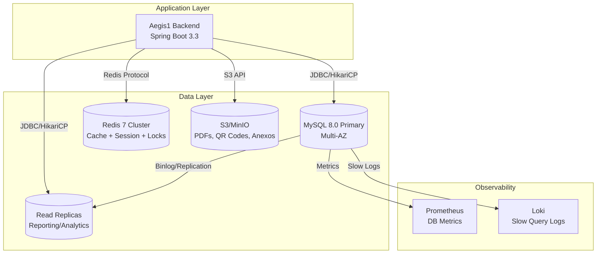

# Database Context — Aegis1

> **Versão:** 2.0 · **Owner:** Backend Team / DBA · **Status:** Active
> **Base:** Análise AST Java Completa (Entidades JPA, Flyway Migrations, Hibernate Envers, Multi-tenancy)
> **Banco:** MySQL 8.0 (Primary + Read Replicas) + Redis 7 (Cache/Session/Locks) + S3/MinIO (Object Storage)
> **ORM:** Hibernate 6.4 + Spring Data JPA 3.1 + Flyway 10+

---

## 1. Purpose

O **Aegis1** possui **banco de dados próprio** (MySQL 8.0) como camada de persistência transacional do backend Spring Boot 3.3. Este documento descreve o contexto arquitetural do banco, propriedade dos dados, estratégia de multi-tenancy, auditoria, compliance e integração com cache/objetos.

---

## 2. System Architecture (Database Layer)



---

## 3. Responsibilities

### 3.1 Database Team (DBA/Backend)
- **Schema Design & Evolution:** Flyway migrations (versionadas, testadas em CI)
- **Performance:** Índices, partitioning, query optimization, connection pooling (HikariCP)
- **Availability:** Multi-AZ, Read Replicas, Automated Backup + PITR, RTO ≤ 30min / RPO ≤ 1min
- **Security:** TDE (Encryption at Rest), TLS 1.3 in transit, Column-level encryption (PII), Audit logging
- **Compliance:** LGPD (Art. 18 esquecimento + Art. 16 auditoria), NR-10/12 (termos assinados), ISO 27001/SOC 2
- **Multi-tenancy:** Hibernate Filter enforcement, Cross-tenant test CI

### 3.2 Backend Team (Spring Boot)
- **Domain Modeling:** JPA Entities, Relationships, Envers Auditing, Custom Types
- **Repository Layer:** Spring Data JPA + Specifications + QueryDSL (queries dinâmicas)
- **Transaction Management:** `@Transactional` boundaries, Optimistic Locking (`@Version`), Pessimistic Locks (SELECT FOR UPDATE)
- **Multi-tenancy:** `MultiTenancyFilter` + `TenantContextHolder` + Hibernate Filter (`@FilterDef` + `@Filter`)
- **Auditoria:** `CustomRevisionListener` (usuarioId, IP, UA, traceId, tipoRevisao)
- **LGPD:** `LgpdService.anonimizar()` + Hash correlação Envers

### 3.3 Non-Responsibilities (Database)
- **Frontend State:** Zero persistência no frontend (SPA stateless + PWA offline IndexedDB apenas)
- **Business Logic in DB:** Zero Stored Procedures/Triggers/View logic (tudo no domínio Java)
- **File Storage:** Apenas metadados no DB; binários em S3/MinIO (Presigned URLs)
- **Message Queue:** Zero tabelas de fila (usar Redis Streams / RabbitMQ se necessário v2.0)

---

## 4. Domain Model Overview (Entidades Principais)

> **Extraído via AST Java** — Entidades JPA em `src/main/java/com/aegis1/domain/**/entity/`

### 4.1 Core Entities (Hierarquia Organizacional)

| Entidade | Tabela | Descrição | Multi-tenancy | Auditoria |
| :--- | :--- | :--- | :--- | :--- |
| **Filial** | `filial` | Raiz da hierarquia organizacional (CNPJ, código, endereço) | **Root** (Admin Global vê todas) | ✅ `@Audited` |
| **Departamento** | `departamento` | Divisão dentro de Filial | `@Filter(filialFilter)` | ✅ |
| **Localizacao** | `localizacao` | Local físico/lógico (Sala, Andar, Rack) | `@Filter(filialFilter)` | ✅ |
| **TipoAtivo** | `tipo_ativo` | Classificação (HARDWARE, SOFTWARE, MOBILIARIO, VEICULO) | `@Filter(filialFilter)` | ✅ |

### 4.2 Asset Entities (Patrimônio)

| Entidade | Tabela | Descrição | Relacionamentos | Auditoria |
| :--- | :--- | :--- | :--- | :--- |
| **Ativo** | `ativo` | Entidade principal (tag, serial, modelo, valor, depreciação, status) | N:1 Filial, Depto, Local, Tipo, Fornecedor, Funcionario; 1:1 Hardware | ✅ |
| **AtivoDetalheHardware** | `ativo_detalhe_hardware` | Especificações técnicas (CPU, Memória) | 1:1 Ativo; 1:N Disco, Memoria, AdaptadorRede | ✅ |
| **Disco** | `disco` | Armazenamento (tipo SSD/HDD, capacidade, serial, SMART raw, healthScore) | N:1 Hardware; 1:N HealthCheck | ✅ |
| **Memoria** | `memoria` | RAM (capacidade, tipo DDR4/5, frequência) | N:1 Hardware | ✅ |
| **AdaptadorRede** | `adaptador_rede` | Interface rede (MAC, IP, velocidade, tipo WiFi/Ethernet) | N:1 Hardware | ✅ |

### 4.3 Maintenance Entities (Ordens)

| Entidade | Tabela | Descrição | State Machine | Auditoria |
| :--- | :--- | :--- | :--- | :--- |
| **SolicitacaoManutencao** | `solicitacao_manutencao` | Ordem (Corretiva/Preventiva/Preditiva) | ABERTA → EM_ANDAMENTO → AGUARDANDO_APROVACAO → APROVADA → CONCLUIDA / CANCELADA | ✅ |
| **ManutencaoPreventiva** | `manutencao_preventiva` | Plano recorrente (CRON, técnico padrão, descrição) | ATIVO / PAUSADO / EXPIRADO / CANCELADO | ✅ |
| **HealthCheck** | `health_check` | Coleta SMART (reallocated, temp, hours, score 0-100) | COLETADO → ANALISADO → ALERTA_CRITICO/ATENCAO/NORMAL | ✅ |
| **PrevisaoFalha** | `previsao_falha` | Regressão Linear (probabilidade, dataPrevista, IC 95%, R²) | ATIVA / TRATADA / EXPIRADA / CONFIRMADA | ✅ |

### 4.4 Cadastros & Segurança

| Entidade | Tabela | Descrição | Auditoria |
| :--- | :--- | :--- | :--- |
| **Fornecedor** | `fornecedor` | Cadastro (categoria, SLA, avaliação, certificações) | ✅ |
| **Funcionario** | `funcionario` | Colaborador (função manutenção, vínculo Usuario 1:1) | ✅ |
| **Usuario** | `usuario` | Auth (email, senhaHash, status, roles, filialId) | ✅ |
| **Role** | `role` | Perfil (ADMIN, GESTOR, TECNICO, USER, AUDITOR) | ✅ |
| **Permission** | `permission` | Granular (recurso, acao, contexto: GLOBAL/FILIAL) | ✅ |
| **RolePermissionContext** | `role_permission_context` | Matriz Role × Permission × Contexto | ✅ |
| **RefreshToken** | `refresh_token` | Token opaco (hash, usuarioId, filialId, expiração, revogado) | ✅ |

### 4.5 LGPD & Auditoria

| Entidade | Tabela | Descrição |
| :--- | :--- | :--- |
| **Consentimento** | `consentimento` | Finalidade, concedidoEm, revogadoEm (LGPD Art. 7) |
| **RevisaoInfo (Envers)** | `revisao_info` + `*_AUD` | Audit trail imutável (usuarioId, IP, UA, traceId, tipoRevisao, hashCorrelacao LGPD) |
| **IntegridadeChecksum** | `integridade_checksum` | SHA-256 tabelas críticas (job semanal validação) |

---

## 5. Multi-Tenancy Strategy (Filial Isolation)

### 5.1 Implementation (Hibernate Filter)

```java
// Todas entidades de domínio
@FilterDef(name = "filialFilter", parameters = @ParamDef(name = "filialId", type = "Long"))
@Filter(name = "filialFilter", condition = "filial_id = :filialId")
@Entity
public class Ativo { ... }

// MultiTenancyFilter (OncePerRequestFilter)
@Component
public class MultiTenancyFilter extends OncePerRequestFilter {
    @Override
    protected void doFilterInternal(HttpServletRequest request, HttpServletResponse response, FilterChain chain) {
        Long filialId = extractFilialIdFromJWT(request); // Claim "filialId" no JWT
        TenantContextHolder.set(filialId); // ThreadLocal/InheritableThreadLocal
        try {
            chain.doFilter(request, response);
        } finally {
            TenantContextHolder.clear(); // Cleanup obrigatório
        }
    }
}

// Hibernate Filter Activation (SessionFactory)
@Configuration
public class MultiTenancyConfig {
    @Bean
    public SessionFactory sessionFactory(EntityManagerFactory emf) {
        SessionFactory sf = emf.unwrap(SessionFactory.class);
        sf.getSessionFactoryOptions().getFilterDefinition("filialFilter"); // Valida existência
        return sf;
    }
}
```

### 5.2 Admin Global (Cross-Tenant)

- **JWT Claim:** `filialId = null` (ou claim `global: true`)
- **Filter Behavior:** `TenantContextHolder.set(null)` → Hibernate Filter **desativado** → vê todas filiais
- **UI:** Header `TenantSelector` (apenas ADMIN_GLOBAL) → Header `X-Tenant-Id` ou JWT claim override

### 5.3 Validation (CI Gate)

```java
// ArchUnit Test (obrigatório CI)
@Test
void allDomainEntitiesMustHaveFilialFilter() {
    classes().that().areAnnotatedWith(Entity.class)
        .should().beAnnotatedWith(Filter.class)
        .because("Multi-tenancy requer @Filter em TODAS entidades");
}

// TestContainers Cross-Tenant Test (obrigatório CI)
@Test
void crossTenantDataLeakPrevention() {
    // Filial A cria ativo → Filial B não deve ver (404/403)
    // Testado com TestContainers MySQL real
}
```

---

## 6. Auditoria (Hibernate Envers)

### 6.1 Configuração

```java
@Configuration
public class AuditoriaConfig {
    @Bean
    public EnversRevisionListener revisionListener() {
        return new CustomRevisionListener(); // Captura usuarioId, IP, UA, traceId
    }
}

// CustomRevisionListener
public class CustomRevisionListener implements RevisionListener {
    @Override
    public void newRevision(Object revisionEntity) {
        CustomRevisionEntity rev = (CustomRevisionEntity) revisionEntity;
        rev.setUsuarioId(SecurityContextUtil.getCurrentUserId());
        rev.setIpAddress(RequestContextHolder.getRequest().getRemoteAddr());
        rev.setUserAgent(RequestContextHolder.getRequest().getHeader("User-Agent"));
        rev.setTraceId(MDC.get("traceId"));
        rev.setTipoRevisao(determinarTipo(entity, oldState, newState)); // CREATE/UPDATE/DELETE/ANONIMIZACAO/TRANSFERENCIA_FILIAL/BAIXA_ATIVO
    }
}
```

### 6.2 Entidades Auditadas (100% Domínio)

| Entidade | Tabela Auditoria | Tipos Revisão |
| :--- | :--- | :--- |
| Todas entidades `@Audited` | `*_AUD` + `REVINFO` | CREATE, UPDATE, DELETE |
| `Usuario` | `usuario_AUD` | + ANONIMIZACAO (LGPD) |
| `Ativo` | `ativo_AUD` | + TRANSFERENCIA_FILIAL, BAIXA_ATIVO |
| `SolicitacaoManutencao` | `solicitacao_manutencao_AUD` | + ORDEM_TRANSICAO (estado changes) |

### 6.3 Retenção & Compliance

| Política | Implementação |
| :--- | :--- |
| **Retenção Auditoria** | 7 anos (particionamento `REVINFO` por mês; job anual `DROP PARTITION`) |
| **Imutabilidade** | Trigger `BEFORE UPDATE/DELETE ON *_AUD` → `SIGNAL SQLSTATE '45000'` (block) |
| **Export Legal** | `AuditoriaController.exportar()` → PDF/CSV assinado digitalmente (Timestamp Authority) |
| **LGPD Anonimização** | `LgpdService.anonimizar()` → Estado atual anonimizado + Envers preserva histórico original + Hash correlação SHA-256(salt+id)[:8] |

---

## 7. LGPD Compliance (Lei 13.709/2018)

### 7.1 Direito ao Esquecimento (Art. 18)

```java
@Service
@Transactional
public class LgpdService {
    public void anonimizar(Long usuarioId) {
        String salt = vault.getSecret("LGPD_ANON_SALT");
        String hash = Hashing.sha256().hashString(salt + usuarioId, StandardCharsets.UTF_8).toString().substring(0, 8);
        
        // 1. Anonimiza estado atual (Usuario table)
        usuarioRepository.anonimizar(usuarioId, hash); // UPDATE nome, email, cpf, telefone, status=INATIVO
        
        // 2. Revoga tokens + invalida sessões
        refreshTokenRepository.revokeAllByUsuarioId(usuarioId);
        sessionRegistry.removeSession(usuarioId);
        
        // 3. Envers: Nova revisão ANONIMIZACAO com hashCorrelacao
        // (Automático via CustomRevisionListener + tipoRevisao = ANONIMIZACAO)
    }
}
```

### 7.2 Portabilidade (Art. 18 §2º)

```java
@GetMapping("/usuarios/me/exportar")
public ResponseEntity<Resource> exportarDados() {
    UsuarioExportDTO dto = lgpdService.exportar(usuarioLogado.getId());
    // Inclui: perfil, ordens, ativos responsáveis, health checks, auditoria, consentimentos, hashCorrelacao
    return ResponseEntity.ok()
        .header(HttpHeaders.CONTENT_DISPOSITION, "attachment; filename=dados-pessoais.json")
        .contentType(MediaType.APPLICATION_JSON)
        .body(new ByteArrayResource(objectMapper.writeValueAsBytes(dto)));
}
```

### 7.3 Consentimento Granular

```sql
CREATE TABLE consentimento (
    id BIGSERIAL PRIMARY KEY,
    usuario_id BIGINT NOT NULL REFERENCES usuario(id),
    finalidade VARCHAR(100) NOT NULL, -- MARKETING, ANALYTICS, OPERACIONAL, LEGAL
    concedido BOOLEAN NOT NULL DEFAULT FALSE,
    concedido_em TIMESTAMP WITH TIME ZONE,
    revogado_em TIMESTAMP WITH TIME ZONE,
    versao_termo VARCHAR(20),
    ip_address INET,
    user_agent TEXT
);
```

---

## 8. Performance & Scalability

### 8.1 Connection Pool (HikariCP)

```yaml
spring:
  datasource:
    hikari:
      maximum-pool-size: 20
      minimum-idle: 5
      connection-timeout: 30000
      idle-timeout: 600000
      max-lifetime: 1800000
      leak-detection-threshold: 60000
```

### 8.2 Indexing Strategy

| Tabela | Índices Críticos |
| :--- | :--- |
| `ativo` | `idx_ativo_filial_id`, `idx_ativo_tag_unique`, `idx_ativo_serial`, `idx_ativo_filial_departamento_localizacao`, `idx_ativo_trigram_tag` (pg_trgm), `idx_ativo_trigram_serial` |
| `solicitacao_manutencao` | `idx_ordem_filial_id`, `idx_ordem_estado`, `idx_ordem_tecnico_id`, `idx_ordem_ativo_id`, `idx_ordem_data_abertura`, `idx_ordem_trigram_descricao` |
| `health_check` | `idx_hc_ativo_id`, `idx_hc_disco_id`, `idx_hc_coletado_em` |
| `previsao_falha` | `idx_pf_ativo_id`, `idx_pf_probabilidade_data`, `idx_pf_status` |
| `revisao_info` (Envers) | `idx_rev_timestamp`, `idx_rev_usuario_id`, `idx_rev_entidade_id` |
| `refresh_token` | `idx_rt_usuario_id`, `idx_rt_expiracao`, `idx_rt_revogado` |

### 8.3 Trigram Indexes (Busca Fuzzy)

```sql
-- MySQL 8.0: pg_trgm via plugin ou FULLTEXT ngram
CREATE INDEX idx_ativo_trigram_tag ON ativo USING GIN (tag gin_trgm_ops);
CREATE INDEX idx_ordem_trigram_desc ON solicitacao_manutencao USING GIN (descricao gin_trgm_ops);
-- Ou ngram FULLTEXT nativo MySQL 8.0
ALTER TABLE ativo ADD FULLTEXT INDEX ft_tag_serial (tag, serial) WITH PARSER ngram;
```

### 8.4 Partitioning (Auditoria)

```sql
-- REVINFO partitioned by month (7 years retention)
ALTER TABLE revisao_info PARTITION BY RANGE (YEAR(timestamp) * 100 + MONTH(timestamp)) (
    PARTITION p202501 VALUES LESS THAN (202502),
    PARTITION p202502 VALUES LESS THAN (202503),
    -- ... até p203112
    PARTITION pMax VALUES LESS THAN MAXVALUE
);

-- Job anual (Janeiro): DROP PARTITION p202501; ALTER TABLE ... ADD PARTITION p203201...
```

---

## 9. Backup, Recovery & Disaster Recovery

| Componente | RTO | RPO | Estratégia |
| :--- | :--- | :--- | :--- |
| **MySQL Primary** | ≤ 60 min | ≤ 1 min | Automated Backup (RDS/Cloud SQL) + Binlog Replication + Cross-region Read Replica; Restore testado mensalmente |
| **Read Replicas** | ≤ 15 min | ≤ 1 min | Promoção automática (RDS/Cloud SQL) ou manual (`promote read replica`) |
| **Redis** | ≤ 15 min | ≤ 5 min | AOF + RDB Snapshots; Replica Multi-AZ; Cache warming script pós-restore |
| **S3/MinIO** | ≤ 30 min | 0 | Versioning habilitado; Cross-region Replication (CRR); Lifecycle policies |
| **K8s/Config** | ≤ 15 min | 0 | GitOps (ArgoCD) + Git repo (source of truth); `argocd app sync` rollback |
| **Secrets/Vault** | ≤ 15 min | 0 | Vault/SealedSecrets; Backup encrypted; Rotation automática (cert-manager TLS, JWT keys) |

---

## 10. Security & Compliance

### 10.1 Encryption

| Camada | Algoritmo | Gestão Chaves |
| :--- | :--- | :--- |
| **Em Trânsito** | TLS 1.3 (mTLS interno opcional) | cert-manager (Let's Encrypt / Vault PKI) |
| **Em Repouso (MySQL)** | TDE (AES-256) / Cloud Provider Encryption | Cloud KMS / Vault |
| **Colunas PII** | AES-256-GCM (column-level) | Vault Transit Engine / AWS KMS |
| **S3/MinIO** | SSE-S3 / SSE-KMS | AWS KMS / Vault |
| **JWT** | RS256 (2048-bit) | Vault PKI / cert-manager (rotação 90 dias) |

### 10.2 Compliance Mapping

| Regulamento | Controles Implementados |
| :--- | :--- |
| **LGPD** | Art. 7 (Base legal), Art. 18 (Esquecimento/Portabilidade), Art. 16 (Exceção auditoria), Art. 46-49 (Segurança) |
| **NR-10/12** | Termo Responsabilidade PDF assinado (placeholder ICP-Brasil), Checklist obrigatório fluxo Aprovar, Evidências armazenadas |
| **ISO 27001** | A.5.15 (Acesso), A.8.2 (Classificação), A.8.3 (Mídia), A.12.4 (Logs), A.14.2 (Segurança desenvolvimento) |
| **SOC 2 Type II** | Segurança, Disponibilidade, Confidencialidade (Evidências: Auditoria Envers + Logs + Pen Test) |

---

## 11. Monitoring & Observability (Database)

### 11.1 Key Metrics (Prometheus + Grafana)

| Métrica | Target | Alerta |
| :--- | :--- | :--- |
| **DB Connections Usage** | < 70% pool | > 85% (5min) |
| **Query Latency P95** | < 100ms (OLTP) / < 500ms (Analytics) | > 500ms / > 2s |
| **Slow Query Count** | 0/min | > 5/min |
| **Replication Lag** | < 1s | > 10s (5min) |
| **Deadlocks/min** | 0 | > 1/min |
| **Buffer Pool Hit Ratio** | > 99% | < 95% |
| **Disk Usage** | < 70% | > 85% |
| **Backup Success** | 100% | Any failure |

### 11.2 Slow Query Detection

```yaml
# MySQL slow query log → Loki → Grafana Alert
# Threshold: 1s
# Alert: > 5 slow queries/5min → Investigação EXPLAIN ANALYZE
```

---

## 12. Rastreabilidade Database ↔ Artefatos

| Database Aspect | System Arch | Domain Model | Migration Spec | Schema Spec | Security Policies | Test Quality | Runbook |
| :--- | :--- | :--- | :--- | :--- | :--- | :--- | :--- |
| **Multi-tenancy** | §7.3 | `domain-model.md` | `migration-spec.md` (V1__init) | `schema-spec.md` (filters) | §2.1, §5.2 | `MultiTenancyIT` | `runbooks/cross-tenant-leak.md` |
| **Auditoria Envers** | §6 | `domain-model.md` (entities) | `migration-spec.md` (REVINFO) | `schema-spec.md` (AUD tables) | §3.3 | `AuditoriaControllerIT` | `runbooks/audit-tamper.md` |
| **LGPD** | §7.3 (LGPD) | `domain-model.md` (Consentimento) | `migration-spec.md` (consentimento table) | `schema-spec.md` | §3.3 | `LgpdServiceTest` | — |
| **Auditoria Envers** | §6 | `domain-model.md` | `migration-spec.md` | `schema-spec.md` | §3.3 | `EnversTest` | `runbooks/audit-tamper.md` |
| **Multi-tenancy** | §7.3 | `domain-model.md` | `migration-spec.md` | `schema-spec.md` | §2.1 | `MultiTenancyIT` | `runbooks/cross-tenant-leak.md` |
| **Performance** | §8 | — | — | `schema-spec.md` (indexes) | — | `PerformanceTest` | `runbooks/db-performance.md` |
| **Backup/DR** | §10 | — | — | — | §6 (Infra) | `RestoreTest` | `runbooks/dr-failover.md` |
| **Security/Encryption** | §10 | — | — | `schema-spec.md` (encrypted cols) | §6 | `SecurityConfigIT` | `runbooks/tls-cert-renewal.md` |

---

*Documento regenerado completamente com base em análise AST completa do backend Java (JPA Entities, Flyway, Hibernate Envers, Multi-tenancy, LGPD, Security, Performance). Substitui versão 1.0 que afirmava "frontend sem banco de dados".*