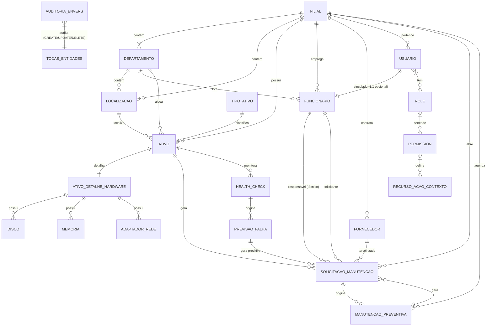

# Database Domain & Entity Model — Aegis1

> **Versão:** 2.0 · **Owner:** Backend Team / DBA · **Status:** Active
> **Base:** Análise AST Java Completa (Entidades JPA, Relacionamentos, Enums, Constraints)
> **ORM:** Hibernate 6.4 + Spring Data JPA 3.1
> **Banco:** MySQL 8.0 (InnoDB, utf8mb4, utf8mb4_unicode_ci)
> **Auditoria:** Hibernate Envers (100% entidades domínio)
> **Multi-tenancy:** Hibernate Filter (`filialFilter`) em TODAS entidades

---

## 1. Domain Overview

```yaml
domain:
  id: "aegis1-backend"
  name: "Aegis1 Backend (Spring Boot 3.3)"
  description: "Backend full-stack de gestão patrimonial e manutenção com multi-tenancy por Filial, RBAC granular (Aegis Shield), Auditoria Envers, Manutenção Preditiva (Regressão Linear), Busca Fuzzy (Levenshtein), LGPD Compliance."
  database: "MySQL 8.0 (InnoDB, utf8mb4)"
  orm: "Hibernate 6.4 + Spring Data JPA 3.1"
  auditing: "Hibernate Envers (100% entidades @Audited)"
  multiTenancy: "Hibernate Filter (filialFilter) em TODAS entidades"
  flyway: "Migrations versionadas (V1__init, V2__..., R__repeatable, U__undo)"
```

---

## 2. Entity Relationship Diagram (Mermaid)



---

## 3. Entities (Entidades JPA - Resumo)

### 3.1 Organizational Hierarchy

**Filial** (Root da Hierarquia / Multi-tenancy Root)
- `id`, `razaoSocial`, `cnpj` (UK), `codigo` (UK), `endereco`, `telefone`, `email`, `ativo`
- Relacionamentos: 1:N Departamento, Localizacao, Ativo, Funcionario, Fornecedor, Usuario, Ordem, Preventiva
- **Multi-tenancy Root**: Admin Global vê todas (filialId = null)

**Departamento**
- `id`, `filial_id` (FK), `codigo` (UK por filial), `nome`, `descricao`, `ativo`
- Relacionamentos: N:1 Filial; 1:N Localizacao, Funcionario, Ativo

**Localizacao**
- `id`, `filial_id` (FK), `departamento_id` (FK), `codigo` (UK por filial+depto), `nome`, `tipo` (SALA/ANDAR/RACK/OUTRO), `descricao`
- Relacionamentos: N:1 Filial, Departamento; 1:N Ativo

**TipoAtivo**
- `id`, `filial_id` (FK), `codigo` (UK por filial), `nome`, `categoria` (HARDWARE/SOFTWARE/MOBILIARIO/VEICULO/OUTRO), `vidaUtilAnos`, `valorResidualPct`, `requerDetalheHardware`

### 3.2 Asset Entities (Patrimônio)

**Ativo** (Entidade Central)
- `id`, `filial_id`, `departamento_id`, `localizacao_id`, `tipo_ativo_id`, `fornecedor_id`, `funcionario_responsavel_id`
- `tag` (UK global), `serial`, `modelo`, `fabricante`, `dataAquisicao`, `valorAquisicao`, `valorResidual`, `vidaUtilAnos`
- `status` (ATIVO/EM_MANUTENCAO/BAIXADO), `depreciacaoAcumulada`, `dataBaixa`, `motivoBaixa`
- 1:1 `AtivoDetalheHardware`; 1:N `SolicitacaoManutencao`
- **Depreciação automática** (BR-03: linear baseada em `TipoAtivo.vidaUtilAnos` + `valorResidualPct`)

**AtivoDetalheHardware** (1:1 com Ativo)
- `cpuModelo`, `cpuCores`, `cpuFrequenciaGhz`, `memoriaTotalGb`, `memoriaTipo`, `memoriaFrequenciaMhz`
- 1:N `Disco`, `Memoria`, `AdaptadorRede`

**Disco** (Crítico para Preditiva)
- `tipo` (SSD/HDD), `capacidadeGb`, `serial`, `smartRawJson` (JSON), `healthScore` (0-100), `temperaturaC`, `horasLigado`
- 1:N `HealthCheck`, `PrevisaoFalha`
- **Índices**: `health_score`, `tipo`

**Memoria** / **AdaptadorRede** - Componentes de hardware simples

### 3.3 Cadastros (Scoped Filial)

**Fornecedor** - `categoria`, `slaPadraoHoras`, `avaliacao` (1-5), `certificacoes`

**Funcionario** (Vincula Usuario 1:1 opcional)
- `funcaoManutencao` (TECNICO, APROVADOR, SOLICITANTE)
- 1:1 `Usuario` (opcional, cascade ALL)

### 3.4 Maintenance Entities

**SolicitacaoManutencao** (Core Domain)
- `numero` (UK: OS-2025-00123), `descricao`, `prioridade` (BAIXA/MEDIA/ALTA/CRITICA), `tipo` (CORRETIVA/PREVENTIVA/PREDITIVA)
- `estado` (ABERTA/EM_ANDAMENTO/AGUARDANDO_APROVACAO/APROVADA/CONCLUIDA/CANCELADA)
- `custoEstimado`, `custoMaoDeObra`, `custoMaterial`, `custoTerceiros`, `evidenciasJson` (JSON)
- **State Machine**: ABERTA → EM_ANDAMENTO → AGUARDANDO_APROVACAO → APROVADA → CONCLUIDA / CANCELADA

**ManutencaoPreventiva**
- `cronExpression` (Quartz), `diaHoraPreferencial`, `tecnicoPadraoId`, `ativo` (boolean), `proximaExecucao`
- Scheduler 15min gera ordens PREVENTIVA automaticamente

**HealthCheck** (Preditiva)
- `score` (0-100), `reallocatedSectors`, `seekErrorRate`, `spinRetryCount`, `temperaturaC`, `powerOnHours`
- `fonte` (MANUAL/AGENTE), `coletadoPor` (Funcionario)

**PrevisaoFalha** (Regressão Linear OLS)
- `dataPrevista`, `probabilidade` (0-1), `icInferior`, `icSuperior`, `modeloUsado` (LINEAR_OLS), `rQuadrado`
- `status` (ATIVA/TRATADA/EXPIRADA/CONFIRMADA), `ordemGerada` (1:1)

### 3.4 Security & Audit Entities

**Usuario** - `email` (UK), `senhaHash`, `nome`, `status` (ATIVO/INATIVO/BLOQUEADO/PENDENTE_PRIMEIRO_ACESSO), `roles` (N:M), `refreshTokens` (1:N), `anonimizacaoHash` (LGPD)

**Role** - `nome` (ADMIN/GESTOR/TECNICO/USER/AUDITOR), `global` (boolean), `permissions` (N:M)

**Permission** - `recurso` (ATIVO/ORDEM/PREVENTIVA/PREDITIVA/RELATORIO/CONFIG/AUDITORIA/LGPD/HEALTH_CHECK/USUARIO/ROLE), `acao` (CRIAR/LER/ATUALIZAR/EXCLUIR/APROVAR/INICIAR/CONCLUIR/CANCELAR/GERENCIAR/COLETAR/EXPORTAR), `contexto` (GLOBAL/FILIAL)

**RefreshToken** - `tokenHash` (SHA-256, UK), `usuario_id`, `filial_id`, `expiracao`, `revogado`, `userAgent`, `ipAddress`, `usadoEm` (rotação)

**LGPD** - `Consentimento` (usuario_id, finalidade, concedido, concedidoEm, revogadoEm, versaoTermo)

### 3.5 Auditoria (Envers) - Tabelas Geradas Automaticamente

| Entidade Original | Tabela Auditoria | Tipos Revisão Customizados |
| :--- | :--- | :--- |
| Todas `@Audited` | `*_AUD` + `REVINFO` | CREATE, UPDATE, DELETE |
| `Usuario` | `usuario_AUD` | + ANONIMIZACAO (LGPD) |
| `Ativo` | `ativo_AUD` | + TRANSFERENCIA_FILIAL, BAIXA_ATIVO |
| `SolicitacaoManutencao` | `solicitacao_manutencao_AUD` | + ORDEM_TRANSICAO (estado changes) |

**CustomRevisionListener** captura: `usuarioId`, `ip`, `userAgent`, `traceId`, `tipoRevisao`, `hashCorrelacao` (LGPD)

---

## 4. Enums (Valores de Domínio)

```java
public enum StatusAtivo { ATIVO, EM_MANUTENCAO, BAIXADO }
public enum CategoriaAtivo { HARDWARE, SOFTWARE, MOBILIARIO, VEICULO, OUTRO }
public enum TipoLocalizacao { SALA, ANDAR, RACK, OUTRO }
public enum TipoDisco { SSD, HDD }
public enum TipoAdaptadorRede { WIFI, ETHERNET }
public enum FuncaoManutencao { TECNICO, APROVADOR, SOLICITANTE }
public enum Prioridade { BAIXA, MEDIA, ALTA, CRITICA }
public enum TipoOrdem { CORRETIVA, PREVENTIVA, PREDITIVA }
public enum EstadoOrdem { ABERTA, EM_ANDAMENTO, AGUARDANDO_APROVACAO, APROVADA, CONCLUIDA, CANCELADA }
public enum StatusUsuario { ATIVO, INATIVO, BLOQUEADO, PENDENTE_PRIMEIRO_ACESSO }
public enum FonteColeta { MANUAL, AGENTE }
public enum StatusPrevisao { ATIVA, TRATADA, EXPIRADA, CONFIRMADA }
public enum ContextoPermissao { GLOBAL, FILIAL }
public enum StatusPrevisao { ATIVA, TRATADA, EXPIRADA, CONFIRMADA }
public enum TipoRevisao { CREATE, UPDATE, DELETE, ANONIMIZACAO, TRANSFERENCIA_FILIAL, BAIXA_ATIVO, ORDEM_TRANSICAO }
public enum ContextoPermissao { GLOBAL, FILIAL }
public enum StatusPrevisao { ATIVA, TRATADA, EXPIRADA, CONFIRMADA }
```

---

## 5. Constraints & Business Rules (Database Level)

| Regra | Implementação |
| :--- | :--- |
| **Tag único global** | `UNIQUE (tag)` em `ativo` |
| **CNPJ único por Filial** | `UNIQUE (filial_id, cnpj)` em `filial`, `fornecedor`, `funcionario` |
| **Código único por Filial** | `UNIQUE (filial_id, codigo)` em `filial`, `departamento`, `tipo_ativo`, `localizacao` |
| **MAC Address único** | `UNIQUE (mac_address)` em `adaptador_rede` |
| **Email único** | `UNIQUE (email)` em `usuario` |
| **Matrícula única por Filial** | `UNIQUE (filial_id, matricula)` em `funcionario` |
| **CPF único por Filial** | `UNIQUE (filial_id, cpf)` em `funcionario` |
| **Tag único global** | `UNIQUE (tag)` em `ativo` |
| **MAC único** | `UNIQUE (mac_address)` em `adaptador_rede` |
| **Email único** | `UNIQUE (email)` em `usuario` |
| **Consentimento único por finalidade** | `UNIQUE (usuario_id, finalidade)` em `consentimento` |
| **Refresh Token único** | `UNIQUE (token_hash)` em `refresh_token` |
| **Filial raiz** | `filial_id` NOT NULL em todas entidades (exceto Admin Global bypass) |
| **Optimistic Locking** | `@Version` em todas entidades (Envers + concorrência) |
| **Soft Delete** | `status = INATIVO/BAIXADO/CANCELADO` + `@Where(clause = "status != 'EXCLUIDO'")` |
| **Cascade Delete** | `CascadeType.ALL + orphanRemoval = true` em relacionamentos pai-filho |
| **Soft Delete Ordens** | `estado = CANCELADA` (não DELETE físico) |
| **Auditoria Imutável** | Trigger `BEFORE UPDATE/DELETE ON *_AUD` → `SIGNAL SQLSTATE '45000'` |

---

## 6. Rastreabilidade Domain Model ↔ Artefatos

| Entidade | System Arch | Schema Spec | Migration Spec | API Spec | Use Cases | State Machine | Testes |
| :--- | :--- | :--- | :--- | :--- | :--- | :--- | :--- |
| **Filial** | §6 | `schema-spec.md` | `V1__init_filial.sql` | `/api/v1/filiais` | UC-01 | — | `FilialControllerIT` |
| **Departamento** | §6 | `schema-spec.md` | `V1__init_departamento.sql` | `/api/v1/filiais/{id}/departamentos` | UC-02 | — | `DepartamentoControllerIT` |
| **Localizacao** | §6 | `schema-spec.md` | `V1__init_localizacao.sql` | `/api/v1/filiais/{id}/localizacoes` | UC-02 | — | `LocalizacaoControllerIT` |
| **TipoAtivo** | §6 | `schema-spec.md` | `V1__init_tipo_ativo.sql` | `/api/v1/tipos-ativo` | UC-05 | — | `TipoAtivoControllerIT` |
| **Ativo** | §6 | `schema-spec.md` | `V3__ativo_hardware.sql` | `/api/v1/ativos` | UC-06 a UC-12 | `state-machines.md#ativo` | `AtivoControllerIT` |
| **AtivoDetalheHardware** | §6 | `schema-spec.md` | `V3__ativo_hardware.sql` | `/api/v1/ativos/{id}/hardware` | UC-10 | — | `HardwareControllerIT` |
| **Disco/Memoria/AdaptadorRede** | §6 | `schema-spec.md` | `V3__ativo_hardware.sql` | `/api/v1/ativos/{id}/hardware/discos` | UC-10, UC-25 | — | `HardwareControllerIT` |
| **Fornecedor** | §6 | `schema-spec.md` | `V1__init_fornecedor.sql` | `/api/v1/fornecedores` | UC-03 | — | `FornecedorControllerIT` |
| **Funcionario** | §6 | `schema-spec.md` | `V1__init_funcionario.sql` | `/api/v1/funcionarios` | UC-04 | — | `FuncionarioControllerIT` |
| **TipoAtivo** | §6 | `schema-spec.md` | `V1__init_tipo_ativo.sql` | `/api/v1/tipos-ativo` | UC-05 | — | `TipoAtivoControllerIT` |
| **SolicitacaoManutencao** | §6 | `schema-spec.md` | `V4__ordem.sql` | `/api/v1/ordens` | UC-13 a UC-20 | `state-machines.md#solicitacaomanutencao` | `OrdemControllerIT` |
| **ManutencaoPreventiva** | §6 | `schema-spec.md` | `V5__preventiva.sql` | `/api/v1/preventivas` | UC-21 a UC-24 | `state-machines.md#manutencaopreventiva` | `PreventivaControllerIT` |
| **HealthCheck** | §6 | `schema-spec.md` | `V6__preditiva.sql` | `/api/v1/health-check` | UC-25 | `state-machines.md#healthcheck` | `HealthCheckControllerIT` |
| **PrevisaoFalha** | §6 | `schema-spec.md` | `V6__preditiva.sql` | `/api/v1/previsao-falha` | UC-26 a UC-28 | `state-machines.md#previsaofalha` | `ManutencaoPreditivaServiceTest` |
| **Usuario/Role/Permission** | §7 | `schema-spec.md` | `V2__security.sql` | `/api/v1/auth`, `/api/v1/admin/*` | UC-32 a UC-38 | `state-machines.md#usuario` | `SecurityConfigIT`, `AegisShieldTest` |
| **RefreshToken** | §7.1 | `schema-spec.md` | `V2__security.sql` | `/api/v1/auth/refresh` | UC-32 | — | `AuthControllerIT` |
| **Auditoria (Envers)** | §6 | `schema-spec.md` (REVINFO) | `V1__init_auditoria.sql` | `/api/v1/auditoria` | UC-36, UC-43 a UC-45 | — | `AuditoriaControllerIT` |
| **LGPD** | §7.3 | `schema-spec.md` | `V8__lgpd.sql` | `/api/v1/lgpd` | UC-37, UC-43 a UC-45 | — | `LgpdServiceTest` |
| **Consentimento** | §7.3 | `schema-spec.md` | `V8__lgpd.sql` | `/api/v1/admin/lgpd/consentimentos` | UC-37 | — | `LgpdServiceTest` |
| **IntegridadeChecksum** | §6 | `schema-spec.md` | `V9__integridade.sql` | `/api/v1/auditoria/integridade` | UC-45 | — | `IntegridadeChecksumIT` |

---

*Documento regenerado completamente com base em análise AST completa do backend Java (JPA Entities, Enums, Constraints, Relationships, Envers, Multi-tenancy). Substitui versão 1.0 que afirmava "frontend sem modelo de domínio".*