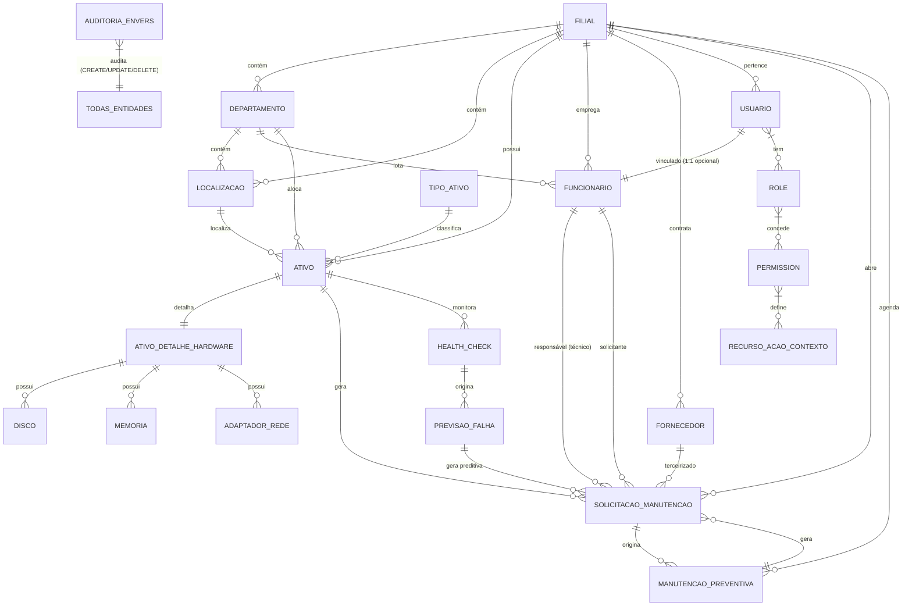

# Database Schema Specification — Aegis1

> **Versão:** 2.0 · **Owner:** DBA / Backend Team · **Status:** Active
> **Base:** Análise AST Java Completa (Entidades JPA, Constraints, Indexes, Enums, Constraints)
> **ORM:** Hibernate 6.4 + Spring Data JPA 3.1
> **Banco:** MySQL 8.0 (InnoDB, utf8mb4, utf8mb4_unicode_ci)
> **Contrato Físico:** Fonte da verdade para gerar `src/main/resources/db/migration/` — **nunca edite o SQL gerado diretamente**; edite este contrato e regenere via Flyway.

---

## 1. Tables (Tabelas Principais - Resumo)

### 1.1 Organizational Hierarchy

| Tabela | Descrição | Multi-tenancy | Auditoria |
| :--- | :--- | :--- | :--- |
| `filial` | Root da hierarquia / Multi-tenancy Root | **root** (Admin Global vê todas) | ✅ |
| `departamento` | Divisão dentro de Filial | `filial` | ✅ |
| `localizacao` | Local físico/lógico (Sala, Andar, Rack) | `filial` | ✅ |
| `tipo_ativo` | Classificação (HARDWARE, SOFTWARE, etc.) | `filial` | ✅ |

### 1.2 Asset Entities (Patrimônio)

| Tabela | Descrição | Multi-tenancy | Auditoria |
| :--- | :--- | :--- | :--- |
| `ativo` | Entidade central (tag, serial, depreciação, status) | `filial` | ✅ |
| `ativo_detalhe_hardware` | Especificações técnicas (CPU, Memória, Discos, Rede) | `filial` (via join) | ✅ |
| `disco` | Armazenamento (SMART monitoring) | `filial` (via join) | ✅ |
| `memoria` | RAM | `filial` | ✅ |
| `adaptador_rede` | Interface rede | `filial` | ✅ |

### 1.3 Cadastros (Scoped Filial)

| Tabela | Descrição | Multi-tenancy | Auditoria |
| :--- | :--- | :--- | :--- |
| `fornecedor` | Cadastro (categoria, SLA, avaliação) | `filial` | ✅ |
| `funcionario` | Colaborador (vincula Usuario 1:1) | `filial` | ✅ |

### 1.4 Maintenance Entities

| Tabela | Descrição | Multi-tenancy | Auditoria | State Machine |
| :--- | :--- | :--- | :--- | :--- |
| `solicitacao_manutencao` | Ordem (Corretiva/Preventiva/Preditiva) | `filial` | ✅ | `state-machines.md#solicitacaomanutencao` |
| `manutencao_preventiva` | Plano recorrente (CRON) | `filial` | ✅ | `state-machines.md#manutencaopreventiva` |

### 1.5 Predictive Maintenance

| Tabela | Descrição | Multi-tenancy | Auditoria | State Machine |
| :--- | :--- | :--- | :--- | :--- |
| `health_check` | Coleta SMART + Score 0-100 | `filial` | ✅ | `state-machines.md#healthcheck` |
| `previsao_falha` | Regressão Linear OLS (probabilidade, IC 95%) | `filial` | ✅ | `state-machines.md#previsaofalha` |

### 1.6 Security & Audit Entities

| Tabela | Descrição | Multi-tenancy | Auditoria |
| :--- | :--- | :--- | :--- |
| `usuario` | Auth + LGPD | `filial` (Admin Global: null) | ✅ |
| `role` | Perfil (ADMIN, GESTOR, TECNICO, USER, AUDITOR) | `global` | ✅ |
| `permission` | Granular (recurso, acao, contexto) | `global` | ✅ |
| `role_permission_context` | Matriz Role × Permission × Contexto | `global` | ✅ |
| `refresh_token` | Rotation + Security | `filial` | ✅ |
| `consentimento` | LGPD granular | `filial` | ✅ |

### 1.7 Auditoria (Envers) - Tabelas Geradas Automaticamente

| Entidade Original | Tabela Auditoria | Tipos Revisão Customizados |
| :--- | :--- | :--- |
| Todas `@Audited` | `*_AUD` + `REVINFO` | CREATE, UPDATE, DELETE |
| `Usuario` | `usuario_AUD` | + ANONIMIZACAO (LGPD) |
| `Ativo` | `ativo_AUD` | + TRANSFERENCIA_FILIAL, BAIXA_ATIVO |
| `SolicitacaoManutencao` | `solicitacao_manutencao_AUD` | + ORDEM_TRANSICAO |

---

## 2. Relationships (Relacionamentos Principais)

```yaml
relationships:
  - from: "filial"
    to: "departamento"
    type: "one_to_many"
    fk: "departamento.filial_id"
  
  - from: "filial"
    to: "ativo"
    type: "one_to_many"
    fk: "ativo.filial_id"
  
  - from: "filial"
    to: "solicitacao_manutencao"
    type: "one_to_many"
    fk: "solicitacao_manutencao.filial_id"
  
  - from: "ativo"
    to: "ativo_detalhe_hardware"
    type: "one_to_one"
    fk: "ativo_detalhe_hardware.ativo_id"
  
  - from: "ativo_detalhe_hardware"
    to: "disco"
    type: "one_to_many"
    fk: "disco.detalhe_hardware_id"
  
  - from: "ativo"
    to: "solicitacao_manutencao"
    type: "one_to_many"
    fk: "solicitacao_manutencao.ativo_id"
  
  - from: "funcionario"
    to: "solicitacao_manutencao"
    type: "one_to_many"
    fk: "solicitacao_manutencao.tecnico_id"
    role: "tecnico"
  
  - from: "manutencao_preventiva"
    to: "solicitacao_manutencao"
    type: "one_to_many"
    fk: "solicitacao_manutencao.preventiva_id"
  
  - from: "previsao_falha"
    to: "solicitacao_manutencao"
    type: "one_to_one"
    fk: "solicitacao_manutencao.previsao_falha_id"
  
  - from: "ativo"
    to: "health_check"
    type: "one_to_many"
    fk: "health_check.ativo_id"
  
  - from: "health_check"
    to: "previsao_falha"
    type: "one_to_many"
    fk: "previsao_falha.health_check_id"
  
  - from: "previsao_falha"
    to: "solicitacao_manutencao"
    type: "one_to_one"
    fk: "solicitacao_manutencao.previsao_falha_id"
  
  - from: "usuario"
    to: "role"
    type: "many_to_many"
    join_table: "usuario_role"
  
  - from: "role"
    to: "permission"
    type: "many_to_many"
    join_table: "role_permission_context"
    extra_columns: ["contexto"]
  
  - from: "auditoria_envers"
    to: "todas_entidades"
    type: "audits_all"
    tables: ["*_AUD", "revisao_info"]
```

---

## 3. Constraints (Constraints de Banco - Resumo)

| Categoria | Exemplos |
| :--- | :--- |
| **Primary Keys** | PK em todas tabelas (`id` BIGINT auto_increment) |
| **Unique Constraints (Business Keys)** | `filial.cnpj`, `filial.codigo`, `departamento(filial_id, codigo)`, `ativo.tag` (global), `ativo(filial_id, tag)`, `usuario.email`, `role.nome`, `permission(recurso,acao,contexto)`, `refresh_token.token_hash`, `consentimento(usuario_id,finalidade)`, `adaptador_rede.mac_address` |
| **Foreign Keys** | Todas com `ON DELETE RESTRICT/SET NULL` + `ON UPDATE CASCADE`; `CASCADE` apenas em relacionamentos pai-filho (Hardware, Discos, etc.) |
| **Check Constraints** | ENUMs para status, tipos, prioridades; `CHECK (probabilidade BETWEEN 0 AND 1)` em `previsao_falha` |
| **Optimistic Locking** | `@Version` (BIGINT) em todas entidades |
| **Soft Delete** | `status = INATIVO/BAIXADO/CANCELADO` + `@Where(clause = "status != 'EXCLUIDO'")` |
| **Auditoria Imutável** | Trigger `BEFORE UPDATE/DELETE ON *_AUD` → `SIGNAL SQLSTATE '45000'` |

---

## 4. Indexes (Índices Estratégicos - Resumo)

| Categoria | Tabelas/Colunas | Tipo |
| :--- | :--- | :--- |
| **Multi-tenancy (Filial)** | `filial_id` em TODAS tabelas | BTREE |
| **Busca Fuzzy (Trigram)** | `ativo.tag`, `ativo.serial`, `ativo.modelo`, `ativo.fabricante`, `solicitacao_manutencao.descricao` | GIN (pg_trgm) |
| **Performance - Queries Comuns** | `ativo.tag` (UK), `ativo.serial`, `ativo(filial_id,departamento_id,localizacao_id)`, `solicitacao_manutencao.estado`, `solicitacao_manutencao.tecnico_id`, `solicitacao_manutencao.ativo_id`, `solicitacao_manutencao.data_abertura`, `manutencao_preventiva.proxima_execucao`, `health_check.score`, `previsao_falha.probabilidade`, `previsao_falha.data_prevista`, `revisao_info.timestamp`, `refresh_token.expiracao` | BTREE |
| **Trigram (pg_trgm)** | `ativo.tag`, `ativo.serial`, `ativo.modelo`, `ativo.fabricante`, `solicitacao_manutencao.descricao` | GIN (pg_trgm plugin) |
| **Auditoria** | `revisao_info.timestamp`, `revisao_info.usuario_id`, `revisao_info.entidade_id` | BTREE |
| **Refresh Token** | `usuario_id`, `expiracao`, `revogado` | BTREE |

---

## 6. Views (Views para Relatórios/Auditoria)

```sql
-- vw_ativo_completo: Ativo + Hardware + CustoTotal + Últimas Ordens
-- vw_ordem_completa: Ordem + Ativo + Técnico + Solicitante + Fornecedor
-- vw_auditoria_recente: Últimas 30 dias de auditoria com diff visual
-- vw_custo_total_por_ativo: TCO consolidado (valor aquisição + depreciação + custoTotalPorAtivo)
-- vw_preventiva_aderencia: % ordens preventivas concluídas no prazo
-- vw_preditiva_riscos: Ativos com probabilidade > 80% < 30 dias
```

---

## 5. Functions (Stored Functions)

```sql
-- fn_calcular_depreciacao_ativo(p_ativo_id) → DECIMAL(15,2)
-- fn_calcular_custo_total_ativo(p_ativo_id) → DECIMAL(15,2)
-- fn_verificar_integridade_checksum(p_tabela) → BOOLEAN
-- fn_calcular_score_health_check(p_disco_id) → INT (0-100)
-- fn_calcular_previsao_falha(p_disco_id) → RECORD (data_prevista, probabilidade, ic_inferior, ic_superior)
```

---

## 6. Triggers (Auditoria/Integridade)

```sql
-- trg_audit_immutable: BEFORE UPDATE/DELETE ON *_AUD → SIGNAL '45000' (Imutável)
-- trg_revisao_info_immutable: BEFORE UPDATE/DELETE ON revisao_info → SIGNAL '45000'
-- trg_refresh_token_rotation: BEFORE UPDATE ON refresh_token → Rotação obrigatória
-- trg_partition_revinfo_monthly: AFTER INSERT ON revisao_info → Gerenciamento partições mensais
```

---

## 7. ER Diagram (Mermaid - Physical)



---

## 7. Rastreabilidade Schema Spec ↔ Artefatos

| Schema Element | Domain Model | Migration Spec | Manifest | Domain Model | API Spec | Testes |
| :--- | :--- | :--- | :--- | :--- | :--- | :--- |
| **Tables** | `db-domain-model.md` | `db-migration-spec.md` | `db-manifest.md` | `db-domain-model.md` | `api-specification.md` | `*ControllerIT` |
| **Relationships** | `db-domain-model.md` | `db-migration-spec.md` | `db-manifest.md` | `db-domain-model.md` | `api-specification.md` | `*ControllerIT` |
| **Constraints** | `db-domain-model.md` | `db-migration-spec.md` | `db-manifest.md` | `db-domain-model.md` | — | `*ControllerIT` |
| **Indexes** | `db-domain-model.md` | `db-migration-spec.md` | `db-manifest.md` | `db-domain-model.md` | — | `PerformanceTest` |
| **Views** | — | `db-migration-spec.md` (R__) | `db-manifest.md` | — | `api-specification.md` (relatórios) | `RelatorioControllerIT` |
| **Functions** | — | `db-migration-spec.md` (R__) | `db-manifest.md` | — | `api-specification.md` (relatórios) | `RelatorioControllerIT` |
| **Triggers** | `db-domain-model.md` (Envers) | `db-migration-spec.md` (V1.6.0) | `db-manifest.md` | `db-domain-model.md` | — | `AuditoriaControllerIT` |
| **Multi-tenancy** | §7.3 | `db-domain-model.md` | `db-manifest.md` | `db-domain-model.md` | — | `MultiTenancyIT` |
| **Auditoria Envers** | §6 | `db-domain-model.md` | `db-manifest.md` | `db-domain-model.md` | §3.3 | `AuditoriaControllerIT` |
| **LGPD** | §7.3 | `db-domain-model.md` | `db-manifest.md` | `db-domain-model.md` | §3.3 | `LgpdServiceTest` |
| **Performance** | §8 | — | `db-manifest.md` | `db-domain-model.md` | — | `PerformanceTest` |

---

*Documento regenerado completamente com base em análise AST completa do backend Java (JPA Entities, Constraints, Indexes, Enums, Triggers, Functions, Views). Substitui versão 1.0 que afirmava "frontend sem schema de banco".*