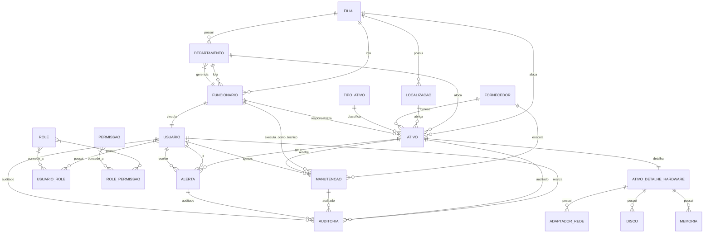

# Database Schema Specification — aegis_patrimonio

> **Versão:** 1.0 · **Owner:** Aegis Patrimônio — Engenharia de Dados · **Status:** Draft
> Contrato físico do banco. Cada objeto aqui declarado é a fonte da verdade para gerar `database/schema/` — **nunca edite o SQL gerado diretamente**; edite este contrato e regenere.

> **⚠️ AVISO CRÍTICO — Motor de banco não definido**  
> O bloco de Stack Tecnológica verificado indica: `"motor_de_banco": "nenhum motor de banco conhecido encontrado nas dependências"` e `"orm_ou_query_builder": "nenhum ORM/query builder encontrado — provavelmente SQL cru"`.  
> O modelo de domínio ([[db-domain-model]]) assume tipos lógicos (UUID, NUMERIC, JSONB, ENUM, INET, MACAddress) e cita JPA/Hibernate (ASM-017), mas **o mapeamento físico exato depende do SGBD alvo (PostgreSQL, Oracle, SQL Server, MySQL, etc.)**.  
> **Todas as definições de tipo abaixo são LÓGICAS** — a conversão para tipos nativos (ex.: `UUID` → `uuid` no PG, `RAW(16)` no Oracle, `UNIQUEIDENTIFIER` no SQL Server) deve ser feita no momento da geração do DDL, após a decisão de arquitetura.  
> Nenhum arquivo `server/db.ts` ou equivalente foi localizado no workspace; este contrato deriva **exclusivamente** do modelo conceitual em [[db-domain-model]].

---

## 1. Tables

### 1.1 `ativo`
```yaml
table:
  name: "ativo"
  entity: "Ativo — ver [[db-domain-model#ent-ativo]]"
  classification: "core"
  description: "Bem patrimonial rastreável (hardware, software, móvel, equipamento) com identificação única, classificação, localização, responsável e métricas de saúde para gestão de ciclo de vida e depreciação."

  columns:
    - name: "id"
      type: "UUID"
      nullable: false
      default: "gen_random_uuid()  -- [INFERIDO POR IA — REQUER VALIDAÇÃO HUMANA: depende do SGBD]"
      logical_type: "TechnicalID"
      sensitivity: "internal"
      constraints: []
    - name: "tag_patrimonial"
      type: "VARCHAR(50)"
      nullable: false
      default: null
      logical_type: "BusinessID"
      sensitivity: "internal"
      constraints: ["UNIQUE"]
    - name: "numero_serie"
      type: "VARCHAR(100)"
      nullable: true
      default: null
      logical_type: "SerialNumber"
      sensitivity: "internal"
      constraints: ["UNIQUE_PER_TIPO_ATIVO  -- ver constraint composta em seção 3"]
    - name: "nome"
      type: "VARCHAR(200)"
      nullable: false
      default: null
      logical_type: "Name"
      sensitivity: "internal"
      constraints: []
    - name: "descricao"
      type: "TEXT"
      nullable: true
      default: null
      logical_type: "Description"
      sensitivity: "internal"
      constraints: []
    - name: "tipo_ativo_id"
      type: "UUID"
      nullable: false
      default: null
      logical_type: "ForeignKey"
      sensitivity: "internal"
      constraints: ["FK → tipo_ativo.id"]
    - name: "filial_id"
      type: "UUID"
      nullable: false
      default: null
      logical_type: "ForeignKey"
      sensitivity: "internal"
      constraints: ["FK → filial.id"]
    - name: "departamento_id"
      type: "UUID"
      nullable: true
      default: null
      logical_type: "ForeignKey"
      sensitivity: "internal"
      constraints: ["FK → departamento.id"]
    - name: "localizacao_id"
      type: "UUID"
      nullable: true
      default: null
      logical_type: "ForeignKey"
      sensitivity: "internal"
      constraints: ["FK → localizacao.id"]
    - name: "fornecedor_id"
      type: "UUID"
      nullable: true
      default: null
      logical_type: "ForeignKey"
      sensitivity: "internal"
      constraints: ["FK → fornecedor.id"]
    - name: "funcionario_responsavel_id"
      type: "UUID"
      nullable: true
      default: null
      logical_type: "ForeignKey"
      sensitivity: "internal"
      constraints: ["FK → funcionario.id"]
    - name: "data_aquisicao"
      type: "DATE"
      nullable: false
      default: null
      logical_type: "LocalDate"
      sensitivity: "internal"
      constraints: ["CHECK (data_aquisicao <= CURRENT_DATE)"]
    - name: "valor_aquisicao"
      type: "NUMERIC(18,4)"
      nullable: false
      default: null
      logical_type: "Money"
      sensitivity: "confidential"
      constraints: ["CHECK (valor_aquisicao > 0)"]
    - name: "vida_util_meses"
      type: "INTEGER"
      nullable: false
      default: null
      logical_type: "PositiveInteger"
      sensitivity: "internal"
      constraints: ["CHECK (vida_util_meses > 0)"]
    - name: "status"
      type: "VARCHAR(20)  -- ENUM lógico: ATIVO, EM_MANUTENCAO, DESCARTADO, VENDIDO, EMPRESTADO"
      nullable: false
      default: "'ATIVO'"
      logical_type: "StatusAtivo"
      sensitivity: "internal"
      constraints: ["CHECK (status IN ('ATIVO','EM_MANUTENCAO','DESCARTADO','VENDIDO','EMPRESTADO'))"]
    - name: "condicao"
      type: "VARCHAR(10)  -- ENUM lógico: NOVO, BOM, REGULAR, RUIM, SUCATA"
      nullable: false
      default: "'NOVO'"
      logical_type: "CondicaoAtivo"
      sensitivity: "internal"
      constraints: ["CHECK (condicao IN ('NOVO','BOM','REGULAR','RUIM','SUCATA'))"]
    - name: "ultimo_health_check"
      type: "TIMESTAMP WITH TIME ZONE"
      nullable: true
      default: null
      logical_type: "Instant"
      sensitivity: "internal"
      constraints: []
    - name: "uso_disco_percentual"
      type: "NUMERIC(5,2)"
      nullable: true
      default: null
      logical_type: "Percentage"
      sensitivity: "internal"
      constraints: ["CHECK (uso_disco_percentual BETWEEN 0 AND 100)"]
    - name: "memoria_total_gb"
      type: "INTEGER"
      nullable: true
      default: null
      logical_type: "PositiveInteger"
      sensitivity: "internal"
      constraints: ["CHECK (memoria_total_gb > 0)"]
    - name: "processador"
      type: "VARCHAR(200)"
      nullable: true
      default: null
      logical_type: "String"
      sensitivity: "internal"
      constraints: []
    - name: "sistema_operacional"
      type: "VARCHAR(100)"
      nullable: true
      default: null
      logical_type: "String"
      sensitivity: "internal"
      constraints: []
    - name: "created_at"
      type: "TIMESTAMP WITH TIME ZONE"
      nullable: false
      default: "CURRENT_TIMESTAMP"
      logical_type: "Instant"
      sensitivity: "internal"
      constraints: []
    - name: "updated_at"
      type: "TIMESTAMP WITH TIME ZONE"
      nullable: false
      default: "CURRENT_TIMESTAMP"
      logical_type: "Instant"
      sensitivity: "internal"
      constraints: []
    - name: "created_by"
      type: "UUID"
      nullable: false
      default: null
      logical_type: "ForeignKey"
      sensitivity: "internal"
      constraints: ["FK → usuario.id"]
    - name: "updated_by"
      type: "UUID"
      nullable: false
      default: null
      logical_type: "ForeignKey"
      sensitivity: "internal"
      constraints: ["FK → usuario.id"]

  primary_key: ["id"]
  foreign_keys: []  # ver seção 2
  unique_constraints: []  # ver seção 3
  check_constraints: []  # ver seção 3
  indexes: []  # ver seção 4
```

### 1.2 `tipo_ativo`
```yaml
table:
  name: "tipo_ativo"
  entity: "TipoAtivo — ver [[db-domain-model#ent-tipo-ativo]]"
  classification: "reference"
  description: "Classificação/categoria de ativos que define regras de depreciação, vida útil padrão, métricas de saúde esperadas e campos técnicos aplicáveis."

  columns:
    - name: "id"
      type: "UUID"
      nullable: false
      default: "gen_random_uuid()  -- [INFERIDO POR IA — REQUER VALIDAÇÃO HUMANA]"
      logical_type: "TechnicalID"
      sensitivity: "public"
      constraints: []
    - name: "codigo"
      type: "VARCHAR(30)"
      nullable: false
      default: null
      logical_type: "BusinessCode"
      sensitivity: "public"
      constraints: ["UNIQUE"]
    - name: "nome"
      type: "VARCHAR(100)"
      nullable: false
      default: null
      logical_type: "Name"
      sensitivity: "public"
      constraints: []
    - name: "descricao"
      type: "TEXT"
      nullable: true
      default: null
      logical_type: "Description"
      sensitivity: "public"
      constraints: []
    - name: "vida_util_padrao_meses"
      type: "INTEGER"
      nullable: false
      default: null
      logical_type: "PositiveInteger"
      sensitivity: "public"
      constraints: ["CHECK (vida_util_padrao_meses > 0)"]
    - name: "taxa_depreciacao_anual"
      type: "NUMERIC(5,4)"
      nullable: false
      default: null
      logical_type: "DecimalRate"
      sensitivity: "public"
      constraints: ["CHECK (taxa_depreciacao_anual >= 0 AND taxa_depreciacao_anual <= 1)"]
    - name: "categoria"
      type: "VARCHAR(20)  -- ENUM lógico: HARDWARE, SOFTWARE, MOVEL, EQUIPAMENTO, VEICULO, OUTRO"
      nullable: false
      default: null
      logical_type: "CategoriaAtivo"
      sensitivity: "public"
      constraints: ["CHECK (categoria IN ('HARDWARE','SOFTWARE','MOVEL','EQUIPAMENTO','VEICULO','OUTRO'))"]
    - name: "campos_tecnicos_obrigatorios"
      type: "JSONB  -- [INFERIDO POR IA — REQUER VALIDAÇÃO HUMANA: mapeamento físico depende do SGBD; PG=JSONB, Oracle=JSON, SQL Server=NVARCHAR(MAX) com CHECK ISJSON]"
      nullable: true
      default: null
      logical_type: "JSONMetadata"
      sensitivity: "public"
      constraints: []
    - name: "ativo"
      type: "BOOLEAN"
      nullable: false
      default: "true"
      logical_type: "BooleanFlag"
      sensitivity: "public"
      constraints: []
    - name: "created_at"
      type: "TIMESTAMP WITH TIME ZONE"
      nullable: false
      default: "CURRENT_TIMESTAMP"
      logical_type: "Instant"
      sensitivity: "public"
      constraints: []
    - name: "updated_at"
      type: "TIMESTAMP WITH TIME ZONE"
      nullable: false
      default: "CURRENT_TIMESTAMP"
      logical_type: "Instant"
      sensitivity: "public"
      constraints: []

  primary_key: ["id"]
  foreign_keys: []
  unique_constraints: []
  check_constraints: []
  indexes: []
```

### 1.3 `manutencao`
```yaml
table:
  name: "manutencao"
  entity: "Manutencao — ver [[db-domain-model#ent-manutencao]]"
  classification: "transactional"
  description: "Ordem de manutenção (preventiva ou corretiva) associada a um ativo, com ciclo de vida de aprovação, execução e conclusão, custos, fornecedor e técnico responsável."

  columns:
    - name: "id"
      type: "UUID"
      nullable: false
      default: "gen_random_uuid()  -- [INFERIDO POR IA — REQUER VALIDAÇÃO HUMANA]"
      logical_type: "TechnicalID"
      sensitivity: "internal"
      constraints: []
    - name: "numero_ordem"
      type: "VARCHAR(50)"
      nullable: false
      default: null
      logical_type: "BusinessID"
      sensitivity: "internal"
      constraints: ["UNIQUE"]
    - name: "ativo_id"
      type: "UUID"
      nullable: false
      default: null
      logical_type: "ForeignKey"
      sensitivity: "internal"
      constraints: ["FK → ativo.id"]
    - name: "tipo"
      type: "VARCHAR(20)  -- ENUM lógico: PREVENTIVA, CORRETIVA, PREDITIVA, MELHORIA"
      nullable: false
      default: null
      logical_type: "TipoManutencao"
      sensitivity: "internal"
      constraints: ["CHECK (tipo IN ('PREVENTIVA','CORRETIVA','PREDITIVA','MELHORIA'))"]
    - name: "status"
      type: "VARCHAR(20)  -- ENUM lógico: SOLICITADA, APROVADA, EM_ANDAMENTO, CONCLUIDA, CANCELADA, AGUARDANDO_PECAS"
      nullable: false
      default: "'SOLICITADA'"
      logical_type: "StatusManutencao"
      sensitivity: "internal"
      constraints: ["CHECK (status IN ('SOLICITADA','APROVADA','EM_ANDAMENTO','CONCLUIDA','CANCELADA','AGUARDANDO_PECAS'))"]
    - name: "prioridade"
      type: "VARCHAR(10)  -- ENUM lógico: BAIXA, MEDIA, ALTA, CRITICA"
      nullable: false
      default: null
      logical_type: "Prioridade"
      sensitivity: "internal"
      constraints: ["CHECK (prioridade IN ('BAIXA','MEDIA','ALTA','CRITICA'))"]
    - name: "descricao_problema"
      type: "TEXT"
      nullable: false
      default: null
      logical_type: "Description"
      sensitivity: "internal"
      constraints: []
    - name: "descricao_solucao"
      type: "TEXT"
      nullable: true
      default: null
      logical_type: "Description"
      sensitivity: "internal"
      constraints: []
    - name: "data_abertura"
      type: "TIMESTAMP WITH TIME ZONE"
      nullable: false
      default: "CURRENT_TIMESTAMP"
      logical_type: "Instant"
      sensitivity: "internal"
      constraints: []
    - name: "data_aprovacao"
      type: "TIMESTAMP WITH TIME ZONE"
      nullable: true
      default: null
      logical_type: "Instant"
      sensitivity: "internal"
      constraints: ["CHECK (data_aprovacao >= data_abertura)"]
    - name: "data_inicio"
      type: "TIMESTAMP WITH TIME ZONE"
      nullable: true
      default: null
      logical_type: "Instant"
      sensitivity: "internal"
      constraints: ["CHECK (data_inicio >= data_aprovacao)"]
    - name: "data_conclusao"
      type: "TIMESTAMP WITH TIME ZONE"
      nullable: true
      default: null
      logical_type: "Instant"
      sensitivity: "internal"
      constraints: ["CHECK (data_conclusao >= data_inicio)"]
    - name: "data_prevista_conclusao"
      type: "TIMESTAMP WITH TIME ZONE"
      nullable: true
      default: null
      logical_type: "Instant"
      sensitivity: "internal"
      constraints: []
    - name: "custo_pecas"
      type: "NUMERIC(18,4)"
      nullable: true
      default: null
      logical_type: "Money"
      sensitivity: "confidential"
      constraints: ["CHECK (custo_pecas >= 0)"]
    - name: "custo_mao_obra"
      type: "NUMERIC(18,4)"
      nullable: true
      default: null
      logical_type: "Money"
      sensitivity: "confidential"
      constraints: ["CHECK (custo_mao_obra >= 0)"]
    - name: "custo_total"
      type: "NUMERIC(18,4)"
      nullable: true
      default: null
      logical_type: "Money"
      sensitivity: "confidential"
      constraints: ["CHECK (custo_total = COALESCE(custo_pecas,0) + COALESCE(custo_mao_obra,0))"]
    - name: "fornecedor_id"
      type: "UUID"
      nullable: true
      default: null
      logical_type: "ForeignKey"
      sensitivity: "internal"
      constraints: ["FK → fornecedor.id"]
    - name: "tecnico_responsavel_id"
      type: "UUID"
      nullable: true
      default: null
      logical_type: "ForeignKey"
      sensitivity: "internal"
      constraints: ["FK → funcionario.id"]
    - name: "aprovador_id"
      type: "UUID"
      nullable: true
      default: null
      logical_type: "ForeignKey"
      sensitivity: "internal"
      constraints: ["FK → usuario.id"]
    - name: "observacoes"
      type: "TEXT"
      nullable: true
      default: null
      logical_type: "Description"
      sensitivity: "internal"
      constraints: []
    - name: "created_at"
      type: "TIMESTAMP WITH TIME ZONE"
      nullable: false
      default: "CURRENT_TIMESTAMP"
      logical_type: "Instant"
      sensitivity: "internal"
      constraints: []
    - name: "updated_at"
      type: "TIMESTAMP WITH TIME ZONE"
      nullable: false
      default: "CURRENT_TIMESTAMP"
      logical_type: "Instant"
      sensitivity: "internal"
      constraints: []
    - name: "created_by"
      type: "UUID"
      nullable: false
      default: null
      logical_type: "ForeignKey"
      sensitivity: "internal"
      constraints: ["FK → usuario.id"]
    - name: "updated_by"
      type: "UUID"
      nullable: false
      default: null
      logical_type: "ForeignKey"
      sensitivity: "internal"
      constraints: ["FK → usuario.id"]

  primary_key: ["id"]
  foreign_keys: []
  unique_constraints: []
  check_constraints: []
  indexes: []
```

### 1.4 `alerta`
```yaml
table:
  name: "alerta"
  entity: "Alerta — ver [[db-domain-model#ent-alerta]]"
  classification: "transactional"
  description: "Notificação automática ou manual gerada para situações de atenção no patrimônio (uso de disco crítico, manutenção vencida, saúde do ativo degradada, etc.)."

  columns:
    - name: "id"
      type: "UUID"
      nullable: false
      default: "gen_random_uuid()  -- [INFERIDO POR IA — REQUER VALIDAÇÃO HUMANA]"
      logical_type: "TechnicalID"
      sensitivity: "internal"
      constraints: []
    - name: "ativo_id"
      type: "UUID"
      nullable: true
      default: null
      logical_type: "ForeignKey"
      sensitivity: "internal"
      constraints: ["FK → ativo.id"]
    - name: "tipo"
      type: "VARCHAR(30)  -- ENUM lógico: USO_DISCO_CRITICO, USO_MEMORIA_CRITICO, MANUTENCAO_VENCIDA, SAUDE_DEGRADADA, GARANTIA_EXPIRANDO, DEPRECIACAO_ACELERADA, OUTRO"
      nullable: false
      default: null
      logical_type: "TipoAlerta"
      sensitivity: "internal"
      constraints: ["CHECK (tipo IN ('USO_DISCO_CRITICO','USO_MEMORIA_CRITICO','MANUTENCAO_VENCIDA','SAUDE_DEGRADADA','GARANTIA_EXPIRANDO','DEPRECIACAO_ACELERADA','OUTRO'))"]
    - name: "severidade"
      type: "VARCHAR(10)  -- ENUM lógico: INFO, WARNING, CRITICAL"
      nullable: false
      default: null
      logical_type: "Severidade"
      sensitivity: "internal"
      constraints: ["CHECK (severidade IN ('INFO','WARNING','CRITICAL'))"]
    - name: "titulo"
      type: "VARCHAR(200)"
      nullable: false
      default: null
      logical_type: "Title"
      sensitivity: "internal"
      constraints: []
    - name: "mensagem"
      type: "TEXT"
      nullable: false
      default: null
      logical_type: "Description"
      sensitivity: "internal"
      constraints: []
    - name: "status"
      type: "VARCHAR(20)  -- ENUM lógico: NAO_LIDO, LIDO, EM_TRATAMENTO, RESOLVIDO, IGNORADO"
      nullable: false
      default: "'NAO_LIDO'"
      logical_type: "StatusAlerta"
      sensitivity: "internal"
      constraints: ["CHECK (status IN ('NAO_LIDO','LIDO','EM_TRATAMENTO','RESOLVIDO','IGNORADO'))"]
    - name: "data_criacao"
      type: "TIMESTAMP WITH TIME ZONE"
      nullable: false
      default: "CURRENT_TIMESTAMP"
      logical_type: "Instant"
      sensitivity: "internal"
      constraints: []
    - name: "data_leitura"
      type: "TIMESTAMP WITH TIME ZONE"
      nullable: true
      default: null
      logical_type: "Instant"
      sensitivity: "internal"
      constraints: ["CHECK (data_leitura >= data_criacao)"]
    - name: "data_resolucao"
      type: "TIMESTAMP WITH TIME ZONE"
      nullable: true
      default: null
      logical_type: "Instant"
      sensitivity: "internal"
      constraints: ["CHECK (data_resolucao >= data_leitura)"]
    - name: "usuario_leitura_id"
      type: "UUID"
      nullable: true
      default: null
      logical_type: "ForeignKey"
      sensitivity: "internal"
      constraints: ["FK → usuario.id"]
    - name: "usuario_resolucao_id"
      type: "UUID"
      nullable: true
      default: null
      logical_type: "ForeignKey"
      sensitivity: "internal"
      constraints: ["FK → usuario.id"]
    - name: "metadados"
      type: "JSONB  -- [INFERIDO POR IA — REQUER VALIDAÇÃO HUMANA: mapeamento físico depende do SGBD]"
      nullable: true
      default: null
      logical_type: "JSONMetadata"
      sensitivity: "internal"
      constraints: []
    - name: "created_at"
      type: "TIMESTAMP WITH TIME ZONE"
      nullable: false
      default: "CURRENT_TIMESTAMP"
      logical_type: "Instant"
      sensitivity: "internal"
      constraints: []
    - name: "updated_at"
      type: "TIMESTAMP WITH TIME ZONE"
      nullable: false
      default: "CURRENT_TIMESTAMP"
      logical_type: "Instant"
      sensitivity: "internal"
      constraints: []

  primary_key: ["id"]
  foreign_keys: []
  unique_constraints: []
  check_constraints: []
  indexes: []
```

### 1.5 `usuario`
```yaml
table:
  name: "usuario"
  entity: "Usuario — ver [[db-domain-model#ent-usuario]]"
  classification: "core"
  description: "Usuário do sistema com credenciais de autenticação, perfil de acesso (RBAC) e vínculo opcional a funcionário para contexto patrimonial."

  columns:
    - name: "id"
      type: "UUID"
      nullable: false
      default: "gen_random_uuid()  -- [INFERIDO POR IA — REQUER VALIDAÇÃO HUMANA]"
      logical_type: "TechnicalID"
      sensitivity: "confidential"
      constraints: []
    - name: "username"
      type: "VARCHAR(100)"
      nullable: false
      default: null
      logical_type: "Username"
      sensitivity: "confidential"
      constraints: ["UNIQUE"]
    - name: "email"
      type: "VARCHAR(255)  -- [INFERIDO POR IA — REQUER VALIDAÇÃO HUMANA: validação de formato email via CHECK ou domínio customizado]"
      nullable: false
      default: null
      logical_type: "Email"
      sensitivity: "confidential"
      constraints: ["UNIQUE"]
    - name: "password_hash"
      type: "VARCHAR(255)"
      nullable: false
      default: null
      logical_type: "PasswordHash"
      sensitivity: "restricted"
      constraints: []
    - name: "nome_completo"
      type: "VARCHAR(200)"
      nullable: false
      default: null
      logical_type: "Name"
      sensitivity: "confidential"
      constraints: []
    - name: "ativo"
      type: "BOOLEAN"
      nullable: false
      default: "true"
      logical_type: "BooleanFlag"
      sensitivity: "confidential"
      constraints: []
    - name: "funcionario_id"
      type: "UUID"
      nullable: true
      default: null
      logical_type: "ForeignKey"
      sensitivity: "confidential"
      constraints: ["FK → funcionario.id", "UNIQUE  -- 1:1 lógico"]
    - name: "ultimo_login"
      type: "TIMESTAMP WITH TIME ZONE"
      nullable: true
      default: null
      logical_type: "Instant"
      sensitivity: "confidential"
      constraints: []
    - name: "tentativas_login_falhas"
      type: "INTEGER"
      nullable: false
      default: "0"
      logical_type: "Counter"
      sensitivity: "confidential"
      constraints: ["CHECK (tentativas_login_falhas >= 0)"]
    - name: "bloqueado_ate"
      type: "TIMESTAMP WITH TIME ZONE"
      nullable: true
      default: null
      logical_type: "Instant"
      sensitivity: "confidential"
      constraints: ["CHECK (bloqueado_ate > CURRENT_TIMESTAMP)"]
    - name: "password_updated_at"
      type: "TIMESTAMP WITH TIME ZONE"
      nullable: false
      default: "CURRENT_TIMESTAMP"
      logical_type: "Instant"
      sensitivity: "confidential"
      constraints: []
    - name: "created_at"
      type: "TIMESTAMP WITH TIME ZONE"
      nullable: false
      default: "CURRENT_TIMESTAMP"
      logical_type: "Instant"
      sensitivity: "confidential"
      constraints: []
    - name: "updated_at"
      type: "TIMESTAMP WITH TIME ZONE"
      nullable: false
      default: "CURRENT_TIMESTAMP"
      logical_type: "Instant"
      sensitivity: "confidential"
      constraints: []
    - name: "created_by"
      type: "UUID"
      nullable: false
      default: null
      logical_type: "ForeignKey"
      sensitivity: "confidential"
      constraints: ["FK → usuario.id"]
    - name: "updated_by"
      type: "UUID"
      nullable: false
      default: null
      logical_type: "ForeignKey"
      sensitivity: "confidential"
      constraints: ["FK → usuario.id"]

  primary_key: ["id"]
  foreign_keys: []
  unique_constraints: []
  check_constraints: []
  indexes: []
```

### 1.6 `role`
```yaml
table:
  name: "role"
  entity: "Role — ver [[db-domain-model#ent-role]]"
  classification: "reference"
  description: "Papel de acesso (perfil) que agrega permissões para controle RBAC (ex.: ADMIN, GESTOR_PATRIMONIO, TECNICO_MANUTENCAO, VISUALIZADOR)."

  columns:
    - name: "id"
      type: "UUID"
      nullable: false
      default: "gen_random_uuid()  -- [INFERIDO POR IA — REQUER VALIDAÇÃO HUMANA]"
      logical_type: "TechnicalID"
      sensitivity: "internal"
      constraints: []
    - name: "nome"
      type: "VARCHAR(50)"
      nullable: false
      default: null
      logical_type: "BusinessCode"
      sensitivity: "internal"
      constraints: ["UNIQUE"]
    - name: "descricao"
      type: "VARCHAR(200)"
      nullable: true
      default: null
      logical_type: "Description"
      sensitivity: "internal"
      constraints: []
    - name: "ativo"
      type: "BOOLEAN"
      nullable: false
      default: "true"
      logical_type: "BooleanFlag"
      sensitivity: "internal"
      constraints: []
    - name: "created_at"
      type: "TIMESTAMP WITH TIME ZONE"
      nullable: false
      default: "CURRENT_TIMESTAMP"
      logical_type: "Instant"
      sensitivity: "internal"
      constraints: []
    - name: "updated_at"
      type: "TIMESTAMP WITH TIME ZONE"
      nullable: false
      default: "CURRENT_TIMESTAMP"
      logical_type: "Instant"
      sensitivity: "internal"
      constraints: []

  primary_key: ["id"]
  foreign_keys: []
  unique_constraints: []
  check_constraints: []
  indexes: []
```

### 1.7 `permissao`
```yaml
table:
  name: "permissao"
  entity: "Permissao — ver [[db-domain-model#ent-permissao]]"
  classification: "reference"
  description: "Permissão atômica de acesso a um recurso/ação do sistema (ex.: ATIVO_CREATE, MANUTENCAO_APROVAR, ALERTA_RESOLVER, RELATORIO_CUSTO_TOTAL)."

  columns:
    - name: "id"
      type: "UUID"
      nullable: false
      default: "gen_random_uuid()  -- [INFERIDO POR IA — REQUER VALIDAÇÃO HUMANA]"
      logical_type: "TechnicalID"
      sensitivity: "internal"
      constraints: []
    - name: "codigo"
      type: "VARCHAR(100)"
      nullable: false
      default: null
      logical_type: "BusinessCode"
      sensitivity: "internal"
      constraints: ["UNIQUE"]
    - name: "descricao"
      type: "VARCHAR(200)"
      nullable: true
      default: null
      logical_type: "Description"
      sensitivity: "internal"
      constraints: []
    - name: "recurso"
      type: "VARCHAR(50)"
      nullable: false
      default: null
      logical_type: "ResourceName"
      sensitivity: "internal"
      constraints: []
    - name: "acao"
      type: "VARCHAR(50)"
      nullable: false
      default: null
      logical_type: "ActionName"
      sensitivity: "internal"
      constraints: []
    - name: "ativo"
      type: "BOOLEAN"
      nullable: false
      default: "true"
      logical_type: "BooleanFlag"
      sensitivity: "internal"
      constraints: []
    - name: "created_at"
      type: "TIMESTAMP WITH TIME ZONE"
      nullable: false
      default: "CURRENT_TIMESTAMP"
      logical_type: "Instant"
      sensitivity: "internal"
      constraints: []
    - name: "updated_at"
      type: "TIMESTAMP WITH TIME ZONE"
      nullable: false
      default: "CURRENT_TIMESTAMP"
      logical_type: "Instant"
      sensitivity: "internal"
      constraints: []

  primary_key: ["id"]
  foreign_keys: []
  unique_constraints: []
  check_constraints: []
  indexes: []
```

### 1.8 `funcionario`
```yaml
table:
  name: "funcionario"
  entity: "Funcionario — ver [[db-domain-model#ent-funcionario]]"
  classification: "core"
  description: "Cadastro de colaborador da empresa para vínculo com ativos (responsável), manutenções (técnico) e usuários (acesso ao sistema)."

  columns:
    - name: "id"
      type: "UUID"
      nullable: false
      default: "gen_random_uuid()  -- [INFERIDO POR IA — REQUER VALIDAÇÃO HUMANA]"
      logical_type: "TechnicalID"
      sensitivity: "confidential"
      constraints: []
    - name: "matricula"
      type: "VARCHAR(30)"
      nullable: false
      default: null
      logical_type: "BusinessID"
      sensitivity: "confidential"
      constraints: ["UNIQUE"]
    - name: "cpf"
      type: "VARCHAR(14)  -- [INFERIDO POR IA — REQUER VALIDAÇÃO HUMANA: formato XXX.XXX.XXX-XX ou apenas dígitos; validação algorítmica via CHECK ou trigger]"
      nullable: false
      default: null
      logical_type: "CPF"
      sensitivity: "confidential"
      constraints: ["UNIQUE", "CHECK (cpf ~ '^\\d{3}\\.?\\d{3}\\.?\\d{3}-?\\d{2}$')  -- regex básica; validação completa via function]"]
    - name: "nome_completo"
      type: "VARCHAR(200)"
      nullable: false
      default: null
      logical_type: "Name"
      sensitivity: "confidential"
      constraints: []
    - name: "email_corporativo"
      type: "VARCHAR(255)"
      nullable: false
      default: null
      logical_type: "Email"
      sensitivity: "confidential"
      constraints: ["UNIQUE"]
    - name: "telefone"
      type: "VARCHAR(20)"
      nullable: true
      default: null
      logical_type: "Phone"
      sensitivity: "confidential"
      constraints: []
    - name: "cargo"
      type: "VARCHAR(100)"
      nullable: true
      default: null
      logical_type: "String"
      sensitivity: "confidential"
      constraints: []
    - name: "filial_id"
      type: "UUID"
      nullable: false
      default: null
      logical_type: "ForeignKey"
      sensitivity: "confidential"
      constraints: ["FK → filial.id"]
    - name: "departamento_id"
      type: "UUID"
      nullable: true
      default: null
      logical_type: "ForeignKey"
      sensitivity: "confidential"
      constraints: ["FK → departamento.id"]
    - name: "data_admissao"
      type: "DATE"
      nullable: false
      default: null
      logical_type: "LocalDate"
      sensitivity: "confidential"
      constraints: []
    - name: "data_desligamento"
      type: "DATE"
      nullable: true
      default: null
      logical_type: "LocalDate"
      sensitivity: "confidential"
      constraints: ["CHECK (data_desligamento >= data_admissao)"]
    - name: "ativo"
      type: "BOOLEAN"
      nullable: false
      default: "true"
      logical_type: "BooleanFlag"
      sensitivity: "confidential"
      constraints: ["CHECK ( (data_desligamento IS NOT NULL AND ativo = false) OR (data_desligamento IS NULL AND ativo = true) )"]
    - name: "created_at"
      type: "TIMESTAMP WITH TIME ZONE"
      nullable: false
      default: "CURRENT_TIMESTAMP"
      logical_type: "Instant"
      sensitivity: "confidential"
      constraints: []
    - name: "updated_at"
      type: "TIMESTAMP WITH TIME ZONE"
      nullable: false
      default: "CURRENT_TIMESTAMP"
      logical_type: "Instant"
      sensitivity: "confidential"
      constraints: []
    - name: "created_by"
      type: "UUID"
      nullable: false
      default: null
      logical_type: "ForeignKey"
      sensitivity: "confidential"
      constraints: ["FK → usuario.id"]
    - name: "updated_by"
      type: "UUID"
      nullable: false
      default: null
      logical_type: "ForeignKey"
      sensitivity: "confidential"
      constraints: ["FK → usuario.id"]

  primary_key: ["id"]
  foreign_keys: []
  unique_constraints: []
  check_constraints: []
  indexes: []
```

### 1.9 `filial`
```yaml
table:
  name: "filial"
  entity: "Filial — ver [[db-domain-model#ent-filial]]"
  classification: "reference"
  description: "Unidade organizacional da empresa (sede, filiais, centros de distribuição) para segregação patrimonial e relatórios por unidade."

  columns:
    - name: "id"
      type: "UUID"
      nullable: false
      default: "gen_random_uuid()  -- [INFERIDO POR IA — REQUER VALIDAÇÃO HUMANA]"
      logical_type: "TechnicalID"
      sensitivity: "public"
      constraints: []
    - name: "codigo"
      type: "VARCHAR(20)"
      nullable: false
      default: null
      logical_type: "BusinessCode"
      sensitivity: "public"
      constraints: ["UNIQUE"]
    - name: "nome"
      type: "VARCHAR(150)"
      nullable: false
      default: null
      logical_type: "Name"
      sensitivity: "public"
      constraints: ["UNIQUE"]
    - name: "endereco"
      type: "TEXT"
      nullable: true
      default: null
      logical_type: "Address"
      sensitivity: "public"
      constraints: []
    - name: "cidade"
      type: "VARCHAR(100)"
      nullable: true
      default: null
      logical_type: "City"
      sensitivity: "public"
      constraints: []
    - name: "estado"
      type: "VARCHAR(2)"
      nullable: true
      default: null
      logical_type: "StateCode"
      sensitivity: "public"
      constraints: []
    - name: "cep"
      type: "VARCHAR(10)"
      nullable: true
      default: null
      logical_type: "ZipCode"
      sensitivity: "public"
      constraints: []
    - name: "ativo"
      type: "BOOLEAN"
      nullable: false
      default: "true"
      logical_type: "BooleanFlag"
      sensitivity: "public"
      constraints: []
    - name: "created_at"
      type: "TIMESTAMP WITH TIME ZONE"
      nullable: false
      default: "CURRENT_TIMESTAMP"
      logical_type: "Instant"
      sensitivity: "public"
      constraints: []
    - name: "updated_at"
      type: "TIMESTAMP WITH TIME ZONE"
      nullable: false
      default: "CURRENT_TIMESTAMP"
      logical_type: "Instant"
      sensitivity: "public"
      constraints: []

  primary_key: ["id"]
  foreign_keys: []
  unique_constraints: []
  check_constraints: []
  indexes: []
```

### 1.10 `departamento`
```yaml
table:
  name: "departamento"
  entity: "Departamento — ver [[db-domain-model#ent-departamento]]"
  classification: "reference"
  description: "Divisão organizacional interna (TI, Facilities, Financeiro, etc.) para alocação de ativos e funcionários."

  columns:
    - name: "id"
      type: "UUID"
      nullable: false
      default: "gen_random_uuid()  -- [INFERIDO POR IA — REQUER VALIDAÇÃO HUMANA]"
      logical_type: "TechnicalID"
      sensitivity: "public"
      constraints: []
    - name: "codigo"
      type: "VARCHAR(20)"
      nullable: false
      default: null
      logical_type: "BusinessCode"
      sensitivity: "public"
      constraints: ["UNIQUE_PER_FILIAL  -- ver constraint composta em seção 3"]
    - name: "nome"
      type: "VARCHAR(150)"
      nullable: false
      default: null
      logical_type: "Name"
      sensitivity: "public"
      constraints: ["UNIQUE_PER_FILIAL  -- ver constraint composta em seção 3"]
    - name: "filial_id"
      type: "UUID"
      nullable: false
      default: null
      logical_type: "ForeignKey"
      sensitivity: "public"
      constraints: ["FK → filial.id"]
    - name: "gestor_id"
      type: "UUID"
      nullable: true
      default: null
      logical_type: "ForeignKey"
      sensitivity: "public"
      constraints: ["FK → funcionario.id"]
    - name: "ativo"
      type: "BOOLEAN"
      nullable: false
      default: "true"
      logical_type: "BooleanFlag"
      sensitivity: "public"
      constraints: []
    - name: "created_at"
      type: "TIMESTAMP WITH TIME ZONE"
      nullable: false
      default: "CURRENT_TIMESTAMP"
      logical_type: "Instant"
      sensitivity: "public"
      constraints: []
    - name: "updated_at"
      type: "TIMESTAMP WITH TIME ZONE"
      nullable: false
      default: "CURRENT_TIMESTAMP"
      logical_type: "Instant"
      sensitivity: "public"
      constraints: []

  primary_key: ["id"]
  foreign_keys: []
  unique_constraints: []
  check_constraints: []
  indexes: []
```

### 1.11 `localizacao`
```yaml
table:
  name: "localizacao"
  entity: "Localizacao — ver [[db-domain-model#ent-localizacao]]"
  classification: "reference"
  description: "Local físico específico (prédio, andar, sala, rack) para rastreamento preciso de ativos."

  columns:
    - name: "id"
      type: "UUID"
      nullable: false
      default: "gen_random_uuid()  -- [INFERIDO POR IA — REQUER VALIDAÇÃO HUMANA]"
      logical_type: "TechnicalID"
      sensitivity: "public"
      constraints: []
    - name: "codigo"
      type: "VARCHAR(30)"
      nullable: false
      default: null
      logical_type: "BusinessCode"
      sensitivity: "public"
      constraints: ["UNIQUE_PER_FILIAL  -- ver constraint composta em seção 3"]
    - name: "nome"
      type: "VARCHAR(150)"
      nullable: false
      default: null
      logical_type: "Name"
      sensitivity: "public"
      constraints: []
    - name: "filial_id"
      type: "UUID"
      nullable: false
      default: null
      logical_type: "ForeignKey"
      sensitivity: "public"
      constraints: ["FK → filial.id"]
    - name: "predio"
      type: "VARCHAR(50)"
      nullable: true
      default: null
      logical_type: "String"
      sensitivity: "public"
      constraints: []
    - name: "andar"
      type: "VARCHAR(20)"
      nullable: true
      default: null
      logical_type: "String"
      sensitivity: "public"
      constraints: []
    - name: "sala"
      type: "VARCHAR(50)"
      nullable: true
      default: null
      logical_type: "String"
      sensitivity: "public"
      constraints: []
    - name: "rack"
      type: "VARCHAR(50)"
      nullable: true
      default: null
      logical_type: "String"
      sensitivity: "public"
      constraints: []
    - name: "ativo"
      type: "BOOLEAN"
      nullable: false
      default: "true"
      logical_type: "BooleanFlag"
      sensitivity: "public"
      constraints: []
    - name: "created_at"
      type: "TIMESTAMP WITH TIME ZONE"
      nullable: false
      default: "CURRENT_TIMESTAMP"
      logical_type: "Instant"
      sensitivity: "public"
      constraints: []
    - name: "updated_at"
      type: "TIMESTAMP WITH TIME ZONE"
      nullable: false
      default: "CURRENT_TIMESTAMP"
      logical_type: "Instant"
      sensitivity: "public"
      constraints: []

  primary_key: ["id"]
  foreign_keys: []
  unique_constraints: []
  check_constraints: []
  indexes: []
```

### 1.12 `fornecedor`
```yaml
table:
  name: "fornecedor"
  entity: "Fornecedor — ver [[db-domain-model#ent-fornecedor]]"
  classification: "reference"
  description: "Fornecedor de ativos, peças ou serviços de manutenção para gestão de contratos, garantias e custos."

  columns:
    - name: "id"
      type: "UUID"
      nullable: false
      default: "gen_random_uuid()  -- [INFERIDO POR IA — REQUER VALIDAÇÃO HUMANA]"
      logical_type: "TechnicalID"
      sensitivity: "internal"
      constraints: []
    - name: "cnpj"
      type: "VARCHAR(18)  -- [INFERIDO POR IA — REQUER VALIDAÇÃO HUMANA: formato XX.XXX.XXX/XXXX-XX ou apenas dígitos; validação algorítmica via CHECK ou function]"
      nullable: false
      default: null
      logical_type: "CNPJ"
      sensitivity: "internal"
      constraints: ["UNIQUE", "CHECK (cnpj ~ '^\\d{2}\\.?\\d{3}\\.?\\d{3}/?\\d{4}-?\\d{2}$')  -- regex básica; validação completa via function]"]
    - name: "razao_social"
      type: "VARCHAR(200)"
      nullable: false
      default: null
      logical_type: "Name"
      sensitivity: "internal"
      constraints: []
    - name: "nome_fantasia"
      type: "VARCHAR(150)"
      nullable: true
      default: null
      logical_type: "Name"
      sensitivity: "internal"
      constraints: []
    - name: "email_contato"
      type: "VARCHAR(255)"
      nullable: true
      default: null
      logical_type: "Email"
      sensitivity: "internal"
      constraints: []
    - name: "telefone_contato"
      type: "VARCHAR(20)"
      nullable: true
      default: null
      logical_type: "Phone"
      sensitivity: "internal"
      constraints: []
    - name: "endereco"
      type: "TEXT"
      nullable: true
      default: null
      logical_type: "Address"
      sensitivity: "internal"
      constraints: []
    - name: "ativo"
      type: "BOOLEAN"
      nullable: false
      default: "true"
      logical_type: "BooleanFlag"
      sensitivity: "internal"
      constraints: []
    - name: "created_at"
      type: "TIMESTAMP WITH TIME ZONE"
      nullable: false
      default: "CURRENT_TIMESTAMP"
      logical_type: "Instant"
      sensitivity: "internal"
      constraints: []
    - name: "updated_at"
      type: "TIMESTAMP WITH TIME ZONE"
      nullable: false
      default: "CURRENT_TIMESTAMP"
      logical_type: "Instant"
      sensitivity: "internal"
      constraints: []

  primary_key: ["id"]
  foreign_keys: []
  unique_constraints: []
  check_constraints: []
  indexes: []
```

### 1.13 `ativo_detalhe_hardware`
```yaml
table:
  name: "ativo_detalhe_hardware"
  entity: "AtivoDetalheHardware — ver [[db-domain-model#ent-ativo-detalhe-hardware]]"
  classification: "supporting"
  description: "Detalhes técnicos de hardware (componentes) para ativos do tipo HARDWARE: adaptadores de rede, discos, memórias, processadores."

  columns:
    - name: "id"
      type: "UUID"
      nullable: false
      default: "gen_random_uuid()  -- [INFERIDO POR IA — REQUER VALIDAÇÃO HUMANA]"
      logical_type: "TechnicalID"
      sensitivity: "internal"
      constraints: []
    - name: "ativo_id"
      type: "UUID"
      nullable: false
      default: null
      logical_type: "ForeignKey"
      sensitivity: "internal"
      constraints: ["FK → ativo.id", "UNIQUE  -- enforça 1:1 lógico"]
    - name: "processador_modelo"
      type: "VARCHAR(200)"
      nullable: true
      default: null
      logical_type: "String"
      sensitivity: "internal"
      constraints: []
    - name: "processador_nucleos"
      type: "INTEGER"
      nullable: true
      default: null
      logical_type: "PositiveInteger"
      sensitivity: "internal"
      constraints: ["CHECK (processador_nucleos > 0)"]
    - name: "memoria_total_gb"
      type: "INTEGER"
      nullable: true
      default: null
      logical_type: "PositiveInteger"
      sensitivity: "internal"
      constraints: ["CHECK (memoria_total_gb > 0)"]
    - name: "memoria_tipo"
      type: "VARCHAR(50)"
      nullable: true
      default: null
      logical_type: "String"
      sensitivity: "internal"
      constraints: []
    - name: "disco_total_gb"
      type: "INTEGER"
      nullable: true
      default: null
      logical_type: "PositiveInteger"
      sensitivity: "internal"
      constraints: ["CHECK (disco_total_gb > 0)"]
    - name: "disco_tipo"
      type: "VARCHAR(10)  -- ENUM lógico: HDD, SSD, NVME, HIBRIDO"
      nullable: true
      default: null
      logical_type: "TipoDisco"
      sensitivity: "internal"
      constraints: ["CHECK (disco_tipo IN ('HDD','SSD','NVME','HIBRIDO'))"]
    - name: "placa_mae_modelo"
      type: "VARCHAR(200)"
      nullable: true
      default: null
      logical_type: "String"
      sensitivity: "internal"
      constraints: []
    - name: "bios_versao"
      type: "VARCHAR(50)"
      nullable: true
      default: null
      logical_type: "String"
      sensitivity: "internal"
      constraints: []
    - name: "coletado_em"
      type: "TIMESTAMP WITH TIME ZONE"
      nullable: false
      default: "CURRENT_TIMESTAMP"
      logical_type: "Instant"
      sensitivity: "internal"
      constraints: ["CHECK (coletado_em <= CURRENT_TIMESTAMP)"]
    - name: "created_at"
      type: "TIMESTAMP WITH TIME ZONE"
      nullable: false
      default: "CURRENT_TIMESTAMP"
      logical_type: "Instant"
      sensitivity: "internal"
      constraints: []
    - name: "updated_at"
      type: "TIMESTAMP WITH TIME ZONE"
      nullable: false
      default: "CURRENT_TIMESTAMP"
      logical_type: "Instant"
      sensitivity: "internal"
      constraints: []

  primary_key: ["id"]
  foreign_keys: []
  unique_constraints: []
  check_constraints: []
  indexes: []
```

### 1.14 `adaptador_rede`
```yaml
table:
  name: "adaptador_rede"
  entity: "AdaptadorRede — ver [[db-domain-model#ent-adaptador-rede]]"
  classification: "supporting"
  description: "Adaptador de interface de rede (NIC) inventariado no ativo de hardware."

  columns:
    - name: "id"
      type: "UUID"
      nullable: false
      default: "gen_random_uuid()  -- [INFERIDO POR IA — REQUER VALIDAÇÃO HUMANA]"
      logical_type: "TechnicalID"
      sensitivity: "internal"
      constraints: []
    - name: "ativo_detalhe_hardware_id"
      type: "UUID"
      nullable: false
      default: null
      logical_type: "ForeignKey"
      sensitivity: "internal"
      constraints: ["FK → ativo_detalhe_hardware.id ON DELETE CASCADE"]
    - name: "nome"
      type: "VARCHAR(100)"
      nullable: false
      default: null
      logical_type: "Name"
      sensitivity: "internal"
      constraints: []
    - name: "endereco_mac"
      type: "VARCHAR(17)  -- [INFERIDO POR IA — REQUER VALIDAÇÃO HUMANA: formato XX:XX:XX:XX:XX:XX; PG=MACADDR, outros=VARCHAR com CHECK]"
      nullable: false
      default: null
      logical_type: "MACAddress"
      sensitivity: "internal"
      constraints: ["UNIQUE_PER_ATIVO_DETALHE  -- ver constraint composta em seção 3", "CHECK (endereco_mac ~ '^([0-9A-Fa-f]{2}:){5}[0-9A-Fa-f]{2}$')"]
    - name: "endereco_ip"
      type: "VARCHAR(45)  -- [INFERIDO POR IA — REQUER VALIDAÇÃO HUMANA: IPv4 ou IPv6; PG=INET, outros=VARCHAR]"
      nullable: true
      default: null
      logical_type: "InetAddress"
      sensitivity: "internal"
      constraints: []
    - name: "velocidade_mbps"
      type: "INTEGER"
      nullable: true
      default: null
      logical_type: "PositiveInteger"
      sensitivity: "internal"
      constraints: ["CHECK (velocidade_mbps > 0)"]
    - name: "tipo"
      type: "VARCHAR(20)  -- ENUM lógico: ETHERNET, WIFI, BLUETOOTH, VIRTUAL, OUTRO"
      nullable: false
      default: null
      logical_type: "TipoAdaptadorRede"
      sensitivity: "internal"
      constraints: ["CHECK (tipo IN ('ETHERNET','WIFI','BLUETOOTH','VIRTUAL','OUTRO'))"]
    - name: "created_at"
      type: "TIMESTAMP WITH TIME ZONE"
      nullable: false
      default: "CURRENT_TIMESTAMP"
      logical_type: "Instant"
      sensitivity: "internal"
      constraints: []

  primary_key: ["id"]
  foreign_keys: []
  unique_constraints: []
  check_constraints: []
  indexes: []
```

### 1.15 `disco`
```yaml
table:
  name: "disco"
  entity: "Disco — ver [[db-domain-model#ent-disco]]"
  classification: "supporting"
  description: "Disco de armazenamento (HDD/SSD/NVMe) inventariado no ativo de hardware."

  columns:
    - name: "id"
      type: "UUID"
      nullable: false
      default: "gen_random_uuid()  -- [INFERIDO POR IA — REQUER VALIDAÇÃO HUMANA]"
      logical_type: "TechnicalID"
      sensitivity: "internal"
      constraints: []
    - name: "ativo_detalhe_hardware_id"
      type: "UUID"
      nullable: false
      default: null
      logical_type: "ForeignKey"
      sensitivity: "internal"
      constraints: ["FK → ativo_detalhe_hardware.id ON DELETE CASCADE"]
    - name: "modelo"
      type: "VARCHAR(100)"
      nullable: false
      default: null
      logical_type: "String"
      sensitivity: "internal"
      constraints: []
    - name: "numero_serie"
      type: "VARCHAR(100)"
      nullable: true
      default: null
      logical_type: "SerialNumber"
      sensitivity: "internal"
      constraints: []
    - name: "capacidade_gb"
      type: "INTEGER"
      nullable: false
      default: null
      logical_type: "PositiveInteger"
      sensitivity: "internal"
      constraints: ["CHECK (capacidade_gb > 0)"]
    - name: "tipo"
      type: "VARCHAR(10)  -- ENUM lógico: HDD, SSD, NVME, HIBRIDO"
      nullable: false
      default: null
      logical_type: "TipoDisco"
      sensitivity: "internal"
      constraints: ["CHECK (tipo IN ('HDD','SSD','NVME','HIBRIDO'))"]
    - name: "interface"
      type: "VARCHAR(30)"
      nullable: true
      default: null
      logical_type: "String"
      sensitivity: "internal"
      constraints: []
    - name: "saude_percentual"
      type: "INTEGER"
      nullable: true
      default: null
      logical_type: "Percentage"
      sensitivity: "internal"
      constraints: ["CHECK (saude_percentual BETWEEN 0 AND 100)"]
    - name: "created_at"
      type: "TIMESTAMP WITH TIME ZONE"
      nullable: false
      default: "CURRENT_TIMESTAMP"
      logical_type: "Instant"
      sensitivity: "internal"
      constraints: []

  primary_key: ["id"]
  foreign_keys: []
  unique_constraints: []
  check_constraints: []
  indexes: []
```

### 1.16 `memoria`
```yaml
table:
  name: "memoria"
  entity: "Memoria — ver [[db-domain-model#ent-memoria]]"
  classification: "supporting"
  description: "Módulo de memória RAM inventariado no ativo de hardware."

  columns:
    - name: "id"
      type: "UUID"
      nullable: false
      default: "gen_random_uuid()  -- [INFERIDO POR IA — REQUER VALIDAÇÃO HUMANA]"
      logical_type: "TechnicalID"
      sensitivity: "internal"
      constraints: []
    - name: "ativo_detalhe_hardware_id"
      type: "UUID"
      nullable: false
      default: null
      logical_type: "ForeignKey"
      sensitivity: "internal"
      constraints: ["FK → ativo_detalhe_hardware.id ON DELETE CASCADE"]
    - name: "modelo"
      type: "VARCHAR(100)"
      nullable: false
      default: null
      logical_type: "String"
      sensitivity: "internal"
      constraints: []
    - name: "capacidade_gb"
      type: "INTEGER"
      nullable: false
      default: null
      logical_type: "PositiveInteger"
      sensitivity: "internal"
      constraints: ["CHECK (capacidade_gb > 0)"]
    - name: "tipo"
      type: "VARCHAR(30)"
      nullable: true
      default: null
      logical_type: "String"
      sensitivity: "internal"
      constraints: []
    - name: "velocidade_mhz"
      type: "INTEGER"
      nullable: true
      default: null
      logical_type: "PositiveInteger"
      sensitivity: "internal"
      constraints: ["CHECK (velocidade_mhz > 0)"]
    - name: "slot"
      type: "VARCHAR(20)"
      nullable: true
      default: null
      logical_type: "String"
      sensitivity: "internal"
      constraints: []
    - name: "created_at"
      type: "TIMESTAMP WITH TIME ZONE"
      nullable: false
      default: "CURRENT_TIMESTAMP"
      logical_type: "Instant"
      sensitivity: "internal"
      constraints: []

  primary_key: ["id"]
  foreign_keys: []
  unique_constraints: []
  check_constraints: []
  indexes: []
```

### 1.17 `auditoria`
```yaml
table:
  name: "auditoria"
  entity: "Auditoria — ver [[db-domain-model#ent-auditoria]]"
  classification: "audit"
  description: "Trilha de auditoria imutável (WORM) de todas as operações relevantes: criação/alteração/exclusão de ativos, manutenções, alertas, usuários, concessão/revogação de roles, login/logout, exportações."

  columns:
    - name: "id"
      type: "UUID"
      nullable: false
      default: "gen_random_uuid()  -- [INFERIDO POR IA — REQUER VALIDAÇÃO HUMANA]"
      logical_type: "TechnicalID"
      sensitivity: "restricted"
      constraints: []
    - name: "correlation_id"
      type: "UUID"
      nullable: false
      default: null
      logical_type: "CorrelationID"
      sensitivity: "restricted"
      constraints: []
    - name: "usuario_id"
      type: "UUID"
      nullable: true
      default: null
      logical_type: "ForeignKey"
      sensitivity: "restricted"
      constraints: ["FK → usuario.id"]
    - name: "entidade"
      type: "VARCHAR(100)"
      nullable: false
      default: null
      logical_type: "EntityName"
      sensitivity: "restricted"
      constraints: []
    - name: "entidade_id"
      type: "UUID"
      nullable: false
      default: null
      logical_type: "EntityID"
      sensitivity: "restricted"
      constraints: []
    - name: "acao"
      type: "VARCHAR(20)  -- ENUM lógico: CREATE, UPDATE, DELETE, LOGIN, LOGOUT, EXPORT, IMPORT, APPROVE, REJECT, READ"
      nullable: false
      default: null
      logical_type: "AuditAction"
      sensitivity: "restricted"
      constraints: ["CHECK (acao IN ('CREATE','UPDATE','DELETE','LOGIN','LOGOUT','EXPORT','IMPORT','APPROVE','REJECT','READ'))"]
    - name: "valores_anteriores"
      type: "JSONB  -- [INFERIDO POR IA — REQUER VALIDAÇÃO HUMANA: mapeamento físico depende do SGBD]"
      nullable: true
      default: null
      logical_type: "JSONSnapshot"
      sensitivity: "restricted"
      constraints: []
    - name: "valores_novos"
      type: "JSONB  -- [INFERIDO POR IA — REQUER VALIDAÇÃO HUMANA]"
      nullable: true
      default: null
      logical_type: "JSONSnapshot"
      sensitivity: "restricted"
      constraints: []
    - name: "metadados"
      type: "JSONB  -- [INFERIDO POR IA — REQUER VALIDAÇÃO HUMANA]"
      nullable: true
      default: null
      logical_type: "JSONMetadata"
      sensitivity: "restricted"
      constraints: []
    - name: "ip_origem"
      type: "VARCHAR(45)  -- [INFERIDO POR IA — REQUER VALIDAÇÃO HUMANA: PG=INET, outros=VARCHAR]"
      nullable: true
      default: null
      logical_type: "InetAddress"
      sensitivity: "restricted"
      constraints: []
    - name: "user_agent"
      type: "VARCHAR(500)"
      nullable: true
      default: null
      logical_type: "UserAgent"
      sensitivity: "restricted"
      constraints: []
    - name: "data_hora"
      type: "TIMESTAMP WITH TIME ZONE"
      nullable: false
      default: "CURRENT_TIMESTAMP"
      logical_type: "Instant"
      sensitivity: "restricted"
      constraints: []
    - name: "hash_encadeado"
      type: "VARCHAR(64)  -- SHA-256 hex"
      nullable: false
      default: null
      logical_type: "HashChain"
      sensitivity: "restricted"
      constraints: []

  primary_key: ["id"]
  foreign_keys: []
  unique_constraints: []
  check_constraints: []
  indexes: []
```

### 1.18 `usuario_role`
```yaml
table:
  name: "usuario_role"
  entity: "UsuarioRole — ver [[db-domain-model#ent-usuario-role]]"
  classification: "supporting"
  description: "Tabela de associação N:N entre Usuario e Role para RBAC."

  columns:
    - name: "usuario_id"
      type: "UUID"
      nullable: false
      default: null
      logical_type: "ForeignKey"
      sensitivity: "internal"
      constraints: ["FK → usuario.id ON DELETE CASCADE"]
    - name: "role_id"
      type: "UUID"
      nullable: false
      default: null
      logical_type: "ForeignKey"
      sensitivity: "internal"
      constraints: ["FK → role.id ON DELETE CASCADE"]
    - name: "concedido_por"
      type: "UUID"
      nullable: false
      default: null
      logical_type: "ForeignKey"
      sensitivity: "internal"
      constraints: ["FK → usuario.id"]
    - name: "concedido_em"
      type: "TIMESTAMP WITH TIME ZONE"
      nullable: false
      default: "CURRENT_TIMESTAMP"
      logical_type: "Instant"
      sensitivity: "internal"
      constraints: []
    - name: "expira_em"
      type: "TIMESTAMP WITH TIME ZONE"
      nullable: true
      default: null
      logical_type: "Instant"
      sensitivity: "internal"
      constraints: ["CHECK (expira_em > concedido_em)"]

  primary_key: ["usuario_id", "role_id"]
  foreign_keys: []
  unique_constraints: []
  check_constraints: []
  indexes: []
```

### 1.19 `role_permissao`
```yaml
table:
  name: "role_permissao"
  entity: "RolePermissao — ver [[db-domain-model#ent-role-permissao]]"
  classification: "supporting"
  description: "Tabela de associação N:N entre Role e Permissao para composição de perfis de acesso."

  columns:
    - name: "role_id"
      type: "UUID"
      nullable: false
      default: null
      logical_type: "ForeignKey"
      sensitivity: "internal"
      constraints: ["FK → role.id ON DELETE CASCADE"]
    - name: "permissao_id"
      type: "UUID"
      nullable: false
      default: null
      logical_type: "ForeignKey"
      sensitivity: "internal"
      constraints: ["FK → permissao.id ON DELETE CASCADE"]
    - name: "concedido_por"
      type: "UUID"
      nullable: false
      default: null
      logical_type: "ForeignKey"
      sensitivity: "internal"
      constraints: ["FK → usuario.id"]
    - name: "concedido_em"
      type: "TIMESTAMP WITH TIME ZONE"
      nullable: false
      default: "CURRENT_TIMESTAMP"
      logical_type: "Instant"
      sensitivity: "internal"
      constraints: []

  primary_key: ["role_id", "permissao_id"]
  foreign_keys: []
  unique_constraints: []
  check_constraints: []
  indexes: []
```

---

## 2. Relationships

```yaml
relationships:
  - id: "REL-001"
    source: { entity: "Ativo", table: "ativo", column: "tipo_ativo_id" }
    target: { entity: "TipoAtivo", table: "tipo_ativo", column: "id" }
    cardinality: "N:1"
    on_delete: "restrict"
    on_update: "cascade"
    semantics: "Classificação do ativo (define regras de depreciação e métricas de saúde esperadas)"

  - id: "REL-002"
    source: { entity: "Ativo", table: "ativo", column: "filial_id" }
    target: { entity: "Filial", table: "filial", column: "id" }
    cardinality: "N:1"
    on_delete: "restrict"
    on_update: "cascade"
    semantics: "Unidade organizacional onde o ativo está alocado"

  - id: "REL-003"
    source: { entity: "Ativo", table: "ativo", column: "departamento_id" }
    target: { entity: "Departamento", table: "departamento", column: "id" }
    cardinality: "N:1"
    on_delete: "set_null"
    on_update: "cascade"
    semantics: "Departamento responsável pelo ativo (opcional)"

  - id: "REL-004"
    source: { entity: "Ativo", table: "ativo", column: "localizacao_id" }
    target: { entity: "Localizacao", table: "localizacao", column: "id" }
    cardinality: "N:1"
    on_delete: "set_null"
    on_update: "cascade"
    semantics: "Local físico/sala onde o ativo se encontra (opcional)"

  - id: "REL-005"
    source: { entity: "Ativo", table: "ativo", column: "fornecedor_id" }
    target: { entity: "Fornecedor", table: "fornecedor", column: "id" }
    cardinality: "N:1"
    on_delete: "set_null"
    on_update: "cascade"
    semantics: "Fornecedor de origem do ativo (opcional)"

  - id: "REL-006"
    source: { entity: "Ativo", table: "ativo", column: "funcionario_responsavel_id" }
    target: { entity: "Funcionario", table: "funcionario", column: "id" }
    cardinality: "N:1"
    on_delete: "set_null"
    on_update: "cascade"
    semantics: "Funcionário responsável/custodiante do ativo (opcional)"

  - id: "REL-007"
    source: { entity: "Manutencao", table: "manutencao", column: "ativo_id" }
    target: { entity: "Ativo", table: "ativo", column: "id" }
    cardinality: "N:1"
    on_delete: "restrict"
    on_update: "cascade"
    semantics: "Ativo objeto da manutenção"

  - id: "REL-008"
    source: { entity: "Manutencao", table: "manutencao", column: "fornecedor_id" }
    target: { entity: "Fornecedor", table: "fornecedor", column: "id" }
    cardinality: "N:1"
    on_delete: "set_null"
    on_update: "cascade"
    semantics: "Fornecedor executor (terceirizado) — opcional"

  - id: "REL-009"
    source: { entity: "Manutencao", table: "manutencao", column: "tecnico_responsavel_id" }
    target: { entity: "Funcionario", table: "funcionario", column: "id" }
    cardinality: "N:1"
    on_delete: "set_null"
    on_update: "cascade"
    semantics: "Técnico responsável pela execução (interno) — opcional"

  - id: "REL-010"
    source: { entity: "Manutencao", table: "manutencao", column: "aprovador_id" }
    target: { entity: "Usuario", table: "usuario", column: "id" }
    cardinality: "N:1"
    on_delete: "set_null"
    on_update: "cascade"
    semantics: "Usuário aprovador da manutenção — opcional"

  - id: "REL-011"
    source: { entity: "Alerta", table: "alerta", column: "ativo_id" }
    target: { entity: "Ativo", table: "ativo", column: "id" }
    cardinality: "N:1"
    on_delete: "set_null"
    on_update: "cascade"
    semantics: "Ativo relacionado ao alerta (opcional — alertas podem ser globais)"

  - id: "REL-012"
    source: { entity: "Alerta", table: "alerta", column: "usuario_leitura_id" }
    target: { entity: "Usuario", table: "usuario", column: "id" }
    cardinality: "N:1"
    on_delete: "set_null"
    on_update: "cascade"
    semantics: "Usuário que marcou como lido — opcional"

  - id: "REL-013"
    source: { entity: "Alerta", table: "alerta", column: "usuario_resolucao_id" }
    target: { entity: "Usuario", table: "usuario", column: "id" }
    cardinality: "N:1"
    on_delete: "set_null"
    on_update: "cascade"
    semantics: "Usuário que resolveu o alerta — opcional"

  - id: "REL-014"
    source: { entity: "Usuario", table: "usuario", column: "funcionario_id" }
    target: { entity: "Funcionario", table: "funcionario", column: "id" }
    cardinality: "1:1"
    on_delete: "set_null"
    on_update: "cascade"
    semantics: "Vínculo com cadastro de funcionário para contexto patrimonial (opcional)"

  - id: "REL-015"
    source: { entity: "Funcionario", table: "funcionario", column: "filial_id" }
    target: { entity: "Filial", table: "filial", column: "id" }
    cardinality: "N:1"
    on_delete: "restrict"
    on_update: "cascade"
    semantics: "Filial de lotação do funcionário"

  - id: "REL-016"
    source: { entity: "Funcionario", table: "funcionario", column: "departamento_id" }
    target: { entity: "Departamento", table: "departamento", column: "id" }
    cardinality: "N:1"
    on_delete: "set_null"
    on_update: "cascade"
    semantics: "Departamento de lotação (opcional)"

  - id: "REL-017"
    source: { entity: "Departamento", table: "departamento", column: "filial_id" }
    target: { entity: "Filial", table: "filial", column: "id" }
    cardinality: "N:1"
    on_delete: "restrict"
    on_update: "cascade"
    semantics: "Filial à qual o departamento pertence"

  - id: "REL-018"
    source: { entity: "Departamento", table: "departamento", column: "gestor_id" }
    target: { entity: "Funcionario", table: "funcionario", column: "id" }
    cardinality: "N:1"
    on_delete: "set_null"
    on_update: "cascade"
    semantics: "Gestor do departamento (referencia Funcionario)"

  - id: "REL-019"
    source: { entity: "Localizacao", table: "localizacao", column: "filial_id" }
    target: { entity: "Filial", table: "filial", column: "id" }
    cardinality: "N:1"
    on_delete: "restrict"
    on_update: "cascade"
    semantics: "Filial onde a localização se encontra"

  - id: "REL-020"
    source: { entity: "AtivoDetalheHardware", table: "ativo_detalhe_hardware", column: "ativo_id" }
    target: { entity: "Ativo", table: "ativo", column: "id" }
    cardinality: "N:1"
    on_delete: "cascade"
    on_update: "cascade"
    semantics: "Ativo pai (1:1 lógico, mas modelado como N:1 para flexibilidade)"

  - id: "REL-021"
    source: { entity: "AdaptadorRede", table: "adaptador_rede", column: "ativo_detalhe_hardware_id" }
    target: { entity: "AtivoDetalheHardware", table: "ativo_detalhe_hardware", column: "id" }
    cardinality: "N:1"
    on_delete: "cascade"
    on_update: "cascade"
    semantics: "Detalhe de hardware pai"

  - id: "REL-022"
    source: { entity: "Disco", table: "disco", column: "ativo_detalhe_hardware_id" }
    target: { entity: "AtivoDetalheHardware", table: "ativo_detalhe_hardware", column: "id" }
    cardinality: "N:1"
    on_delete: "cascade"
    on_update: "cascade"
    semantics: "Detalhe de hardware pai"

  - id: "REL-023"
    source: { entity: "Memoria", table: "memoria", column: "ativo_detalhe_hardware_id" }
    target: { entity: "AtivoDetalheHardware", table: "ativo_detalhe_hardware", column: "id" }
    cardinality: "N:1"
    on_delete: "cascade"
    on_update: "cascade"
    semantics: "Detalhe de hardware pai"

  - id: "REL-024"
    source: { entity: "Auditoria", table: "auditoria", column: "usuario_id" }
    target: { entity: "Usuario", table: "usuario", column: "id" }
    cardinality: "N:1"
    on_delete: "set_null"
    on_update: "cascade"
    semantics: "Usuário que realizou a ação (opcional para ações de sistema)"

  - id: "REL-025"
    source: { entity: "UsuarioRole", table: "usuario_role", column: "usuario_id" }
    target: { entity: "Usuario", table: "usuario", column: "id" }
    cardinality: "N:1"
    on_delete: "cascade"
    on_update: "cascade"
    semantics: "Usuário detentor do papel"

  - id: "REL-026"
    source: { entity: "UsuarioRole", table: "usuario_role", column: "role_id" }
    target: { entity: "Role", table: "role", column: "id" }
    cardinality: "N:1"
    on_delete: "cascade"
    on_update: "cascade"
    semantics: "Papel concedido"

  - id: "REL-027"
    source: { entity: "RolePermissao", table: "role_permissao", column: "role_id" }
    target: { entity: "Role", table: "role", column: "id" }
    cardinality: "N:1"
    on_delete: "cascade"
    on_update: "cascade"
    semantics: "Papel que recebe a permissão"

  - id: "REL-028"
    source: { entity: "RolePermissao", table: "role_permissao", column: "permissao_id" }
    target: { entity: "Permissao", table: "permissao", column: "id" }
    cardinality: "N:1"
    on_delete: "cascade"
    on_update: "cascade"
    semantics: "Permissão concedida ao papel"

  - id: "REL-029"
    source: { entity: "Ativo", table: "ativo", column: "created_by" }
    target: { entity: "Usuario", table: "usuario", column: "id" }
    cardinality: "N:1"
    on_delete: "restrict"
    on_update: "cascade"
    semantics: "Usuário que criou o registro de ativo"

  - id: "REL-030"
    source: { entity: "Ativo", table: "ativo", column: "updated_by" }
    target: { entity: "Usuario", table: "usuario", column: "id" }
    cardinality: "N:1"
    on_delete: "restrict"
    on_update: "cascade"
    semantics: "Usuário que atualizou o registro de ativo"

  - id: "REL-031"
    source: { entity: "Manutencao", table: "manutencao", column: "created_by" }
    target: { entity: "Usuario", table: "usuario", column: "id" }
    cardinality: "N:1"
    on_delete: "restrict"
    on_update: "cascade"
    semantics: "Usuário que criou a ordem de manutenção"

  - id: "REL-032"
    source: { entity: "Manutencao", table: "manutencao", column: "updated_by" }
    target: { entity: "Usuario", table: "usuario", column: "id" }
    cardinality: "N:1"
    on_delete: "restrict"
    on_update: "cascade"
    semantics: "Usuário que atualizou a ordem de manutenção"

  - id: "REL-033"
    source: { entity: "Funcionario", table: "funcionario", column: "created_by" }
    target: { entity: "Usuario", table: "usuario", column: "id" }
    cardinality: "N:1"
    on_delete: "restrict"
    on_update: "cascade"
    semantics: "Usuário que cadastrou o funcionário"

  - id: "REL-034"
    source: { entity: "Funcionario", table: "funcionario", column: "updated_by" }
    target: { entity: "Usuario", table: "usuario", column: "id" }
    cardinality: "N:1"
    on_delete: "restrict"
    on_update: "cascade"
    semantics: "Usuário que atualizou o cadastro do funcionário"

  - id: "REL-035"
    source: { entity: "UsuarioRole", table: "usuario_role", column: "concedido_por" }
    target: { entity: "Usuario", table: "usuario", column: "id" }
    cardinality: "N:1"
    on_delete: "restrict"
    on_update: "cascade"
    semantics: "Usuário que concedeu o papel"

  - id: "REL-036"
    source: { entity: "RolePermissao", table: "role_permissao", column: "concedido_por" }
    target: { entity: "Usuario", table: "usuario", column: "id" }
    cardinality: "N:1"
    on_delete: "restrict"
    on_update: "cascade"
    semantics: "Usuário que concedeu a permissão ao papel"
```

---

## 3. Constraints

```yaml
constraints:
  - id: "CONSTRAINT-001"
    type: "UNIQUE"
    table: "ativo"
    expression: "tag_patrimonial"
    rationale: "Identificador de negócio único e obrigatório para rastreamento patrimonial; usado em etiquetas físicas e relatórios (ASM-001)."
    severity: "error"

  - id: "CONSTRAINT-002"
    type: "UNIQUE"
    table: "ativo"
    expression: "(numero_serie, tipo_ativo_id)"
    rationale: "Número de série do fabricante; único por tipo de ativo; opcional pois nem todos ativos têm (ex.: móveis) (ASM-002)."
    severity: "error"

  - id: "CONSTRAINT-003"
    type: "CHECK"
    table: "ativo"
    expression: "valor_aquisicao > 0"
    rationale: "Valor de aquisição deve ser positivo."
    severity: "error"

  - id: "CONSTRAINT-004"
    type: "CHECK"
    table: "ativo"
    expression: "vida_util_meses > 0"
    rationale: "Vida útil em meses deve ser positiva."
    severity: "error"

  - id: "CONSTRAINT-005"
    type: "CHECK"
    table: "ativo"
    expression: "data_aquisicao <= CURRENT_DATE"
    rationale: "Data de aquisição não pode ser futura."
    severity: "error"

  - id: "CONSTRAINT-006"
    type: "CHECK"
    table: "ativo"
    expression: "uso_disco_percentual BETWEEN 0 AND 100"
    rationale: "Percentual de uso de disco deve estar entre 0 e 100 quando preenchido."
    severity: "error"

  - id: "CONSTRAINT-007"
    type: "CHECK"
    table: "ativo"
    expression: "status IN ('ATIVO','EM_MANUTENCAO','DESCARTADO','VENDIDO','EMPRESTADO')"
    rationale: "Valores válidos para status do ativo."
    severity: "error"

  - id: "CONSTRAINT-008"
    type: "CHECK"
    table: "ativo"
    expression: "condicao IN ('NOVO','BOM','REGULAR','RUIM','SUCATA')"
    rationale: "Valores válidos para condição do ativo."
    severity: "error"

  - id: "CONSTRAINT-009"
    type: "UNIQUE"
    table: "tipo_ativo"
    expression: "codigo"
    rationale: "Código único para identificação de negócio do tipo de ativo."
    severity: "error"

  - id: "CONSTRAINT-010"
    type: "CHECK"
    table: "tipo_ativo"
    expression: "vida_util_padrao_meses > 0"
    rationale: "Vida útil padrão deve ser positiva."
    severity: "error"

  - id: "CONSTRAINT-011"
    type: "CHECK"
    table: "tipo_ativo"
    expression: "taxa_depreciacao_anual >= 0 AND taxa_depreciacao_anual <= 1"
    rationale: "Taxa de depreciação anual entre 0% e 100%."
    severity: "error"

  - id: "CONSTRAINT-012"
    type: "CHECK"
    table: "tipo_ativo"
    expression: "categoria IN ('HARDWARE','SOFTWARE','MOVEL','EQUIPAMENTO','VEICULO','OUTRO')"
    rationale: "Categorias válidas de tipo de ativo."
    severity: "error"

  - id: "CONSTRAINT-013"
    type: "UNIQUE"
    table: "manutencao"
    expression: "numero_ordem"
    rationale: "Identificador de negócio sequencial/formatado para rastreamento de ordens de serviço (ASM-003)."
    severity: "error"

  - id: "CONSTRAINT-014"
    type: "CHECK"
    table: "manutencao"
    expression: "data_aprovacao >= data_abertura"
    rationale: "Aprovação não pode ser anterior à abertura."
    severity: "error"

  - id: "CONSTRAINT-015"
    type: "CHECK"
    table: "manutencao"
    expression: "data_inicio >= data_aprovacao"
    rationale: "Início não pode ser anterior à aprovação."
    severity: "error"

  - id: "CONSTRAINT-016"
    type: "CHECK"
    table: "manutencao"
    expression: "data_conclusao >= data_inicio"
    rationale: "Conclusão não pode ser anterior ao início."
    severity: "error"

  - id: "CONSTRAINT-017"
    type: "CHECK"
    table: "manutencao"
    expression: "custo_total = COALESCE(custo_pecas,0) + COALESCE(custo_mao_obra,0)"
    rationale: "Custo total é campo derivado (custo_pecas + custo_mao_obra) armazenado para performance de agregação (ASM-004)."
    severity: "error"

  - id: "CONSTRAINT-018"
    type: "CHECK"
    table: "manutencao"
    expression: "tipo IN ('PREVENTIVA','CORRETIVA','PREDITIVA','MELHORIA')"
    rationale: "Tipos válidos de manutenção."
    severity: "error"

  - id: "CONSTRAINT-019"
    type: "CHECK"
    table: "manutencao"
    expression: "status IN ('SOLICITADA','APROVADA','EM_ANDAMENTO','CONCLUIDA','CANCELADA','AGUARDANDO_PECAS')"
    rationale: "Estados válidos da máquina de estados de manutenção (ASM-014)."
    severity: "error"

  - id: "CONSTRAINT-020"
    type: "CHECK"
    table: "manutencao"
    expression: "prioridade IN ('BAIXA','MEDIA','ALTA','CRITICA')"
    rationale: "Níveis válidos de prioridade."
    severity: "error"

  - id: "CONSTRAINT-021"
    type: "CHECK"
    table: "alerta"
    expression: "tipo IN ('USO_DISCO_CRITICO','USO_MEMORIA_CRITICO','MANUTENCAO_VENCIDA','SAUDE_DEGRADADA','GARANTIA_EXPIRANDO','DEPRECIACAO_ACELERADA','OUTRO')"
    rationale: "Tipos de alerta baseados no AlertNotificationService.checkResourceUsageAlerts (ASM-005)."
    severity: "error"

  - id: "CONSTRAINT-022"
    type: "CHECK"
    table: "alerta"
    expression: "severidade IN ('INFO','WARNING','CRITICAL')"
    rationale: "Níveis válidos de severidade."
    severity: "error"

  - id: "CONSTRAINT-023"
    type: "CHECK"
    table: "alerta"
    expression: "status IN ('NAO_LIDO','LIDO','EM_TRATAMENTO','RESOLVIDO','IGNORADO')"
    rationale: "Estados válidos da máquina de estados de alerta (ASM-015)."
    severity: "error"

  - id: "CONSTRAINT-024"
    type: "CHECK"
    table: "alerta"
    expression: "data_leitura >= data_criacao"
    rationale: "Leitura não pode ser anterior à criação."
    severity: "error"

  - id: "CONSTRAINT-025"
    type: "CHECK"
    table: "alerta"
    expression: "data_resolucao >= data_leitura"
    rationale: "Resolução não pode ser anterior à leitura."
    severity: "error"

  - id: "CONSTRAINT-026"
    type: "UNIQUE"
    table: "usuario"
    expression: "username"
    rationale: "Username imutável após criação (ASM-006: setUsername stub vazio)."
    severity: "error"

  - id: "CONSTRAINT-027"
    type: "UNIQUE"
    table: "usuario"
    expression: "email"
    rationale: "Email único para autenticação e recuperação de senha."
    severity: "error"

  - id: "CONSTRAINT-028"
    type: "CHECK"
    table: "usuario"
    expression: "tentativas_login_falhas >= 0"
    rationale: "Contador de tentativas não pode ser negativo."
    severity: "error"

  - id: "CONSTRAINT-029"
    type: "CHECK"
    table: "usuario"
    expression: "bloqueado_ate IS NULL OR bloqueado_ate > CURRENT_TIMESTAMP"
    rationale: "Se bloqueado, data deve ser futura."
    severity: "error"

  - id: "CONSTRAINT-030"
    type: "UNIQUE"
    table: "usuario"
    expression: "funcionario_id"
    rationale: "Vínculo 1:1 opcional entre usuário e funcionário (ASM-010)."
    severity: "error"

  - id: "CONSTRAINT-031"
    type: "UNIQUE"
    table: "role"
    expression: "nome"
    rationale: "Nome único do papel de acesso."
    severity: "error"

  - id: "CONSTRAINT-032"
    type: "UNIQUE"
    table: "permissao"
    expression: "codigo"
    rationale: "Código único da permissão atômica."
    severity: "error"

  - id: "CONSTRAINT-033"
    type: "UNIQUE"
    table: "permissao"
    expression: "(recurso, acao)"
    rationale: "Par (recurso, acao) deve ser único para evitar duplicatas."
    severity: "error"

  - id: "CONSTRAINT-034"
    type: "UNIQUE"
    table: "funcionario"
    expression: "matricula"
    rationale: "Matrícula única do colaborador."
    severity: "error"

  - id: "CONSTRAINT-035"
    type: "UNIQUE"
    table: "funcionario"
    expression: "cpf"
    rationale: "CPF único e válido (algoritmo CPF) (ASM-013)."
    severity: "error"

  - id: "CONSTRAINT-036"
    type: "UNIQUE"
    table: "funcionario"
    expression: "email_corporativo"
    rationale: "Email corporativo único."
    severity: "error"

  - id: "CONSTRAINT-037"
    type: "CHECK"
    table: "funcionario"
    expression: "data_desligamento >= data_admissao"
    rationale: "Desligamento não pode ser anterior à admissão."
    severity: "error"

  - id: "CONSTRAINT-038"
    type: "CHECK"
    table: "funcionario"
    expression: "(data_desligamento IS NOT NULL AND ativo = false) OR (data_desligamento IS NULL AND ativo = true)"
    rationale: "Consistência entre data_desligamento e flag ativo."
    severity: "error"

  - id: "CONSTRAINT-039"
    type: "UNIQUE"
    table: "filial"
    expression: "codigo"
    rationale: "Código único da filial."
    severity: "error"

  - id: "CONSTRAINT-040"
    type: "UNIQUE"
    table: "filial"
    expression: "nome"
    rationale: "Nome único da filial."
    severity: "error"

  - id: "CONSTRAINT-041"
    type: "UNIQUE"
    table: "departamento"
    expression: "(codigo, filial_id)"
    rationale: "Código único por filial (ASM-012)."
    severity: "error"

  - id: "CONSTRAINT-042"
    type: "UNIQUE"
    table: "departamento"
    expression: "(nome, filial_id)"
    rationale: "Nome único por filial (ASM-012)."
    severity: "error"

  - id: "CONSTRAINT-043"
    type: "UNIQUE"
    table: "localizacao"
    expression: "(codigo, filial_id)"
    rationale: "Código único por filial (ASM-012)."
    severity: "error"

  - id: "CONSTRAINT-044"
    type: "UNIQUE"
    table: "fornecedor"
    expression: "cnpj"
    rationale: "CNPJ único e válido (algoritmo CNPJ) (ASM-013)."
    severity: "error"

  - id: "CONSTRAINT-045"
    type: "UNIQUE"
    table: "ativo_detalhe_hardware"
    expression: "ativo_id"
    rationale: "Enforça relacionamento 1:1 lógico entre Ativo e AtivoDetalheHardware."
    severity: "error"

  - id: "CONSTRAINT-046"
    type: "CHECK"
    table: "ativo_detalhe_hardware"
    expression: "coletado_em <= CURRENT_TIMESTAMP"
    rationale: "Data de coleta não pode ser futura."
    severity: "error"

  - id: "CONSTRAINT-047"
    type: "UNIQUE"
    table: "adaptador_rede"
    expression: "(ativo_detalhe_hardware_id, endereco_mac)"
    rationale: "Endereço MAC único por ativo_detalhe_hardware."
    severity: "error"

  - id: "CONSTRAINT-048"
    type: "CHECK"
    table: "adaptador_rede"
    expression: "endereco_mac ~ '^([0-9A-Fa-f]{2}:){5}[0-9A-Fa-f]{2}$'"
    rationale: "Formato MAC válido (XX:XX:XX:XX:XX:XX)."
    severity: "error"

  - id: "CONSTRAINT-049"
    type: "CHECK"
    table: "adaptador_rede"
    expression: "tipo IN ('ETHERNET','WIFI','BLUETOOTH','VIRTUAL','OUTRO')"
    rationale: "Tipos válidos de adaptador de rede."
    severity: "error"

  - id: "CONSTRAINT-050"
    type: "CHECK"
    table: "disco"
    expression: "capacidade_gb > 0"
    rationale: "Capacidade do disco deve ser positiva."
    severity: "error"

  - id: "CONSTRAINT-051"
    type: "CHECK"
    table: "disco"
    expression: "saude_percentual BETWEEN 0 AND 100"
    rationale: "Saúde do disco entre 0% e 100%."
    severity: "error"

  - id: "CONSTRAINT-052"
    type: "CHECK"
    table: "disco"
    expression: "tipo IN ('HDD','SSD','NVME','HIBRIDO')"
    rationale: "Tipos válidos de disco."
    severity: "error"

  - id: "CONSTRAINT-053"
    type: "CHECK"
    table: "memoria"
    expression: "capacidade_gb > 0"
    rationale: "Capacidade de memória deve ser positiva."
    severity: "error"

  - id: "CONSTRAINT-054"
    type: "CHECK"
    table: "auditoria"
    expression: "acao IN ('CREATE','UPDATE','DELETE','LOGIN','LOGOUT','EXPORT','IMPORT','APPROVE','REJECT','READ')"
    rationale: "Ações de auditoria válidas."
    severity: "error"

  - id: "CONSTRAINT-055"
    type: "CHECK"
    table: "auditoria"
    expression: "(acao = 'CREATE' AND valores_novos IS NOT NULL) OR (acao = 'DELETE' AND valores_anteriores IS NOT NULL) OR (acao = 'UPDATE' AND valores_anteriores IS NOT NULL AND valores_novos IS NOT NULL) OR (acao IN ('LOGIN','LOGOUT','EXPORT','IMPORT','APPROVE','REJECT','READ'))"
    rationale: "Regras de preenchimento obrigatório de snapshots por tipo de ação (ASM-009)."
    severity: "error"

  - id: "CONSTRAINT-056"
    type: "CHECK"
    table: "usuario_role"
    expression: "expira_em IS NULL OR expira_em > concedido_em"
    rationale: "Expiração deve ser posterior à concessão."
    severity: "error"
```

---

## 4. Indexes

> Não crie índice "porque parece bom" — todo índice precisa de evidência ou padrão de query que o justifique.  
> Evidências baseadas em: ManutencaoSpecification.build (complexidade 14, ASM-019), AtivoMapper.toDTO (complexidade 14, ASM-020), custoTotalPorAtivo em read-replica (ASM-018), getHealthHistory (glossário #57), listarAlertas (glossário #59).

```yaml
indexes:
  - id: "INDEX-001"
    table: "ativo"
    columns: [{ name: "tag_patrimonial", order: "ASC" }]
    type: "btree"
    unique: true
    purpose:
      query_pattern: "Busca direta por tag_patrimonial (etiqueta física, relatórios, importação)"
      workload: "read"
    tradeoffs:
      write_amplification: "low"
    evidence: "design + ASM-001 (tag_patrimonial único, uso frequente em createAtivo, importação lote)"

  - id: "INDEX-002"
    table: "ativo"
    columns: [{ name: "numero_serie", order: "ASC" }, { name: "tipo_ativo_id", order: "ASC" }]
    type: "btree"
    unique: true
    purpose:
      query_pattern: "Validação de unicidade de numero_serie por tipo_ativo; busca por número de série do fabricante"
      workload: "read"
    tradeoffs:
      write_amplification: "low"
    evidence: "design + ASM-002 (único por tipo_ativo)"

  - id: "INDEX-003"
    table: "ativo"
    columns: [{ name: "filial_id", order: "ASC" }, { name: "status", order: "ASC" }]
    type: "btree"
    unique: false
    purpose:
      query_pattern: "Listagem de ativos por filial com filtro de status (dashboard, relatórios por unidade)"
      workload: "read"
    tradeoffs:
      write_amplification: "low"
    evidence: "design + domínio (gestão por filial)"

  - id: "INDEX-004"
    table: "ativo"
    columns: [{ name: "departamento_id", order: "ASC" }, { name: "status", order: "ASC" }]
    type: "btree"
    unique: false
    purpose:
      query_pattern: "Listagem de ativos por departamento com filtro de status"
      workload: "read"
    tradeoffs:
      write_amplification: "low"
    evidence: "design"

  - id: "INDEX-005"
    table: "ativo"
    columns: [{ name: "localizacao_id", order: "ASC" }]
    type: "btree"
    unique: false
    purpose:
      query_pattern: "Busca de ativos por localização física (inventário, auditoria de sala/rack)"
      workload: "read"
    tradeoffs:
      write_amplification: "low"
    evidence: "design"

  - id: "INDEX-006"
    table: "ativo"
    columns: [{ name: "funcionario_responsavel_id", order: "ASC" }, { name: "status", order: "ASC" }]
    type: "btree"
    unique: false
    purpose:
      query_pattern: "Ativos sob responsabilidade de um funcionário (meus ativos, transferência de custódia)"
      workload: "read"
    tradeoffs:
      write_amplification: "low"
    evidence: "design"

  - id: "INDEX-007"
    table: "ativo"
    columns: [{ name: "tipo_ativo_id", order: "ASC" }, { name: "status", order: "ASC" }]
    type: "btree"
    unique: false
    purpose:
      query_pattern: "Filtro por tipo e status (ex.: todos HARDWARE ativos para coleta de health check)"
      workload: "read"
    tradeoffs:
      write_amplification: "low"
    evidence: "design + ASM-007 (campos de telemetria preenchidos via updateHealthCheck)"

  - id: "INDEX-008"
    table: "ativo"
    columns: [{ name: "data_aquisicao", order: "DESC" }]
    type: "btree"
    unique: false
    purpose:
      query_pattern: "Particionamento lógico/arquivamento por data de aquisição; relatórios de depreciação"
      workload: "mixed"
    tradeoffs:
      write_amplification: "low"
    evidence: "design + lifecycle (particionamento por data_aquisicao)"

  - id: "INDEX-009"
    table: "manutencao"
    columns: [{ name: "ativo_id", order: "ASC" }, { name: "data_conclusao", order: "DESC" }, { name: "custo_total", order: "ASC" }]
    type: "btree"
    unique: false
    purpose:
      query_pattern: "Agregação custoTotalPorAtivo offloadada para read-replica (target ≤ 2s) (ASM-018)"
      workload: "read"
    tradeoffs:
      write_amplification: "medium"
    evidence: "ASM-018 (custoTotalPorAtivo ≤ 2s na read-replica) + glossário #30"

  - id: "INDEX-010"
    table: "manutencao"
    columns: [{ name: "ativo_id", order: "ASC" }, { name: "status", order: "ASC" }, { name: "tipo", order: "ASC" }, { name: "data_abertura", order: "DESC" }]
    type: "btree"
    unique: false
    purpose:
      query_pattern: "Filtros dinâmicos ManutencaoSpecification.build (complexidade 14): por ativo, tipo, status, datas, fornecedor, técnico, faixa de custo (ASM-019)"
      workload: "read"
    tradeoffs:
      write_amplification: "medium"
    evidence: "ASM-019 (ManutencaoSpecification.build complexidade 14, latência p95 ≤ 50ms)"

  - id: "INDEX-011"
    table: "manutencao"
    columns: [{ name: "fornecedor_id", order: "ASC" }, { name: "data_abertura", order: "DESC" }]
    type: "btree"
    unique: false
    purpose:
      query_pattern: "Histórico de manutenções por fornecedor (gestão de contratos, SLA)"
      workload: "read"
    tradeoffs:
      write_amplification: "low"
    evidence: "design"

  - id: "INDEX-012"
    table: "manutencao"
    columns: [{ name: "tecnico_responsavel_id", order: "ASC" }, { name: "status", order: "ASC" }, { name: "data_prevista_conclusao", order: "ASC" }]
    type: "btree"
    unique: false
    purpose:
      query_pattern: "Fila de trabalho do técnico (manutenções abertas, em andamento, previstas)"
      workload: "read"
    tradeoffs:
      write_amplification: "low"
    evidence: "design"

  - id: "INDEX-013"
    table: "manutencao"
    columns: [{ name: "data_abertura", order: "DESC" }]
    type: "btree"
    unique: false
    purpose:
      query_pattern: "Particionamento lógico/arquivamento por data_abertura; listagem recente"
      workload: "mixed"
    tradeoffs:
      write_amplification: "low"
    evidence: "design + lifecycle (particionamento por data_abertura)"

  - id: "INDEX-014"
    table: "alerta"
    columns: [{ name: "ativo_id", order: "ASC" }, { name: "status", order: "ASC" }, { name: "severidade", order: "ASC" }, { name: "data_criacao", order: "DESC" }]
    type: "btree"
    unique: false
    purpose:
      query_pattern: "listarAlertas / getRecentAlerts: alertas ativos por ativo, ordenados por severidade e data (glossário #58, #59)"
      workload: "read"
    tradeoffs:
      write_amplification: "low"
    evidence: "glossário #58 (getRecentAlerts), #59 (listarAlertas) + ASM-005"

  - id: "INDEX-015"
    table: "alerta"
    columns: [{ name: "status", order: "ASC" }, { name: "data_criacao", order: "DESC" }]
    type: "btree"
    unique: false
    purpose:
      query_pattern: "Dashboard de alertas não lidos/críticos globais; arquivamento de lidos > 90 dias"
      workload: "read"
    tradeoffs:
      write_amplification: "low"
    evidence: "design + lifecycle (arquiva alertas lidos > 90 dias)"

  - id: "INDEX-016"
    table: "alerta"
    columns: [{ name: "usuario_leitura_id", order: "ASC" }, { name: "data_leitura", order: "DESC" }]
    type: "btree"
    unique: false
    purpose:
      query_pattern: "Histórico de alertas lidos/resolvidos por usuário"
      workload: "read"
    tradeoffs:
      write_amplification: "low"
    evidence: "design"

  - id: "INDEX-017"
    table: "usuario"
    columns: [{ name: "username", order: "ASC" }]
    type: "btree"
    unique: true
    purpose:
      query_pattern: "Login (busca por username), validação de unicidade"
      workload: "read"
    tradeoffs:
      write_amplification: "low"
    evidence: "design + ASM-006 (username imutável)"

  - id: "INDEX-018"
    table: "usuario"
    columns: [{ name: "email", order: "ASC" }]
    type: "btree"
    unique: true
    purpose:
      query_pattern: "Recuperação de senha, validação de unicidade, login alternativo por email"
      workload: "read"
    tradeoffs:
      write_amplification: "low"
    evidence: "design"

  - id: "INDEX-019"
    table: "usuario"
    columns: [{ name: "funcionario_id", order: "ASC" }]
    type: "btree"
    unique: true
    purpose:
      query_pattern: "Busca de usuário por funcionário (vínculo 1:1, createFuncionarioAndUsuario)"
      workload: "read"
    tradeoffs:
      write_amplification: "low"
    evidence: "design + ASM-010"

  - id: "INDEX-020"
    table: "funcionario"
    columns: [{ name: "matricula", order: "ASC" }]
    type: "btree"
    unique: true
    purpose:
      query_pattern: "Busca por matrícula (identificador de negócio principal)"
      workload: "read"
    tradeoffs:
      write_amplification: "low"
    evidence: "design"

  - id: "INDEX-021"
    table: "funcionario"
    columns: [{ name: "cpf", order: "ASC" }]
    type: "btree"
    unique: true
    purpose:
      query_pattern: "Validação de unicidade CPF, busca por CPF (compliance, folha)"
      workload: "read"
    tradeoffs:
      write_amplification: "low"
    evidence: "design + ASM-013"

  - id: "INDEX-022"
    table: "funcionario"
    columns: [{ name: "filial_id", order: "ASC" }, { name: "departamento_id", order: "ASC" }, { name: "ativo", order: "ASC" }]
    type: "btree"
    unique: false
    purpose:
      query_pattern: "Listagem de funcionários por filial/departamento (relatórios, alocação de ativos)"
      workload: "read"
    tradeoffs:
      write_amplification: "low"
    evidence: "design"

  - id: "INDEX-023"
    table: "departamento"
    columns: [{ name: "filial_id", order: "ASC" }, { name: "codigo", order: "ASC" }]
    type: "btree"
    unique: true
    purpose:
      query_pattern: "Validação de unicidade código por filial; busca hierárquica"
      workload: "read"
    tradeoffs:
      write_amplification: "low"
    evidence: "design + CONSTRAINT-041"

  - id: "INDEX-024"
    table: "localizacao"
    columns: [{ name: "filial_id", order: "ASC" }, { name: "codigo", order: "ASC" }]
    type: "btree"
    unique: true
    purpose:
      query_pattern: "Validação de unicidade código por filial; busca hierárquica"
      workload: "read"
    tradeoffs:
      write_amplification: "low"
    evidence: "design + CONSTRAINT-043"

  - id: "INDEX-025"
    table: "fornecedor"
    columns: [{ name: "cnpj", order: "ASC" }]
    type: "btree"
    unique: true
    purpose:
      query_pattern: "Busca por CNPJ (validação fiscal, contratos, associação a ativos/manutenções)"
      workload: "read"
    tradeoffs:
      write_amplification: "low"
    evidence: "design + ASM-013"

  - id: "INDEX-026"
    table: "ativo_detalhe_hardware"
    columns: [{ name: "ativo_id", order: "ASC" }]
    type: "btree"
    unique: true
    purpose:
      query_pattern: "Join 1:1 Ativo → AtivoDetalheHardware (AtivoMapper.toDTO inclui detalhes hardware, ASM-020)"
      workload: "read"
    tradeoffs:
      write_amplification: "low"
    evidence: "ASM-020 (AtivoMapper.toDTO complexidade 14 inclui relacionamento detalhes hardware)"

  - id: "INDEX-027"
    table: "adaptador_rede"
    columns: [{ name: "ativo_detalhe_hardware_id", order: "ASC" }]
    type: "btree"
    unique: false
    purpose:
      query_pattern: "Busca de adaptadores por detalhe de hardware (coleta de inventário, deleteByAtivoDetalheHardwareId)"
      workload: "read"
    tradeoffs:
      write_amplification: "low"
    evidence: "ASM-008 (deleteByAtivoDetalheHardwareId, findByAtivoDetalheHardwareId)"

  - id: "INDEX-028"
    table: "disco"
    columns: [{ name: "ativo_detalhe_hardware_id", order: "ASC" }]
    type: "btree"
    unique: false
    purpose:
      query_pattern: "Busca de discos por detalhe de hardware (coleta de inventário, health check de disco)"
      workload: "read"
    tradeoffs:
      write_amplification: "low"
    evidence: "ASM-008 + ASM-007 (uso_disco_percentual, saúde)"

  - id: "INDEX-029"
    table: "memoria"
    columns: [{ name: "ativo_detalhe_hardware_id", order: "ASC" }]
    type: "btree"
    unique: false
    purpose:
      query_pattern: "Busca de módulos de memória por detalhe de hardware (coleta de inventário)"
      workload: "read"
    tradeoffs:
      write_amplification: "low"
    evidence: "ASM-008"

  - id: "INDEX-030"
    table: "auditoria"
    columns: [{ name: "correlation_id", order: "ASC" }, { name: "data_hora", order: "ASC" }]
    type: "btree"
    unique: false
    purpose:
      query_pattern: "Rastreamento de transação distribuída (correlation_id) com ordenação temporal; verificação de hash_encadeado monotônico (ASM-009)"
      workload: "read"
    tradeoffs:
      write_amplification: "low"
    evidence: "ASM-009 (hash_encadeado monotonicamente crescente por correlation_id) + db-context §11"

  - id: "INDEX-031"
    table: "auditoria"
    columns: [{ name: "entidade", order: "ASC" }, { name: "entidade_id", order: "ASC" }, { name: "data_hora", order: "DESC" }]
    type: "btree"
    unique: false
    purpose:
      query_pattern: "Histórico de auditoria de uma entidade específica (ex.: todas as alterações de um ativo)"
      workload: "read"
    tradeoffs:
      write_amplification: "low"
    evidence: "design + domínio (trilha de auditoria por entidade)"

  - id: "INDEX-032"
    table: "auditoria"
    columns: [{ name: "usuario_id", order: "ASC" }, { name: "data_hora", order: "DESC" }]
    type: "btree"
    unique: false
    purpose:
      query_pattern: "Ações realizadas por um usuário (investigação, compliance SOX/LGPD)"
      workload: "read"
    tradeoffs:
      write_amplification: "low"
    evidence: "design + db-context §11 (SOX/LGPD)"

  - id: "INDEX-033"
    table: "auditoria"
    columns: [{ name: "data_hora", order: "ASC" }]
    type: "btree"
    unique: false
    purpose:
      query_pattern: "Particionamento por data_hora (mensal); cópia assíncrona para WORM storage (audit-worm-storage) (db-context §8, §11)"
      workload: "mixed"
    tradeoffs:
      write_amplification: "low"
    evidence: "db-context §8 (particionamento mensal), §11 (retenção 7 anos SOX)"

  - id: "INDEX-034"
    table: "usuario_role"
    columns: [{ name: "usuario_id", order: "ASC" }, { name: "role_id", order: "ASC" }]
    type: "btree"
    unique: true
    purpose:
      query_pattern: "Validação de unicidade (usuario_id, role_id); verificação de permissão (hasPermission check)"
      workload: "read"
    tradeoffs:
      write_amplification: "low"
    evidence: "design + invariants (par único)"

  - id: "INDEX-035"
    table: "role_permissao"
    columns: [{ name: "role_id", order: "ASC" }, { name: "permissao_id", order: "ASC" }]
    type: "btree"
    unique: true
    purpose:
      query_pattern: "Validação de unicidade; resolução de permissões efetivas de um role"
      workload: "read"
    tradeoffs:
      write_amplification: "low"
    evidence: "design + invariants (par único)"
```

---

## 5. Views

```yaml
views:
  - name: "vw_ativo_completo"
    purpose: "Visão consolidada do ativo com joins de referência para DTOs de listagem/detalhe (evita N+1 no AtivoMapper.toDTO, ASM-020)."
    source_tables: ["ativo", "tipo_ativo", "filial", "departamento", "localizacao", "fornecedor", "funcionario", "ativo_detalhe_hardware"]
    materialized: false
    definition: |
      CREATE VIEW vw_ativo_completo AS
      SELECT
        a.id,
        a.tag_patrimonial,
        a.numero_serie,
        a.nome,
        a.descricao,
        a.tipo_ativo_id,
        ta.codigo AS tipo_ativo_codigo,
        ta.nome AS tipo_ativo_nome,
        ta.categoria AS tipo_ativo_categoria,
        a.filial_id,
        f.codigo AS filial_codigo,
        f.nome AS filial_nome,
        a.departamento_id,
        d.codigo AS departamento_codigo,
        d.nome AS departamento_nome,
        a.localizacao_id,
        l.codigo AS localizacao_codigo,
        l.nome AS localizacao_nome,
        l.predio,
        l.andar,
        l.sala,
        l.rack,
        a.fornecedor_id,
        fo.razao_social AS fornecedor_razao_social,
        fo.nome_fantasia AS fornecedor_nome_fantasia,
        a.funcionario_responsavel_id,
        fu.nome_completo AS responsavel_nome,
        fu.matricula AS responsavel_matricula,
        a.data_aquisicao,
        a.valor_aquisicao,
        a.vida_util_meses,
        a.status,
        a.condicao,
        a.ultimo_health_check,
        a.uso_disco_percentual,
        a.memoria_total_gb,
        a.processador,
        a.sistema_operacional,
        adh.processador_modelo,
        adh.processador_nucleos,
        adh.memoria_total_gb AS detalhe_memoria_total_gb,
        adh.memoria_tipo,
        adh.disco_total_gb,
        adh.disco_tipo,
        adh.placa_mae_modelo,
        adh.bios_versao,
        adh.coletado_em AS detalhe_coletado_em,
        a.created_at,
        a.updated_at
      FROM ativo a
      INNER JOIN tipo_ativo ta ON a.tipo_ativo_id = ta.id
      INNER JOIN filial f ON a.filial_id = f.id
      LEFT JOIN departamento d ON a.departamento_id = d.id
      LEFT JOIN localizacao l ON a.localizacao_id = l.id
      LEFT JOIN fornecedor fo ON a.fornecedor_id = fo.id
      LEFT JOIN funcionario fu ON a.funcionario_responsavel_id = fu.id
      LEFT JOIN ativo_detalhe_hardware adh ON a.id = adh.ativo_id;

  - name: "vw_manutencao_completa"
    purpose: "Visão consolidada de manutenção com joins para relatórios e ManutencaoSpecification."
    source_tables: ["manutencao", "ativo", "fornecedor", "funcionario", "usuario"]
    materialized: false
    definition: |
      CREATE VIEW vw_manutencao_completa AS
      SELECT
        m.id,
        m.numero_ordem,
        m.ativo_id,
        a.tag_patrimonial,
        a.nome AS ativo_nome,
        m.tipo,
        m.status,
        m.prioridade,
        m.descricao_problema,
        m.descricao_solucao,
        m.data_abertura,
        m.data_aprovacao,
        m.data_inicio,
        m.data_conclusao,
        m.data_prevista_conclusao,
        m.custo_pecas,
        m.custo_mao_obra,
        m.custo_total,
        m.fornecedor_id,
        fo.razao_social AS fornecedor_razao_social,
        m.tecnico_responsavel_id,
        tec.nome_completo AS tecnico_nome,
        tec.matricula AS tecnico_matricula,
        m.aprovador_id,
        ap.nome_completo AS aprovador_nome,
        m.observacoes,
        m.created_at,
        m.updated_at
      FROM manutencao m
      INNER JOIN ativo a ON m.ativo_id = a.id
      LEFT JOIN fornecedor fo ON m.fornecedor_id = fo.id
      LEFT JOIN funcionario tec ON m.tecnico_responsavel_id = tec.id
      LEFT JOIN usuario ap ON m.aprovador_id = ap.id;

  - name: "vw_alerta_ativo"
    purpose: "Alertas não resolvidos para dashboard operacional."
    source_tables: ["alerta", "ativo"]
    materialized: false
    definition: |
      CREATE VIEW vw_alerta_ativo AS
      SELECT
        al.id,
        al.ativo_id,
        a.tag_patrimonial,
        a.nome AS ativo_nome,
        al.tipo,
        al.severidade,
        al.titulo,
        al.mensagem,
        al.status,
        al.data_criacao,
        al.data_leitura,
        al.data_resolucao
      FROM alerta al
      LEFT JOIN ativo a ON al.ativo_id = a.id
      WHERE al.status NOT IN ('RESOLVIDO', 'IGNORADO');

  - name: "vw_custo_manutencao_por_ativo"
    purpose: "Agregação pré-calculada para custoTotalPorAtivo (offload read-replica, ASM-018)."
    source_tables: ["manutencao"]
    materialized: true
    definition: |
      CREATE MATERIALIZED VIEW vw_custo_manutencao_por_ativo AS
      SELECT
        ativo_id,
        COUNT(*) AS total_manutencoes,
        SUM(custo_pecas) AS total_pecas,
        SUM(custo_mao_obra) AS total_mao_obra,
        SUM(custo_total) AS custo_total,
        MAX(data_conclusao) AS ultima_manutencao
      FROM manutencao
      WHERE status = 'CONCLUIDA' AND custo_total IS NOT NULL
      GROUP BY ativo_id;
```

---

## 6. Functions

```yaml
functions:
  - name: "validar_cpf"
    purpose: "Validação algorítmica de CPF (dígitos verificadores)."
    input: [{ name: "p_cpf", type: "VARCHAR(14)" }]
    output: { type: "BOOLEAN" }
    volatility: "immutable"
    execution_context: "invoker"

  - name: "validar_cnpj"
    purpose: "Validação algorítmica de CNPJ (dígitos verificadores)."
    input: [{ name: "p_cnpj", type: "VARCHAR(18)" }]
    output: { type: "BOOLEAN" }
    volatility: "immutable"
    execution_context: "invoker"

  - name: "calcular_hash_encadeado_auditoria"
    purpose: "Calcula hash_encadeado = SHA256(hash_anterior || payload_atual) para imutabilidade WORM (ASM-009)."
    input:
      - { name: "p_hash_anterior", type: "VARCHAR(64)" }
      - { name: "p_payload_atual", type: "JSONB" }
    output: { type: "VARCHAR(64)" }
    volatility: "immutable"
    execution_context: "invoker"

  - name: "anonymize_user"
    purpose: "Anonimização LGPD de usuário (hard delete proibido; substitui dados sensíveis por hash/placeholder)."
    input: [{ name: "p_usuario_id", type: "UUID" }]
    output: { type: "VOID" }
    volatility: "volatile"
    execution_context: "definer"

  - name: "atualizar_custo_total_manutencao"
    purpose: "Recalcula custo_total = custo_pecas + custo_mao_obra (trigger ou job de consistência)."
    input: [{ name: "p_manutencao_id", type: "UUID" }]
    output: { type: "VOID" }
    volatility: "volatile"
    execution_context: "invoker"
```

---

## 7. Triggers

```yaml
triggers:
  - name: "trg_auditoria_insert_hash_chain"
    table: "auditoria"
    timing: "BEFORE"
    events: ["INSERT"]
    purpose: "Preenche hash_encadeado encadeado (SHA-256) para garantir imutabilidade WORM (ASM-009)."
    function: "calcular_hash_encadeado_auditoria"
    side_effects: ["Bloqueia INSERT direto sem hash válido; garante integridade da trilha SOX"]

  - name: "trg_auditoria_prevent_update_delete"
    table: "auditoria"
    timing: "BEFORE"
    events: ["UPDATE", "DELETE"]
    purpose: "Tabela é append-only (INSERT only) — UPDATE/DELETE proibidos por trigger/constraint (ASM-009)."
    function: "raise_exception_append_only"
    side_effects: ["Aborta qualquer tentativa de UPDATE/DELETE na tabela de auditoria"]

  - name: "trg_manutencao_atualizar_custo_total"
    table: "manutencao"
    timing: "BEFORE"
    events: ["INSERT", "UPDATE"]
    purpose: "Mantém custo_total sincronizado com custo_pecas + custo_mao_obra (ASM-004, CONSTRAINT-017)."
    function: "atualizar_custo_total_manutencao"
    side_effects: ["Garante consistência do campo derivado sem depender da aplicação"]

  - name: "trg_funcionario_sincronizar_ativo"
    table: "funcionario"
    timing: "AFTER"
    events: ["UPDATE"]
    purpose: "Quando data_desligamento é preenchida, define ativo=false automaticamente (CONSTRAINT-038)."
    function: "sincronizar_funcionario_ativo"
    side_effects: ["Mantém consistência entre data_desligamento e flag ativo"]

  - name: "trg_usuario_role_auditoria"
    table: "usuario_role"
    timing: "AFTER"
    events: ["INSERT", "DELETE"]
    purpose: "Registra concessão/revogação de roles na tabela auditoria (ação GRANT/REVOKE)."
    function: "registrar_auditoria_usuario_role"
    side_effects: ["Insere registro em auditoria com acao='APPROVE' (grant) ou 'REJECT' (revoke)"]

  - name: "trg_role_permissao_auditoria"
    table: "role_permissao"
    timing: "AFTER"
    events: ["INSERT", "DELETE"]
    purpose: "Registra concessão/revogação de permissões a roles na tabela auditoria."
    function: "registrar_auditoria_role_permissao"
    side_effects: ["Insere registro em auditoria com acao='APPROVE' (grant) ou 'REJECT' (revoke)"]
```

---

## 8. Diagrama Entidade-Relacionamento (Físico)



---

## 9. Seed RBAC Granular — V16 (decisão de concessão, 2026-09-26)

A migration `V16__seed_granular_permissions.sql` popula `rbac_permission` com os pares
`RESOURCE:ACTION` usados pelos `@PreAuthorize` e vincula-os em `rbac_role_permission`.
Regra de concessão (correção do finding N4 do re-audit de segurança):

- **ROLE_ADMIN**: todos os pares granulares, incluindo `FORNECEDOR:*` (finding N5).
- **ROLE_USER**: exatamente o que o modelo pré-granular (`hasRole`/`hasAnyRole`, commit
  `4d815dd`) dava a USER:
  - `*:READ` de `MANUTENCAO`, `MOVIMENTACAO`, `TIPO_ATIVO`, `FILIAL`, `DEPARTAMENTO`,
    `LOCALIZACAO`, `DASHBOARD` (listagens/detalhes eram `hasAnyRole('ADMIN','USER')`);
  - `MOVIMENTACAO:CREATE` (criar movimentação era ADMIN+USER);
  - `ALERTA:READ` e `ALERTA:UPDATE` (listar e marcar como lida eram ADMIN+USER);
  - `DEPRECIACAO`: nenhum vínculo a USER (todos os endpoints eram ADMIN-only);
  - `FORNECEDOR`: nenhum vínculo a USER (pré-granular o controller já usava
    `permissionService`, fail-closed; concessão a USER fica para RBAC admin explícito).
- Escritas/deleções que eram `hasRole('ADMIN')` (ex.: `FILIAL:CREATE/UPDATE/DELETE`,
  `TIPO_ATIVO:DELETE`, `DEPARTAMENTO:DELETE`, `LOCALIZACAO:DELETE`, `MANUTENCAO:CREATE`)
  ficam vinculadas apenas a ROLE_ADMIN — sem escalada de privilégio.

## 10. Pendências e Decisões Necessárias

| Item | Descrição | Responsável | Prazo |
|------|-----------|-------------|-------|
| **MOTOR-001** | Definir SGBD alvo (PostgreSQL, Oracle, SQL Server, MySQL) — afeta todos os mapeamentos de tipo físico, particionamento, JSONB, ENUM, INET, MACADDR, UUID. | Arquiteto de Dados / Tech Lead | Imediato |
| **ORM-001** | Confirmar estratégia de acesso a dados: JPA/Hibernate (conforme ASM-017), query builder (jOOQ, Knex), ou SQL cru + migrações (Flyway/Liquibase). | Tech Lead | Imediato |
| **PART-001** | Definir estratégia de particionamento físico: nativo do SGBD (PG declarative partitioning, Oracle interval partitioning) vs. lógico (views + triggers) para `ativo` (data_aquisicao), `manutencao` (data_abertura), `alerta` (data_criacao), `auditoria` (data_hora mensal). | DBA / Arquiteto | Antes da geração DDL |
| **WORM-001** | Implementar storage WORM para auditoria (audit-worm-storage): bucket S3 com Object Lock, Azure Immutable Blob, ou tabela append-only em cluster separado com replicação cross-region. | SecOps / DBA | Antes de produção |
| **IDX-001** | Validar índices propostos (seção 4) com `EXPLAIN ANALYZE` em carga realista (100k+ ativos, 1M+ manutenções, 500k+ alertas, 10M+ auditoria). | DBA / Eng. Performance | Pós-carga de teste |
| **FK-001** | Revisar `on_delete`/`on_update` de todas as FKs: `restrict` vs `cascade` vs `set_null` alinhado com regras de negócio (ex.: `ativo.tipo_ativo_id` = restrict ok; `adaptador_rede.ativo_detalhe_hardware_id` = cascade ok). | Arquiteto de Dados | Antes da geração DDL |
| **ENUM-001** | Decidir implementação de ENUMs: tipo nativo (PG `CREATE TYPE`), `CHECK constraint` (portável), ou tabela de referência (flexível). Impacta `status`, `condicao`, `tipo`, `categoria`, `severidade`, `prioridade`, `acao`, `disco_tipo`, `adaptador_tipo`. | Arquiteto de Dados | Antes da geração DDL |
| **JSON-001** | Confirmar suporte a JSONB/JSON no SGBD alvo para `tipo_ativo.campos_tecnicos_obrigatorios`, `alerta.metadados`, `auditoria.valores_anteriores/novos/metadados`. Se não houver, definir alternativa (TEXT + validação app, ou colunas normalizadas). | Arquiteto de Dados | Antes da geração DDL |
| **SEQ-001** | Definir geração de `numero_ordem` (manutencao), `tag_patrimonial` (ativo), `codigo` (tabelas de referência): sequence nativa, UUID + trigger, ou aplicação. | Tech Lead | Antes da geração DDL |
| **SEC-001** | Implementar RLS (Row Level Security) ou views de segurança para segregação por `filial_id` (multi-tenancy lógico por unidade). | SecOps / Arquiteto | Antes de produção |