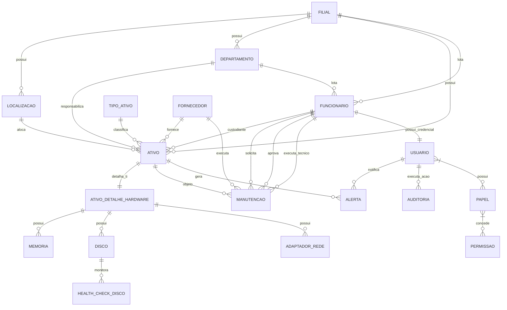

# Database Schema Specification — aegis_patrimonio

> **Versão:** 1.0 · **Owner:** backend-team · **Status:** Draft
> Contrato físico do banco. Cada objeto aqui declarado é a fonte da verdade para gerar `database/schema/` — **nunca edite o SQL gerado diretamente**; edite este contrato e regenere.

> **Nota de rastreabilidade:** Este contrato foi derivado **exclusivamente** do artefato-fonte [[db-domain-model]] (Database Domain & Entity Model). Nenhum arquivo de schema físico (ex: `server/db.ts`, migrações Flyway/Liquibase, ou `schema.sql`) foi localizado no workspace — ver seção "Fatos extraídos do schema real" no diagnóstico. Todas as definições abaixo refletem o modelo conceitual validado; a implementação física (DDL real) deve ser gerada a partir deste contrato e versionada via ferramenta de migração.

---

## 1. Tables

### 1.1 `ativo`
```yaml
table:
  name: "ativo"
  entity: "Ativo — ver [[db-domain-model#ent-ativo]]"
  classification: "core"
  description: "Entidade central do domínio: bem/item de valor no patrimônio, rastreável para gestão, depreciação e manutenção."

  columns:
    - name: "id"
      type: "UUID"
      nullable: false
      default: "gen_random_uuid()"
      logical_type: "TechnicalId"
      sensitivity: "internal"
      constraints: ["PK_ativo"]
    - name: "tag_patrimonio"
      type: "VARCHAR(50)"
      nullable: false
      logical_type: "BusinessId"
      sensitivity: "confidential"
      constraints: ["UK_ativo_tag_patrimonio", "NOT_NULL"]
    - name: "nome"
      type: "VARCHAR(255)"
      nullable: false
      logical_type: "Name"
      sensitivity: "confidential"
      constraints: ["NOT_NULL"]
    - name: "descricao"
      type: "TEXT"
      nullable: true
      logical_type: "Description"
      sensitivity: "confidential"
      constraints: []
    - name: "valor_aquisicao"
      type: "NUMERIC(14,2)"
      nullable: false
      logical_type: "Money"
      sensitivity: "confidential"
      constraints: ["CHK_ativo_valor_aquisicao_positivo", "NOT_NULL"]
    - name: "data_aquisicao"
      type: "DATE"
      nullable: false
      logical_type: "LocalDate"
      sensitivity: "confidential"
      constraints: ["CHK_ativo_data_aquisicao_passado", "NOT_NULL"]
    - name: "vida_util_anos"
      type: "INTEGER"
      nullable: false
      logical_type: "PositiveInteger"
      sensitivity: "internal"
      constraints: ["CHK_ativo_vida_util_positiva", "NOT_NULL"]
    - name: "status"
      type: "VARCHAR(20)"
      nullable: false
      default: "'ATIVO'"
      logical_type: "Enum[ATIVO, EM_MANUTENCAO, BAIXADO, EM_ESTOQUE]"
      sensitivity: "internal"
      constraints: ["CHK_ativo_status_valido", "NOT_NULL"]
    - name: "numero_serie"
      type: "VARCHAR(100)"
      nullable: true
      logical_type: "SerialNumber"
      sensitivity: "confidential"
      constraints: []
    - name: "modelo"
      type: "VARCHAR(100)"
      nullable: true
      logical_type: "Model"
      sensitivity: "internal"
      constraints: []
    - name: "tipo_ativo_id"
      type: "UUID"
      nullable: false
      logical_type: "ForeignKey"
      sensitivity: "internal"
      constraints: ["FK_ativo_tipo_ativo", "NOT_NULL"]
    - name: "localizacao_id"
      type: "UUID"
      nullable: false
      logical_type: "ForeignKey"
      sensitivity: "internal"
      constraints: ["FK_ativo_localizacao", "NOT_NULL"]
    - name: "departamento_id"
      type: "UUID"
      nullable: false
      logical_type: "ForeignKey"
      sensitivity: "internal"
      constraints: ["FK_ativo_departamento", "NOT_NULL"]
    - name: "filial_id"
      type: "UUID"
      nullable: false
      logical_type: "ForeignKey"
      sensitivity: "confidential"
      constraints: ["FK_ativo_filial", "NOT_NULL"]
    - name: "fornecedor_id"
      type: "UUID"
      nullable: true
      logical_type: "ForeignKey"
      sensitivity: "confidential"
      constraints: ["FK_ativo_fornecedor"]
    - name: "funcionario_id"
      type: "UUID"
      nullable: true
      logical_type: "ForeignKey"
      sensitivity: "restricted"
      constraints: ["FK_ativo_funcionario"]
    - name: "created_at"
      type: "TIMESTAMPTZ"
      nullable: false
      default: "now()"
      logical_type: "Instant"
      sensitivity: "internal"
      constraints: ["NOT_NULL"]
    - name: "updated_at"
      type: "TIMESTAMPTZ"
      nullable: false
      default: "now()"
      logical_type: "Instant"
      sensitivity: "internal"
      constraints: ["NOT_NULL"]

  primary_key: ["id"]
  foreign_keys: []  # ver seção 2
  unique_constraints: []  # ver seção 3
  check_constraints: []   # ver seção 3
  indexes: []             # ver seção 4
```

### 1.2 `tipo_ativo`
```yaml
table:
  name: "tipo_ativo"
  entity: "TipoAtivo — ver [[db-domain-model#ent-tipo-ativo]]"
  classification: "reference"
  description: "Classificação de ativos que define características e regras de depreciação (ex: notebook, servidor, móvel)."

  columns:
    - name: "id"
      type: "UUID"
      nullable: false
      default: "gen_random_uuid()"
      logical_type: "TechnicalId"
      sensitivity: "internal"
      constraints: ["PK_tipo_ativo"]
    - name: "codigo"
      type: "VARCHAR(30)"
      nullable: false
      logical_type: "BusinessCode"
      sensitivity: "internal"
      constraints: ["UK_tipo_ativo_codigo", "NOT_NULL"]
    - name: "nome"
      type: "VARCHAR(100)"
      nullable: false
      logical_type: "Name"
      sensitivity: "internal"
      constraints: ["NOT_NULL"]
    - name: "descricao"
      type: "TEXT"
      nullable: true
      logical_type: "Description"
      sensitivity: "internal"
      constraints: []
    - name: "taxa_depreciacao_anual"
      type: "NUMERIC(5,2)"
      nullable: false
      logical_type: "Percentage"
      sensitivity: "internal"
      constraints: ["CHK_tipo_ativo_taxa_depreciacao_range", "NOT_NULL"]
    - name: "vida_util_padrao_anos"
      type: "INTEGER"
      nullable: false
      logical_type: "PositiveInteger"
      sensitivity: "internal"
      constraints: ["CHK_tipo_ativo_vida_util_positiva", "NOT_NULL"]
    - name: "ativo"
      type: "BOOLEAN"
      nullable: false
      default: "true"
      logical_type: "BooleanFlag"
      sensitivity: "internal"
      constraints: ["NOT_NULL"]
    - name: "created_at"
      type: "TIMESTAMPTZ"
      nullable: false
      default: "now()"
      logical_type: "Instant"
      sensitivity: "internal"
      constraints: ["NOT_NULL"]
    - name: "updated_at"
      type: "TIMESTAMPTZ"
      nullable: false
      default: "now()"
      logical_type: "Instant"
      sensitivity: "internal"
      constraints: ["NOT_NULL"]

  primary_key: ["id"]
  foreign_keys: []
  unique_constraints: []
  check_constraints: []
  indexes: []
```

### 1.3 `localizacao`
```yaml
table:
  name: "localizacao"
  entity: "Localizacao — ver [[db-domain-model#ent-localizacao]]"
  classification: "reference"
  description: "Local físico ou lógico onde ativos patrimoniais podem ser alocados (sala, andar, prédio, data center, estoque)."

  columns:
    - name: "id"
      type: "UUID"
      nullable: false
      default: "gen_random_uuid()"
      logical_type: "TechnicalId"
      sensitivity: "internal"
      constraints: ["PK_localizacao"]
    - name: "codigo"
      type: "VARCHAR(30)"
      nullable: false
      logical_type: "BusinessCode"
      sensitivity: "internal"
      constraints: ["UK_localizacao_codigo_filial", "NOT_NULL"]
    - name: "nome"
      type: "VARCHAR(150)"
      nullable: false
      logical_type: "Name"
      sensitivity: "internal"
      constraints: ["NOT_NULL"]
    - name: "descricao"
      type: "TEXT"
      nullable: true
      logical_type: "Description"
      sensitivity: "internal"
      constraints: []
    - name: "tipo"
      type: "VARCHAR(20)"
      nullable: false
      logical_type: "Enum[SALA, ANDAR, PREDIO, DATA_CENTER, ESTOQUE, EXTERNO]"
      sensitivity: "internal"
      constraints: ["CHK_localizacao_tipo_valido", "NOT_NULL"]
    - name: "endereco_completo"
      type: "TEXT"
      nullable: true
      logical_type: "Address"
      sensitivity: "internal"
      constraints: []
    - name: "filial_id"
      type: "UUID"
      nullable: false
      logical_type: "ForeignKey"
      sensitivity: "confidential"
      constraints: ["FK_localizacao_filial", "NOT_NULL"]
    - name: "ativo"
      type: "BOOLEAN"
      nullable: false
      default: "true"
      logical_type: "BooleanFlag"
      sensitivity: "internal"
      constraints: ["NOT_NULL"]
    - name: "created_at"
      type: "TIMESTAMPTZ"
      nullable: false
      default: "now()"
      logical_type: "Instant"
      sensitivity: "internal"
      constraints: ["NOT_NULL"]
    - name: "updated_at"
      type: "TIMESTAMPTZ"
      nullable: false
      default: "now()"
      logical_type: "Instant"
      sensitivity: "internal"
      constraints: ["NOT_NULL"]

  primary_key: ["id"]
  foreign_keys: []
  unique_constraints: []
  check_constraints: []
  indexes: []
```

### 1.4 `departamento`
```yaml
table:
  name: "departamento"
  entity: "Departamento — ver [[db-domain-model#ent-departamento]]"
  classification: "reference"
  description: "Unidade organizacional interna (setor, divisão) para gestão de ativos e alertas."

  columns:
    - name: "id"
      type: "UUID"
      nullable: false
      default: "gen_random_uuid()"
      logical_type: "TechnicalId"
      sensitivity: "internal"
      constraints: ["PK_departamento"]
    - name: "codigo"
      type: "VARCHAR(30)"
      nullable: false
      logical_type: "BusinessCode"
      sensitivity: "internal"
      constraints: ["UK_departamento_codigo_filial", "NOT_NULL"]
    - name: "nome"
      type: "VARCHAR(150)"
      nullable: false
      logical_type: "Name"
      sensitivity: "internal"
      constraints: ["NOT_NULL"]
    - name: "descricao"
      type: "TEXT"
      nullable: true
      logical_type: "Description"
      sensitivity: "internal"
      constraints: []
    - name: "centro_custo"
      type: "VARCHAR(50)"
      nullable: true
      logical_type: "CostCenter"
      sensitivity: "internal"
      constraints: []
    - name: "filial_id"
      type: "UUID"
      nullable: false
      logical_type: "ForeignKey"
      sensitivity: "confidential"
      constraints: ["FK_departamento_filial", "NOT_NULL"]
    - name: "ativo"
      type: "BOOLEAN"
      nullable: false
      default: "true"
      logical_type: "BooleanFlag"
      sensitivity: "internal"
      constraints: ["NOT_NULL"]
    - name: "created_at"
      type: "TIMESTAMPTZ"
      nullable: false
      default: "now()"
      logical_type: "Instant"
      sensitivity: "internal"
      constraints: ["NOT_NULL"]
    - name: "updated_at"
      type: "TIMESTAMPTZ"
      nullable: false
      default: "now()"
      logical_type: "Instant"
      sensitivity: "internal"
      constraints: ["NOT_NULL"]

  primary_key: ["id"]
  foreign_keys: []
  unique_constraints: []
  check_constraints: []
  indexes: []
```

### 1.5 `filial`
```yaml
table:
  name: "filial"
  entity: "Filial — ver [[db-domain-model#ent-filial]]"
  classification: "reference"
  description: "Unidade de negócio ou estabelecimento da organização (matriz, filiais, centros de distribuição)."

  columns:
    - name: "id"
      type: "UUID"
      nullable: false
      default: "gen_random_uuid()"
      logical_type: "TechnicalId"
      sensitivity: "confidential"
      constraints: ["PK_filial"]
    - name: "cnpj"
      type: "VARCHAR(18)"
      nullable: false
      logical_type: "CNPJ"
      sensitivity: "confidential"
      constraints: ["UK_filial_cnpj", "CHK_filial_cnpj_valido", "NOT_NULL"]
    - name: "razao_social"
      type: "VARCHAR(255)"
      nullable: false
      logical_type: "LegalName"
      sensitivity: "confidential"
      constraints: ["NOT_NULL"]
    - name: "nome_fantasia"
      type: "VARCHAR(255)"
      nullable: true
      logical_type: "TradeName"
      sensitivity: "confidential"
      constraints: []
    - name: "endereco"
      type: "TEXT"
      nullable: false
      logical_type: "Address"
      sensitivity: "confidential"
      constraints: ["NOT_NULL"]
    - name: "telefone"
      type: "VARCHAR(20)"
      nullable: true
      logical_type: "Phone"
      sensitivity: "confidential"
      constraints: []
    - name: "email"
      type: "VARCHAR(255)"
      nullable: true
      logical_type: "Email"
      sensitivity: "confidential"
      constraints: ["CHK_filial_email_formato"]
    - name: "ativa"
      type: "BOOLEAN"
      nullable: false
      default: "true"
      logical_type: "BooleanFlag"
      sensitivity: "confidential"
      constraints: ["NOT_NULL"]
    - name: "created_at"
      type: "TIMESTAMPTZ"
      nullable: false
      default: "now()"
      logical_type: "Instant"
      sensitivity: "confidential"
      constraints: ["NOT_NULL"]
    - name: "updated_at"
      type: "TIMESTAMPTZ"
      nullable: false
      default: "now()"
      logical_type: "Instant"
      sensitivity: "confidential"
      constraints: ["NOT_NULL"]

  primary_key: ["id"]
  foreign_keys: []
  unique_constraints: []
  check_constraints: []
  indexes: []
```

### 1.6 `fornecedor`
```yaml
table:
  name: "fornecedor"
  entity: "Fornecedor — ver [[db-domain-model#ent-fornecedor]]"
  classification: "reference"
  description: "Entidade externa (pessoa jurídica) de quem a organização adquire ativos ou serviços de manutenção."

  columns:
    - name: "id"
      type: "UUID"
      nullable: false
      default: "gen_random_uuid()"
      logical_type: "TechnicalId"
      sensitivity: "confidential"
      constraints: ["PK_fornecedor"]
    - name: "cnpj"
      type: "VARCHAR(18)"
      nullable: false
      logical_type: "CNPJ"
      sensitivity: "confidential"
      constraints: ["UK_fornecedor_cnpj", "CHK_fornecedor_cnpj_valido", "NOT_NULL"]
    - name: "razao_social"
      type: "VARCHAR(255)"
      nullable: false
      logical_type: "LegalName"
      sensitivity: "confidential"
      constraints: ["NOT_NULL"]
    - name: "nome_fantasia"
      type: "VARCHAR(255)"
      nullable: true
      logical_type: "TradeName"
      sensitivity: "confidential"
      constraints: []
    - name: "endereco"
      type: "TEXT"
      nullable: true
      logical_type: "Address"
      sensitivity: "confidential"
      constraints: []
    - name: "telefone"
      type: "VARCHAR(20)"
      nullable: true
      logical_type: "Phone"
      sensitivity: "confidential"
      constraints: []
    - name: "email"
      type: "VARCHAR(255)"
      nullable: true
      logical_type: "Email"
      sensitivity: "confidential"
      constraints: ["CHK_fornecedor_email_formato"]
    - name: "contato_comercial"
      type: "VARCHAR(150)"
      nullable: true
      logical_type: "ContactName"
      sensitivity: "confidential"
      constraints: []
    - name: "ativo"
      type: "BOOLEAN"
      nullable: false
      default: "true"
      logical_type: "BooleanFlag"
      sensitivity: "confidential"
      constraints: ["NOT_NULL"]
    - name: "created_at"
      type: "TIMESTAMPTZ"
      nullable: false
      default: "now()"
      logical_type: "Instant"
      sensitivity: "confidential"
      constraints: ["NOT_NULL"]
    - name: "updated_at"
      type: "TIMESTAMPTZ"
      nullable: false
      default: "now()"
      logical_type: "Instant"
      sensitivity: "confidential"
      constraints: ["NOT_NULL"]

  primary_key: ["id"]
  foreign_keys: []
  unique_constraints: []
  check_constraints: []
  indexes: []
```

### 1.7 `funcionario`
```yaml
table:
  name: "funcionario"
  entity: "Funcionario — ver [[db-domain-model#ent-funcionario]]"
  classification: "core"
  description: "Colaborador da organização, responsável por ativos (custodiante) ou solicitante de manutenções."

  columns:
    - name: "id"
      type: "UUID"
      nullable: false
      default: "gen_random_uuid()"
      logical_type: "TechnicalId"
      sensitivity: "restricted"
      constraints: ["PK_funcionario"]
    - name: "matricula"
      type: "VARCHAR(30)"
      nullable: false
      logical_type: "EmployeeNumber"
      sensitivity: "restricted"
      constraints: ["UK_funcionario_matricula", "NOT_NULL"]
    - name: "cpf"
      type: "VARCHAR(14)"
      nullable: false
      logical_type: "CPF"
      sensitivity: "restricted"
      constraints: ["UK_funcionario_cpf", "CHK_funcionario_cpf_valido", "NOT_NULL"]
    - name: "nome_completo"
      type: "VARCHAR(255)"
      nullable: false
      logical_type: "FullName"
      sensitivity: "restricted"
      constraints: ["NOT_NULL"]
    - name: "email_corporativo"
      type: "VARCHAR(255)"
      nullable: false
      logical_type: "Email"
      sensitivity: "restricted"
      constraints: ["UK_funcionario_email", "CHK_funcionario_email_formato", "NOT_NULL"]
    - name: "telefone"
      type: "VARCHAR(20)"
      nullable: true
      logical_type: "Phone"
      sensitivity: "restricted"
      constraints: []
    - name: "cargo"
      type: "VARCHAR(100)"
      nullable: false
      logical_type: "JobTitle"
      sensitivity: "restricted"
      constraints: ["NOT_NULL"]
    - name: "data_admissao"
      type: "DATE"
      nullable: false
      logical_type: "LocalDate"
      sensitivity: "restricted"
      constraints: ["NOT_NULL"]
    - name: "data_demissao"
      type: "DATE"
      nullable: true
      logical_type: "LocalDate"
      sensitivity: "restricted"
      constraints: ["CHK_funcionario_data_demissao_pos_admissao"]
    - name: "ativo"
      type: "BOOLEAN"
      nullable: false
      default: "true"
      logical_type: "BooleanFlag"
      sensitivity: "restricted"
      constraints: ["NOT_NULL"]
    - name: "departamento_id"
      type: "UUID"
      nullable: false
      logical_type: "ForeignKey"
      sensitivity: "internal"
      constraints: ["FK_funcionario_departamento", "NOT_NULL"]
    - name: "filial_id"
      type: "UUID"
      nullable: false
      logical_type: "ForeignKey"
      sensitivity: "confidential"
      constraints: ["FK_funcionario_filial", "NOT_NULL"]
    - name: "created_at"
      type: "TIMESTAMPTZ"
      nullable: false
      default: "now()"
      logical_type: "Instant"
      sensitivity: "restricted"
      constraints: ["NOT_NULL"]
    - name: "updated_at"
      type: "TIMESTAMPTZ"
      nullable: false
      default: "now()"
      logical_type: "Instant"
      sensitivity: "restricted"
      constraints: ["NOT_NULL"]

  primary_key: ["id"]
  foreign_keys: []
  unique_constraints: []
  check_constraints: []
  indexes: []
```

### 1.8 `usuario`
```yaml
table:
  name: "usuario"
  entity: "Usuario — ver [[db-domain-model#ent-usuario]]"
  classification: "core"
  description: "Credencial de acesso ao sistema (autenticação/autorização), vinculada a um funcionário. Perfis base: ADMIN, USER."

  columns:
    - name: "id"
      type: "UUID"
      nullable: false
      default: "gen_random_uuid()"
      logical_type: "TechnicalId"
      sensitivity: "restricted"
      constraints: ["PK_usuario"]
    - name: "username"
      type: "VARCHAR(100)"
      nullable: false
      logical_type: "Username"
      sensitivity: "restricted"
      constraints: ["UK_usuario_username", "NOT_NULL"]
    - name: "password_hash"
      type: "VARCHAR(255)"
      nullable: false
      logical_type: "PasswordHash"
      sensitivity: "restricted"
      constraints: ["NOT_NULL"]
    - name: "role"
      type: "VARCHAR(10)"
      nullable: false
      logical_type: "Enum[ADMIN, USER]"
      sensitivity: "restricted"
      constraints: ["CHK_usuario_role_valido", "NOT_NULL"]
    - name: "ativo"
      type: "BOOLEAN"
      nullable: false
      default: "true"
      logical_type: "BooleanFlag"
      sensitivity: "restricted"
      constraints: ["NOT_NULL"]
    - name: "ultimo_login"
      type: "TIMESTAMPTZ"
      nullable: true
      logical_type: "Instant"
      sensitivity: "restricted"
      constraints: []
    - name: "funcionario_id"
      type: "UUID"
      nullable: false
      logical_type: "ForeignKey"
      sensitivity: "restricted"
      constraints: ["FK_usuario_funcionario", "UK_usuario_funcionario", "NOT_NULL"]
    - name: "created_at"
      type: "TIMESTAMPTZ"
      nullable: false
      default: "now()"
      logical_type: "Instant"
      sensitivity: "restricted"
      constraints: ["NOT_NULL"]
    - name: "updated_at"
      type: "TIMESTAMPTZ"
      nullable: false
      default: "now()"
      logical_type: "Instant"
      sensitivity: "restricted"
      constraints: ["NOT_NULL"]

  primary_key: ["id"]
  foreign_keys: []
  unique_constraints: []
  check_constraints: []
  indexes: []
```

### 1.9 `manutencao`
```yaml
table:
  name: "manutencao"
  entity: "Manutencao — ver [[db-domain-model#ent-manutencao]]"
  classification: "transactional"
  description: "Ordem de manutenção (preventiva ou corretiva) de um ativo, com fluxo de aprovação, execução e conclusão."

  columns:
    - name: "id"
      type: "UUID"
      nullable: false
      default: "gen_random_uuid()"
      logical_type: "TechnicalId"
      sensitivity: "internal"
      constraints: ["PK_manutencao"]
    - name: "numero_os"
      type: "VARCHAR(30)"
      nullable: false
      logical_type: "BusinessId"
      sensitivity: "internal"
      constraints: ["UK_manutencao_numero_os", "NOT_NULL"]
    - name: "ativo_id"
      type: "UUID"
      nullable: false
      logical_type: "ForeignKey"
      sensitivity: "confidential"
      constraints: ["FK_manutencao_ativo", "NOT_NULL"]
    - name: "tipo"
      type: "VARCHAR(15)"
      nullable: false
      logical_type: "Enum[PREVENTIVA, CORRETIVA]"
      sensitivity: "internal"
      constraints: ["CHK_manutencao_tipo_valido", "NOT_NULL"]
    - name: "status"
      type: "VARCHAR(25)"
      nullable: false
      default: "'SOLICITADA'"
      logical_type: "Enum[SOLICITADA, AGUARDANDO_APROVACAO, APROVADA, EM_ANDAMENTO, CONCLUIDA, CANCELADA]"
      sensitivity: "internal"
      constraints: ["CHK_manutencao_status_valido", "NOT_NULL"]
    - name: "descricao_problema"
      type: "TEXT"
      nullable: false
      logical_type: "Description"
      sensitivity: "internal"
      constraints: ["NOT_NULL"]
    - name: "data_solicitacao"
      type: "TIMESTAMPTZ"
      nullable: false
      default: "now()"
      logical_type: "Instant"
      sensitivity: "internal"
      constraints: ["NOT_NULL"]
    - name: "data_aprovacao"
      type: "TIMESTAMPTZ"
      nullable: true
      logical_type: "Instant"
      sensitivity: "internal"
      constraints: []
    - name: "data_inicio"
      type: "TIMESTAMPTZ"
      nullable: true
      logical_type: "Instant"
      sensitivity: "internal"
      constraints: []
    - name: "data_conclusao"
      type: "TIMESTAMPTZ"
      nullable: true
      logical_type: "Instant"
      sensitivity: "internal"
      constraints: []
    - name: "custo_estimado"
      type: "NUMERIC(14,2)"
      nullable: true
      logical_type: "Money"
      sensitivity: "confidential"
      constraints: ["CHK_manutencao_custo_estimado_nao_negativo"]
    - name: "custo_real"
      type: "NUMERIC(14,2)"
      nullable: true
      logical_type: "Money"
      sensitivity: "confidential"
      constraints: ["CHK_manutencao_custo_real_nao_negativo"]
    - name: "observacoes"
      type: "TEXT"
      nullable: true
      logical_type: "Description"
      sensitivity: "internal"
      constraints: []
    - name: "fornecedor_id"
      type: "UUID"
      nullable: true
      logical_type: "ForeignKey"
      sensitivity: "confidential"
      constraints: ["FK_manutencao_fornecedor"]
    - name: "solicitante_id"
      type: "UUID"
      nullable: false
      logical_type: "ForeignKey"
      sensitivity: "restricted"
      constraints: ["FK_manutencao_solicitante", "NOT_NULL"]
    - name: "aprovador_id"
      type: "UUID"
      nullable: true
      logical_type: "ForeignKey"
      sensitivity: "restricted"
      constraints: ["FK_manutencao_aprovador"]
    - name: "responsavel_tecnico_id"
      type: "UUID"
      nullable: true
      logical_type: "ForeignKey"
      sensitivity: "restricted"
      constraints: ["FK_manutencao_responsavel_tecnico"]
    - name: "created_at"
      type: "TIMESTAMPTZ"
      nullable: false
      default: "now()"
      logical_type: "Instant"
      sensitivity: "internal"
      constraints: ["NOT_NULL"]
    - name: "updated_at"
      type: "TIMESTAMPTZ"
      nullable: false
      default: "now()"
      logical_type: "Instant"
      sensitivity: "internal"
      constraints: ["NOT_NULL"]

  primary_key: ["id"]
  foreign_keys: []
  unique_constraints: []
  check_constraints: []
  indexes: []
```

### 1.10 `alerta`
```yaml
table:
  name: "alerta"
  entity: "Alerta — ver [[db-domain-model#ent-alerta]]"
  classification: "transactional"
  description: "Notificação/aviso gerado pelo sistema para situações de risco ou atenção (disco cheio, manutenção vencida, garantia expirando, etc.)."

  columns:
    - name: "id"
      type: "UUID"
      nullable: false
      default: "gen_random_uuid()"
      logical_type: "TechnicalId"
      sensitivity: "internal"
      constraints: ["PK_alerta"]
    - name: "ativo_id"
      type: "UUID"
      nullable: true
      logical_type: "ForeignKey"
      sensitivity: "confidential"
      constraints: ["FK_alerta_ativo"]
    - name: "tipo"
      type: "VARCHAR(30)"
      nullable: false
      logical_type: "Enum[DISCO_CRITICO, MANUTENCAO_VENCIDA, GARANTIA_EXPIRANDO, DEPRECIACAO_TOTAL, HARDWARE_DEGRADADO]"
      sensitivity: "internal"
      constraints: ["CHK_alerta_tipo_valido", "NOT_NULL"]
    - name: "severidade"
      type: "VARCHAR(10)"
      nullable: false
      logical_type: "Enum[BAIXA, MEDIA, ALTA, CRITICA]"
      sensitivity: "internal"
      constraints: ["CHK_alerta_severidade_valida", "NOT_NULL"]
    - name: "titulo"
      type: "VARCHAR(255)"
      nullable: false
      logical_type: "Title"
      sensitivity: "internal"
      constraints: ["NOT_NULL"]
    - name: "mensagem"
      type: "TEXT"
      nullable: false
      logical_type: "Message"
      sensitivity: "internal"
      constraints: ["NOT_NULL"]
    - name: "lido"
      type: "BOOLEAN"
      nullable: false
      default: "false"
      logical_type: "BooleanFlag"
      sensitivity: "internal"
      constraints: ["NOT_NULL"]
    - name: "data_leitura"
      type: "TIMESTAMPTZ"
      nullable: true
      logical_type: "Instant"
      sensitivity: "internal"
      constraints: ["CHK_alerta_data_leitura_se_lido"]
    - name: "usuario_id"
      type: "UUID"
      nullable: true
      logical_type: "ForeignKey"
      sensitivity: "restricted"
      constraints: ["FK_alerta_usuario"]
    - name: "created_at"
      type: "TIMESTAMPTZ"
      nullable: false
      default: "now()"
      logical_type: "Instant"
      sensitivity: "internal"
      constraints: ["NOT_NULL"]

  primary_key: ["id"]
  foreign_keys: []
  unique_constraints: []
  check_constraints: []
  indexes: []
```

### 1.11 `ativo_detalhe_hardware`
```yaml
table:
  name: "ativo_detalhe_hardware"
  entity: "AtivoDetalheHardware — ver [[db-domain-model#ent-ativo-detalhe-hardware]]"
  classification: "supporting"
  description: "Detalhes técnicos de hardware para ativos de TI (CPU, memória, discos, adaptadores de rede), usado para health checks e monitoramento preditivo."

  columns:
    - name: "id"
      type: "UUID"
      nullable: false
      default: "gen_random_uuid()"
      logical_type: "TechnicalId"
      sensitivity: "internal"
      constraints: ["PK_ativo_detalhe_hardware"]
    - name: "ativo_id"
      type: "UUID"
      nullable: false
      logical_type: "ForeignKey"
      sensitivity: "confidential"
      constraints: ["FK_ativo_detalhe_hardware_ativo", "UK_ativo_detalhe_hardware_ativo", "NOT_NULL"]
    - name: "processador_modelo"
      type: "VARCHAR(150)"
      nullable: true
      logical_type: "ProcessorModel"
      sensitivity: "internal"
      constraints: []
    - name: "processador_nucleos"
      type: "INTEGER"
      nullable: true
      logical_type: "PositiveInteger"
      sensitivity: "internal"
      constraints: ["CHK_ativo_detalhe_hardware_nucleos_positivo"]
    - name: "memoria_total_gb"
      type: "INTEGER"
      nullable: true
      logical_type: "PositiveInteger"
      sensitivity: "internal"
      constraints: ["CHK_ativo_detalhe_hardware_memoria_positiva"]
    - name: "sistema_operacional"
      type: "VARCHAR(100)"
      nullable: true
      logical_type: "OSName"
      sensitivity: "internal"
      constraints: []
    - name: "ultimo_inventario"
      type: "TIMESTAMPTZ"
      nullable: true
      logical_type: "Instant"
      sensitivity: "internal"
      constraints: []
    - name: "created_at"
      type: "TIMESTAMPTZ"
      nullable: false
      default: "now()"
      logical_type: "Instant"
      sensitivity: "internal"
      constraints: ["NOT_NULL"]
    - name: "updated_at"
      type: "TIMESTAMPTZ"
      nullable: false
      default: "now()"
      logical_type: "Instant"
      sensitivity: "internal"
      constraints: ["NOT_NULL"]

  primary_key: ["id"]
  foreign_keys: []
  unique_constraints: []
  check_constraints: []
  indexes: []
```

### 1.12 `memoria`
```yaml
table:
  name: "memoria"
  entity: "Memoria — ver [[db-domain-model#ent-memoria]]"
  classification: "supporting"
  description: "Pente de memória RAM instalado no ativo (capacidade, tipo, velocidade, fabricante)."

  columns:
    - name: "id"
      type: "UUID"
      nullable: false
      default: "gen_random_uuid()"
      logical_type: "TechnicalId"
      sensitivity: "internal"
      constraints: ["PK_memoria"]
    - name: "ativo_detalhe_hardware_id"
      type: "UUID"
      nullable: false
      logical_type: "ForeignKey"
      sensitivity: "internal"
      constraints: ["FK_memoria_ativo_detalhe_hardware", "NOT_NULL"]
    - name: "capacidade_gb"
      type: "INTEGER"
      nullable: false
      logical_type: "PositiveInteger"
      sensitivity: "internal"
      constraints: ["CHK_memoria_capacidade_positiva", "NOT_NULL"]
    - name: "tipo"
      type: "VARCHAR(10)"
      nullable: true
      logical_type: "Enum[DDR3, DDR4, DDR5, LPDDR4, LPDDR5]"
      sensitivity: "internal"
      constraints: ["CHK_memoria_tipo_valido"]
    - name: "velocidade_mhz"
      type: "INTEGER"
      nullable: true
      logical_type: "PositiveInteger"
      sensitivity: "internal"
      constraints: ["CHK_memoria_velocidade_positiva"]
    - name: "fabricante"
      type: "VARCHAR(100)"
      nullable: true
      logical_type: "Manufacturer"
      sensitivity: "internal"
      constraints: []
    - name: "slot"
      type: "VARCHAR(20)"
      nullable: true
      logical_type: "SlotIdentifier"
      sensitivity: "internal"
      constraints: []

  primary_key: ["id"]
  foreign_keys: []
  unique_constraints: []
  check_constraints: []
  indexes: []
```

### 1.13 `disco`
```yaml
table:
  name: "disco"
  entity: "Disco — ver [[db-domain-model#ent-disco]]"
  classification: "supporting"
  description: "Disco/volume de armazenamento do ativo (tipo, capacidade, uso, saúde SMART)."

  columns:
    - name: "id"
      type: "UUID"
      nullable: false
      default: "gen_random_uuid()"
      logical_type: "TechnicalId"
      sensitivity: "internal"
      constraints: ["PK_disco"]
    - name: "ativo_detalhe_hardware_id"
      type: "UUID"
      nullable: false
      logical_type: "ForeignKey"
      sensitivity: "internal"
      constraints: ["FK_disco_ativo_detalhe_hardware", "NOT_NULL"]
    - name: "tipo"
      type: "VARCHAR(10)"
      nullable: false
      logical_type: "Enum[HDD, SSD, NVME, EMMC]"
      sensitivity: "internal"
      constraints: ["CHK_disco_tipo_valido", "NOT_NULL"]
    - name: "capacidade_gb"
      type: "INTEGER"
      nullable: false
      logical_type: "PositiveInteger"
      sensitivity: "internal"
      constraints: ["CHK_disco_capacidade_positiva", "NOT_NULL"]
    - name: "usado_gb"
      type: "INTEGER"
      nullable: true
      logical_type: "NonNegativeInteger"
      sensitivity: "internal"
      constraints: ["CHK_disco_usado_nao_negativo", "CHK_disco_usado_menor_igual_capacidade"]
    - name: "modelo"
      type: "VARCHAR(150)"
      nullable: true
      logical_type: "Model"
      sensitivity: "internal"
      constraints: []
    - name: "serial_number"
      type: "VARCHAR(100)"
      nullable: true
      logical_type: "SerialNumber"
      sensitivity: "internal"
      constraints: []
    - name: "saude_smart"
      type: "VARCHAR(15)"
      nullable: true
      logical_type: "Enum[BOM, ATENCAO, CRITICO, DESCONHECIDO]"
      sensitivity: "internal"
      constraints: ["CHK_disco_saude_smart_valida"]
    - name: "mount_point"
      type: "VARCHAR(255)"
      nullable: true
      logical_type: "MountPoint"
      sensitivity: "internal"
      constraints: []

  primary_key: ["id"]
  foreign_keys: []
  unique_constraints: []
  check_constraints: []
  indexes: []
```

### 1.14 `adaptador_rede`
```yaml
table:
  name: "adaptador_rede"
  entity: "AdaptadorRede — ver [[db-domain-model#ent-adaptador-rede]]"
  classification: "supporting"
  description: "Interface de rede do ativo (MAC, IP, tipo, velocidade)."

  columns:
    - name: "id"
      type: "UUID"
      nullable: false
      default: "gen_random_uuid()"
      logical_type: "TechnicalId"
      sensitivity: "internal"
      constraints: ["PK_adaptador_rede"]
    - name: "ativo_detalhe_hardware_id"
      type: "UUID"
      nullable: false
      logical_type: "ForeignKey"
      sensitivity: "internal"
      constraints: ["FK_adaptador_rede_ativo_detalhe_hardware", "NOT_NULL"]
    - name: "mac_address"
      type: "VARCHAR(17)"
      nullable: false
      logical_type: "MACAddress"
      sensitivity: "internal"
      constraints: ["UK_adaptador_rede_mac", "CHK_adaptador_rede_mac_formato", "NOT_NULL"]
    - name: "ip_address"
      type: "VARCHAR(45)"
      nullable: true
      logical_type: "IPAddress"
      sensitivity: "internal"
      constraints: ["CHK_adaptador_rede_ip_formato"]
    - name: "tipo"
      type: "VARCHAR(15)"
      nullable: false
      logical_type: "Enum[ETHERNET, WIFI, BLUETOOTH, VIRTUAL]"
      sensitivity: "internal"
      constraints: ["CHK_adaptador_rede_tipo_valido", "NOT_NULL"]
    - name: "velocidade_mbps"
      type: "INTEGER"
      nullable: true
      logical_type: "PositiveInteger"
      sensitivity: "internal"
      constraints: ["CHK_adaptador_rede_velocidade_positiva"]
    - name: "nome_interface"
      type: "VARCHAR(50)"
      nullable: true
      logical_type: "InterfaceName"
      sensitivity: "internal"
      constraints: []

  primary_key: ["id"]
  foreign_keys: []
  unique_constraints: []
  check_constraints: []
  indexes: []
```

### 1.15 `health_check_disco`
```yaml
table:
  name: "health_check_disco"
  entity: "HealthCheckDisco — ver [[db-domain-model#ent-health-check-disco]]"
  classification: "audit"
  description: "Registro periódico de indicadores de saúde do disco (espaço livre, SMART, temperatura) para monitoramento e auditoria operacional. Alta volumetria — particionada por tempo."

  columns:
    - name: "id"
      type: "UUID"
      nullable: false
      default: "gen_random_uuid()"
      logical_type: "TechnicalId"
      sensitivity: "internal"
      constraints: ["PK_health_check_disco"]
    - name: "disco_id"
      type: "UUID"
      nullable: false
      logical_type: "ForeignKey"
      sensitivity: "internal"
      constraints: ["FK_health_check_disco_disco", "NOT_NULL"]
    - name: "espaco_livre_gb"
      type: "INTEGER"
      nullable: false
      logical_type: "NonNegativeInteger"
      sensitivity: "internal"
      constraints: ["CHK_health_check_espaco_livre_nao_negativo", "NOT_NULL"]
    - name: "espaco_total_gb"
      type: "INTEGER"
      nullable: false
      logical_type: "PositiveInteger"
      sensitivity: "internal"
      constraints: ["CHK_health_check_espaco_total_positivo", "NOT_NULL"]
    - name: "temperatura_celsius"
      type: "INTEGER"
      nullable: true
      logical_type: "TemperatureCelsius"
      sensitivity: "internal"
      constraints: []
    - name: "smart_status"
      type: "TEXT"
      nullable: true
      logical_type: "SmartStatusRaw"
      sensitivity: "internal"
      constraints: []
    - name: "coletado_em"
      type: "TIMESTAMPTZ"
      nullable: false
      default: "now()"
      logical_type: "Instant"
      sensitivity: "internal"
      constraints: ["NOT_NULL"]

  primary_key: ["id", "coletado_em"]  # PK composta para suportar particionamento por range em coletado_em
  foreign_keys: []
  unique_constraints: []
  check_constraints: []
  indexes: []
  partitioning:
    strategy: "RANGE"
    column: "coletado_em"
    interval: "1 month"
    retention: "13 months"
```

### 1.16 `auditoria`
```yaml
table:
  name: "auditoria"
  entity: "Auditoria — ver [[db-domain-model#ent-auditoria]]"
  classification: "audit"
  description: "Trilha de auditoria imutável de alterações em entidades sensíveis — quem, quando, o quê, antes/depois. Insert-only, particionada por ano."

  columns:
    - name: "id"
      type: "UUID"
      nullable: false
      default: "gen_random_uuid()"
      logical_type: "TechnicalId"
      sensitivity: "restricted"
      constraints: ["PK_auditoria"]
    - name: "entidade"
      type: "VARCHAR(100)"
      nullable: false
      logical_type: "EntityName"
      sensitivity: "restricted"
      constraints: ["NOT_NULL"]
    - name: "entidade_id"
      type: "UUID"
      nullable: false
      logical_type: "EntityId"
      sensitivity: "restricted"
      constraints: ["NOT_NULL"]
    - name: "acao"
      type: "VARCHAR(20)"
      nullable: false
      logical_type: "Enum[CREATE, UPDATE, DELETE, STATUS_CHANGE]"
      sensitivity: "restricted"
      constraints: ["CHK_auditoria_acao_valida", "NOT_NULL"]
    - name: "usuario_id"
      type: "UUID"
      nullable: false
      logical_type: "ForeignKey"
      sensitivity: "restricted"
      constraints: ["FK_auditoria_usuario", "NOT_NULL"]
    - name: "valores_anteriores"
      type: "JSONB"
      nullable: true
      logical_type: "JSONB"
      sensitivity: "restricted"
      constraints: []
    - name: "valores_novos"
      type: "JSONB"
      nullable: true
      logical_type: "JSONB"
      sensitivity: "restricted"
      constraints: []
    - name: "ip_origem"
      type: "VARCHAR(45)"
      nullable: true
      logical_type: "IPAddress"
      sensitivity: "restricted"
      constraints: ["CHK_auditoria_ip_formato"]
    - name: "created_at"
      type: "TIMESTAMPTZ"
      nullable: false
      default: "now()"
      logical_type: "Instant"
      sensitivity: "restricted"
      constraints: ["NOT_NULL"]

  primary_key: ["id", "created_at"]  # PK composta para suportar particionamento por range em created_at
  foreign_keys: []
  unique_constraints: []
  check_constraints: []
  indexes: []
  partitioning:
    strategy: "RANGE"
    column: "created_at"
    interval: "1 year"
    retention: "5 years"  # LGPD/compliance mínimo
```

### 1.17 `permissao`
```yaml
table:
  name: "permissao"
  entity: "Permissao — ver [[db-domain-model#ent-permissao]]"
  classification: "reference"
  description: "Autorização granular para que um papel execute uma ação sobre um recurso (RBAC)."

  columns:
    - name: "id"
      type: "UUID"
      nullable: false
      default: "gen_random_uuid()"
      logical_type: "TechnicalId"
      sensitivity: "internal"
      constraints: ["PK_permissao"]
    - name: "recurso"
      type: "VARCHAR(100)"
      nullable: false
      logical_type: "ResourceName"
      sensitivity: "internal"
      constraints: ["NOT_NULL"]
    - name: "acao"
      type: "VARCHAR(50)"
      nullable: false
      logical_type: "ActionName"
      sensitivity: "internal"
      constraints: ["NOT_NULL"]
    - name: "descricao"
      type: "TEXT"
      nullable: true
      logical_type: "Description"
      sensitivity: "internal"
      constraints: []

  primary_key: ["id"]
  foreign_keys: []
  unique_constraints: []
  check_constraints: []
  indexes: []
```

### 1.18 `papel`
```yaml
table:
  name: "papel"
  entity: "Papel — ver [[db-domain-model#ent-papel]]"
  classification: "reference"
  description: "Papel de acesso (role) para configuração de autorização granular (ex: GESTOR_PATRIMONIO, TECNICO_MANUTENCAO, AUDITOR)."

  columns:
    - name: "id"
      type: "UUID"
      nullable: false
      default: "gen_random_uuid()"
      logical_type: "TechnicalId"
      sensitivity: "internal"
      constraints: ["PK_papel"]
    - name: "nome"
      type: "VARCHAR(100)"
      nullable: false
      logical_type: "RoleName"
      sensitivity: "internal"
      constraints: ["UK_papel_nome", "NOT_NULL"]
    - name: "descricao"
      type: "TEXT"
      nullable: true
      logical_type: "Description"
      sensitivity: "internal"
      constraints: []

  primary_key: ["id"]
  foreign_keys: []
  unique_constraints: []
  check_constraints: []
  indexes: []
```

### 1.19 `papel_permissao` (tabela de junção N:M)
```yaml
table:
  name: "papel_permissao"
  entity: "Relacionamento N:M Papel ↔ Permissao — ver [[db-domain-model#ent-papel]] e [[db-domain-model#ent-permissao]]"
  classification: "reference"
  description: "Tabela de junção para relacionamento muitos-para-muitos entre papéis e permissões (RBAC)."

  columns:
    - name: "papel_id"
      type: "UUID"
      nullable: false
      logical_type: "ForeignKey"
      sensitivity: "internal"
      constraints: ["FK_papel_permissao_papel", "PK_papel_permissao", "NOT_NULL"]
    - name: "permissao_id"
      type: "UUID"
      nullable: false
      logical_type: "ForeignKey"
      sensitivity: "internal"
      constraints: ["FK_papel_permissao_permissao", "PK_papel_permissao", "NOT_NULL"]

  primary_key: ["papel_id", "permissao_id"]
  foreign_keys: []
  unique_constraints: []
  check_constraints: []
  indexes: []
```

### 1.20 `usuario_papel` (tabela de junção N:M)
```yaml
table:
  name: "usuario_papel"
  entity: "Relacionamento N:M Usuario ↔ Papel — ver [[db-domain-model#ent-usuario]] e [[db-domain-model#ent-papel]]"
  classification: "reference"
  description: "Tabela de junção para atribuição de papéis granulares a usuários (além do role base ADMIN/USER)."

  columns:
    - name: "usuario_id"
      type: "UUID"
      nullable: false
      logical_type: "ForeignKey"
      sensitivity: "restricted"
      constraints: ["FK_usuario_papel_usuario", "PK_usuario_papel", "NOT_NULL"]
    - name: "papel_id"
      type: "UUID"
      nullable: false
      logical_type: "ForeignKey"
      sensitivity: "internal"
      constraints: ["FK_usuario_papel_papel", "PK_usuario_papel", "NOT_NULL"]

  primary_key: ["usuario_id", "papel_id"]
  foreign_keys: []
  unique_constraints: []
  check_constraints: []
  indexes: []
```

---

## 2. Relationships

```yaml
relationships:
  - id: "REL-001"
    source: { entity: "Ativo", table: "ativo", column: "tipo_ativo_id" }
    target: { entity: "TipoAtivo", table: "tipo_ativo", column: "id" }
    cardinality: "N:1"
    on_delete: "restrict"
    on_update: "cascade"
    semantics: "Classificação do ativo que define regras de depreciação"

  - id: "REL-002"
    source: { entity: "Ativo", table: "ativo", column: "localizacao_id" }
    target: { entity: "Localizacao", table: "localizacao", column: "id" }
    cardinality: "N:1"
    on_delete: "restrict"
    on_update: "cascade"
    semantics: "Local físico/lógico onde o ativo está alocado"

  - id: "REL-003"
    source: { entity: "Ativo", table: "ativo", column: "departamento_id" }
    target: { entity: "Departamento", table: "departamento", column: "id" }
    cardinality: "N:1"
    on_delete: "restrict"
    on_update: "cascade"
    semantics: "Departamento responsável pelo ativo (centro de custo/custódia)"

  - id: "REL-004"
    source: { entity: "Ativo", table: "ativo", column: "filial_id" }
    target: { entity: "Filial", table: "filial", column: "id" }
    cardinality: "N:1"
    on_delete: "restrict"
    on_update: "cascade"
    semantics: "Filial/unidade de negócio à qual o ativo pertence"

  - id: "REL-005"
    source: { entity: "Ativo", table: "ativo", column: "fornecedor_id" }
    target: { entity: "Fornecedor", table: "fornecedor", column: "id" }
    cardinality: "N:1"
    on_delete: "set_null"
    on_update: "cascade"
    semantics: "Fornecedor de quem o ativo foi adquirido"

  - id: "REL-006"
    source: { entity: "Ativo", table: "ativo", column: "funcionario_id" }
    target: { entity: "Funcionario", table: "funcionario", column: "id" }
    cardinality: "N:1"
    on_delete: "set_null"
    on_update: "cascade"
    semantics: "Funcionário responsável/custodiante do ativo"

  - id: "REL-007"
    source: { entity: "AtivoDetalheHardware", table: "ativo_detalhe_hardware", column: "ativo_id" }
    target: { entity: "Ativo", table: "ativo", column: "id" }
    cardinality: "1:1"
    on_delete: "cascade"
    on_update: "cascade"
    semantics: "Detalhes técnicos de hardware para ativos de TI (apenas quando tipo_ativo é categoria TI)"

  - id: "REL-008"
    source: { entity: "Manutencao", table: "manutencao", column: "ativo_id" }
    target: { entity: "Ativo", table: "ativo", column: "id" }
    cardinality: "N:1"
    on_delete: "restrict"
    on_update: "cascade"
    semantics: "Ativo objeto da manutenção"

  - id: "REL-009"
    source: { entity: "Manutencao", table: "manutencao", column: "fornecedor_id" }
    target: { entity: "Fornecedor", table: "fornecedor", column: "id" }
    cardinality: "N:1"
    on_delete: "set_null"
    on_update: "cascade"
    semantics: "Fornecedor executor da manutenção (se terceirizado)"

  - id: "REL-010"
    source: { entity: "Manutencao", table: "manutencao", column: "solicitante_id" }
    target: { entity: "Funcionario", table: "funcionario", column: "id" }
    cardinality: "N:1"
    on_delete: "restrict"
    on_update: "cascade"
    semantics: "Funcionário que solicitou a manutenção"

  - id: "REL-011"
    source: { entity: "Manutencao", table: "manutencao", column: "aprovador_id" }
    target: { entity: "Funcionario", table: "funcionario", column: "id" }
    cardinality: "N:1"
    on_delete: "set_null"
    on_update: "cascade"
    semantics: "Funcionário que aprovou a manutenção"

  - id: "REL-012"
    source: { entity: "Manutencao", table: "manutencao", column: "responsavel_tecnico_id" }
    target: { entity: "Funcionario", table: "funcionario", column: "id" }
    cardinality: "N:1"
    on_delete: "set_null"
    on_update: "cascade"
    semantics: "Funcionário responsável técnico/executor da manutenção"

  - id: "REL-013"
    source: { entity: "Alerta", table: "alerta", column: "ativo_id" }
    target: { entity: "Ativo", table: "ativo", column: "id" }
    cardinality: "N:1"
    on_delete: "set_null"
    on_update: "cascade"
    semantics: "Ativo relacionado ao alerta (pode ser nulo para alertas globais)"

  - id: "REL-014"
    source: { entity: "Alerta", table: "alerta", column: "usuario_id" }
    target: { entity: "Usuario", table: "usuario", column: "id" }
    cardinality: "N:1"
    on_delete: "set_null"
    on_update: "cascade"
    semantics: "Usuário destinatário/notificado do alerta"

  - id: "REL-015"
    source: { entity: "Memoria", table: "memoria", column: "ativo_detalhe_hardware_id" }
    target: { entity: "AtivoDetalheHardware", table: "ativo_detalhe_hardware", column: "id" }
    cardinality: "N:1"
    on_delete: "cascade"
    on_update: "cascade"
    semantics: "Pente de memória instalado no ativo"

  - id: "REL-016"
    source: { entity: "Disco", table: "disco", column: "ativo_detalhe_hardware_id" }
    target: { entity: "AtivoDetalheHardware", table: "ativo_detalhe_hardware", column: "id" }
    cardinality: "N:1"
    on_delete: "cascade"
    on_update: "cascade"
    semantics: "Disco/volume instalado no ativo"

  - id: "REL-017"
    source: { entity: "AdaptadorRede", table: "adaptador_rede", column: "ativo_detalhe_hardware_id" }
    target: { entity: "AtivoDetalheHardware", table: "ativo_detalhe_hardware", column: "id" }
    cardinality: "N:1"
    on_delete: "cascade"
    on_update: "cascade"
    semantics: "Interface de rede do ativo"

  - id: "REL-018"
    source: { entity: "HealthCheckDisco", table: "health_check_disco", column: "disco_id" }
    target: { entity: "Disco", table: "disco", column: "id" }
    cardinality: "N:1"
    on_delete: "cascade"
    on_update: "cascade"
    semantics: "Registro de saúde do disco monitorado"

  - id: "REL-019"
    source: { entity: "Auditoria", table: "auditoria", column: "usuario_id" }
    target: { entity: "Usuario", table: "usuario", column: "id" }
    cardinality: "N:1"
    on_delete: "restrict"
    on_update: "cascade"
    semantics: "Usuário que realizou a ação auditada"

  - id: "REL-020"
    source: { entity: "Localizacao", table: "localizacao", column: "filial_id" }
    target: { entity: "Filial", table: "filial", column: "id" }
    cardinality: "N:1"
    on_delete: "restrict"
    on_update: "cascade"
    semantics: "Filial à qual a localização pertence"

  - id: "REL-021"
    source: { entity: "Departamento", table: "departamento", column: "filial_id" }
    target: { entity: "Filial", table: "filial", column: "id" }
    cardinality: "N:1"
    on_delete: "restrict"
    on_update: "cascade"
    semantics: "Filial à qual o departamento pertence"

  - id: "REL-022"
    source: { entity: "Funcionario", table: "funcionario", column: "departamento_id" }
    target: { entity: "Departamento", table: "departamento", column: "id" }
    cardinality: "N:1"
    on_delete: "restrict"
    on_update: "cascade"
    semantics: "Departamento de lotação do funcionário"

  - id: "REL-023"
    source: { entity: "Funcionario", table: "funcionario", column: "filial_id" }
    target: { entity: "Filial", table: "filial", column: "id" }
    cardinality: "N:1"
    on_delete: "restrict"
    on_update: "cascade"
    semantics: "Filial de lotação do funcionário"

  - id: "REL-024"
    source: { entity: "Usuario", table: "usuario", column: "funcionario_id" }
    target: { entity: "Funcionario", table: "funcionario", column: "id" }
    cardinality: "1:1"
    on_delete: "restrict"
    on_update: "cascade"
    semantics: "Funcionário dono desta credencial de acesso"

  - id: "REL-025"
    source: { entity: "Papel", table: "papel", column: "id" }
    target: { entity: "Permissao", table: "permissao", column: "id" }
    cardinality: "N:M"
    on_delete: "cascade"
    on_update: "cascade"
    semantics: "Permissões concedidas a este papel (via tabela papel_permissao)"

  - id: "REL-026"
    source: { entity: "Usuario", table: "usuario", column: "id" }
    target: { entity: "Papel", table: "papel", column: "id" }
    cardinality: "N:M"
    on_delete: "cascade"
    on_update: "cascade"
    semantics: "Papéis granulares atribuídos ao usuário (via tabela usuario_papel)"
```

---

## 3. Constraints

```yaml
constraints:
  # Primary Keys (já declaradas nas tabelas)
  - id: "CONSTRAINT-001"
    type: "PK"
    table: "ativo"
    expression: "PRIMARY KEY (id)"
    rationale: "Identificador técnico único do ativo"
    severity: "error"

  - id: "CONSTRAINT-002"
    type: "PK"
    table: "tipo_ativo"
    expression: "PRIMARY KEY (id)"
    rationale: "Identificador técnico único do tipo de ativo"
    severity: "error"

  - id: "CONSTRAINT-003"
    type: "PK"
    table: "localizacao"
    expression: "PRIMARY KEY (id)"
    rationale: "Identificador técnico único da localização"
    severity: "error"

  - id: "CONSTRAINT-004"
    type: "PK"
    table: "departamento"
    expression: "PRIMARY KEY (id)"
    rationale: "Identificador técnico único do departamento"
    severity: "error"

  - id: "CONSTRAINT-005"
    type: "PK"
    table: "filial"
    expression: "PRIMARY KEY (id)"
    rationale: "Identificador técnico único da filial"
    severity: "error"

  - id: "CONSTRAINT-006"
    type: "PK"
    table: "fornecedor"
    expression: "PRIMARY KEY (id)"
    rationale: "Identificador técnico único do fornecedor"
    severity: "error"

  - id: "CONSTRAINT-007"
    type: "PK"
    table: "funcionario"
    expression: "PRIMARY KEY (id)"
    rationale: "Identificador técnico único do funcionário"
    severity: "error"

  - id: "CONSTRAINT-008"
    type: "PK"
    table: "usuario"
    expression: "PRIMARY KEY (id)"
    rationale: "Identificador técnico único do usuário"
    severity: "error"

  - id: "CONSTRAINT-009"
    type: "PK"
    table: "manutencao"
    expression: "PRIMARY KEY (id)"
    rationale: "Identificador técnico único da manutenção"
    severity: "error"

  - id: "CONSTRAINT-010"
    type: "PK"
    table: "alerta"
    expression: "PRIMARY KEY (id)"
    rationale: "Identificador técnico único do alerta"
    severity: "error"

  - id: "CONSTRAINT-011"
    type: "PK"
    table: "ativo_detalhe_hardware"
    expression: "PRIMARY KEY (id)"
    rationale: "Identificador técnico único do detalhe de hardware"
    severity: "error"

  - id: "CONSTRAINT-012"
    type: "PK"
    table: "memoria"
    expression: "PRIMARY KEY (id)"
    rationale: "Identificador técnico único do pente de memória"
    severity: "error"

  - id: "CONSTRAINT-013"
    type: "PK"
    table: "disco"
    expression: "PRIMARY KEY (id)"
    rationale: "Identificador técnico único do disco"
    severity: "error"

  - id: "CONSTRAINT-014"
    type: "PK"
    table: "adaptador_rede"
    expression: "PRIMARY KEY (id)"
    rationale: "Identificador técnico único do adaptador de rede"
    severity: "error"

  - id: "CONSTRAINT-015"
    type: "PK"
    table: "health_check_disco"
    expression: "PRIMARY KEY (id, coletado_em)"
    rationale: "PK composta para suportar particionamento por range em coletado_em"
    severity: "error"

  - id: "CONSTRAINT-016"
    type: "PK"
    table: "auditoria"
    expression: "PRIMARY KEY (id, created_at)"
    rationale: "PK composta para suportar particionamento por range em created_at"
    severity: "error"

  - id: "CONSTRAINT-017"
    type: "PK"
    table: "permissao"
    expression: "PRIMARY KEY (id)"
    rationale: "Identificador técnico único da permissão"
    severity: "error"

  - id: "CONSTRAINT-018"
    type: "PK"
    table: "papel"
    expression: "PRIMARY KEY (id)"
    rationale: "Identificador técnico único do papel"
    severity: "error"

  - id: "CONSTRAINT-019"
    type: "PK"
    table: "papel_permissao"
    expression: "PRIMARY KEY (papel_id, permissao_id)"
    rationale: "PK composta da tabela de junção N:M"
    severity: "error"

  - id: "CONSTRAINT-020"
    type: "PK"
    table: "usuario_papel"
    expression: "PRIMARY KEY (usuario_id, papel_id)"
    rationale: "PK composta da tabela de junção N:M"
    severity: "error"

  # Unique Constraints
  - id: "CONSTRAINT-021"
    type: "UNIQUE"
    table: "ativo"
    expression: "UNIQUE (tag_patrimonio)"
    rationale: "Tag de patrimônio deve ser única por organização (regra de negócio)"
    severity: "error"

  - id: "CONSTRAINT-022"
    type: "UNIQUE"
    table: "tipo_ativo"
    expression: "UNIQUE (codigo)"
    rationale: "Código do tipo de ativo deve ser único"
    severity: "error"

  - id: "CONSTRAINT-023"
    type: "UNIQUE"
    table: "localizacao"
    expression: "UNIQUE (codigo, filial_id)"
    rationale: "Código da localização deve ser único por filial"
    severity: "error"

  - id: "CONSTRAINT-024"
    type: "UNIQUE"
    table: "departamento"
    expression: "UNIQUE (codigo, filial_id)"
    rationale: "Código do departamento deve ser único por filial"
    severity: "error"

  - id: "CONSTRAINT-025"
    type: "UNIQUE"
    table: "filial"
    expression: "UNIQUE (cnpj)"
    rationale: "CNPJ da filial deve ser válido e único"
    severity: "error"

  - id: "CONSTRAINT-026"
    type: "UNIQUE"
    table: "fornecedor"
    expression: "UNIQUE (cnpj)"
    rationale: "CNPJ do fornecedor deve ser válido e único"
    severity: "error"

  - id: "CONSTRAINT-027"
    type: "UNIQUE"
    table: "funcionario"
    expression: "UNIQUE (matricula)"
    rationale: "Matrícula do funcionário deve ser única"
    severity: "error"

  - id: "CONSTRAINT-028"
    type: "UNIQUE"
    table: "funcionario"
    expression: "UNIQUE (cpf)"
    rationale: "CPF do funcionário deve ser válido e único"
    severity: "error"

  - id: "CONSTRAINT-029"
    type: "UNIQUE"
    table: "funcionario"
    expression: "UNIQUE (email_corporativo)"
    rationale: "Email corporativo do funcionário deve ser único"
    severity: "error"

  - id: "CONSTRAINT-030"
    type: "UNIQUE"
    table: "usuario"
    expression: "UNIQUE (username)"
    rationale: "Username deve ser único"
    severity: "error"

  - id: "CONSTRAINT-031"
    type: "UNIQUE"
    table: "usuario"
    expression: "UNIQUE (funcionario_id)"
    rationale: "Cada funcionário pode ter no máximo um usuário (1:1)"
    severity: "error"

  - id: "CONSTRAINT-032"
    type: "UNIQUE"
    table: "manutencao"
    expression: "UNIQUE (numero_os)"
    rationale: "Número da OS deve ser único"
    severity: "error"

  - id: "CONSTRAINT-033"
    type: "UNIQUE"
    table: "ativo_detalhe_hardware"
    expression: "UNIQUE (ativo_id)"
    rationale: "Cada ativo de TI tem no máximo um detalhe de hardware (1:1)"
    severity: "error"

  - id: "CONSTRAINT-034"
    type: "UNIQUE"
    table: "adaptador_rede"
    expression: "UNIQUE (mac_address)"
    rationale: "Endereço MAC deve ser único e formato válido"
    severity: "error"

  - id: "CONSTRAINT-035"
    type: "UNIQUE"
    table: "papel"
    expression: "UNIQUE (nome)"
    rationale: "Nome do papel deve ser único"
    severity: "error"

  - id: "CONSTRAINT-036"
    type: "UNIQUE"
    table: "permissao"
    expression: "UNIQUE (recurso, acao)"
    rationale: "Par (recurso, acao) deve ser único"
    severity: "error"

  # Check Constraints
  - id: "CONSTRAINT-037"
    type: "CHECK"
    table: "ativo"
    expression: "valor_aquisicao > 0"
    rationale: "Valor de aquisição deve ser positivo"
    severity: "error"

  - id: "CONSTRAINT-038"
    type: "CHECK"
    table: "ativo"
    expression: "vida_util_anos > 0"
    rationale: "Vida útil em anos deve ser positiva"
    severity: "error"

  - id: "CONSTRAINT-039"
    type: "CHECK"
    table: "ativo"
    expression: "data_aquisicao <= CURRENT_DATE"
    rationale: "Data de aquisição não pode ser futura"
    severity: "error"

  - id: "CONSTRAINT-040"
    type: "CHECK"
    table: "ativo"
    expression: "status IN ('ATIVO', 'EM_MANUTENCAO', 'BAIXADO', 'EM_ESTOQUE')"
    rationale: "Status deve ser um dos valores válidos do enum"
    severity: "error"

  - id: "CONSTRAINT-041"
    type: "CHECK"
    table: "tipo_ativo"
    expression: "taxa_depreciacao_anual >= 0 AND taxa_depreciacao_anual <= 100"
    rationale: "Taxa de depreciação anual deve estar entre 0 e 100%"
    severity: "error"

  - id: "CONSTRAINT-042"
    type: "CHECK"
    table: "tipo_ativo"
    expression: "vida_util_padrao_anos > 0"
    rationale: "Vida útil padrão deve ser positiva"
    severity: "error"

  - id: "CONSTRAINT-043"
    type: "CHECK"
    table: "localizacao"
    expression: "tipo IN ('SALA', 'ANDAR', 'PREDIO', 'DATA_CENTER', 'ESTOQUE', 'EXTERNO')"
    rationale: "Tipo de localização deve ser um dos valores válidos"
    severity: "error"

  - id: "CONSTRAINT-044"
    type: "CHECK"
    table: "filial"
    expression: "cnpj ~ '^\d{2}\.\d{3}\.\d{3}/\d{4}-\d{2}$'"
    rationale: "CNPJ deve seguir formato brasileiro válido (validação básica de formato)"
    severity: "error"

  - id: "CONSTRAINT-045"
    type: "CHECK"
    table: "fornecedor"
    expression: "cnpj ~ '^\d{2}\.\d{3}\.\d{3}/\d{4}-\d{2}$'"
    rationale: "CNPJ deve seguir formato brasileiro válido (validação básica de formato)"
    severity: "error"

  - id: "CONSTRAINT-046"
    type: "CHECK"
    table: "funcionario"
    expression: "cpf ~ '^\d{3}\.\d{3}\.\d{3}-\d{2}$'"
    rationale: "CPF deve seguir formato brasileiro válido (validação básica de formato)"
    severity: "error"

  - id: "CONSTRAINT-047"
    type: "CHECK"
    table: "funcionario"
    expression: "email_corporativo ~ '^[^@]+@[^@]+\.[^@]+$'"
    rationale: "Email corporativo deve ter formato válido"
    severity: "error"

  - id: "CONSTRAINT-048"
    type: "CHECK"
    table: "funcionario"
    expression: "data_demissao IS NULL OR data_demissao > data_admissao"
    rationale: "Data de demissão, se preenchida, deve ser posterior à admissão"
    severity: "error"

  - id: "CONSTRAINT-049"
    type: "CHECK"
    table: "funcionario"
    expression: "ativo = true OR data_demissao IS NOT NULL"
    rationale: "Se funcionário inativo, data de demissão deve estar preenchida"
    severity: "error"

  - id: "CONSTRAINT-050"
    type: "CHECK"
    table: "usuario"
    expression: "role IN ('ADMIN', 'USER')"
    rationale: "Role deve ser ADMIN ou USER"
    severity: "error"

  - id: "CONSTRAINT-051"
    type: "CHECK"
    table: "manutencao"
    expression: "tipo IN ('PREVENTIVA', 'CORRETIVA')"
    rationale: "Tipo de manutenção deve ser PREVENTIVA ou CORRETIVA"
    severity: "error"

  - id: "CONSTRAINT-052"
    type: "CHECK"
    table: "manutencao"
    expression: "status IN ('SOLICITADA', 'AGUARDANDO_APROVACAO', 'APROVADA', 'EM_ANDAMENTO', 'CONCLUIDA', 'CANCELADA')"
    rationale: "Status deve ser um dos valores válidos do fluxo"
    severity: "error"

  - id: "CONSTRAINT-053"
    type: "CHECK"
    table: "manutencao"
    expression: "custo_estimado IS NULL OR custo_estimado >= 0"
    rationale: "Custo estimado não pode ser negativo"
    severity: "error"

  - id: "CONSTRAINT-054"
    type: "CHECK"
    table: "manutencao"
    expression: "custo_real IS NULL OR custo_real >= 0"
    rationale: "Custo real não pode ser negativo"
    severity: "error"

  - id: "CONSTRAINT-055"
    type: "CHECK"
    table: "manutencao"
    expression: "(status = 'APROVADA' AND data_aprovacao IS NOT NULL) OR (status != 'APROVADA')"
    rationale: "Se status = APROVADA, data_aprovacao não pode ser nula"
    severity: "error"

  - id: "CONSTRAINT-056"
    type: "CHECK"
    table: "manutencao"
    expression: "(status = 'EM_ANDAMENTO' AND data_inicio IS NOT NULL) OR (status != 'EM_ANDAMENTO')"
    rationale: "Se status = EM_ANDAMENTO, data_inicio não pode ser nula"
    severity: "error"

  - id: "CONSTRAINT-057"
    type: "CHECK"
    table: "manutencao"
    expression: "(status = 'CONCLUIDA' AND data_conclusao IS NOT NULL) OR (status != 'CONCLUIDA')"
    rationale: "Se status = CONCLUIDA, data_conclusao não pode ser nula"
    severity: "error"

  - id: "CONSTRAINT-058"
    type: "CHECK"
    table: "alerta"
    expression: "tipo IN ('DISCO_CRITICO', 'MANUTENCAO_VENCIDA', 'GARANTIA_EXPIRANDO', 'DEPRECIACAO_TOTAL', 'HARDWARE_DEGRADADO')"
    rationale: "Tipo de alerta deve ser um dos valores válidos"
    severity: "error"

  - id: "CONSTRAINT-059"
    type: "CHECK"
    table: "alerta"
    expression: "severidade IN ('BAIXA', 'MEDIA', 'ALTA', 'CRITICA')"
    rationale: "Severidade deve ser um dos valores válidos"
    severity: "error"

  - id: "CONSTRAINT-060"
    type: "CHECK"
    table: "alerta"
    expression: "(lido = true AND data_leitura IS NOT NULL) OR (lido = false)"
    rationale: "Se lido = true, data_leitura não pode ser nula"
    severity: "error"

  - id: "CONSTRAINT-061"
    type: "CHECK"
    table: "alerta"
    expression: "(severidade = 'CRITICA' AND ativo_id IS NOT NULL) OR (severidade != 'CRITICA')"
    rationale: "Severidade CRITICA exige ativo_id não nulo"
    severity: "error"

  - id: "CONSTRAINT-062"
    type: "CHECK"
    table: "ativo_detalhe_hardware"
    expression: "processador_nucleos IS NULL OR processador_nucleos > 0"
    rationale: "Número de núcleos do processador deve ser positivo se preenchido"
    severity: "error"

  - id: "CONSTRAINT-063"
    type: "CHECK"
    table: "ativo_detalhe_hardware"
    expression: "memoria_total_gb IS NULL OR memoria_total_gb > 0"
    rationale: "Memória total deve ser positiva se preenchida"
    severity: "error"

  - id: "CONSTRAINT-064"
    type: "CHECK"
    table: "memoria"
    expression: "capacidade_gb > 0"
    rationale: "Capacidade de memória deve ser positiva"
    severity: "error"

  - id: "CONSTRAINT-065"
    type: "CHECK"
    table: "memoria"
    expression: "tipo IS NULL OR tipo IN ('DDR3', 'DDR4', 'DDR5', 'LPDDR4', 'LPDDR5')"
    rationale: "Tipo de memória deve ser um dos valores válidos"
    severity: "error"

  - id: "CONSTRAINT-066"
    type: "CHECK"
    table: "memoria"
    expression: "velocidade_mhz IS NULL OR velocidade_mhz > 0"
    rationale: "Velocidade da memória deve ser positiva se preenchida"
    severity: "error"

  - id: "CONSTRAINT-067"
    type: "CHECK"
    table: "disco"
    expression: "tipo IN ('HDD', 'SSD', 'NVME', 'EMMC')"
    rationale: "Tipo de disco deve ser um dos valores válidos"
    severity: "error"

  - id: "CONSTRAINT-068"
    type: "CHECK"
    table: "disco"
    expression: "capacidade_gb > 0"
    rationale: "Capacidade do disco deve ser positiva"
    severity: "error"

  - id: "CONSTRAINT-069"
    type: "CHECK"
    table: "disco"
    expression: "usado_gb IS NULL OR (usado_gb >= 0 AND usado_gb <= capacidade_gb)"
    rationale: "Espaço usado não pode ser negativo nem exceder capacidade total"
    severity: "error"

  - id: "CONSTRAINT-070"
    type: "CHECK"
    table: "disco"
    expression: "saude_smart IS NULL OR saude_smart IN ('BOM', 'ATENCAO', 'CRITICO', 'DESCONHECIDO')"
    rationale: "Saúde SMART deve ser um dos valores válidos"
    severity: "error"

  - id: "CONSTRAINT-071"
    type: "CHECK"
    table: "adaptador_rede"
    expression: "mac_address ~ '^([0-9A-Fa-f]{2}[:-]){5}([0-9A-Fa-f]{2})$'"
    rationale: "Endereço MAC deve ter formato válido (XX:XX:XX:XX:XX:XX ou XX-XX-XX-XX-XX-XX)"
    severity: "error"

  - id: "CONSTRAINT-072"
    type: "CHECK"
    table: "adaptador_rede"
    expression: "tipo IN ('ETHERNET', 'WIFI', 'BLUETOOTH', 'VIRTUAL')"
    rationale: "Tipo de adaptador deve ser um dos valores válidos"
    severity: "error"

  - id: "CONSTRAINT-073"
    type: "CHECK"
    table: "adaptador_rede"
    expression: "velocidade_mbps IS NULL OR velocidade_mbps > 0"
    rationale: "Velocidade do adaptador deve ser positiva se preenchida"
    severity: "error"

  - id: "CONSTRAINT-074"
    type: "CHECK"
    table: "health_check_disco"
    expression: "espaco_livre_gb >= 0"
    rationale: "Espaço livre não pode ser negativo"
    severity: "error"

  - id: "CONSTRAINT-075"
    type: "CHECK"
    table: "health_check_disco"
    expression: "espaco_total_gb > 0"
    rationale: "Espaço total deve ser positivo"
    severity: "error"

  - id: "CONSTRAINT-076"
    type: "CHECK"
    table: "health_check_disco"
    expression: "espaco_livre_gb <= espaco_total_gb"
    rationale: "Espaço livre não pode exceder espaço total"
    severity: "error"

  - id: "CONSTRAINT-077"
    type: "CHECK"
    table: "auditoria"
    expression: "acao IN ('CREATE', 'UPDATE', 'DELETE', 'STATUS_CHANGE')"
    rationale: "Ação de auditoria deve ser um dos valores válidos"
    severity: "error"

  - id: "CONSTRAINT-078"
    type: "CHECK"
    table: "auditoria"
    expression: "ip_origem IS NULL OR ip_origem ~ '^(\d{1,3}\.){3}\d{1,3}$|^([0-9a-fA-F]{1,4}:){7}[0-9a-fA-F]{1,4}$'"
    rationale: "IP de origem deve ter formato IPv4 ou IPv6 válido"
    severity: "warning"

  # Foreign Keys (referenciadas nas tabelas, listadas aqui para completude)
  - id: "CONSTRAINT-079"
    type: "FK"
    table: "ativo"
    expression: "FOREIGN KEY (tipo_ativo_id) REFERENCES tipo_ativo(id) ON DELETE RESTRICT ON UPDATE CASCADE"
    rationale: "Ativo deve referenciar tipo_ativo existente; não permitir exclusão de tipo com ativos"
    severity: "error"

  - id: "CONSTRAINT-080"
    type: "FK"
    table: "ativo"
    expression: "FOREIGN KEY (localizacao_id) REFERENCES localizacao(id) ON DELETE RESTRICT ON UPDATE CASCADE"
    rationale: "Ativo deve referenciar localização existente"
    severity: "error"

  - id: "CONSTRAINT-081"
    type: "FK"
    table: "ativo"
    expression: "FOREIGN KEY (departamento_id) REFERENCES departamento(id) ON DELETE RESTRICT ON UPDATE CASCADE"
    rationale: "Ativo deve referenciar departamento existente"
    severity: "error"

  - id: "CONSTRAINT-082"
    type: "FK"
    table: "ativo"
    expression: "FOREIGN KEY (filial_id) REFERENCES filial(id) ON DELETE RESTRICT ON UPDATE CASCADE"
    rationale: "Ativo deve referenciar filial existente"
    severity: "error"

  - id: "CONSTRAINT-083"
    type: "FK"
    table: "ativo"
    expression: "FOREIGN KEY (fornecedor_id) REFERENCES fornecedor(id) ON DELETE SET NULL ON UPDATE CASCADE"
    rationale: "Fornecedor opcional; se removido, zera a referência"
    severity: "error"

  - id: "CONSTRAINT-084"
    type: "FK"
    table: "ativo"
    expression: "FOREIGN KEY (funcionario_id) REFERENCES funcionario(id) ON DELETE SET NULL ON UPDATE CASCADE"
    rationale: "Funcionário responsável opcional; se removido, zera a referência"
    severity: "error"

  - id: "CONSTRAINT-085"
    type: "FK"
    table: "localizacao"
    expression: "FOREIGN KEY (filial_id) REFERENCES filial(id) ON DELETE RESTRICT ON UPDATE CASCADE"
    rationale: "Localização deve pertencer a uma filial existente"
    severity: "error"

  - id: "CONSTRAINT-086"
    type: "FK"
    table: "departamento"
    expression: "FOREIGN KEY (filial_id) REFERENCES filial(id) ON DELETE RESTRICT ON UPDATE CASCADE"
    rationale: "Departamento deve pertencer a uma filial existente"
    severity: "error"

  - id: "CONSTRAINT-087"
    type: "FK"
    table: "funcionario"
    expression: "FOREIGN KEY (departamento_id) REFERENCES departamento(id) ON DELETE RESTRICT ON UPDATE CASCADE"
    rationale: "Funcionário deve estar lotado em departamento existente"
    severity: "error"

  - id: "CONSTRAINT-088"
    type: "FK"
    table: "funcionario"
    expression: "FOREIGN KEY (filial_id) REFERENCES filial(id) ON DELETE RESTRICT ON UPDATE CASCADE"
    rationale: "Funcionário deve estar lotado em filial existente"
    severity: "error"

  - id: "CONSTRAINT-089"
    type: "FK"
    table: "usuario"
    expression: "FOREIGN KEY (funcionario_id) REFERENCES funcionario(id) ON DELETE RESTRICT ON UPDATE CASCADE"
    rationale: "Usuário deve referenciar funcionário existente; não permitir exclusão de funcionário com usuário"
    severity: "error"

  - id: "CONSTRAINT-090"
    type: "FK"
    table: "manutencao"
    expression: "FOREIGN KEY (ativo_id) REFERENCES ativo(id) ON DELETE RESTRICT ON UPDATE CASCADE"
    rationale: "Manutenção deve referenciar ativo existente"
    severity: "error"

  - id: "CONSTRAINT-091"
    type: "FK"
    table: "manutencao"
    expression: "FOREIGN KEY (fornecedor_id) REFERENCES fornecedor(id) ON DELETE SET NULL ON UPDATE CASCADE"
    rationale: "Fornecedor executor opcional"
    severity: "error"

  - id: "CONSTRAINT-092"
    type: "FK"
    table: "manutencao"
    expression: "FOREIGN KEY (solicitante_id) REFERENCES funcionario(id) ON DELETE RESTRICT ON UPDATE CASCADE"
    rationale: "Solicitante deve ser funcionário existente"
    severity: "error"

  - id: "CONSTRAINT-093"
    type: "FK"
    table: "manutencao"
    expression: "FOREIGN KEY (aprovador_id) REFERENCES funcionario(id) ON DELETE SET NULL ON UPDATE CASCADE"
    rationale: "Aprovador opcional"
    severity: "error"

  - id: "CONSTRAINT-094"
    type: "FK"
    table: "manutencao"
    expression: "FOREIGN KEY (responsavel_tecnico_id) REFERENCES funcionario(id) ON DELETE SET NULL ON UPDATE CASCADE"
    rationale: "Responsável técnico opcional"
    severity: "error"

  - id: "CONSTRAINT-095"
    type: "FK"
    table: "alerta"
    expression: "FOREIGN KEY (ativo_id) REFERENCES ativo(id) ON DELETE SET NULL ON UPDATE CASCADE"
    rationale: "Alerta pode ser global (ativo_id nulo) ou referenciar ativo"
    severity: "error"

  - id: "CONSTRAINT-096"
    type: "FK"
    table: "alerta"
    expression: "FOREIGN KEY (usuario_id) REFERENCES usuario(id) ON DELETE SET NULL ON UPDATE CASCADE"
    rationale: "Usuário destinatário opcional"
    severity: "error"

  - id: "CONSTRAINT-097"
    type: "FK"
    table: "ativo_detalhe_hardware"
    expression: "FOREIGN KEY (ativo_id) REFERENCES ativo(id) ON DELETE CASCADE ON UPDATE CASCADE"
    rationale: "Detalhe de hardware é cascata com ativo (1:1); remoção do ativo remove detalhe"
    severity: "error"

  - id: "CONSTRAINT-098"
    type: "FK"
    table: "memoria"
    expression: "FOREIGN KEY (ativo_detalhe_hardware_id) REFERENCES ativo_detalhe_hardware(id) ON DELETE CASCADE ON UPDATE CASCADE"
    rationale: "Memória é cascata com detalhe de hardware"
    severity: "error"

  - id: "CONSTRAINT-099"
    type: "FK"
    table: "disco"
    expression: "FOREIGN KEY (ativo_detalhe_hardware_id) REFERENCES ativo_detalhe_hardware(id) ON DELETE CASCADE ON UPDATE CASCADE"
    rationale: "Disco é cascata com detalhe de hardware"
    severity: "error"

  - id: "CONSTRAINT-100"
    type: "FK"
    table: "adaptador_rede"
    expression: "FOREIGN KEY (ativo_detalhe_hardware_id) REFERENCES ativo_detalhe_hardware(id) ON DELETE CASCADE ON UPDATE CASCADE"
    rationale: "Adaptador de rede é cascata com detalhe de hardware"
    severity: "error"

  - id: "CONSTRAINT-101"
    type: "FK"
    table: "health_check_disco"
    expression: "FOREIGN KEY (disco_id) REFERENCES disco(id) ON DELETE CASCADE ON UPDATE CASCADE"
    rationale: "Health check é cascata com disco"
    severity: "error"

  - id: "CONSTRAINT-102"
    type: "FK"
    table: "auditoria"
    expression: "FOREIGN KEY (usuario_id) REFERENCES usuario(id) ON DELETE RESTRICT ON UPDATE CASCADE"
    rationale: "Auditoria deve referenciar usuário existente; não permitir exclusão de usuário com auditoria"
    severity: "error"

  - id: "CONSTRAINT-103"
    type: "FK"
    table: "papel_permissao"
    expression: "FOREIGN KEY (papel_id) REFERENCES papel(id) ON DELETE CASCADE ON UPDATE CASCADE"
    rationale: "Junção N:M cascata com papel"
    severity: "error"

  - id: "CONSTRAINT-104"
    type: "FK"
    table: "papel_permissao"
    expression: "FOREIGN KEY (permissao_id) REFERENCES permissao(id) ON DELETE CASCADE ON UPDATE CASCADE"
    rationale: "Junção N:M cascata com permissão"
    severity: "error"

  - id: "CONSTRAINT-105"
    type: "FK"
    table: "usuario_papel"
    expression: "FOREIGN KEY (usuario_id) REFERENCES usuario(id) ON DELETE CASCADE ON UPDATE CASCADE"
    rationale: "Junção N:M cascata com usuário"
    severity: "error"

  - id: "CONSTRAINT-106"
    type: "FK"
    table: "usuario_papel"
    expression: "FOREIGN KEY (papel_id) REFERENCES papel(id) ON DELETE CASCADE ON UPDATE CASCADE"
    rationale: "Junção N:M cascata com papel"
    severity: "error"
```

---

## 4. Indexes

> Não crie índice "porque parece bom" — todo índice precisa de evidência ou padrão de query que o justifique. Índices abaixo baseiam-se em padrões de acesso descritos no domínio (busca por tag, listagem por filial/departamento/status, filtros de data, joins de FK).

```yaml
indexes:
  - id: "INDEX-001"
    table: "ativo"
    columns: [{ name: "tag_patrimonio", order: "ASC" }]
    type: "btree"
    unique: true
    purpose:
      query_pattern: "Busca exata de ativo por tag_patrimonio (chave de negócio principal)"
      workload: "read"
    tradeoffs:
      write_amplification: "low"
    evidence: "design"

  - id: "INDEX-002"
    table: "ativo"
    columns: [{ name: "filial_id", order: "ASC" }, { name: "status", order: "ASC" }]
    type: "btree"
    unique: false
    purpose:
      query_pattern: "Listagem de ativos por filial e status (dashboard, relatórios)"
      workload: "read"
    tradeoffs:
      write_amplification: "low"
    evidence: "design"

  - id: "INDEX-003"
    table: "ativo"
    columns: [{ name: "departamento_id", order: "ASC" }, { name: "status", order: "ASC" }]
    type: "btree"
    unique: false
    purpose:
      query_pattern: "Listagem de ativos por departamento e status (gestão departamental)"
      workload: "read"
    tradeoffs:
      write_amplification: "low"
    evidence: "design"

  - id: "INDEX-004"
    table: "ativo"
    columns: [{ name: "localizacao_id", order: "ASC" }]
    type: "btree"
    unique: false
    purpose:
      query_pattern: "Busca de ativos alocados em uma localização (inventário físico)"
      workload: "read"
    tradeoffs:
      write_amplification: "low"
    evidence: "design"

  - id: "INDEX-005"
    table: "ativo"
    columns: [{ name: "funcionario_id", order: "ASC" }]
    type: "btree"
    unique: false
    purpose:
      query_pattern: "Busca de ativos sob custódia de um funcionário (termo de responsabilidade)"
      workload: "read"
    tradeoffs:
      write_amplification: "low"
    evidence: "design"

  - id: "INDEX-006"
    table: "ativo"
    columns: [{ name: "tipo_ativo_id", order: "ASC" }]
    type: "btree"
    unique: false
    purpose:
      query_pattern: "Filtro de ativos por tipo (relatórios de depreciação por categoria)"
      workload: "read"
    tradeoffs:
      write_amplification: "low"
    evidence: "design"

  - id: "INDEX-007"
    table: "ativo"
    columns: [{ name: "fornecedor_id", order: "ASC" }]
    type: "btree"
    unique: false
    purpose:
      query_pattern: "Histórico de aquisições por fornecedor"
      workload: "read"
    tradeoffs:
      write_amplification: "low"
    evidence: "design"

  - id: "INDEX-008"
    table: "ativo"
    columns: [{ name: "data_aquisicao", order: "DESC" }]
    type: "btree"
    unique: false
    purpose:
      query_pattern: "Relatórios de ativos por período de aquisição (depreciação, garantia)"
      workload: "read"
    tradeoffs:
      write_amplification: "low"
    evidence: "design"

  - id: "INDEX-009"
    table: "manutencao"
    columns: [{ name: "ativo_id", order: "ASC" }, { name: "data_solicitacao", order: "DESC" }]
    type: "btree"
    unique: false
    purpose:
      query_pattern: "Histórico de manutenções de um ativo ordenado por data (mais recente primeiro)"
      workload: "read"
    tradeoffs:
      write_amplification: "low"
    evidence: "design"

  - id: "INDEX-010"
    table: "manutencao"
    columns: [{ name: "status", order: "ASC" }, { name: "data_solicitacao", order: "ASC" }]
    type: "btree"
    unique: false
    purpose:
      query_pattern: "Fila de manutenções por status (ex: AGUARDANDO_APROVACAO) ordenadas por antiguidade"
      workload: "read"
    tradeoffs:
      write_amplification: "low"
    evidence: "design"

  - id: "INDEX-011"
    table: "manutencao"
    columns: [{ name: "solicitante_id", order: "ASC" }]
    type: "btree"
    unique: false
    purpose:
      query_pattern: "Manutenções solicitadas por um funcionário"
      workload: "read"
    tradeoffs:
      write_amplification: "low"
    evidence: "design"

  - id: "INDEX-012"
    table: "manutencao"
    columns: [{ name: "fornecedor_id", order: "ASC" }]
    type: "btree"
    unique: false
    purpose:
      query_pattern: "Manutenções executadas por fornecedor (gestão de contratos/SLA)"
      workload: "read"
    tradeoffs:
      write_amplification: "low"
    evidence: "design"

  - id: "INDEX-013"
    table: "alerta"
    columns: [{ name: "ativo_id", order: "ASC" }, { name: "lido", order: "ASC" }, { name: "created_at", order: "DESC" }]
    type: "btree"
    unique: false
    purpose:
      query_pattern: "Alertas não lidos de um ativo (painel de saúde do ativo)"
      workload: "read"
    tradeoffs:
      write_amplification: "low"
    evidence: "design"

  - id: "INDEX-014"
    table: "alerta"
    columns: [{ name: "usuario_id", order: "ASC" }, { name: "lido", order: "ASC" }, { name: "created_at", order: "DESC" }]
    type: "btree"
    unique: false
    purpose:
      query_pattern: "Caixa de entrada de alertas do usuário (não lidos primeiro)"
      workload: "read"
    tradeoffs:
      write_amplification: "low"
    evidence: "design"

  - id: "INDEX-015"
    table: "alerta"
    columns: [{ name: "severidade", order: "ASC" }, { name: "created_at", order: "DESC" }]
    type: "btree"
    unique: false
    purpose:
      query_pattern: "Alertas críticos/altos recentes (monitoramento operacional)"
      workload: "read"
    tradeoffs:
      write_amplification: "low"
    evidence: "design"

  - id: "INDEX-016"
    table: "alerta"
    columns: [{ name: "tipo", order: "ASC" }, { name: "created_at", order: "DESC" }]
    type: "btree"
    unique: false
    purpose:
      query_pattern: "Alertas por tipo (ex: todos DISCO_CRITICO recentes)"
      workload: "read"
    tradeoffs:
      write_amplification: "low"
    evidence: "design"

  - id: "INDEX-017"
    table: "funcionario"
    columns: [{ name: "cpf", order: "ASC" }]
    type: "btree"
    unique: true
    purpose:
      query_pattern: "Busca de funcionário por CPF (login, validação, LGPD)"
      workload: "read"
    tradeoffs:
      write_amplification: "low"
    evidence: "design"

  - id: "INDEX-018"
    table: "funcionario"
    columns: [{ name: "email_corporativo", order: "ASC" }]
    type: "btree"
    unique: true
    purpose:
      query_pattern: "Busca de funcionário por email (login, notificações)"
      workload: "read"
    tradeoffs:
      write_amplification: "low"
    evidence: "design"

  - id: "INDEX-019"
    table: "funcionario"
    columns: [{ name: "matricula", order: "ASC" }]
    type: "btree"
    unique: true
    purpose:
      query_pattern: "Busca de funcionário por matrícula (integração RH)"
      workload: "read"
    tradeoffs:
      write_amplification: "low"
    evidence: "design"

  - id: "INDEX-020"
    table: "funcionario"
    columns: [{ name: "filial_id", order: "ASC" }, { name: "departamento_id", order: "ASC" }, { name: "ativo", order: "ASC" }]
    type: "btree"
    unique: false
    purpose:
      query_pattern: "Listagem de funcionários ativos por filial/departamento (gestão de pessoas)"
      workload: "read"
    tradeoffs:
      write_amplification: "low"
    evidence: "design"

  - id: "INDEX-021"
    table: "usuario"
    columns: [{ name: "username", order: "ASC" }]
    type: "btree"
    unique: true
    purpose:
      query_pattern: "Autenticação por username (login)"
      workload: "read"
    tradeoffs:
      write_amplification: "low"
    evidence: "design"

  - id: "INDEX-022"
    table: "usuario"
    columns: [{ name: "funcionario_id", order: "ASC" }]
    type: "btree"
    unique: true
    purpose:
      query_pattern: "Verificação se funcionário já possui usuário (1:1)"
      workload: "read"
    tradeoffs:
      write_amplification: "low"
    evidence: "design"

  - id: "INDEX-023"
    table: "ativo_detalhe_hardware"
    columns: [{ name: "ativo_id", order: "ASC" }]
    type: "btree"
    unique: true
    purpose:
      query_pattern: "Busca de detalhes de hardware pelo ativo (1:1)"
      workload: "read"
    tradeoffs:
      write_amplification: "low"
    evidence: "design"

  - id: "INDEX-024"
    table: "memoria"
    columns: [{ name: "ativo_detalhe_hardware_id", order: "ASC" }]
    type: "btree"
    unique: false
    purpose:
      query_pattern: "Listagem de pentes de memória de um ativo"
      workload: "read"
    tradeoffs:
      write_amplification: "low"
    evidence: "design"

  - id: "INDEX-025"
    table: "disco"
    columns: [{ name: "ativo_detalhe_hardware_id", order: "ASC" }]
    type: "btree"
    unique: false
    purpose:
      query_pattern: "Listagem de discos de um ativo"
      workload: "read"
    tradeoffs:
      write_amplification: "low"
    evidence: "design"

  - id: "INDEX-026"
    table: "disco"
    columns: [{ name: "saude_smart", order: "ASC" }, { name: "usado_gb", order: "DESC" }]
    type: "btree"
    unique: false
    purpose:
      query_pattern: "Discos com saúde CRITICO/ATENCAO ou uso alto (jobs de alerta DISCO_CRITICO)"
      workload: "read"
    tradeoffs:
      write_amplification: "low"
    evidence: "design"

  - id: "INDEX-027"
    table: "adaptador_rede"
    columns: [{ name: "ativo_detalhe_hardware_id", order: "ASC" }]
    type: "btree"
    unique: false
    purpose:
      query_pattern: "Listagem de interfaces de rede de um ativo"
      workload: "read"
    tradeoffs:
      write_amplification: "low"
    evidence: "design"

  - id: "INDEX-028"
    table: "adaptador_rede"
    columns: [{ name: "mac_address", order: "ASC" }]
    type: "btree"
    unique: true
    purpose:
      query_pattern: "Busca de ativo por MAC address (inventário de rede, DHCP)"
      workload: "read"
    tradeoffs:
      write_amplification: "low"
    evidence: "design"

  - id: "INDEX-029"
    table: "health_check_disco"
    columns: [{ name: "disco_id", order: "ASC" }, { name: "coletado_em", order: "DESC" }]
    type: "btree"
    unique: false
    purpose:
      query_pattern: "Histórico de saúde de um disco (mais recente primeiro) — getHealthHistory"
      workload: "read"
    tradeoffs:
      write_amplification: "low"
    evidence: "design"

  - id: "INDEX-030"
    table: "health_check_disco"
    columns: [{ name: "coletado_em", order: "DESC" }]
    type: "brin"
    unique: false
    purpose:
      query_pattern: "Limpeza/particionamento por tempo (purge > 13 meses); BRIN eficiente em tabelas grandes ordenadas por tempo"
      workload: "mixed"
    tradeoffs:
      write_amplification: "low"
    evidence: "inference"

  - id: "INDEX-031"
    table: "auditoria"
    columns: [{ name: "entidade", order: "ASC" }, { name: "entidade_id", order: "ASC" }, { name: "created_at", order: "DESC" }]
    type: "btree"
    unique: false
    purpose:
      query_pattern: "Histórico de auditoria de uma entidade específica (mais recente primeiro)"
      workload: "read"
    tradeoffs:
      write_amplification: "low"
    evidence: "design"

  - id: "INDEX-032"
    table: "auditoria"
    columns: [{ name: "usuario_id", order: "ASC" }, { name: "created_at", order: "DESC" }]
    type: "btree"
    unique: false
    purpose:
      query_pattern: "Ações realizadas por um usuário (investigação, LGPD)"
      workload: "read"
    tradeoffs:
      write_amplification: "low"
    evidence: "design"

  - id: "INDEX-033"
    table: "auditoria"
    columns: [{ name: "created_at", order: "DESC" }]
    type: "brin"
    unique: false
    purpose:
      query_pattern: "Particionamento por tempo e purge de registros antigos (> 5 anos); BRIN para tabela append-only grande"
      workload: "mixed"
    tradeoffs:
      write_amplification: "low"
    evidence: "inference"

  - id: "INDEX-034"
    table: "localizacao"
    columns: [{ name: "filial_id", order: "ASC" }, { name: "ativo", order: "ASC" }]
    type: "btree"
    unique: false
    purpose:
      query_pattern: "Localizações ativas de uma filial (combo de alocação de ativos)"
      workload: "read"
    tradeoffs:
      write_amplification: "low"
    evidence: "design"

  - id: "INDEX-035"
    table: "departamento"
    columns: [{ name: "filial_id", order: "ASC" }, { name: "ativo", order: "ASC" }]
    type: "btree"
    unique: false
    purpose:
      query_pattern: "Departamentos ativos de uma filial (combo de lotação)"
      workload: "read"
    tradeoffs:
      write_amplification: "low"
    evidence: "design"

  - id: "INDEX-036"
    table: "fornecedor"
    columns: [{ name: "cnpj", order: "ASC" }]
    type: "btree"
    unique: true
    purpose:
      query_pattern: "Busca de fornecedor por CNPJ (cadastro, validação)"
      workload: "read"
    tradeoffs:
      write_amplification: "low"
    evidence: "design"

  - id: "INDEX-037"
    table: "filial"
    columns: [{ name: "cnpj", order: "ASC" }]
    type: "btree"
    unique: true
    purpose:
      query_pattern: "Busca de filial por CNPJ"
      workload: "read"
    tradeoffs:
      write_amplification: "low"
    evidence: "design"

  - id: "INDEX-038"
    table: "papel_permissao"
    columns: [{ name: "permissao_id", order: "ASC" }]
    type: "btree"
    unique: false
    purpose:
      query_pattern: "Papéis que possuem uma permissão (verificação de acesso reversa)"
      workload: "read"
    tradeoffs:
      write_amplification: "low"
    evidence: "design"

  - id: "INDEX-039"
    table: "usuario_papel"
    columns: [{ name: "papel_id", order: "ASC" }]
    type: "btree"
    unique: false
    purpose:
      query_pattern: "Usuários que possuem um papel (gestão de acesso)"
      workload: "read"
    tradeoffs:
      write_amplification: "low"
    evidence: "design"
```

---

## 5. Views

```yaml
views:
  - name: "vw_ativo_completo"
    purpose: "Visão consolidada do ativo com dados de referência (tipo, localização, departamento, filial, fornecedor, responsável) para listagens e relatórios."
    source_tables: ["ativo", "tipo_ativo", "localizacao", "departamento", "filial", "fornecedor", "funcionario"]
    materialized: false
    definition: |
      CREATE VIEW vw_ativo_completo AS
      SELECT
        a.id,
        a.tag_patrimonio,
        a.nome,
        a.descricao,
        a.valor_aquisicao,
        a.data_aquisicao,
        a.vida_util_anos,
        a.status,
        a.numero_serie,
        a.modelo,
        ta.codigo AS tipo_ativo_codigo,
        ta.nome AS tipo_ativo_nome,
        ta.taxa_depreciacao_anual,
        ta.vida_util_padrao_anos,
        l.codigo AS localizacao_codigo,
        l.nome AS localizacao_nome,
        l.tipo AS localizacao_tipo,
        d.codigo AS departamento_codigo,
        d.nome AS departamento_nome,
        d.centro_custo,
        f.cnpj AS filial_cnpj,
        f.razao_social AS filial_razao_social,
        f.nome_fantasia AS filial_nome_fantasia,
        forn.cnpj AS fornecedor_cnpj,
        forn.razao_social AS fornecedor_razao_social,
        forn.nome_fantasia AS fornecedor_nome_fantasia,
        func.matricula AS funcionario_matricula,
        func.nome_completo AS funcionario_nome,
        func.email_corporativo AS funcionario_email,
        a.created_at,
        a.updated_at
      FROM ativo a
      INNER JOIN tipo_ativo ta ON a.tipo_ativo_id = ta.id
      INNER JOIN localizacao l ON a.localizacao_id = l.id
      INNER JOIN departamento d ON a.departamento_id = d.id
      INNER JOIN filial f ON a.filial_id = f.id
      LEFT JOIN fornecedor forn ON a.fornecedor_id = forn.id
      LEFT JOIN funcionario func ON a.funcionario_id = func.id;

  - name: "vw_manutencao_detalhada"
    purpose: "Visão da manutenção com dados do ativo, fornecedor e funcionários envolvidos para acompanhamento de OS."
    source_tables: ["manutencao", "ativo", "fornecedor", "funcionario"]
    materialized: false
    definition: |
      CREATE VIEW vw_manutencao_detalhada AS
      SELECT
        m.id,
        m.numero_os,
        m.tipo,
        m.status,
        m.descricao_problema,
        m.data_solicitacao,
        m.data_aprovacao,
        m.data_inicio,
        m.data_conclusao,
        m.custo_estimado,
        m.custo_real,
        m.observacoes,
        a.tag_patrimonio,
        a.nome AS ativo_nome,
        a.status AS ativo_status,
        forn.razao_social AS fornecedor_nome,
        sol.nome_completo AS solicitante_nome,
        sol.matricula AS solicitante_matricula,
        apr.nome_completo AS aprovador_nome,
        resp.nome_completo AS responsavel_tecnico_nome,
        m.created_at,
        m.updated_at
      FROM manutencao m
      INNER JOIN ativo a ON m.ativo_id = a.id
      LEFT JOIN fornecedor forn ON m.fornecedor_id = forn.id
      INNER JOIN funcionario sol ON m.solicitante_id = sol.id
      LEFT JOIN funcionario apr ON m.aprovador_id = apr.id
      LEFT JOIN funcionario resp ON m.responsavel_tecnico_id = resp.id;

  - name: "vw_alerta_aberto"
    purpose: "Alertas não lidos com dados do ativo e usuário destinatário para painéis de notificação."
    source_tables: ["alerta", "ativo", "usuario"]
    materialized: false
    definition: |
      CREATE VIEW vw_alerta_aberto AS
      SELECT
        al.id,
        al.tipo,
        al.severidade,
        al.titulo,
        al.mensagem,
        al.created_at,
        a.tag_patrimonio,
        a.nome AS ativo_nome,
        a.status AS ativo_status,
        u.username AS usuario_destinatario
      FROM alerta al
      LEFT JOIN ativo a ON al.ativo_id = a.id
      LEFT JOIN usuario u ON al.usuario_id = u.id
      WHERE al.lido = false;

  - name: "vw_depreciacao_ativo"
    purpose: "Cálculo de depreciação acumulada e valor residual por ativo (base linear) para relatórios contábeis."
    source_tables: ["ativo", "tipo_ativo"]
    materialized: false
    definition: |
      CREATE VIEW vw_depreciacao_ativo AS
      SELECT
        a.id,
        a.tag_patrimonio,
        a.nome,
        a.valor_aquisicao,
        a.data_aquisicao,
        a.vida_util_anos,
        ta.taxa_depreciacao_anual,
        ta.vida_util_padrao_anos,
        CASE
          WHEN a.status = 'BAIXADO' THEN a.valor_aquisicao
          ELSE LEAST(
            a.valor_aquisicao,
            a.valor_aquisicao * (ta.taxa_depreciacao_anual / 100) * 
            EXTRACT(YEAR FROM AGE(CURRENT_DATE, a.data_aquisicao))::numeric
          )
        END AS depreciacao_acumulada,
        CASE
          WHEN a.status = 'BAIXADO' THEN 0
          ELSE GREATEST(0, a.valor_aquisicao - 
            a.valor_aquisicao * (ta.taxa_depreciacao_anual / 100) * 
            EXTRACT(YEAR FROM AGE(CURRENT_DATE, a.data_aquisicao))::numeric
          )
        END AS valor_residual,
        CASE
          WHEN a.vida_util_anos > 0 THEN
            (EXTRACT(YEAR FROM AGE(CURRENT_DATE, a.data_aquisicao))::numeric / a.vida_util_anos) * 100
          ELSE 0
        END AS percentual_vida_util_consumida
      FROM ativo a
      INNER JOIN tipo_ativo ta ON a.tipo_ativo_id = ta.id
      WHERE a.status != 'BAIXADO';

  - name: "vw_disco_saude_atual"
    purpose: "Último health check de cada disco com indicadores de uso e saúde para alertas de disco crítico."
    source_tables: ["disco", "health_check_disco", "ativo_detalhe_hardware", "ativo"]
    materialized: false
    definition: |
      CREATE VIEW vw_disco_saude_atual AS
      SELECT DISTINCT ON (d.id)
        d.id AS disco_id,
        d.tipo,
        d.capacidade_gb,
        d.usado_gb,
        d.saude_smart,
        d.mount_point,
        ad.ativo_id,
        a.tag_patrimonio,
        a.nome AS ativo_nome,
        hc.espaco_livre_gb,
        hc.espaco_total_gb,
        hc.temperatura_celsius,
        hc.smart_status,
        hc.coletado_em,
        CASE
          WHEN d.capacidade_gb > 0 THEN round((d.usado_gb::numeric / d.capacidade_gb) * 100, 2)
          ELSE NULL
        END AS uso_percentual_cadastrado,
        CASE
          WHEN hc.espaco_total_gb > 0 THEN round((hc.espaco_livre_gb::numeric / hc.espaco_total_gb) * 100, 2)
          ELSE NULL
        END AS livre_percentual_atual
      FROM disco d
      INNER JOIN ativo_detalhe_hardware ad ON d.ativo_detalhe_hardware_id = ad.id
      INNER JOIN ativo a ON ad.ativo_id = a.id
      LEFT JOIN LATERAL (
        SELECT * FROM health_check_disco h
        WHERE h.disco_id = d.id
        ORDER BY h.coletado_em DESC
        LIMIT 1
      ) hc ON true
      WHERE a.status = 'ATIVO';
```

---

## 6. Functions

```yaml
functions:
  - name: "fn_atualizar_updated_at"
    purpose: "Trigger function genérica para atualizar coluna updated_at automaticamente em UPDATE."
    input: []
    output: { type: "trigger" }
    volatility: "volatile"
    execution_context: "definer"
    definition: |
      CREATE OR REPLACE FUNCTION fn_atualizar_updated_at()
      RETURNS TRIGGER LANGUAGE plpgsql AS $$
      BEGIN
        NEW.updated_at = now();
        RETURN NEW;
      END;
      $$;

  - id: "FN-002"
    name: "fn_auditoria_trigger"
    purpose: "Trigger function para registrar alterações na tabela auditoria (insert-only, imutável). Captura entidade, entidade_id, ação, usuário, valores anterior/novo, IP."
    input: []
    output: { type: "trigger" }
    volatility: "volatile"
    execution_context: "definer"
    definition: |
      CREATE OR REPLACE FUNCTION fn_auditoria_trigger()
      RETURNS TRIGGER LANGUAGE plpgsql AS $$
      DECLARE
        v_usuario_id UUID;
        v_ip_origem INET;
        v_entidade TEXT := TG_TABLE_NAME;
        v_acao TEXT := TG_OP;
        v_valores_anteriores JSONB;
        v_valores_novos JSONB;
      BEGIN
        -- Obter usuário da sessão (definido via SET LOCAL app.current_user_id = '...')
        SELECT current_setting('app.current_user_id', true)::UUID INTO v_usuario_id;
        -- Obter IP da conexão (se disponível via pg_stat_activity ou SET LOCAL)
        SELECT current_setting('app.client_ip', true)::INET INTO v_ip_origem;
        
        IF TG_OP = 'INSERT' THEN
          v_valores_novos := to_jsonb(NEW);
          v_valores_anteriores := NULL;
        ELSIF TG_OP = 'UPDATE' THEN
          v_valores_anteriores := to_jsonb(OLD);
          v_valores_novos := to_jsonb(NEW);
        ELSIF TG_OP = 'DELETE' THEN
          v_valores_anteriores := to_jsonb(OLD);
          v_valores_novos := NULL;
        END IF;

        INSERT INTO auditoria (entidade, entidade_id, acao, usuario_id, valores_anteriores, valores_novos, ip_origem)
        VALUES (v_entidade, COALESCE(NEW.id, OLD.id), v_acao, v_usuario_id, v_valores_anteriores, v_valores_novos, v_ip_origem);

        RETURN NULL; -- AFTER trigger
      END;
      $$;

  - id: "FN-003"
    name: "fn_validar_transicao_status_manutencao"
    purpose: "Valida transições de status permitidas na manutenção (SOLICITADA → AGUARDANDO_APROVACAO → APROVADA → EM_ANDAMENTO → CONCLUIDA; qualquer → CANCELADA)."
    input: [{ name: "p_novo_status", type: "VARCHAR" }, { name: "p_status_atual", type: "VARCHAR" }]
    output: { type: "BOOLEAN" }
    volatility: "immutable"
    execution_context: "invoker"
    definition: |
      CREATE OR REPLACE FUNCTION fn_validar_transicao_status_manutencao(p_novo_status VARCHAR, p_status_atual VARCHAR)
      RETURNS BOOLEAN LANGUAGE plpgsql IMMUTABLE AS $$
      BEGIN
        -- Transições válidas
        IF p_status_atual = 'SOLICITADA' AND p_novo_status IN ('AGUARDANDO_APROVACAO', 'CANCELADA') THEN
          RETURN TRUE;
        ELSIF p_status_atual = 'AGUARDANDO_APROVACAO' AND p_novo_status IN ('APROVADA', 'CANCELADA') THEN
          RETURN TRUE;
        ELSIF p_status_atual = 'APROVADA' AND p_novo_status IN ('EM_ANDAMENTO', 'CANCELADA') THEN
          RETURN TRUE;
        ELSIF p_status_atual = 'EM_ANDAMENTO' AND p_novo_status IN ('CONCLUIDA', 'CANCELADA') THEN
          RETURN TRUE;
        ELSIF p_status_atual = 'CONCLUIDA' AND p_novo_status = 'CANCELADA' THEN
          RETURN TRUE; -- Reabertura via cancelamento (regra de negócio)
        ELSE
          RETURN FALSE;
        END IF;
      END;
      $$;

  - id: "FN-004"
    name: "fn_calcular_depreciacao_ativo"
    purpose: "Calcula depreciação acumulada e valor residual de um ativo na data de referência (padrão: hoje)."
    input: [{ name: "p_ativo_id", type: "UUID" }, { name: "p_data_referencia", type: "DATE" }]
    output: { type: "record" }
    volatility: "stable"
    execution_context: "invoker"
    definition: |
      CREATE OR REPLACE FUNCTION fn_calcular_depreciacao_ativo(p_ativo_id UUID, p_data_referencia DATE DEFAULT CURRENT_DATE)
      RETURNS TABLE (
        depreciacao_acumulada NUMERIC(14,2),
        valor_residual NUMERIC(14,2),
        percentual_vida_util_consumida NUMERIC(5,2)
      ) LANGUAGE plpgsql STABLE AS $$
      DECLARE
        v_valor_aquisicao NUMERIC(14,2);
        v_data_aquisicao DATE;
        v_vida_util_anos INTEGER;
        v_taxa_depreciacao NUMERIC(5,2);
        v_status VARCHAR(20);
        v_anos_decorridos NUMERIC;
      BEGIN
        SELECT a.valor_aquisicao, a.data_aquisicao, a.vida_util_anos, a.status,
               ta.taxa_depreciacao_anual
        INTO v_valor_aquisicao, v_data_aquisicao, v_vida_util_anos, v_status, v_taxa_depreciacao
        FROM ativo a
        INNER JOIN tipo_ativo ta ON a.tipo_ativo_id = ta.id
        WHERE a.id = p_ativo_id;

        IF NOT FOUND THEN
          RAISE EXCEPTION 'Ativo não encontrado: %', p_ativo_id;
        END IF;

        IF v_status = 'BAIXADO' THEN
          RETURN QUERY SELECT v_valor_aquisicao, 0::NUMERIC(14,2), 100::NUMERIC(5,2);
        END IF;

        v_anos_decorridos := EXTRACT(YEAR FROM AGE(p_data_referencia, v_data_aquisicao))::numeric;
        
        RETURN QUERY SELECT
          LEAST(v_valor_aquisicao, v_valor_aquisicao * (v_taxa_depreciacao / 100) * v_anos_decorridos),
          GREATEST(0, v_valor_aquisicao - v_valor_aquisicao * (v_taxa_depreciacao / 100) * v_anos_decorridos),
          CASE WHEN v_vida_util_anos > 0 THEN (v_anos_decorridos / v_vida_util_anos) * 100 ELSE 0 END;
      END;
      $$;

  - id: "FN-005"
    name: "fn_gerar_numero_os"
    purpose: "Gera número sequencial de OS no formato OS-YYYY-NNNNNN (ano + sequência)."
    input: []
    output: { type: "VARCHAR" }
    volatility: "volatile"
    execution_context: "definer"
    definition: |
      CREATE OR REPLACE FUNCTION fn_gerar_numero_os()
      RETURNS VARCHAR LANGUAGE plpgsql VOLATILE AS $$
      DECLARE
        v_seq INTEGER;
        v_ano INTEGER := EXTRACT(YEAR FROM CURRENT_DATE)::INTEGER;
      BEGIN
        -- Sequência por ano (tabela auxiliar ou sequence dinâmica)
        -- Implementação simplificada: usa sequence global com prefixo de ano
        SELECT nextval('seq_numero_os') INTO v_seq;
        RETURN format('OS-%s-%06d', v_ano, v_seq);
      END;
      $$;

  - id: "FN-006"
    name: "fn_verificar_ativo_ti"
    purpose: "Verifica se um ativo é de categoria TI (tem detalhe de hardware) baseado no tipo_ativo."
    input: [{ name: "p_ativo_id", type: "UUID" }]
    output: { type: "BOOLEAN" }
    volatility: "stable"
    execution_context: "invoker"
    definition: |
      CREATE OR REPLACE FUNCTION fn_verificar_ativo_ti(p_ativo_id UUID)
      RETURNS BOOLEAN LANGUAGE plpgsql STABLE AS $$
      DECLARE
        v_tipo_codigo VARCHAR;
      BEGIN
        SELECT ta.codigo INTO v_tipo_codigo
        FROM ativo a
        INNER JOIN tipo_ativo ta ON a.tipo_ativo_id = ta.id
        WHERE a.id = p_ativo_id;
        
        IF NOT FOUND THEN
          RETURN FALSE;
        END IF;
        
        -- Códigos de tipos considerados TI (conforme catálogo de tipos cadastrados)
        RETURN v_tipo_codigo IN ('NOTEBOOK', 'DESKTOP', 'SERVIDOR', 'IMPRESSORA', 'MONITOR', 'SWITCH', 'ROTEADOR', 'STORAGE');
      END;
      $$;
```

---

## 7. Triggers

```yaml
triggers:
  - name: "trg_ativo_updated_at"
    table: "ativo"
    timing: "BEFORE"
    events: ["UPDATE"]
    purpose: "Atualiza updated_at automaticamente em qualquer UPDATE na tabela ativo."
    function: "fn_atualizar_updated_at"
    side_effects: ["Atualiza coluna updated_at para now()"]

  - name: "trg_tipo_ativo_updated_at"
    table: "tipo_ativo"
    timing: "BEFORE"
    events: ["UPDATE"]
    purpose: "Atualiza updated_at automaticamente."
    function: "fn_atualizar_updated_at"
    side_effects: ["Atualiza coluna updated_at para now()"]

  - name: "trg_localizacao_updated_at"
    table: "localizacao"
    timing: "BEFORE"
    events: ["UPDATE"]
    purpose: "Atualiza updated_at automaticamente."
    function: "fn_atualizar_updated_at"
    side_effects: ["Atualiza coluna updated_at para now()"]

  - name: "trg_departamento_updated_at"
    table: "departamento"
    timing: "BEFORE"
    events: ["UPDATE"]
    purpose: "Atualiza updated_at automaticamente."
    function: "fn_atualizar_updated_at"
    side_effects: ["Atualiza coluna updated_at para now()"]

  - name: "trg_filial_updated_at"
    table: "filial"
    timing: "BEFORE"
    events: ["UPDATE"]
    purpose: "Atualiza updated_at automaticamente."
    function: "fn_atualizar_updated_at"
    side_effects: ["Atualiza coluna updated_at para now()"]

  - name: "trg_fornecedor_updated_at"
    table: "fornecedor"
    timing: "BEFORE"
    events: ["UPDATE"]
    purpose: "Atualiza updated_at automaticamente."
    function: "fn_atualizar_updated_at"
    side_effects: ["Atualiza coluna updated_at para now()"]

  - name: "trg_funcionario_updated_at"
    table: "funcionario"
    timing: "BEFORE"
    events: ["UPDATE"]
    purpose: "Atualiza updated_at automaticamente."
    function: "fn_atualizar_updated_at"
    side_effects: ["Atualiza coluna updated_at para now()"]

  - name: "trg_usuario_updated_at"
    table: "usuario"
    timing: "BEFORE"
    events: ["UPDATE"]
    purpose: "Atualiza updated_at automaticamente."
    function: "fn_atualizar_updated_at"
    side_effects: ["Atualiza coluna updated_at para now()"]

  - name: "trg_manutencao_updated_at"
    table: "manutencao"
    timing: "BEFORE"
    events: ["UPDATE"]
    purpose: "Atualiza updated_at automaticamente."
    function: "fn_atualizar_updated_at"
    side_effects: ["Atualiza coluna updated_at para now()"]

  - name: "trg_ativo_detalhe_hardware_updated_at"
    table: "ativo_detalhe_hardware"
    timing: "BEFORE"
    events: ["UPDATE"]
    purpose: "Atualiza updated_at automaticamente."
    function: "fn_atualizar_updated_at"
    side_effects: ["Atualiza coluna updated_at para now()"]

  - name: "trg_ativo_auditoria"
    table: "ativo"
    timing: "AFTER"
    events: ["INSERT", "UPDATE", "DELETE"]
    purpose: "Registra trilha de auditoria imutável para ativo (entidade sensível, dados confidenciais)."
    function: "fn_auditoria_trigger"
    side_effects: ["Insere registro na tabela auditoria"]

  - name: "trg_funcionario_auditoria"
    table: "funcionario"
    timing: "AFTER"
    events: ["INSERT", "UPDATE", "DELETE"]
    purpose: "Registra trilha de auditoria para funcionário (dados restritos: CPF, email, dados trabalhistas)."
    function: "fn_auditoria_trigger"
    side_effects: ["Insere registro na tabela auditoria"]

  - name: "trg_usuario_auditoria"
    table: "usuario"
    timing: "AFTER"
    events: ["INSERT", "UPDATE", "DELETE"]
    purpose: "Registra trilha de auditoria para usuário (credenciais, roles, acessos)."
    function: "fn_auditoria_trigger"
    side_effects: ["Insere registro na tabela auditoria"]

  - name: "trg_manutencao_auditoria"
    table: "manutencao"
    timing: "AFTER"
    events: ["INSERT", "UPDATE", "DELETE"]
    purpose: "Registra trilha de auditoria para manutenção (transacional, custos, aprovações)."
    function: "fn_auditoria_trigger"
    side_effects: ["Insere registro na tabela auditoria"]

  - name: "trg_filial_auditoria"
    table: "filial"
    timing: "AFTER"
    events: ["INSERT", "UPDATE", "DELETE"]
    purpose: "Registra trilha de auditoria para filial (dados confidenciais: CNPJ, endereço)."
    function: "fn_auditoria_trigger"
    side_effects: ["Insere registro na tabela auditoria"]

  - name: "trg_fornecedor_auditoria"
    table: "fornecedor"
    timing: "AFTER"
    events: ["INSERT", "UPDATE", "DELETE"]
    purpose: "Registra trilha de auditoria para fornecedor (dados confidenciais: CNPJ, contratos)."
    function: "fn_auditoria_trigger"
    side_effects: ["Insere registro na tabela auditoria"]

  - name: "trg_manutencao_validar_transicao"
    table: "manutencao"
    timing: "BEFORE"
    events: ["UPDATE"]
    purpose: "Impede transições de status inválidas no fluxo de manutenção."
    function: "fn_validar_transicao_status_manutencao"
    side_effects: ["Aborta UPDATE se transição inválida (RAISE EXCEPTION)"]
    condition: "OLD.status IS DISTINCT FROM NEW.status"

  - name: "trg_ativo_detalhe_hardware_validar_tipo"
    table: "ativo_detalhe_hardware"
    timing: "BEFORE"
    events: ["INSERT", "UPDATE"]
    purpose: "Garante que apenas ativos de categoria TI possam ter detalhe de hardware (invariant: ativo_id deve referenciar ativo com tipo_ativo de categoria TI)."
    function: "fn_verificar_ativo_ti"
    side_effects: ["Aborta INSERT/UPDATE se ativo não for de TI (RAISE EXCEPTION)"]
```

---

## 8. Diagrama Entidade-Relacionamento (Físico)



---

## 9. Observações de Implementação & Pendências

> As seções abaixo documentam decisões que exigem validação humana ou dependem de infraestrutura não confirmada no diagnóstico.

### 9.1 Motor de Banco de Dados
- **Status:** `[INFERIDO POR IA — REQUER VALIDAÇÃO HUMANA]`
- **Premissa:** O diagnóstico não encontrou dependências de banco (pg, mysql2, etc.) nem ORM. O artefato `db-domain-model` assume tipos PostgreSQL-específicos (UUID, JSONB, TIMESTAMPTZ, ENUM via CHECK, particionamento nativo). ASM-016 indica PostgreSQL 15+ com confiança 0.8.
- **Ação requerida:** Confirmar se o banco alvo é PostgreSQL 15+. Se for outro motor (ex: MySQL 8, SQL Server), tipos como `JSONB`, `UUID` nativo, `TIMESTAMPTZ`, particionamento declarativo e `BRIN` precisarão de equivalentes.

### 9.2 Ferramenta de Migração
- **Status:** `[INFERIDO POR IA — REQUER VALIDAÇÃO HUMANA]`
- **Premissa:** ASM-017 sugere Flyway/Liquibase em `src/main/resources/db/migration` (confiança 0.75). O projeto parece Java/Spring (pacote `br.com.aegispatrimonio` no seeder).
- **Ação requerida:** Confirmar stack backend (Java/Spring Boot? Node/TypeScript? Outro?) e ferramenta de migração adotada. O DDL gerado deste contrato deve ser versionado na ferramenta escolhida.

### 9.3 Validação de CPF/CNPJ
- **Status:** `[INFERIDO POR IA — REQUER VALIDAÇÃO HUMANA]`
- **Premissa:** Constraints `CHK_funcionario_cpf_valido`, `CHK_filial_cnpj_valido`, `CHK_fornecedor_cnpj_valido` usam apenas regex de formato. Validação completa (dígitos verificadores) requer função PL/pgSQL ou validação na aplicação.
- **Ação requerida:** Decidir se validação completa fica no banco (trigger/function) ou apenas na camada de aplicação.

### 9.4 Enum vs. Check Constraint
- **Decisão adotada:** Usar `VARCHAR` + `CHECK constraint` para enums (status, tipo, severidade) em vez de `CREATE TYPE ... AS ENUM`. Isso facilita migrações (adição de valores não exige `ALTER TYPE`) e é compatível com mais ferramentas de ORM/migração.
- **Tradeoff:** Perde-se a validação de tipo nativa do PostgreSQL e a ordenação semântica do enum. Se o time preferir enums nativos, substituir nas tabelas e remover CHECKs correspondentes.

### 9.5 Particionamento
- **Tabelas particionadas:** `health_check_disco` (RANGE por `coletado_em`, mensal, retenção 13 meses) e `auditoria` (RANGE por `created_at`, anual, retenção 5 anos).
- **Premissa:** ASM-014 e db-context#L72 sugerem particionamento temporal para alta volumetria e compliance.
- **Ação requerida:** Confirmar se o PostgreSQL alvo suporta particionamento nativo (PG 10+). Definir política de `pg_partman` ou jobs de manutenção para detach/drop de partições antigas.

### 9.6 LGPD / Dados Sensíveis
- **Status:** `[INFERIDO POR IA — REQUER VALIDAÇÃO HUMANA]`
- **Premissa:** ASM-019 indica LGPD provável (dados de funcionários: CPF, email, dados trabalhistas). Colunas marcadas com `sensitivity: "restricted"` (funcionario, usuario, auditoria) e `confidential` (ativo, filial, fornecedor).
- **Ação requerida:** 
  - Definir política de criptografia em repouso (TDE, column-level encryption, ou aplicação).
  - Definir política de anonimização/pseudonimização para ambientes não-prod (seeder ASM-018 já usa dados sintéticos).
  - Implementar `pg_audit` ou similar para trilha de acesso a dados sensíveis (db-context#L68).

### 9.7 Sequência para `numero_os`
- **Pendência:** Função `fn_gerar_numero_os` referencia `seq_numero_os` que não está declarada. Criar sequence global ou por ano (ex: `CREATE SEQUENCE seq_numero_os_2025;` com reset anual via job).

### 9.8 Índices BRIN
- **Premissa:** Índices BRIN em `health_check_disco.coletado_em` e `auditoria.created_at` assumem inserção ordenada por tempo (append-only). Se houver backfill ou inserts fora de ordem, BRIN degrada. Monitorar e considerar B-tree se necessário.

### 9.9 Chaves Primárias Compuestas em Tabelas Particionadas
- **Nota:** `health_check_disco` e `auditoria` usam PK composta incluindo a coluna de particionamento (`coletado_em`, `created_at`). Isso é **obrigatório** no PostgreSQL para tabelas particionadas (PK deve incluir a chave de particionamento). FKs referenciando essas tabelas precisarão da coluna de particionamento ou usarão índices não-únicos.

### 9.10 Soft Delete / Inativação
- **Padrão adotado:** Coluna `ativo BOOLEAN DEFAULT true` (ou `ativa` em filial) + `CHECK` constraints para integridade referencial (ex: não permitir exclusão de filial com ativos). Exclusão física **não permitida** por regra de negócio (retenção legal/histórica). Queries de aplicação devem sempre filtrar `WHERE ativo = true` exceto relatórios históricos.

### 9.11 Auditoria de `updated_at` via Trigger Genérico
- **Decisão:** Trigger `fn_atualizar_updated_at` anexado a todas as tabelas com coluna `updated_at`. Alternativa: usar `DEFAULT now()` apenas no INSERT e deixar aplicação/setar no UPDATE. Trigger garante consistência mesmo em updates diretos no banco.

### 9.12 Contexto de Sessão para Auditoria (`app.current_user_id`, `app.client_ip`)
- **Premissa:** Function `fn_auditoria_trigger` lê `current_setting('app.current_user_id', true)` e `current_setting('app.client_ip', true)`. A aplicação **deve** definir esses valores via `SET LOCAL` no início da transação (ex: `SET LOCAL app.current_user_id = 'uuid-do-usuario';`).
- **Ação requerida:** Implementar middleware/interceptor na aplicação para popular essas variáveis de sessão.

---

## 10. Checklist de Validação Humana

| Item | Descrição | Responsável | Status |
|------|-----------|-------------|--------|
| 1 | Confirmar motor de banco (PostgreSQL 15+?) | Tech Lead / DBA | ⬜ Pendente |
| 2 | Confirmar ferramenta de migração (Flyway/Liquibase?) | Tech Lead | ⬜ Pendente |
| 3 | Validar validação completa de CPF/CNPJ (banco vs app) | Backend Team | ⬜ Pendente |
| 4 | Decidir: Enum nativo PG vs CHECK constraint | Backend Team / DBA | ⬜ Pendente |
| 5 | Aprovar estratégia de particionamento e retenção | DBA / Compliance | ⬜ Pendente |
| 6 | Definir criptografia/proteção dados LGPD (restricted/confidential) | Security / Legal | ⬜ Pendente |
| 7 | Implementar sequence `seq_numero_os` e reset anual | Backend Team | ⬜ Pendente |
| 8 | Implementar middleware para `app.current_user_id` / `app.client_ip` | Backend Team | ⬜ Pendente |
| 9 | Revisar códigos de `tipo_ativo` considerados "TI" em `fn_verificar_ativo_ti` | Product Owner / Domain Expert | ⬜ Pendente |
| 10 | Validar fluxo de status de manutenção com stakeholders | Product Owner | ⬜ Pendente |

---

<!-- source: db-domain-model#ent-ativo -->
<!-- source: db-domain-model#ent-tipo-ativo -->
<!-- source: db-domain-model#ent-localizacao -->
<!-- source: db-domain-model#ent-departamento -->
<!-- source: db-domain-model#ent-filial -->
<!-- source: db-domain-model#ent-fornecedor -->
<!-- source: db-domain-model#ent-funcionario -->
<!-- source: db-domain-model#ent-usuario -->
<!-- source: db-domain-model#ent-manutencao -->
<!-- source: db-domain-model#ent-alerta -->
<!-- source: db-domain-model#ent-ativo-detalhe-hardware -->
<!-- source: db-domain-model#ent-memoria -->
<!-- source: db-domain-model#ent-disco -->
<!-- source: db-domain-model#ent-adaptador-rede -->
<!-- source: db-domain-model#ent-health-check-disco -->
<!-- source: db-domain-model#ent-auditoria -->
<!-- source: db-domain-model#ent-permissao -->
<!-- source: db-domain-model#ent-papel -->
<!-- source: db-domain-model#assumptions -->